# 생활코딩 - 아마존 웹 서비스 (AWS) 강좌

# Cloud Computing 이란

> 구름(인터넷) 위의 거대한 컴퓨터를 이용하여 작업을 처리
>
> Ex) 개인 컴퓨터로 극단적으로 많은 시간이 걸리는 작업을 클라우드 컴퓨터로 전송하여 빠른 시간에 처리하고 인터넷을 통해 가져온다.

# 지역과 가용 구역

> ## Region (지역)
>
> 거리가 멀어질수록 경유지가 많아지며 이로이한 병목현상으로 네트워크 속도가 느려진다.
>
> 소비자를 기준으로 Region 을 선택
>
> Region 과 Region 은 인터넷으로 연결되어있다.
>
> ## AZ (<u>A</u>vailability <u>Z</u>one - 가용 구역)
>
> 보통 하나의 Region 에는 건물이 복수로 존재한다. => 장애 발생시 백업의 역할을 수행
>
> 각 건물들 사이는 전용선으로 직접 연결 되어있어 인터넷보다 훨씬 빠른 속도로 데이터를 주고 받을 수 있다.

# AWS(<u>A</u>mazon <u>W</u>eb <u>S</u>ervice)

## EC2(Elastic Compute Cloud)

> ### EC2 란?
>
> 독립된 컴퓨터를 임대해주는 서비스
>
> 가장 먼저 생겼으며 가장 범용적으로 사용되는 서비스이다. 
>
> 
>
> ### Instances
>
> Instance 란 각각이 컴퓨터 한대의 개념이다. 
>
> * Instance 탭에서 **`인스턴스 시작` 또는 `Launch Instance`** 버튼을 클릭시 새 인스턴스를 생성할 수 있다.
>
> * #### Name and tags
>
>   생성할 Instance 의 이름, 관리자 등의 정보를 key-value 구조로 작성할 수 있다. 
>
> * #### 어플리케이션 및 OS 이미지 (AMI - <u>A</u>mazon <u>M</u>achine <u>I</u>mage)    
>
>   생성할 Instance 의 운영체제를 선택할 수 있다. 
>
>   Free tier 라고 써있는 것은 일년동안 무료로 사용 가능하다. 
>
> * #### Instance Type
>
>   생성할 Instance 의 사양을 선택한다. 
>
>   Free tier 라고 써있는 것은 일년동안 무료로 사용 가능하다.
>
>   Type 의 순서가 성능의 기준이 아니다. 
>
>   m 으로 시작하는 Type 은 메모리 성능에서 우위에 있다. 
>
>   c 로 시작하는 Type 은 CPU 성능에서 우위에 있다. 
>
>   * **vCPUs**
>
>     AWS 자체 성능 기준에 따라 CPU 를 단위화 
>
>     상대적인 측면이 강하다.
>
>   * **Network Performance**
>
> * #### 키 페어(로그인)
>
>   비밀번호를 생성한다. 
>
>   키페어 이름은 그저 이름일 뿐이다. 
>
>   RSA / ED25519 의 키페어 type 이 있다. 
>
>   RSA - Private Keyey
>
>   ED25519 - Private/Public Key
>
>   파일 형식의 비밀 번호를 생성한다.  
>
>   해당 파일의 비밀번호를 가지고 Instance 에 접속해야한다. 
>
>   파일로 저장된 비밀번호는 저장되는 위치 자체로는 보안에 취약하다고 볼 수 있다. (탈취될 수 있는 가능성) 
>
>   다시 제공하지 않는다. 
>
> * #### 네트워크 설정
>
>   * 네트워크 / 서브넷 / 퍼블릭 IP 자동 할당 /  등을 설정할 수 있다. 
>
>   * 방화벽
>
>     * 보안 그룹 = Instance 에 접속을 허용하는 group
>
>     * SSH / HTTPS / HTTP 트래픽을 허용 여부를 설정할 수 있다.   
>
>       * SSH 
>
>         LINUX/UNIX 기반의 Instance 에서 사용하는 원격 제어 방식
>
>       * RDP 
>
>         Window 기반의 Instance 인 경우 사용
>
>       * HTTP 
>
>         웹 서버로도 사용하고 싶은 경우 HTTP 트래픽도 허용하면 된다. 
>
>         => 이 경우 Source 를 My IP 로 설정 할 경우 타 PC 에서 접속이 불가능해지므로
>
>         => Anywhere 로 설정한다.  
>
> 
>
>     * Source
>       * Anywhere
>       * My IP - 현 IP 
>       * Custom IP
>
> 
>
> * #### 스토리지 구성
>
>   EBS 장착 
>
>   * 사이즈(GIB)를 설정=> 30 까지는 무료
>
>   * 볼륨 타입 설정 
>
>     * General Pupose (SSD)
>
>     * Provisioned IOPS (SSD) => 직접 저장장치의 성능을 지정할 수 있다. IOPS 의 값을 높일 수록 요금이 비싸진다. 
>
>     * 콜드 HDD
>
>     * 처리량에 최적화된 HDD
>
>     * 마그네틱 
>
>     등이 있다. 
>
>   * 종료시 스토리지를 삭제할 지 여부를 설정할 수 있다.  
>
> * #### 고급 세부 정보
>
>   * 구매 옵션
>
>     스팟 인스턴스를 요청할 수 있다.
>
>   * Shutdown Behavior
>
>     OS 종료시 Instance 의 상태를 설정한다. 
>
>     Stop : Instance 를 지우지 않고 일시적으로 얼려 놓는다. => 스토리지 비용만 발생
>
>     Terminate : Instance 를 삭제
>
>   * Enable termination protection
>
>     실수로 인한 삭제를 방지
>
>   * Monitoring
>
>     CPU 점유율 / 메모리 사용률 과 같은 데이터를 그래프로 저장하여 ***<u>기본적으로 제공</u>***하지만 더 Detail 한 내용을 제공받고 싶을 때 사용한다. 
>
>     => 추가비용 발생
>
> * #### 요약
>
>   앞서 설정한 내용을 간략하게 확인할 수 있으며
>
>   생성할 Instance 수를 설정할 수 있다. => 실수로 인한 결제를 막기 위해 기본적으로 생성할 수 있는 Instance 수는 제한이 걸려있다. 설정을 통해 변경할 수 있다.
>
> 
>
> * 
>
> ### 가격정책
>
> * **On-Demand**
>
>   임의로 켜고 끌 수 있으며 시간단위로 계산하여 요금이 결제된다. 
>
> * **예약 Instance**
>
>   선결제 할인권의 개념
>
>   On-Demand 와는 달리 임의로 켜고 끌 수는 없다.
>
>   최대 75% 까지의 할인 혜택을 볼 수 있다.
>
> * **스팟 Instance**
>
>   가변적인 가격이 특징
>
>   쉽계 생각해 노는 컴퓨터가 많은 경우 가격이 저렴하며 그 외에는 가격이 일반 Instance 가격보다 더 비싸질 수 있다.  
>

> ### Window 에서 Linux 환경의 Instance 에 접속
>
> Linux 환경의 Instance 는 원격 제어를 위해 SSH 라는 변수를 사용하는데 Window는 가지고 있지 않다.  
>
> 따라서 SSH 역할을 해줄 프로그램을 별도로 설치할 필요가 있다.
>
> MAC / LINUX / UNIX OS 환경에서는 별도의 프로그램 설치 없이 SSH 를 통해 연결할 수 있다. 
>
> ***<u>[XShell](https://www.netsarang.com/ko/free-for-home-school/)</u>*** 설치/실행
>
> 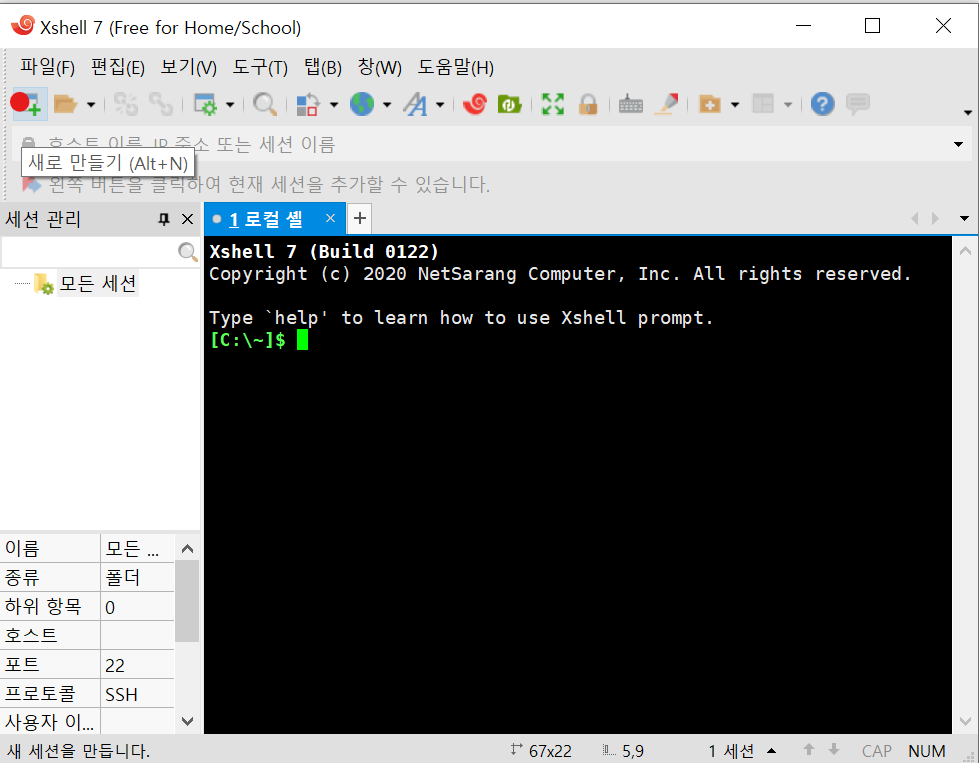
>
> 새로만들기 클릭
>
> 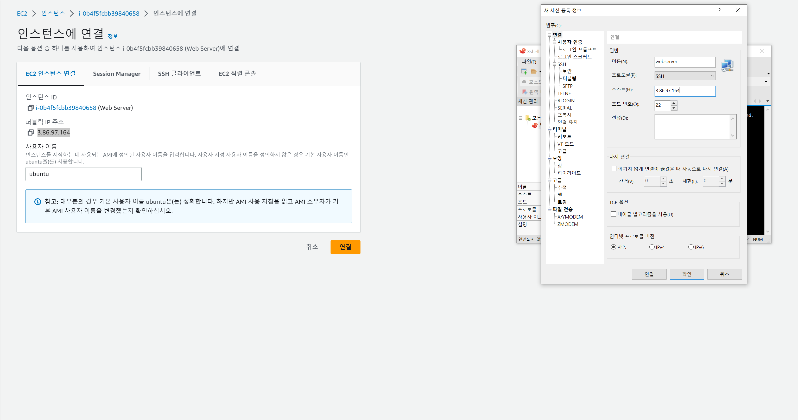
>
> 사용자 이름에는 EC2 Instance 연결 창과 같이 ubuntu 로 작성
>
> 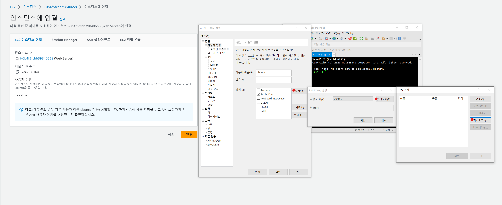
>
> 우리는 접속시 R***<u>SA Public key</u>*** 를 사용하므로 암호 방법을 ***<u>Public Key 로 수정</u>***한 후 ***<u>설정 => 찾아보기 => 가져오기</u>***를 눌러 
>
> 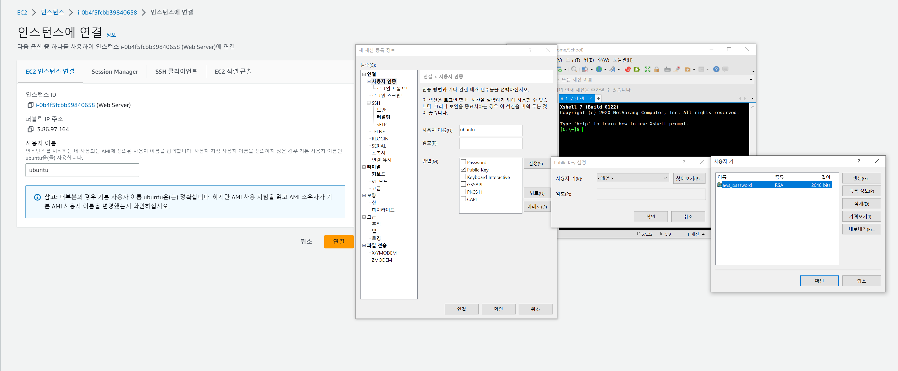
>
> Instance 생성시 다운 받은 aws_password.pem 파일로 설정한다. 
>
> 이후 확인을 누른다.
>
> 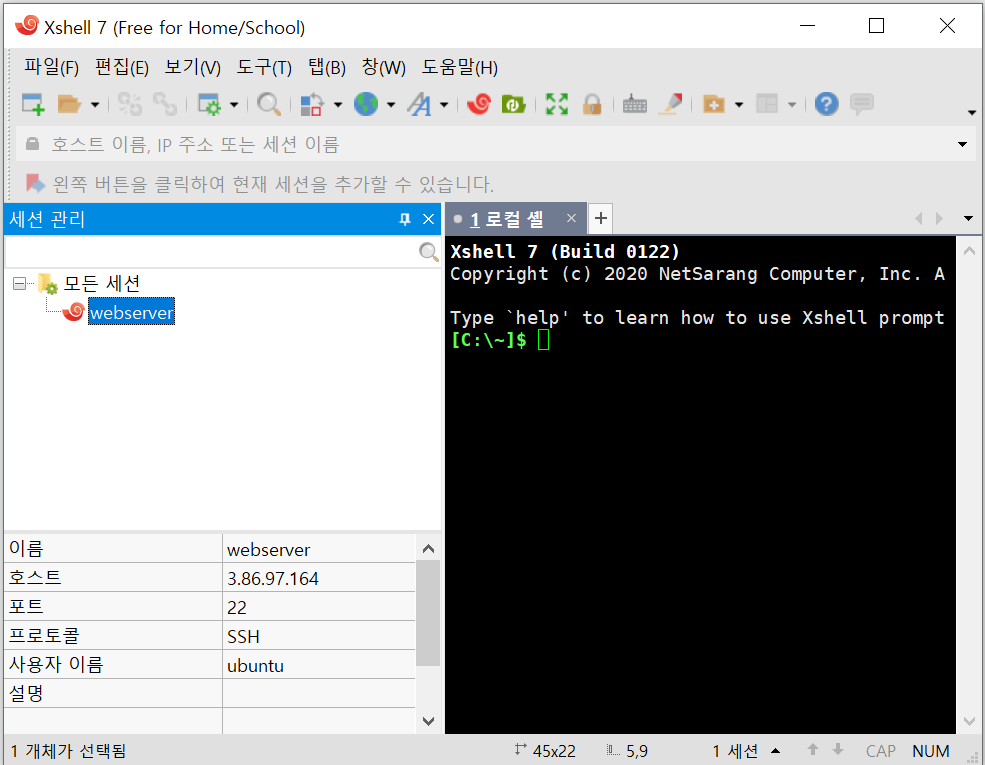
>
> 세션 관리 탭에 webserver 가 추가 된 것을 확인 후 더블클릭/연결 을 누르면 ***<u>SSH 보안 경고</u>*** 팝업창이 뜨고 여기서 수락 및 저장 버튼 클릭하게 되면 shell 탭에 접속되었다는 알림이 뜨게 된다.
>
> 이후에 shell tab 에 작성하는 명령어들은 가상 머신을 제어하는 명령어이다. 
>
> 이후 xshell 을 끄거나 `exit` 명령어를 사용시 연결을 끊을 수 있다. 
>
> 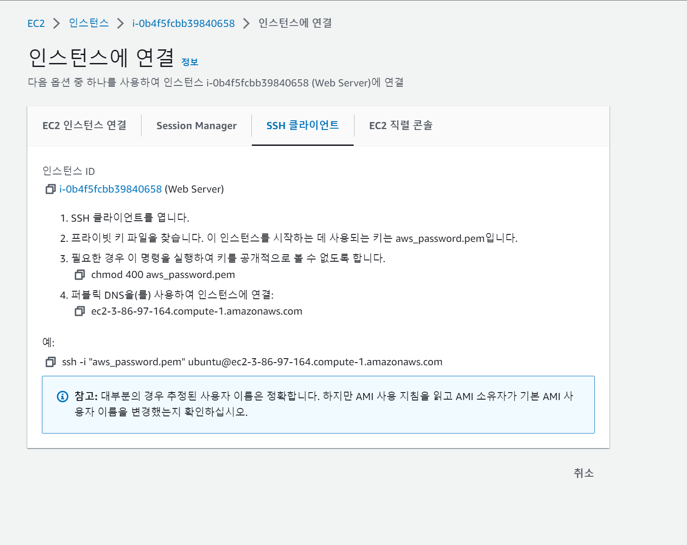
>
> chmod 의 경우 UNIX/LINUX 명령어로 파일의 보호 모드를 설정하는 명령어이다.
>
> 여기서 400 은 8진법으로 각 자리수는 user/group/other 에게 허용할 권한을 의미한다. 
>
> 이를 이진법으로 변환하면 
>
> * 4 => 100
> * 0 => 000
> * 0 => 000 
>
> 으로 이진법 순서대로 r(ead) 읽기 권한 w(rite) 쓰기 권한 x(excute) 실행 권한으로 
>
> 해석하면 RSA Public Key 파일인 `aws_password.pem` 파일을 user 에개만 읽기 권한만을 허용한다는 말이 된다.  
>
> > * #### SSH 란?
> >
> >   SSH는 Secure Shell의 줄임말로, 원격 호스트에 접속하기 위해 사용되는 보안 프로토콜
> >
> >   * Shell(쉘): 
> >
> >     명령어와 프로그램을 사용할 때 쓰는 인터페이스를 말한다. 
> >
> >     좀 더 자세하게 표현하자면 커널과 사용자 간의 다리 역할을 하는 것으로, 사용자로부터 명령을 받아 그것을 해석하고 실행하는 역할을 한다. 
> >
> >     검은 바탕에 흰 글자가 나오는 명령어 입력 환경을 생각하면 편하다.
> >
> >   기존 원격 접속은 ***<u>‘텔넷(Telnet)’</u>***이라는 방식을 사용했는데, 암호화를 제공하지 않기 때문에 보안상 취약하다는 단점이 있었다. 
> >
> >   실제로 WireShark같은 패킷 분석 프로그램을 이용하면 누구나 쉽게 원격 접속 과정에서 옮겨지는 비밀번호나 파일 내용 등의 데이터를 탈취할 수 있다. 
> >
> >   때문에 이를 암호화하는 SSH 기술이 등장했고, 현재 원격 접속 보안을 위한 필수적인 요소로 자리잡고 있다. 
> >
> >   그리고 클라우드 서비스에서 제공하는 서버는 기본적으로 원격 접속을 해서 접근하고 사용한다. 
> >
> >   그래서 NBP나 AWS와 같은 CSP(Cloud Service Provider, 클라우드 서비스를 제공하는 곳)에서 서버 생성시 필수적으로 SSH 보안 과정을 거치는 것입니다.
>
> 이후 Instance 를 우클릭 후 연결을 클릭한다.
>
> ### LINUX Instance 에서 Web Server 사용
>
> ubuntu에서는 `sudo apt-get install apache2` 명령어를 통해 apache 를 설치할 수 있다. 
>
> error 가 뜨는 경우 `sudo apt-get update` 를 통해 update 해준다. 
>
> 성공한 경우 apache 실행까지 해준다.
>
> 이후 퍼블릭 DNS 를 복사하여 접속해 보면 
>
> 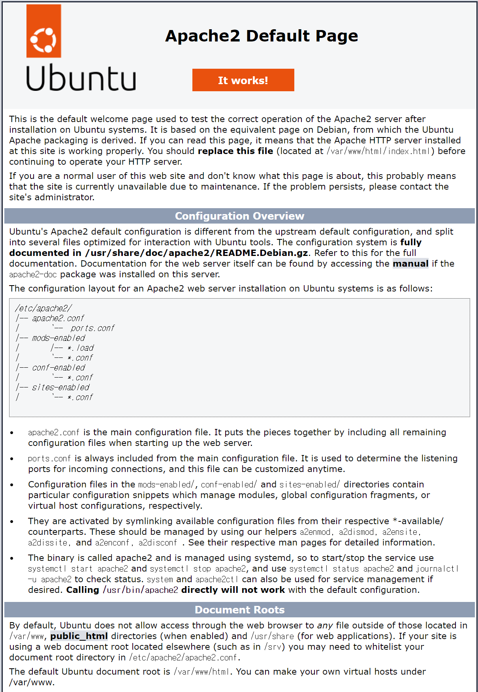
>
> 설치한 webserver 를 통해 웹페이지에 접속할 수 있게 된 것을 알 수 있다. 
>
> Document Roots 를 보면 `/var/www, public_html` 를 볼 수 있는데 
>
> 다시 xshell shell tab 에 `cd /var/www` 를 통해 해당 디렉토리로 이동하고 
>
> `ls -al` 명령어를 통해 해당 디렉토리 내 파일 목록을 살펴보면 
>
> 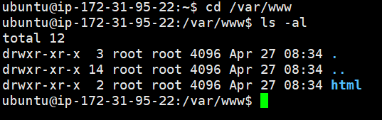
>
> html 폴더가 존재한다는 것을 알 수 있고
>
> `cd html` 과 `ls -al` 명령어를 통해 html 디렉토리 내의 파일을 살펴보면 
>
> 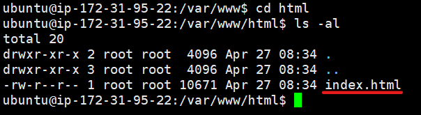
>
> index.html 파일이 존재하는 것을 확인할 수 있다. 
>
> 여기서 `sudo rm index.html` 명령어를 통해 index.html 파일을 삭제하면 
>
>  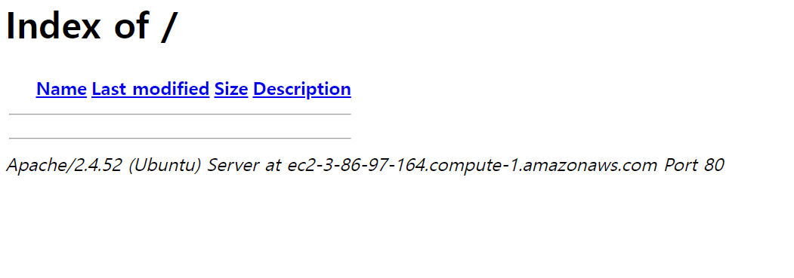
>
> 기존 public domain 으로 접속했던 페이지에서 에러가 나는 것을 볼 수 있다.  (idex.html 파일이 없기 때문)
>
> 다시 xshell 에서 `sudo nano index.html` 명령어를 통해 index.html 파일을 생성하고 
>
> 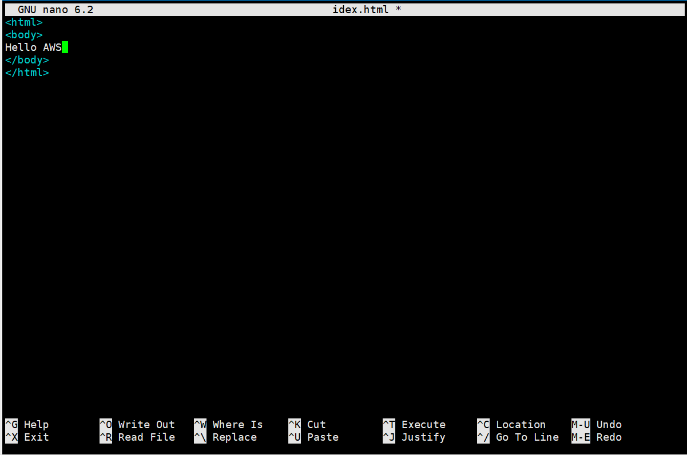
>
> ctrl + x 를 누르면 저장할지 여부를 묻고 y 를 누를 시 파일 명을 설정후 저장할 수 있다. 
>
> 이후 다시 퍼블릭 도메인으로 접속시 
>
> 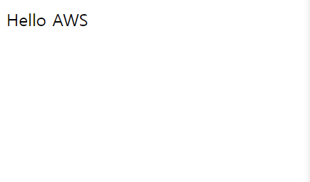
>
> 생성한 index.html 파일을 띄워주는 것을 볼 수 있다. 
>
> Instance 의 보안 탭의 보안 그룹을 확인하면 어떤 보안 설정이 적용 되어있는지 확인할 수 있다. 
>
> 여기서 80 포트가 없다면 웹 서버로 접속할 수 없게 된다. 
>
> ***<u>네트워크 및 보안 => 보안 그룹 => 보안 그룹이름 = web 인 row 클릭 => 인바운드 규칙 => 인바운드 규칙 편집</u>***  으로 들어가 http 를 삭제 하면 더이상 web server 로 접속이 불가능해진다. (80번 포트가 )

> ### Window Instance
>
> ubuntu 와 생성 과정은 동일하나 Security Group 에 SSH 대신 RDP 가 들어간다. 
>
> > * #### RDP 란?
> >
> >   원격 데스크톱 프로토콜(RDP)은 데스크톱 컴퓨터를 원격으로 사용하기 위한 프로토콜 또는 기술 표준
> >
> >   원격 데스크톱 소프트웨어는 RDP, 독립 컴퓨팅 아키텍처(ICA), 가상 네트워크 컴퓨팅(VNC) 등 여러 프로토콜을 사용할 수 있지만, 가장 일반적으로 사용되는 프로토콜은 RDP이다. 
> >
> >   RDP는 처음에 Microsoft에서 출시했으며 대부분의 Windows 운영 체제에서 사용할 수 있지만, Mac 운영 체제에서도 사용할 수 있다.
>
> 
>
> ### Window 에서 Window Instance 에 접속하는 방법
>
> Instance 를 우클릭하여 연결을 클릭 => RDP 클라이언트 탭으로 이동
>
> 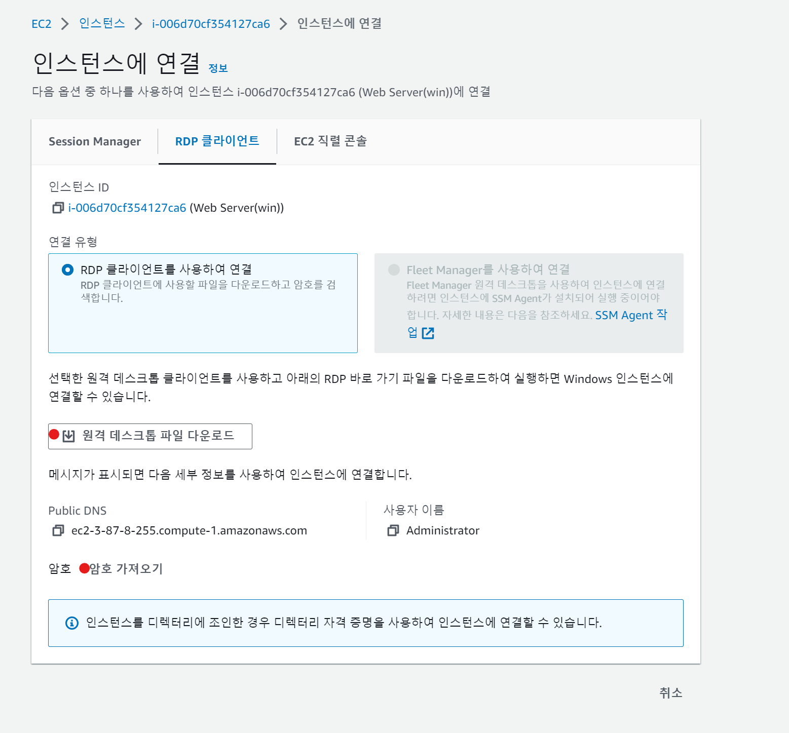
>
> 원격 데스크톱 파일 다운로드 버튼을 클릭하여 Remote Desktop file 을 다운 받는다. 
>
> 이 파일에는 원격 제어 하려고 하는 Instance 에 대한 여러 정보가 들어있으며 단순히 해당 파일을 여는 것 만으로 별도의 입력이 없이 바로 연결이 가능하다. 
>
> 이후 암호 가져오기 버튼을 클릭한다. 
>
> 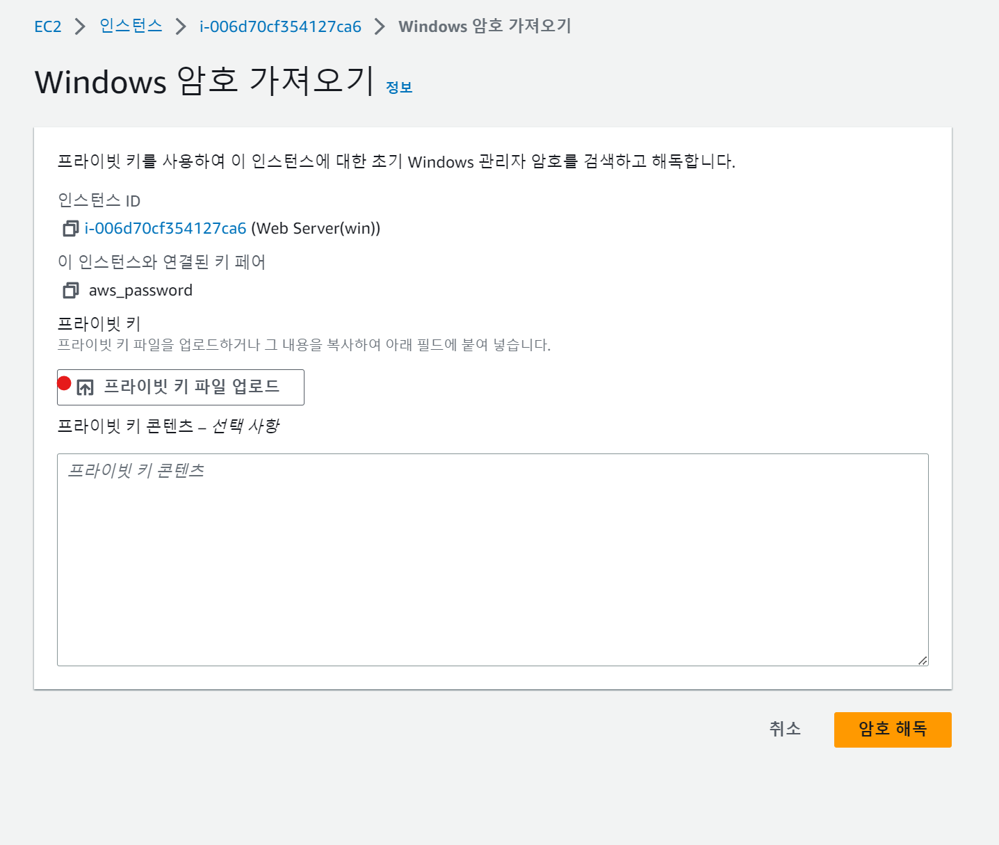
>
> 프라이빗 키 파일 업로드 버튼을 클릭하여 Instance 생성시 다운 받았던 aws_password.pem 을 업로드 한다. 
>
> 이후 암호 해독 버튼을 클릭하면
>
> 이전 창으로 돌아가며 해독된 암호가 암호 칸에 display 된다. 
>
> 이후 다운 받은 Remote Desktop 파일을 열어
>
> 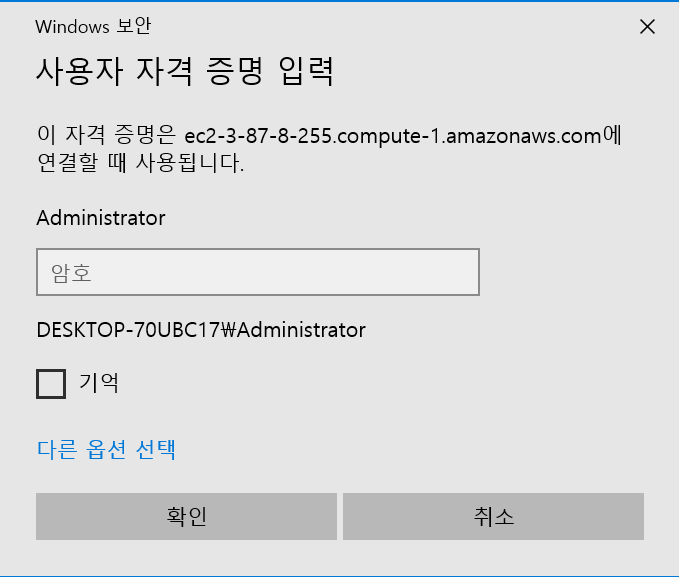
>
> 해독된 암호를 입력하면  
>
> 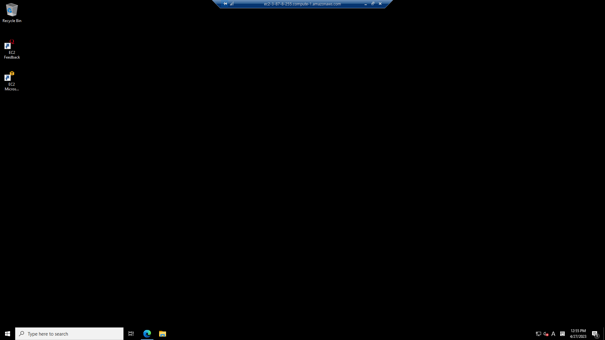
>
> 접속이 가능하다. 
>
> 해당 Instance 를 서버가 아닌 데스크톱 대용으로 사용하고 싶은 경우 
>
> Server Manager 에 들어가 Local Server 탭으로 들어가면 IE Enhanced Security Configuration 를 Off 로 바꿔서 사용하면 된다. 
>
> ### Web Server 사용
>
> Server Manager 에서 우측 상단에 있는 Manage => Add Roles and Features 를 클릭한다. 
>
> 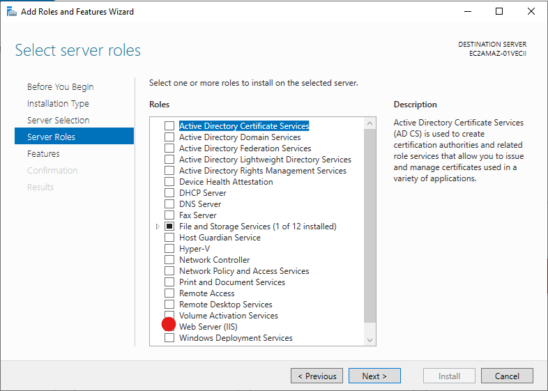
>
> IIS 를 클락하여 기능을 Install 한다. 
>
> 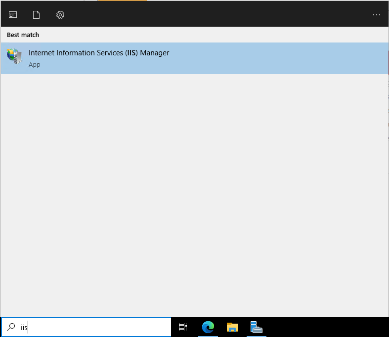
>
> IIS 를 검색하여 Internet Information Services (IIS) Manager 를 열어
>
> 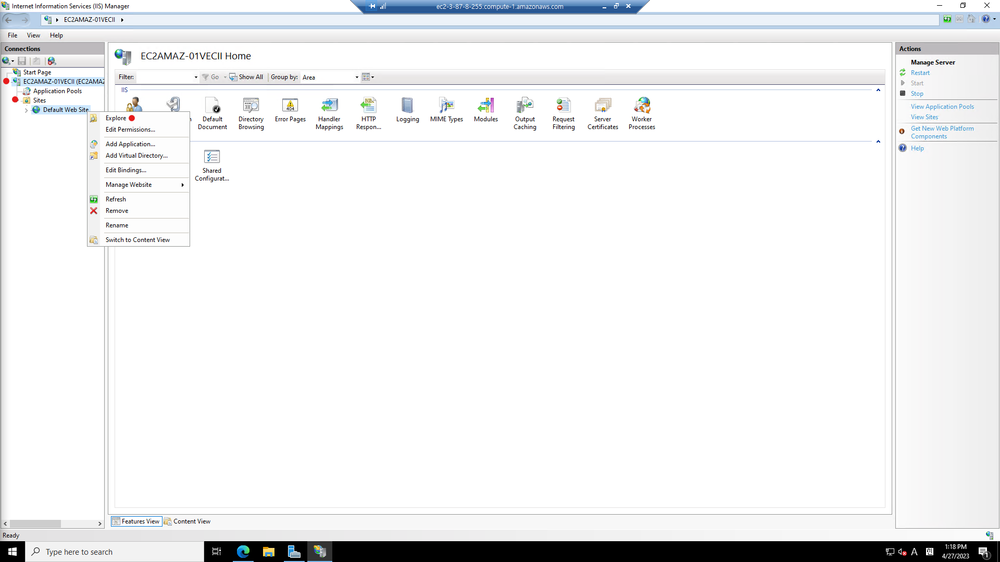
>
> Default Web Site 를 우클릭하여 나오는 Explore는 누군가 이 컴퓨터에 웹브라우저를 통해 접속했을 때 IIS  웹 서버가 받은 요청을 찾는 디렉토리이다. 
>
> 해당 디렉토리에 `Index.html`을 생성해 보면 
>
> 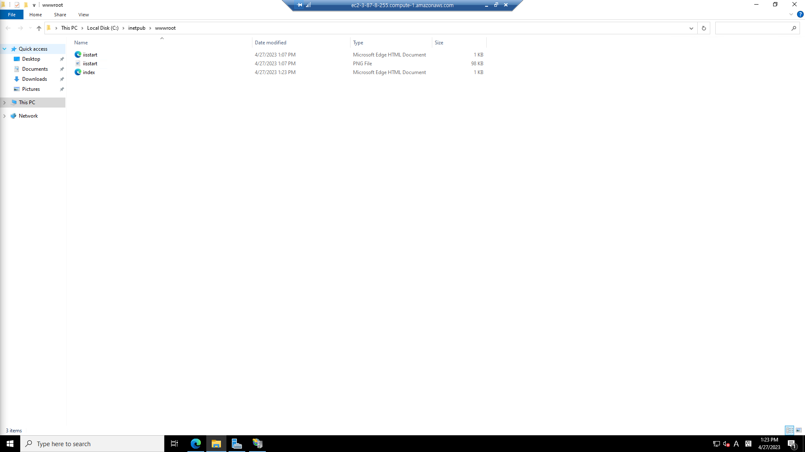
>
> Public DNS 주소로 접속해 보면
>
> 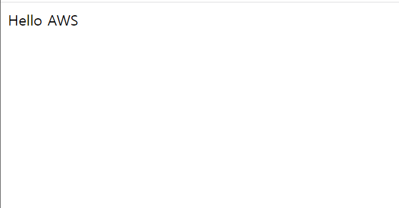
>
> 생성한 index.html 파일이 display 되는 것을 볼 수 있다. 

> ### AWS Marketplace (Wordpress 설치)
>
> Instance 생성시 Quckstart AMI 를 통해 OS 를 선택하는 것 또한 Amazon 에서 기본적으로 제공하는 AMI (Amazon Machine Image) 중 하나이다. 
>
> 해당 탭에서 My AMI 를 통해 자신이 만든 Instance 를 이미지화한 AMI 를 선택할 수 있다. 
>
> 또한 AWS Marketplace 에서 다른 사람이 만든 AMI 를 가져와 사용할 수 있다.  
>
> Region 을 지정후 EC2 Instance Type 을 지정한다.
>
> Instance Type 에 따라 가격이 다르다.  
