# UNIT 1. Introduction


# Lesson 1. Motivating CDS Views and Understanding the Background


# Lesson 2. WOrking with ABAP Development Tools (ADT)


* ## Eclipse 설치 및 ABAP 개발 환경 설정

  

  

  

  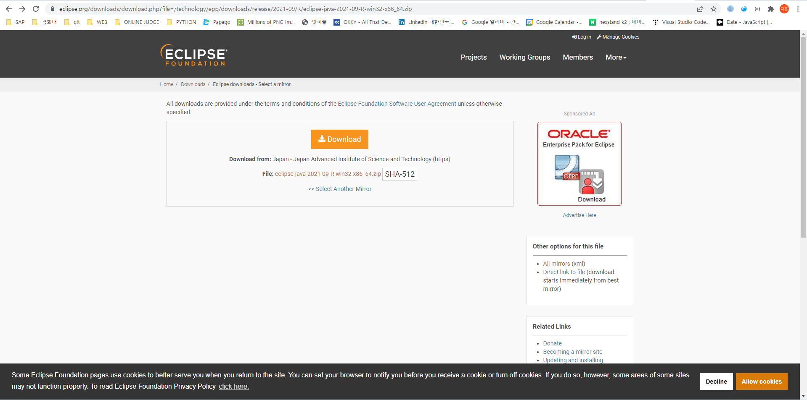

  

  

  

  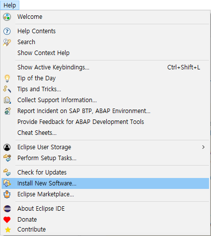

  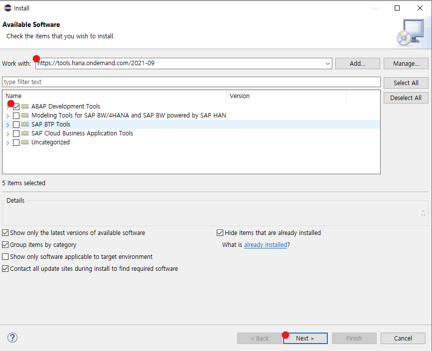

  

  

  

  

  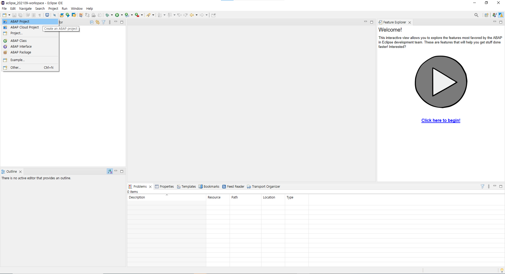

  

  

  

  

  
  
  
  
  
  
  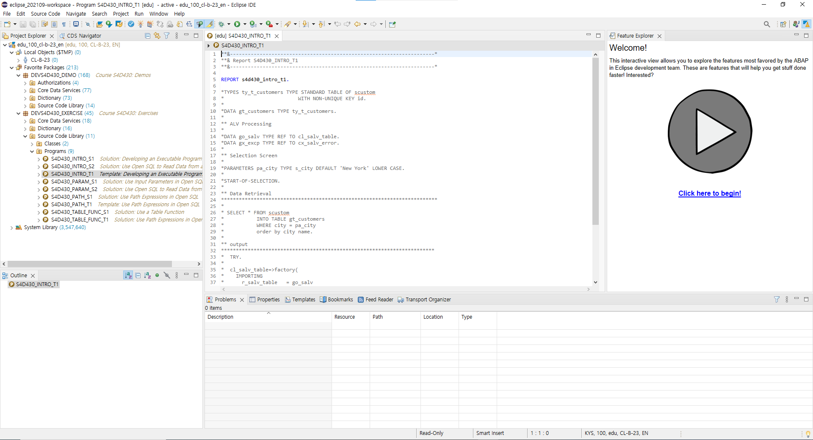
  
  
  
  
  
  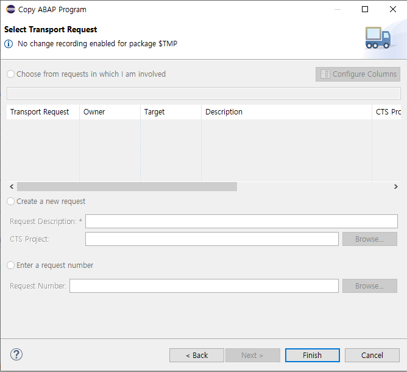
  
  
  
  
  
  
  
  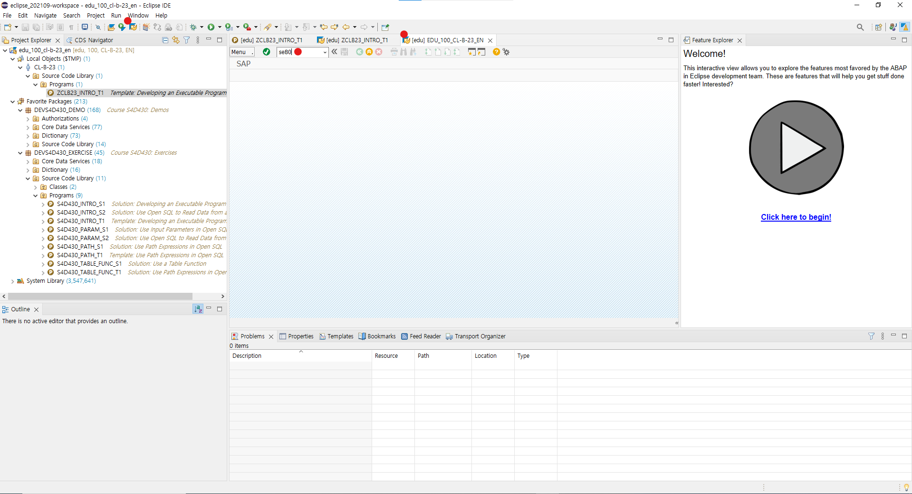
  
  
  
  
  
  
  
  
  
  
  
  
  
  
  


# Lesson 3. Analyzing and Using A CDS View 


Activate 시 두개의 View가 생성된다.

CDS View의 사용을 권장한다.


* ## SQL View

  Repository Object(Dictionary)

  Represents "real" database object

  Is an ABAP data type (structure, with client field)

  No additional semantics

  

* ## CDS VIew

  Not found in repository 

  Not known to database

  Is an ABAP data type (structure, without client field)

  Addtional semantics (Annotations)


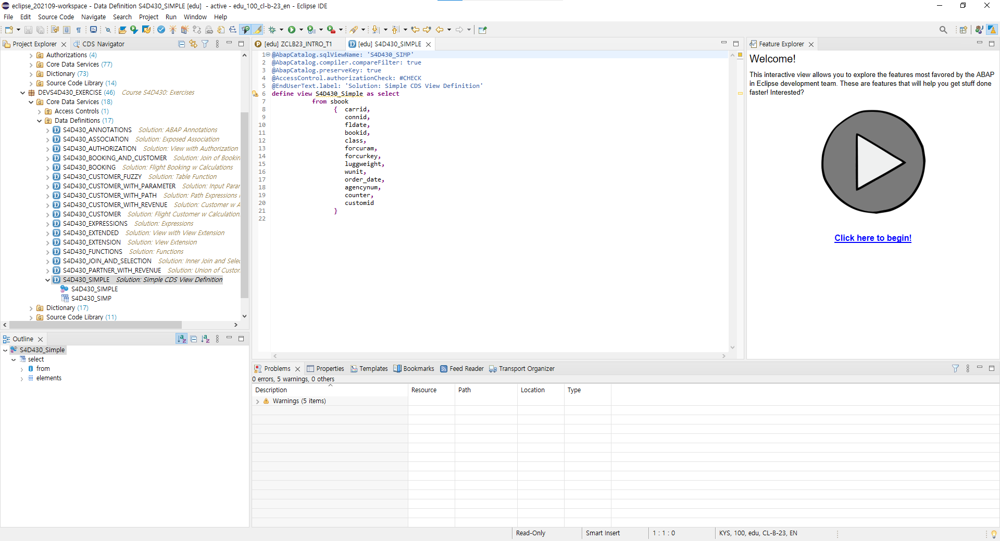


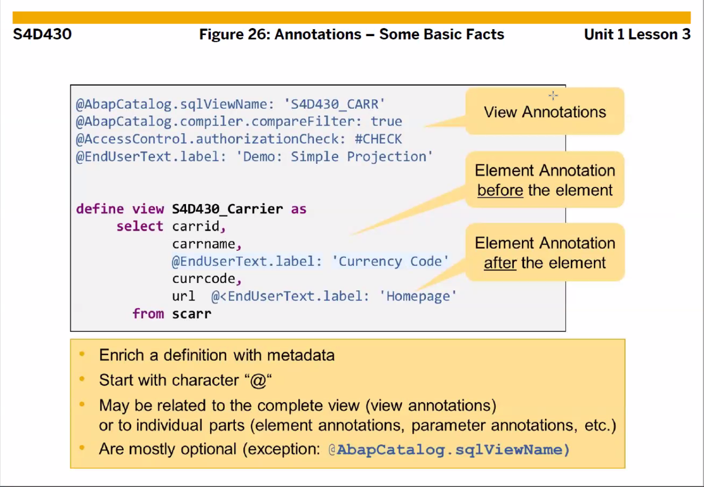


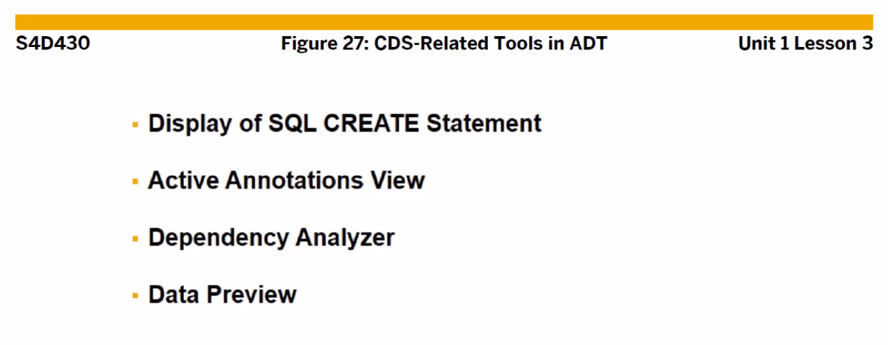

* ## Display of SQL CREATE Statement

  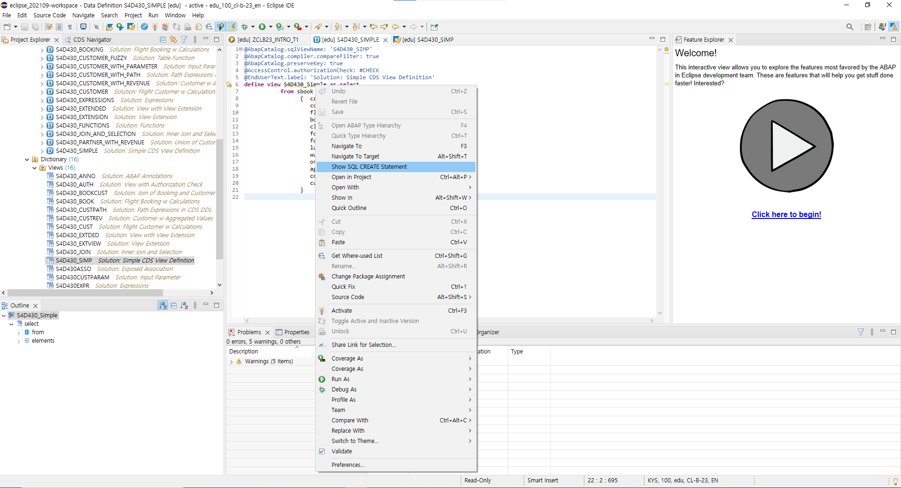

  


* ## Activate Annotation Views

  

  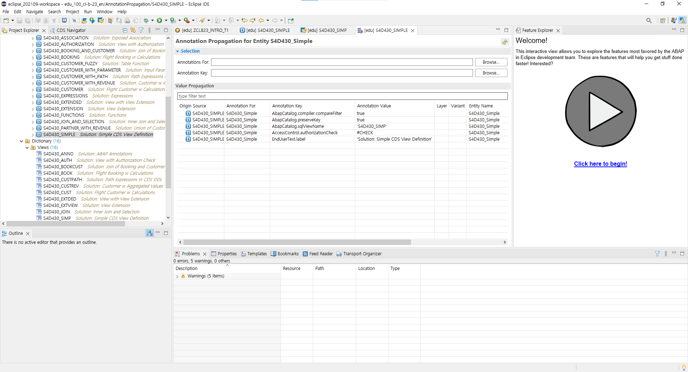


* ## Dependancy Analyzer

  

  


* ## Data Preview

  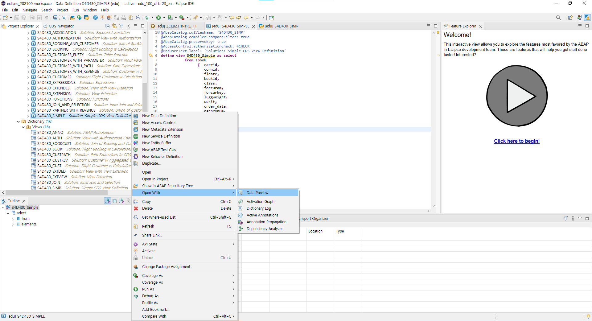

  

  Number of Entries 를 통해

  Select Columns 를 통해 display 할 Column들을 선택할 수 있으며

  Add Filter 를 통해 조회 조건을 걸어 줄 수 있다.


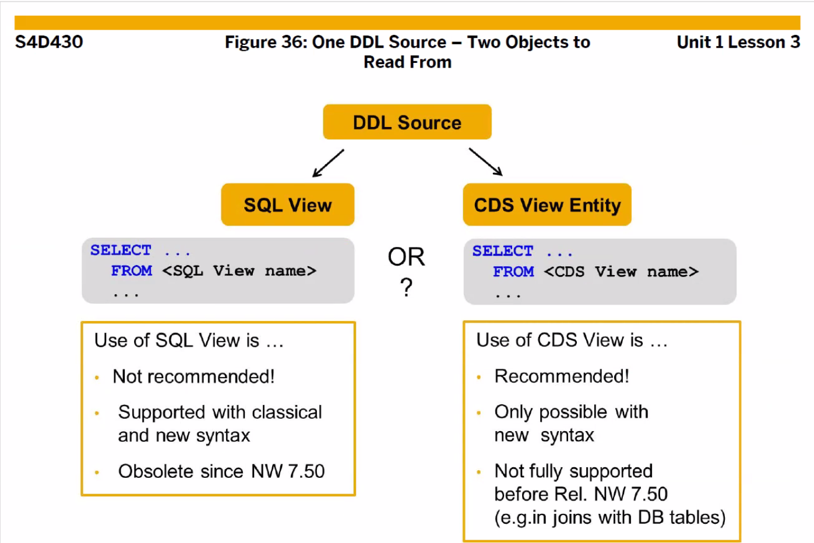


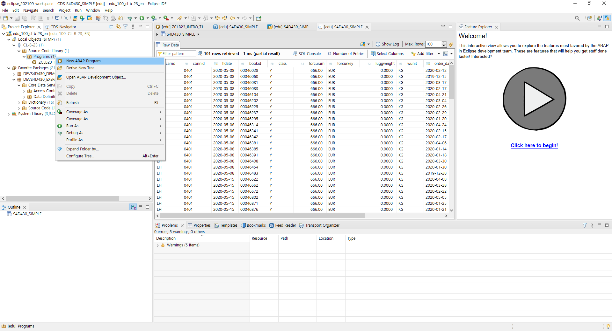

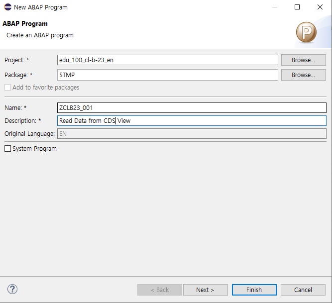


* ## Exercise 2

  

  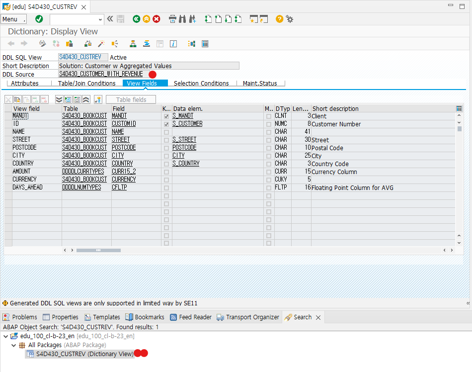

  

  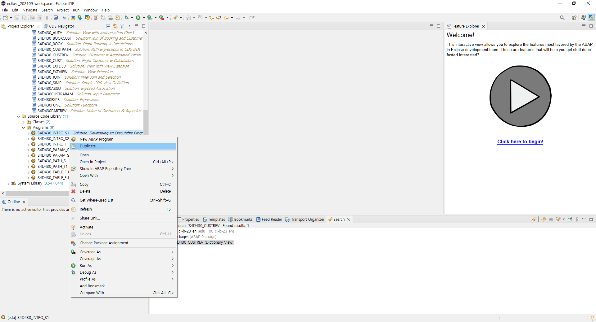

  ```ABAP
  *&---------------------------------------------------------------------*
  *& Report S4D430_INTRO_S1
  *&---------------------------------------------------------------------*
  
  REPORT s4d430_intro_S1.
  
  *TYPES ty_t_customers TYPE STANDARD TABLE OF scustom
  *                         WITH NON-UNIQUE KEY id.
  **OPTION1.
  
  *TYPES TY_Y_CUSTOMERS TYPE STANDARD TABLE OF S4D430_CUSTREV
  *                         WITH NON-UNIQUE KEY ID.
  **OPTION2.
  
  TYPES ty_t_customers TYPE STANDARD TABLE OF s4d430_customer_with_revenue
                           WITH NON-UNIQUE KEY id.
  *OPTION3.
  
  DATA gt_customers TYPE ty_t_customers.
  
  * ALV Processing
  
  DATA go_salv TYPE REF TO cl_salv_table.
  DATA gx_excp TYPE REF TO cx_salv_error.
  
  * Selection Screen
  
  PARAMETERS pa_city TYPE s_city DEFAULT 'New York' LOWER CASE.
  
  START-OF-SELECTION.
  
  * Data Retrieval
  ************************************************************************
  *
  * SELECT * FROM scustom
  *           INTO TABLE gt_customers
  *           WHERE city = pa_city
  *           ORDER BY city name.
  *
  ** OPTION1.
  ***********************************************************************
  *
  * SELECT * FROM S4D430_CUSTREV
  *           INTO TABLE gt_customers
  *           WHERE city = pa_city
  *           ORDER BY city name.
  *
  ** OPTION2.
  ***********************************************************************
  
   SELECT * FROM S4D430_CUSTOMER_WITH_REVENUE
             INTO TABLE @gt_customers
             WHERE city = @pa_city
             ORDER BY city, name.
  
  * OPTION3.
  ***********************************************************************
  
    TRY.
  
    cl_salv_table=>factory(
      IMPORTING
        r_salv_table   = go_salv
      CHANGING
        t_table        = gt_customers
    ).
  
  * Display
  *-------------------------*
  
    go_salv->display( ).
  
  CATCH cx_salv_error INTO gx_excp.    "
    MESSAGE gx_excp TYPE 'I'.
  ENDTRY.
  ```

  
