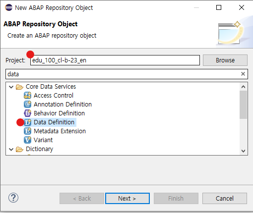
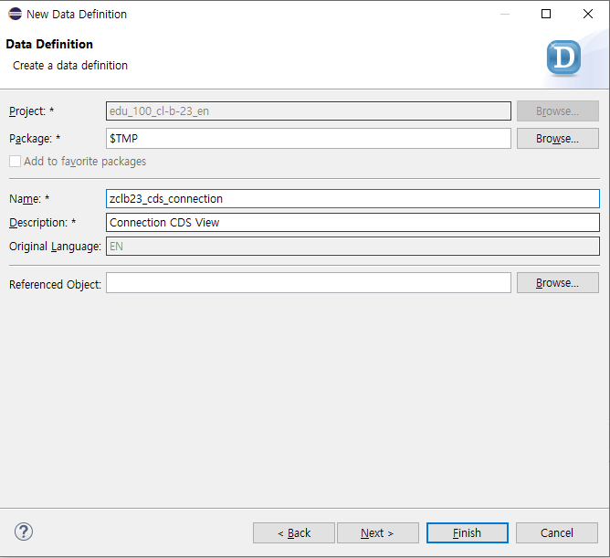
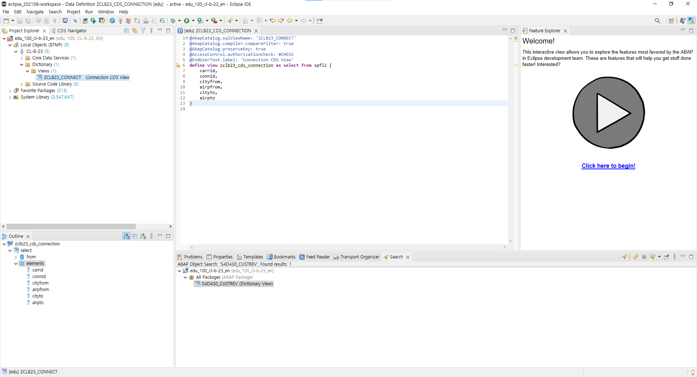
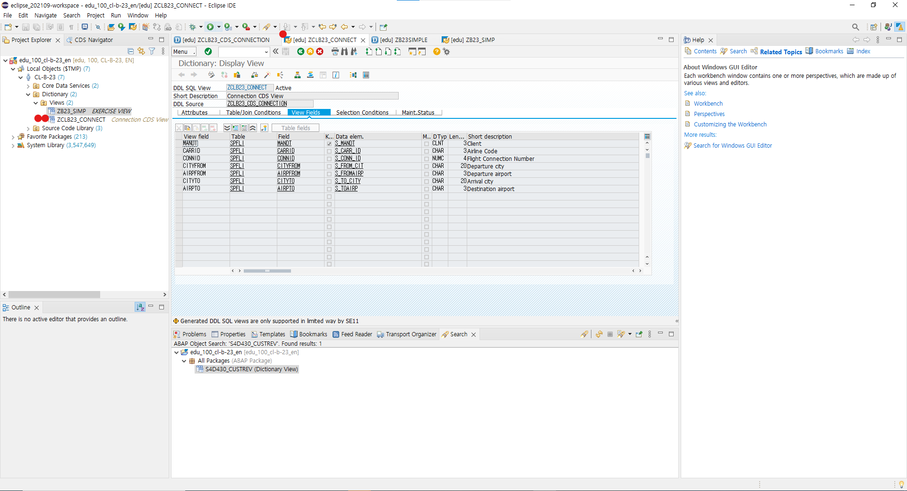
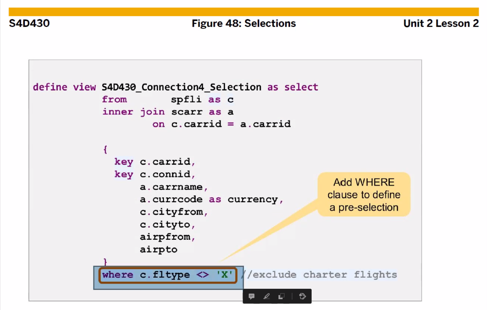
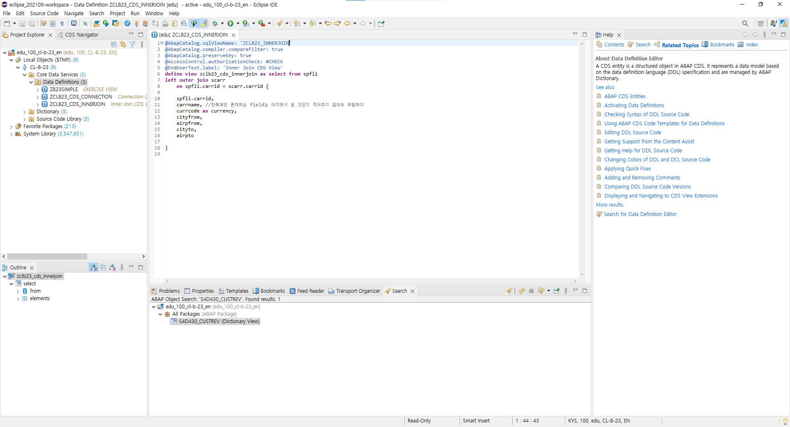
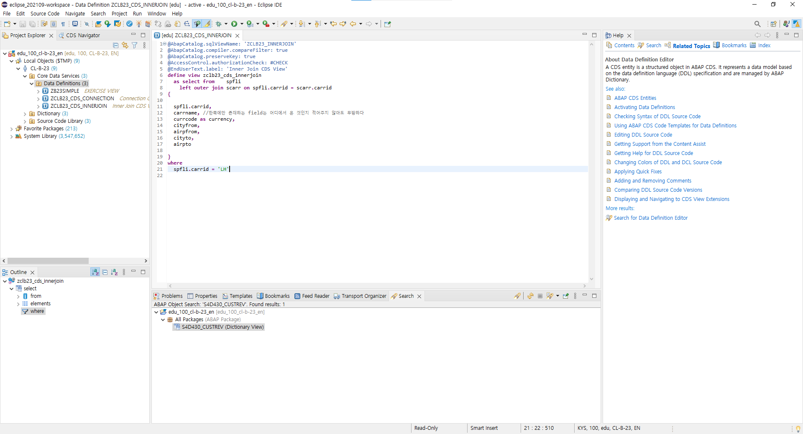
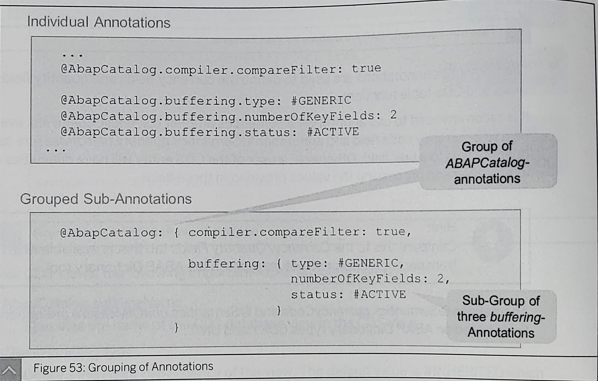
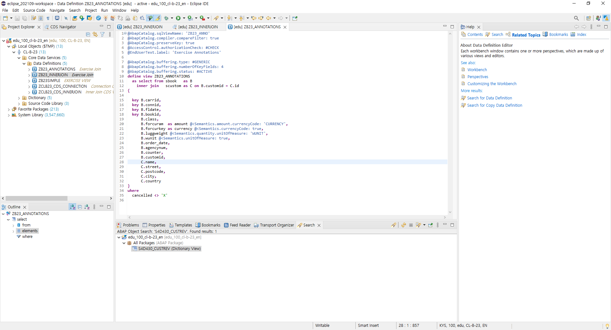

# UNIT 2. Basic SQL Features in CDS Views

# Lesson 1. Defining a Simple CDS View

* ## General DDL Syntax Rules

  

  

  

  

  

  

  

  

  

  

  

# Lesson 2. Creating a CDS View with Inner Join, Projection, and Selection

* ## Exercise 4. 

  

  

# Lesson 3. Using ABAP Annotations in CDS Views

View Annotaions 의 @AbapCatalog.sqlViewName 과

Extension Annotations 의 @AbapCatalog.sqlViewAppendName 은 필수이다.

* ## Exercise 5. 

  