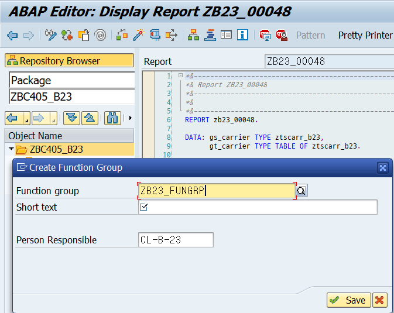

# Unit 3. SAP Locking


# Lesson 1. Creating Lock Objects and Lock Modules


* ## SAP Lock Concept - Logical Lock

  user가 데이터 수정을 위해 들어가는 경우 Lock Table을 조회 후 데이터 수정중이 아닌 경우 해당 유저가 수정한다는 내용을 Lock Table에 추가한다.


* ## Lock Objects and Lock Modules

  ### LOCK OBJECT

  ***ABAP DICTIONARY*** 에서 생성이 가능하며 이름은 ***EY / EZ*** 로 시작 되어야 한다.

  

  ### LOCK MODULES

  LOCK OBJECT 생성시 ENQUEUE\_<Lock_Object name> , DNQUEUE\_<Lock_Object name>  두개의 Module이 생성된다.

  ENQUEUE - For Setting Locks

  DEQUEUE - For Releasing Locks


Module을 선택하고 안경 모양의 display 버튼을 누를시 module의 내용을 볼 수 있다.


# Lesson 2. Setting and Releasing Locks


* ## SAP Locks

  ### Lock Actions

  * Set Lock
  * Promote Optimistic Lock
  * Check whether lock can be set or promoted


* ## Lock Actions - Possible Results

  * Lock set successfully or setting lock is possible
  * Lock could not be set or setting lock is not possible because
    * Collision with already existing locks ( Exception **"FOREIGN_LOCK"**)
    * Error in lock management (Exception **"SYSTEM_FAILURE"**)


* ## Set or Release Locks

  

  

  

  

* ## Lock Argument

  


* ## Use SM12 to Set and Manage the Lock Table

  

  

  

* ## Parameters in ENQUEUE Module

  | Parameter               | Value                                                        | Meaning                                                      |
  | ----------------------- | ------------------------------------------------------------ | ------------------------------------------------------------ |
  | **mode_<table_name>**   | 'S' / 'W' <br/><br/>'O' <br/><br/>'E' / 'V'<br/><br/>'X' / 'U'<br/><br/>'R' / 'C' |                                                              |
  | **x_\<lock parameter>** | space<br/><br/>'X'                                           |                                                              |
  | **_scope**              | '1'<br/><br/>'2' - \<Default><br/><br/>'3'                   | COUNTER 1에 설정<br/><br/>COUNTER 2에 설정<br/><br/>COUNTER 1 과 COUNTER 2에 설정 |
  | **_wait**               | space<br/>'X'                                                | <br/>에러를 통해 lock이 걸리지 않았을 시 다시 시도할 수 있도록한다. |
  | **_collect**            | space<br/><br/>'X'<br/>                                      | CONTAINER 사용하지 않음<br/><br/>바로 락을 걸지 않고 CONTAINER에 저장한 후  FUNCTION MODULE <br/>***FLUSH_ENQUEUE*** 를 호출해 LOCK TABLE에 저장 |

  


# Lesson 3. Working with the Different Lock Modes


* ## Lock Mode

  | Lock Mode                       | Meaning                                                      |
  | ------------------------------- | ------------------------------------------------------------ |
  | **S (Shared)**                  | Display lock <br/>같은 프로그램 안에서는 추가로 lock 설정이 가능하다. |
  | **O (Optimistic)**              | 기본적으로 Display lock 이며 Change lock으로 변경 가능하다.<br/>같은 프로그램 안에서는 추가로 lock 설정이 가능하다. |
  | **E (Exclusive cumulative)**    | Change lock<br/>같은 프로그램 안에서는 추가로 lock 설정이 가능하다. |
  | **X (eXclusive noncumulative)** | Change lock<br/>같은 프로그램 안에서도 추가로 lock을 중첩할 수 없다. |

  





#### ZB23_LOCK1 - SOURCE CODE

```ABAP
FUNCTION zb23_lock1.
*"----------------------------------------------------------------------
*"*"Local Interface:
*"  IMPORTING
*"     REFERENCE(IV_LOCK1) TYPE  CHAR1
*"     REFERENCE(IV_LOCK2) TYPE  CHAR1
*"----------------------------------------------------------------------
  CALL FUNCTION 'ENQUEUE_EZ_FLIGHT_B23'
    EXPORTING
      mode_ztsflight_b23 = iv_lock1
      mandt              = sy-mandt
      carrid             = 'AA'
      connid             = '0017'
      fldate             = '20200506'
*     X_CARRID           = ' '
*     X_CONNID           = ' '
*     X_FLDATE           = ' '
*     _SCOPE             = '2'
*     _WAIT              = ' '
*     _COLLECT           = ' '
    EXCEPTIONS
      foreign_lock       = 1
      system_failure     = 2
      OTHERS             = 3.

  CASE SY-SUBRC.
    WHEN 0.
      MESSAGE 'LOCK1 IS SET' TYPE 'S'.
    WHEN 1.
      MESSAGE 'LOCK1 NOT SET' TYPE 'E'.
    WHEN 2.
      MESSAGE 'LOCK1 NOT SET' TYPE 'E'.
  ENDCASE.


  CALL FUNCTION 'ENQUEUE_EZ_FLIGHT_B23'
    EXPORTING
      mode_ztsflight_b23 = iv_lock2
      mandt              = sy-mandt
      carrid             = 'AA'
      connid             = '0017'
      fldate             = '20200506'
*     X_CARRID           = ' '
*     X_CONNID           = ' '
*     X_FLDATE           = ' '
*     _SCOPE             = '2'
*     _WAIT              = ' '
*     _COLLECT           = ' '
    EXCEPTIONS
      foreign_lock       = 1
      system_failure     = 2
      OTHERS             = 3.

  CASE SY-SUBRC.
    WHEN 0.
      MESSAGE 'LOCK2 IS SET' TYPE 'S'.
    WHEN 1.
      MESSAGE 'LOCK2 NOT SET' TYPE 'E'.
    WHEN 2.
      MESSAGE 'LOCK2 NOT SET' TYPE 'E'.
  ENDCASE.


ENDFUNCTION.
```


SO는 다른 프로그램에서도 SO 설정 가능


* ## Pessimistic Locking Pattern

  ### Setting and Releasing Locks

  #### E LOCK

  lock 설정 -> read -> change -> release

  ### Setting, Promoting and Releasing Locks

  #### O LOCK

  lock 설정 -> read -> R  lock -> change -> release

  ### Possible Conflict in Phase 2

  


LOCK 설정,  EXCEPTION 중요 

