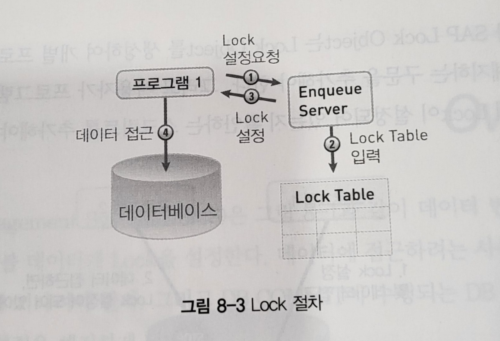

## 1. ABAP Dictionary에서 생성할 수 있는 Database Object는 ?

**Database table (transparent table)**

**View**

* DATABASE VIEW
* PROJECTION VIEW
* MAINTENANCE VIEW
* HELP VIEW


Data Type

* Single Value
* Structure Type
* Table Type

Domain

Search Help

Lock Object


****

****


## 2. 모듈화의 장점이 아닌 것은?

### 모듈화의 장점

* #### Reusablility 재사용성이 좋다.

* #### Readibility 가독성이 좋다.

* #### Maintenance 유지 보수가 용이하다.


****

****


## 3. 다음중 Lock Module을 설정할 수 없을 때 어떤 예외(Exception)가 발생할 수 있는가?

3-3

* ## Lock Actions - Possible Results

  * Lock set successfully or setting lock is possible
  * Lock could not be set or setting lock is not possible because
    * *<u>Collision with already existing locks ( Exception **"FOREIGN_LOCK"**)</u>*
    * *<u>Error in lock management (Exception **"SYSTEM_FAILURE"**)</u>*

FOREIGN_LOCK EXCEPTION : 컨테이너 안에 있는 수행해야 할 LOCK들 중에 하나라도 셋팅이 되지 않았을 때
SYSTEM_FAILURE : 시스템 자체에서 문제가 발생할 때


****

****


## 4. 다음중 정의된 Data Type 중 문자 유형(Character type)이 아닌것은?

#### c, n, d, t, string


#### Predefined Elementary ABAP Types with Fixed Length

| Data Type        | Initial Field Length | Valid Field Length | Initial Value | Meaning                                 |
| ---------------- | -------------------- | ------------------ | ------------- | --------------------------------------- |
| Numeric Types    |                      |                    |               |                                         |
| I                | 4                    | 4                  | 0             | Integer (whole number)                  |
| F                | 8                    | 8                  | 0             | Floating point number                   |
| P                | 8                    | 1-16               | 0             | Packed number                           |
| Character types  |                      |                    |               |                                         |
| C                | 1                    | 1 - 65535          | ' … '         | Text Field (alphanumeric characters)    |
| D                | 8                    | 8                  | '00000000'    | Date field (Format: YYYYMMDD)           |
| N                | 1                    | 1 - 65535          | '0 … 0'       | Numeric text field (numeric characters) |
| T                | 6                    | 6                  | '000000'      | Time field (format: HHMMSS)             |
| Hexadecimal type |                      |                    |               |                                         |
| X                | 1                    | 1 - 65535          | X'0 … 0'      | Hexadecimal field                       |

### sap 공식 문서 참조


****

****


## 5. 다음 중 fixed value가 저장되는 것은?

### <u>질문</u> fixed value를 저장하는 곳을 말하는 것인가?

=> Domain => Value Range => Single Vals => Fix.Val.

f4 help 를 통해 확인 가능하다.


****

****


## 6. 다음 중 ABAP Dictionary에서 생성할 수 없는 것은?

Database table (transparent table)

View

Data Type

* Single Value
* Structure Type
* Table Type

type group

Domain

Search Help

Lock Object

를 생성가능


****

****


## 7. 다음 중 화면(Screen)을 포함할 수 있는 프로그램 Type 아닌 것은?

| Program Type | Long                                | Dynpro |
| ------------ | ----------------------------------- | :----: |
| Type 1       | Executable Program                  |   O    |
| Type M       | Module Pool                         |   O    |
| Type F       | Function group                      |   O    |
| Type I       | Include Program                     |   X    |
| Type S       | Subroutine Pool                     |   X    |
| Type J       | Interface Pool                      |   X    |
| Type K       | Class Pool                          |   X    |
| Type T       | Type Pool                           |   X    |
| Type X       | Transformation (XSLT or ST Program) |   X    |
| Type Q       | Database Procedure Proxy            |   X    |


****

****


## 8. 다음 중 Lock Object 생성에 대해 옳은 것은?

***ABAP DICTIONARY*** 에서 생성이 가능하다.

이름의 시작은 EZ / EY 로 시작되어야 한다.

LOCK OBJECT 생성시  ENQUEUE\_<Lock_Object name> , DNQUEUE\_<Lock_Object name> 이름의  두개의 Module이 생성된다.

* ENQUEUE

  FOR SETTING LOCKS

* DEQUEUE

  FOR RELEASING LOCKS

[ABAP.8.Lock Object : 네이버 블로그 (naver.com)](https://blog.naver.com/vians_lynn/222103638382)


****

****


## 9. 다음 중 다형성(polymorphism)을 사용하기 위한 전제 조건은? 

부모 class 의 component를 상속 받아 확장 또는 redefine 하고 

Up-Cast 를 사용하는 Generic Access를 사용한 경우 


****

****


# 10. *<u>다음 중 Enqueue work process의 내용으로 옳은 것은?</u>* 

* #### Lock management EWP

  * 공유 메모리의 잠금테이블을 관리
    * 여러 유저에 의해 사용되다 보니 여러 유저에 의해 데이터가 동시에 수정되는 상황이 발생
    * 따라서 특정 유저가 데이터를 수정중일때 다른 유저가 수정할 수 없게 설정을 해준다.
    * ABAP 런타임 환경에서의 논리적 데이터베이스 잠금이 기록된다.
  * 이것이  **인큐 워크 프로세스**이다.
  * **SAP 시스템마다 하나만 필요**
    * 각각의 서버 마다 있으면 문제 발생

-   SM50에서는 확인불가
-   Lock 관련 모든 업무는 위 Process를 통해 처리
-   같은 데이터를 동시에 처리하고자 할 때, Enqueue work process 수행
-   Enqueue는 instance당 한 개만 존재

Lock 설정 순서
(1) Requests Lock : 프로그램에서 데이터에 대한 Lock을 요청한다. 잠긴(Locked) 상태의 테이블 데이터 레코드는 논리적인 조건(logical condition)에 의해 관리된다.
(2) Endter Lock : Lock 데이터의 조건이 Lock Table에 입력된다.
(3) Set Lock : 프로그램 요청에 의해 Lock이 설정된다. Lock 상태는 프로그램이 Unlock을 수행하거나 프로그램이 종료되는 시점까지 유지된다. 모든 Lock은 프로그램에 의해 설정되므로 해당 프로그램에서 해지해야 한다. 데이터가 잠긴 상태에서 다른 프로그램에서 데이터에 접근하면 이 요청은 Lock Table에 저장된다. 작업하고자 하는 데이터를 정확하게 설정하기 위해, Lock Object는 테이블의 Key 필드로 구분될 수 있도록 설정하는 것이 바람직하다.
(4) Access Data : lock을 설정한 프로그램에서만 해당 데이터에 접근하여 작업할 수 있다.


****

****


# 11. <u>*ABAP dictionary에서 데이터베이스 View A와 maintenance view B를 생성했다.*</u> 

2-3-8 참조

### DATABASE VIEW

INNER JOIN

select from 가능

MAINT. STATUS 탭의 ACCESS 를 통해 READ ONLY 와 READ AND CHANGE를 설정 할 수 있다.

### MAINTENANCE VIEW

OUTER JOIN

crud 처리를 위해

DATABASE VIEW 와 달리 조인 조건을 직접 입력할 수 없다. => FOREIGN KEY로부터 파생

VIEW의 데이터를 조회, 변경, 생성 할 수 있는 모든 


https://m.blog.naver.com/PostView.naver?isHttpsRedirect=true&blogId=smkim1541&logNo=220902981184


****

****


## 12. 다음 중 static constructor를 생성할 때 따라야 하는 규칙으로 옳지 않은 것은? 

해당 CLASS 또는 SUBCLASS 에 처음 ACCESS 할 때 자동으로 실행된다.

* CREATE OBJECT 가 실행될때
* STATIC ATTRIBUTE 에 ACCESS 할때
* STATIC METHOD 를 호출할때
* EVENT HANDLER METHOD 가 등록될 때

SUPERCLASS 와 SUBCLASS 모두 STATIC CONSTRUCTOR 가 존재하는 경우 SUBCLASS에 처음으로 ACCESS 하는 경우 

SUPERCLASS 의 STATIC CONSTRUCTOR => SUBCLASS 의 STATIC CONSTRUCTOR  순으로 실행된다.  

* ##### 이후 SUPERCLASS와 SUBCLASS 모두에 INSTANCE CONSTRUCTOR가 존재하는 경우 

  *  SUBCLASS 의 INSTANCE CONSTRUCTOR가 실행되어 

  * 내부에서 SUPERCLASS 의 INSTANCE CONSTRUCTOR 를 호출하여 실행되고 

  * 다시 SUBCLASS 의 INSTANCE CONSTRUCTOR 순으로 실행된다. 

    

#### **파라미터나 EXCEPTION을 가질 수 없다.**

#### **CLASS 당 단 하나만 존재 할 수 있다.**

#### **SUPERCLASS 에 STATIC CONSTRUCTOR  가 존재하더라도 SUBCLASS는 자신만의 STATIC CONSTRUCTOR를 가질 수 있다.**


   a.  각 클래스에는 정적 생성자가 하나만 있어야 한다
   b.  정적 생성자는 공용 영역에 정의해야 한다
   c.  정적 생성자는 어떤 매개변수나 예외를 갖지 않는다
 정적생성자는 명시적으로 호출할 수 없다. 


****

****


## 13. 다음 중 Process After Input(PAI) 처리 블록에서 수행할 수 있는 것은? 

선택 화면이 표시된 직후 처리된다.

사용자가 ENTER 등을 선택할때 마다 여러번 처리 될 수 있다. 


USER_COMMAND    EXIT  

INPUT CHECK , FIELD HELP INPUT HELP 등


- 화면출력 후 사용자 입력에 의해 수행하는 로직 ( EXIT(USER) Command, Button, INPUT CHECK )


****

****


# 14. *<u>다은 중 어떤 modularization unit에서 parameter를 사용할 수 없는 것은?</u>* 

modularization unit이 서브루틴 / 펑션모듈 / 클래스 / BAPI를 뜻한다면
BAPI에는 예외 파라미터가 존재하지 않는다.


****

****


## 15. ABAP Program에서 CL_GUI_CUSTOM_CONTAINER 클래스의 인스턴스(Object)를 생성하는 ABAP 구문은? 

```ABAP
DATA: go_cont TYPE REF TO cl_gui_custom_container.

CREATE OBJECT go_cont
  EXPORTING
    container_name              = 'AREA'
  EXCEPTIONS
    cntl_error                  = 1
    cntl_system_error           = 2
    create_error                = 3
    lifetime_error              = 4
    lifetime_dynpro_dynpro_link = 5
    OTHERS                      = 6.
IF sy-subrc <> 0.
*     MESSAGE ID SY-MSGID TYPE SY-MSGTY NUMBER SY-MSGNO
*     WITH SY-MSGV1 SY-MSGV2 SY-MSGV3 SY-MSGV4.
ENDIF.
```

```ABAP
GO_RENTAL = NEW #( IM_NAME = 'DRIVE & SMILE' ).
```


****

****


## 16. 다음 중 데이터 Type 중 deep 데이터 type은? 

***DEEP STRUCTURE 관련 내용으로 추정***

필드중에 한개 이상이 INTERNAL TABLE로 이루어진 STRUCTURE

#### Ex )

```ABAP
TYPES: BEGIN OF ts_data.
         INCLUDE  TYPE zteval_b00.
TYPES:   excep      TYPE char1,
         line       TYPE char4,
         cell       TYPE lvc_t_scol,     ****************
         name       TYPE scustom-name,
         carrname   TYPE scarr-carrname,
         dcusttype  TYPE char30,
         order_date TYPE sbook-order_date,
         loccuram   TYPE sbook-loccuram,
         loccurkey  TYPE sbook-loccurkey,
         avg_num    TYPE p LENGTH 3 DECIMALS 2,
         comment    TYPE icon-id,
         cancelled  TYPE sbook-cancelled,
         custtype   TYPE sbook-custtype.
TYPES: END OF ts_data.
```

ALV 를 만들기 위해 생성한 LOCAL STRUCTURE TYPE


****

****


## 17. 다음 중 INNER JOIN으로 구현된 ABAP Dictionary View은? 

DATABASE VIEW 는 오직 INNER JOIN만 가능하다.


SEARCH HELP VIEW 는 LEFT OUTER JOIN을 지원한다.

MAINTENANCE VIEW  OUTER JOIN


****

****


## 18. 다음은 ABAP Open SQL 구문입니다. 

```ABAP
SELECT SINGLE carrid connid cityfrom cityto 
  From spfli 
  INTO gs_spfli 
 WHERE carrid = pa_car 
   AND connid = pa_con 
```

## SELECT 구문의 필드 목록에 있는 필드는 대상 gs_spfli에 어떻게 처리 하나요? 


## 보기 필요


****

****


# 19.*<u>다음 중 Runtime System이 ABAP 메모리를 초기화하는 것은?</u>* 

FREE MEMORY ID 'ABC'. ???

leave to transaction


****

****


## 20. 다음 중 fixed value을 설정할 수 있는 것은? 

### <u>질문</u> fixed value를 저장하는 곳을 말하는 것인가?

=> Domain => Value Range => Single Vals => Fix.Val.

f4 help 를 통해 확인 가능하다.


### **<u>질문</u>**5번이랑 차이가 뭐지?


****

****


# <u>*21. 다음은 Screen Program의 PAI flow logic 이다.*</u> 

```ABAP
PROCESS AFTER INPUT 
  FIELD A MODULE check_A 
  FIELD A MODULE check_B
  CHAIN. 
    FIELD:C,D MODULE check_CD 
  ENDCHAIN 
  CHAIN. 
  FIELD:C,B. MODULE check_CB 
  ENDCHAIN 
```

## 프로그램 실행 시 check_CB 모듈 처리 중에 메시지 Type E 메시지를 보내면 어떻게 되나요? 

### 예제 )

```ABAP
PROCESS AFTER INPUT.
  MODULE exit AT EXIT-COMMAND.
  FIELD sdyn_conn-carrid.
  MODULE check_input.

  CALL SUBSCREEN sub.
  CHAIN.
    FIELD: sdyn_conn-carrid, "해당 필드들에 입력값이 입력되면 check_sflight
           sdyn_conn-connid, "모듈을 실행해 있는 데이터인지 체크후 없는 경우
           sdyn_conn-fldate. "에러 메시지를 띄운다.
    MODULE check_sflight ON CHAIN-REQUEST.
  ENDCHAIN.
```

```ABAP
*&---------------------------------------------------------------------*
*&      Module  CHECK_SFLIGHT  INPUT
*&---------------------------------------------------------------------*
*       text
*----------------------------------------------------------------------*
MODULE check_sflight INPUT.
  SELECT SINGLE *
    FROM sflight
    INTO CORRESPONDING FIELDS OF wa_sflight
    WHERE carrid = sdyn_conn-carrid AND
          connid = sdyn_conn-connid AND
          fldate = sdyn_conn-fldate.
  CHECK sy-subrc <> 0.
  CLEAR wa_sflight.
  MESSAGE e007(bc410).
```

보기 필요

back으로 나가는게 막히고 exit cancel로 종료 가능하며

error message가 뜬다.


****

****


## 22. 다음 중 ABAP 프로그램에서 로컬 클래스를 정의할 때 구문 순서가 옳은 것은? 


```ABAP
CLASS lcl_airplane DEFINITION.
  PUBLIC SECTION.

  PROTECTED SECTION.

  PRIVATE SECTION.

ENDCLASS.


CLASS lcl_airplane IMPLEMENTATION.
  METHOD ___.

  ENDMETHOD.
  
ENDCLASS.
```


****

****


## 23. *프로그램 소스 코드에는 다음과 같이 명령문이 포함되어 있습니다.* 

```ABAP
READ TABLE gt_itab INTO gs_struc INDEX 1. 
```

## *gt_itab을 정의할 때 internal table type으로 사용할 수 있는 것은?* 

Hashed Type은 사용 불가

STANDARD / SORTED


**index table**

General term for [internal tables](javascript:call_link('abeninternal_table_glosry.htm')) that are maintained using a [primary table index](javascript:call_link('abenprimary_table_index_glosry.htm')) ([standard tables](javascript:call_link('abenstandard_table_glosry.htm')) and [sorted tables](javascript:call_link('abensorted_table_glosry.htm'))).

You can assign a [secondary table key](javascript:call_link('abensecondary_table_key_glosry.htm')) to enable access using a [hash algorithm](javascript:call_link('abenhash_algorithm_glosry.htm')) The corresponding [generic data type](javascript:call_link('abengeneric_data_type_glosry.htm')) is [**index table**](javascript:call_link('abenbuilt_in_types_generic.htm')).


-   Global ABAP Dictionary Type을 이용하여 생성 ( ex. scarr )
-   Local Table Type ( ex. TYPES tt_flight~ . )
-   Structure Type 을 이용하여 생성 ( ex. TYPES : BEGIN OF ts_flight ~ . )


****

****


## 24. 다음 구문 중 data element인 S_CONN_ID의 data object를 올바르게 정의 되지 않은 것은? 

```ABAP
DATA: CONN1 TYPE S_CONN_ID,
	  CONN2 TYPE SBOOK-CONNID,
      CONN3 TYPE SFLIGHT-CONNID,
      CONN4 LIKE CONN1.
```

???


****

****


## 25. 다음 중 Complete ABAP predefined data type인 것은? 

* ### Complete Data Type

  | Standard Type  | Description                                                  |
  | -------------- | ------------------------------------------------------------ |
  | **D**          | Type for **date**         format: **YYYYMMDD**    **length 8 (fixed)** |
  | **T**          | Type for **time**         format: **HHMMSS**         **length 6 (fixed)** |
  | **I, INT8**    | Type for **integer**    either **length 4** (fixed) (for I) , or **length 8** (fixed for INT 8) |
  | **F**          | Type for **Floating Point Num**    **length 8 (fixed)**      |
  | **STRING**     | Type for **Dynamic Length Character String**                 |
  | **XSTRING**    | Type for **Dynamic Length Byte Sequence (HeXadecimal String)** |
  | **DECFLOAT16** | Types for **DECimal FLOATing Point numbers** with mantissa and exponent    **length 8 bytes with 16 decimal places (fixed)** |
  | **DECFLOAT34** | Types for **DECimal FLOATing Point numbers** with mantissa and exponent    **length 16 bytes with 34 decimal places (fixed)** |


  * ### Incomplete Data Type

    | Standard Type | Description                                                  |
    | ------------- | ------------------------------------------------------------ |
    | **C**         | Type for **Character String** (**C**haracter) for which the length is to be specified |
    | **N**         | Type for **Numerical Character String** (**N**umerical Character) for which the length is to be specified |
    | **X**         | Type for **Byte Sequence** (He**X**adecimal String) for which the length is to be specified |
    | **P**         | Type for **Packed Number** (**P**acked number) for which the length is to be specified (In the definition of a packed number, the number of decimal points might also be specified.)  소숫점 자리수를 적게 사용하고자 할때 사용<br>LENGTH * 2 의 길이로 생기며 마지막은 + - 를 결정하는 칸이 된다. 또 DECIMALS 만큼이 소숫점 아래 자리수로 할당되며 나머지는 정수부분으로 할당된다. |


****

****


## 26. 다음 중 SAP NetWeaver AS ABAP 버전 7.1x 이상의 구성 요소가 아닌 것은? 


PAS 의 ABAP MS 가 CS로 이동, CS에 ABAP ES 추가 

GW: GATEWAY

MS: MESSAGE SERVER

ICM: INTERNET COMMUNICATION MANAGER

D: DIALOG WORK PROCESS

B: BACKGROUND WORK PROCESS

E: ENQUEUE WORK PROCESS

S: SPOOL WORK PROCESS

 

이전 버전들과의 차이:

중앙 인스턴스  CENSTRAL INSTANCE (CI) 가 PRIMARY APPLICATION SERVER (PAS) 로 변경 되었다.

DIALOG INSTANCE (DI) 가 ADDITIONAL APPLICATION SERVER (AAS)로 변경 되었다.

ENEQUEU / MESSAGE 서버 프로세스를 중앙 인스턴스에서 분리하는 ABAP CENTRAL SERVICE 도입 


****

****


## 27. 다음 중 data object를 생성하는 구문이 아닌 것은? 

DATA, CONSTANCE ,,, ? 


****

****


## 28. 다음 중 search help를 할당할 수 없는 대상은? 

DATA ELEMENT , TABLE FIELD, SCREEN FIELD 할당


****

****


# 29. *<u>다음 중 elementary search help에 속하는 구성 요소에 해당하는 것은?</u>* 

-   기본 탐색 도움말
-   하나의 Tab으로 구성
-   Selection Method의 데이터를 활용
(반대되는 개념으로는 Collective Serch Help)


****

*****


## 30. PARAMETERS 구문에 어떤 추가 항목을 사용하여 selection screen의 Input 필드에 초기값 채울 수 있는 것은? 

DEFAULT 구문을 사용한다.

```ABAP
PARAMETERS: pa_conn  TYPE s_conn_id      DEFAULT '0017'.
```


****

****


# 31. *<u>다음 중 selection screen을 수정할 수 있는 이벤트는?</u>* 

AT SELECTION-SCREEN OUTPUT- PBO?


****

****


## 32. 다음 중 selection screen에서 PARAMETERS 필드의 기본값을 변경할 수 있는 이벤트 블록은? 

### INITIALIZATION


****

****


## 33. 다음 클래스 정의가 있습니다. 

```ABAP
CLASS CL_AIRPLANE DEFINITION. 
  PUBLIC SECTION. 
    METHOS: set_passengers. 
  PROTECTED SECTION. 
    CONSTANST c_pos type i. 
    METHODS get_passengers. 
  PRIVATE SECTION. 
    DATA mv_passengers TYPE i. 
    METHODS set_attributes. 

ENDCLASS. CL_AIRPLANE 
```

## 클래스의 하위(Sub) 클래스에서 직접 access할 수 있는 구성 요소가 아닌 것은? 

PUBLIC SECTION 과 PROTECED SECTION에서 선언한 내용들은 access 가능

private section에 속한 component 가 답


****

****


## 34. ABAP Dictionary에서 Table Type을 생성할 때 필요하지 않는 것은? 

LINE TYPE - STRUCTURE TYPE 이 들어감

STRUCTURE TYPE을 정의하기 위해서는 

DATA TYPE에 들어갈 Data element가 필요하며

이를 정의 하기 위한 DOMAIN또한 필요하다.


-   Line Type : 인터널 테이블 라인의 데이터 타입 속성과 구조체를 정의하기 위한
-   Access Type : 인터널 테이블 데이터에 접근하고 관리하기 위한 옵션
-   Key : 인터널 테이블의 Key

??????


****

****


## 35. 다음 중 search help에서 inner join을 사용하는 View 유형(type)은? 

DATABASE VIEW

https://m.blog.naver.com/PostView.naver?isHttpsRedirect=true&blogId=smkim1541&logNo=220902981184


****

****


## 36. 다음 중 테이블 buffering type이 아닌 것은? 

| **Buffering Type**      | **Description**                                              |
| ----------------------- | ------------------------------------------------------------ |
| Full Buffering          | System loads all the data into Buffer whenever single record of the table is accessed. |
| Generic Buffering       | When a record with a specific Generic key is accessed, all other records of that Generic key are also buffered. |
| Single-record Buffering | Only the record that was really accessed is buffered.        |


****

****


# 37. <u>*dbtab은 transparent table입니다. 다음 중 옳은 것은?*</u> 

## DATA myvar TYPE dbtab. 

보기 필요

우선 MYVAR는 STRUCTURE 이다.


****

****


## 38. 다음 중 transparent table A를 사용하여 internal table을 선언한 것은? 

```ABAP
DATA GT_DATA TYPE TABLE OF A.
```


****

****


# 39.*<u>다음 중 lock object를 사용하는 순서로 옳은 것은?</u>* 

PROGRAMMING DATABASE UPDATES     UNIT 3 




****

****


## 40. 다음 중 transparent table의 technical setting에서 정의에 해당 되지 않는 것은? 

* #### DATA CLASS

  ##### Master Table (APPL0)

  한번 데이터가 만들어지면, 거의 수정, 삭제, 변경이 되지 않는 성격의 내용

  ##### Transaction Table (APPL1)

  시스템을 운영하면서 빈번하게 입력, 수정, 삭제가 발생하는 내용

  ##### Customizing Table (APPL2)

  시스템 설정에 관련된 내용

* #### Size Category

  테이블을 만들자 마자의 기본 크기를 결정하는 것이 아니다

  테이블이 꽉 차서 늘려야 하는 경우에 적용된다.


* #### Sharing Type

  

* Buffer 허용/생성 여부 

* #### Buffering Type

* #### Data Changes => Log Changes

  잘 사용하지 않음 접속 내용 관련


****

****


## 41. ABAP dictionary에서 생성된 도메인은 어떻게 사용할 수 있습니까? 

뭔소리야

Domain은 Data Elements의 Technical Properties(기술적 특성) 를 중앙에서 관리한다.

##### Domain은 프로그램, 테이블 등에서 직접 사용될 수 없다.

도메인을 수정할 때는 항상 조심해야 한다.

데이터 엘리먼트와 연결해서 사용


****

****


## 42. Super 클래스의 메서드를 Sub 클래스에서 사용할 수 없도록 하기 위해 메서드를 정의하는 곳은? 

private section


****

****


## 43. 클래스의 static method 구현에서 액세스할 수 있는 클래스 component는? 

Static Component 들만 access 가능하다. 

class- 가 붙은 놈들


****

****


## 44. 다음 중 필드에 잘못된 값을 입력하면 오류 메시지가 표시되고 커서가 해당 필드에 표시하기 위해 사용하는 이벤트는? 

at selection screen - pai

```ABAP

AT SELECTION-SCREEN ON pa_tabnm.
  SELECT COUNT( * )
    FROM dd02l
   WHERE tabname = pa_tabnm.

  IF sy-subrc <> 0.
    MESSAGE 'Table명을 잘못 입력하였습니다.' TYPE 'E'.
  ENDIF.

```


****

****


## 45. Executable program에서 

```ABAP
AT SELECTION-SCREEN, AT SELECTION-SCREEN OUTPUT, INITIALIZATION, START-OF-SELECTION 
```

## 이벤트 블록을 사용합니다. ABAP 런타임이 호출하는 순서로 옳은 것은? 

INITIALIZATION -> AT SELECTION-SCREEN OUTPUT -> AT SELECTION-SCREEN -> START-OF-SELECTION


****

****


## 46. 새로운 function group을 만들 때 자동으로 생성되는 객체는? 

LZFMTOP(자동생성)

LZFMUXX(자동생성_작동작성)


****

****


## 47. Search help에서 Outer join을 사용하는 View type은? 

HELP VIEW


#### 

****

****


## 48. 다음 중 필드의 label이 저장되는 것은? 

data element field label


****

****


# 49. *<u>다음 중 검색 도움말에 대한 설명으로 옳지 않은 것은?</u>*

z / y 로 시작


****

****


## 50. 다음 중 ABAP Report에서 사용자 입력을 허용하는 구문은? 

???? parameter / select-options?


****

****


# 51. *<u>데이터 업데이트에서 함수 모듈을 호출 하여 수행 할 때 SAP 논리 작업 단위 (LUW)에 대한 모든 업데이트 요청을 삭제하기 위해 사용되는 구문이 아닌 것은?</u>*

메세지 타입 A 나 X  또는

* 메세지 타입 X는 덤프 화면이 떠서 잘 사용하지 않는다.

ROLLBACK WORK.

```ABAP
  MESSAGE a ...
  ROLLBACK WORK.
```


****

****


## 52. CL_GUI_ALV_GRID의 Class 인스턴스에서 발생한 DOUBLE_CLICK 이벤트를 처리하기 위해 필요하지 않은 것은?

EVENT HANDLING CLASS

EVENT HANDLING METHOD

```ABAP
CLASS lcl_event_handler DEFINITION.
  PUBLIC SECTION.
    METHODS
      on_double_click
        FOR EVENT double_click
        OF cl_gui_alv_grid
        IMPORTING es_row_no e_column.

ENDCLASS.

CLASS lcl_event_handler IMPLEMENTATION.
  METHOD on_double_click.
  
  ENDMETHOD.
ENDCLASS. 
```

EVENT HANDLER REGISTRATION

```ABAP
SET HANDLER LCL_EVENT_HANDLER->ON_DOUBLE_CLICK FOR GO_ALV.
```

=> EVENT HANDLER TABLE 이 자동 생성됨


****

****


## 53. 다음중 ABAP 디스패쳐의 기능이 아닌 것은?

fund 1. unit 5 

CLIENT의 요청을 받아 QUEUE 에 저장하고 WORK PROCESS에 할당한다.

* ### Work Process

  * #### Dialog DWP

    * 사용자의 요청에 의해 dialog 스탭을 수행
    * 쉽게 말해 ABAP 의 구문이 한줄한줄 씩 순차적으로 진행되어 가는 것

    * **ABAP Dispatcher 별로 최소 두개** 이상 있어야 한다.
    * **가장 많이 사용**

  * #### Background BWP

    * 사용자와 상호작용 없이 실행되는 프로그램을 처리한다.
    * 지정한 스케줄 마다 시스템을 실행시켜준다.
    * 하나의 작업이 너무 오래 걸릴때도 사용

  * #### Lock management EWP

    * 공유 메모리의 잠금테이블을 관리
      * 여러 유저에 의해 사용되다 보니 여러 유저에 의해 데이터가 동시에 수정되는 상황이 발생
      * 따라서 특정 유저가 데이터를 수정중일때 다른 유저가 수정할 수 없게 설정을 해준다.
      * ABAP 런타임 환경에서의 논리적 데이터베이스 잠금이 기록된다.

  * #### Update VWP

    * 업데이트 요청을 처리한다. 

  * #### Spool S

    * 프린터를 통해 출력할때 사용


* ABAP 로 작성된 어플리케이션의 리소스를 각 운영 체제와 연계하여 관리
* 요청을 Work Process에 분배
* Presentation Layer  통합
* 통신 액티비티 정리
* 처리 요청을 요청 queue에 저장 후 처리
  * queue는 first in first out 를 원칙으로 한다. 선입 선출 원칙


****

****


## 54. 다음 데이터 Type 중 predefined된 ABAP standard data type이 아닌 것은?

* ### Complete Data Type

  | Standard Type  | Description                                                  |
  | -------------- | ------------------------------------------------------------ |
  | **D**          | Type for **date**         format: **YYYYMMDD**    **length 8 (fixed)** |
  | **T**          | Type for **time**         format: **HHMMSS**         **length 6 (fixed)** |
  | **I, INT8**    | Type for **integer**    either **length 4** (fixed) (for I) , or **length 8** (fixed for INT 8) |
  | **F**          | Type for **Floating Point Num**    **length 8 (fixed)**      |
  | **STRING**     | Type for **Dynamic Length Character String**                 |
  | **XSTRING**    | Type for **Dynamic Length Byte Sequence (HeXadecimal String)** |
  | **DECFLOAT16** | Types for **DECimal FLOATing Point numbers** with mantissa and exponent    **length 8 bytes with 16 decimal places (fixed)** |
  | **DECFLOAT34** | Types for **DECimal FLOATing Point numbers** with mantissa and exponent    **length 16 bytes with 34 decimal places (fixed)** |


  * ### Incomplete Data Type

    | Standard Type | Description                                                  |
    | ------------- | ------------------------------------------------------------ |
    | **C**         | Type for **Character String** (**C**haracter) for which the length is to be specified |
    | **N**         | Type for **Numerical Character String** (**N**umerical Character) for which the length is to be specified |
    | **X**         | Type for **Byte Sequence** (He**X**adecimal String) for which the length is to be specified |
    | **P**         | Type for **Packed Number** (**P**acked number) for which the length is to be specified (In the definition of a packed number, the number of decimal points might also be specified.)  소숫점 자리수를 적게 사용하고자 할때 사용<br>LENGTH * 2 의 길이로 생기며 마지막은 + - 를 결정하는 칸이 된다. 또 DECIMALS 만큼이 소숫점 아래 자리수로 할당되며 나머지는 정수부분으로 할당된다. |


****

****


# 55. *<u>스크린 프로그램에서 FIELD_NAME 필드에 잘못된 값을 입력하면 사용자가 필드에 값을 수정할 수 있도록 화 면의 PAI에서 모듈 CHECK_MODULE를 호출하는 구문은?</u>* 


### 

```ABAP
PROCESS AFTER INPUT.
  MODULE exit AT EXIT-COMMAND.
  FIELD sdyn_conn-carrid.
  MODULE check_input.

  CALL SUBSCREEN sub.
  CHAIN.
    FIELD: sdyn_conn-carrid, "해당 필드들에 입력값이 입력되면 check_sflight
           sdyn_conn-connid, "모듈을 실행해 있는 데이터인지 체크후 없는 경우
           sdyn_conn-fldate. "에러 메시지를 띄운다.
    MODULE check_sflight ON CHAIN-REQUEST.
  ENDCHAIN.
```

```ABAP
*&---------------------------------------------------------------------*
*&      Module  CHECK_SFLIGHT  INPUT
*&---------------------------------------------------------------------*
*       text
*----------------------------------------------------------------------*
MODULE check_sflight INPUT.
  SELECT SINGLE *
    FROM sflight
    INTO CORRESPONDING FIELDS OF wa_sflight
    WHERE carrid = sdyn_conn-carrid AND
          connid = sdyn_conn-connid AND
          fldate = sdyn_conn-fldate.
  CHECK sy-subrc <> 0.
  CLEAR wa_sflight.
  MESSAGE e007(bc410).
```

보기 필요


****

****


###  56. 다음 중 Instance Constructor의 Signature에 해당 하는 것은? 

IMPORTING 파라미터와 EXCEPTIONS만을 사용 가능하다.

나머지의 파라미터가 보기로 나오지 않을까 추정


****

****


## 57. 다음 중 로컬 데이터 type gty_1을 사용하여 data object를 정의한 것은? 

뭐여..

```ABAP
DATA: GT_DATA TYPE GTY_1,
	  GS_DATA TYPE LINE OF GTY_1.
```

CONCEPT 3 UNIT 11 확인


****

****


## 58. 다음중 ABAP System내의 WORK PROCESS type이 아닌 것은? 

D: DIALOG WORK PROCESS

B: BACKGROUND WORK PROCESS

E: ENQUEUE WORK PROCESS

S: SPOOL WORK PROCESS

 Update VWP

* 업데이트 요청을 처리한다. 


****

****


## 59. Database table 로부터 다수의 record 들을 추출하기 위하여 사용되어지는 적절한 괄호안의 OPEN SQL 문장은? 

```ABAP
SELECT * FROM database_table ( ) internal_table.
```

INTO TABLE

INTO CORRESPONDING FIELDS OF TABLE


****

****


## 60. 기존의 SCREEN SEQUENCE 에 새로운 SCREEN을 삽입 하고자 할 때 사용하는 SYNTAX는 ?

CALL SCREEN ??


****

****


## 61. 다음중 FUNCTION CODE의 FUNCTION TYPE으로 해당 되지 않는 것은?

E, T, S, P, H , NORMAL(SPACE)

#### 만에 하나

REGULAR FUNCTION MODULE

REMOTE-ENABLED MODULE

UPDATE MODULE

* START IMMED.
* IMMEDIATE START 
* START DELAYED
* COLL.RUN


****

****


## 62. gt_itab”는 이미 정의된 Internal Table 이다. 

## 다음 중 어떠한 syntax 가 “gs_wa”라는 work area (structure)를 선언하고 있는가?

보기 필요


****

****


## 63. 다음중 Structure type 이 될 수 없는 것은 무엇인가? 

```ABAP
* Local Structure Type 만들기
TYPES: BEGIN OF <로컬 타입 이름>,
         <컬럼1>     TYPE <타입>,
         <컬럼2>     TYPE <타입>,
       END OF <로컬 타입 이름>.
       
       
* Internal Table 정의 방법
* Structure 타입을 이용하여 Internal Table 변수를 정의
DATA <테이블 변수> TYPE STANDARD TABLE OF <Structure타입>.
                 WITH NON-UNIQUE KEY id.
* Structure 타입 **변수**를 이용하여 Internal Table 변수를 정의
DATA <테이블 변수> LIKE STANDARD TABLE OF <Structure>.
* Internal Table 변수를 이용해 Internal Table 변수를 정의
DATA <테이블 변수> LIKE <테이블 변수>.
* Transparent Table 을 이용해 Internal Table 변수를 정의
DATA <테이블 변수> TYPE TABLE OF <Transparent Table>.
* Table Type 을 이용해 Internal Table 변수를 정의 
DATA <테이블 변수> TYPE <Table Type>.
	"ex) ZB23_QUIZ_05
    "gt_carrier TYPE ty_scarr,
    "gt_carrier TYPE table of ty_scarr, "얘는 안됨


* Structure 정의 하는 방법
* Structure Type을 이용해 Structure 변수 정의
DATA <Structure뱐수> TYPE <Structure타입>.
* Internal Table 변수를 이용해 Structure 변수를 정의
DATA <Structure변수> LIKE LINE OF <테이블 변수>.
* Transparent Table 을 이용해 Structure 변수를 정의
DATA <Structure변수> TYPE <Transparent Table>.


```


****

****


## 64. 다음 중 CLASS의 VISIBLE 속성에 대한 설명으로 올바르지 않은 것은?

#### PUBLIC SECTION.

모든 영역에서 ACCESS 가능하다.


#### PROTECTED SECTION.

자기 자신과 하위 클래스 에서 사용 가능하다.


#### PRIVATE SECTION.

자기 자신에게서만 사용 가능하다.

| **Visible for**            | **PUBLIC SECTION** | **PROTECTED SECTION** | **PRIVATE SECTION** |
| -------------------------- | ------------------ | --------------------- | ------------------- |
| Same class and its friends | X                  | X                     | X                   |
| Any subclasses             | X                  | X                     | -                   |
| Any repository objects     | X                  | -                     | -                   |


****

****


## 65. 다음중 CONSTRUCTOR의 특징으로 올바른 것은?

#### Instance Consturctor

시스템에서 Object가 생성되는 시점에 자동적으로 호출되는 METHOD를 CONSTRUCTOR(SPECIAL METHOD) 라고 한다.

IMPORTING 파라미터와 EXCEPTIONS만을 사용 가능하다.

하나만의 INSTANCE CONSTRUCTOR를 선언, 생성할 수 있다.

PUBLIC 세션에 생성한다.

METHOD 이름은 CONSTRUCTOR을 사용해야 한다.


GLOBAL CLASS의 경우 버튼을 통해 자동 생성이 가능하다.

#### Subclass Constructors

Subclass 와 Superclass 모두 개별의 Constructor 가 있을 시

Subclass 의 Constructor 구현 시 super->constructor( ). 를 통해 Superclass의 Constructor 를 명시적으로 호출해 주어야 한다. (유일하게 constructor를 호출하는 경우)


#### Static Constructor

해당 class 에 처음 access 할때 자동으로 실행된다. 이 경우에 해당하는 경우는 다음과 같다.

* CREATE OBJECT 가 실행될때
* STATIC ATTRIBUTE 에 ACCESS 할때
* STATIC METHOD 를 호출할때
* EVENT HANDLER METHOD 가 등록될 때

파라미터나 EXCEPTION을 가질 수 없다.

CLASS 당 단 하나만 존재 할 수 있다.


#### Inheritance and Static Component

모든 SUBCLASS 는  SUPERCLASS의 PUBLIC, PROTECTED SECTION의 모든 STATIC ATTRIBUTE에 ACCESS 가능하다. 


STATIC METHOD 들은 확장/REDEFINE 될 수 없다.


SUPERCLASS 에 STATIC CONSTRUCTOR 가 존재할 경우 SUBCLASS 또는 SUPERCLASS 에 첫 실행시 자동으로 실행된다. 


SUPERCLASS 에 STATIC CONSTRUCTOR  가 존재하더라도 SUBCLASS는 자신만의 STATIC CONSTRUCTOR를 가질 수 있다.


SUPERCLASS 와 SUBCLASS 모두 STATIC CONSTRUCTOR 가 존재하는 경우 SUBCLASS에 처음으로 ACCESS 하는 경우 

SUPERCLASS 의 STATIC CONSTRUCTOR => SUBCLASS 의 STATIC CONSTRUCTOR  순으로 실행된다.  

* ##### 이후 SUPERCLASS와 SUBCLASS 모두에 INSTANCE CONSTRUCTOR가 존재하는 경우 

  *  SUBCLASS 의 INSTANCE CONSTRUCTOR가 실행되어 

  *  내부에서 SUPERCLASS 의 INSTANCE CONSTRUCTOR 를 호출하여 실행되고 

  *  다시 SUBCLASS 의 INSTANCE CONSTRUCTOR 순으로 실행된다. 


****

****


## 66. CLASS의 ATTRIBUTE 선언으로 가능한 것은?

### Instance Attributes

CLASS 에 의해 생성된 OBJECT 마다 공통적으로 존재하는 Instance Attributes 라 한다.

Instance Attributes 를 정의할 때는 DATA 구문을 사용한다.


### Static Attributes 

CLASS 에 하나만 존재한다 object 마다 같은 것을 공유.

Static Attributes 를 정의할대는 CLASS-DATA 구문을 사용한다.


****

****


## 67. 다음 중 화면(Screen)을 포함할 수 있는 프로그램 Type 아닌 것은?

| Program Type | Long                                | Dynpro |
| ------------ | ----------------------------------- | :----: |
| Type 1       | Executable Program                  |   O    |
| Type M       | Module Pool                         |   O    |
| Type F       | Function group                      |   O    |
| Type I       | Include Program                     |   X    |
| Type S       | Subroutine Pool                     |   X    |
| Type J       | Interface Pool                      |   X    |
| Type K       | Class Pool                          |   X    |
| Type T       | Type Pool                           |   X    |
| Type X       | Transformation (XSLT or ST Program) |   X    |
| Type Q       | Database Procedure Proxy            |   X    |

# 7번 중복 


****

****


## 68. 다음과 같이 참조변수(reference variable) 정의되었을 때 참조변수 내용에 액세스하기 위한 구문은? 

## DATA: Z1 TYPE REF TO DATA.

```ABAP
DATA Z1 TYPE REF TO DATA
FIELD-SYMBOLS <FS> TYPE ANY.
CREATE DATA Z1 TYPE <TYPE OR (변수)> 
ASSIGN Z1->* TO <FS>


GET REFERENCE OF ______ INTO Z1.
->
```

예시)

```ABAP
DATA: gr_data TYPE REF TO data.
FIELD-SYMBOLS: <fs_table> TYPE ANY TABLE.
PARAMETERS: pa_tabnm TYPE dd02l-tabname.
CREATE DATA gr_data TYPE TABLE OF (pa_tabnm).
ASSIGN gr_data->* TO <fs_table>.
```


****

****


# 69. *<u>다음 중 사용자가 잘못 입력한 값을 수정할 수 있도록 selection screen에서 Input Check 내용에 해당하는 것은?</u>*

보기 필요


****

****


# 70. *<u>ABAP Standard type C, D, N, STRING 및 T와 호환이 되는 generic data type은?</u>* 

clike

https://help.sap.com/doc/abapdocu_751_index_htm/7.51/en-us/abenbuilt_in_types_generic.htm


****

****


##  71. 필수 입력 필드가 있는 화면(Screen)에서 모든 필수 입력 필드를 채워지지 않고 취소 버튼을 사용하여 화면을 종료하려고 할 때 처리 방법은? 

PBO의 FUNCTION KEY에서 CANCEL의 FUNCTION TYPE을 E TYPE (EXIT COMMAND)으로 준 후

```ABAP
MODULE <MODULE NAME> AT EXIT-COMMAND.
```

으로 처리한다.

LEAVE PROGRAM.


****

****


# 72. *<u>다음 중  DOWN-CAST 내용으로 옳지 않은 것은?</u>*

?= 을 사용

TYPE 이 맞지 않아 ERROR 가 날 경우를 대비해  TRY. \___ CATCH \_\_\_. \___ ENDTRY. 구문을 이용해 EXCEPTIONS을 처리해준다.


****

****


## 73. 다음 중 ALV의 필드 카탈로그(field catalog)에 대한 내용으로 옳지 않은 것은? 

참조할 범위가 너무 광범위


****

****


# 74. <u>*SAP 시스템의 모든 ABAP repository 객체(object)에서 직접 액세스할 수 있는 데이터 타입은 어디에 정의 정의 되어야 하는가?*</u> 

global?

ABAP DICTIONARY??


****

****


## 75. 다음 중 ABAP 편집기(Editor)와 ABAP 디버거(debugger) 모두에서 수행할 수 있는 것은?

F8

보기 필요


****

****


## 76. 다음 중 generic character-type CLIKE와 호환되는 ABAP 데이터 타입이 아닌 것은?

**c**, **n**, and **string** plus the date/time types **d**, **t** and character-like 


****

****


## Transparent table에 필드 유형 CURR(CURRENCY)를 추가하려고 할 때 해야 할 것은?. 

CURRENCY/QUANTITY FIELD에 통화와 금액을 연결해 주는 과정?

REFERENCE TABLE, REF.FIELD


## 다음 ABAP 구문 검사에서 오류가 발생하는 것은? 

보기 필요


https://www.schoology.com/


X38X-HKWR-XXD5T


cjhoon96@gmail.com

white96020#

3번

다음 중 CLASS의 VISIBLE 속성에 대한 설명으로 올바르지 않은 것은? 

read-only


6번

다음중 Structure type 이 될 수 없는 것은 무엇인가?

type line of   /  like


43

44

다음 중 ALV의 필드 카탈로그(field catalog)에 대한 내용으로 옳지 않은 것은?

specify the sort order of the display table


46

다음 중 데이터 Type 중 deep 데이터 type은?

string

Character-type includes elementary types C, D, N, and T; numeric includes the elementary types F, I, P, and X. The deep types STRING and XSTRING are not supported.


61

다음 중 data object를 생성하는 구문이 아닌 것은?

class-data? types?


66

다음 중 search help를 할당할 수 없는 대상은?

table type?


Character-type includes elementary types C, D, N, and T; numeric includes the elementary types F, I, P, and X. The deep types STRING and XSTRING are not supported.


Constants are special [static attributes](javascript:call_link('abenstatic_attribute_glosry.htm')), whose values are specified when they are declared and which cannot be changed later. Constants are declared using the statement [**CONSTANTS**](javascript:call_link('abapconstants.htm')). Constants are not instance-specific and exist only once for all the objects in a class.

In particular, it is possible to define constants in the public visibility section of global classes, which makes the use of [type groups](javascript:call_link('abentype_group_1_glosry.htm')) in this context obsolete.