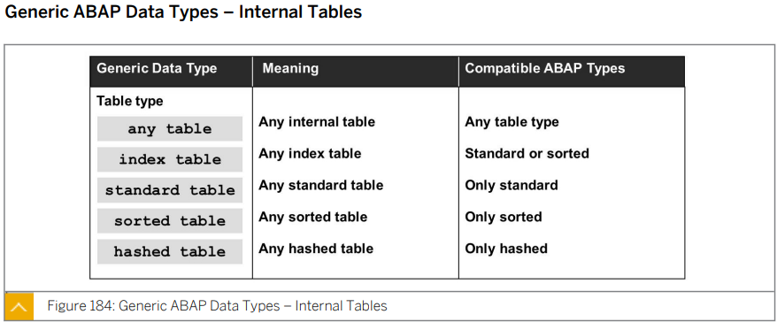
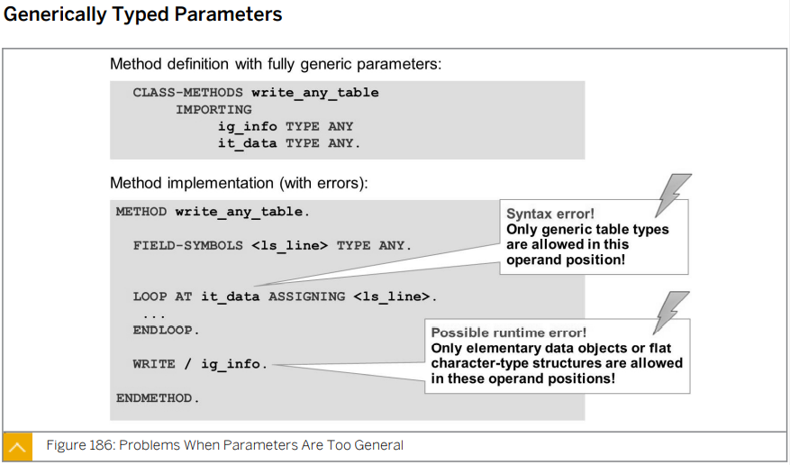
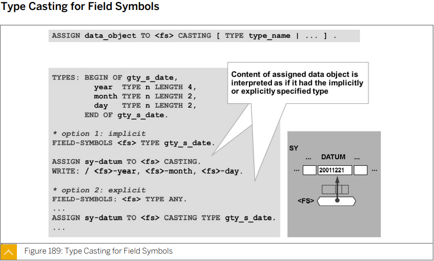
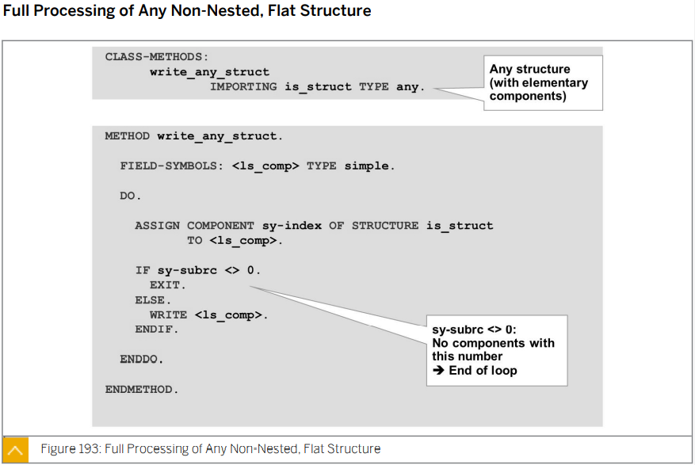
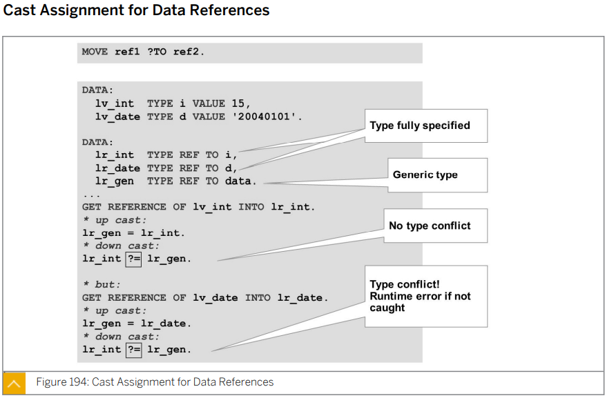
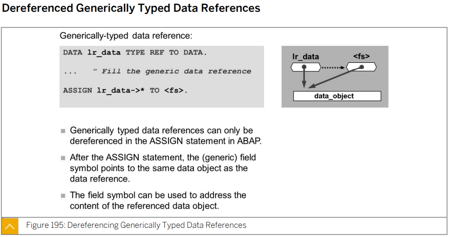
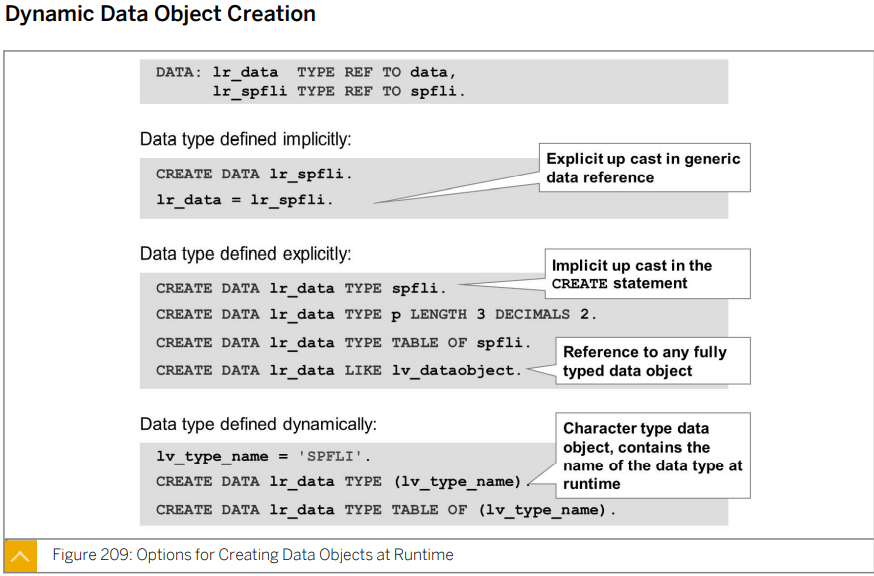
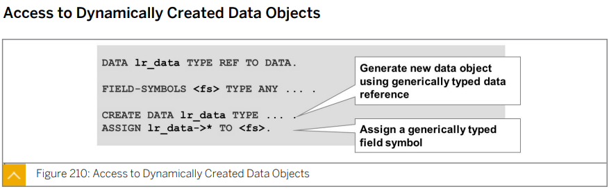
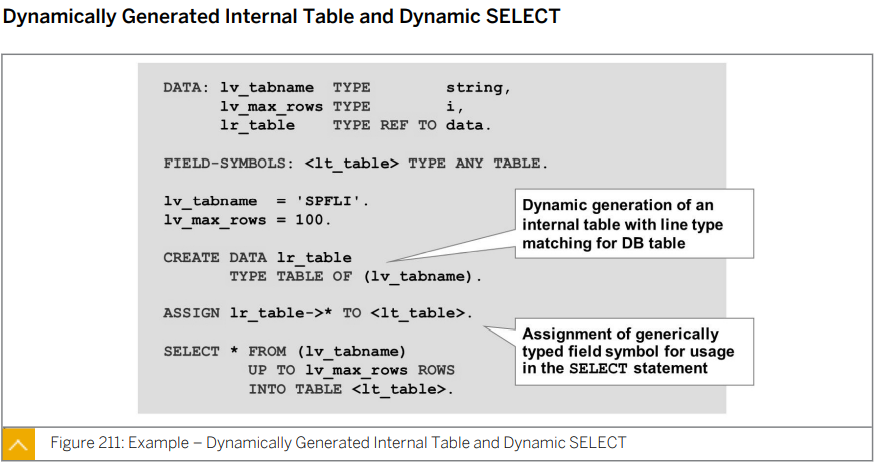

# Unit 11. Dynamic Programming 


# Lesson 1. Using Generic Data Types


* ## ABAP Built-in Generic Data Types

  


* ## Generic ABAP Data Types - Internal Tables

  


* ## Freely Defined Generic Table Types

  

  

* ## Generically Typed Parameters

  

  SUBROUTINE FUNCTION CLASS의 파라미터에 GENERIC DATA TYPE을 사용할 때 문제가 발생할 수 있다.

  Field Symbol을 work area로 사용할 때는 LOOP문의 구문의 INTO 대신 ASSIGNING을 사용한다.

  FIELD SYMBOL은 REF VARIABLE로 실재로 값이 할당되는 것이 아니라 테이블의 row를  참조 / point 하는 개념이다.

  ### Syntax error 가 발생할 수 있다.

  loop 문 다음에는 internal table 이 와야 하는데 generic type ANY TYPE의 IT_DATA 가 왔기 때문이다.

  ### Runtime error가 발생할 수 있다.

  IG_INFO 가 STRUCTURE 인 경우 WRITE문으로 작성 하기 위해서는 모든 COMPONENT들의 TYPE이 문자열이어야 가능하다.

  

  

  TYPE을 수정하여 ERROR를 방지할 수 있다.

  


* ## Type Casting for Field Symbols

  


* ## Dynamic Access 

  

  

  

  LV_NAME에는 스트럭쳐와 필드를 모두 입력하여 DYNAMIC ACCESS를 하였다.

  LV_COMP_NAME에는 FIELD 만을 입력 후 OF STRUCTURE 구문을 사용하여 DYNAMIC ACCESS를 하였다.

  LV_COMP_NUMBER에 숫자를 입력하고 OF STRUCTURE 구문을 이용해 몇번째 FIELD 를 ACCESS 할지 결정할 수 도 있다.

  

  

  모든 FIELD에 접근 할 때는 FIELD의 개수를 모르는 경우를 처리하기 위해 

  DO \___ ENDDO. 문 과 SY_SUBRC 를 이용한다.


* ## Common Use Cases for References with Type TYPE REF TO DATA


* ## Cast Assignment for Data References

  

  GET REFERENCE OF GV_INT INTO GR_INT.

  REFERENCE VARIABLE은 CLASS에서만 사용하는 것이 아니다.

  

  

  

* ## Dereferenced Generic Data References

  


# Lesson 2. Describing Data Types, Data Objects and Objects at Runtime

안함


# Lesson 3. Creating Data Types, Data Objects and Objects at Runtime


* ## Dynamic Object Creation

  

  class object를 생성할때

  CREATE OBJECT 또는 NEW # 구문을 사용할 수 있다.

  ```ABAP
  GO_RENTAL = NEW #( IM_NAME = 'DRIVE & SMILE' ).
  ```

  

* ## Dynamic Data Object Creation

  

  마찬 가지로 NEW # 구문을 사용하여 생성할 수 있다.

  ```ABAP
  CREATE DATA GR_SPFLI.
  GR_SPFLI = NEW #( ).
  ```

  

  

* ## Access to Dynamically Created Data Objects

  

  dynamic 한 경우 dereference를 사용할 수 없어 create data를 사용한다.

  

  


