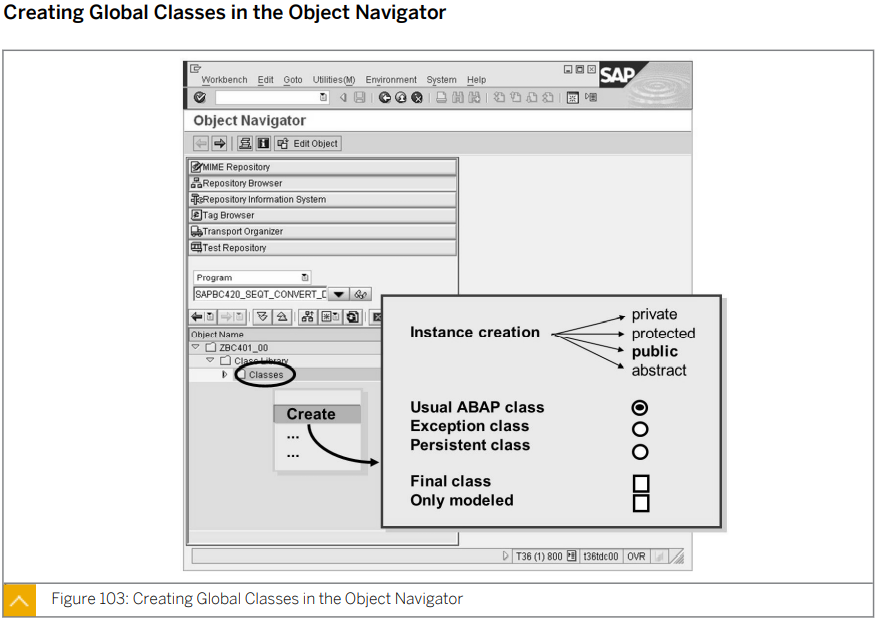
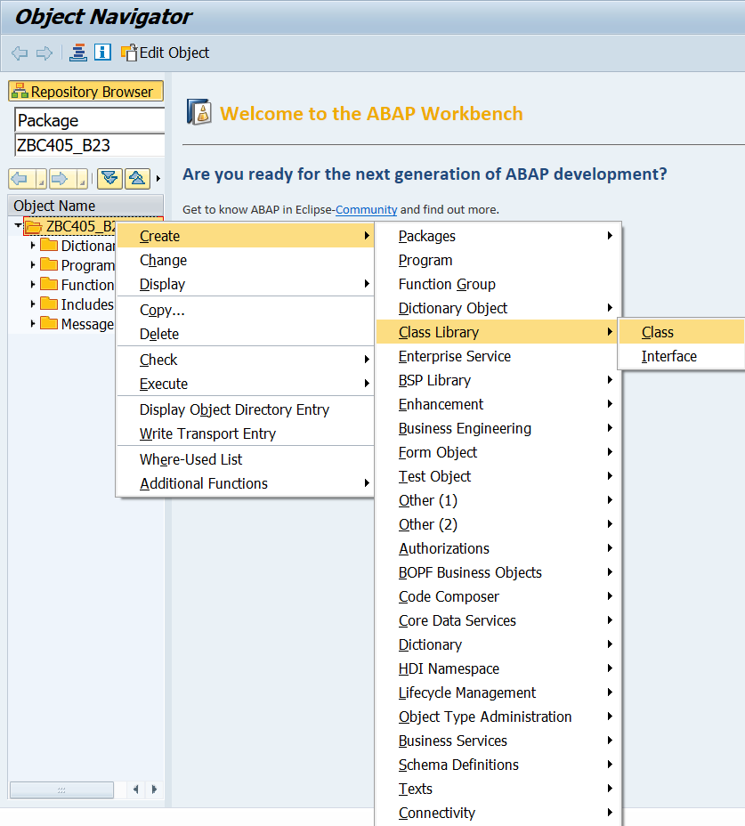
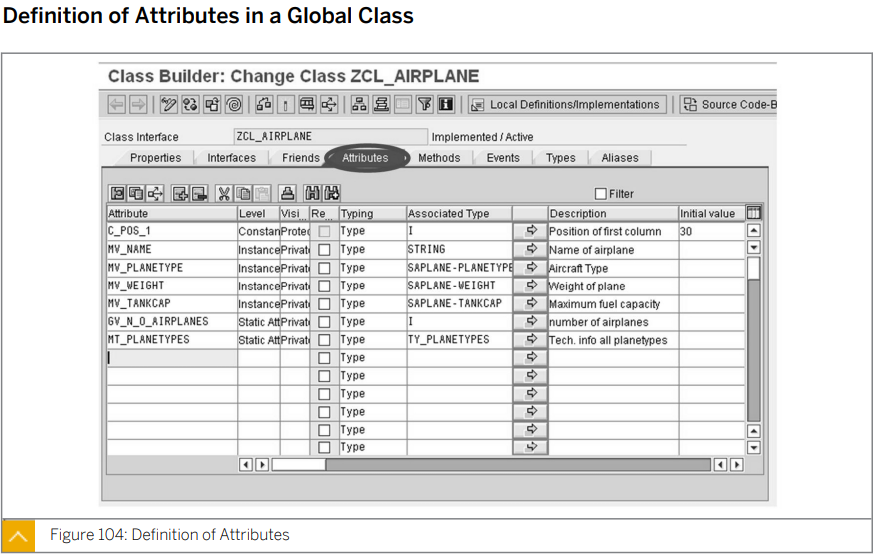
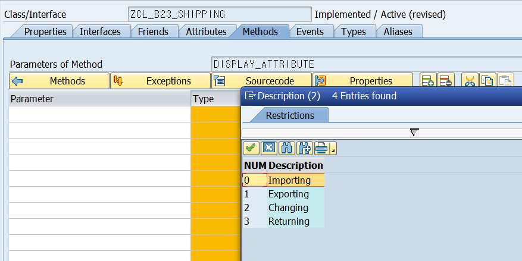
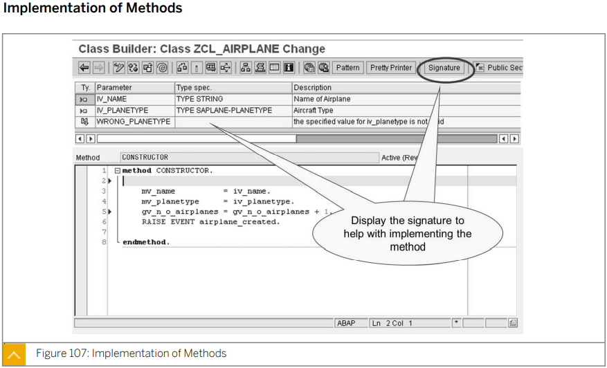
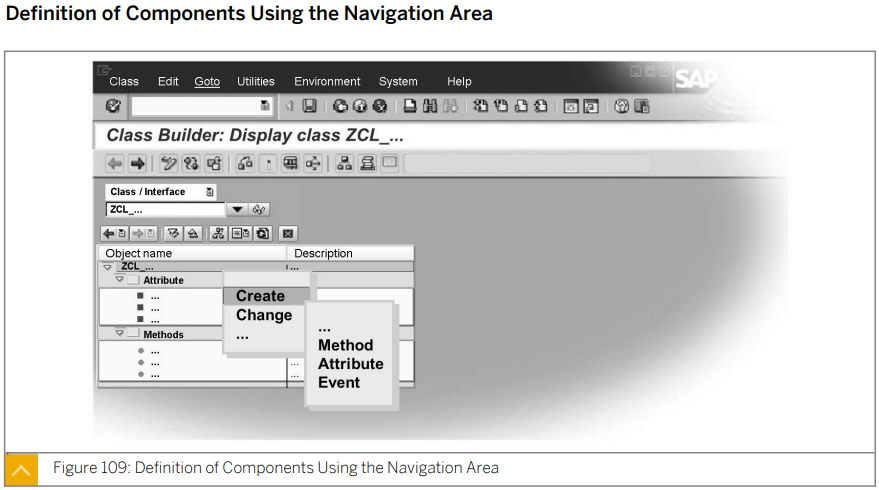
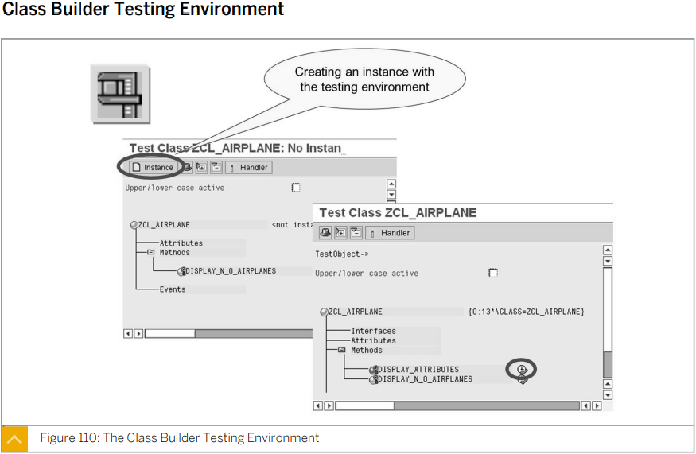

# Unit 6. Object-Oriented Repository Objects

# Lesson 1. Creating Global Classes

* ## Creating Global Classes

  

  GLOBAL CLASS의 이름은 ZCL_ 로 시작한다.

  * 

    

    

  

  ATTRIBUTE  	 : METHOD를 제외한 COMPONENT들이 들어간다. 

  LEVEL 	     	  : CONSTANT인지 INSTANCE인지 STATIC인지 설정해준다.

  VISIBILITY   	  : PUBLIC/PROTECTED/PRIVATE 를 결정한다.

  INITIAL VALUE : 초기값을 설정한다. CONSTANT 필수   

  

  

  * CONSTRUCTOR는 CONSTRUCTOR 버튼을 통해 자동 생성한다.

    

    

  

  

  

  METHOD의 PARAMETER를 설정한다.

  CONSTRUCTOR는 IMPORTING과 EXCEPTION만 가질 수 있기 때문에 IMPORTING과 EXPORTING을 구분 하지 않는다.

  * 이외의 메소드들은 TYPE 칸이 있다.

    

  

  

  구현 하고자 하는 METHOD를 더블 클릭 하거나 METHOD를 선택후 SOURCE CODE 버튼을 클리시 위와 같이 LOGIC을 구현 할 수 있다.

  SIGNATURE을 클릭 하면 해 당 METHOD의 PARAMETER들을 확인 할 수 있다.

  * 

    

  

  

  잘 안쓰는 기능이다.

  

  

  해당 클래스를 우클릭하여 CREATE로 가면 METHOD/ATTRIBUTE/EVENT 등을 생성할 수 있다.

  

  

  CLASS BUILDER에서 INSTANCE 버튼을 통해 METHOD를 실행 해 볼 수 있다.

  

  

  

  

* ## Use of Global Classes

  원하는 CLASS를 드래그 드랍하면 CREATE OBJECT 구문이 생성되며 METHOD 또한 드래그 드랍으로 사용할 수 있다.

# 이후 생략!!!

