# Unit 11. Web Dynpro Context


# Lesson 1. Creating Context Nodes


# Lesson 2. Setting Context Node Properties


* ## Cardinality

  | Cardinality Values | Description                    |
  | ------------------ | ------------------------------ |
  | 0..1               | Zero or one element permitted  |
  | 0..n               | Zero or more element permitted |
  | 1..1               | Exactly one element permitted  |
  | 1..n               | One or more element permitted  |

  


* ## Lead Selection

  WEB DYNPRO APPLICATION에서 테이블의 ROW를 선택시 LEAD_SELECTION_INDEX에 저장된다.


* ## The Singleton Property

  

  Singleton 을 true로 할 경우 부모노드에 element가 아무리 많아도 자식 노드에는 element가 하나만 생긴다.


# Lesson 3. Sharing Data Between Controllers with Context Mapping


* ## 실습

  

  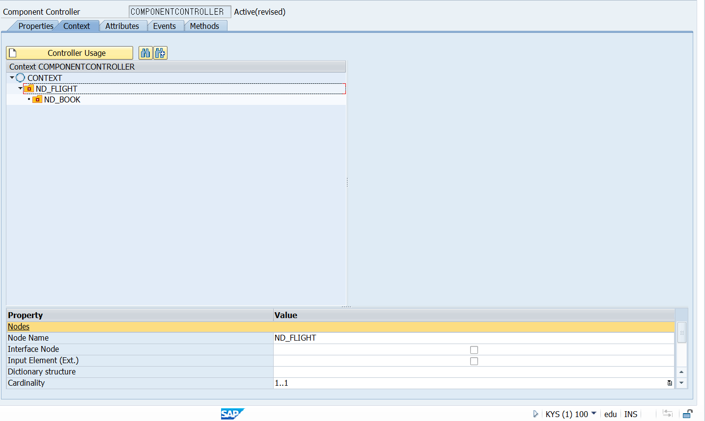

  

  

  

  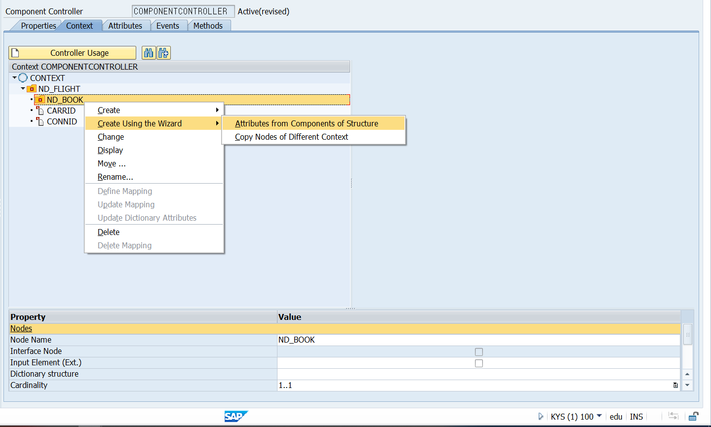

  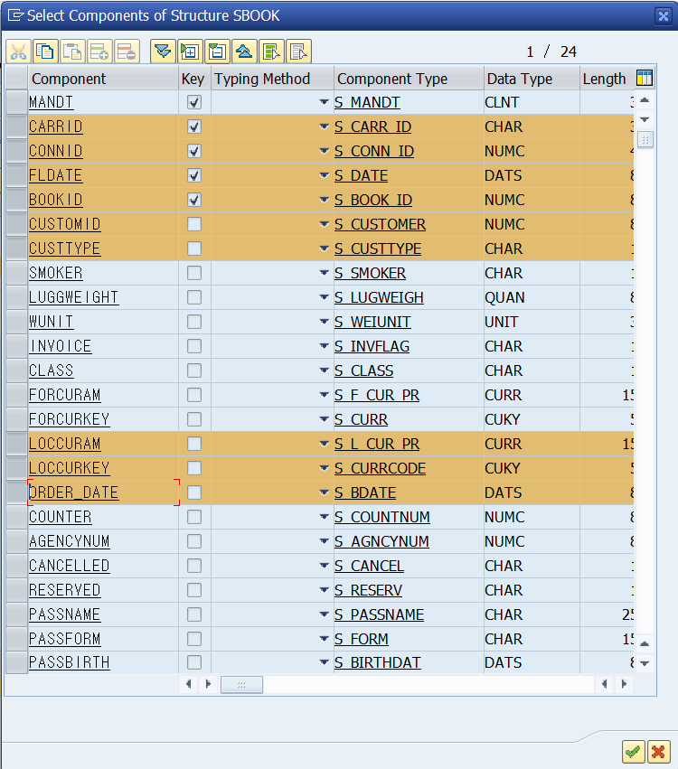

  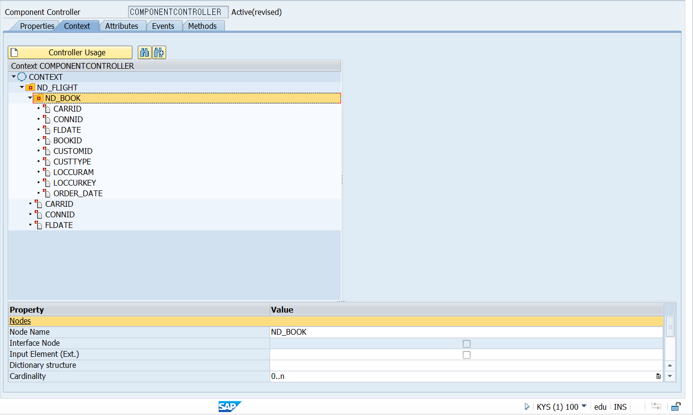

  

  #### 드래그를 하면 CONTEXT VIEW_MAIN에도 새성된다.

  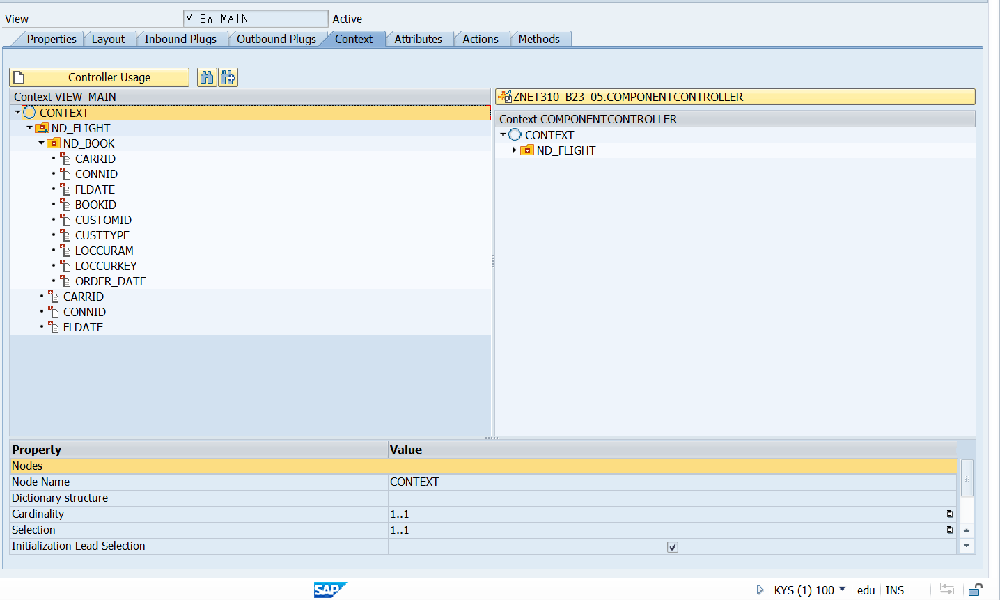

  

  #### 추가로 ATTRIBUTE를 생성한 경우

  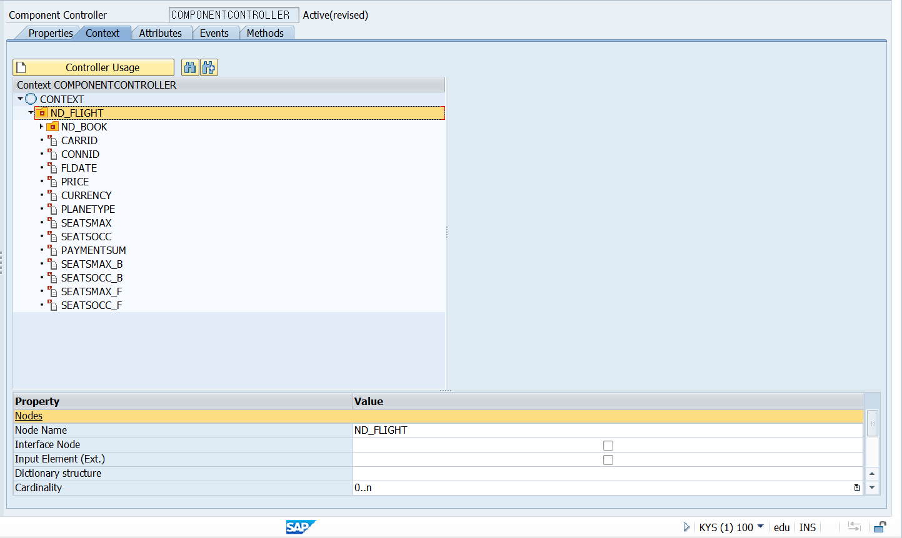

  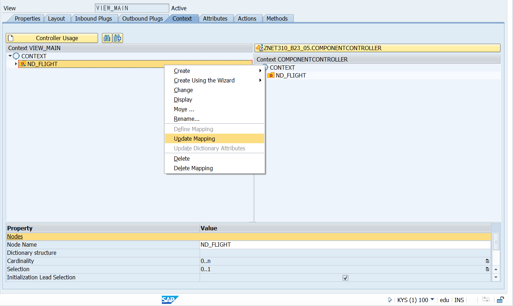

  

  

  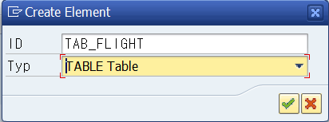

  

  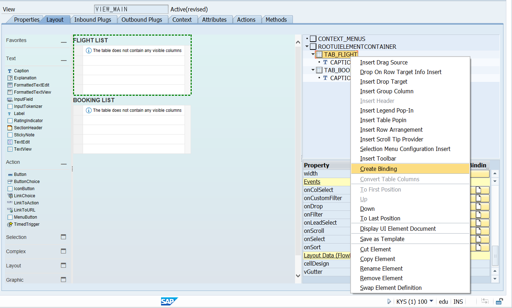

  

  

  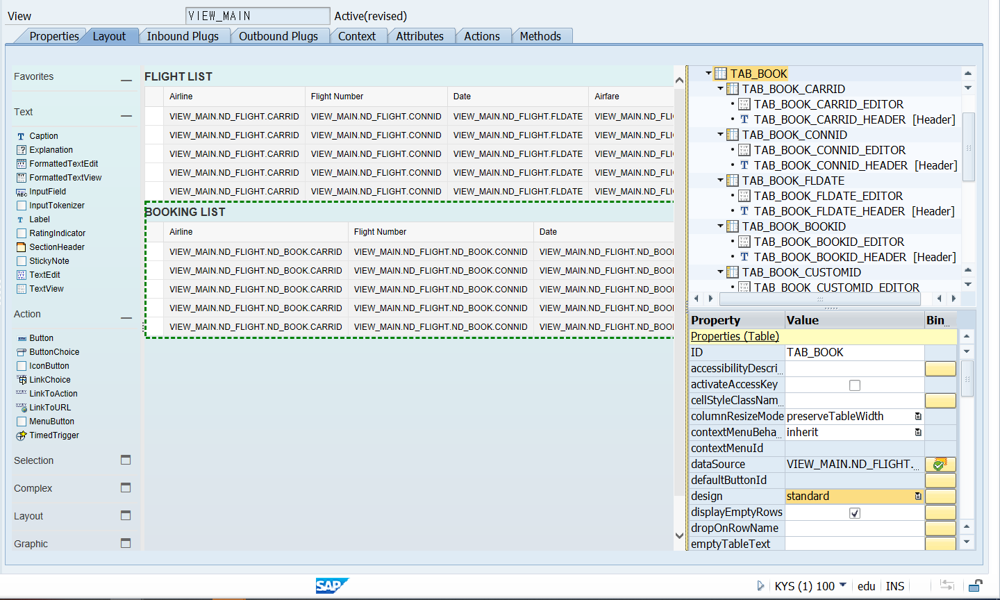

  

  

  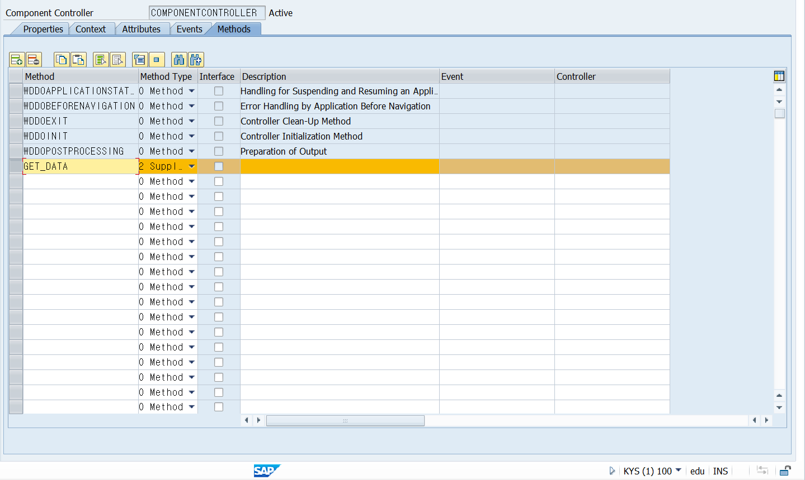

  #### 자동적으로 method가 생성되며 그 type은 

  

  #### Supply Function 이며 이는 부모 노드의 lead selection이 변경될때 실행된다.!!

  

  #### WDDOINIT METHOD로 들어가

  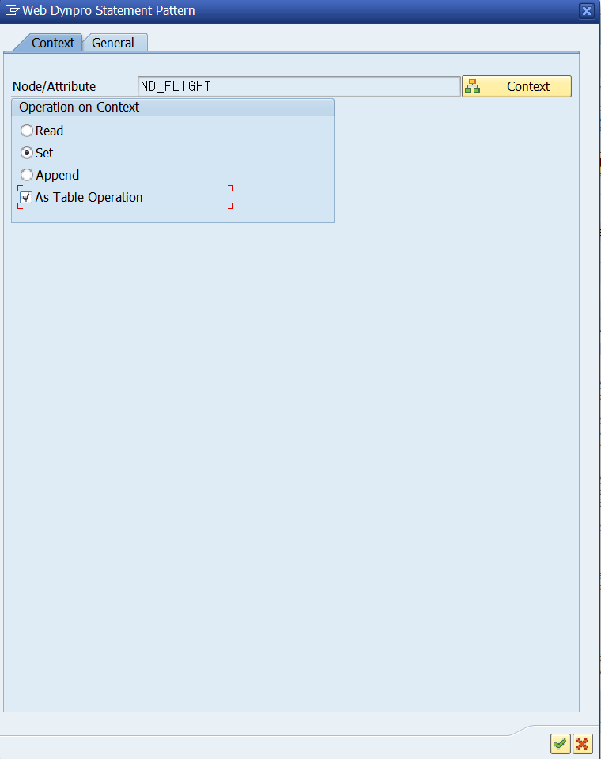

  

  ```ABAP
  METHOD get_data .
    DATA lo_nd_nd_flight TYPE REF TO if_wd_context_node. " child node 인 nd_flight에 access 할 수 있게 만들 ref vari
  
    DATA lt_nd_flight TYPE wd_this->Elements_nd_flight.  "structure를 생성하고 싶은 경우 Element_nd_flight
  
  * navigate from <CONTEXT> to <ND_FLIGHT> via lead selection
    lo_nd_nd_flight = wd_context->get_child_node( name = wd_this->wdctx_nd_flight ).
  * 2번째 줄의 lo_nd_nd_flight에게 CHILED NODE ND_FLIGHT를 할당해 주는 과정으로
  * lo_nd_nd_flight = wd_context->get_child_node( name = 'ND_FLIGHT' ). 또한 가능하다.
  
  * @TODO handle non existant child
  * IF lo_nd_nd_flight IS INITIAL.
  * ENDIF.
  
  ** @TODO compute values
  ** e.g. call a model function
  *
    SELECT * INTO CORRESPONDING FIELDS OF TABLE lt_nd_flight FROM sflight.
    lo_nd_nd_flight->bind_table( new_items = lt_nd_flight set_initial_elements = abap_true ).
  
  ENDMETHOD.
  ```

  

  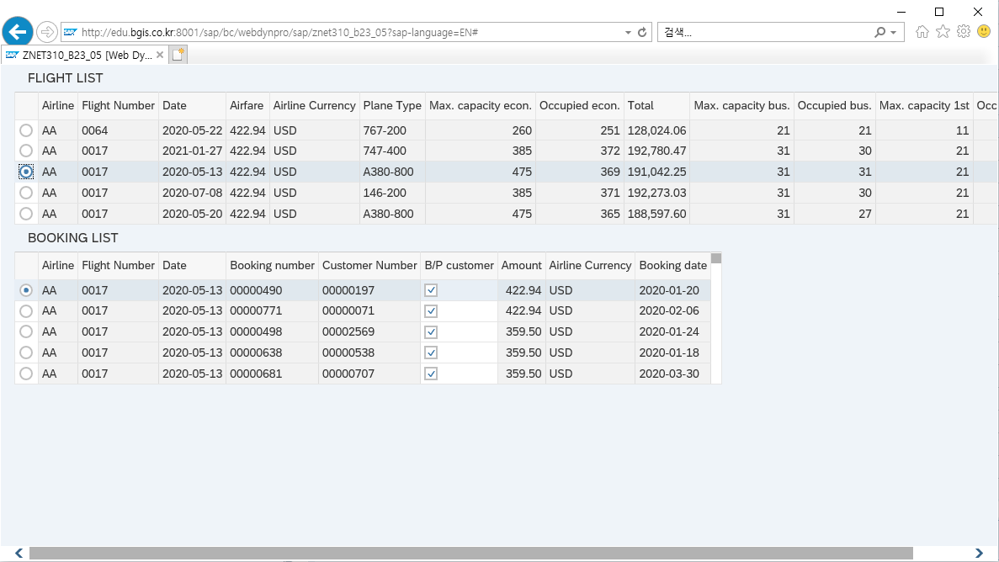