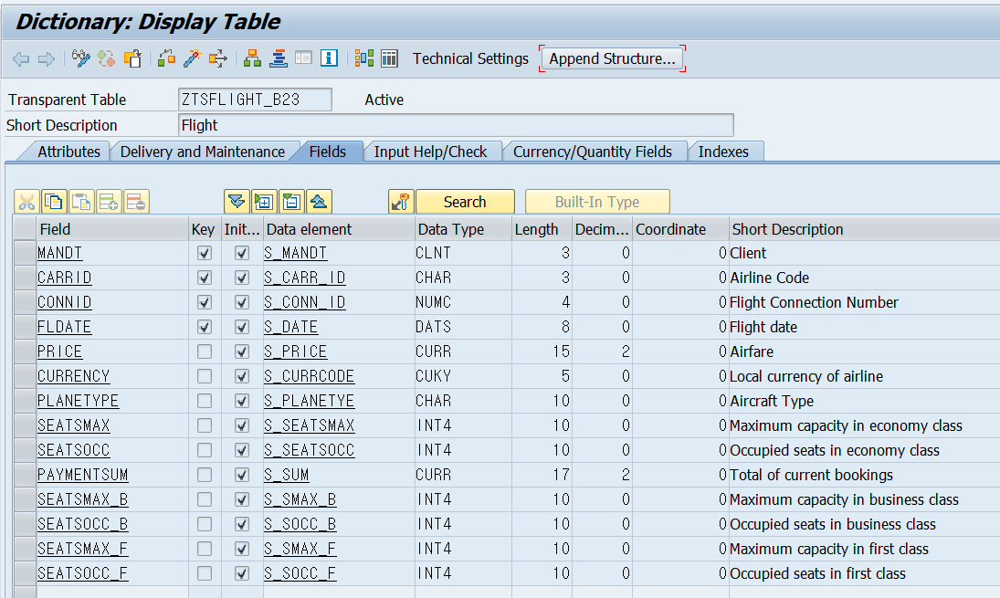
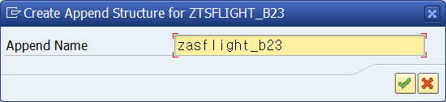
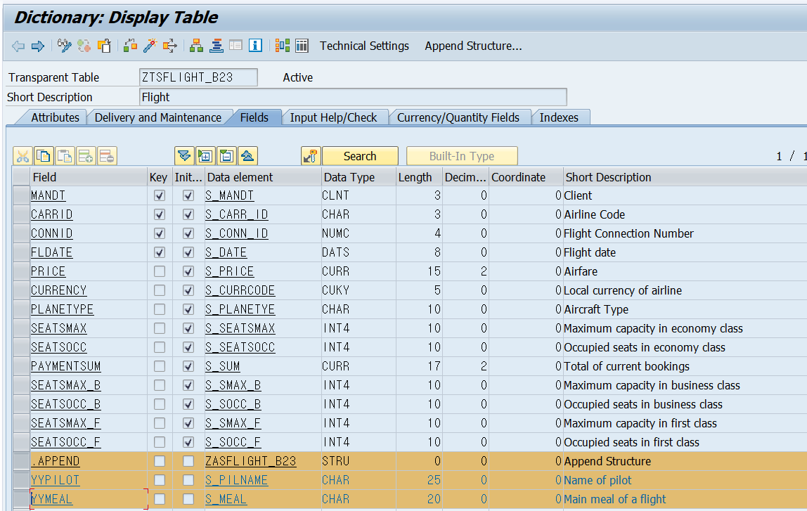
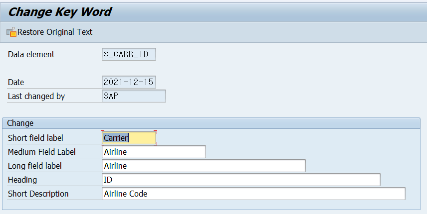

# Unit 2. Enhancement of Dictionary Elements

# Lesson 1. Enhancing Tables Using Append Structures and Customizing Includes

* ## Options for Adding Extra Fields to SAP Tables

  ### Append Structure

  * 
  * 하나의 Append Structure는 하나의 Table에서만 사용할 수 있다.
  * Append Structure는 program 에서 Normal Structure의 Type처럼 사용될 수 있다.

  ### Customizing Include (CI_)

  * 
  * 
  * 

  

* ## Append Structures

  이름은 ZZ / YY로 시작해야 한다.

  새로운 버전에서 해당 table에 새로운 sap field가 추가되는 경우 Append Structure 뒤에 추가된다.

  따라서 naming 룰만 잘 지켜주면 사용에 지장이 없다.

  복사한 TRANSPARENT TABLE을 SAP TABLE이라 가정하고 실습

  

  #### APPEND STRUCTURE 을 통해 실행한다.

  

  

  #### field 명은 항상 YY / ZZ 로 시작해야한다.

  

  

  ### Important Considerations When Using Append Structures

* ## Customizing Includes

  

# Lesson 2. Enhancing Texts of Data Elements

* ## Text Enhancements

  

  

  

* ## SAP Field Label Enhancement

  

  

  

  #### 새로운 버전 업데이트로 인해 변경된 경우

  

  #### Restore Customer Version을 통해 Customer Field Label로 다시 변경할 수 있다.

* ## Enhanced Documentation for Data Elements

  

  

  

  

