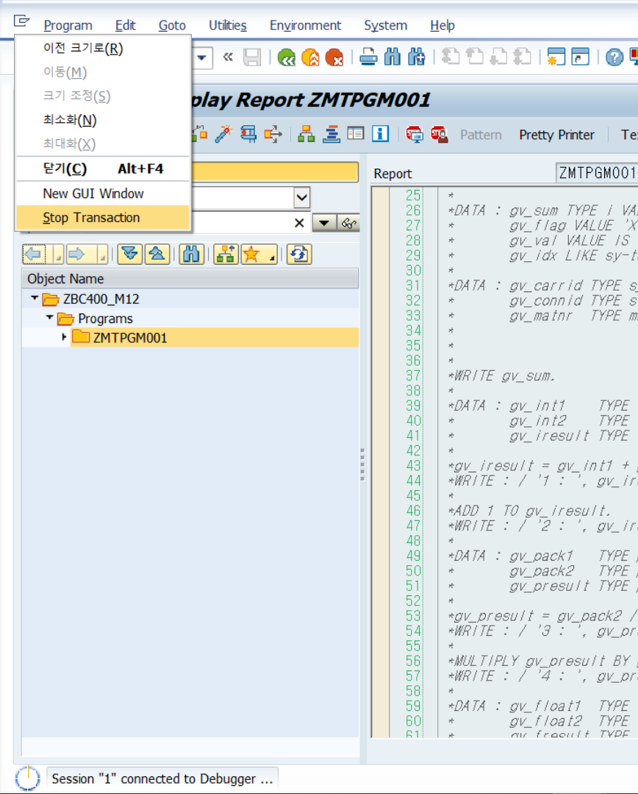

# 1. SUBROUTINE


* ## Call by ...

  ### Call by Value

  VALUE 구문에서 FORMAL PARAMETER는 자신의 메모리를 가진다. 

  SUBROUTINE을 호출할 때, Actual Parameter의 값은 Formal Parameterdp 복사된다. 하지만 Formal Parameter의 값이 변경되더라도 Actual Parameter에는 영향을 미치지 않는다.

  ##### USING 을 VALUE 키워드와 함께 사용하면 CALL BY VALUE이다.

  

  ### Call by Reference

  FORMAL PARAMETER는 자신의 메모리를 가지지 않는다. SUBROUTINE이 호출되는 동안 ACTUAL PARAMETER의 주솟값을 가지고 있을 뿐이다. 즉 SUBROUTINE을 호출한 프로그램의 메모리에서 작업하게 된다.

  ##### VALUE구문을 사용하지 않으면 USING과 CHANGING 구문은 모두 CALL BY REFERENCE를 이용하게 된다.

  ##### PERFORM 에서 USING 을 FORM 에서 CHANGING을 사용해도 에러가 발생하지 않는다.

  ##### 즉 VALUE 구문을 사용하지 않으면 USING과 CHANGING구문의 기능은 같다.

  

  ### Call by Value and Result

  ```ABAP
  *&---------------------------------------------------------------------*
  *& Report ZB23_00005M
  *&---------------------------------------------------------------------*
  *&
  *&---------------------------------------------------------------------*
  REPORT zb23_00005m.
  
  DATA: gv_val1 TYPE i VALUE 2,
        gv_val2 TYPE i VALUE 3,
        gv_sum  TYPE i.
  
  PERFORM sum_data USING gv_val1 gv_val2
                   CHANGING gv_sum.
  
  WRITE:/ 'RESULT IS :', gv_sum.
  *&---------------------------------------------------------------------*
  *& Form sum_data
  *&---------------------------------------------------------------------*
  *& text
  *&---------------------------------------------------------------------*
  *&      --> GV_VAL1
  *&      --> GV_VAL2
  *&      <-- GV_SUM
  *&---------------------------------------------------------------------*
  FORM sum_data  USING    p_val1
                          p_val2
                 CHANGING p_sum.
    p_sum = p_val1 + p_val2.
  ENDFORM.
  ```


```ABAP
*&---------------------------------------------------------------------*
*& Report ZB23_00006M
*&---------------------------------------------------------------------*
*&
*&---------------------------------------------------------------------*
REPORT zb23_00006m.

TYPES: BEGIN OF t_str,
         col1 TYPE c,
         col2 TYPE i,
       END OF t_str.

TYPES: t_itab TYPE TABLE OF t_str.

DATA: gt_itab TYPE t_itab.

PERFORM test_itab TABLES gt_itab.
PERFORM write_data TABLES gt_itab.


*&---------------------------------------------------------------------*
*& Form TEST_ITAB
*&---------------------------------------------------------------------*
*& text
*&---------------------------------------------------------------------*
*&      --> GT_ITAB
*&---------------------------------------------------------------------*
FORM test_itab  TABLES   pt_itab TYPE t_itab."STRUCTURE gt_itab.
  DATA ls_str TYPE t_str.

  ls_str-col1 = 'A'.
  ls_str-col2 = 1.
  APPEND ls_str TO pt_itab.

  ls_str-col1 = 'B'.
  ls_str-col2 = 2.
  APPEND ls_str TO pt_itab.

ENDFORM.
*&---------------------------------------------------------------------*
*& Form WRITE_DATA
*&---------------------------------------------------------------------*
*& text
*&---------------------------------------------------------------------*
*&      --> GT_ITAB
*&---------------------------------------------------------------------*
FORM write_data  TABLES   pt_itab LIKE gt_itab."STRUCTURE gt_itab.
  DATA ls_str TYPE t_str.

  LOOP AT pt_itab INTO ls_str.
    WRITE:/ ls_str-col1, ls_str-col2.
  ENDLOOP.

ENDFORM.
```


* ## EXIT / CHECK 구문

  EXIT 구문을 만나면 SUBROUTINE  구문을 탈출한다. 

  CHECK 구문을 만나면 뒤의 조건문의 사실을 확인한 후 TRUE 인 경우 다음 구문들을 실행하며 

  FALSE인 경우 다음 구문들을 실행하지 않고 SUBROUTINE  구문을 탈출한다.

  ```ABAP
  *&---------------------------------------------------------------------*
  *& Report ZB23_00007M
  *&---------------------------------------------------------------------*
  *&
  *&---------------------------------------------------------------------*
  REPORT zb23_00007m.
  
  PARAMETERS: p_val TYPE char10.
  
  PERFORM end_subr USING p_val.
  
  *&---------------------------------------------------------------------*
  *& Form END_SUBR
  *&---------------------------------------------------------------------*
  *& text
  *&---------------------------------------------------------------------*
  *&      --> P_VAL
  *&---------------------------------------------------------------------*
  FORM end_subr  USING    p_val.
    CASE p_val.
      WHEN 'EXIT'.
        WRITE 'SUBROUTINE EXIT'.
        EXIT.
      WHEN 'CHECK'.
        WRITE 'VALUE CHECK'.
        CHECK p_val EQ 'CHECK'.
      WHEN OTHERS.
    ENDCASE.
    WRITE 'SUBROUTIN IS NORMALLY ENDED'.
  ENDFORM.
  ```

  


* ## MACRO

  #### ***단점***

  #### MACRO는 디버깅의 BREAK POINT를 찍을 수 없다.!!

  

  ### Local MACRO

  프로그램에서 같은 구문을 여러 번 사용해야 한다면, MACRO에 포함하는 것이 바람직하다 프로그램 선언부에 DEFINE ~ END-OF-DEFINITION 을 선언하고 나서 MACRO이름과 파라미터로 호출하면 된다. PERFORM 구문이 로직에 포하마된 재사용 모듈이라면,

  MACRO는 단순한 코딩 반복을 감소하는 것이라고 할 수 있다.

  ```ABAP
  *&---------------------------------------------------------------------*
  *& Report ZB23_00008M
  *&---------------------------------------------------------------------*
  *&
  *&---------------------------------------------------------------------*
  REPORT zb23_00008m.
  
  DATA: gv_val1 TYPE c VALUE 'A',
        gv_val2 TYPE c VALUE 'B',
        gv_val3 TYPE char3.
  
  DEFINE con.
    CONCATENATE &1 &2 INTO &3 SEPARATED BY space.
    dis &3.
  END-OF-DEFINITION.
  
  DEFINE dis.
    WRITE &1.
  END-OF-DEFINITION.
  
  con gv_val1 gv_val2 gv_val3.
  ```

  

  ### Global MACRO
  
  일반적으로 MACRO를 쓸 때 프로그램 내에서 DEFINE ~ END-OF-DEFINITION을 사용한다. 이처럼 LOCAL MACRO를 사용하면 다른 프로그램에서는 호출할 수 없다는 단점이 있다. Global MACRO를 생성하면 모든 프로그램에서 사용할 수 있다. Global MACRO를 사용하려면 TBMAC 테이블을 유지보수 하면 된다.
  
  자주 사용하는 Global MACRO는 중단점을 지정하는 ***<u>BREAK</u>*** 구문이 있다.


* ## Function

  ### RFC(Remote Function Call)

  Function을 만들때 Processiong Type에서 Remote-Enabled Module 설정하면 만든 함수를 외부 시스텀 또는 어플리케이션에서 SAP FUNCTION을 호출 할 수 있다.

   

  

  

  

  

  

  

  

# 부록

* ## Stop Transaction

  프로그램 실행 도중 무한 로딩에 빠지는 경우 

  

  을 사용하여 프로그램을 멈출 수 있다.

* ## POP UP 창 디버깅

  팝업 창에서는 /h를 넣는 등의 동작이 불가능하다. 이 경우 debug.txt와 같은 파일을 만들어 안의 내용을 

  ```
  [FUNCTION] 
  Command=/H 
  Title=Debugger 
  Type=SystemCommand 
  ```

  으로 채우고 드래그 해서 팝업창에 넣고 실행하면 디버깅 화면으로 넘어가게 된다.