## Application Details

Flexible Column Layout 을 활용하여 지점의 재고 확인(BeginColumnPage) / 상품 상세 정보, 판매 실적, 타지점 재고 조회(MidColumnPage) / 재고 이전 요청(EndColumnPage) 

#### Stock Check Page(BeginColumnPage)

> * OData Service 단에서 제한적으로 데이터를 가지고 와 로그인한 계정의 지점 정보만 필터링하여 제공
>
> * SearchField를 활용하여 입력된 값이 상품 코드 or 상품명에 포함된 상품을 필터링 하여 Display
>
>   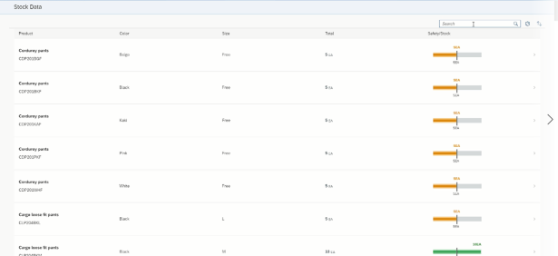
>
> * 테이블 상단에 SORT 기능 조작 버튼 생성\
>
>   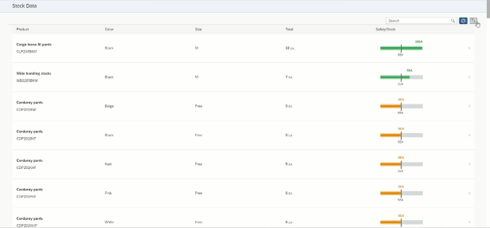
>
>   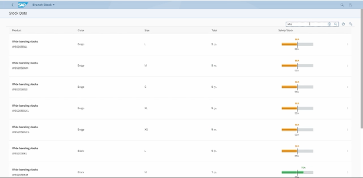
>
>   * 토글 버튼을 통해 상품 코드 / 재고량 으로 정렬 기준 변경 가능 
>   * 내림차순 오름차순 변경 가능 
>
> * 테이블에 상품정보와 재고 Display
>
> * 마이크로 차트를 활용하여 각 상품의 재고, 안전재고, 입고 예정 수량을 Display
>
> * 테이블 클릭 시 MidColumnPage View로 넘어간다.

#### Product Information (MidColumnPage)

> **Object** **Page** **Layout** **을** **활용하여** **화면** **구상**
>
> * **ObjectPageSection1**
>
>   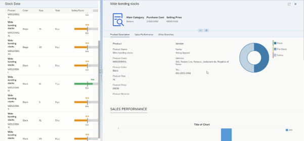
>
>   * 이전화면에서 선택한 상품의 상세 정보를 Display
>   * 차트를 통해 상품의 재고, 안전재고, 입고 예정 수량을 Display 
>
> 
>
> * **ObjectPageSection2**
>
>   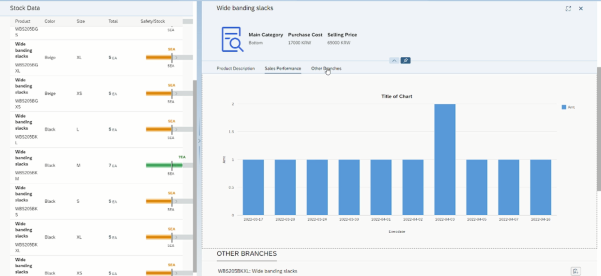
>
>   현 지점에서의 현 상품 판매 실적을 Chart 로 Display
>
>  
>
> * **ObjectPageSection3**
>
>   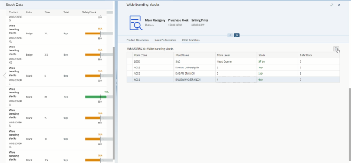
>
>   * 테이블 상단에 버튼 생성
>   * 테이블을 통해 현 제품의 타 지점 재고를 Display
>   * 지점 Row를 선택 후 상단 버튼 클릭 시 EndColumnPage View로 넘어간다.

#### R/T Request (EndColumnPage)

> 이전화면들에서 선택한 상품과 타 지점의 데이터를 기반으로 R/T 요청 문서 생성
>
>  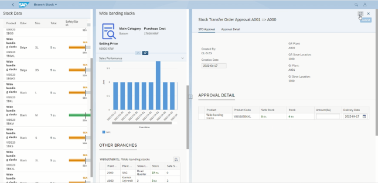
>
> 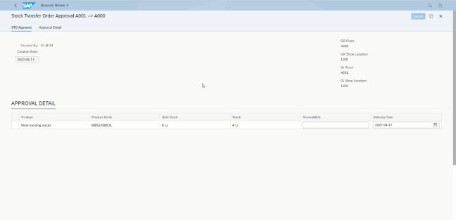
>
> 요청 수량과 배송 날짜를 입력 가능한 필드 구성
>
> * 데이터 넣기전 타지점 재고 수량과 비교하여 Error Handling (문서 생성 버튼 활성화)
>
>   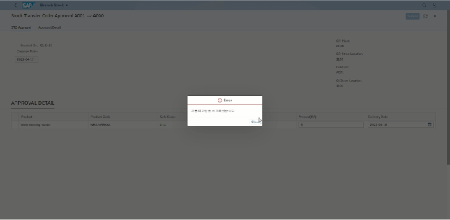
>
> * 배송 납기일은 요청 날짜 이후만 선택 가능
>
>   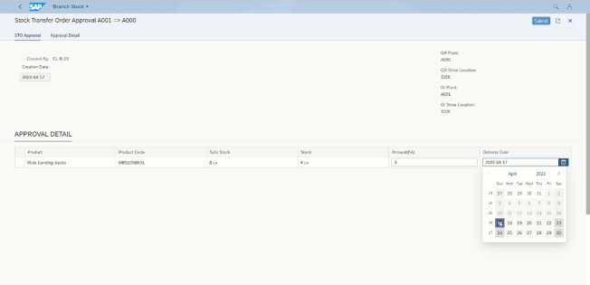
>
> * 상기 조건들이 만족하여 요청이 가능한 경우에만 Submit button이 활성화 된다.
>
>  
>
> 
>
> 생성 버튼 클릭 시 OData Service 의 create_deep_entity 메소드를 활용해 결재문서/상세정보를 DB테이블에 같은 문서 번호(Number Range)로 각각 ZTB05_APVDOC, ZTB05_DETSTOAPV 테이블에 데이터 생성 
>
> 재고 이전 요청 페이지에서 요청을 생성할 경우 OData Service 의 create_deep_entity 메소드를 활용한 Header - Items 구조의 두 테이블의 데이터를 동시에 생성해 Number Range 채번을 하나의 메소드에서 처리해  부여해 준다.
>
> 이후 BeginColumnPage 로 돌아가며 Message Toast로 요청이 성공 되었음을 알리는 메시지 display
>
> 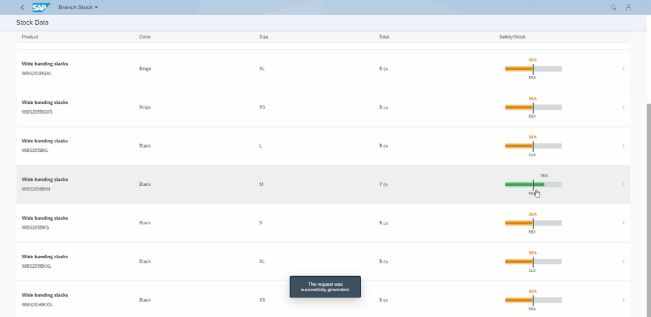

#### LaunchPad Tile

> 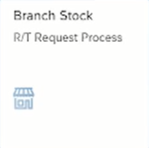


|               |
| ------------- |
|**Generation Date and Time**<br>Wed Mar 02 2022 11:35:38 GMT+0000 (Coordinated Universal Time)|
|**App Generator**<br>@sap/generator-fiori-freestyle|
|**App Generator Version**<br>1.5.0|
|**Generation Platform**<br>SAP Business Application Studio|
|**Floorplan Used**<br>simple|
|**Service Type**<br>None|
|**Service URL**<br>N/A
|**Module Name**<br>zui_brc_stk|
|**Application Title**<br>Branch Stock|
|**Namespace**<br>kr.go.iitp.gr5.clb05|
|**UI5 Theme**<br>sap_fiori_3|
|**UI5 Version**<br>1.98.0|
|**Enable Code Assist Libraries**<br>False|
|**Add Eslint configuration**<br>False|
|**Enable Telemetry**<br>True|

## zui_brc_stk

Branch Stock 

### Starting the generated app

-   This app has been generated using the SAP Fiori tools - App Generator, as part of the SAP Fiori tools suite.  In order to launch the generated app, simply run the following from the generated app root folder:

```
    npm start
```

#### Pre-requisites:

1. Active NodeJS LTS (Long Term Support) version and associated supported NPM version.  (See https://nodejs.org)

