## Application Details

**두개의 Object Page Layout의 View로 구성 (버튼을 통해 두개의 View 이동 가능)**


**I. Requested R/T by Headquarter**

> 첫 테이블에 아직 처리 되지 않은 현 지점에 들어온 STO결재문서 본사 지시건만 ZTB05_APVDOC에서 필터링하여 Display
>
> Detial 버튼을 클릭시 현 Row의 Approval Document Number 에 해당하는ZTB05_DETSTOAPV 의 데이터 즉 R/T 요청 상세 정보를 POPOVER를 통해 Display
>
> 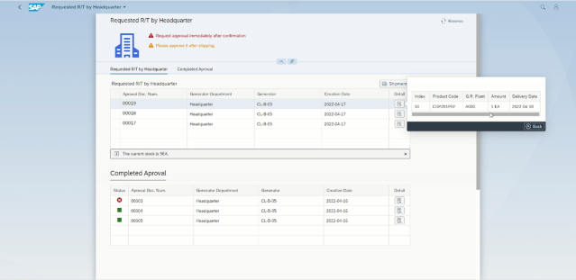
>
> 두번째 테이블에 처리된 결재 문서와 처리 결과를 Display
>
> 본사 지시건의 처리되지 않은 결재 문서가 있을시 지점 요청건 화면으로 넘어가지 못하도록 Handling
>
> 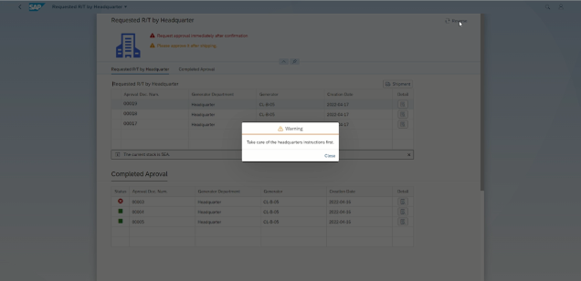
>
> **처리되지 않은 결재 문서 테이블의 Row를 클릭시 지점 재고와 비교하여 지시사항을 테이블 하단에 MessageStrip을 통해 Display 하고 이에 맞는 버튼을 테이블 상단에 활성화**
>
> * 본사 지시 수량이상의 재고를 보유 중인 경우 visible, enabled 를 통해 발송 버튼 활성화
>
>   버튼 클릭시 결재문서 ZTB05_APVDOC에 OData Service를 통해 결재 상태를 UPDATE
>
>   ZTB05_STOPOLIST 테이블에 승인된 STO 데이터가 CREATE
>
>   승인한 지점의 재고에서는 **본사 지시 수량**만큼 출고 처리가 요청한 지점에서는 입고 예정 수량(Pre-stock) 데이터가 UPDATE 
>
>   테이블의 바인딩 데이터가 Refresh 되어 변경 내용이 바로 Display
>
>   
>
> * 본사가 지시한 상품의 재고가 있지만 지시 수량보다 적은 경우 visible, enabled 를 통해 일부 발송 버튼 활성화
>
>   버튼 클릭시 결재문서 ZTB05_APVDOC에 OData Service를 통해 결재 상태를 UPDATE
>
>   ZTB05_STOPOLIST 테이블에 승인된 STO 데이터가 현 지점 재고 수량으로 CREATE
>
>   승인한 지점의 재고에서는 **현 지점 재고 수량**만큼 전부 출고 처리가 요청한 지점에서는 입고 예정 수량(Pre-stock) 데이터가 UPDATE
>
>   테이블의 바인딩 데이터가 Refresh 되어 변경 내용이 바로 Display
>
>   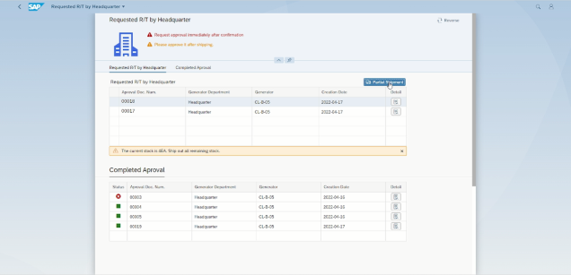
>
> * 본사가 지시한 상품의 재고가 없는 경우 visible, enabled 를 통해 반려 버튼 활성화
>
>   버튼 클릭시 결재문서 ZTB05_APVDOC에 OData Service를 통해 결재 상태와 반려사유(Out of Stock) UPDATE
>
>   테이블의 바인딩 데이터가 Refresh 되어 변경 내용이 바로 Display
>
>   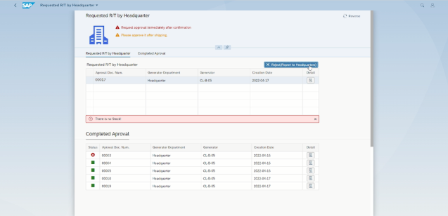
>
> 
>
> 
>
> 세 경우 모두 OData Service READ 로 ZTB05_PLANT 와 ZTB05_EMPINFO 테이블을 통해 본사 영업 담당자의 전화번호를 가져와 AWS SNS 서비스를 활용하여 해당 번호로 처리 결과에 따라 다른 문자가 전송 
>
> 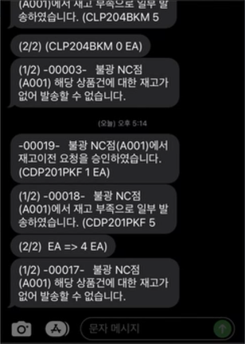


#### **Requested R/T by Branch**

> 첫 테이블에 아직 처리 되지 않은 현 지점에 들어온 STO결재문서 지점 요청 건만 ZTB05_APVDOC에서 필터링하여 Display
>
> Detial 버튼을 클릭시 현 Row의 Approval Document Number 에 해당하는ZTB05_DETSTOAPV 의 데이터 즉 R/T 요청 상세 정보를 POPOVER를 통해 Display
>
> 두번째 테이블에 처리된 결재 문서와 처리 결과를 Display
>
> 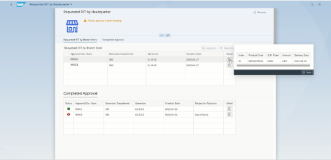
>
> 처리되지 않은 결재 문서 테이블의 Row를 클릭시 지점 재고와 비교하여 지시사항을 테이블 하단에 MessageStrip을 통해 Display 하고 요청량 이상의 재고를 보유 하고 있는 경우 Approval 버튼과 Reject 버튼을 활성화 하고 요청량보다 적은 양을 보유하고 있는 경우 Reject 버튼만 활성화
>
>  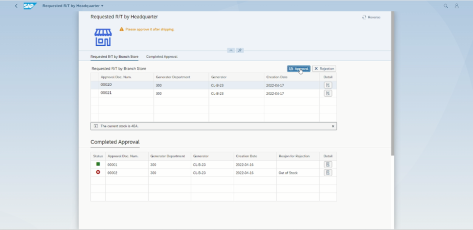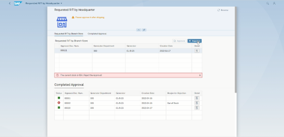
>
>  
>
> **Approval 버튼 클릭시**
>
> 재고 상황에 따라 활성화 된 버튼을 클릭시 결재문서 ZTB05_APVDOC에 OData Service를 통해 결재 상태를 UPDATE
>
> ZTB05_STOPOLIST 테이블에 승인된 STO 데이터가 CREATE.
>
> 승인한 지점의 재고에서는 출고 처리가 요청한 지점에서는 입고 예정 수량(Pre-stock) 데이터가 UPDATE
>
> 테이블의 바인딩 데이터가 Refresh 되어 변경 내용이 바로 Display
>
> 
>
> **Reject 버튼 클릭시**
>
> Dialog 와 TextArea 를 활용하여 반려 사유를 입력창 생성
>
> TextArea에 입력된 반려사유가 없는 경우 반려 버튼 비활성화
>
> 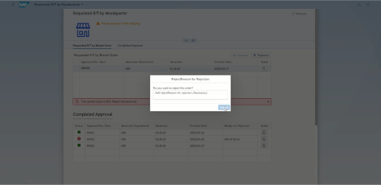
>
> (공백까지 처리하여 공백만 입력된 경우도 입력된 반려사유가 없은 것으로 처리) 
>
> 반려 사유 입력 후 반려 버튼을 최종 클릭한 경우 ZTB05_APVDOC 결재 상태, 반려 사유 UPDATE
>
> 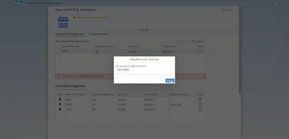


#### **Launchpad Dynamic Tile**

> 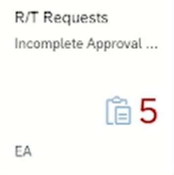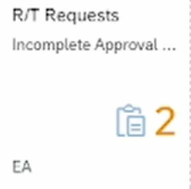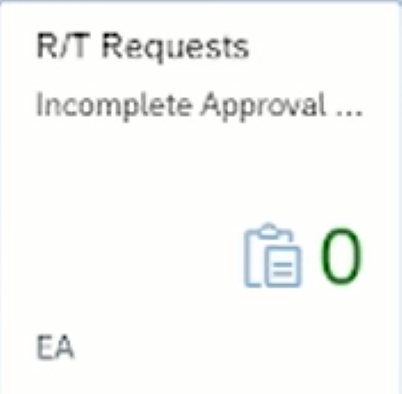
>
> Dynamic Tile을 활용하여 본사 지시건 + 지점 요청건 의 수량이 Display 되며 본사지시건이 있는 경우 빨간색 지점 요청건만 있는 경우 노란색 요청건을 모두 처리한 경우 초록색으로 Display.


|               |
| ------------- |
|**Generation Date and Time**<br>Sat Mar 26 2022 15:03:47 GMT+0000 (Coordinated Universal Time)|
|**App Generator**<br>@sap/generator-fiori-freestyle|
|**App Generator Version**<br>1.5.2|
|**Generation Platform**<br>SAP Business Application Studio|
|**Floorplan Used**<br>simple|
|**Service Type**<br>SAP System (ABAP On Premise)|
|**Service URL**<br>http://210.16.199.140:8001/sap/opu/odata/sap/ZGWB05_STO_PROCESS_SRV
|**Module Name**<br>zui_rt_chk|
|**Application Title**<br>Requested R/T by Headquarter|
|**Namespace**<br>kr.go.iitp.gr5.clb05|
|**UI5 Theme**<br>sap_fiori_3|
|**UI5 Version**<br>1.71.24|
|**Enable Code Assist Libraries**<br>False|
|**Add Eslint configuration**<br>False|
|**Enable Telemetry**<br>True|

## zui_rt_chk

A Fiori application.

### Starting the generated app

-   This app has been generated using the SAP Fiori tools - App Generator, as part of the SAP Fiori tools suite.  In order to launch the generated app, simply run the following from the generated app root folder:

```
    npm start
```

#### Pre-requisites:

1. Active NodeJS LTS (Long Term Support) version and associated supported NPM version.  (See https://nodejs.org)

ME
