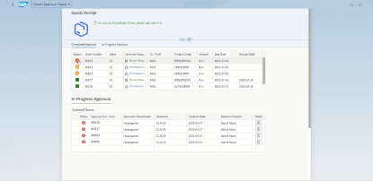
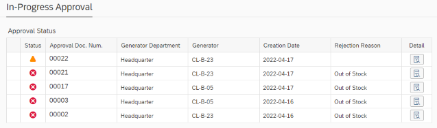
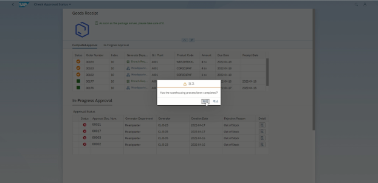
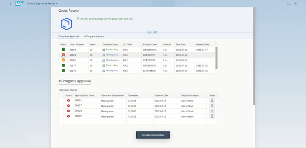
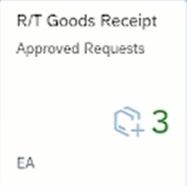

## Application Details

**한 개의 Object Page Layout View 로 구성**

#### Goods Receipt

> * 첫 테이블에 ZTB05_STOPOLIST 테이블에서 현 지점에 입고 예정인 STO 데이터만 Display
>
> * 해당 STO 오더 문서가 본사에서 지시한 건인지 현 지점에서 요청한 건인지 필드에 Display
>
>   
>
> * 두번째 테이블에 요청 받은 지점에서 아직 처리 하지 않았거나 반려한 결재 문서를 Display
>
>   
>
>   Detail 버튼을 통해 해당 결재 문서 번호에 해당하는 상세 정보를 POPOVER를 통해 Display
>
>  
>
> * 입고 처리 버튼을 누를 경우 해당 상품을 받았는지 최종 확인 하는 MessageBox 생성
>
>   
>
>   최종 확인 시 STO PO List 테이블에 입고 처리 여부를 UPDATE
>
>  
>
> 승인한 지점의 재고에서는 출고 처리가 요청한 지점에서는 입고 예정 수량(Pre-stock) 
>
> 데이터를 UPDATE
>
>  
>
> 입고 처리 된 건은 자재 문서 (MATDOC) 테이블에 CREATE

 

#### Launchpad Dynamic Tile

>  
>
> Dynamic Tile을 활용하여 승인되었지만 입고 처리 되지 않은 건의 수량을 표시

 

Dynamic Tile을 활용하여 승인되었지만 입고 처리 되지 않은 건의 수량을 표시

|               |
| ------------- |
|**Generation Date and Time**<br>Sun Apr 03 2022 16:35:44 GMT+0000 (Coordinated Universal Time)|
|**App Generator**<br>@sap/generator-fiori-freestyle|
|**App Generator Version**<br>1.5.3|
|**Generation Platform**<br>SAP Business Application Studio|
|**Floorplan Used**<br>simple|
|**Service Type**<br>SAP System (ABAP On Premise)|
|**Service URL**<br>http://210.16.199.140:8001/sap/opu/odata/sap/ZGWB05_STO_PROCESS_SRV
|**Module Name**<br>zui_rt_snd|
|**Application Title**<br>Check Approval Status |
|**Namespace**<br>kr.go.iitp.gr5.clb05|
|**UI5 Theme**<br>sap_fiori_3|
|**UI5 Version**<br>1.71.24|
|**Enable Code Assist Libraries**<br>False|
|**Add Eslint configuration**<br>False|

## zui_rt_snd

Check Approval Status 

### Starting the generated app

-   This app has been generated using the SAP Fiori tools - App Generator, as part of the SAP Fiori tools suite.  In order to launch the generated app, simply run the following from the generated app root folder:

```
    npm start
```

#### Pre-requisites:

1. Active NodeJS LTS (Long Term Support) version and associated supported NPM version.  (See https://nodejs.org)

