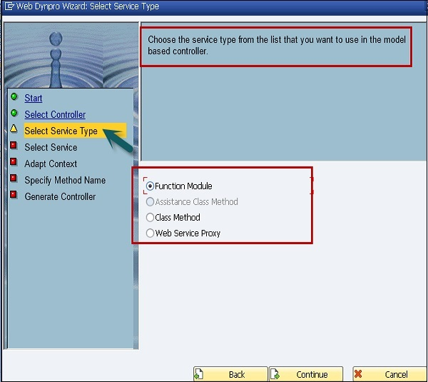

***

****

****

# SAP ARCHITECTURE.


## PRESENTATION PROCESS

* SAP GUI FOR WINDOW
* SAP GUI FOR JAVA
* SAP GUI FOR HTML


## APPLICATION PROCESS

### (DISPATCHER + WORK PROCESS + LOCAL BUFFER 로 구성) 

### DB INTERFACE 포함???

BUSINESS PROCESS 관리 , MULTI-CHANNEL 연결 , MASTER DATA 관리

### DISPATCHER

* CLIENT 요청을 QUEUE 에 저장 / WORK PROCESS 에 할당
* FIFO 방식으로 SCHEDULING 처리

### WORK PROCESS

* 각 WORK PROCESS 들은 독립되어있다.

* SAP NETWEAVER APPLICATION SERVER ABAP 이 시작될때 설정된 WP 에 대한 DB CONNECTION 을 사용한다.

* DB connection은 각 work process 가 한 개씩 맺고, work process는 서로 독립적이다.

* WORK PROCESS 들은 SHARED MEMORY 라고 불리는 공통된 MEMORY AREA 를 사용한다. 

* #### D

  보통 1개의 DIALOG PROCESS 가 처리할 수 있는 것은 10 명의 ACTIVE USER

  rdisp/wp_no_dia 조절

  rdisp/max_wprun_time 파라미터에서 PROCESS 가 실행되는 MAX TIME 정의

  초과시 종료

  * 디스패처가 WORK PROCESS 와 USER REQUEST 를 연결
  * REQUEST 는 DIALOG REQUEST QUEUE 에 저장
  * 가용한 DIALOG WP 에 FIFO 방식으로 분배 / 연결
  * DIALOG WP 는 USER CONTEXT 를 ROLL IN 
    * **ROLL IN** : SHARED MEMORY 에 저장되어 있던 USER CONTEXT 를 DIALOG WP 의 ROLL AREA 로 가져옴
  * DIALOG WP 는 DISPATCHER 에 결과 RETURN
  * USER CONTEXT 를 SHARED MEMORY 에 ROLL OUT
    * **ROLL OUT** : DIALOG WP 의 ROLL AREA => SHARED MEMORY 의 USER CONTEXT 저장

  * **여러개의 SCREEN 으로 구성 되어 있는 경우 <u>각각 다른 DIALOG WP</u>** 에 의해 수행
  * **DIALOG STEP 은 하나의 PROCESS** 만 처리
  * **각각의 DIALOG STEPS 는 다른 WORK PROCESS 에 의해 진행**된다.
  * abap dispature : work process load balancing
  * **dialog work process : roll-in, roll-out 계속 발생.**

* #### B

  가급적 시스템당 2개

* #### S

  출력시 필요

  시스템당 1개이상

* #### V

  UPDATE 

  시스템당 1개 이상

* #### E (ENQUEUE WP)

  ENQUEUE/SAP LEVEL 의 논리적 LOCK 설정 

  시스템당 1개
  
* ### DB INRTERFACE

  * OPEN SQL 번역
  * SAP TABLE BUFFER 에 접속


## DATABASE PROCESS 

* APPLICATION DATA
* CUSTOMIZED DATA
* R/3 REPOSITORY DATA
* DB SERVER


APPLICATION SERVER 의 DATA BUFFER 는 사용자에 달렸다.


PACKAGE 는 중첩 될 수 있다.

CUSTOMER REPOSITORY 의 OBJECT 들은 PACKAGE 에 할당 되어야 한다.

PACKAGE 는 INTERFACE 와 가시성을 사용해 해당 요소를 볼 수 있도록 한다.

REPcustomizing => client 에 종속,
workbench => coss-client 에 종속

OSITORY OBJECT 와 CROSS-CLIENT CUSTOMIZATION OBJECT 는 WORKBENCH REQUEST 에 할당된다.

CLIENT-SPECIFIC CUSTOMIZATION OBJECT 들은 CUSTOMIZING REQUEST 에 할당된다.

REPOSITORY OBJECT 는 CHANGE REQUEST 에 할당 되어야한다.

TRANSPORT LAYER 는 PACKAGE 에 할당 되어야한다.

REPOSITORY OBJECT 는 PACKAGE 에 할당되어야한다.

## CHANGE REQUEST 

* ACTIVATE 되어 있어야한다.
* PACKAGE RELEASE 되어있어야한다.


## SAP NETWEAVER

SAP NetWeaver는 SAP에서 제공하는 포괄적인 컴퓨팅 플랫폼(애플리케이션 소프트웨어가 실행될 수 있도록 하드웨어 Architecture와 소프트웨어 프레임워크가 합쳐진 것)이다. SAP Application의 개발과 실행 환경을 제공하며 타 시스템과의 통합도 지원한다. 대부분 ABAP으로 작성되었으며 일부 C, C++, J2EE로도 작성되어 있다. NetWeaver의 핵심 기능은 다음과 같다

 - ***<u>People Integration</u>***: 조직원들이 과업을 빠르고 효율적으로 수행할 수 있도록 필요한 정보와 기능을 제공하는 것
 - ***<u>Information Integration</u>***: 회사에 필요한 모든 정보를 통합해주는 것 
 - ***<u>Process Integration</u>***: 프로세스가 여러 시스템 영역을 통합하여 흘러가는 것
 - <u>***Application Platform***</u>: SAP Web Application Server를 통해 데이터를 처리하는 환경(개발 및 실행환경)을 제공

대부분의 대기업군들은 Business Suite를 사용하는 것 같다. Business Suite를 써야 SAP NetWeaver를 사용할 수 있고, SAP NetWeaver를 사용해야 SAP GUI 및 ABAP을 사용할 수 있을 테니까 말이다.


## ABAP WORKBENCH TOOLS

| Tool                    | Information                                                  |
| ----------------------- | ------------------------------------------------------------ |
| **Object Navigator**    | Transaction SE80; Used to navigate around the workbench.     |
| **ABAP Dictionary**     | Transaction SE11; used to create and manage data definitions (tables, structures, views) without redundancies. |
| **ABAP Editor**         | Transaction SE38; Here you can create or modify ABAP code and other implementations |
| **Message Maintenance** | Transaction SE91; for creating standard output messages used within your program |
|                         |                                                              |
| **Function Builder**    | Transaction SE37; use to create, test, and administer function modules. |
| **Class Builder**       | Transaction SE24; for building Class objects                 |
|                         |                                                              |
| **Screen Painter**      | Transaction SE51; use to design and manage screens and their elements used as Programming interfaces. |
| **Menu Painter**        | Transaction SE41; for developing the Custom User Accessible menus on your screen interfaces |


****

****

***

# DATA TYPE.

https://stepwith.tistory.com/entry/SAP-ABAP-%EA%B0%95%EC%A2%8C-18-Data-TypeBuilt-in-Data-Types

* ## Complete stadard types

  길이를 지정해 줄 수 없는 Data Type

  | NUMERIC TYPES       |                   |
  | ------------------- | ----------------- |
  | I                   | 정수 자료형 4byte |
  | F                   | 실수 자료형 8byte |
  | **CHARACTER TYPES** |                   |
  | D                   | 8자리 날짜        |
  | T                   | 6자리 시간        |
  |                     |                   |
  | DECFLOAT16          | ?                 |
  | DECFLOAT34          | ?                 |
  | STRING              | ?                 |
  | XSTRING             | ?                 |

* ## Incomplete standard types

  길이를 정의해 줄 수 있는 Data Type

  | NUMERIC TYPES      |                                                              | 기본길이 |
  | ------------------ | ------------------------------------------------------------ | -------- |
  | P                  | 소수 값을 가질 수 있는 타입으로 LENGTH 와 DECIMAL 의 길이를 지정 1~16 | 8        |
  | **CHARACTER TYPE** |                                                              |          |
  | C                  | 일반 문자형 1~65535                                          |          |
  | N                  | 문자형 데이터(숫자) 1~65535                                  |          |
  | **HEXADECIMAL**    |                                                              |          |
  | X                  | Hexadecimal(16진수) 타입 1~65535                             |          |

Size 지정해야 하는 data type (C, N, P, X) 


### Numeric types: I, F, P.

### Character types: C, D, N, T.

### Hexadecimal types: X


## GENERIC TYPE

## clike character-type :

c, d, n, t, string and character-type flat structures

## csecuence text-type : 

c, string    When the FROM is a view

[ABAP Data Types](https://www.abaptutorial.com/abap-programming/abap-data-types/)***<u>(꼭 보기)</u>***

generic : 어떤 데이터 type도 가리킬 수 있는 형태 
data z1 type ref of data
any 와 data는 동일한 기능을 갖고 있지만, any는 ref to 에 대하여 지원하지 않음.
table key 가 지정되지 않은 table-type 도 generic type 임.


#### [SAP 공식문서](https://help.sap.com/doc/abapdocu_751_index_htm/7.51/en-us/abenbuilt_in_types_generic.htm)

The only generic types that can be used after [**TYPE REF TO**](javascript:call_link('abaptypes_references.htm')) are **data**, for the generic typing of data references, and **object**, for the generic typing of object references.

| **Type**           | **Description**                                              |
| ------------------ | ------------------------------------------------------------ |
| **any**            | Any data type                                                |
| **any table**      | Internal table with any table category                       |
| **c**              | Text field with a generic length                             |
| **clike**          | Character-like (**c**, **n**, and **string** plus the date/time types **d**, **t** and character-like [flat structures](javascript:call_link('abenflat_structure_glosry.htm'))) |
| **csequence**      | Text-like (**c**, **string**)                                |
| **data**           | Any data type                                                |
| **decfloat**       | [Decimal floating point number](javascript:call_link('abendecfloat_glosry.htm')) (**decfloat16**, **decfloat34**) |
| **hashed table**   | [Hashed table](javascript:call_link('abenhashed_table_glosry.htm')) |
| **index table**    | [Index table](javascript:call_link('abenindex_table_glosry.htm')) |
| **n**              | [Numeric text](javascript:call_link('abennumeric_text_glosry.htm')) with generic length |
| **numeric**        | Numeric ((**b**, **s**), **i**, **int8**, **p**, **decfloat16**, **decfloat34**, **f**) |
| **object**         | Any object type (root class of the inheritance hierarchy)    |
| **p**              | Packed number with generic length and generic number of [decimal places](javascript:call_link('abendecimal_place_glosry.htm')) |
| **simple**         | Elementary data type including [enumerated types](javascript:call_link('abenenumerated_type_glosry.htm')) and structured types with exclusively character-like flat components |
| **sorted table**   | [Sorted table](javascript:call_link('abensorted_table_glosry.htm')) |
| **standard table** | [Standard table](javascript:call_link('abenstandard_table_glosry.htm')) |
| **table**          | Standard table                                               |
| **x**              | Byte field with generic length                               |
| **xsequence**      | Byte-like (**x**, **xstring**)                               |


## DEEP TYPE (RUNTIME 시 길이가 변하는것) 

* STRING 
* XSTRING

##### 이거도 모르겠다 자료가 안나와 ㅅㅂ,, 그래도 ENHANCEMENT CATALOG 문제에서도 비슷한 언급이 있었던 것으로 보아 STRING 관련된 타입이 DEEP TYPE 이 맞는듯,,,


##### PREDEFINED NUMERIC TYPES

* B
* S
* I
* INT8
* P
* DECFLOAT16
* DECFLOAT34
* F

##### PREDEFINED CHARACTER-LIKE TYPES

* C
* N
* STRING

##### PREDEFINED BYTE-LIKE TYPES

* X
* XSTRING

##### PREDEFINED DATE TYPES AND TIME TYPES

* D
* T


SEARCH HELP 는 GLOBAL TYPE 만

DOCUMENTATION 은 DATA ELEMENT 에 

FIELD LABEL 은 DATA ELEMENT 

TECHNICAL INFORMATION 은 GLOBAL LOCAL 모두 가지고 있다.


## SQL DATA TYPE?

DF16_DEC : = Decfloat16
DF34_DEC : 1 and 31 digits = Decfloat34

**Numeric Types**

| **Type** | **Valid Places \**m\**** | **Initial Value** | **Meaning**                                                  | **ABAP Type**                                                |
| -------- | ------------------------ | ----------------- | ------------------------------------------------------------ | ------------------------------------------------------------ |
| INT1     | 3                        | 0                 | 1-byte integer, 0 to 255                                     | [**b**](javascript:call_link('abenbuiltin_types_numeric.htm')) |
| INT2     | 5                        | 0                 | 2-byte integer, -32,768 to 32,767                            | [**s**](javascript:call_link('abenbuiltin_types_numeric.htm')) |
| INT4     | 10                       | 0                 | 4-byte integer, -2,147,483,648 to +2,147,483,647             | [**i**](javascript:call_link('abenbuiltin_types_numeric.htm')) |
| INT8     | 19                       | 0                 | 8-byte integer, -9,223,372,036,854,775,808 to +9,223,372,036,854,775,807 | [**int8**](javascript:call_link('abenbuiltin_types_numeric.htm')) |
| DEC      | 1-31                     | 0                 | Packed number in [BCD](javascript:call_link('abenbcd_glosry.htm')) format | [**p**](javascript:call_link('abenbuiltin_types_numeric.htm')), length **m [DIV](javascript:call_link('abenarith_operators.htm')) 2 + 1** |
| DF16_DEC | 1-15                     | 0                 | [Decimal floating point number](javascript:call_link('abendecfloat_glosry.htm')) stored in [BCD](javascript:call_link('abenbcd_glosry.htm')) format | [**decfloat16**](javascript:call_link('abenbuiltin_types_numeric.htm')) |
| DF16_RAW | 16                       | 0                 | [Decimal floating point number](javascript:call_link('abendecfloat_glosry.htm')) stored in binary format | [**decfloat16**](javascript:call_link('abenbuiltin_types_numeric.htm')) |
| DF34_DEC | 1-31                     | 0                 | [Decimal floating point number](javascript:call_link('abendecfloat_glosry.htm')) stored in [BCD](javascript:call_link('abenbcd_glosry.htm')) format | [**decfloat34**](javascript:call_link('abenbuiltin_types_numeric.htm')) |
| DF34_RAW | 34                       | 0                 | [Decimal floating point number](javascript:call_link('abendecfloat_glosry.htm')) stored in binary format | [**decfloat34**](javascript:call_link('abenbuiltin_types_numeric.htm')) |
| FLTP     | 16                       | 0                 | Floating point number                                        | [**f**](javascript:call_link('abenbuiltin_types_numeric.htm')) |


**Character-Like Types**

| **Type** | **Valid Places \**m\****                  | **Initial Value** | **Meaning**                                                  | **ABAP Type**                                                |
| -------- | ----------------------------------------- | ----------------- | ------------------------------------------------------------ | ------------------------------------------------------------ |
| CHAR     | 1-30000, maximum of 1333 for table fields | **m** blanks      | Character string                                             | [**c**](javascript:call_link('abenbuiltin_types_character.htm')), length **m** |
| LCHR     | 256-32000                                 | None              | Long character string                                        | [**c**](javascript:call_link('abenbuiltin_types_character.htm')), length **m** |
| SSTRING  | 1-1333                                    | Empty string      | Character string                                             | [**string**](javascript:call_link('abenbuiltin_types_character.htm')) |
| STRING   | 256-...                                   | Empty string      | Character string ([CLOB](javascript:call_link('abenclob_glosry.htm'))) | [**string**](javascript:call_link('abenbuiltin_types_character.htm')) |


**Byte-Like Types**

| **Type**  | **Valid Places \**m\****                | **Initial Value** | **Meaning**                                                  | **ABAP Type**                                                |
| --------- | --------------------------------------- | ----------------- | ------------------------------------------------------------ | ------------------------------------------------------------ |
| RAW       | 1-32000 maximum of 255 for table fields | None              | Byte string                                                  | [**x**](javascript:call_link('abenbuiltin_types_byte.htm')), length **m** |
| LRAW      | 256-32000                               | None              | Long byte string                                             | [**x**](javascript:call_link('abenbuiltin_types_byte.htm')), length **m** |
| RAWSTRING | 256-...                                 | Empty string      | Byte string ([BLOB](javascript:call_link('abenblob_glosry.htm'))) | [**xstring**](javascript:call_link('abenbuiltin_types_byte.htm')) |


**Special Types**

Predefined data types with special semantic attributes.


**Date Types/Time Types**

| **Type** | **Valid Places \**m\**** | **Initial Value** | **Meaning**                         | **ABAP Type**                                                |
| -------- | ------------------------ | ----------------- | ----------------------------------- | ------------------------------------------------------------ |
| DATS     | 8                        | 00000000          | Date in the format YYYYMMDD         | [**d**](javascript:call_link('abenbuiltin_types_date_time.htm')) |
| TIMS     | 6                        | 000000            | Time in the format HHMMSS           | [**t**](javascript:call_link('abenbuiltin_types_date_time.htm')) |
| ACCP     | 6                        | 6 blanks          | Posting period in the format YYYYMM | [**n**](javascript:call_link('abenbuiltin_types_character.htm')), length 6 |


**Character-Like Types with Special Semantics**

| **Type** | **Valid Places \**m\**** | **Initial Value** | **Meaning**                                                  | **ABAP Type**                                                |
| -------- | ------------------------ | ----------------- | ------------------------------------------------------------ | ------------------------------------------------------------ |
| NUMC     | 1-255                    | **m** zeroes      | [Numeric text](javascript:call_link('abennumeric_text_glosry.htm')) | [**n**](javascript:call_link('abenbuiltin_types_character.htm')), length **m** |
| CLNT     | 3                        | 000               | Client                                                       | [**c**](javascript:call_link('abenbuiltin_types_character.htm')), length 3 |
| LANG     | 1                        | Blank             | Language key                                                 | [**c**](javascript:call_link('abenbuiltin_types_character.htm')), length 1 |


**Currency Fields and Quantity Fields**

| **Type** | **Valid Places \**m\**** | **Initial Value** | **Meaning**       | **ABAP Type**                                                |
| -------- | ------------------------ | ----------------- | ----------------- | ------------------------------------------------------------ |
| CURR     | 1-31                     | 0                 | 통화 금액 필드    | [**p**](javascript:call_link('abenbuiltin_types_numeric.htm')), length **m [DIV](javascript:call_link('abenarith_operators.htm')) 2 + 1** |
| CUKY     | 5                        | 5 blanks          | 통화 단위 키 필드 | [**c**](javascript:call_link('abenbuiltin_types_character.htm')), length 5 |
| QUAN     | 1-31                     | 0                 | 수량 필드         | [**p**](javascript:call_link('abenbuiltin_types_numeric.htm')), length **m [DIV](javascript:call_link('abenarith_operators.htm')) 2 + 1** |
| UNIT     | 2-3                      | 2 or 3 blanks     | 수량 단위 키필드  | [**c**](javascript:call_link('abenbuiltin_types_character.htm')), length **m** |


**Obsolete Types**

| **Type** | **Valid Places \**m\**** | **Initial Value** | **Meaning**                                                  | **ABAP Type**                                                |
| -------- | ------------------------ | ----------------- | ------------------------------------------------------------ | ------------------------------------------------------------ |
| DF16_SCL | 16                       | 0                 | [Decimal floating point number](javascript:call_link('abendecfloat_glosry.htm')) stored in binary format with scaling specified (obsolete) | [**decfloat16**](javascript:call_link('abenbuiltin_types_numeric.htm')) |
| DF34_SCL | 34                       | 0                 | [Decimal floating point number](javascript:call_link('abendecfloat_glosry.htm')) stored in binary format with scaling specified (obsolete) | [**decfloat34**](javascript:call_link('abenbuiltin_types_numeric.htm')) |
| PREC     | 2                        | 0                 | Obsolete data type                                           | [**s**](javascript:call_link('abenbuiltin_types_numeric.htm')) |
| VARC     | 1-...                    | None              | Obsolete data type                                           | [**c**](javascript:call_link('abenbuiltin_types_character.htm')), length **m** |


****

*****

****

# DATA OBJECTS.


## 선언문 규칙

예외적으로 Data Type 중 일부가 LIKE 구문 뒤에 사용할 수 있는데 

ABAP Dictionary에 Structure Type / Table / Classic View 가 이에 해당한다.

SAP 에서 과거에는 사용가능하도록 만들어 놓았지만 SAP ABAP도 버젼업이 되면서

LIKE 는 Data Object인 경우에만 사용하라고 권고 하고 있다.


## ITAB

* ### ITAB에 사용가능한 구문

  * DELETE
  * MODIFY
  * INSERT
  * READ
  * ......
  * SELECT / UPDATE 구문은 사용 불가

* ### STANDARD TABLE

  * unique, non-unique and one or a multiple key
  * 순차적 INDEX를 가진다.
  * READ / MODIFY / DELETE 구문을 사용할때 INDEX 사용
  * NON-UNIQUE 로 선언해야한다. WITH UNIQUE 구문 사용 X

* ### SORTED TABLE

  * unique, non-unique
  * KEY 값으로 항상 정렬된 ITAB
  * INDEX / KEY 로 ROW 탐색
  * NON-UNIQUE , UNIQUE 사용 가능
  * SORT 시 오류 
  * APPEND 구문 오류

* ### HASHED TABLE

  * unique
  * 순차적 INDEX를 갖지 않는다.
  * HASH 값으로 계산된 KEY 값을 통해 탐색
  * UNIQUE 하게 선언
  * primary key로만 구성
  * 오직 1개 라인만 조회
  * left-justified ***<u>fully</u>*** qualified of the key

## ITAB 의 접근 시간을 개선할 수 있는 BOUNDARY CONDITION

* SORTED TABLE 의 FULLY QUALIFIED KEY
* SORTED TABLE 의 LEFT JUSTIFIED PART OF KEY
* STANDARD TABLE 의 INDEX ACCESS


## PARAMETERS 

* PARAMETERS P_XXX TYPE XXX DEFAULT ‘100’
* DEFAULT 를 통해 기본값을 줄 수 있다.

## SELECT-OPTIONS

* 생성하기 위해서는 SELECT-OPTIONS S_XX FOR XXX. 구문을 사용한다.
* DEFAULT 구문을 추가하여 기본값을 줄 수 있다.


## DATAW

* DATA gc_XXX TYPE XXX 
* VALUE 를 통해 초깃값을 설정해 줄 수 있다.

## CONSTANTS

* 상수를 생성해준다. 
* VALUE 를 통해 기본값을 줄 수 있다.


****

****

****

# ABAP DICTIONARY.

## 생성할 수 있는 것들

* DB TABLE (TRANSPARENT TABLE) 
* VIEW
* DATA TYPE
* TYPE GROUP(TYPE POOL
* DOMAIN
* SEARCH HELP
* LOCK OBJECT


## DATABASE  TABLE

DB 의 TRANSPARENT TABLE 의 FIELD 순서는 ABAP DICTIONARY 에서의 정의와 다르게 정의되는 것이 허용된다.

https://answers.sap.com/questions/2218390/transparent-table.html

* ### TRANSPARENT TABLE

  * ABAP DICTIONARY 에 하나의 TABLE 이 실제 DB 에서도 1대 1로 대응 된다.
  * 1:1
  * GROUP BY 절 사용 가능
  * SECONDARY INDEX 허용 
  * BUFFERING 가능
  * ACTIVATE 하는 시점에 실질적인 DB TABLE이 생성된다. 

* ### CLUSTERED TABLE

  * ABAP DICTIONARY 에 있는 N개의 CLUSTERED TABLE 은 DB 에 한개의 TABLE CLUSTER 과 N : 1 의 관계를 갖고 있다.
  * N : 1
  * 여러개의 ABAP DICTIONARY 에 있는 CLUSTERED TABLE 로 부터 유지 관리 되어진다.
  * SECONDARY INDEX 사용 X
  * PRIMARY KEY 통해 접근 
  * 접근 속도 느림
  * GROUP BY 절 사용 불가
  * JOIN 불가

* ### POOLED TABLE

  * ABAP DICTIONARY 에 생성된 N개의 POOLED TABLE 은 물리적 DB 인 ORACLE DB 에 하나의 TABLE 에 대이터가 관리 된다.
  * N : 1
  * PRIMARY KEY 나 SHOUD BE BUFFERED 기능으로 접근 되어진다.
  * SECONDARY INDEX 사용 X
  * GROUP BY 절 사용 X
  * JOIN 사용 X
  * **ORDER BY** 절은 **KEY FIELD** 에만 가능 (CLUSTER 도 동일할것으로 보임)
  * **WHERE** 조건은 **KEY FIELD** 에만 가능 (CLUSTER 도 동일할것으로 보임)
  * APPEND STRUCTURE 사용 불가??? (CLUSTER 도 동일할것으로 보임)

  https://m.blog.naver.com/PostView.naver?isHttpsRedirect=true&blogId=howwithus&logNo=221458527100

   

* ### TABLE BUFFER 

  * 데이터가 TABLE BUFFER 로 부터 READ 되는 경우 기존 인덱스는 사용되지 않는다.

    index 는 DB에 있는 상황이므로, buffer table 정보를 읽으면 index를 사용하지 않는다.

  * ### BY-PASS buffer 버퍼 우회되는 경우

    ABAP join
    select .. .by pass buffer.
    select … for update
    native SQL

    

  * 버퍼로 부터 읽은 데이터는 최신의 것이 아닐 수 있다.(데이터 불일치)

  * ### BUFFER TYPE

    * FULL

      테이블의 레코드가 하나 액세스되면 테이블의 모든 레코드가 버퍼에 로드된다.

    * GENERIC

      테이블의 레코드에 액세스하면 일반 키 필드(테이블 키의 왼쪽 정렬 부분, 다수의 키 필드를 지정하여 식별)에 이 레코드가 있는 모든 레코드가 버퍼에 로드된다.

    * SINGLE-RECORD

      실제로 액세스하는 테이블의 레코드만 버퍼에 로드됩니다.

      

    


## VIEW

* ### DB VIEW

  데이터를 가져올 DB TALBE 을 선택한다.

  VIEW 에서 사용할 TABLE 의 필드를 선택

   테이블간 JOIN CONDITION 정의

  * TRANSPARENT TABLE 만 사용 가능 (POOLED / CLUSTER 사용 불가)

  * 두개 이상의 테이블로 이루어진 경우 READ 만 가능
  * KEY FIELD 가 모두 앞쪽에 있어야한다.
  * **INNER JOIN 사용**

* ### PROJECTIONVIEW

  프로그램 내에서 읽어올 수 없고 SE11 에서 단순 조회만 가능

  ***<u>단 1개의 테이블</u>***에 대해서 보고싶은 field 만 추려서 볼때 사용

* ### MAINTENANCE VIEW

  TABLE 의 유지보수에 사용

  FOREIGN KEY 관계에 있는 테이블 만 JOIN 가능

  **OUTER JOIN 사용** 

  **INNER JOIN 사용 X**

  

* ### HELP VIEW

  FOREIGN KEY 관계가 있어야한다.

  **OUTER JOIN 사용**

* ### CDS VIEW

## DATA TYPE

* ### DATA ELEMENT

  * 
  
  * 기술적인 정보는 기본적으로 DOMAIN이 가지고 있다. (DATA TYPE, FIELD LENGTH, DECIMAL PLACES LENGTH 등등)
  
  * 하지만 PREDEFINED DATA TYPE 이나 REFERENCE DATA TYPE 을 통해 DATA TYPE 을 정의해 줄 수 도 있다.
  
    
  
  * 필드 라벨들을 저장한다.
  
  * F1 HELP (DOCUMENTATION) 을 지원한다.
  
  * SE11 > DATA ELEMENT > FUTHER CHARACTERISTICS TAB > CHANGE DOCUMENT 를 통해 **필드 내용의 변경에 대한 LOG**를 남기도록 설정 가능하다. 


* ### STRUCTURE  TYPE

  * NESTED STRUCTURE
    * 가변 길이 STRUCTURE

  * DEEP STRUCTURE


* ### TABLE  TYPE

  * LINE TYPE / TABLE KEY / ACCESS TYPE(STANDARD / SORTED / HASHED / INDEX) 을 지정해 준다.


## TYPE GROUP


## DOMAIN

고정값 과 같은 TECHNICAL 속성을 정의한다. 

VALUE RANGE 를 정의할 수 있다.

FIXED VALUE 를 할당할 수 있따.

CONVERSION ROUTINE 을 정의할 수 있다.

* ### CONVERSION ROUTINE 

  필드의 데이터 타입에 따라 SAP 내부 형태와 화면에 조회되는 값을 변경할 수 있도록 하는 것으로 스크린 필드에 조회되는 데이터 포맷과 실제 테이블에 저장되는 포맷이 다를 수 있음을 의미

  

* **ACCP**: Posting period. The length is set to 6 places for this data type. The format is YYYYMM. In input and output, the system inserts a point between the year and month, so the template of this data type has the format '.__'.

* **CHAR**: Character string. Fields of type CHAR can have a maximum length of 1333 in tables. If you want to use longer character fields in tables, you must choose data type LCHR. There are no restrictions on the length of such fields in structures.

* **CLNT**: Client. Client fields always have three places.

* **CUKY**: Currency key. Fields of this type are referenced by fields of type CURR. The length is set to 5 places for this data type.

* **CURR**: Currency field. Equivalent to an amount field DEC. A field of this type must refer to a field of type CUKY (reference field). The maximum length for this data type is 31 places.

* **DATS**: Date. The length is set to 8 places for this data type. The output template can be defined with the user profile.

* **DEC**: Counter or amount field with decimal point, sign, and commas separating thousands. A DEC field has a maximum length of 31 places.

* **FLTP**: Floating point number. The length (including decimal places) is set to 16 places for this data type.

* **DF34_RAW**: Normalized decimal floating point number. Representation on the database based on type RAW. The values can be sorted and compared according to their numerical value, and they can be used in indexes. Database arithmetic is not available. Decimal floating point numbers of this type have 34 digits in the mantissa, and conform to the IEEE 754r standard. Valid values are numbers between 1E-6143 and 9.999999999999999999999999999999999E+6144, plus the corresponding negative numbers and zero.

* **DF34_SCL**: Scaled decimal floating point number. The difference between this type and DF34_RAWis that DF34_SCL has an additional column of the type INT2 for the scale. This column is visible, but its value is written and read automatically. The values having this data type can be sorted and compared according to their numerical value, and they can be used in indexes. Database arithmetic is not available. The system supports up to 34 decimal digits in the coefficient. Decimal floating point numbers of this type are represented internally with 34 decimal places according to the IEEE-754 standard. Valid values are numbers between 1E-6143 and 9.999999999999999999999999999999999E+6144, plus the corresponding negative numbers and zero.

* **DF34_DEC**: Decimal floating point number. Representation on the database with type DEC, length and number of decimal places must be specified by the programmer. The values have at most 31 digits on the database, with at most 14 decimal places. The advantage of this type is that database arithmetic is available. The disadvantage is that values are silently rounded to the specified number of decimal places when they are written into the database. An overflow can also occur when writing values into the database. In this case the system throws an ABAP-OO exception.

* **DF16_RAW**: Normalized decimal floating point number. Representation based on type RAW. The values can be sorted and compared according to their numerical value, and they can be used in indexes. Database arithmetic is not available. The system supports up to 16 decimal digits in the coefficient. Decimal floating point numbers of this type are represented internally with 16 decimal places according to the IEEE-754r standard. Valid values are numbers between 1E-383 and 9.999999999999999E+384, plus the corresponding negative numbers plus zero.

* **DF16_SCL**: Scaled decimal floating point number. The difference between this type and DF16_RAWis that DF16_SCL has an additional column of type INT2 for the scale. This column is visible, but the value is written and read automatically. The values having this data type can be sorted and compared according to their numerical value, and they can be used in indexes. Database arithmetic is not available. The system supports up to 16 decimal digits in the coefficient. Decimal floating point numbers of this type are represented internally with 16 decimal places according to the IEEE-754r standard. Valid values are numbers between 1E-383 and 9.999999999999999E+384, plus the corresponding negative numbers plus zero.

* **DF16_DEC**: Decimal floating point number. Representation on the database with type DEC, length and number of decimal places must be specified by the programmer. The values have at most 15 digits on the database, with at most 14 decimal places. The advantage of this type is that database arithmetic is available. The disadvantage is that values are silently rounded to the specified number of decimal places when they are written into the database. An overflow can also occur when writing values into the database. In this case, the system throws an ABAP-OO exception.

* **INT1**: 1-byte integer between 0 and 255. The length is set to 3 places for this data type.

* **INT2**: 2-byte integer between -32767 and 32767. Fields of this type must be used only for length fields. The system positions these length fields immediately in front of a long field (type LCHR, LRAW). With INSERT or UPDATE on the long field, the database interface enters the length which was actually used in the length field. The length is set to 5 places for this data type.

* **INT4**: 4-byte integer between -2147483648 and 2147483647.The length for this data type is limited to 10 places.

* **LANG**: Language key. It has its own field format for special functions. This data type always has length 1. The language key is displayed at the user interface with 2 places, but is stored with 1 place in the database. The conversion exit ISOLA converts the display at the user interface for the database and vice versa. This conversion exit is automatically allocated to a domain with data type LANG at activation.

* **LCHR**: Character string of any length, but has to be declared with a minimum of 256 characters. You must locate fields of this type at the end of transparent tables (in each table there can be only one such field) and must be preceded by a length field of type INT2. If there is an INSERT or UPDATE in ABAP programs, this length field must be filled with the length actually required. If the length field is not filled correctly, this leads to a data loss in the LCHR field. Fields of this type cannot be used in the WHERE condition of a SELECT statement.

* **LRAW**: Uninterpreted byte string of any length, but has to be declared with a minimum length of 256. You must locate fields of this type at the end of transparent tables (in each table there can be only one such field) and must be preceded by a length field of type INT2. If there is an INSERT or UPDATE in ABAP programs, this length field must be filled with the length actually required. If the length field is not filled correctly, this leads to a data loss in the LRAW field. A field of this type cannot be used in the WHERE condition of a SELECT statement.

* **NUMC**: Long character field in which only numbers can be entered. The length of this field is limited to a maximum of 255 places.

* **PREC**: Obsolete data type. The length is set to 2 places for this data type but internally it is treated like INT2. Dynpro fields of type PREC are restricted to 2 places and must not contain a sign.

* **QUAN**: Quantity. Equivalent to an amount field DEC. A field of this type must always refer to a units field with UNIT format (reference field). The maximum length for this data type is 31 places.

* **RAW**: Uninterpreted byte string. Fields of type RAW may have only a maximum length of 255 in tables. If longer raw fields are required in tables, you should select data type LRAW.

* **RAWSTRING**: Uninterpreted byte string of variable length. In the Dictionary a length can be specified for this type (at least 256 characters). This data type can be used in types (data elements, structures, table types) and domains. You can store binary data of type RAWSTRING in the database. There are restrictions; for a description of them, refer to the documentation of the ABAP statement 'STRING'. In ABAP, this type is implemented as a reference to a storage area of variable size. The system proposes 132 characters as the default for the output length. You cannot attach search helps to components of this type.

* **STRING**: Character string with variable length This data type can be used only in types (data elements, structures, table types) and domains. In the dictionary a length can be specified for this type (at least 256 characters). It can be used in database tables only with restrictions. For a description of them, refer to the documentation of the ABAP statement 'STRING'. In ABAP, this type is implemented as a reference to a storage area of variable size. The system proposes 132 characters as default for the output length. You cannot attach search helps to components of this type.

* **SSTRING**: Short character string with variable length. In the Dictionary the number of characters can be specified for this type (from 1 to 1333). This data type can be used only in types (data elements, structures, table types) and domains. It can be used in database tables. To do so, refer to the documentation of the ABAP statement 'STRING'. In ABAP, this type is implemented as a reference to a storage area of variable size. String fields of this type can be used in indexes and in the WHERE condition of a SELECT statement. You cannot use them in table keys.

* **TIMS**: Time. The length is set to 6 places for this data type. The format is HHMMSS. The template for input and output has the form '__.__.__'.

* **UNIT**: Unit. Fields of this type are referenced by fields of type QUAN. The length of this data type is set to 2 or 3 places.

* **VARC**: Character field of variable length. Creation of new fields of this data type is no longer supported.

  https://help.sap.com/doc/saphelp_nw73ehp1/7.31.19/en-US/cf/21f2e5446011d189700000e8322d00/content.htm?no_cache=true

  


## SEARCH HELP 

* ### ABAP DICTIONARY SEARCH HELP 를 통해 할당 가능 

  (SEARCH HELP 가 존재 하지 않으면 DOMAIN의 FIXED VALUE 가 INPUT HELP 에 연결된다.)

* ### 스크린을 통한 INPUT HELP 

  SCREEN PAINTER 를 통해 개별 필드에 직접 INPUT HELP 를 할당하거나

  PAI 이벤트에서 제한 가능

* ### 구성 : 

  * import/ export parameters

  * selection method

  * dialog behavier (filter창)

* ### Dialog with the user (중간 filter창)

  DIALOG TYPE

  * **A**

    값 세트에 따른 다이얼로그

    적중 리스트 기준 100개 이상이면 C 유형

    이하면 D 유형

  * **C**

    값 제한 다이얼로그

    값을 입력 받아야만 리스트 조회

  * **D**

    값 즉시 조회

    즉시 리스트 조회

  **LPos** : 컬럼 순서 (SEARCH HIT LIST 의 SEARCH HELP PARAMTER 위치)

  **SPos** : Dialog 컬럼 순서 (DIALOG SCREEN 의 INPUT FIELD 위치)

  **IMP** : SEARCH HELP 를 띄우기 전 SEARCH HELP 를 사용하는 OBJECT 로 부터 WHRJS RKQTDMF QKESMS VKFKALXJ

  **Exp** : 선택값 return 값 결정

  IMP, EXP FLAG 에 의해 INTERFACE 정의됨

  TEXT TABLE 이 SELECTIONMETHOD 에서 사용중인 DB TABLE 에 연결되어있다면 SELECTION METHOD 의 TEXT TABLE 이 자동으로 채워진다.

  데이터는 selection-method. 

  * (table, help view, projection view, db view)

  * 필요 데이터가 두개 이상의 테이블에 존재한다면 테이블 엔트리는 FOREIGN KEY 로 연결된 VIEW 를 사용하여야 한다.

* ### 용도

  * DATA ELEMENT 에 SEARCH HELP 추가
  * TABLE FIELD 에 SEARCH HELP 추가
  * SCREEN FIELD 에 SEARCH HELP 추가

* ### SEARCH HELP 를 ASSIGN 할 수 있는 곳

  * DATA ELEMENT
  * STRUCTURE COMPONENT
  * CHECK TABLE

  


## LOCK OBJECT

* ABAP DICTIONARY 를 사용하여 LOCK OBJECT 를 생성한다. LOCK MODULE 은 자동으로 생성된다.

### 락을 잡으려 하다가 못 잡을 때 발생하는 에러

* foreign_lock : 다른 사람이 락을 잡고 있을 때, 발생하는 에러
* system_failure : 시스템 상의 다른 이유로 발생하는 에러


## TECHNICAL SETTING 

https://papago.naver.com/?sk=auto&tk=ko&st=Which%20screen%20in%20the%20ABAP%20Dictionary%20allows%20you%20to%20log%20data%20changes%20to%20the%20table%3F

* enable change logging 체크박스를 통해 변경된 사항을 LOG 로 TABLE 에 남기도록 설정할 수 있다.


***

****

****

# OBJECT NAVIGATOR.


## T-CODE SE80 

ABAP DICTIONARY 는 OBJECT NAVIGATOR 에서 유지 보수 될 수 있다. 

메뉴가 DISPLAY 되며 수정될 수 있다.

SCREEN 이 DISPLAY 되며 수정될 수 있다.

ABAP 프로그램이 DISPLAY 되며 수정될 수 있다.

structure 관리, 메뉴관리, screen 관리 등


BAdIS 는 SE18, SE19 에서 관리.


****

*****

*****

# PROGRAMS.


**변수의 메모리는 프로그램이 내부 세션에 LOAD 되는 즉시 예약된다. (확인 필요)**

#### **프로그램 수정 후 ACTIVATE 하여야 타 계정에서 수정된 버전의 PROGRAM 을 확인할 수 있다.** 

## introductory statements for programs :

- REPORT
- PROGRAM
- FUNCTION-POOL
- CLASS-POOL
- INTERFACE-POOL
- TYPE-POOL
- 정가능
- 구문들 중에 제일 먼저 (첫줄에 작성할 필요는 없다. 주석이 앞에 올 수 있다.)

https://help.sap.com/doc/abapdocu_751_index_htm/7.51/en-US/abenabap_program_statement.htm

## LOGIC 작성 규칙:

* 구문은 . 으로 끝나야한다. 
* KEYWORD 로 시작되야할 필요 없으며 시작 될 수도 있다. 
* 대소문자에대한 구분이 없다.


## SELECTION SCREEN 정의에 사용되는 선언문

* PARAMETERS
* SELECT-OPTIONS
* SELECTION-SCREEN


https://www.erpdb.info/sap-abap-program-types/

https://papago.naver.com/?sk=auto&tk=ko&st=Class%20and%20Interface%20PoolsLocate%20this%20document%20in%20the%20navigation%20structure%0AThis%20section%20discusses%20the%20structure%20and%20special%20features%20of%20class%20and%20interface%20pools%20for%20global%20classes.%0A%0AGlobal%20Classes%20and


75번 답이 

METHOD / CLASS-POOL / REPORT / FUNCTION MODULE 인지 의문

CLASS-POOL 대신 PROGRAM 이 답에 포함 되야 하는가????

| TYPE  |                  명칭                  | SCREEN | EXCUTABLE | 특이사항                                                     |
| :---: | :------------------------------------: | :----: | :-------: | ------------------------------------------------------------ |
| **1** | **EXCUTABLE PROGRAM / REPORT PROGRAM** | **O**  |   **O**   |                                                              |
| **M** |            **MODULE-POOL**             | **O**  |   **O**   |                                                              |
| **F** |           **FUNCTION GROUP**           | **O**  |   **X**   | FUNCTION MODULE 들의 집합과 같은 개념으로 내부 **FUNCTION MODULE 은 실행 가능한 반면** FUNCTION GROUP 단일로는 실행이 불가능하다.<BR/>타 프로그램에서 호출을 통해 사용할 수 있다.<BR/>SE37 / SE80 에서 생성가능 |
| **K** |             **CLASS-POOL**             | **X**  |  **O?**   | T-CODE SE24 (CLASS BUILDER) 에서 실행 가능하다는 기존 풀이가 있었으나 아무리 찾아봐도 실행 불가라고 나온다.<BR/>CLASS BUILDER 에서 생성 유지 보수가 가능하다고 나온다. |
| **J** |           **INTERFACE-POOL**           | **X**  |   **X**   |                                                              |
| **S** |          **SUBROUTINE-POOL**           | **X**  |   **X**   |                                                              |
| **I** |          **INCLUDE PROGRAM**           | **?**  |   **X**   |                                                              |


## REPORT PROGRAM


## PROGRAM EVENT BLOCKS

LOAD-OF-PAGE 

* 모든 실행가능한 구문을 포함한 프로그램에 존재할 수 있는 EVENT BLOCK

-> ***<u>INITIALIZATION</u>*** 

* PROGRAM 실행시 단 한번만 수행한다.

-> AT SELECTION-SCREEN OUTPUT 

* 여러번 수행될 수 있다. PBO 같은 역할

-> ***<u>AT SELECTION-SCREEN</u>*** [ON] [VALUE-REQUEST FOR]  

* 입력된 데이터 권한 체크(PAI 와 같은 역할)

-> ***<u>START-OF-SELECTION</u>*** 

-> TOP-OF-PAGE 

-> END-OF-SELECTION

명시하지 않아도 무조건 발동 되며 어떤 EVENT BLOCK 도 명시 되어있지 않은 경우 모든 코드는 **<u>START-OF-SELECTION</u>** EVENT BLOCK 에 속한다.


## PBO 와 PAI 이해

* ### PBO(PROCESS BEFORE OUTPUT) : 

  paramter의 속성을 바꾸고, 적합성을 확인하는 곳.

  * TITLE BAR 설정
  * SCREEN GUI STATUS 설정
  * SCREEN 속성 DYNAMICALLY 변경

* ### PAI(PROCESS AFTER INPUT) : 

  user가 화면에서 입력받은 데이터를 처리하는 곳 

  * FUNCTION CODE 검사
  * 입력된 값 체크


## TEXT SYMBOL

프로그램 개발할때 SELECTION SCREEN 의 INPUT FIELD LABEL 의 TEXT 를 설정해 주던 창을 기억하면 쉽게 이해 할 수 있다.

* 다국어 기능을 지원
* LITERAL 보다 유지 보수가 쉽다.
* 다른 프로그램에서 공유하여 사용할 수 없다.
* 132 자 까지 가능하다.


화면 생성 후 필수 입력 필드가 모두 채워지지 않더라도 CANCEL BUTTON 으로 화면을 벗어나기 위해서는 CANCEL 버튼에 FUNCTION TYPE E 를 할당, AT EXIT-COMMAND 가 추가된 모듈에서 LOGIC을 처리해 줘야한다.

 


## CHAIN

CHAIN은 FIELD 들을 묶어서 처리할때 사용되며 해당 LOGIC 에서 MESSAGE TYPE E 를 뿌려줄 경우 이후 실행이 멈춰 PBO FLOW LOGIC 이 처리되지 않고 화면이 다시 DISPLAY 되며 해당 CHAIN 의 FIELD 들 만이 INPUT 될 수 있게 된다.


****

****

****

# CODE INSPECTOR.

##   (tcode : SCI)

* STATIC CODE 검사 수행
* 자체 검사, 개체 세트 및 변형 확인
* 검사할 프로그램 및 개체를 나타내는 OBJECT 집합 생성
* LOCAL 뿐 아니라 GLOBAL INSPECTION 을 생성할 수 있다.
* 다국어 처리, 변수 선언 후 미사용. local, global 생성
* setup : inspection name, object set name, check variant name


****

*****

****

# MESSAGE .


| MESSAGE TYPE      | DESCRIPTION                                                  |
| ----------------- | ------------------------------------------------------------ |
| MESSAGE S##       | 화면 하단 **STATUS BAR**에 성공 메시지가 띄워진다.           |
| MESSAGE E##       | 화면 하단 **STATUS BAR**에 에러 메시지가 띄워지며 **프로그램이 중단**된다. |
| MESSAGE W##       | 화면 하단 **STATUS BAR**에 경고 메시지가 띄워지며 **프로그램이 중단**된다. |
| MESSAGE I##       | 메시지가 **POPUP**으로 띄워지며 확인 버튼 클릭 이후 다음 로직이 계속 수행된다. |
| MESSAGE A##       | 메시지가 **POPUP**으로 띄워지며 확인 이후 **프로그램이 종료**된다. TRANSACTION ROLLBACK |
| MESSAGE X##       | **덤프 화면**으로 넘어간다. TRANSACTION ROLLBACK             |
| DISPLAY LIKE 구문 | MESSAGE S## DISPLAY LIKE ‘E’. 와 같이 사용하며 이경우 S 타입의 메시지같이 프로그램의 중단은 없지만 메시지는 E타입처럼 DISPLAY 된다. |


***

*****

****

# DEBUGGER.

## 기능

* MEMORY 사용량 분석
* ITAB 분석
* DATA OBJECT 비교
* 소스 코드 수정 불가
* SQL TRACE 분석 불가 (SQL TRACE 에서 가능)


디버깅을 시작할때 DEBUGGING_NOT_POSSIBLE 런타임 오류가 발생하는 상황은 productive system에서 NON-EXCLUSIVE 모드가 시작된 경우


## BREAK POINT 설정하는 법

* ABAP EDITOR 에서 설정
* /H 명령 실행후 프로그램 실행하여 DEBUGGER 로 진입


## DEBUGGER TAB 

총 12개

* DESKTOP1 

* DESKTOP2 

* DESKTOP3 

* STANDARD 

* STRUCTURES 

* TABLES 

* OBJECTS 

* DETAILDISPLAY 

* DATA EXPLORER 

* BREAK./WATCHPOINT 

* DIFF 

* SCRIPT


## CLASSIC DEBUGGER 로 실행되는 경우

* OBJECT NAVIGATOR 의 설정에서 DEBUGGING 모드를 CLASSIC 으로 세팅하면 가능하다.
* logon *session이* 초과되는 경우 6번째부터 CLASSIC 으로 실행된다.


## 추가로 문제를 풀면서 확인 요망

## 값을 바꿀 수 있는 것

* VARIABLE 
* ITAB
  * ROW 삭제
  * CONTENT 전체 삭제
  * ROW CONTENT 변경 / ENTER KEY 누르기


## 바꿀 수 없는 것

* CONSTANTS
* FIELD NAME
* TABLE NAMES


ABAP 시스템에 도착하는 HTTP 및 RFC 요청 디버깅 하는 경우 외부 요인에 따라 중지 되거나 중지 되지 않을 수도 있다.


## NON-EXCLUSIVE DEBUGGING

찾아도 안나와서 보기 적어둠

* SELECT ENDSELECT 문 사이는 디버깅 불가능 
* DEBUGGER VIEW 이후에 APPLICATION 에 ROLL-OUT 이 강제된다.
* CONVERSION 또는 FIELD EXIT 에 대해 DEBUGGING 불가능 
* COMMIT 으로 인해 DB에서 일관성 없는 데이터 세트가 발생할 수 있다.


****

****

****

# Modularization.


## 모듈화의 장점

* TRANSPARENCY 투명성
* MAINTAINABILITY 유지보수성

* REUSABILITY 재사용성

모듈화 : class, function, subroutine 
profitability across DBMS : DB에 접속 독립성 => 모듈화와 무관


## IS SUPPLIED 

* IMPORTING PARAMETER 에 값이 들어왔는지를 확인한다.
* FUNCTION 과 CLASS 의 METHOD 에서만 사용 가능
* SUBROUTINE 에서 사용 불가 !!

## FUNCTION

* ### FUNCTION MODULE 을 생성하기 위해 생성되어야 하는것

  * PACKAGE (TRANSPORTABLE FUNCTION MODULE)
  * TRANSPORT REQUEST (TRANSPORTABLE FUNCTION MODULE)
  * FUNCTION GROUP

* ### FUNCTION  GROUP

  FUNCTION GROUP 을 생성시 

  * **1개의 FUNCTION POOL** 과
  * 접두사 : SAPL
  * **두개의 INCLUDE 파일** 
    * **TXX** - 전역변수
    * **UXX** - FUNCTION 프로그램
  
  이 생성된다.
  
* ### PARAMETERS

  * INPUT
  * OUTPUT
  * INPUT / OUTPUT (CHANGING)
  * TABLES
  * EXCEPTIONS


## SUBROUTINE

* ### PARAMETER 종류

  * CHANGING(INPUT/OUTPUT)
  * EXCEPTIONS
  * USING
  * TABLE

  ```ABAP
  FORM subr TABLES table_parameters
            USING parameters
            CHANGING parameters
            RAISING exc1|RESUMABLE(exc1) exc2|RESUMABLE(exc2) ... .
  ```

  


****

****

****

# SAP LUW.

LUW는 DIALOG 에서 UPDATE INSERT DELETE 등의 수정을 한 내역을 LOGDATA에 저장하고, UPDATE PROCESS 를 거쳐서 수정할 내역을 GROUPING 하여 DB 프로세스에 저장하는 개념이다.

**GROUPING 의 목적은 데이터의 일관성을 유지할 목적으로  DB LUW 내에서 SAP LUW 를 처리하기 위함이다.**

SAP LUW 는 DB LUW 내에 배치 되어야 한다.

즉 위 문제에서는 ROLLBACK 처리를 할 수 있는 방법에 대해 묻는 문제로

해당 방법에는

* **MESSAGE X TYPE (DB ROLLBACK / DUMP)**
* **MESSAGE A TYPE (DB ROLLBACK / 프로그램 종료)**
* **ROLLBACK WORK (DB ROLLBACK / 프로그램은 실행 유지)**

세가지 방법이 있다.


### SINGLE DB LUW  내에서만  DB 를  수정할 수 있다.


### UPDATE WORK PROCESS 가 실행되는 시점에 DB 에 변경 사항이 반영된다.


## DB LOCK 이 해제되는 경우

* The display of a dialog message type E
* The display of an SAP screen
* A CALL TRANSACTION
* A SUBMIT
* The display of a dialog message type A
* An “/n” in the command field
* COMMIT WORK


****

****

****

# SCREEN.

## INPUT FIELD

DIALOG SCREEN 을 생성후 접근 가능한 INPUT FIELD 를 만든 경우 해당 필드의 이름과 동일 DATA OBJECT 를 정의하면 자동 연동되어 자동 데이터 전송이 이루어 지며 이를 통해 접근 가능하다. 


## SCREEN 이동방법

* ### leave to screen 200 : 

  현재 화면에서 나와서 200 으로 간다.

* ### call screen 200 : 

  200으로 갔다가 다시 호출 위치로 돌아온다. 

  (중지가 아닌 일시 정지의 의미를 갖는 interrupt )


### SCREEN 의 OK_CODE 필드에서 FUNCTION CODE 를 통해 버튼의 기능을 넣어 줄 수 있다. 

EX)

```ABAP
CASE OK_CODE.
  WHEN 'FC_CODE1'.
    ...LOGIC...
  WHEN 'FC_CODE2'.
    ...LOGIC...
ENDCASE.
```


## MAIN SCREEN 에 SUBSCREEN EMBED

https://help.sap.com/doc/saphelp_nw74/7.4.16/en-us/4a/44b362954c0453e10000000a421937/content.htm?no_cache=true

* call subscreen 으로 호출 하며 main screen 의 logic 을 PAI, PBO 모두 넣어주어야 한다.


## SCREEN 이 가질 수 있는 MENU ITEMS 의 최대 개수

**15** 개라고 답이 나와있으나 확인이 필요하다 추후 비슷한 문제와 비교 분석 필요


****

****

****

# ALV GRID.


CONTAINER 을 사용하는 경우 ADDITIONAL OBJECT 사용이 요구 되며

FULL-SCREEN 과 CONTAINER 를 사용하는 경우 모두 EVENT HANDLING 기능을 사용할 수 있다.


## ALV GRID CONTROL 생성하는 과정

Screen painter 에서 custom control을 위치 시킨다 > container class 생성 > alv class 생성 > wa, tab 입력.


## 별도의 프로그래밍을 거치지 않고 제공할 수 있는 기능

* 컬럼 사이즈 순서 변경
* filter 기능, sorting 기능

프로그래밍 없이 **<u>*개발자가 직접 지정하지 않고도 사용자가*</u>** ALV TOOL BAR 의 기능을 활용하여 조작 할 수 있는 기능을 묻는것으로 보인다.

column 사이즈는 필드의 경계를 드래그 해 변경 할 수 있으며 순서 또한 field 를 드래그해 변경이 가능하다.

filter 기능과 sort 기능은 ALV tool bar 를 통해 조작 가능하다.


## FIELD CATALOG

* 컬럼 추가
* 특정 컬럼 숨기기

* 출력 순서 변경

* 컬럼 title 변경


user controller > class handler > alv create > event > alv display

double-clicking 이벤트에 필요한 것.

* A handler method for the double_click event
* A set handler statement to register the handler to the event
* A handler class


이게 뭔지는 모르겠으나 문제로 나와서 정리한다.

|                                                              | ALV GRID | ALV OBJECT MODEL |
| ------------------------------------------------------------ | :------: | :--------------: |
| DEFINE SORT CRITERIA FOR INITIAL DISPLAY                     |  **O**   |      **O**       |
| USE A REFERENCE TO THE DATA TABLE FOR DISPLAY                |  **O**   |      **O**       |
| REQUIRE A TABLE REFRESH AFTER PROGRAMMATICALLY CHANGING THE ALV |  **O**   |      **X**       |
|                                                              |          |                  |

이거 같다

 https://www.stechies.com/oops--alv/


****

****

****

# OOP.


## OOP OBJECT 에서 사용할 수 없는 구문

* **<u>*DATA ... TYPE ... OCCURS*</u>**
* **<u>*TABLES*</u>**
* **<u>*INFOTYPES*</u>**
* **<u>*SEARCH*</u>**
* **<u>*DATA ... BEGIN OF ... OCCURS*</u>**
* **<u>*RANGES*</u>**
* **<u>*LOOP AT dbtab*</u>**
* **<u>*LEAVE*</u>**
* **<u>*ON CHANGE OF*</u>**

그냥 암기??? 

https://abapta0903.tistory.com/5 CLASS 구성 요소 설명


### PUBLIC SECTION => PROTECTED SECTION => PRIVATE SECTION 순으로 작성

### ABAP OOP 에서 자기자신으로 사용되는 변수는 ME 이다.

## FIELD SYMBOL

### 선언문

* 명시적인 선언 (FULLY TYPE)

  ```ABAP
  DATA: LT_MARA LIKE STADARD TABLE OF MARA WITH HEADER LINE.
  
  FIELD-SYMBOLS : <FS> LIKE MARA.
  FIELD-SYMBOLS : <FS> TYPE MARA.
  FIELD-SYMBOLS : <FS> LIKE LINE OF MARA.
  ```

* 일반 적인 선언 (GENERIC TYPE)

  ```ABAP
  FIELD-SYMBOLS : <FS>.
  FIELD-SYMBOLS : <FS> TYPE ANY.
  FIELD-SYMBOLS : <FS> TYPE ANY TABLE.
  ```

  TYPE 을 명시 해 주지 않을 경우 ANY 로 자동 설정

### 할당

https://stepwith.tistory.com/entry/SAP-ABAP-%EA%B0%95%EC%A2%8C-25-Field-Symbol

LOOP 문 에서 사용시 

```ABAP
LOOP AT <ITAB> ASSIGNING <FIELD_SYMBOL>.
....
ENDLOOP.
```

와 같이 사용


## CLASS

* ## LOCAL CLASS

  

  

  

  * CREATE PUBLIC이 추가된 클래스

    패키지 개념의 프레임워크 내에서 클래스가 보이는 모든 위치에서 인스턴스화할 수 있습니다.  

  * CREATE PROTECTED가 추가된 클래스

    * SUBCLASS METHOD

    * CLASS 자체의 METHOD 

    * FRIEND CLASS METHOD

    에서만 인스턴스화할 수 있습니다.  

  * CREATE PRIVATE가 추가된 클래스

    클래스 자체의 메서드 또는 친구의 메서드에서만 인스턴스화할 수 있습니다. 

  

  

* ## GLOBAL CLASS

  GLOBAL CLASS 에서 정의한 DATA TYPE 은 SAP 프로그램 전체에서 CLASS 를 통하여 활용할 수 있따.

  


* ## INSTANTCE CONTRUCTROT 특징

  * CREATE OBJECT 구문을 통해 인스턴스가 생성될 때마다 호출됨
  * ***<u>IMPORTING / EXPECTIONS PARAMETER</u>*** 를 가질 수 있다.

* ## STATIC CONSTRUCTOR 특징

  * 모든 클래스는 CLASS_CONSTRUCTOR 라는 STATIC CONSTRUCTOR 를 가지고 있다.


  * PUBLIC SECTION에서만 정의 가능하다.


  * 파라미터 인터페이스를 가질 수 없다.


  * 클래스가 사용되기 이전에 자동으로 호출된다.

    


https://m.blog.naver.com/PostView.naver?isHttpsRedirect=true&blogId=aaaa123krkr&logNo=220760302480


* ## STATIC METHOD 

  * STATIC METHOD 에서는 **<u>STATIC ATTRIBUTE / TYPES / CONSTANTS</u>** 만 접근 가능하다.


## DOWNCAST

* 부모 Class의 Object를 자식 class의 Object에 할당 

* Down-Cast를 사용할 때는 ?= 를 사용하여 할당한다. 

* Up-Cast를 한 상태에서는 자식 class의 component는 자체적으로 access할 수 없다. 
  따라서 Down-Cast를 사용하여 access 한다.

* Down-Cast를 할 경우 TYPE 이 맞지 않는 경우 ERROR가 날 수 있다

  따라서 TRY \_\_\_ CATCH \_\_\_ ENDTRY 구문을 이용해 

  CX_SY_MOVE_CAST_ERROR EXCEPTIONS을 처리해준다.

* move를 사용 시 에러가 발생하면 CX_SY_MOVE_CAST_ERROR exception 이 발생함.


## REFERENCE VARIABLE

generic : 어떤 데이터 type도 가리킬 수 있는 형태 
data z1 type ref of data
<u>**any 와 data는 동일한 기능을 갖고 있지만, any는 ref to 에 대하여 지원하지 않음**</u>.
table key 가 지정되지 않은 table-type 도 generic type 임.

#### [SAP 공식문서](https://help.sap.com/doc/abapdocu_751_index_htm/7.51/en-us/abenbuilt_in_types_generic.htm)

The only generic types that can be used after [**TYPE REF TO**](javascript:call_link('abaptypes_references.htm')) are **data**, for the generic typing of data references, and **object**, for the generic typing of object references.

| **Type**           | **Description**                                              |
| ------------------ | ------------------------------------------------------------ |
| **any**            | Any data type                                                |
| **any table**      | Internal table with any table category                       |
| **c**              | Text field with a generic length                             |
| **clike**          | Character-like (**c**, **n**, and **string** plus the date/time types **d**, **t** and character-like [flat structures](javascript:call_link('abenflat_structure_glosry.htm'))) |
| **csequence**      | Text-like (**c**, **string**)                                |
| **data**           | Any data type                                                |
| **decfloat**       | [Decimal floating point number](javascript:call_link('abendecfloat_glosry.htm')) (**decfloat16**, **decfloat34**) |
| **hashed table**   | [Hashed table](javascript:call_link('abenhashed_table_glosry.htm')) |
| **index table**    | [Index table](javascript:call_link('abenindex_table_glosry.htm')) |
| **n**              | [Numeric text](javascript:call_link('abennumeric_text_glosry.htm')) with generic length |
| **numeric**        | Numeric ((**b**, **s**), **i**, **int8**, **p**, **decfloat16**, **decfloat34**, **f**) |
| **object**         | Any object type (root class of the inheritance hierarchy)    |
| **p**              | Packed number with generic length and generic number of [decimal places](javascript:call_link('abendecimal_place_glosry.htm')) |
| **simple**         | Elementary data type including [enumerated types](javascript:call_link('abenenumerated_type_glosry.htm')) and structured types with exclusively character-like flat components |
| **sorted table**   | [Sorted table](javascript:call_link('abensorted_table_glosry.htm')) |
| **standard table** | [Standard table](javascript:call_link('abenstandard_table_glosry.htm')) |
| **table**          | Standard table                                               |
| **x**              | Byte field with generic length                               |
| **xsequence**      | Byte-like (**x**, **xstring**)                               |


## EVENT가 반응하지 않는 경우

* HANDLER METHOD 의 IMPLEMENTATION 이 올바른 로직을 포함하고 있는지 확인
* EVENT 가 제대로 발생하는지 RAISE EVENT 구문에 BREAK POIN 를 잡고 확인
* HANDLER METHOD 가 등록 되어이쓴ㄴ지 확인

## EVENT 와 HANDLER VISIBILITY 가능한 조합

#### 확실하지 않다 추가로 문제가 나올때 마다 답과 비교, 분석, 수정 요망

* PUBLIC EVENT <> PROTECTED HANLER
* PRIVATE EVENT <> PRIVAT HANDLER


다형성 관련은 상속


## FRIENDSHIP

* 친구로 부터 상속 받은 CLASS 들은 같은 ACCESS 권한을 갖는다.
* FRIEND 는 PROTECTED / PRIVATE 에도 접근할 수 있다.
* FRIENDSHIP은 일방적이다.FRIEND 의 FRIEND = FRIEND 성립 X


## SINGLETON

https://gocoding.org/ko/singleton-class-in-abap/

* CREATE OBJECT 할 수 없다.

* METHOD 를 통해서 OBJECT 를 생성할 수 있다.

* ***<u>FINAL</u>*** 로 정의 하여 상속을 방지한다.

* STATIC ATTRIBUTE 에 CLASS 의 INSTANCE를 저장한다.

* ***<u>STATIC PRIVATE CONSTRUCTOR</u>*** 를 사용하여 인스턴스화 해야한다.

  * CLASS 인스턴스화를 PRIVATE 으로 설정

  * 클래스 자체의 정적 메서드로 클래스 인스턴스화


## FUNCTIONAL METHOD

* IMPORTING / EXPORTING / RETURNING / CHANGING PARAMETER 를 가질 수 있다.
* open sql에서 사용할 수 없다. 
* logical expressions 에서는 사용 가능 ( a = b + zcl_abcd.f_method(ab))


## SUBCLASS METHOD REDEFINE

* SUPERCLASS 의 METHOD 와 같은 VISIBILITY 를 가져야한다.
* SUPERCLASS 의 METHOD 가 INSTANCE METHOD 여야 한다.


## REFACTORING ASSISTANT

* CLASS 간 또는 INTERFACE 간 이동
* ㅇUP, DOWN CASTING
* SUPERCLASS / SUBCLASS 간 COMPONENT 이동


## 객체간 데이터 이동 DIAGRAM

* SEQUENCE DIAGRAM


****

****

****

# 권한

## authorization check : 

[Authorization Check(권한 점검) : 네이버 블로그](https://m.blog.naver.com/softwon1/221873016346)

Authorization object를 생성 후 *<u>**T-CODE PFCG**</u>* (Role Maintenance) 에서 Role 생성 후 할당

즉 권한 부여 확인을 위해서는 

* *<u>**Authorization object**</u>*

* *<u>**Role**</u>* 

을 생성해 주어야한다.


## 권한 체크 LOGIC

권한 체크 LOGIC 은 결과로 SY-SUBRC 의 값을 변경한다.

* 0 : 사용자는 권한을 가지고 있다.

* 4 : 사용자는 권한을 가지고 있지 않다.

* 8 : 권한 체크에 기술된 필드의 수가 정확하지 않다.

* 12 : 권한 오브젝트가 존재하지 않는다.

즉 권한 체크 로직을 실행한 직후 SY-SUBRC 를 통해 권한 여부에 따라 처리하는 로직을 추가로 작성해 주어야 한다.


****

****

****

# ENHANCEMENT.

* **<u>*Repository Information System(SE84)*</u>** > Enhancement > customer exit or enhancement

  CUSTOMER-EXIT(9)

* **<u>*CUSTOMER-FUNCTION*</u>**,

  CALL CUSTOMER-FUNCTION 'NNN' 의 NNN이 **3자리 숫자인** 경우 **CUSTOMER EXITS** 이다.

  https://www.guru99.com/what-is-user-and-customer-exits.html

  

* **<u>*CL_EXITHANDLER*</u>** 문자열 검색

  BADIS

* **<u>*SAP reference IMG*</u>** 에서 검색

  CUSTOMER EXIT

  CLASSIC BADIS

* **<u>*TADIR / MODSAPT*</u>** 테이블 조회

  

* ***<u>CALL CUSTOMER</u>***  검색 (프로그램)

  CUSTOMER-EXIT

* ***<u>CALL CUSTOMER-SUBSCREEN</u>*** 검색 (프로그램)

  CUSTOMER-EXIT(SCREEN EXIT)

* ***<u>CMOD SMOD</u>***

  * SMOD 는 ENHANCEMENT 관리
  * CMOD 는 ENHANCEMENT 를 여러개 묶어서 하나의 프로젝트로 관리

  CUSTOMER-EXIT


* ***<u>(+) 로 시작하는 FUNCTION 찾기</u>*** 
  * MENU EXIT 에 해당하는 FUNCTION 명은 + 로 시작한다.


## CUSTOMER FUNCTION MODULE

* CUSTOMER EXIT
* BUSINESS TRANSACTION EVENT

의 ENHANCEMENT때 호출된다. 


## EXPLICIT ENHANCEMENT

미리 지정된 (일반적으로 SAP 에서 정의한) ENHANCEMENT SECTION 


## IMPLICIT ENHANCEMENT

* ABAP 프로그램의 약속된 특적 위치에서 정의 없이 ENHANCEMENT 를 적용

* ABAP EDITOR 메뉴에서 EDIT > ENHANCEMENT OPERATIONS > SHOW IMPLICIT ENHANCEMENT OPTIONS 에서 확인 가능

  - include의 끝 위치

  - Class의 Private, Protected 그리고 Public section의 끝 위치

  - Class 구현의 끝 위치

  - END INTERFACE 구문 바로 앞 위치

  - structure 선언 (DATA: BEGIN OF ~ END OF ) 의 끝 위치 (END OF 바로 앞)

  - form, functions, methods의 시작과 끝 위치

  - method의 파라미터 CHANGING, IMPORTING 그리고 EXPORTING의 끝 위치


* 실행전에 넣을 수 있는 method : pre-method

* 실행 후에 넣을 수 있는 method : post-method

* export parameter 가 post-method 가 change되었을 때, changing parameter 로 바뀜.
  (pre-method도 동일)
  
* SAP NETWEAVER 7.0 이전 버전에서 개발한 SAP OBJECT 를 ENHANCE 할 수 있다.

* IMPLICIT ENHANCEMENT POINT 에서는 **SAP 로 부터 어떤 준비도 필요 없이** SAP PROGRAM 에 CODE 를 삽입 할 수 있다. 

* ### IMPLICIT ENHANCEMENT OPTION


  * REPOSITORY OBJECT MODIFY 없이  FUNCTION MODULE 과 METHOD 의 INTERFACE PARAMETER 를 ENHANCE 할 수 있게 해준다.

  * #### 할 수 있는 것


    * REPLACEMENT GLOBAL SAP METHOD 
    * GLOBAL SAP CLASS 의 ATTRIBUTE  추가
    * SAP FUNCTION MODULE 에 PARAMETER 추가


## BAdI

* ### 필수

  BADI INTERFACE 구현하는 CLASS CL_EXITHANDLER 구현

  

* ### CLASSICAL BAdIs 

  * ### 찾는 방법 :

    CL_EXITHANDLER 에서 GET_INSTANCE METHODS 찾기

  * ### 선행되어야 하는 것

    * METHOD 에 대한 CODE 작성
    * BAdI IMPLEMENTATION 생성

  

  

* ### NEW BAdIs 

  * ### 찾는 방법

    get BAdIs / CALL BAdI

  * ### 선행되야 하는 것

    * ENHANCEMENT SPOT IMLEMENTATION
    * BADI IMPLEMENTATION


## USER EXIT

* SUBROUTINE 사용


## CUSTOMER EXIT

* ### 관리

  CMOD 에서 조회 가능하며

  SMOD 에서 프로젝트 관리

* ### 찾는법

  * **<u>*Repository Information System(SE84)*</u>** > Enhancement > customer exit or enhancement
  * **<u>*SAP reference IMG*</u>** 에서 CUSTOMER EXIT 검색
  * PROGRAM 에서 ***<u>CALL CUSTOMER</u>*** 검색
  
* CUSTOMER FUNCTION MODULE 이 호출 된다.


## ENHANCEMENT SPOT

ENHANCEMENT SPOT 은 EXPLICIT ENHANCEMENT POINT, ENHANCEMENT SECTION, NEW BAdI 가 포함될 수 있다.

ENHANCEMENT POINT 와 ENHANCEMENT SECTION 은 동시에 포함할 수 있지만 BAdI 는 동시에 포함될 수 없다.

ENHANCEMENT SPOT 은 하나 이상의 SIMPLE 또는 COMPOSITE ENHANCMENT 를 포함 할 수 있다.


## TABLE / STRUCTURE ENHANCEMENT

* ### INCLUDE STRUCTURE

  공통으로 사용되는 필드들을 테이블에 INCLUDE 하여 사용

* ### APPEND STRUCTURE

  하나의 테이블이나 STRUCTURE 에만 할당할 수 있는 STRUCTURE

  필드명은 YY 또는 ZZ 로 시작

  STRUCTURE NAME 은 ZAS 권장??? 확실치 않음

  POOLED CLUSTERED 테이블에 사용 불가

  LCHAR, LRAW 같은 LONG 타입이 존재하는 테이블에서도 사용 불가

  #### 용도

  * STANDARD / CBO 테이블에 신규 필드 추가

  * FOREIGN KEY 추가 및 정의
  * 도움말 추가

* ### TABLE ENHANCEMENT CATEGORY

  테이블 활성시 조회되는 경고창을 떠올리면 이해하기 쉽다.

  APPEND / INCLUDE 기능을 사용하기 위한 유형 선택을 하라는 메시지

  * 프로그램 동작이 변경 될 수 있는 위치를 식별할 수 있으며
  * STRUCTURE 에 대해 호환되지 않는 지점에 대한 경고를 생성할 수 있다.
  * STRUCTURE 에 적용할 수 있는 변경의 TYPE 을 지정한다.

  | TYPE                                                   | 내용                                                         |
  | ------------------------------------------------------ | ------------------------------------------------------------ |
  | CANNOT BE ENHANCED                                     | APPEND / INCLUDE 기능 사용 불가                              |
  | CAN BE ENHANCED( CHARACTER TYPE)                       | APPEND / INCLUDE 사용 가능 / CHARACTER 타입을 가진 필드들로 확장 / CNDT 가능 STRING 은 DEEP 이 되어야 가능하다. |
  | CAN BE ENHANCED( CHARACTER TYPE OR NUMERIC)            | APPEND / INCLUDE 사용 가능 / CHARACTER 타입과 숫자 타입 을 가진 필드들로 확장 |
  | CAN BE ENHANCED( DEEP) / OR CAN BE ENHANCED (ANY TYPE) | APPEND / INCLUDE 사용 가능 / 모든 데이터 타입을 사용 가능 (SSTRING 타입 지원 X) |

  Enhancement Category 사용 이점 : 

  프로그램의 영향력 방지. 구조적 모순점에 대한 경고 생성. 

  테이블이나 STRUCTURE 생성시 뜨는 WARNING 메시지를 기억하면 편하다.

  *<u>**Enhancement category for --- missing**</u>*

  [[SAP/ABAP] 테이블, 구조 생성 시 warning (Enhancement category for table missing)](


## ACCESS KEY

* SAP STANDARD MODIFICATION , USER EXIT , SAP REPOSITORY OBJECT 수정 에 필요
* BADI , IMPLICIT ENHANCEMENT 구현에는 필요 없다.


## SAP REPOSITORY 변경 유형 

## (솔직히 무슨 내용인지 모르겠다,, 그냥 그런갑다,,,) 

STD를 변경할 때 제공되는 것 : 

* SAP Notes

  : bugs patch. 

* Support package(SAP Notes의 집합)

* Enhancement Packages

* 추가로 upgrade version.


****

****

****

# WEB DYNPRO.


[Web Dynpro 개념 정리 : 네이버 블로그](https://m.blog.naver.com/PostView.naver?isHttpsRedirect=true&blogId=megabzr&logNo=220342641347) ***<u>(꼭보기)</u>***

Service calls can only always be embedded in global controllers, that is, in the ***<u>component controller</u>*** or in additionally created ***<u>custom controllers</u>***. 

서비스 호출은 항상 글로벌 컨트롤러, 즉 ***<u>Component controller</u>*** 또는 추가로 생성된 사용자 지정 컨트롤러에만 포함될 수 있습니다.

It is not possible, on the other hand, to embed service calls in view controllers.

반면에 View controller에 서비스 호출을 내장하는 것은 불가능하다.


## VIEW

* 다른 VIEW 를 포함할 수 있다.
* VIEW 는 기본적으로 WINDOW 에 포함되어있다.
* VIEW CONTROLLER 를 포함하고 있다.
* INTERFACE VIEW

## WINDOW

* VIEW 를 모아둔 단위
* 다른 뷰나 컴포넌트에서 재사용 할 수 있는 단위
* INTERFACE VIEW 를 통해 호출


## CONTROLLER

https://wiki.scn.sap.com/wiki/display/WDABAP/Controllers+in++Web+Dynpro+for+ABAP

* COMPONENT 에 사용자의 요청이 들어오는 경우 비지니스 로직 호출

* ### COMPONENT CONTROLLER

  * 서비스 호출이 가능하다.

  * 무조건 하나

  * **LIFE TIME**

    컨트롤러 내에서 데이터를 생성하여 구성 요소가 사용 중인 전체 기간을 커버할 때까지

* ### INTERFACE CONTROLLER

  무조건 하나

* ### WINDOW CONTROLLER 

* ### VIEW CONTROLLER 

  * UI ELEMENT 를 포함

* ### GLOBAL CONTROLLER

* ### CUSTOM CONTROLLER

  서비스 호출이 가능하다.

* ### CONFIGURATION CONTROLLER

## CONTROLLER  HOOK METHOD

SYSTEM 에서 자동으로 호출되는 METHOD

모두 가지고 있는 hook method : wddoinit( ), wddoexit( )


## EVENT HANDLER METHOD

ACTION 을 할당할 시 WEB DYNPRO EXPLORER 에 의해 자동으로 생성되는 METHOD TYPE


## 인바운드 플러그

뷰에 들어갈 때 사용하는 플러그입니다. 모든 인바운드 플러그는 아웃바운드 플러그에 연결되어야 하며 그렇지 않으면 오류가 발생합니다.


## 아웃바운드 플러그

보기를 종료하는 데 사용되는 플러그입니다. 모든 아웃바운드 플러그는 오류를 생성하는 인바운드 플러그에 연결되어야 합니다.


## CONTEXT

* 다양한 PROPERTY 를 가지는 데이터 저장소

* NODE 와 ATTRIBUTE 로 구성

* CONTEXT 는 각 CONTROLLER 별로 한개씩 갖는다.

* CONTEXT MAPPING : 

  CONTEXT 간 DATA SHARING OR DATA TRANSFERING.

* ### NODE

  하위에 ATTRIBUTE 를 가짐

  최상위에 있는 것이 루트 노드 

  LEAD\_SELECTION\_INDEX => 화면에서 선택한 라인 정보를 담고 있다.

* ### ATTRIBUTE 

  최하위 구성요소


## DATA BINDING 

VIEW CONTROLLER 의 CONTEXT-ATTRIBUTE 와 그것의 LAYOUT 에서의 UI ELEMENT 사이의 <u>**데이터 자동 전송**</u>을 설정하는 프로세스

USER INTERFACE ELEMENT 의 값을 해당 CONTROLLER 의 CONTEXT ATTRIBUTE에 연결


### FIREING PLUGS : 각 VIEW 간 이동을 위해 필요


## [TABLE 넣는 방법](https://m.blog.naver.com/PostView.naver?isHttpsRedirect=true&blogId=aaaa123krkr&logNo=220782696432)

* UI ELEMENT 를 TABLE TYPE 으로 생성하고 CREATE_BINDING OPTION 에서 DATA BINDING 해준다.


## LAYOUT MANAGER

* WEB DYNPRO 의 화면 구성을 처리한다. 

* ### TYPE

  * flowlayout
  * rowlayout
  * gridlayout
  * formlayout
  * matrixlayout


## SERVICE CALL WIZARD

* ### SERVICE TYPES

  

  * **FUNCTION MODULE**
  * **CLASS METHOD**
  * **WEB SERVICE PROXY**
  * **ASSISTANCE CLASS METHOD**


*****

****

****

# SHARED MEMORY.


##### 공유 메모리는 한번 write 한 메모리를 여러 유저가 공유하고 읽을 수 있게 하는 것으로 현업에서는 잘 사용 되지 않는다.

##### Shared Objects :

* ##### 다중 reading 가능

* ##### Memory bottlenecks 가 발생할 수 있으므로 exception 처리해야 함.

* ##### lock을 이용한 다중 write 금지

* ##### 객체의 attribute (wa에) 에 Data 저장.


## SHARED MEMORY AREA 를 설정에 필요한 단계

* AREA ROOT CLASS 생성

* AREA ROOT CLASS 의 ATTACH\_FOR\_WRITE 메소드 호출

  (LOCK 을 거는 구문)

* ROOT OBJECT 설정

[SHARED MEMORY - ABAP : 네이버 블로그](https://m.blog.naver.com/aaaa123krkr/220767969301)


읽는 메소드 : attach for read


****

****

****

# RFC.


RFC 를 통해 외부 시스템에서 호출되는 함수 모듈을 작성할때 오류내역은 CHANGING PARAMETER 에 TABLE 형태로 전달된다.


## RFC 가 SYNC 방식으로 작동 하는 경우

* Q-RFC 인 경우 (무조건 동기 방식)[QUEUE]
* TWO-WAY COMMUNICATION 을 하는 동안


***

****

****

# 기타.


## 각종 구문

LEAVE TO TRANSACTION 을 통해 이전에 존재하는 INSTANCE 를 모두 초기화 시키고 새로운 INSTANCE를 생성하여 프로그램을 실행 시킬 수 있다.( ABAP 메모리 초기화 )


## STRING EXPRESSIONS / STRING FUNCTION 을 사용하는 이점

* 코딩이 편하다
* 중간단계 변수 등이 준다.
* 긴 구문 대신 구문이 COMPACT 해진다. 
* 속도 향상 X 가독성 X 


## CONTROL LEVEL PROCESSING(internal table)

용어 기억!!!

```abap
LOOP AT it INTO wa.
  AT FIRST. (맨 앞에서..)
    코딩
  ENDAT.

  AT END OF carrid. (특정 값이 끝났을 때..)
    코딩
  ENDAT.

  AT NEW carrid.
    코딩
  ENDAT.    

  AT LAST. (맨 마지막에서..)
    코딩
  ENDAT.

ENDLOOP.
```

위 구문을 사용하기 위해서 sorting(정렬) 된 상태여야 한다.


## SELECT APPENDING  ITAB

* 기존의 ITAB 의 데이터를 덮어 씌우는 INTO 절과 달리

  데이터를 APPEND 하는 방식

  

## SELECT ... ENDSELECT

* INTO TALBE 인경우 사용 불가
* SELECT SINGLE 을 하는 경우 사용 불가
* APPENDING 구문 사용 하는 경우 사용 불가


## WHERE 조건문 %

* **'%XX%'**

  'XX' 를 포함

* **'XX%'**

  'XX' 로 시작

* **'%XX'**

  'XX' 로 끝


## 비교 연산자 CO CP

* ### CP (CONTAINS PATTERN)

  특정 문자열 PATTERN 을 가진 문자열

* ### CO (CONTAINS ONLY)

  오직 그 문자를 반드시 포함한 문자열

* **<u>위 둘은 WHERE 절에 사용 불가</u>**


## 문자열 수정 구문

* OVERLAY
* REPLACE
* TRANSLATE


## JOIN  IN OPEN SQL

* INNER JOIN
* LEFT OUTER JOIN
* FULL JOIN


## SELECT 문

* SELECT 문에서 데이터를 가져올 FIELD 명을 명시하는 경우 데이터가 들어갈 변수에 명시한 필드명 순(왼쪽에서 차례대로)으로 들어간다.


## 각종 기능

## RTTS

* Run Time Type Services 의 약어

* 두가지 부분 RTTI RTTC 로 구분 할 수 있다.

* 동적 타입 처리 로직에 활용된다.

* ### 구조

   **CL_ABAP_TYPEDESCR**
   |
   |--CL_ABAP_DATADESCR
   |  |
   |  |--CL_ABAP_ELEMDESCR
   |  |--CL_ABAP_REFDESCR
   |  |--CL_ABAP_COMPLEXDESCR
   |    |
   |    |--CL_ABAP_STRUCTDESCR
   |    |--CL_ABAP_TABLEDESCR
   |
   |--CL_ABAP_OBJECTDESCR
     |
     |--CL_ABAP_CLASSDESCR
     |--CL_ABAP_INTFDESCR


## 예외? ??

### 락을 잡으려 하다가 못 잡을 때 발생하는 에러

* foreign_lock : 다른 사람이 락을 잡고 있을 때, 발생하는 에러
* system_failure : 시스템 상의 다른 이유로 발생하는 에러


****

****

****

# 노답,,

# Q93. (skip)(그냥 한번 봐둬라.. ) 

* ## 217번이랑 같은 문제인데 답이 다름

* ## 217번은 다맞았다고 되어있다.

## What is the difference between a Unicode and non-Unicode program? 

UNICODE 와 NON-UNICODE PROGRAM 의 차이는?

#### Please *<u>select all</u>* the correct answers that apply. 

## *<u>Byte-type data objects cannot be assigned to character-type data objects.</u>*

바이트 형식 데이터 개체를 문자 형식 데이터 개체에 할당할 수 없습니다.

##### Byte-type data objects cannot be compared to character-type data objects.

바이트 형식 데이터 개체는 문자 형식 데이터 개체와 비교할 수 없습니다.

## *<u>Offset positioning in a Unicode structure is restricted to flat data objects.</u>*

유니코드 구조에서 간격띄우기 위치는 플랫 데이터 개체로 제한됩니다.

##### Offset positioning in a Unicode structure is restricted to character data objects.

유니코드 구조에서 간격띄우기 위치는 문자 데이터 개체로 제한됩니다.

<BR/>

<BR/>

****

****

<BR/>

# Question 114: (거의 안 나올 수 있다)

### How can Unicode checks be made?

UNICODE  CHECK 를 하는 방법은?

#### 2 correct 

## *<u>By running Transaction UCCHECK</u>*

## *<u>In any system (after release 6.10) by specifying the program has Unicode checks active</u>*

##### Only in a Unicode system or as part of a conversion to a Unicode system

##### Cannot be enforced

<BR/>

****

****

<BR/>

# Question 159: (skip)???????????????????????????

## What does a non-exclusive debugging mode mean? 

NON-EXCLUSIVE DEBUGGING 모드는 무엇을 의미하는가?

#### 4 correct  

## *<u>Debugging is not possible between the statements SELECT and ENDSELECT because the database cursor needs to be closed using a COMMIT.</u>*

SELECT ENDSELECT 문 사이에는 디버깅이 불가능하다. 왜냐하면 COMMIT 을 사용하여 DB 커서를 닫아야하기 때문이다. 

## *<u>A roll-out is forced in the application after each Debugger view.</u>*

각 DEBUGGER VIEW 이후에 APPLICATION 에서 ROLL-OUT 이 강제된다.

## *<u>Debugging is not possible for conversion or field exits.</u>*

CONVERSION 또는 FIELD EXIT 에대해 DEBUGGING 할 수 없다.

##### It may be used anywhere in the landscape.

그것은 어디에서나 사용될 수 있다.

## *<u>Owing to the commit, inconsistent datasets can occur in the database.</u>*

커밋으로 인해 데이터베이스에서 일관성 없는 데이터 세트가 발생할 수 있습니다.

##### Someone else is debugging the same source code.

다른 사용자가 동일한 소스 코드를 디버깅하고 있다.

<BR/>

****

In non-exclusive debug mode, ***<u>the system requests a roll-in/roll-out in the application after each debugger interaction.</u>*** Therefore, every debug step performs an implicit database commit. Due to the implicit database commit, you must consider the following effects when debugging in non-exclusive mode:

Since implicit commits are changing operations caused by the debugger, only users with debug-change-authorization can use the non-exclusive debug mode.
Datasets that are usually committed together might be committed in separate steps. This can cause data inconsistencies at database level. Rollbacks have no effect because intermediate results have already been committed by previous stepping.
Note
For this reason, the non-exclusive mode is not enabled in productive systems. If you experience non-exclusive debug mode in such systems, ABAP server you are using might be configured incorrectly.
<u>***It is not possible to step through SELECT and ENDSELECT loops because the database cursor needs to be closed when using an implicit database COMMIT statement.***</u> In cases like this, program execution is terminated by a DBIF_RSQL_INVALID_CURSOR short dump.
It is not possible to debug Open Cursor or Fetch commands, since the curser is closed after implicit database commit.

https://help.sap.com/docs/SAP_NETWEAVER_AS_ABAP_752/c238d694b825421f940829321ffa326a/d83846a8e91f46d5b0cc492d664e487c.html?version=7.52.0&locale=en-US

****

<BR/>

****

****

<BR/>

