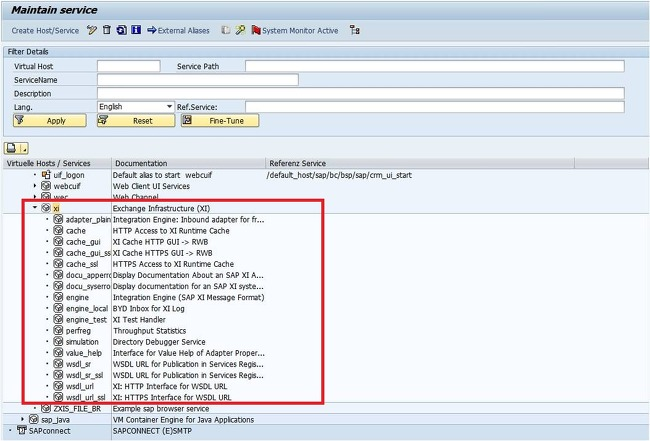

# FIORI CERTI 정리

# UX 100

****

# Unit 1.

****

## What are the main principles of SAP Fiori? 

## (Choose the correct answers).

### Role-based 

### Adaptive 

### Simple 

### Coherent 

### Delightful

****

:book: UX100 - Unit 1 

https://experience.sap.com/fiori-design-web/design-principles/

****

## Which <u>dimensions</u> define SAP Fiori? (Choose the correct answers). 

### Concept 

### Design 

Performance 

### Technology.

****

:book: UX100 - Unit 1 

검증필요

****

## Which <u>platforms</u> support the integration of SAP Fiori? 

## (Choose the correct answers). 

### SAP Enterprise Portal 

SAP Process Integration 

SAP HANA Enterprise Cloud 

### SAP Cloud Platform Portal 

### SAP Cloud Platform Mobile Services.

****

:book: UX100 - Unit 1 

****

## Which <u>clients</u> can be used for SAP Fiori? 

## (Choose the correct answers). 

### Web Browser 

SAP Logon 

### SAP Fiori Client 

SAP Easy Access 

### SAP Business Client.

****

:book: UX100 - Unit 1 

****

## Which personalization element <u>refers to the application</u>? 

## (Choose the correct answer). 

Fiori Group 

Fiori Group Tile 

Fiori Catalog 

### Fiori Catalog Tile.

****

:book: UX100 - Unit 1 

****

## Which personalization elements can be <u>assigned to user roles</u>? 

## (Choose the correct answers). 

### Fiori Group 

Fiori Group Tile 

### Fiori Catalog 

Fiori Catalog Tile.

****

:book: UX100 - Unit 1 

****

## What is meant by the term data-driven navigation? (Choose the correct answer). 

### Data objects offer navigation links to dependent data objects and functions. 

???.

****

:book: UX100 - Unit 1 

(데이터 기반 탐색) 데이터 개체는 종속 데이터 개체 및 함수에 대한 탐색 링크를 제공한다.

****

# Unit 2.

****

## What is JavaScript Object Notation (JSON) 

## (Choose the correct answer). 

### JSON is a format definition to structure data transferred using web technologies 

???.

****

:book: UX100 - Unit 2 

JSON 은 웹 기술을 사용하여 전송되는 데이터를 구조화 하기 위한 format 정의 이다.

****

## Which apps are meant by the term legacy apps? 

## (Choose the correct answer). 

###  ABAP Transactions  /  Web Dynpro ABAP applications 

???.

****

:book: UX100 - Unit 2

https://www.munich-enterprise.com/en/sap-fiori)

****

## What is used as container for SAPUI5 apps in the ABAP repository? 

## (Choose the correct answer). 

### Business Server Pages (BSP) 

???.

****

:book: UX100 - Unit 2 

****

## Where are the <u>services for SAPUI5 apps organized</u>? 

## (Choose the correct answer). 

### Internet Communication Framework (ICF) 

???.

****

:book: UX100 - Unit 2 

****

## What is the central frame application of SAP Fiori? (Choose the correct answer). 

### SAP Fiori launchpad 

???.

****

:book: UX100 - Unit 2 

****

## Which OData option grants access to the service definition? 

## (Choose the correct answer). 

### $metadata 

???.

****

:book: UX100 - Unit 2 

****

## What are the app types of SAP Fiori? 

## (Choose the correct answers). 

### Transactional 

### Analytical 

Smart 

Principal 

### Fact Sheet.

****

:book: UX100 - Unit 2 

http://blog.sap-press.com/sap-fiori-apps-for-sap-s4hana-sd

****

## What does CRUD stand for? (Choose the correct answer). 

### Create, Read, Update, Delete 

???.

****

:book: UX100 - Unit 2 

******

# Unit 3.

****

## What is SAP S/4HANA? (Choose the correct answer). 

### The fourth generation of the SAP Business Suite based on SAP HANA renewing enterprise business 

???.

****

:book: UX100 - Unit 3 

****

## What is used in SAP S/4HANA to read data from the database? 

## (Choose the correct answer).

### ABAP Core Data Services (CDS) 

???.

****

:book: UX100 - Unit 3  

****

## Which system part provides the analytical data in SAP S/4HANA? 

## (Choose the correct answer). 

### SAP S/4HANA Embedded Analytics 

???.

****

:book: UX100 - Unit 3 

https://www.scirp.org/journal/paperinformation.aspx?paperid=77387

****

## Which data processing capabilities does SAP HANA combine? (Choose the correct answer). 

### Analytical / transactional 

???.

****

:book: UX100 - Unit 3 

검증필요

****

## Which ABAP repository element contains the service logic? (Choose the correct answer). 

### Data Provider Class (DPC) 

???.

****

:book: UX100 - Unit 3 

https://boy0.tistory.com/159

model provider class(MPC) : service metadata 를 위환 코딩을 제공

****

## Which system holds the SAP Fiori launchpad? (Choose the correct answer). 

### Front-End Server (FES) 

???.

****

:book: UX100 - Unit 3 

****

## How is the implementation of Fiori apps delivered by SAP? (Choose the correct answer). 

### Updates of the back-end server 

???.

****

:book: UX100 - Unit 3 

****

## What is the data source definition for the SAP Fiori search? 

## (Choose the correct answer). 

### Search connectors 

???.

****

:book: UX100 - Unit 3 

https://help.sap.com/docs/SAP_FIORI_OVERVIEW/17ca92fbe8f54d9d8dfbe830cbb0c8d2/12af5252b10d5a64e10000000a423f68.html?version=4_S4H1909.01&locale=en-US

****

## Which system part provides the OData services for analytical apps? (Choose the correct answer). 

### SAP HANA e**<u>X</u>**tended application <u>S</u>ervices (XS) 

???.

****

:book: UX100 - Unit 3 

https://help.sap.com/docs/SAP_HANA_PLATFORM/52715f71adba4aaeb480d946c742d1f6/a6c0749255d84a81a154a7fc87dd33ce.html?version=2.0.03&locale=en-US

****

# Unit 4. 

****

## For intent-based navigation, what does an intent consist of? (Choose the correct answers). 

Target mapping 

### Semantic object 

### Action 

ICF path.

****

:book: UX100 - Unit 4 

https://help.sap.com/docs/SAP_HANA_PLATFORM/52715f71adba4aaeb480d946c742d1f6/5ff538515a2a455696f9c203939d9360.html?version=2.0.01&locale=en-US

****

## Which ABAP transactions can be used to analyze the intents used in target mappings? 

## (Choose the correct answers). 

/UI2/FSAC 

### /UI2/FLIA 

### /UI2/FLC 

/UI2/FLP

****

:book: UX100 - Unit 4 

FLIA : Fiori launchpad Intent Analysis

FLC : Fiori launchpad Check

****

## What is meant by the term legacy app descriptor? 

## (Choose the correct answer). 

### Assignment of tiles and target mappings     to transaction codes or Web Dynpro applications 

???.

****

:book: UX100 - Unit 4 

****

## Which layers of settings are available for SAP Fiori? 

## (Choose the correct answers). 

### Configuration 

### Personalization 

### Customizing 

Internationalization.

****

:book: UX100 - Unit 4 

****

## Which element groups Fiori apps based on <u>business topic</u>? 

## (Choose the correct answer). 

### Business Catalog Group (BCG) 

???.

****

:book: UX100 - Unit 4 

****

## Which element groups Fiori apps based on <u>business area</u>? 

business area 에 따라 피오리 앱을 그룹화하는 요소는 무엇입니까?

## (Choose the correct answer). 

### Technical Catalog (TC) 

???

****

:book: UX100 - Unit 4 

https://help.sap.com/docs/SAP%20Fiori%20launchpad/d4650bf68a9f4f67a1fda673f09926a9/af35d42e7d4f49d7b8e46080cd01c299.html?version=753.04&locale=en-US

**Technical Catalog** 

* 모든 앱의 저장소 역할
* application area 별 app 과 관련된 모든 대상 mapping 및 app launcher tile 이 포함된다. 
* Technical Catalog 는 사용자에게 직접 할당되지 않는다. 

**Business Catalog**

* Business roll 과 관련된 대상 매핑 과 app launcher tile 의 sample collection 이 포함되어있다.
* Business Catalog 의 content 들은 Technical Catalog content 의 하위 집합니다.
* 이 하위 집합은 특정 Business 사용자의 요구사항을 반영한다.  

Business catalogs contain a sample collection of target mappings and app launcher tiles relevant for a business role. The content of the business catalog is a subset of the content of the technical catalog. This subset reflects the requirements of a specific business user. 

****

## Which tool is used in an <u>S/4HANA</u> environment to model KPIs? (Choose the correct answer). 

### KPI Design 

???.

****

:book: UX100 - Unit 4 

https://www.sapbwconsulting.com/blog/5-kpi-design-best-practice-guidelines

검증필요

****

## Which tool is used in a <u>Suite on HANA</u> environment to model KPI? 

## (Choose the correct answer). 

### KPI Modeler 

???.

****

:book: UX100 - Unit 4 

https://help.sap.com/saphelp_ssb/helpdata/en/0d/7532521603f009e10000000a44166d/frameset.htm

****

## What does a KPI consist of? (Choose the correct answers). 

### Evaluation 

Authentication 

### Drill-down 

### Tile 

Indicator.

****

:book: UX100 - Unit 4

1. Create KPI 

2. Create **Evaluation** 
3. Create **Tile** 
4. Configure **Drill-Down** 
5. Manage KPI Associations (optional)

****

## Which tool provides the definition of Fiori tiles? (Choose the correct answer). 

### SAP Fiori launchpad designer 

???.

****

:book: UX100 - Unit 4 

****

## What can be used as target in a target mapping? (Choose the correct answers).

### Web Dynpro application 

### Generic URL 

### ABAP Transaction 

### SAPUI5 application.

****

:book: UX100 - Unit 4 

****

# Unit 5.

****

## Which system environments offer the UI theme designer? 

## (Choose the correct answers). 

### SAP Enterprise Portal 

### SAP NetWeaver Application Server ABAP 

### SAP Cloud Platform 

SAP NetWeaver Application Server Java 

SAP Business Intelligence.

****

:book: UX100 - Unit 5  

****

## Which terms are correct when talking about extensibility for SAP applications in a frontend server? (Choose the correct answers). 

SAP Gateway Redefinition 

CDS View Extension 

### SAPUI5 Extension 

ABAP Enhancement 

### SAP Fiori Elements Adaptation.

****

:book: UX100 - Unit 5 

****

## Where are the themes saved for the Fiori launchpad? 

## (Choose the correct answer).

### Theme repository in front-end server 

???.

****

:book: UX100 - Unit 5 

https://blogs.sap.com/2017/01/24/customizing-sap-fiori-launchpad-using-the-ui-theme-designer/

The UI theme repository on the ABAP frontend server contains SAP standard themes and custom themes. 

****

## Which design template is used for SAP Fiori 2.0? 

## (Choose the correct answer). 

### SAP Belize 

???.

****

:book: UX100 - Unit 5 

https://help.sap.com/docs/SAP_S4HANA_ON-PREMISE/8ec2dae34eb44cbbb560be3f9f1592fe/977672c6940f48578d08d770bee236f2.html?version=1709%20000&locale=en-US

* SAP Belize

  SAP Fiori 2.0

* SAP Blue Crystal

  SAP Fiori 1.0

* SAP High Contrsat Black

  접근성 목적으로 공개된 테마

  SAP Fiori 2.0 에서 적용되지 않는다.

* SAP Gold Reflection

  non-Fiori 독립 실행형 앱 용으로 공개된 테마

  SAP Fiori 1.0, 2.0 에서 적용되지 않는다.

****

## How do you enter the UI adaptation mode of SAP Fiori apps? 

## (Choose the correct answer). 

**Start app→ Me Area→ Adapt UI** 

???.

****

:book: UX100 - Unit 5 

https://blogs.sap.com/2018/05/12/fiori-for-s4hana-adapting-terminology-in-sap-fiori-apps-via-key-user-tools/

****

## How can you enable adaptation at runtime for SAP Fiori apps? (Choose the correct answers). 

### Target mapping to runtime authoring plugin 

Fiori catalog SAP_CA_BC_SSB 

### User role SAP_UI_FLEX_KEY_USER 

### Fiori catalog /UIF/SAP_RTA_PLUGIN 

User role SAP_S_RFCACL.

****

:book: UX100 - Unit 5 

https://help.sap.com/docs/UI_ADD-ON_FOR_SAP_NETWEAVER_20/17ae0e97e0fc424a9c368f350c0ba6bd/402b392585834dd38dd381d8f04b2616.html

검증필요

****

## What is SAP Screen Personas? 

## (Choose the correct answer). 

### A web-based layer for personalization of SAP GUI Dynpro and Web Dynpro ABAP 

???.

****

:book: UX100 - Unit 5 

SAP GUI 환경의 불편함(처음 사용자가 적응하기 힘들다. 사용하지 않는 항목이 노출되어 업무에 집중하기 힘들다 등등)을 해소하기 위해서 각 업무 환경에 맞게 화면을 단순화하거나 재배치할 수 있는 기능을 제공하는 것이 SAP Screen Personas 입니다.

https://www.avelon.be/news-blog/sap-screen-personas-versus-fiori

****

## What is created with SAP Screen Personas to change the structure of classical screens? 

## (Choose the correct answer). 

### Flavors 

???.

****

:book: UX100 - Unit 5 

https://www.avelon.be/news-blog/sap-screen-personas-versus-fiori

****

## Which UI clients does SAP Screen Personas support? (Choose the correct answers). 

### SAP Business Client 

SAP Fiori Client 

### SAP GUI for Windows 

### SAP GUI for HTML 

SAP GUI for Java.

****

:book: UX100 - Unit 5 

검증필요

****

# Unit 6. 

****

## What can be used as <u>middleware</u> to improve SAP Fiori for mobile? 

## (Choose the correct answer). 

sap Afaria

SAP Unwired Platform (SUP) 

### SAP Mobile Platform (SMP)

### SAP Cloud Platform Mobile Services.

****

:book: UX100 - Unit 6 

https://blogs.sap.com/2019/02/01/migration-to-sap-cloud-platform-mobile-services/

SAP Cloud Platform Mobile Services 가 SAP Mobile Platform 의 개선된 후속 모델 정도로 이해하면 될것 같다.

책 ux100 에는 smp 도 답으로 나와있다.

****

## Which benefits are offered by the SAP Fiori Client alone over a Web browser? (Choose the correct answers). 

### Full screen 

Offline data 

### Delta caching 

Push notifications 

### Attachment viewer.

****

:book: UX100 - Unit 6 

****

## What are the SAP Fiori for iOS design guidelines based on? (Choose the correct answer). 

### Apple Human Interface Guidelines (HIG) 

???.

****

:book: UX100 - Unit 6

****

## What is SAP Cloud Platform SDK Assistant? (Choose the correct answer). 

### Plugin for Apple Xcode to create ready-to-run Xcode projects for SAP Fiori 

???.

****

:book: UX100 - Unit 6 

****

## Which native capabilities of a mobile device can only be leveraged when using SAP Fiori for iOS? 

## (Choose the correct answers). 

### Touch ID 

Camera 

### Facetime 

### iBeacon 

Geolocation.

****

:book: UX100 - Unit 6 

검증필요

facetime / touch id / iBeacon 는 확인 된바 있다.

책에는

* facetime
* touch id 
* iBeacon
* Maps
* Notification
* Calendar
* Contacts

****

# Unit 7. 

****

## What is used as a container for SAP Fiori in an Enterprise Portal? 

## (Choose the correct answer). 

### Fiori iView 

???.

****

:book: UX100 - Unit 7 

검증필요

****

## What establishes a secure connection between on-premise systems and SAP CP? 

## (Choose the correct answer). 

### Cloud Connector 

???.

****

:book: UX100 - Unit 7 

****

## What is the central app to display Workflow items in SAP Fiori? 

## (Choose the correct answer). 

### My Inbox

???.

****

:book: UX100 - Unit 7 

검증필요

****

## Which shell configurations are available to adapt the header of the app? 

## (Choose the correct answers). 

encapsulated 

### embedded 

### standalone 

### headerless 

footless.

****

:book: UX100 - Unit 7 

https://help.sap.com/docs/SAP_S4HANA_ON-PREMISE/a7b390faab1140c087b8926571e942b7/537758e0deb0477386ea400c915073b3.html

****

## What is SAP Cloud Platform (CP)? (Choose the correct answer). 

###  SAP's platform-as-a-service (PaaS) providing in-memory database and application services 

???.

****

:book: UX100 - Unit 7

****

## In which system is the SAP Gateway workflow service implemented? (Choose the correct answer). 

### Front-End Server (FES) 

???.

****

:book: UX100 - Unit 7 

https://help.sap.com/docs/SAP_FIORI_OVERVIEW/1f0c69c2f76b445c98b89cc1f41d7ae4/6cb9b4c90de345ca9a6182049ee6f8da.html?locale=en-US

****

## Which service is responsible for OData services in the SAP CP? (Choose the correct answer). 

### SAP CP OData provisioning 

???.

****

:book: UX100 - Unit 7 

https://www.acorel.nl/2017/09/odata-provisioning-in-sap-cloud-platform-integration/

****

## 

UX399 67

UX400 43

UX402 78

UX403 43

UX410 81

