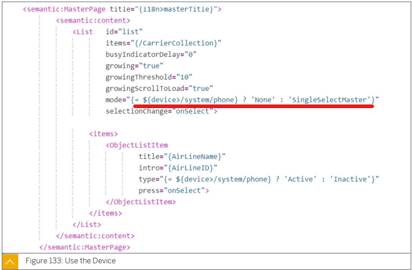
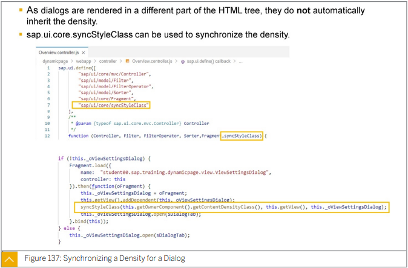
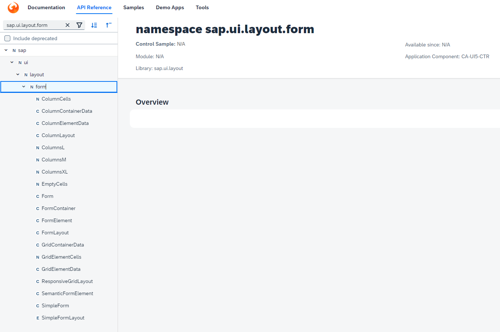
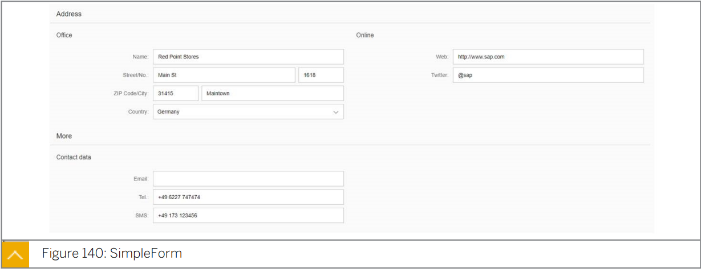
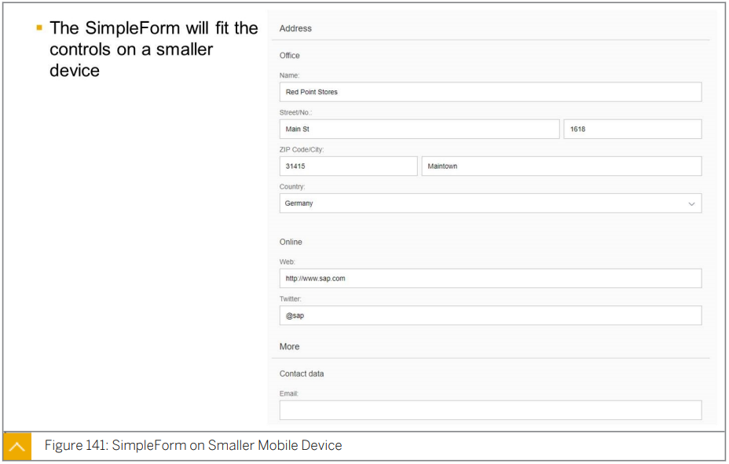
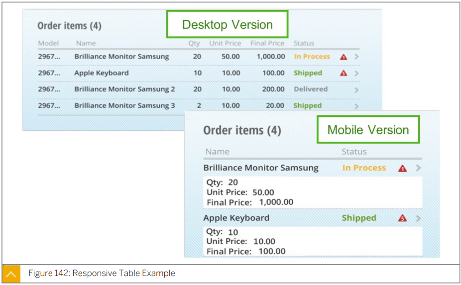
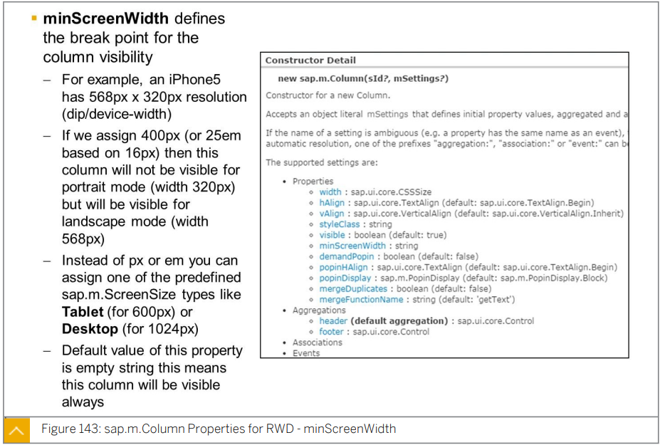

# 3. SAPUI5 Foundations

#### UX402 / UX400


the concept of modules

implement controls using the SAPUI5 framework (standard and custom)

bind Data to a UI5 Control; 

Describe and work with Key Responsive Design Controls:white_check_mark:

Translatable Texts

App Descriptor:white_check_mark:

Dialogs and Fragments:heavy_check_mark:

Custom Formatting

Filtering, grouping and sorting:heavy_check_mark:

work with diagrams.:heavy_check_mark:


## Explain MVC and application architecture

* ### Model

| Model              |    One-way     |    Two-way     |    One-time    |
| :----------------- | :------------: | :------------: | :------------: |
| **Resource model** |     **-**      |     **-**      | **X**(Default) |
| **JSON model**     |     **X**      | **X**(Default) |     **X**      |
| **XML model**      |     **X**      | **X**(Default) |     **X**      |
| **OData model**    | **X**(Default) |     **X**      |     **X**      |

* ### Binding

  https://blogs.sap.com/2020/11/17/data-binding-in-sapui5-2/

  #### Element binding

  #### Property binding

  #### Aggregation binding

  #### Expression binding

  * Expression binding 은 custom formatter functions 대신 표현식을 제공하는 향상된 binding 구문이다.
  * 함수의 정의하는 overhead 를 줄이고 formatter 함수에 값 비교와 같은 사소한 구현이 있는 경우에 권장된다. 
  * XML View 에서 `{=expression}` 을 통해 expression binding 을 지정한다.
  *  expression 은 `{=${embedded}}` 과 같이 지정된 expression 에 embedded 된 binding 을 제외하고 JavaScript expression 의 subset 을 준수한다.
  * 매우 복잡하고 읽기 어려운 표현식 대신 포맷터 기능을 사용하는 것을 권장한다.
  * Expression binding 을 사용하기 위해 configuration setting  xx-bindingSyntax 를 complex 로 설정하여야 한다.
  * 다음 Syntax element 들이 사용될 수 있다.
    * Literalsnumber / object / string / null / true / false
    * Grouping{= (expression) }
    * 단항 연산자 (!/+/-/typeof)
    * Multiplicative 연산자 (*,/,%)
    * Additive 연산자 (+, -)
    * Relational 연산자 (<, >, <=, >=)
    * Strict equality (===, !==)
    * Binary logical operators (&&, ||)
    * Conditional operator (삼항연산자) ?
    * `{= ${/firstName}.length}`
    * Math, RegExp and encodeURIComponent

  

* ### Controller

  * ### Hook Method

    ### onInit  

    ### onExit 

    ### onAfterRendering

    뷰가 렌더링 되면 호출

    ### onBeforeRendering.

    onAfterRendering 과 비슷하지만 onInit() 이 사용되기 전이 아니라 컨트롤러의 뷰가 다시 렌더링 되기 전에 호출 된다.

    onInit => onBeforeRendering => View Rendered => onAfterRendering 

    => 

    Re-rendering => onBeforeRendering   

    View destroy => onExit


## Component and Application Descriptor

* ### Component

  A component is a self-contained and reusable piece of code in an SAPUI5 application. Components are classified into the following two types:

  * UI components
    UI components have an associated UI part in addition to the application logic.
    These components inherit from the sap.ui.core.UIComponent class. An SAP Fiori app is an example of a UI component.
  * Faceless components
    Faceless components are code-only parts without any UI. They inherit from the sap.ui.core.Component class. For example, all the attachment-related functionality can be handled by a faceless component and reused across SAP Fiori apps.

  SAP Fiori apps are component-based apps, which means that in an SAP Fiori launchpad, an SAP Fiori app is represented by a component. Thus, components are entry
  points to SAP Fiori apps. Each SAP Fiori app will have one primary component,
  which will be registered with the SAP Fiori launchpad so that this component gets
  loaded upon clicking the corresponding SAP Fiori tile in the SAP Fiori launchpad.

* ### Metadata

  Before SAPUI5 version 1.30, a component’s metadata property was used to store several app-related settings and properties. From version 1.30, a new application descriptor file called manifest.json was introduced, and all app-specific settings were moved to that file. Component.js will contain a reference to manifest.json, as shown in Listing 3.13, directing the SAPUI5 framework to fetch settings from there.

  ```js
  sap.ui.core.Component.extend("certification.fiori.Component", {
    "metadata": {
        "manifest": "json"
    }
  });
  ```

  * ### init

    This method will be called only once per component instance while the component is getting initialized. This method is rarely called explicitly; rather, it’s called automatically by the SAPUI5 framework. You can use this method to perform any one-time operations related to the component or the app.

  * ### createContent

    As the method name indicates, this method creates the content of the component. This method should return a hierarchy of SAPUI5 controls, representing the UI part of the component.

### manifest.json

다양한 구성 및 속성을 가진 파일이다. W3C 사양인 웹 앱 manifest 에서 영감을 받았다.

표준에 따르면 manifest 파일은 개발자가 app 의 속성을 제어하고 애플리케이션 관련 메타 데이터를 저장할 수 있는 중앙 장소를 제공하는 JSON 기반 파일이어야한다.

manifest.json 파일은 Component.js 와 동일한 수준의 SAPUI5 app 루트에 생성해야한다. 

OData 모델이 인스턴스화 될 때마다 먼저 모델의 메타데이터를 로드한다. manifest.json 의 속성을 사용하여 메타데이터를 미리 로드하여 앱 성능을 향상 시킬 수 있다. JSON 및 XML 모델의 경우, 데이터 소스가 외부 URL 에서 온 경우, 사전 로드 기능은 구성 요소 로드와 함께 전체 데이터를 로드하므로 성능이 향상된다.

그러나 데이터가 앱 내에서 로컬에 있는 경우 component-preload.js 에서 데이터를 이미 사용할 수 있으므로 사전 로드 기능은 의미가 없다.

동일한 이유로 리소스 모델에 사전 로드 기능을 사용하면 안된다. 


| Attribute Name             | Attribute Description                                        |
| -------------------------- | ------------------------------------------------------------ |
| **sap.app**                | **응용 프로그램 별 특성을 포함**                             |
| sap.app.id (필수)          | SAP Fiori App 의 네임 스페이스                               |
| sap.app.type               | 구성하려는 앙목을 정의                                       |
| sap.app.i18n               | resource bundle 파일 경로                                    |
| sap.app.title              | 앱의 resource bundle 에서 참조하는 app 제목                  |
| sap.app.description        | 응용 프로그램이 수행하느 간단한 설명 텍스트                  |
| sap.app.applicationVersion | 응용 프로그램 버전                                           |
|                            |                                                              |
| **sap.ui**                 | **UI 관련 속성 제공**                                        |
| sap.ui.technology          | UI 기술을 지정 SAPUI5 사용                                   |
| sap.ui.deviceTypes         | 앱에서 지원하는 기기 기본값은 모두 true                      |
|                            |                                                              |
| **sap.ui5**                | sap.ui5 네입 스페이스는 SAPUI5 에 의해 자동으로 처리되는 SAPUI5 관련 구성 매개 변수를 추가 |
| rootView                   | component 가 자동으로 view 를 인스턴스화 하고 이것을 루트로 사용 |
| dependencies               | app에 사용 된 UI 라이브러리를 선언                           |
| models                     | 설명자의 이 섹션에서는 app 이 시작될 때 SAPUI5 에 의해 자동으로 인스턴스화 될 모델을 정의<br/>로컬 resource bundle 을 정의 할 수 있다. 모델 "i18n"의 이름을 키로 정의하고 namespace 로 번들 파일을 지정한다. <br/>이전 단계에서와 마찬가지로 번역된 텍스트가 있는 파일은 i18n 폴더에 지정되고 i18n.properties 로 이름이 지정된다. |
| routing                    | 아래서 설명                                                  |


143 참조

### In-App Navigation 

 hash-based navigation 으로 탐색이 가능하다.

이러한 해시 기반 탐색을 intent-based navigation 이라고도 한다.

intent 는 # 뒤에 시작하며 다음 구문을 가진 세 부분으로 구성된다. 

`<semantic object> - <action> ? <parameter> = <parameter value>`


* #### Semantic Object

  비즈니스 개체를 나타내는 문자열이다.

  여기에 의미 있는 이름을 지정하면 사용자가 URL을 이해하는데 도움이 된다.

  

* #### Action

  하이픈을 사용하여 semantic object 뒤에 따르는 이 문자열은 현재 응용 프로그램에서 semantic object 에 대해 발생할 동작을 나타낸다.

  작업의 예로 CRUD 작업이 올 수 있다.

  semantic object 와 발생할 action 의 조합은 SAP Fiori app 에서 unique 해야한다.

  예를 들어 구매 주문 작성 응용 프로그램은 구매 주문-작성 응용프로그램으로 지정된다.

  semantic object 와 action 은 SAP Fiori catalog 의  target mapping 을 사용하여 SAP Fiori App 에 연결된다.

  

* #### Parameter

  파라미터는 비즈니스 개체 의 인스턴스를 지정하고 이 비즈니스 개체의 특정 인스턴스를 화면에서 여는데 사용된다.

  파라미터는 선택사항이다.

  파라미터가 없는 경우 app 의 기본 화면이 열린다.

  `ex) /sap/bc/ui5_ui5/ui2/ushell/shells/abap/Fiorilaunchpad.html?#PurchaseOrder-Display?OrderNumber=23443211`

  


### Routing

Routing 은 SAP UI5 의 개념으로 SAP Fiori 앱 (in-app navigation) 내에서 탐색 할 수 있다.

Routing 의 구성은 app 의 ***<u>application descriptor 라 불리는 manifest.json</u>*** 의 ***<u>sap.ui5 부분의 routing propery</u>*** 내부에 있다. 

Routing 에는 다음에서 설명하는 세가지 중요한 Subsection이 포함된다.

* #### Routing 의 세가지 Subsection

  ```js
  "routing": {
      "config": {
          "routerClass": "sap.m.routing.Router",
          "type": "View",
          "viewType": "XML",
          "viewPath": "kr.go.iitp.gr5.clb05.zuibrcstk.view",
          "controlId": "App",
          "transition": "slide",
          "bypassed": {
  
          },
  
          "async": true
      },
      "routes": [
          {
              "pattern": ":layout:",
              "name": "master",
              "target": [
                  "master",
                  "detail"
              ]
          },
          {
              "pattern": "detail/{product}/{layout}",
              "name": "detail",
              "target": [
                  "master",
                  "detail"
              ]
          },
          {
              "pattern": "detail/{product}/createApvDoc/{apvData}/{layout}",
              "name": "detailDetail",
              "target": [
                  "master",
                  "detail",
                  "detailDetail"
              ]
          }
      ],
      "targets": {
          "master": {
              "viewName": "Master",
              "viewId": "Master",
              "controlAggregation": "beginColumnPages"
          },
          "detail": {
              "viewName": "Detail",
              "viewId": "Detail",
              "controlAggregation": "midColumnPages"
          },
          "detailDetail": {
              "viewName": "DetailDetail",
              "viewId": "DetailDetail",
              "controlAggregation": "endColumnPages"
          }
      }
  }
  ```

  

  * #### config

    ```js
    "config": {
        "routerClass": "sap.m.routing.Router",
        "type": "View",
        "viewType": "XML",
        "viewPath": "kr.go.iitp.gr5.clb05.zuibrcstk.view",
        "controlId": "App",
        "transition": "slide",
        "bypassed": {
    
        },
    
        "async": true
    },
    ```

    routing 구성의 config 부분에서는 기본 routing 구성과 경로 및 대상에 대한 기본값이 포함되어있다.

    ***<u>routerClass</u>*** 는 routing 내 **표준 API 의 정의를 포함하는 클래스를 지정**한다.

    SAP는 **표준 routerClass sap.m.routing.Router을 제공**하며 여기서 표준 기능을 얻는데 사용할 수 있다.

    sap.ui.core.routing.Router 는 SAP 에서 제공하는 ***<u>또다른 Router Class</u>*** 이다.

    하지만 sap.m.routing.Router 에는 master 에서 detail 로 이동하는 동안의 전환 방향과 같은 모바일 앱 관련 기능이 포함되어있다.

    기능을 향상시키기 위해 표준 클래스를 확장하는 custom class 를 항상 사용할 수 있다.

    viewType/viewPath/controlId/controlAggregation 같은 기타 config property 들은 routes 와 target 아래 이러한 property 들의 기본값을 지정한다. 

  

  * #### routes

    ```json
    "routes": [
        {
            "pattern": ":layout:",
            "name": "master",
            "target": [
                "master",
                "detail"
            ]
        },
        {
            "pattern": "detail/{product}/{layout}",
            "name": "detail",
            "target": [
                "master",
                "detail"
            ]
        },
        {
            "pattern": "detail/{product}/createApvDoc/{apvData}/{layout}",
            "name": "detailDetail",
            "target": [
                "master",
                "detail",
                "detailDetail"
            ]
        }
    ],
    ```

    routes 는 앱 내에서 가능한 모든 탐색 목록을 지정한다.

    각 경로의 ***<u>name</u>***, ***<u>routing pattern</u>*** 과 pattern 이 일치 할 시 렌더링 할 하나 이상의 ***<u>target</u>*** 을 지정한다.

    경로 name 을 사용하여 URL 의 해시를 변경하지 않고 프로그래밍 방식으로 경로를 탐색할 수 있다.

    routing 구성에서 경로 정의 순서는 pattern matching 중에 중요하다.

    첫번째 match 후에는 router 구성의평가 되지 않으며 일치하는 경로로 이동한다. 

    

    route pattern 은 또한 필수 parameter 도 포함될 수 있다.

    예를 들어 `PurchaseOrder/{OrderID}` pattern 은 해시 PurchaseOrder/23123123 또는 PurchaseOrder/23123123 와 match한다.

    그러나 이 패턴에 대한 매개 변수는 필수 이므로 해시 PurchaseOrder 은 match하지 않는다. 

    

    parameter 는 ***<u>optional</u>***일 수도 있다.

    optional parameter 의 pattern 의 예시로는 `PurchaseOrder/:OrderID:` 를 들 수 있다..

    parameter 는 optional 이므로 이 패턴은 해시 PuchaseOrder 과 match 할 수 있다.

    

    query parameter 를 사용하는 것도 상황별(context-specific) 데이터를 전달하는 또다른 강력한 방법이다.

    `PurchaseOrder{?query}` pattern 을 예로 살펴보자.

    이 pattern 은 `PurchaseOrder?OrderID=12345` 와 match 된다.

    여러 query parameter 를 가질 수 있지만 이전 pattern 과 match하려면 query parameter 가 필수이다. 

    

    optional query parameter 과 match 하려면 `PurchaseOrder:?query:` pattern 을 사용할 수 있다.

    

    

    config 의 bypassed property 를 사용하여 구성된 경로 중 일치하는 경로가 없을 때 호출할 대상을 지정할 수 있다.

    `this.getOwnerComponent().getRouter().navTo("employeeDetails");` 

    navTo("employeeDetails"); 가 "employeeDetails" 라는 이름의 경로로 이동하는 동안 

    this.getOwnerComponent().getRouter() 는 router class 의 instance 를 획득한다.   

    

    또한 다음 parameter 를 사용하여 경로를 탐색할 수도 있다.

    다음 코드는 hash PurchaseOrder/23123123 로 이동한다.

    ```js
    this.getOwnerComponent().getRouter().navTo("PurchaseOrder", {
    	OrderID: "23123123"	
    });
    ```

    

    

    ***<u>경로가 일치하면 이벤트 routeMatched 가 트리거</u>*** 되며 이를 처리하도록 할 수 있다.

    다음 코드는 routeMatched 이벤트를 처리하는 방법과 routing parameter 를 가져오는 방법의 에재이다.

    ```js
    Var oRouter = this.getOwnerComponent().getRouter();
    
    oRouter.attachRouteMatched(function (oEvt){
        var orderId = oEvt.getParameter("OrderID");
    });
    ```

    위 코드를 시스템의 모든 경로에 대해 실행되며 특정 경로에만 반응하도록 만들 수도 있다.

    이 경우 handler function 에서 route name 을 체크하고 연관된 경우에만 반응하도록 할 수 있다.

    

    특정 경로에만 반응하도록 하는 다른 방법은 route instance 에서 attachMatched API 를 사용하는 것이다. 

    ```js
    Var oRouter = this.getOwnerComponent().getRouter();
    
    oRouter.getRoute("employeeDetails").attachMatched(function(oEvt){
        //Write your code here.
    });
    ```

    

    SAPUI5 는 URL hash 를 handling 하고 parsing 하는 Corssroad.js  open source js library 를 포함하고 있다.    

  

  * #### targets

    ```json
    "targets": {
        "master": {
            "viewName": "Master",
            "viewId": "Master",
            "controlAggregation": "beginColumnPages"
        },
        "detail": {
            "viewName": "Detail",
            "viewId": "Detail",
            "controlAggregation": "midColumnPages"
        },
        "detailDetail": {
            "viewName": "DetailDetail",
            "viewId": "DetailDetail",
            "controlAggregation": "endColumnPages"
        }
    }
    ```

    * viewId of the view instance.
    * viewLevel: You can use different levels to define the navigation direction, for example, the navigation from a lower view level to a higher view level leads to forward navigation. This is important for flip and slide transitions, where the slide animation should go from left to right or vice versa.
    * controlId of the control that is used to display the view (for example, app).
    * controlAggregation target aggregation to which the view is added. The NavContainer control, for example, has an aggregation called Pages and the shell container has Content.
    * parent: a view is created and added before the target view is added.
    * viewPath where the view is located in the app.
    * targetParent where the control is located.
    * clearAggregation specifies whether the aggregation should be cleared before adding the new view instance. When you use the sap.m.routing.Router the default is false, for sap.ui.core.routing.Router it is true.

    targets 는 경로가 끝날 수 있는 모든 가능한 view 를 지정하는 부분이다.

    target 들은 route 의 목적지를 지정하기 위해 하나 이상의 route 에 연결된다.

    target을 선택하면 viewName 으로 지정된 관련된 view가 initialize 되고 controlId ID 가 있는 컨트롤의 controlAggregation 에서 지정한 aggregation 에 추가된다. 

    view 를 찾는 동안 router 는 viewPath 에서 viewType type 의 view 를 찾는다. 

    

    transition property 를 통해 새로운 view 로 전환할때의 애니메이션 효과를 지정할 수 있다.

    값으로는 ***<u>slide(default) / flip / fade / show</u>*** 가 있다.  

    transition property 는 viewLevel property를 사용하여 사용할 transition 을 결정한다.  

    

    ***<u>transition / ControlAggregation / controlId / viewPath / viewType</u>*** 과 같은 property 들은 ***<u>router 의 config 에서 기본값</u>***으로 설정된다. 

    ```js
    "config": {
        "routerClass": "sap.m.routing.Router",
        "type": "View",
        "viewType": "XML", //기본값 설정
        "viewPath": "kr.go.iitp.gr5.clb05.zuibrcstk.view", //기본값 설정
        "controlId": "App", //기본값 설정
        "transition": "slide", //기본값 설정
        "bypassed": {
            
        },
    
        "async": true
    },
    ```

    

    controller 에서 API 를 호출하여 route 를 hit 하거나 URL hash 를 변경하지 않고 대상을 직접 탐색할 수 있다. 

    ```js
    this.getOwnerComponent().getRouter().getTargets().display("home");
    ```

    `this.getOwnerComponent().getRouter()` 는 router class 의 instance 를 가져온다.

    `getTargets()` 는 모든 target 을 가져오며 `display("home")` 은 home 이라는 name 의 target 을 display 한다. 


### Initialize Routing

App 전체에서 사용할 수 있도록 component 에서는 routing 은 명시적으로 initialize 되어야 한다. 

manifest.json 에 입력한 configuration 은 router 를 인스턴스화 하는 동안 로드된다. 

인스턴스화는 App 당 한번만 수행되므로 다음과 같이 Component.js 의 init 메서드에 배치된다. 

```js
init: function () {
    // call parent's init
    UIComponent.prototype.init.apply(this, arguments);
    // Initialize the router
    this.getRouter().initialize();
}
```


### Three different events that trigger navigation and subsequent steps

* URL 에 대한 hash 가 바뀔 때 (bookmark 입력 또는 선택), SAPUI5 framework 는 routing configuration 을 고려하여 App 에 display 할 target 을 선택한다.

* Router 의 navTo(`route_name`) method 가 호출되면 SAPUI5 framework 는 router configuration 을 고려하여 URL hash 를 업데이트 하고 구성된 target 으로 이동한다.

* getTargets().display(`target_name`) 가 호출 되면 SAPUI5 framewokr 는 router configuration 을 고려하여 지정된 target 으로 이동한다.

  이번에는 URL 해시가 변경되지 않는다. 


## Describe and work with Key Responsive Design Controls

* device API 는 디바이스 세부 사항에 대한 정보를 제공하는 API 이다.
* device API 는 sap.ui.Device class 에서 구현된다.


* ### Device-API , Access

  ```js
  init: function() {
      UIComponent.prototype.init.apply(this, arguments);
      this.setModel(models.createDeviceModel(), "device");
      ...
      ...
  }
  ```

  `component.js`

  ```js
  sap.ui.define([
      "sap/ui/model/json/JSONModel",
      "sap/ui/Device"
  ], 
      function (JSONModel, Device) {
          "use strict";
  
          return {
              createDeviceModel: function () {
                  var oModel = new JSONModel(Device);
                  oModel.setDefaultBindingMode("OneWay");
                  return oModel;
          }
      };
  });
  ```

  `model/models.js`

  SAP BAS 의 SAP UI5-app 템플릿을 사용할 때 IDE 는 프로젝트를 생성하는 동안 model 폴더에 models.js 파일을 생성한다.

  이 파일에는 createDeviceModel 함수가 포함되어있다.

  component 를 초기화 하는 동안 함수가 호출된다.

  위에서 볼 수 있듯 createDeviceModel 에 의해 반환되는 oModel 모델은 component 의 context 에 ***<u>ID Device 인 모델로 저장</u>***된다.

  즉 **app 의 모든 개발 측면에서 액세스 할 수 있다.**


* ### Device-API, Usage

  

  개발자는 UI controls 의 property 들을 device model 에 binding 할 수 있다.
  
  의 예에서는 sap.m.List 컨트롤을 device model 에 바인딩하여 데스크톱 및 phone 에서 올바른 동작을 지원하는 방법을 볼 수 있습니다.


* ### Content Density

  | Content Density | CSS Class          | Description                                                  |
  | --------------- | ------------------ | ------------------------------------------------------------ |
  | Cozy            | sapUiSizeCozy      | 앱 의 모든 컨트롤이 손가락 끝으로 누르기에 충분한 크기로 표시되어 있는 form factor<br/>터치 장치에서 사용<br/>이는 대부분의 control 특히 sap.m library 에 있는 control 의 기본 density 이다. |
  | Compact         | sapUiSizeCompact   | 터치가 아닌 마우스와 키보드를 사용하는 장치에서 실행되는 경우, 컨트롤 크기를 줄이면 화면에 표시할 수 있는 정보 밀도가 높아지는 form factor 이다.<br/>기본 컨트롤 영역이 3rem 에서 2rem 으로 줄어든다. |
  | Condensed       | sapUiSizeCondensed |                                                              |

  library 에 있는 control 들의 지원 density 는 API Reference 에서 확인할 수 있다.

  density 는 관련된 CSS class 에 의해 트리거 된다.

  즉 UI의 일부 또는 sap.m.Shell 내부의 다른 앱은 sap.m control 의 standard density  를 사용 할 수 있는 반면 다른 부분은 동시에 다른 density 를 사용할 수 있다.

  그러나 Compact density 로 설정된 UI part 의 sub-part 의 경우 CSS class 가 전체 HTML  하위 트리에 영향을 미치기 때문에 Cozy density 를 사용할 수 없다.

  dialog 와 다른 popup 들은 HTML document 의 root 에 위치하기 때문에 해당 element 들에 대한 CSS class 의 각각의 density로 설정해야한다.

  CSS class 는 하위 control 에만 영향을 준다.

  CSS class 를 추가하여 control 자체를 compact 또는 cozy density 로 만들 수는 없다.

  대신 parent container 에서 CSS class 를 설정해야한다. 

  

  * #### Synchronizing a Density for a Dialog

    dialog 는 HTML 트리의 다른 부분에서 렌더링 되므로 density 는 자동으로 상속되지 않는다.

    dialog 에 대한 관련 density 를 설정할지 여부를 결정하려면 view 와 동일한 check 를 수행하거나 convenience function sap.ui.core.syncStyleClass 를 사용하여야 한다.

    sap.ui.core.syncStyleClass 는 element 간의 style class 를 동기화 한다.

    이 함수는 CSS class name, source element, target element 등의 parameter 를 사용할 수 있다.

    

  


* ### Hiding/Displaying Controls Depending on the Device

  device-dependent 방식으로 control 의 visibility 를 결정하기 위해 다음 CSS class 를 사용할 수 있다.

  * #### sapUiVisibleOnlyOnDesktop

  * #### sapUiHideOnDesktop

  * #### sapUiVisibleOnlyOnTablet

  * #### sapUiHideOnTablet

  * #### sapUiVisibleOnlyOnPhone

  * #### sapUiHideOnPhone

  이러한 class 를 사용하여 visibility 를 지정 하는 것이 좋다.

  class 를 사용할 때 control 은 여전히 앱의 일부이지만 CSS 에 의해서만 숨겨진다는 것을 이해하는 것이 중요하다.

  일반적인 수준에서 visibility 를 관리하려면 device API 를 사용하여 visibility 속성을 제어하는 것이 좋다.

  이는 control 이 DOM 에 전혀 추가되지 않고 SAPUI5 에 의해 보이지 않는 것으로 처리된다는 것을 의미하기 때문이다. 


* ### Resopsive Web Design (반응형 웹 디자인)

  * #### 반응형 웹디자인이란?

    * 반응형 웹 디자인은 사용자의 컴퓨터 화면 해상도에 따라 layout 이 원활하게 변경될 수 있도록 도와주는 방식으로 웹 사이트를 개발하는 개념이다.
    * 반응형 웹 디자인은 모든 다른 type 의 화면에 대해 하나의 웹 app 을 유지 관리할 수 있도록 하는 웹 설계 접근 방식이다.
      * 별도의 모바일 앱이 필요 없다.

    * Common adaptations in RWD:
      * 작은 device 의 경우 text 가 더 작다.
      * 메뉴가 dropdown 으로 바뀐다.
      * 사진의 크기가 조정되거나 이동되거나 제거된다.

  

* ### RWD and SAPUI5

  SAPUI5 는 다양한 layout control 을 제공한다.

  layout control 은 sap.ui.layout 이라는 namespace 에 정의된다.

  app 의 목적에 따라 적절한 layout control 을 선택할 수 있다.

  sap.ui.layout namespace 의 모든 control 이 반응형인 것은 아니다.

  control 을 사용하기 전에 documentation 를 체크해야한다.

  

  form 기반의 UI 를 구현하기 위해 SAPUI5 프레임워크는 sap.ui.layout.form namespace 를 제공한다.

  

  * #### SimplForm

    

    SimpleForm 은 간단한 양식을 만들 수 있는 사용하기 쉬운 API 를 제공한다.

    SimpleForm 내부에서 Form control 은 FormContainers 및 FormElements 와 함께 작성되지만 API 의 complexity 는 제거된다.

    

    SimpleForm UI control 은 화면 크기에 맞게 요소를 정렬한다.

    

  * #### Implementing Responsive Tables

    

    반응형 테이블 을 구현하는 것은 큰 과제이다.

    열이 많은 대형 테이블은 작은 화면에 맞지 않다.

    SAPUI5 는 다음과 같은 두가지 기능을 제공한다.

    * Column-based solution – column hiding.
    * Row-based solution – pop-ins.

    

    * #### sap.m.Column Properties for RWD

      

      기본적으로 column 은 항산 표시된다.

      이 property 를 설정하면 control 이 screen 의 최소 너비를 확인하여 해당 열을 표시하거나 숨긴다.

      특정 CSS 크기를 지정할 수 있으므로 sap.m.ScreenSize enumeration (e.g: "Phone", "Tablet", "Desktop", "Small", "Medium", "Large", ....) 를 사용할 수 있다.

      sap.m.Column.MediaQuery1->Range1 = 199.

      이 property는 반응형 설계에 사용할 수 있다.

      

      * #### demandPopin Property

        minScreenWidth property 를 통해 해당 열을 표시하거나 숨길 최소 화면 너비를 정의한다.

        demandPopin 을 true 로 설정하면 해당 열을 숨기지 않고 popup 으로 표시한다.

        기본값은 false 이다.

        

  * #### Predefined CSS Margin Classes

    * **Single-Sided Margins**

      `sapUi<Size>Margin<Direction>`

    * **Two-Sided Margins**

      `sapUi<Size>Margin<Direction><Direction>`

      Direction 에는 TopBottom / BeginEnd</u>** 가 들어갈 수 있다.

    * **Responsive Margins**

      `sapUiResponsiveMargin`

      응용 프로그램이 스마트폰, 태블릿 및 데스크톱에서 실행되어야 하는 경우 사용 가능한 화면 너비에 따라 여백을 선택하는 것이 유용할 수 있다.
      SAPUI5는 이제 CSS 클래스 sapUiResponseiveMargin과 함께 제공되며, 이는 바로 이를 수행한다.

    * **Clear Margin- reset the margin to standard**

      `sapUiTinyMargin`, `sapUiSmallMargin`, `sapUiMediumMargin`, `sapUiLargeMargin`

    * **Remove Margin**
      `sapUiNoMargin<Direction>`

    * **Full Margins **

      If you would like to clear an area **all around your control**, use one of the following margin classes:

    Size 에는 ***<u>Tiny: 8px /  Small: 16px /  Medium: 32px / Large 48px</u>*** 가 들어갈 수 있다.

    Direction 에는 ***<u>Top / Bottom / Begin / End</u>*** 가 들어갈 수 있다.

  


