# 5. OData and Advanced Data Handling

#### UX410

Register OData Service at Frontend Server

describe an oData Model and how to access backend data by the way of OData-specific data binding feature

implement data binding using XML data:white_check_mark:

describe the OData Write-Support

OData Deep Inserts :white_check_mark:

perform tasks associated with adding

updating and deleting backend data from within a SAPUI5 application

implement a Facet Filter control:white_check_mark:


in App Navigation => X :white_check_mark:

deep Linking. **=> X**:white_check_mark:


## UX 402 Unit3 


## <u>M</u>odel <u>P</u>rovider <u>C</u>lass (MPC)

***<u>DEFINE</u>*** 은 서비스의 metadata 를 query 할 때마다 호출 되는 entry method 이다.

이 메서드에는 서비스 내의 다양한 ***<u>artifact 를 정의하는 코드가 포함</u>***되어있다.

DEFINE 메소드는 이후에 class 에 나열된 다양한 다른 method를 호출한다. 

서비스의 각 entity 에 대해 각 method 가 있음을 알 수 있다.

이러한 각 method 에는 entity 내부의 각 property 와 해당 property 에대한 annotation 이 포함되어있다.

Method ***<u>DEFINE_ASSOCIATIONS</u>*** 는 다양한 entity 간의 모든 연결 과 모든 엔티티에 대한 탐색 속성을 정의하는 코드를 가지고 있다.

DEFINE_COMPLEXTYPES 에는 Model 이 필요한 모든 complex type 을 정의하는 코드가 있다.

MPC 에는 서비스의 각 entity 에 대한 type 선언도 있으며 flat type 과 table type 에 대해 각각 하나씩 있다.

이러한 type 들은 DPC 에서 service runtime 을 구현하는 code 를 짜는 동안 사용할 수 있다.


## <u>D</u>ata <u>P</u>rovide <u>C</u>lass (DPC)

MPC 와 달리 이 클래스에는 여러가지 entry method 가 존재한다.

서비스에서 호출된 작업에 따라 다양한 DPC method 가 호출된다.

단일 레코드를 읽는 경우 GET_ENTITY이 호출되며

entity 를 생성하는 경우 CREATE_ENTITY 가 호출된다.

파일을 다운로드 하는 경우 GET_STREAM 메서드가 호출된다.

SAP Gateway Service Builder 런타임 개체를 생성할 때 각 ENTITY 의 서로 다른 작업에 대한 추가 METHOD 를 생성한다. 


## $Batch

UI 는 여러 정보를 한 번에 Update 하기 위해 back-end 에 여러번 호출할 준비가 되어있다. 

이러한 경우 Batch 요청을 사용할 수 있다.

배치 요청은 여러 요청을 **하나의 HTTP POST** 요청에 결합한다.

배치 요청은 OData: URI 규약에 설명된 대로 service 의 `$batch` endpoint 에 대한 단일 HTTP POST 요청으로 제출된다.

$Batch 는 여러 HTTP 요청을 제거함으로써 UX 의 속도를 높일 수 있다.


Batch request body 에는 여러 Query / Change operation 이 포함될 수 있다.

또한 데이터 일관성을 유지하려면 변경 요청 집합이 **모두 성공하거나 하나라도 실패시 Rollback** 해야 하는 시나리오가 있다. 

이러한 단일 요청 그룹을 **changeset** 이라 한다.

단일 changeset 은 **다른 changeset 을 <u>포함할 수 없다</u>**.


Batch request 의 response body 에는 각 **Retrieve / Change operation** 에 대한 응답을 포함된다.

back-end 가 Batch request 를 처리할 수 있는 한 response status code는 202-Accepted 이다. (개별 요청 상태는 중요하지 않음)

changeset request 의 response body 는 성공 또는 실패를 나타내는 단일 응답이거나, 성공적인 처리의 경우 내부의 각 변경 집합 작업에 대해 하나의 응답을 가질 수 있다.

change set request 의 **어떤 하나라도 실패 한다면** **<u>error 를 포함한 한개의 response</u>** 만이 있다.    

* ### Implementation: SAP Gateway

  **<u>Batch 호출에는 구현이 필요 없다.</u>** 

  SAP Gateway framework 는 각 Retrieve 또는 Update 작업에 해당하는 API 를 호출한다. 

  Batch 요청 내의 여러 <u>***Retrieve 작업은 서로 독립적***</u>이기 때문에 **성능을 최적화**하기 위해 **<u>병렬로 실행</u>**된다. 

  <u>**configuration 을 사용**</u>하여 서비스 또는 전 시스템 에서 **<u>병렬화를 비활성화</u>** 할 수 있다.

  changeset 내의 전체 작업 집합이 backend 의 단일 API를 사용하여 처리될 수 있는 경우 성능 관점에서 유용할 수 있다. 

  여러 작업을 한번에 처리할 수 있는 각 엔티티에 대해 SAP Gateway framework 에 정보를 제공하여 이러한 호출에 대한 일반 작업  performing method 들을 자동으로 호출하지 않도록 해야한다. 

  이는 `CV_DEFER_MODE` 라는 변수를 설정하여 메서드 `CHANGESET_BEGIN` 에서 수행되며, 변수 `CV_DEFERED_MODE` 를 true 로 설정한 후 framework 에서 method `CHANGESET_PROCESS` 를 호출하여 해당 구현 코드를 실행한다.

  마지막으로 `CHANGESET_END` 메서드에서 **<u>COMMIT WORK</u>** 를 호출하여 모든 변경사항을 커밋한다. 

  

  

* ### Implementation: SAPUI5 

  sap.ui.model.odata.v2.ODataModel 에서는 백엔드에 대한 모든 호출이 기본적으로 Batch 요청으로 전송된다.

  OData 모델을 인스턴스화 하는 동안 useBatch 매개 변수를 사용하여 이 기능을 비활성화할 수 있다. 

  SAP Fiori 앱의 manifest.json 파일에도 입력할 수 있다.  

  

  


## Grouping Batch Calls

CRUD 와 같은 OData V2 Model 의 API를 사용하여 작업이 트리거 될 때마다 각 API 에는 `groupid` 라는 **<u>*parameter*</u>** 가 있다. 

이는 OData 호출을 배치로 그룹화 하는 데 사용될 수 있다.

***<u>groupId 가 동일한 작업</u>***은 backend에 ***<u>단일 Batch 요청으로 번들</u>*** 된다. 

`groupid` 는 다음과 같이 바인딩에도 할당될 수 있으므로 동일한 `groupid` 를 가진 바인딩에서 트리거 되는 모든 요청이 함께 전송된다. 

```js
{
    path:"/SalesOrders", 
    parameters: {
        groupId: "myFirstGroup"
    }
}
```

이런경우 모든 배치 요청이 현 호출 스택의 마지막에 형성되며 전송된다.

groupid 가 할당 되지 않은 모든 작업은 기본 groupid 와 함께 그룹화된다.


그러나 배치 요청에 대한 보다 나은 control 필요할 수 있으며 특정 인스턴스에서만 배치 요청을 트리거할 수 있다.

SAP 는 이를 위한 API 를 제공한다.

control 된 방식으로 트리거해야 하는 모든 batchIds는 API setDeferredGroups에서 다음과 같이 지정해야 합니다.

```js
oModel.setDeferredGroups(["myFirstGroup", "myThirdGroup"]);
```


이제 특정 groupId 에 대한 배치 요청을 트리거 하려면 API submitChanges 를 호출하고 모든 요청을 그룹화 하는 groupId 를 지정해야한다. 

```js
oModel.submitChanges({
    groupId:"myFirstGroup",
    success: mySuccessHandler, 
    error: myErrorHandler
});
```

앞의 경우 batchId 를 myFirstGroup 으로 하는 요청만 단일 배치 요청으로 전송된다.


## Change Sets

여러 개의 변경 작업 (Create / Delete / Update) 을 작업의 단일 logical unit으로 전송해야 하는 시나리오

즉, 데이터를 일관되게 유지하려면 변경 작업이 모두 성공하거나 그렇지 않은 경우 변경 작업이 성공하지 말아야 하는 시나리오

 이러한 시나오에서 SAPUI5 는 groupIds 와 유사한 Change Sets 라는 개념을 제공한다.

모든 변경 작업에서 groupId 외에 changeSetId 도 지정할 수 있다.

changeSetId 가 동일한 모든 변경 작업은 배치 요청 내에서 단일 변경 집합으로 전송된다.

changeSetId 가 지정되지 않은 경우 각 변경 사항에는 고유한 changeSetId 가 존재하게 된다.


## Download/Get File

서버에서 첨부 파일을 표시하거나 다운로드 하는 것은 일반적인 요구 사항이다.

URL 마지막에는 $value 로 끝난다.

* ### Implementation: SAP Gateway

  이전 URL 이 호출 되면 DPC 에서 `/IWBEP/IF_MGW_APPL_SRV_RUNTIME~GET_STREAM` 메서드가 트리거된다.

  구현에서 첨부파일의 xstring content는  MIME type 과 함께 반환되어야 한다. 

* ### Implementation: SAP UI5

  파일의 xstring content 는 일반적으로 OData 모델의 API 를 사용하여 읽지 않는다.

  파일 content 를 가져오기 위한 URL 은 HTML iframe 태그의 src 속성 값으로 사용되므로 파일이 iframe 에 표시되거나 파일 형식에 따라 다운로드 된다. 


## Create/Upload Media

첨부파일을 서버에 업로드 하는 시나리오

첨부파일을 업로드 하기 위한 URL 은 Media entity set 으로 끝난다.

**<u>*request body*</u>** 를 **<u>*첨부 content로 하는 HTTP POST 요청*</u>**이다.

**<u>*HTTP request header*</u>** 에는 첨부 파일의 **<u>*MIME type 을 나타내는 Content-Type header*</u>** 가 포함되어야 한다.

slug header 에는 업로드할 파일의 전체 이름이 포함되어야 한다.

첨부에 성공하면 업로드된 첨부 파일에 대한 세부 정보와 함께 HTTP 응답 코드 201-Created 가 변환된다.

* ### Implementation: SAP Gateway

  이전 요청은 DPC에서 `/IWBEP/IF_MGW_APPL_SRV_RUNTIME~CREATE_STREAM` 메서드를 트리거한다.

  input structure  IS_MEDIA_SOURCE 는 Media content 를 MIME type 과 함께 포함한다.

* ### Implementation: SAP UI5

  파일 업로드 요청은 일반적으로 sap.ui.unified.FileUploader  와 같은 SAPUI5 파일 업로드 컨트롤에서 발생한다.

  

  


## Service Operations (???)

Entity 에 대한 이전 작업 중 하나가 요구 사항에 맞지 않는 경우 Service operations 또는 function imports 를 사용할 수 있다.

이러한 request 는 request body 는 없지만 GET(검색/수정불가) 또는 POST(수정) 유형일 수 있다.

Service operations에는 input parameter 가 있을 수 있으며 이 parameter는 호출 하는 동안 지정된다. 

다음은 통화 변환 작업을 수행하는 샘플 Service operation 이다.

`/sap/opu/odata/CIS2PR11/PR_SRV/ConvertCurrency?SourceAmount=25.00m&SourceCurrency='USD'&TargetCurrency='CAD'ration calling URL.`

Service operation 의 output 은 complex type / entity type / feed 일 수 있다.

service operation 을 성공적으로 실행하면 HTTP 상태코드는 200-OK 가 반환된다.

* ### Implementation: SAP Gateway

  Service operation 을 트리거하면 DPC 에서 /IWBEP/IF_MGW_APPL_SRV_RUNTIME~EXECUTE_ACTION 메서드가 호출된다.

  Service operation 름에 따라 다양한 구현을 여기서 작성할 수 있다.

* ### Implementation: SAP UI5

  ```js
  oModel.callFunction(
      "/CheckFlightFare", 
      {
          method: "GET",
          urlParameters: {
              carrierid: carrid,
              connectionid: connid,
              flightdate: fldate
          },
          success: function(oData, response) {
              ..........
          },
          error: function(oError) {
              ..........
          }
     }
  );
  ```

  


## OData Two-Way Binding

Two-Way Binding 은 OData Model 에서 지원되지만 기본적으로 One-Way Binding 을 사용한다.

기본적으로 Two-Way Binding 으로 인한 모든 Model 변경은 지연된다.

그들은 change 라고 불리는 공통된 그룹을 사용

한다.

submitChanges() 가 호출 될 때마다 change group 이 제출된다.

SAP UI5는 Two-Way Binding 에 따른 모든 작업을 다음과 같이 그룹 과 changesets 로 그룹화 할 수 있는 방법을 제공한다.

```js
oModel.setChangeGroups({
    "SalesOrder": {
        groupId: "myChangeGroup",
        changeSetId: "AllItemUpdates",
        single: false
    }
);
```

위 코드에서 entity type SalesOrder 의 양방향 바인딩으로 인한 모든 변경 요청은 groupId 를 myChangeGroup 으로, changeSetId 를 AllItemUpdate 로 지정한다.

***<u>single 이 true</u>*** 로 설정된 경우 ***<u>changeSetId 는 무시</u>***되며 각 변경 요청은 ***<u>고유한 changeSetId 를 가진다</u>***. 

다른 배치 요청과 마찬가지로, 해당 groupIds가 지연되지 않으면 각 변경 사항은 즉시 백엔드에 도달하여 changeset 의 목적을 무시한다. 

그러므로 이 시나리오에서는 groupId myChangeGroup 을 연기하는 것이 좋다.


사용자가 변경한 내용을 모두 취소하고 백엔드에 배치 요청을 발행 하지 않는 시나리오가 있을 수 있다.

이러한 경우 API resetChanges 를 호출 하여 모델의 모든 변경사항을 reset 할 수 있다.

변경 사항을 재설정해야하는 경로를 지정하여 엔티티 세트의 변경사항을 선택적으로 reset 할 수도 있다.

```js
resetChanges(["/Products", "/SalesOrder"]);
```


## Implement a Facet Filter

facet filter constrol (sap.m.FacetFilter) 는 일반적으로 사용자가 **필요한 데이터를 찾기 위해** **여러 패싯 또는 데이터 값을 따라 이 데이터를 *<u>동적으로 필터링</u>*** 하기 위해 사용한다. 

facet filter control 에 사용되는 필터는 dependency 를 관리할 수 있다.

즉, 필터를 사용할 때 다른 패싯 목록의 필터를 사용하거나 사용하지 않도록 설정할 수 있다.

* ### Type of Facet Filter

  FacetFilter 는 FacetFilter 인스턴스의 property type 을 사용하여 전환할 수 있는 두가지 variants 를 지원한다.

  * ### Simple Type

    이 필터는 **<u>*기본 type의 facet filter*</u>** 이며 **<u>*데스크톱 및 태블릿에서만 사용*</u>**할 수 있다.

    active facet 은 도구 모음에서 클릭 가능한 버튼으로 사용할 수 있다.

    

    그림과 같이 이러한 facet 중 하나를 클릭하여 필터 값을 조정할 수 있다.

    

  * ### Light Type

    모바일 크기의 장치에서 자동으로 활성화되지만 **<u>*데스크톱과 태블릿에서도 사용할 수 있다*</u>**.

    facet filter 위에는 현재 패싯 목록과 이러한 패싯의 값을 표시하는 summary bar 가 있다.

    summary bar를 클릭하면 필터링에 사용할 수 있는 facet 목록이 표시된다.

    facet 중 하나를 선택하면 가능한 모든 값이 표시되며 필터링 할 수 있다.

    * showReset="true" 를 설정하면 필터 reset 버튼이 표시된다.
    * showPopoverOKButton="true" 를 선택하면 패싯 popup 을 닫기 위한 OK 버튼을 표시된다.
    * showPersonaliation="True" 는 패싯 수를 personalize 할 수 있도록 패싯 목록 제거 및 패싯 목록 추가 버튼을 표시한다.

    

  

  

  Simple type 과 Light type 의 주요 차이점은 facet 을 표시하는 방법에 있다.

  Simple type 을 사용하면 **<u>*패싯을 직접 선택*</u>**할 수 있지만 

  Light type 에서 Summary bar 를 클릭하면 **<u>*항상 모든 패싯이 나열된 동일한 팝업이 열린다*</u>**. 

  

  

* ### Content of Facet Filter

  패싯 필터의 패싯 수는 aggregation lists 에 의해 정의됩니다.

  이 aggregation 의 각 아이템은 sap.m.FacetFilterList type 이다.

  

  허용되는 패싯 수는 일반적으로 패싯 필터에서 정적이므로 

  FacetFilterList 인스턴스를 수동으로 생성하여 aggregation list 에 추가한다. 

  

  또 다른 일반적인 방법은 허용된 각 패싯에 대한 하나의 항목을 포함하고 aggregation list 에 바인딩된 JSON 모델을 갖는것이다. ???????

  

  하지만 패싯 수는 SAPUI5 컨트롤의 다른 aggregation 과 마찬가지로 OData 컬렉션에 바인딩 하여 완전히 동적으로 만들 수 있다. 

  sap.m.FacetFilterList 는 sap.m.List 를 확장한다.

  다음 표는 이 class 의 중요한 property 목록이다. 

  

  | Property | Description                                                  |
  | -------- | ------------------------------------------------------------ |
  | title    | 각 패싯에 표시될 이름을 제공한다.                            |
  | mode     | 한번에 하나만 활성화 할 수 있는지 (SingleSelectMaster) <br/>또는 여러 패싯을 활성화 할 수 있는지 (MultiSelect) <br/>여부를 결정한다. |
  | sequence | 도구 모음에서 활성 패싯의 상대적 순서를 제어한다.            |
  | active   | 활성 패싯만 Simple type 의 도구모음에 표시되는지 결정한다.   |
  | allCount | 모든 필터 항목이 선택된 경우 일치하는 데이터 세트의 레코드 수를 표시한다. |

  

  패싯의 유효한 값 수는 FacetFilterList 내의 aggregation list에 의해 정의된다.

  유효한 값이 매우 클 수 있기 때문에 item aggregation 은 일반적으로 JSON Model 또는 OData Model collection 에 바인딩 된다.  

  aggregation item 의 각 item 들은 sap.m.FacetFilterItem type 이 된다.

  sap.m.FacetFilterItem 은 sap.m.ListItemBase 를 확장한다.

  이 클래스에는 두 가지 주요한 속성이 있다.

  

  * #### key

    패싯 필터의 각 항목에 대한 고유 식별자이다.

  * #### text

    각 항목의 제목/이름 이다.


* ## Implementing a Facet Filter

  OData 모델과 패싯 필터에 대한 JSON 모델을 모델링 하는 방법

  패싯 필터의 뷰와 컨트롤러를 코딩하는 방법

  

  * ### Using the OData Model

    ***<u>패싯 수가 동적이고 OData 서비스에의해 결정 되어야 하는 경우</u>*** 패싯을 가져 오기 위한 ***<u>entity / entity set</u>*** 가 있어야 한다. 

    이 entity navigation 각 패싯에 유효한 값을 제공할 property 값을 가질 수 있으며.

    이 경우 FacetFilterList와 FacetFilterItem은 모두 다음 그림과 같이 OData aggregation binding 으로 채워집니다.

    

  

  

  * ### Using the JSON Model

    JSON Model 은 패싯 필터의 valid value 가 정적이고 제한적일때면 언제든 사용할 수 있다.   

    

    위 그림은 패싯 필터를 채우기 위한 JSON 모델의 예이다.

  

  * ### User Interface Code for Facet Filter

    실제 시나리오에서는 ***<u>패싯의 수는 일반적으로 정적이며 알려져있는</u>*** 반면

    각 패싯에 대한 ***<u>valid value 의 수는 일반적으로 백엔드 서버에서 가져온다</u>***. 

    다음은 SAP 에서 제공하는 OData 서비스 /IWBEP/GWSAMPLE_BASIC 을 사용하여 패싯 필터를 생성하는 예제이다.

    

    패싯의 수는 정적이며 다음 그림과 같이 생성된다.

    각 패싯의 valid value는 위 그림과 같이 aggregation binding 을 통해 가져온다.

    * #### Event in a Facet Filter

      * #### Confirm

        해당 이벤트는 사용자가 선택을 하고 ***<u>확인을 클릭하거나 팝업 외부를 클릭하여 패싯필터 목록 팝업을 닫을 때</u>*** 발생한다.

        이 이벤트를 사용하여 선택한 모든 패싯을 찾고 main list을 필터링할 수 있다.

      * #### Reset

        이 이벤트는 사용자가 활성화 상태의 ***<u>Reset icon 을 클릭한 경우</u>*** 발생한다.

        이 버튼은 모든 패싯 필터 선택을 취소하기 위한 것이다.

        이 이벤트를 사용하여 main list 에 binding 을 필터링 하고 있는 모든 필터를 제거할 수 있다.

        

      추가로 sap.m.FacetFilterList 에서 다음 이벤트들을 사용할 수 있다.

      

      * #### Reset

        패싯 필터의 Reset 이벤트와 마찬가지로 ***<u>패싯 필터의 도구 모음에 있는 Reset icon 에 의해 트리거</u>*** 된다. 

        이 이벤트 핸들러는 현재 적용된 모든 필터를 제거한다.

        removeSelections(true) method 를 사용하여 모든 필터를 제거할 수 있다.

      * #### List Close

        이 이벤트는 사용자가 ***<u>선택을 완료하고 패싯 필터 항목의 popup list 를 닫을 때 트리거</u>*** 된다. 

        이 이벤트는 패싯 필터의 confirm 이벤트와 동일하다

        하지만 서로 다른 패싯 필터 list 에서 서로 다른 method 를 트리거 하여 이 이벤트를 사용하여 패싯 별 코딩을 작성할 수 있다. 

      * ### List Open

        이 이벤트는 ***<u>패싯 필터 팝업이 열리기 직전에</u>*** 트리거 된다.

        이 이벤트를 사용하여 패싯 내의 유효한 필터 항목에 영향을 줄 수 있다.

        예를 들어 Category 와 Supplier 두가지 facet 을 고려해 보자 

        Category 패싯에서 하나 이상의 품목을 선택하고 사용자가 Supplier 패싯을 여는 경우

        해당 Category 의 제품을 공급하는 Supplier 만 표시되도록 할 수 있다.

        listOpen 이벤트는 ***<u>이러한 종속성을 처리하고 패싯 필터 목록 팝업의 list 를 필터링</u>*** 하는데 사용할 수 있다.

  

  * ### Controller Coding for the Facet Filter

    다음 그림은 confirm 이벤트 handler 를 설명한다.

    

    handleConfirm 은 confirm 이벤트의 event handler 이다.

    이 이벤트가 발생하면 선택한 필터 값에 대한 모든 패싯이 검사되고 SAPUI5 필터 개체가 생성된다. 

    

    다음 그림은 reset event handler 예재이다. 

    

    먼저 모든 패싯 필터 목록을 가져오고 선택한 키가 지워진다.

    다음 단계에서 빈 오류가 _applyFilter로 전달되어 메인 목록의 항목 바인딩에 있는 필터를 제거합니다.

    


## Deep Linking

SAP Fiori 는 SPA framework 를 따르지만 SAPUI5 routing 개념과 함께 hash 기반 탐색을 통해 사용자가 App 의 다양한 단계에서 bookmark 에 추가할 수 있도록 한다.

앱의 다양한 상태를 즐겨찾기에 추가하는 이 기능을 딥 링크라고 한다


* ### Bookmarkable Views and Business Objects

  다음은 특정 sales order 의 세부 항목을 display 하는 bookmark URL 을 원하는 예재이다.

  

  * sales order 번호를 지정하기 위한 필수 매개 변수 뿐 아니라 특정 패턴이 있는 hash/route 를 설계한다.

    

  * router 구성에서 sales order 를 display 하는 view 를 띄여주는 target 에 대한 pattern 및 route 를 지정한다.

    ```js
    "sap.ui5": {
        …..
    	"routing":{
    		"config" :{
    			…….
    		},
    		"routes":[
    			{
    				"pattern":"",
    				"name":"home",
    				"target":"home"
    			},
    			{
                    "pattern":"SalesOrderDetail/{OrderID}",
                    "name":"detail",
                    "target":"detail"
                }
    		],
    		"targets":{
                "home": {
                    "viewName": "Home",
                    "viewLevel": 1
                },
                "details": {
                    "viewName": "OrderDetail",
                    "viewLevel": 2
    			}
            }
    	}
    }
    ```

    `manifest.json`

    위 routes 의 두번째 pattern SalesOrderDetail/{OrderID} 에 match 되면 target "details" 에 도달해 OrderDetail view 를 띄운다.  

    

  * view controller 에서 설계된 route 의 attachPatternMatched 이벤트 설계한다

    event handler 에서 sales order 번호를 가져온다. 

    bindElement method 를 통해 sales order 번호를 사용하여 view에 binding 한다. 

    ```js
    onInit: function () {
        var oRouter = this.getRouter();
        oRouter.getRoute("detail").attachMatched(this._onRouteMatched, this);
    },
    _onRouteMatched : function (oEvent) {
        var oArgs, oView;
        oArgs = oEvent.getParameter("arguments");
        oView = this.getView();
        //Using the OrderID set the binding for the
        //OrderDetail view
        oView.bindElement({
            path :"/SalesOrders(" + oArgs.OrderID + ")",
            events : {
                dataRequested: function (oEvent) {
                	oView.setBusy(true);
                },
                dataReceived: function (oEvent) {
                    oView.setBusy(false);
                }
            }
        });
    }
    ```

    onInit event handler 에서 detail route 가 match 될 때 이벤트 핸들러 _onRouteMatched 가 연결된다. 

    _onRouteMatched method 에서 oEvent.getParameter("arguments") 는 모든 routing parameter 를 가져온다. 

    이러한 routing parameter 는 bindElement API 를 사용하여 orderDetail view 에 binding 하는데 사용될 binding path 를 구성하는데 사용된다. 


* ### Bookmarkable Tabs

  orderDetail view 에 sales order 정보를 구성하기 위한 탭이 여러개 포함되어있는 시나리오를 생각해 보자.

  네번째 탭에 중요한 정보가 있고 sales order detail 의 네번째 탭으로 직접 이동해야 하는 동료와 공유할 수 있는 URL 링크를 얻고자 할 경우가 있다.

  다음은 위 사례를 위해 optional 한 query parameter 를 사용하여 iconTabBar 컨트롤의 특정 탭으로 이동하는 방법이다.

  query parameter 는 tab 을 지정하지 않고도 detail 로 이동할 수 있기 때문에 optional 이다.

  

  * hash 를 설계한다.

    `SalesOrderDetail/{OrderID}/:?query:` hash 를 고려해 보자.

    여기서 query parameter는 `:?query:` 로 optional이라는 것을 알 수 있따.

    필수 query parameter 를 구성하려면 `SalesOrderDetail/{OrderID}/{?query}` 로 짜야 한다.

    다음 해시는 모두 오른 쪽 탭으로 이동해야 한다.

    또한 URL 을 통해 선택한 잘못된 탭에는 첫번째 탭이 표시 되어야 한다.

    ```js
    SalesOrderDetail/12345/?Tab=History
    SalesOrderDetail/12345/?Tab=Info
    SalesOrderDetail/12345/?Tab=Items
    SalesOrderDetail/12345/?Tab=Customers
    SalesOrderDetail/12345/?Tab=Invalid (invalid tab in the hash)
    ```

    * #### Note

      `:?parameter:` 필요한 만큼의 query parameter 를 전달할 수 있다.

      ```js
      SalesOrderDetail/12345/?Tab=History&Action=edit.
      ```

  * routing 구성에서 preceding pattern 을 지정한다.

    ```js
    "routes":[
        {
            "pattern":"",
            "name":"home",
            "target":"home"
        },
        {
            "pattern":"SalesOrderDetail/{OrderID}",
            "name":"detail",
            "target":"detail"
        },
        {
        "pattern":"SalesOrderDetail/{OrderID}/:?query:", //이부분
        "name":"detailTab",
        "target":"detailTab"
        }
    ],
    ```

  * view 에서 사용자가 이러한 탭중 하나를 선택할 때마다 URL 이 탭 선택을 반영하는 것이 중요하다.

    따라서 iconTabBar 에서 오는 `select` event 를 처리할 필요가 있다.

     또한 selectedTabKey property 는 iconTabBar 의 선택된 key 에 영향을 끼치는데 사용된다.

    

  * view 의 controller 에서 다음 작업을 수행한다.

    * 경로에서 일치하는 이벤트를 처리한다.

      event handler 에서 sales order 번호를 가져오고 view 를 sales order 에 바인딩 한다.

      또한 route 에서 query parameter 를 가져오고 (Tab) key 에 대한 parameter 를 가져오고 IconTabBar 의 selcetedkey 가 관련된 tab에 대한 탐색을 trigger 하도록 uiModel 의 selectedKey property 를 업데이트 한다.

    * _aValidTabKeys  array 를 사용하여 모든 관련된 tab key 를 저장하고 URL 에 허용된 탭 키만 포함되어 있는지 확인한다.

      잘못된 tab key 가 사용된 경우 첫번째 유효한 탭 키로 이동한다.

      이 변수는 view 의 onInit method 에서 정의 되는 것이 이상적이다.

    * iconTabFilter 의 select event 를 수신하는 listener 인 onTabSelect method 를 구현한다.

      사용자가 탭의 아무곳이나 클릭하면 routeer 에서 navTo API 를 사용하여 올바른 URL 로 이동한다.

      navTo API 호출시 올바른 route를 언급하고 sales order 번호와 (tab) key 를 query parameter 로 전달하는 것이 중요하다.

      사용자가 있는 오른쪽 탭을 반영하도록 URL 이 update 된다.  

      

    


* ### Bookmarkable “Search” Results

  master list 에서 sales order 를 검색하고 검색 결과를 공유할 URL 을 갖는 시나리오를 생각해 보자. 

  이 시나리오에서는 search term 캡처에도 optional query parameter 을 사용할 수 있다.

  관련된 Broad step 은 앞서 논의한 bookmarkable tab 과 동일하게 유지된다.

  

  * 새 route를 만들거나 master list 의 기존 route 를 수정하여 search string 을 유지할 수 있는 optional query parameter 를 처리한다. 

  * _onRouteMatched 함수에서 검색할 query parameter 를 가져오고 이 검색어를 사용하여 master list 의 binding 을 필터링한다.

    이 경우 search 이벤트를 식별하고 해당 handler 에서 router 의 navTo API 를 호출하고 step 1에서 지정한 경로로 이동한다.

    URL 이 수행 중인 검색을 반영하도록 search term 를 query parameter 로 전달해야한다.


* ### Bookmarkable Dialogs 

  Dialog 는 UI 의 중요한 component 이다.

  App 이 특정 dialog 를 표시할 때 응용 프로그램에 대한 link 를 bookmark 하거나 공유하려는 사례가 있을 수 있다.

  이 사용 사례는 또한 optional query parameter를 사용하여 달성되며, 기본 기술은 이전에 수행한 것과 동일하게 유지된다.

  

  * showMaterialDialog와 같은 선택적 쿼리 매개 변수를 사용하여 기존 경로를 편집하거나 새 경로를 추가한다.

  * _onRouteMatched 함수에서 쿼리 매개 변수를 가져오고 showMaterialDialog의 값을 가져온다. 

    만약 true 이면, 재료 대화상자를 열기 위한 코드를 작성

  * 사용자가 수동으로 값 도움말 버튼을 클릭하여 대화상자를 열면 navTo API를 사용하여 쿼리 매개변수 showMaterialDialog를 true로 전달하는 동안 경로로 이동한다.

  * 사용자가 수동으로 대화상자를 닫을 때 동일한 경로로 이동하되, 대화상자가 열려 있지 않음을 나타내도록 쿼리 매개변수를 전달하면 안된다.

  

  


## Important Terminology

* ### OData metadata

  metadata 는 서비스 내의 모든 OData artifact를 나열한다.

  meta data 는 OData service 와 그 기능을 이해나는데 도움이 된다.

* ### SAP Gateway Service Builder

  SAP ABAP 서버 내의 tool 로 Transaction SEGW 에 의해 열린다.

  OData 서비스를 구축하는 데 도움이 되며 OData 아티팩트를 구축하고 서비스의 런타임을 구현하기 위한 다양한 기능을 제공한다.

  * #### Model provider class (MPC)

    entities, properties, associations, Service operations 등을 포함하여 모든 OData 아티팩트를 정의하는 코드가 포함된다.

    이 클래스와 클래스 내부의 코드는 일반적으로 SAP Gateway Service Builder 에서 수행된 데이터 모델링을 기반으로 SAP Gateway Service Builder tool 에 의해 생성된다.

  * #### Data provider class (DPC)

    이 클래스는 OData 서비스의 각 작업에 대한 OData 구현 코드를 포함한다.
    MPC와 마찬가지로 이 클래스도 SAP Gateway Service Builder 도구로 생성할 수 있다.
    구현 코드는 일반적으로 각 작업에 대해 수동으로 작성된다.

* ### Deep Insert

  Deep Insert 는 OData service 에서 특수한 Create 작업이다.

  해당 작업은 entity instance 와 하나 이상의 child instance 를 생성한다.

  Request body 가 deep data 를 가지고 있는 경우 자동으로 DPC 의 CREATE_DEEP_ENTITY method 가 트리거 된다.

  fiori js controller 에서는 `Create` method 로 호출한다. 

* ### Facet filter

  이 control 은 list 및 table 을 필터링하는데 사용할 수 있는 SAPUI5 controller 이다.

  패싯 필터는 동적 패싯 또는 필터 뿐 아니라 여러개의 패싯 또는 필터를 갖도록 구성될 수 있다.

  이러한 각 패싯의 유효한 값은 동적이거나 OData service 에서 제공되거나 정적일 수 있다.


## Remote vs Local OData Services

* ### Use Case

  #### Remote Data 

  * 대부분의 App 은 Remote Data 를 사용하여 구축 된다.
    * 즉 Model 은 SAP System 과 같은 서버에 상주하고 SAP Gateway OData Service 를 통해 access 한다.
  * 사용자는 다음으로 구성된 OData Service 를 생성한다.
    * Collections
    * Properties
    * Associations
  * SAP UI5 App 에서 작성하는 code 는 이러한 Entity 를 사용한다.

  #### Local Data

  * 때때로 ***<u>오프라인으로 작업</u>***해야하는 경우 
  * <u>*개발 서버 **성능이 좋지 않은 경우***</u>
  * Back-end 서버 가 필요한 실시간 entity 없이 ***<u>빠른 test 를 수행</u>***하려는 경우 
  * Production App 에서도 사용될 수 있다.
  * Production App 은 remote requests으로 인한 overhead 를 견디는 대신 local 파일에서 일부 데이터를 가져올 수 있다. 
    * 예를 들어 local data 를 lookup table/list 에 사용할 수 있다.


* ### Accessing Metadata

  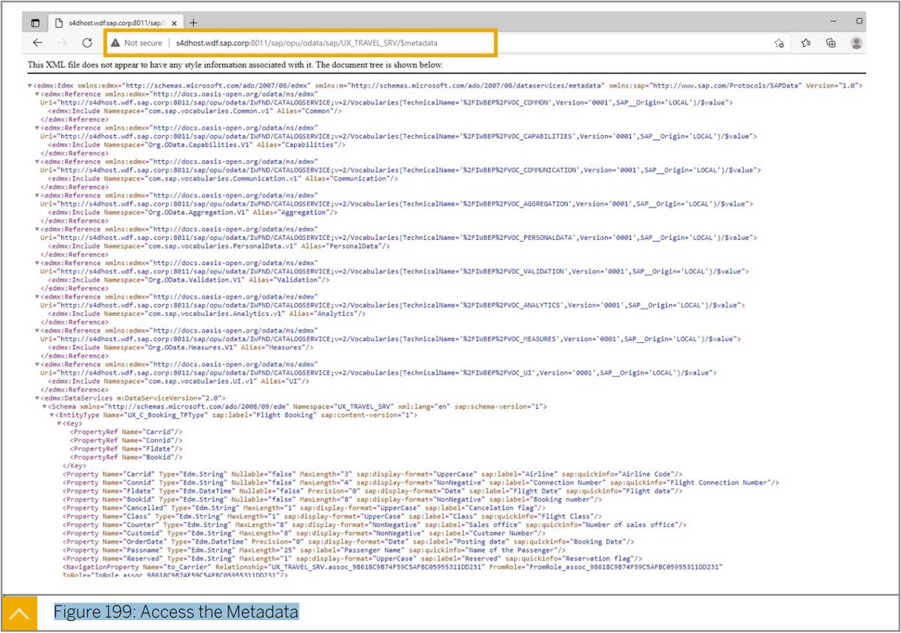

  기존 서비스의 metadata 를 가져오려면 $metadata option 을 OData-service 의 URL 에 추가해야한다.


* ### Adding metadata.xml to Project

  <u>***SAP BAS 를 사용**하는 경우 **metadata.xml 파일을 SAP UI5 project 에 수동으로 추가할 필요가 없다.***</u>

  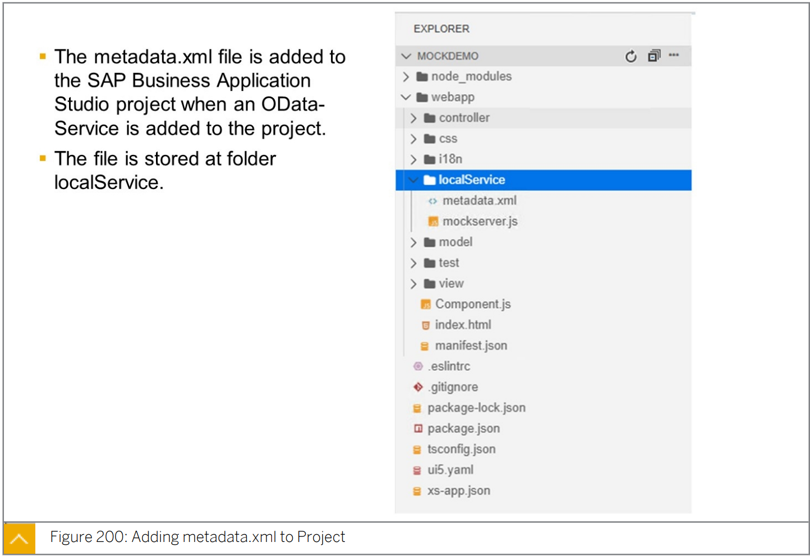

  다른 개발 도구로 작업하는 경우 위와 같이 `metadata.xml` 파일을 요청해야한다.

  (파일을 다운로드하여 프로젝트에 저장)

  파일은 ***<u>standard SAP Fiori project template 또는 SAP BAS</u>*** 의 ***<u>`Consume SAP Services` command 를 통해 추가</u>***한다.

  <u>***`command palette View → Find Command` / `CTRL+Shift+P`***</u> 를 통해 command를 찾을 수 있다.


* ### OData Model Editor

  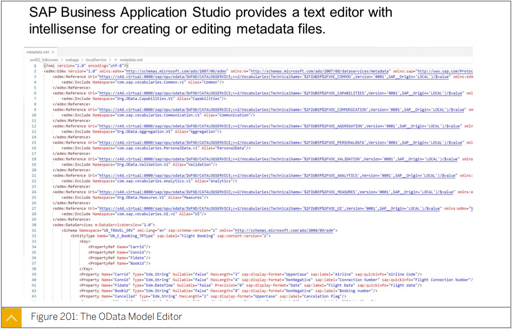

  OData-Service 기반 App 을 구현할 때 서비스 구현이 완료 되지 않았거나 이미 시작된 경우도 있다.

  기존 metadata file 을 조정하거나 새로 생성하기 위해 SAP BAS 는 text 기반 편집기인 ***<u>OData Model Editor 를 제공</u>***한다.


* ### Getting Local Data

  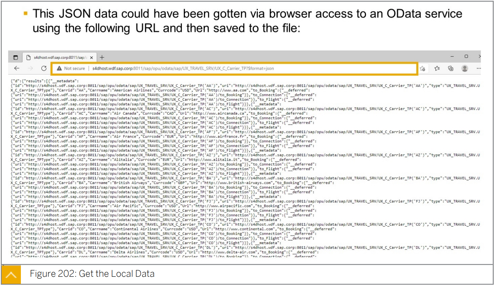

  JSON 형식의 backend 에서 데이터를 요청하기 위해 개발자는 서비스 URL 에 format=json 옵션을 추가할 수 있다.

  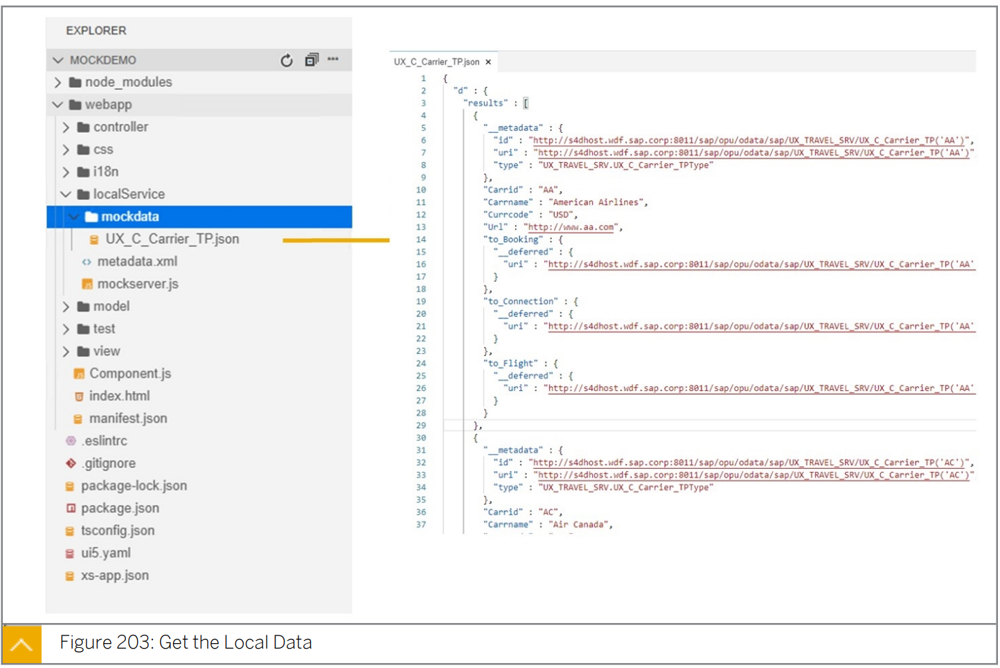

  요청한 business 데이터는 SAP UI5 프로젝트의 `localService/mockdata` 폴더에 저장하는 것을 권장한다.

  파일 이름은 entity set 의 이름을 반영해야하며 파일 형식은 json 이어야 한다.


* ### Using the JSON Model 

  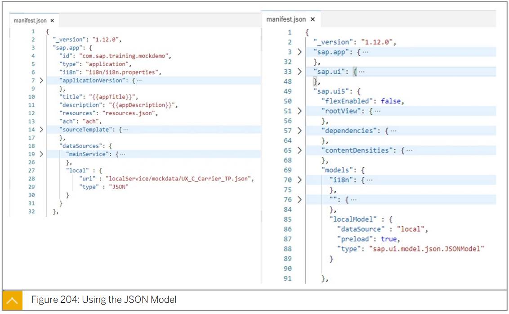

  ***<u>local JSON-file 을 사용하는 가장 구조적인 방법</u>***은 ***<u>`model.js` 파일에 javascript 함수를 구현</u>***하는 것이다.

  `model.js` 파일은 SAPUI5 project의 `model` 폴더에 있다.

  `model.js` 파일의 함수는 `sap.ui.model.json.JSONModel` type 의 새 instance 를 생성한다.

  constructor function 은 local JSON-file 의 경로를 가져오고, 새로 생성된  JSONModel-instance 는 caller에게 반환된다.

  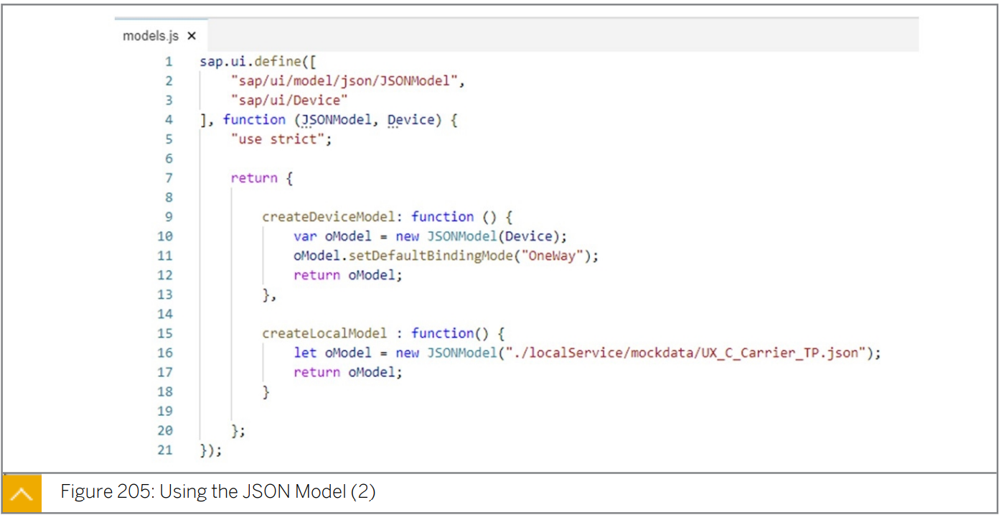

  models.js 파일의 function 구현은 ***<u>`Component` 의 init 함수에 의해 호출</u>***된다. 

  반환된 ***<u>JSONModel-object는 component 의 model context에 저장</u>***된다.

  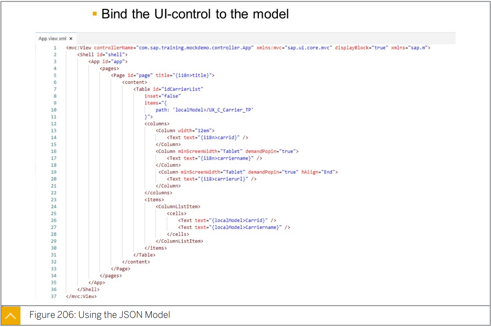


## Working with the Mock Server

* ### Using MockServer 

  Backend System 을 시뮬레이션 하기 위해 SAP UI5 는 ***<u>`sap.ui.core.util.MockServer` class 를 제공</u>***한다. 

  * `MockServer` class 참조

  * xmlf 파일에 metadata 준비

    기존 서비스를 사용하고,  `$metadata` command 를 사용하여 `<gw-server>/<gw-service>/$metadata` 와 같은 gateway client 에서 metadata 를 가져올 수도 있다.

  * Entity 의 JSON 샘플 데이터를 준비 해야 한다. 

    `<gw-server>/<gw-service>/<entitySet>?$format=json` 사용하고 metadata 를 삭제할 수 있다.

  * 브라우저를 사용하여 backend 에서 필요한 데이터를 요청하고 결과를 project 에 local 로 저장한다.

  적어도 ideal world 에서는 development phase 이전 에 모델링된 oData 서비스가 있을 것이다.

  그런 다음 프런트엔드 UI5 개발자가 SAP GW에서 oData 서비스를 실행하는 대신 mock server 를 사용하도록 할 수 있다.

  mock server 는 일부 샘플 데이터로 모든 oData 요청에 응답하므로 백엔드 개발자들은 ui5 개발자들이 작업을 중단하는 것을 두려워하지 않고 원하는 만큼 SAP GW를 실험할 수 있다.


* ### How the Mock Server Works

  #### Understanding the MockServer - Simple Example

  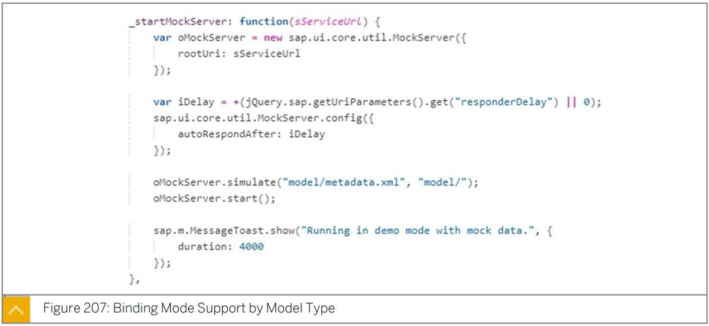

  위의 코드는 MockServer의 사용법을 직접 구현하는 방법을 보여준다.

  MockServer object 를 인스턴스화하는 동안 configuration parameter 로 URI를 ODataService에 전달해야 한다.

  이 URI에 대한 모든 요청은 MockServer에 의해 intercept 된다.

  MockServer 구현은 실행 중인 모든 MockServer 객체를 중앙에서 구성하는 정적 방법을 정의하며, 이 방법을 config라고 합니다.

  MockServer의 시뮬레이션 method 는 두 가지 parameter 를 가진다. 

  * 첫 번째 parameter : ODataService의 metadata 를 찾을 위치를 정의 
  * 두 번째 parameter : mock 데이터를 찾을 위치를 정의

  mock 데이터 파일은 JSON-files로 정의되며 파일의 이름은 반환되어야 할 EntitySet 의 이름이어야 한다.

  MockServer를 시작하려면 start-function 을 호출해야 한다.

  

  #### Understanding the MockServer - Complex Example

  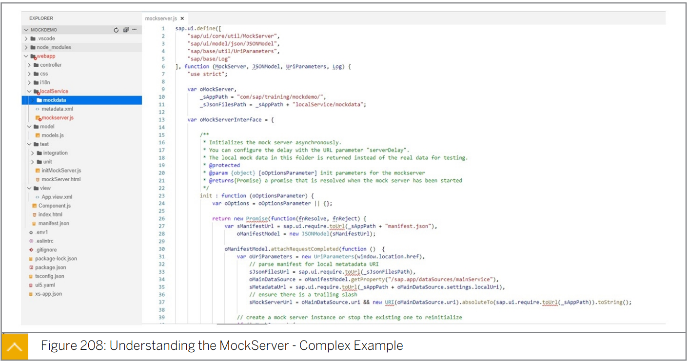

  SAP BAS 에서 사용되는 SAP UI5 프로젝트 템플릿은 기본적으로 Mock Server 구현을 제공한다.

  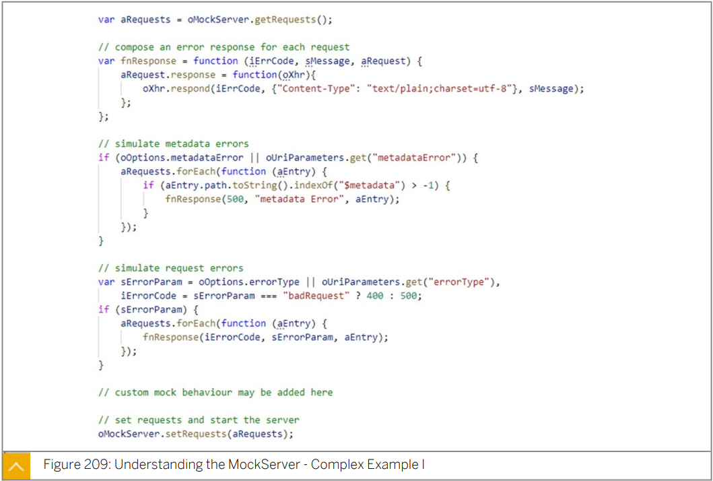

  MockServer를 사용하여 자체 request/response cycle 을 구현할 수도 있다.

  위의 code snippet 에서 예를 들어 mock 실행 중 metadata-file 이 발견되지 않았을 때 오류를 구현하는 방법을 볼 수 있다.

  

  

* ### Start the Application in Simulation Mode

  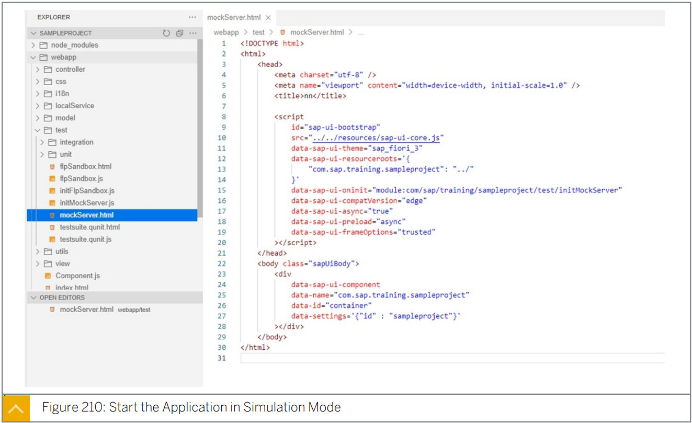

  Simulation Mode 에서 App 을 시작하려면 프로젝트에 ***<u>특정 시작 HTML 파일을 추가</u>***하는 것이 좋다.

  일반적으로 이러한 ***<u>starter file 은 test라는 폴더에 저장</u>***된다.

  위 슬라이드는 이러한 starter file 의 구현을 보여준다.


* ### The Mock Server in SAP BAS

  SAP BAS 는 MockServer 에서의 build를 제공한다.

  개발자는 다음을 구성해야한다.

  * <u>***OData Service 에대한 URI***</u>
  * <u>***local metadata.xml 파일의 경로***</u>

  SAP BAS 는 기존 mock 데이터를 생성하거나 수정할 수 있는 editor 를 제공한다.

  editor 에 액세스 하려면 local metadata.xml 파일을 선택하고 상황에 맞는 메뉴에서 `Edit Mock Data` 메뉴 항목을 선택한다.

  editor 를 사용하면 Data 를 생성하여 SAP UI5 프로젝트 내의 JSON 파일에 저장할 수 있다.

  Mock Data Editor 를 종료한 후에는 새로운 json 파일이 프로젝트 내에 저장된다.

  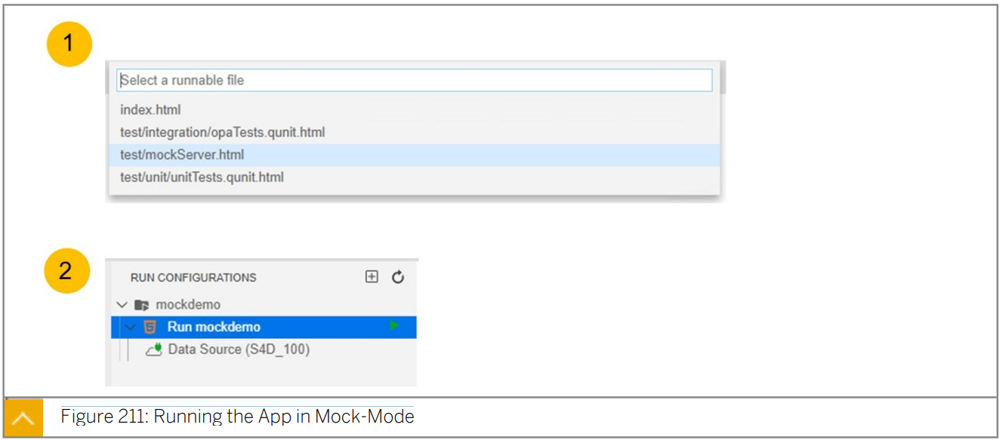

  App 을 시작하려면 simulation 을 위한 local json-file 을 제공해야 한다.

  Run Configuration view 로 전환하고 새 Run Configuration 을 만들고 `text/mockServer.html` 파일을 선택한다.

  두번째 단계에서는 data source 를 backend system 에 바인딩 하고 녹색 화살표를 클릭하여 run configuration 을 시작한다.

  The binding to a  datasource is necessary, this is not necessary because the data were loaded from the  backend, rather without the binding the application will not start. ?????

  시작 후 MessageToast 는 개발자에게 simulation 이 시작되었음을 알린다.


## Working with the ODataModel

* ### The OData Model

  Write Support = CRUD

  * create
  * read
  * update
  * delete

  OData Model의 경우 기본 바인딩 모드는 One-way 이지만 쓰기 작업을 지원하기 위해 Two-way 로 설정할 수 있다.

  OData는 ***<u>optimistic concurrency control 를 위해 HTTP ETag를 사용</u>***한다. 

  서비스를 제공하도록 구성해야 한다.

  ***<u>ETag는 모든 CRUD 요청에 대한 parameters map 내에서 전달</u>***될 수 있습니다.

  ***<u>전달된 ETag가 없는 경우 캐시된 entity 의 ETag가 이미 로드된 경우 사용</u>***된다.

  ***<u>cross-site request 위조를 해결</u>***하기 위해 OData 서비스는 클라이언트 App 의 ***<u>change request 에 XSRF token 요구할 수 있다.</u>***

  이 경우 클라이언트는 ***<u>서버에서 token 을 가져와 각 change request 과 함께 서버로 전송</u>***해야 한다.

  OData 모델은 ***<u>metadata 를 읽을 때 XSRF 토큰을 가져온 다음</u>*** 각 ***<u>write request header 와 함께 자동으로 전송</u>***한다.

  ***<u>token 이 더 이상 유효하지 않으면 OData 모델에서  refreshSecurityToken() function 을 호출</u>***하여 새 토큰을 가져올 수 있다.

  ***<u>token 은 service document 에 대한 request 과 함께 가져온다.</u>***

  유효한 token 을 가져오려면 ***<u>service document 가 cache 되지 않았는지</u>*** 확인하여야한다..


* ### XSRF Tokens

  #### Properties of XSRF Tokens

  * ***<u>사이트 간 request 위조 문제</u>***를 해결
  * ***<u>write requests (create, update, delete) 에 필요</u>***
  * 클라이언트는 서버에서 ***<u>XSRF token 을 가져온 다음 각 write requests 과 함께 전송</u>***해야 한다.
  * OData Model은 ***<u>metadata 를 읽을 때 XSRF token 을 가져와 각 write request header 에 자동으로 전송</u>***
  * ODataModel에는 이전 ***<u>token 이 유효하지 않을 경우 호출하여 새 XSRF 토큰을 가져올 수 있는 refresh method (refreshSecurityToken)</u>*** 가 있다.

  ODataModel 이 XSRF 토큰 fetch 를 수행하기 위한 constructor 에서 boolean argument 를 가져오는데 문제가 발생했다.

  연습의 예제는 custom request header 를 사용하여 XSRF 토큰을 가져왔다.

  이후 버전에서 작동해야 한다.


* ### Performing Create

  * Create 는 OData 서비스에 대해 ***<u>HTTP POST 작업을 트리거</u>*** 
  * App 은 사용할 ***<u>service collection 을 지정</u>***
  * <u>***데이터 payload 도 지정***</u>
  * <u>***Deep Create 는 지원되지 않는다.***</u>

  * #### Syntax:

    ```js
    create (sPath, oData, mParameters?) : object.
    ```

    * **`sPath`**

      항목을 생성해야 하는 OData collection

    * **`oData`**

      생성해야 하는 항목의 data

    * **`mParameters`**

      성공 및 오류 콜백 기능을 포함

  

  * #### The API Documentation

    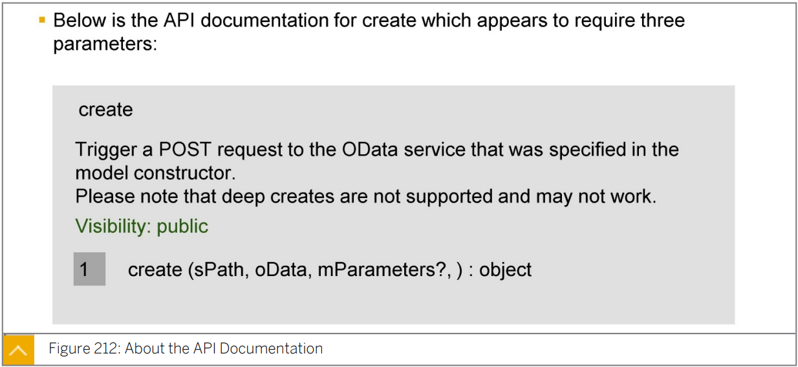

    * ***<u>`sPath`:</u>***  

      항목을 만들 collection 의 경로를 포함하는 string

    * ***<u>`oData`:</u>*** 

      생성해야 하는 항목의 데이터

    * ***<u>`mParameters`:</u>***

      다음 property 들을 포함하는 Optional parameter map 

      * ***<u>`context`:</u>*** 

        지정된 경우 sPath 는 context 로 함께 제공된 경로에 대해 ***<u>상대적 경로로 작성</u>***되어야 한다. 

      * ***<u>`success`:</u>*** 

        요청이 성공 했을 때 호출 되는 callback 함수이다.

        handler 는 ***<u>OData 및 response parameter 를 가질 수 있다.</u>***

      * ***<u>`error`:</u>*** 

        요청이 실패 했을 때 호출 되는 callback 함수이다.

        handler 는 ***<u>additional error information 을 포함하는 parameter `oError`</u>*** 를 가질 수 있다.

      * <u>***`urlParameters`:***</u> 

        query string 으로 전달될 parameter 를 포함하는 map

      * <u>***`headers`:***</u> 

        이 request 에 대한 header map
      
      * <u>***`batchGroupId`:***</u>
      
        ***<u>사용되지 않음</u>*** - ***<u>groupId 를 사용</u>***
      
      * <u>***`groupId`:***</u> 
      
        request group 의 ID 
      
        ***<u>동일한 그룹에 속한 요청은 하나의 일괄 request 에 번들</u>***된다.
      
      * <u>***`changeSetId`:***</u>
      
        request 가 속해야 하는 ChangeSet의 ID
      
      * ***<u>`refreshAfterChange` :</u>***
      
        이 change operation 을 제출한 후 ***<u>모든 binding 을 업데이트 할지 여부</u>***를 정의한다.
      
        `setRefreshAfterChange` 를 참조, 이 옵션이 지정된 경우 이작업에 대해서만 model-wide refreshAfterChange flag 를 재정의한다.
  
    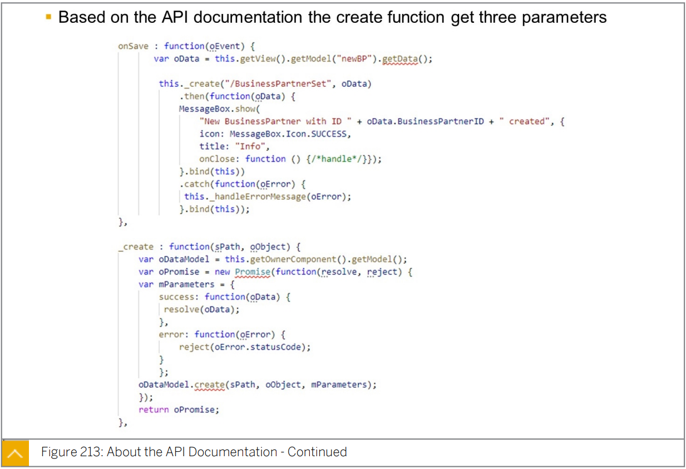
  
    위 예시는 create function 의 사용 예시이다.
  
    새 entry 이 EntitySet Business Partner Set 에 추가되어있다.  
  
    JSONModel 에서 가져오는 새 Entry 에 대한 데이터
  
    OData-Service 에서 지정된 entity 의 create method 가 호출된다.
  
    보다시피 구현은 Promise 를 활용하고 있다.
  
    success handler 를 보면 생성된 entity 의 data 는 backend 시스템에서 반환되며 생성된 ID 에 액세스 할 수 있다.
  
  
  
  * #### Handle Server Response After Create
  
    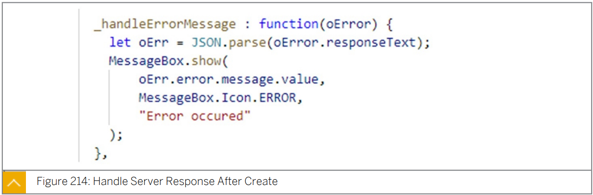
  
    백엔드의 response 를 처리하기 위해 두 개의 event handler 를 구현할 수 있다.
  
    success event handler 에서 볼 수 있듯이 새로 생성된 엔티티에 액세스할 수 있다.
  
    error event 에 대한 event handler 에서 지정된 object 를 통해 백엔드의 오류에 액세스할 수 있다.
  
  
  
  * #### Creating Entities
  
    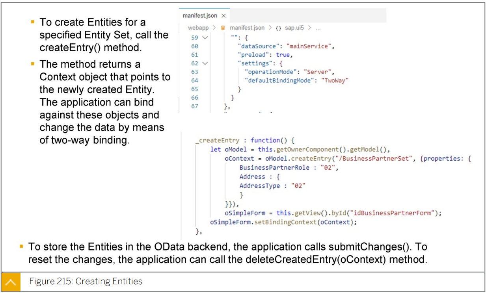
  
    App 은 생성된 object 에 포함될 속성을 선택하고 이러한 속성에 대한 자체 기본값을 전달할 수 있다.
  
    기본적으로 모든 속성 값은 정의되어 있지 않다.
  
    EntitySet 및 전달된 속성은 OData 서비스의 metadata 정의에 이썽야한다.


* ### Performing Read

  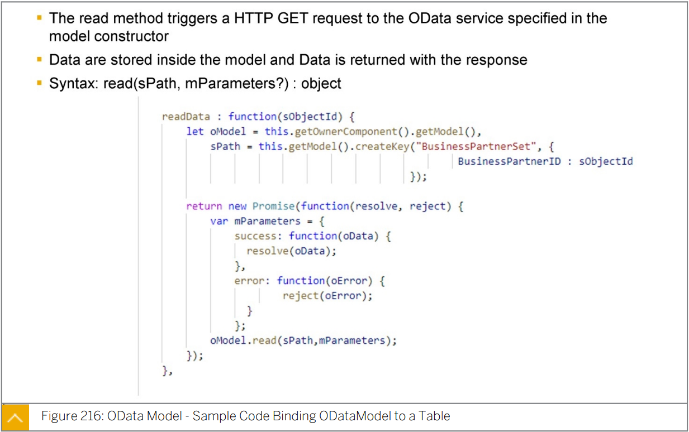

  * #### Arguments for read function 

    * ***<u>`sPath` :</u>***

      검색할 data 의 경로를 포함하는 string

      경로가 model contructor 에 지정된 서비스 URL 에 연결되어있다. 

    * ***<u>`mParameters` :</u>***

      다음 속성을 포함하는 optional parameter 이다.

      * ***<u>`context` :</u>***

        지정된 경우 sPath 는 context 로 함께 제공된 경로에 대해 ***<u>상대적 경로로 작성</u>***되어야 한다. 

      * ***<u>`urlParameters` :</u>***

        query string 으로 전달될 parameter 를 포함하는 map

      * ***<u>`filter` :</u>***

        `sap.ui.model.Filter` type 의 filter array 이다.

        request URL 에 포함될 filter

      * ***<u>`sorter` :</u>***

        `sap.ui.model.Sorter` type 의 sorter array 이다. 

      * ***<u>`success` :</u>***

        데이터가 성공적으로 검색되었을 때 호출되는 콜백 함수
        핸들러는 oData 및 response 매개 변수를 가질 수 있다.

      oData parameter 에는 검색된 데이터의 데이터가 포함된다.

      response parameter 에는 request 의 response 에 대한 추가 정보가 포함되어 있다:

      * ***<u>`error`:</u>*** 

        요청이 실패했을 때 호출되는 콜백 함수

        핸들러는 추가 오류 정보를 포함하는 parameter oError를 가질 수 있다.

      * ***<u>`batchGroupId`:</u>*** 

        ***<u>사용되지 않음 - 대신 groupId를 사용</u>***

      * ***<u>`groupId`:</u>*** 

        요청 그룹의 ID.

        동일한 그룹에 속한 요청은 하나의 일괄 요청에 번들


* ### Performing Update

  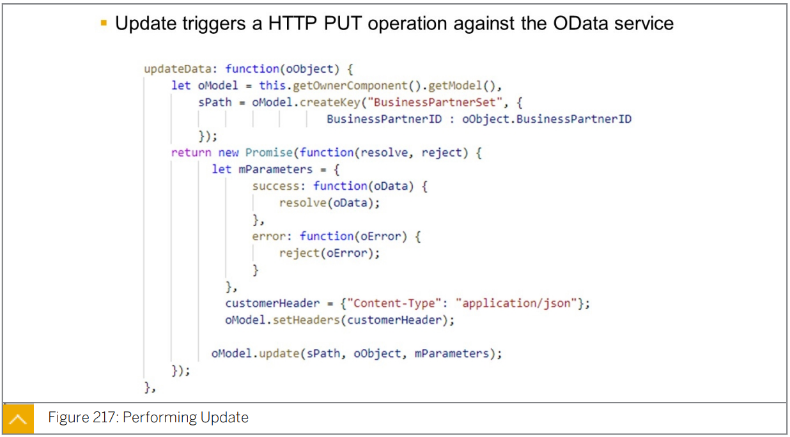

  `update()` function 은 model contructor 에 지정된 OData 서비스에 대한 ***<u>`PUT/MERGE` request 가 트리거</u>***한다.

  사용되는 update method 는 ***<u>기본값이 `sap.ui.model.odata.UpdateMethod.Merge` 인 global defaultUpdateMethod parameter 로 정의</u>***된다.

  ***<u>`PUT` request 에서 update request 를 보내려면</u>*** OData model 을 ***<u>instance화 할 때 defaultUpdateMethod 를 `sap.ui.model.odata.UpdateMethod.Put` 로 설정</u>***해야 한다. 


* ### Performing Delete

  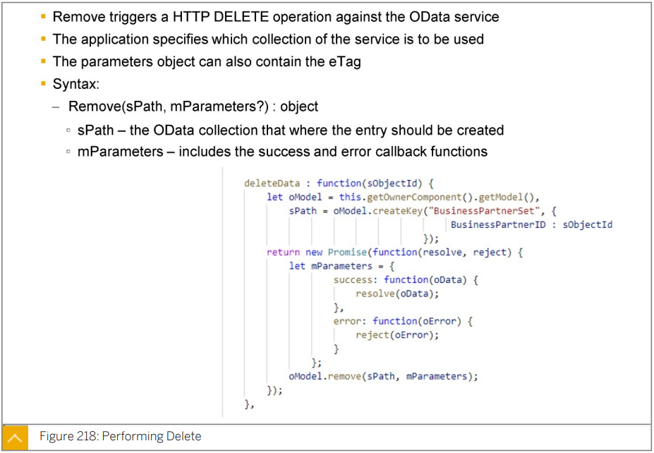

  backend 에서 entity 를 삭제하려면 ODataModel-object 에서 ***<u>`remove` function 을 호출</u>***할 수 있다.

  이 호출은 ***<u>HTTP `DELETE` 를 트리거</u>*** 한다.


* ### Refreshing the Model

  * Model 은 변경된 Entity 에 종속된 binding 을 자동으로 refresh 하는 메터니즘을 제공한다.

    `change`/`update`/`delete` function 을 수행하는 경우 model 은 binding 을 식별하고 이러한 binding 에 대한 refresh 를 trigger 한다.

  * ***<u>`oModel.setRefreshAfterChange(false);`</u>*** 을 호출하여 자동 ***<u>refresh 를 사용하지 않도록 설정</u>*** 할 수 있다.

    이렇게 하면 change 작업 후 모든 binding 이 자동으로 업데이트 되지 않는다.

    자동 refresh 가 비활성화 된 경우 App 은 ***<u>각 binding 을 refresh</u>*** 해야한다.

  * ***<u>`refresh()` function 은 OData 모델 내의 모든 data 를 refresh</u>*** 한다.

    ***<u>각 binding 은 서버에서 data 를 reload</u>*** 한다. 

    ***<u>수동 CRUD request</u>*** 를 통해 가져온 data 는 ***<u>자동으로 reload 되지 않는다</u>***.!!!


* ### Consideration for SAP Gateway Services

  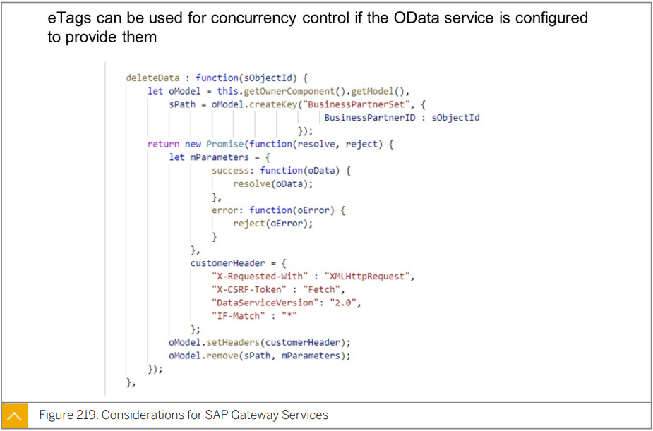

  ***<u>ETag(Entity Tag)</u>*** 는 HTTP/1.1 호환 웹 서버에서 ***<u>반환되는 HTTP response header</u>*** 로, 지정된 ***<u>URL 에서 리소스 내용의 변경을 결정</u>***하는데 사용된다.

  * ***<u>eTag 가 parameter 로 지정된 경우 If-Match header</u>*** 에 사용된다. 
  * eTag 를 지정하지 않은 경우 ***<u>entry 의 metadata 에서 검색</u>***된다. 
  
  > * #### eTag header
  >
  >   eTag header 는 요청 헤더가 아닌 응답 헤더 이다.
  >
  >   웹서버가 제공하는 컨텐츠들에 각각 부여되는 일종의 식별자 정보이다.
  >
  >   웹서버는 client 에게 컨텐츠를 제공할 때 ETag 정보를 같이 전달한다.
  >
  >   클라이언트와 프록시 서버들은 이 정보를 다음 요청 에 활용할 수 있다.
  >
  >   예로 캐시 기능에 활요할 수 있다.
  >
  >   웹서버는 사용자가 요청한 컨텐츠가 이전에 제공했던 컨텐츠인지 새롭게 제공할 컨텐츠인지를 구별할 수 있다.
  
  > * #### If-Match
  >
  >   요청 헤더의 한 종류로 헤더 값 으로 서버에서 제공해준 ETag 정보를 표기한다.
  >   
  >   https://withbundo.blogspot.com/2017/07/http-13-http-iii-if-match-if-modified.html
  


* ### Two-way Binding

  Two-way 변경사항이 있는 경우 UI 에서 데이터가 일관되지 않을 수 있으므로 filtering 및 sorting 할 수 없다.

  따라서 sorting 또는 filtering 을 수행하기 전에 변경사항을 제출하거나 재설정 해야한다.

  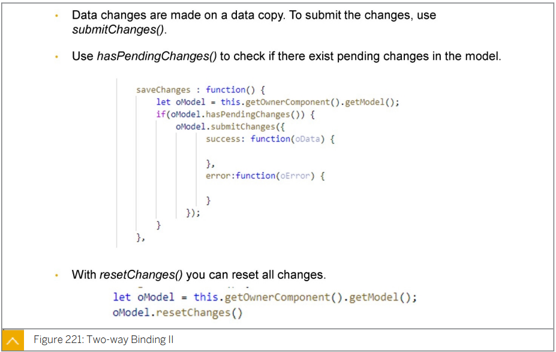

  Entity 경로 의 array 과 함께 `resetChange()` 를 호출하여 특정 entity 만 재설정할 수도 있다.

  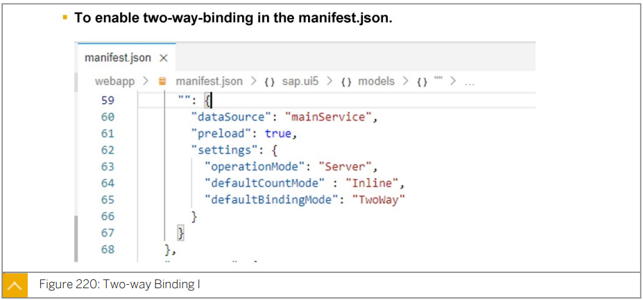

  Two-way Binding 은 manifest.json 파일내에서 구상할 수도 있다.


* ### Using Function Imports

  데이터 모델내에서 Function Import 를 생성하여 Service Builder 에서 이러한 additional service  operation 을 구현할 수 있다.

  예를 들어 다음 custom operations( : Work Item 확인 ) 에 대한 Function Import 를 생성할 수 있다.

  custom operation 을 호출하기 위해 새 Function Import 를 생성하는 것은 간단하지만 사용할 작업을 표준 ***<u>CRUD 작업을 사용하여 호출 할 수 있는 경우에는 Function Import 를 생성하지 말아야한다</u>***.

  즉 ***<u>standard operation 을 사용하여 호출 할 수 없는 custom operation 에 대해서만</u>*** Function Import 를 생성해야한다.

  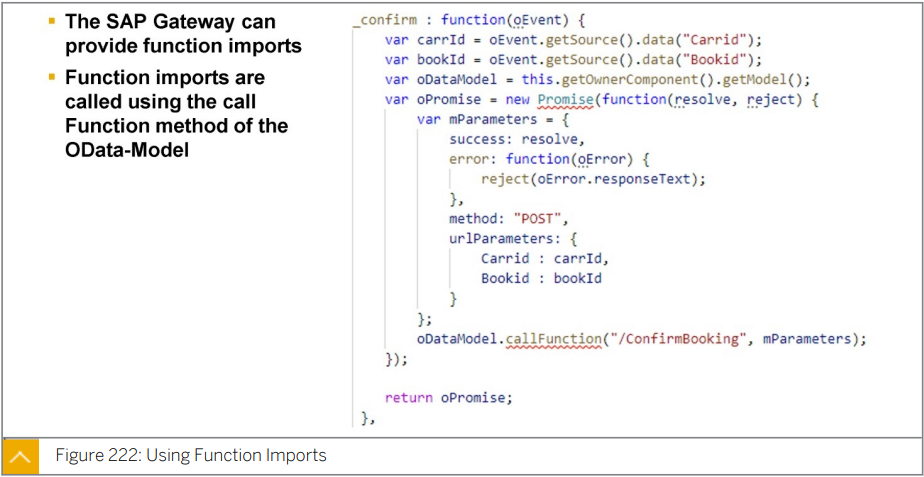

  Function Import 를 호출하기 위해 OData Model 은 `callFunction` method 을 제공한다.

  method 호출은 모델 constructor 에 지정된 Function Import OData 서비스 에 대한 request 를 트리거 한다.

  ***<u>Function Import 의 return type 이 entity type 이거나 etity type 의 collection</u>*** 인 경우 ***<u>변경사항이 model 에 반영</u>***된다.

  그렇지 않은 경우 무시되고 success 콜백 함수에서 response 가 처리될 수 있다.

  

  


## Practice

## 1. In an OData service, this is usually cached in the browser as well as in the SAP Gateway layer.❌

 A. Query

 B. Service operation

###  C. Metadata

 D. Read

****

metadata 는 서비스 ***<u>런타임중 자주 변경되지 않기 때문에</u>*** 일반적으로 캐시된다.

Query / Service operation / Read 와 같은 작업들은 사용자에게 실시간 데이터를 제공해야 하므로 캐시 되지 않는다.

****


## 2. Which of the following cannot be bookmarked in an SAP Fiori app?

 A. Filters

 B. Dialogs

 C. Tabs

###  D. None

****

* Views / Business Objects
* Tabs
* "Search" Results (Filters)
* Dialogs

****


## 3. Which of the following concepts is used to group multiple OData change requests as a single logical operation?❌

 A. Batch

 B. Group

###  C. Change set

 D. Expand

****

Change set 은 여러 change 들을 single logical group 으로 group 화 하는데 사용된다.

change set 은 batch request 내에 있어야 한다. 

****


## 4. If an OData operation does not fit into any of Create/Read-Query/Update/Delete, then which of the following options can be used?

 A. Function modules

###  B. Service operations

 C. Metadata update

 D. Deep Insert

****

CRUD 프레임워크에 맞지 않는 모든 작업은 service operations(또는 function import)를 사용하여 모델링할 수 있다. 

읽기 전용(GET)과 변경 작업(POST)이 모두 될 수 있습니다.

****

## 5. Within the MPC, which of the following methods is triggered upon metadata request.

###  A. DEFINE

 B. GET_METADATA

 C. DEFINE_META

 D. GET_ENTITIES


## 6. An $expand URL will contain which of the following to represent the child entities? 

## ❌확인필요 답은 a

 A. Child entity set name

###  B. Navigation property name

 C. Association name

 D. Child entity name


## 7. How does the SAP Gateway framework determine if the create request is a single entity create or a Deep Insert?❌

 A. URL contains navigation properties

 B. HTTP headers

 C. URL ends with key word “Deep”

###  D. Request body contains the parent as well as child Entity data


## 8. Which is the right place to declare router configurations?

###  A. manifest.json

 B. index.html

 C. Component.js

 D. router.js


## 9. Which events get triggered in a facet filter upon the user completing the selection of facet filter values (or closing the facet filter dialog)? (2 possible answers)

###  A. Confirm

 B. ListOpen

###  C. ListClose

 D. Reset

****


