# 6. Extensibility in SAPUI5

#### UX410

Describe the concept of Extensibility in SAPUI5 and Extension Points in SAPUI5, 

View Replacement

View Modification

View Extension

Controller Extension

Hook Methods

extend Translations with Customer Properties

UX410

Unit 13: SAPUI5 Flexibility

## Application Extensibility,  Introduction

* ### SAPUI5 Flexibility, an Introduction

  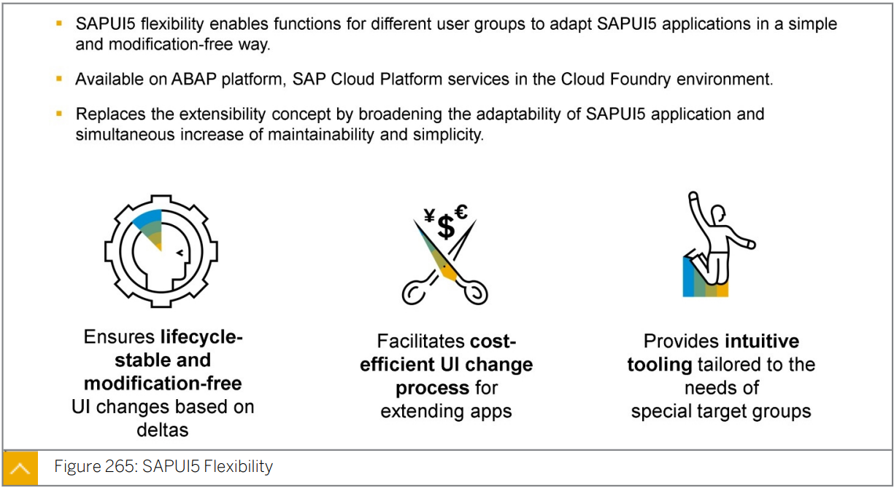

  * SAP UI5 Flexibility 를 통해 다양한 user group 을 위한 function 을 SAPUI5 App 을 ***<u>수정 없이 단순하게 조정</u>***할 수 있게 해준다. 

  * SAP Business Technology Platform 의 SAP Cloud Service 를 ***<u>ABAP platform 에서 가능</u>***하게 해준다.
  * SAP UI5 App 의 ***<u>적응성을 확장하고 유지보수성과 단순성을 동시에 높여</u>*** ***<u>확장성 개념을 대체</u>***한다. 
  * Delta 기반으로 ***<u>안정적인 lifecycle</u>*** 과 ***<u>수정이 필요 없는 UI 변경</u>***을 보장한다.
  * App 확장을 위한 ***<u>cost-efficient UI change  process</u>*** 지원
  * <u>*특수 **target group 의 요구에 맞춘 직관적인 tooling 제공***</u>

  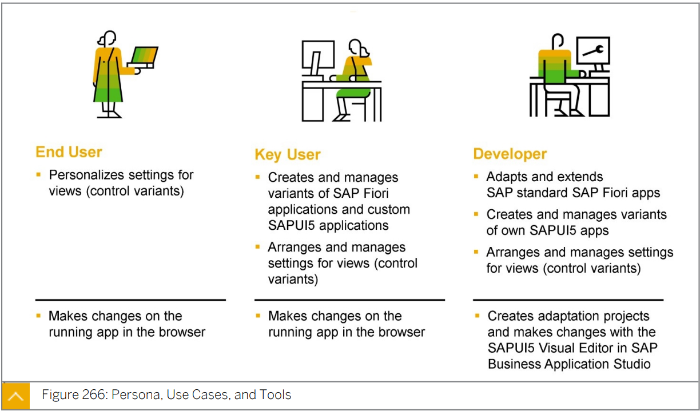

  > | End User                                  | Key User                                             | Developer                                                    |
  > | ----------------------------------------- | ---------------------------------------------------- | ------------------------------------------------------------ |
  > | view 에 대한 설정 개인화(control variant) | 다양한 SAP Fiori App 및 맞춤형 SAP UI5 App 생성/관리 | SAP Standard Fiori App Adapt/확장                            |
  > |                                           | View 에 대한 설정을 정렬/관리                        | 다양한 종류의 SAP UI5 App 생성/관리                          |
  > |                                           |                                                      | View 에 대한 설정을 정렬/관리 (control variant)              |
  > | 브라우저에서 실행중인 앱을 변경           | 브라우저에서 실행중인 app 을 변경                    | SAP BAS 에서 SAP UI5 Visual Editor 를 사용하여 Adaptation project 를 생성/변경 |

  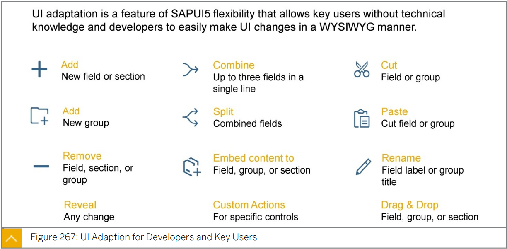

  ***<u>UI adaptation</u>*** 은 ***<u>기술 지식과 개발자가 없는 key use</u>***r 가 ***<u>WYSIWYG 방식</u>*** 으로 UI 를 쉽게 변경할 수 있는 ***<u>SAP UI5 Flexibility 의 기술</u>***이다.

  

  > * 새 field / section / group ***<u>Add</u>***
  > * field / section / group ***<u>Remove</u>***
  > * ***<u>변경 내용 표시</u>***
  >
  > 
  >
  > * field / group ***<u>Cut</u>***
  > * Cut field / group ***<u>Paste</u>***
  > * field label / group title ***<u>Rename</u>***
  > * field / group / section ***<u>Drag&Drop</u>***
  >
  > 
  >
  > * 상위 세 field 를 single line 으로 ***<u>Combine</u>***
  > * Combine 된 field ***<u>Split</u>***
  > * field / group / section 에 ***<u>Content Embed</u>***
  > * 특정 control 을 위한 ***<u>Custom Actions</u>***

  

  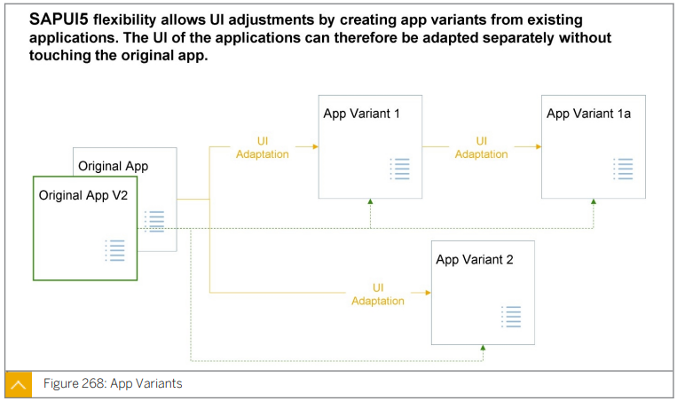

  SAPUI5 flexibility 를 통해 ***<u>기존 app 에서 app variant 를 생성하여 UI 를 조정</u>***할 수 있다.

  따라서 애플리케이션의 UI는 ***<u>원래 앱을 건드리지 않고 별도로 조정</u>***할 수 있다.

  > ***<u>[참고](https://help.sap.com/viewer/a7b390faab1140c087b8926571e942b7/201809.002/en-US/af47058ad66144579db6a990f3b7b919.html)</u>***

## Extension Concept and Extension Points

* ### Extension Capability in SAP UI5

  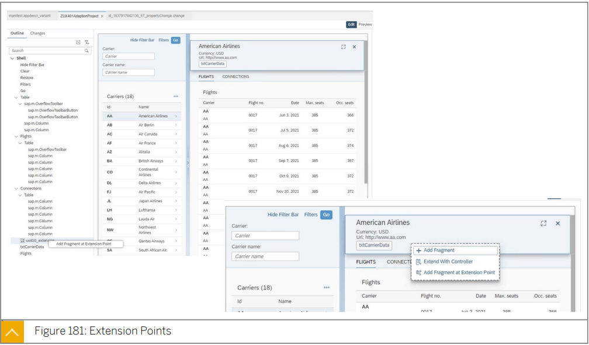
  
  * Extension point 는 visual aspect 를 추가할 수 있는 anchor 와 같다.
  * SAPUI5 애플리케이션은 특정 사용자 요구사항을 충족하도록 확장할 수 있다.
  * ***<u>Extension Point</u>*** 라고 하는 extension 을 위한 Placeholder 가 응용프로그램 view에 배치된다.
    * 이를 통해 개발자는 원하는 경우 이러한 위치에 확장을 추가할 수 있다.
  * Extension Point 를 사용이 요구되면 App 의 ***<u>Component.js 에 physical extension 이 문서화</u>*** 된다.
    * ***<u>Standard App 은 변경되지 않는다</u>***.
    * customize 된 App 은 추가 ***<u>customization 과 함께 Standard App 을 실행</u>***하는 ***<u>start-up project</u>*** 가 된다.
  * SAP에서 제공하는 많은 Fiori App 에는 custom이 용이하도록 Extension Point 가 있다.
  

* ### SAP UI5 Extensibility Concept

  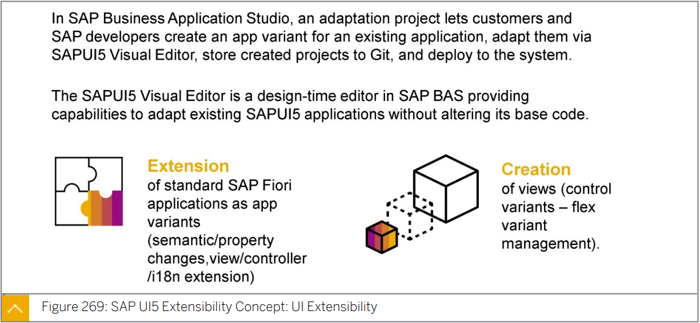

  > * SAP BAS 에서 고객과 개발자는 
  >
  >   ***<u>Adaptation Project</u>*** 를 통해 ***<u>기존 app 에 대한 app variant 를 create</u>***, 
  >
  >   ***<u>SAP UI5 Visual Editor</u>*** 를 통해 이를 ***<u>adapt</u>*** , 
  >
  >   ***<u>Git 에</u>*** 생성된 project 를 ***<u>store</u>***, 
  >
  >   ***<u>system에 deploy</u>*** 할 수 있다.
  >
  > 
  >
  > * ***<u>SAPUI5 Visual Editor</u>*** 는 ***<u>기본 code를 변경하지 않고</u>*** ***<u>기존 SAP UI5 App 을 조정</u>***할 수 있는 기능을 제공하는 SAP BAS 의 ***<u>design-time editor</u>*** 이다.
  >
  > 
  >
  > * Standard SAP Fiori App 의 App variant 으로 ***<u>Extension</u>***
  >
  >   ***<u>(semantic/property changes, view/controller/i18n extension)</u>*** 
  >
  > * ***<u>View 를 Creation</u>***
  >
  >   (control variants · flex variant management)
  
  
  
  

* ### Configuration of Components

  * Customization 은 Component 의 Configuration 을 기반으로 한다. 

    이러한 Configuration 의 special area 는 Customization information 전용이다.

    Configuration 은 Component.js라는 이름의 JavaScript 파일에 있다.

  * 제공된 Standard App 은 확장하는 Custom App 에서 Customization 을 수행할 수 있다.

    Custom App은 별도의 프로젝트에 있다.

    ***<u>두 App 모두 Component.js 파일을 포함</u>***하고 있으며 ***<u>Custom App에는 모든 변경 사항이 포함</u>***되어 있습니다.

  

* ### Modification Free

  제공된 ***<u>Standard App은 변경되지 않으므로</u>*** ***<u>Extension 은 수정이 없는 것으로 간주</u>***됩니다.

* ### Custom Application

  Custom App 은 ***<u>추가된 Customizing Configuration 과 함께 제공된 Standarad App 을 시작하는</u>*** ***<u>start-up project</u>***가 됩니다.

* #### Stable IDs

  * Stable ID은 processing 동안 Visual 측면을 정확하게 식별할 수 있도록 보장하기 위해 사용한다.

  * ##### Use:

    * UI control 수준의 ID property 이다.
    * routing 을 위한 target-configuration 의 level 에서의 `viewId`

  * 쉽게 식별하기 위해 ID 에 semantic name(의미론적 이름) 을 사용한다.

  

  * 구현한 App 을 기반으로 App Variant 를 만들기 위해서는 base app 이 stable ID 로 작동하는지 확인해야한다.
  *  Visual 측면에 Stable ID 가 있을 때만 adaption project 에 의해 조정될 수 있다.
  * Stable ID 를 가진 측면의 parent 가 Stable ID 를 갖지 않으면 Stable Id 를 가진 측면을 식별할 수 없게 된다. 

* ### Implementation of Application Variant

  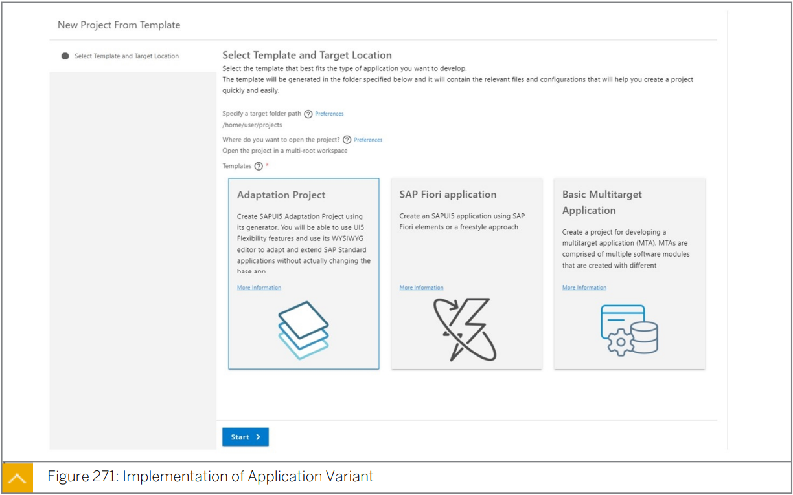

  > 개발자는 SAPUI5 Adaptation Project 를 통해 SAP BAS 에서 SAP Fiori App 을 확장할 수 있다. 
  >
  > 모든 기능을 사용하려면 기본 app 이 control 수준에서 Stable ID 를 제공하는 것이 중요하다.
  >
  > SAP Fiori Element 는 각 control 이 Stable ID 를 갖도록 한다.
  >
  > Adaptation Project 가 생성된 후에는 ***<u>새 project 를 새 workspace 에서 열어야 한다</u>***.
  >
  > 그렇지 않으면 ***<u>Visual Editor 가 올바르게 작동하지 않는다</u>***.(현시점에서)

  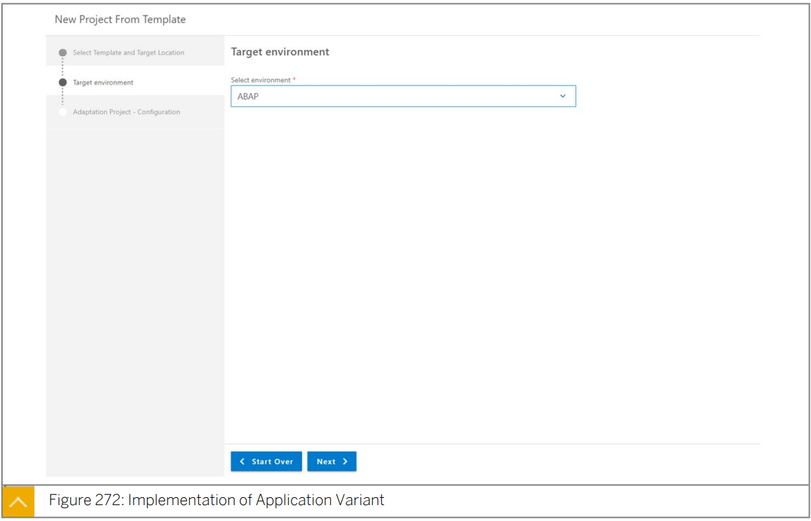

  > Wizard 의 두번째 step 에서 base app 이 host 될 환경을 선택할 수 있다.
  >
  > 현재는 ABAP 과 Cloud Foundry 가 가능하다.

  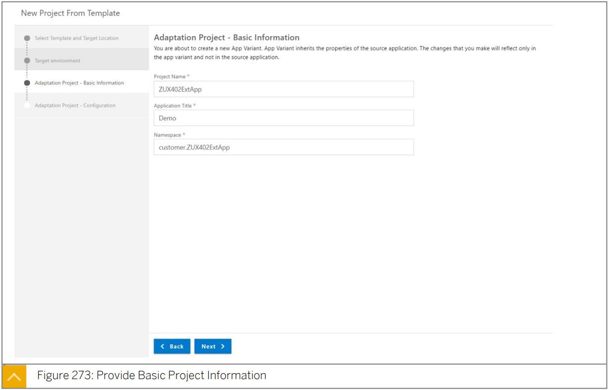

  > 확장해야 하는 app 을 찾을 수 있는 경우 개발자는 source 를 선택해야한다.

  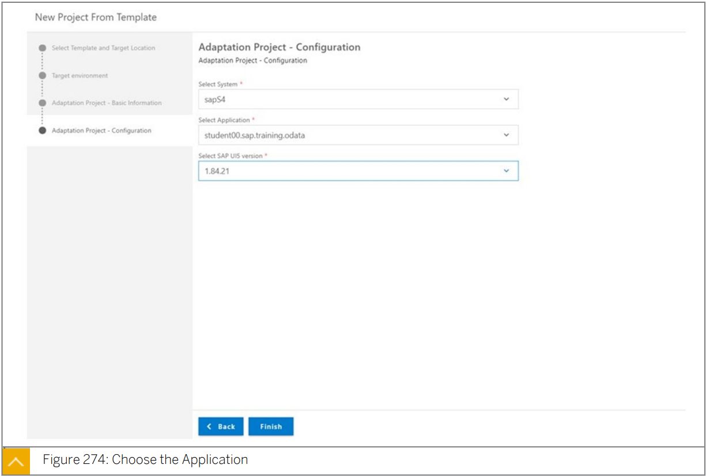

  > configuration 단계에서 base app 이 제공되는 시스템이 선택된다.
  >
  >  app 드롭 다운에서 base app 의 namespace 를 선택한다.
  >
  > SAP UI5 버즌 드롭 다운에서 버전을 선택한다.
  >
  > SAPUI5-Version 1.96.0/1.96.1 및 일부 1.97 스냅샷 버전에서는 Visual Editor 기능 범위가 제한된다.

  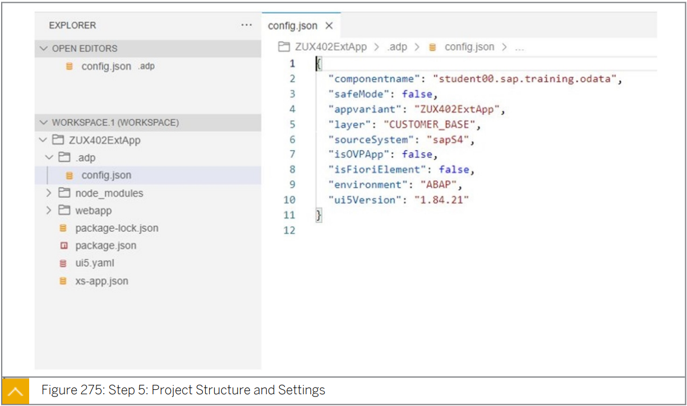

  > `vscode` 폴더의 `settings.json` 파일에는 프로젝트의 중요한 정보가 포함되어있다.
  >
  > 상위 SAP UI5 버전에서 기능을 테스트 하려는 경우 Visual Editor preview 에서 프로젝트를 시작하는데 사용할 버전을 변경할 수 있다.

  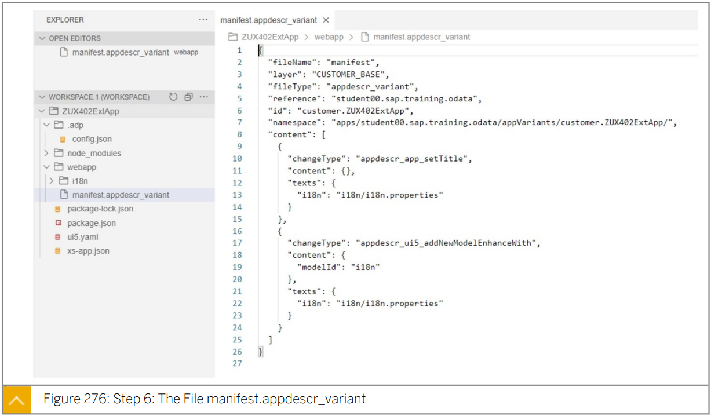

  > ***<u>`manifest.appdescr_variant` 파일은 app variant 의 manifest 파일</u>***이며 app variant 의 ***<u>App id 를 포함</u>***한다.
  >
  > ***<u>section content 의 변경 내용에 대한 configuration</u>*** 도 포함되어있다.
  >
  > 위 예시에는 i18n model 에 대한 model extension 도 포함되어있다.
  >
  > i18n-extension 은 기본적으로 생성되며 base app 에서 text를 재정의 하거나 새 i18n 텍스트를 추가하는데 사용할 수 있다.

  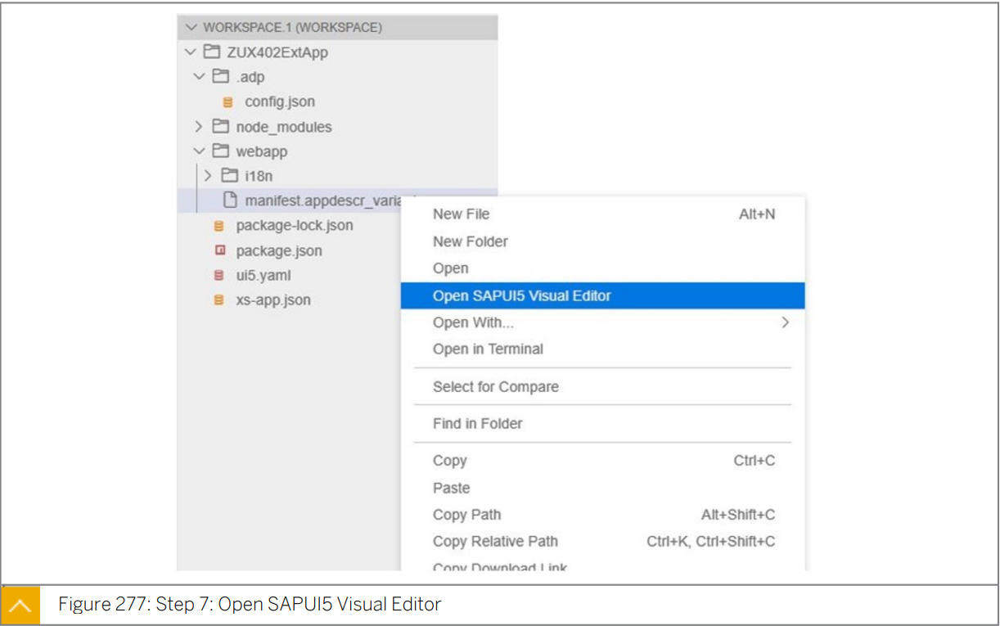

  > base app 을 확장하기 위해 ***<u>SAPUI5 Visual Editor 를 사용</u>***한다.

  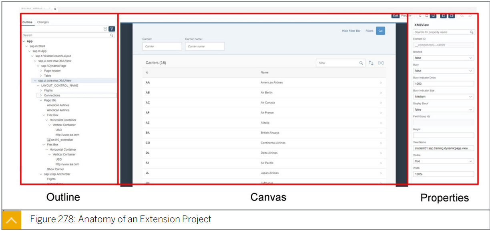

  > Edit mode 에서 개발자는 현재 구현을 조정할 수 있다.
  >
  > 기본 app 이 Stable ID 를 사용하는 것이 중요하다.
  >
  > Stable ID 없이 예를 들어 기존 control 의 property 는 수정할 수 없다.
  >
  > 개발자는 ***<u>깔대기 symbol</u>*** 을 사용하여 outline view ***<u>에서 control tree 를 enhance/reduce</u>*** 하고 app 에서 ***<u>사용 가능한 모든 control 을 표시</u>***할 수 있다.
  >
  > manifest.json은 SAPUI5 버전 1.28에 도입된 개념이다.
  >
  > 따라서 일부 이전 확장이 Component.js 파일을 사용하여 확장을 선언할 수 있다.

  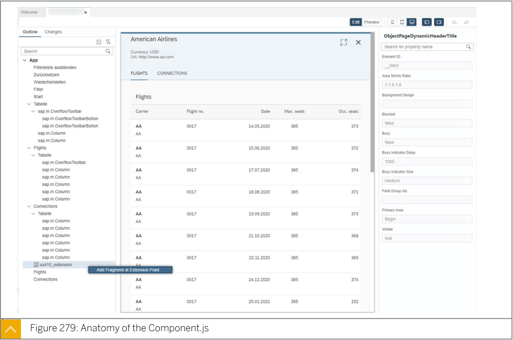

  > 그림에는 Component.js 파일의 예가 나와 있다.

  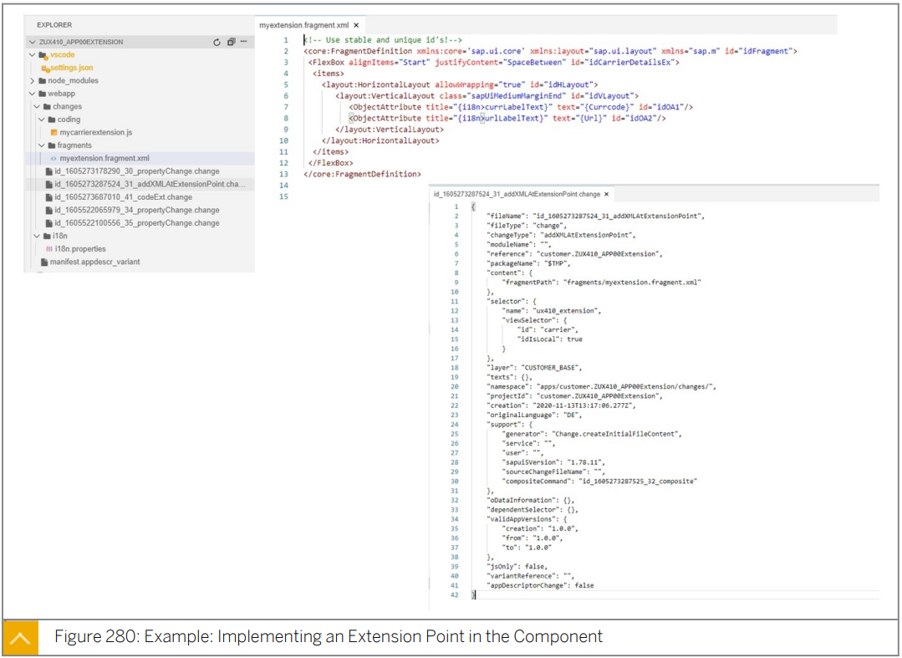

  > * View 또는 Fragment 는 View Extension 에 사용될 수 있다.
  > * ***<u>확장명은 manifest.json 파일 내부에서 구성</u>***된다.
  > * ***<u>custom object</u>*** 는 ***<u>sap.ui5 object 의 일부인 extends object 아래에 추가</u>***된다.
  > * 예시의 경우 Flights_carrier detailsCustom이라는 이름의 fragment 가 Flights라는 이름의 View 에서 캐리어 세부 정보 Extension point 에 삽입되고 있다.

  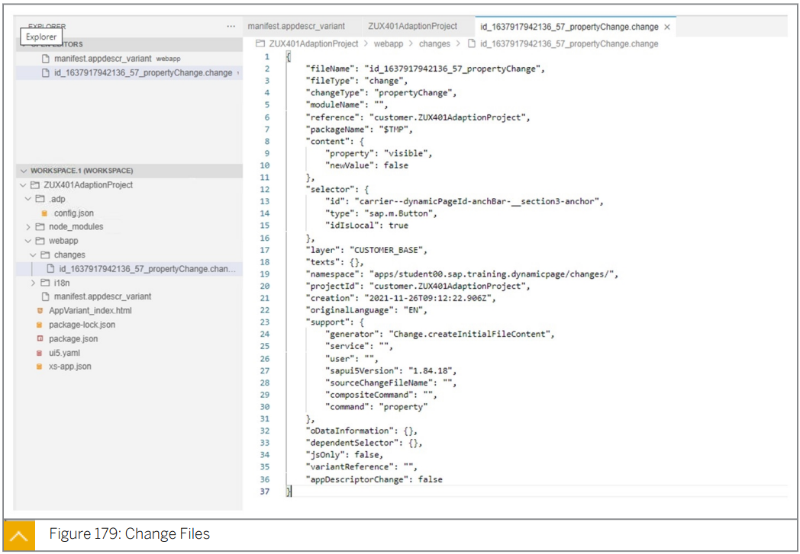
  
  > Visual Editor 에 추가되거나 구성된 adaptation 은 .change 파일로 저장된다.
  >
  > 개발 아티팩트는 `project.Controller-extensions` 에 위치한 `change` 폴터에 저장되고 view enhancement 는 fragment 하위 폴더에 저장된다.
  >
  > property 가 변경될 때마다 새 `.changes` 파일이 생성된다.
  >
  > 예를 들어 visible property 가 ***<u>true 에서 false 로 변경된 뒤 다시 true 로 변경한 경우</u>***에도 ***<u>두개의 파일이 생성</u>***된다.
  >
  > 따라서 속성을 변경하기 전에 변경이 실제로 필요한지 확인이 필요하다.
  >
  > view modification 의 경우 SAPUI5 code 는 생성되지 않고 .change 파일만 생성된다.
  >
  > 
  
  

## Describing Other Types of Extensibility in SAPUI5

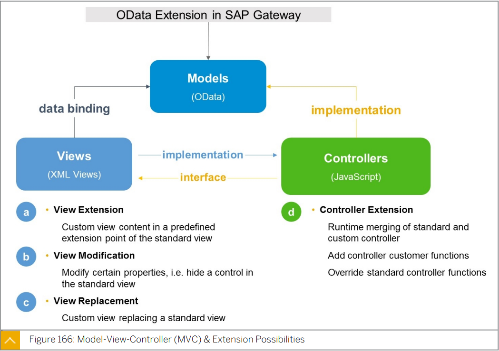

* View Extension

  standard View 의 predefine 된 extension point 에 custom view content 추가

* View Modification

  특정 property 를 수정 (i.e Standard view 에서 control 숨기기)

* View Replacement

  Standard View 를 custom view 로 대체

* Controller Extension

  Standard Controller 와 Custom Controller 의 runtime 병합
  Controller customer function  추가

  Standard controller function  재정의

* 기존 View 를 **Customize 한 View 로 완전히 대체(*<u>replace</u>*)**할 수 있다.
* 기존  View 의 Control 의 특정 Property을 수정할 수 있다.
* 기존 Controller 에 code를 추가할 수 있다.
  * 기존 code를 덮어쓸 수도 있다.
* localization/internationalization 를 위한 Customization 이 가능하다.

SAPUI5 앱을 특정 요구사항에 맞게 조정할 수 있다. 

예를 들어 ***<u>View 를 변경하거나 바꾸거나, Controller 를 확장하거나 바꾸거나, 언어별 텍스트를 변경</u>***할 수 있다.

SAP UI5 앱의 ***<u>Customization 에는 component configuration 이 사용</u>***된다.

Customization 정보는 component configuration 의 특정 영역에 저장된다.

이러한 커스터마이징은 제공된 Standard App 을 확장하는 Custom App 에서 수행될 수 있다. 

View/Custom Controller 의 ***<u>replacement/extension도 Custom App의 일부</u>***일 수 있지만 ***<u>항상 필요한 것은 아니다</u>***.

***<u>replacement 와 custom Controller 가 없는 경우</u>*** Custom App Project 에서 ***<u>Customization Configuration 이 포함된 Component 정의만 포함</u>***된다.

Standard App 자체는 변경되지 않는다. 

Custom App이 start-up project 가 되고 추가 customizing configuration 으로 standard app 을 실행한다.

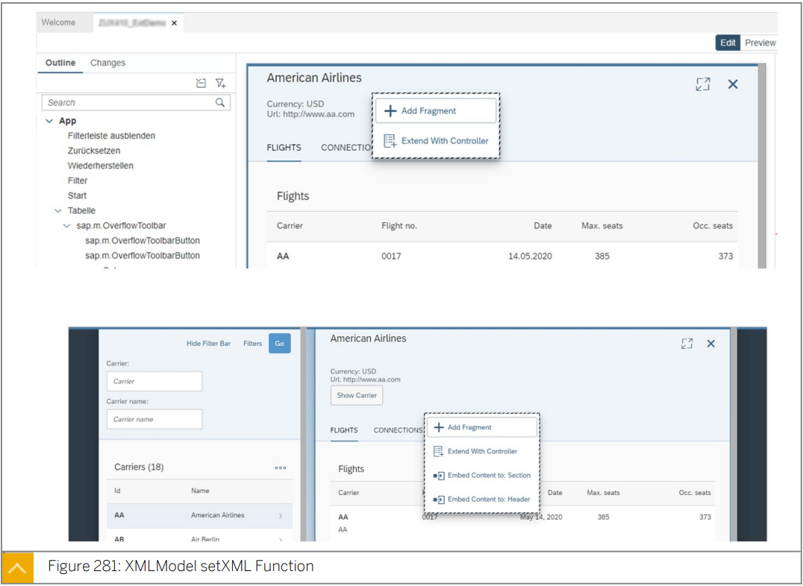

위 사진에는 현재 가능한 replacement 를 보여준다.

* ### View Replacements

  고객은 standard SAP UI5 App 의 View 전체를 교체할 수 있다.

  따라서 Standard SAP UI5 App 의 개발자는 App 에서 어떤 것도 구현하지 않을 수 있다.

  고객은 app 의 모든 view를 자유롭게 교체할 수 있다.

  Standard SAP UI5 App 의 View 를 대체해야하는 View 는  ***<u>extension project 의 일부</u>***가 되며 extension project extension project 의 ***<u>`manifest.json` 파일의 `sap.ui5` object 에 구성</u>***된다. 

  ***<u>customizing object `sap.ui.viewReplacements`</u>*** 에는 각 ***<u>replacer view 에대한 configuration 이 포함</u>***되어있다.

  

* ### View Modification - Changing View Properties

  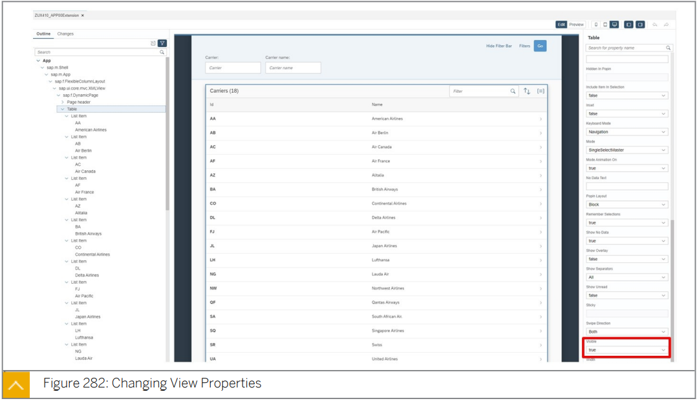

  ***<u>View modification</u>*** 을 사용하면 고객은 extension 기능을 사용하여 standard app 에서 control 을 숨길 수 있다.

  View modification 개념은 ***<u>id 의 사용을 기반</u>***으로 한다.

  즉 ID 가 있는 control 만 수정할 수 있다.

  현재 modification 은 ***<u>control 의 visible-attribute 을 사용해야 사용할 수 있다</u>***.
  
   SAPUI5 code 는 생성되지 않고 .change 파일만 생성된다.

* ### View Extension and Extension Points

  * View Extension 을 허용하려면 ***<u>Extension Point 가 View Code 에 배치</u>***  되어있어야 한다.
  * 나중에 Customize 할 Placeholder 를 제공하기를 원하는 ***<u>View 의 모든 위치에 Extension Point 를 배치</u>***할 수 있다.
  * View에 ***<u>여러 Extension Point 를 배치</u>***할 수 있다.
  * **Extension Point** 를 ***<u>고유하게 만드는 하나의 property, name</u>***이 있다.
  * Controller 와 같은 SAPUI5 애플리케이션의 다른 Component 는 확장할 수 있지만, Extension Point 는 View code에만 입력된다.

  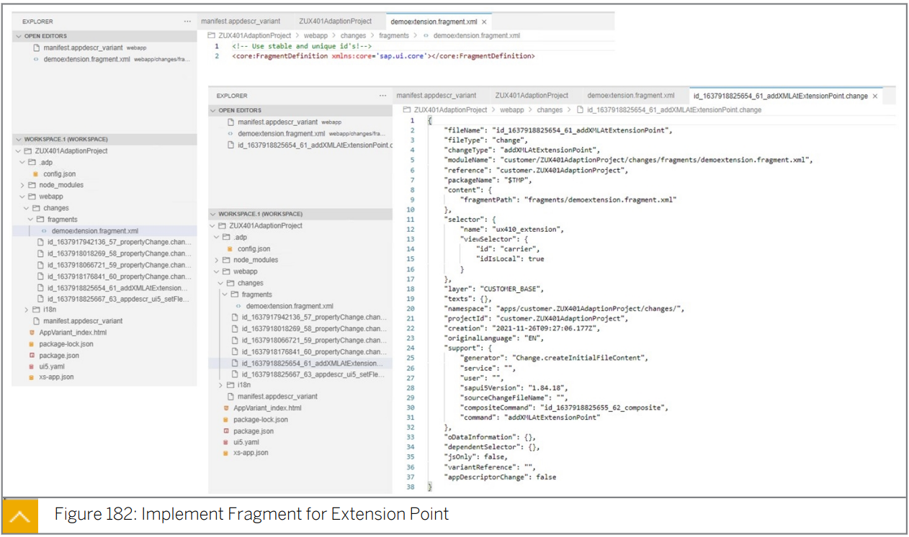

  Extension point 를 enhance 하면 새로운 fragment 가 `fragments` 폴더에 생성된다.

  추가로 change-file 생성되며 configuration 을 포함한다.

  * ##### Example - Extension Point in a View
  
    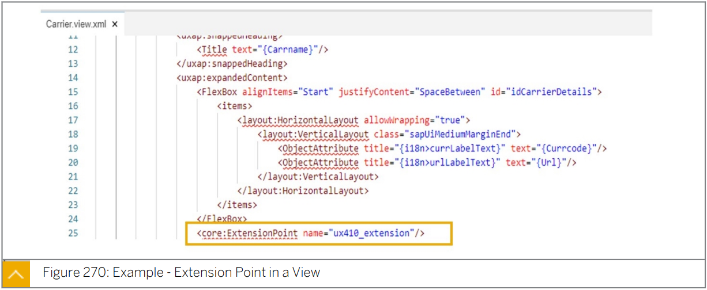
  
    sap.ui.core 의 `<core:ExtensionPoint>` tag 를 사용하여 extension point 를 추가할 수 있다.

* ### Controller Extension 

  * 기존 controller 의 기능을 ***<u>새 controller 의 기능으로 확장하거나 덮어쓸 수 있다</u>***.
  * 새 controller 에 기존 controller 와 ***<u>동일한 이름의 method</u>*** 가 있는 경우 새 controller 의 method 가 ***<u>기존 controller 의 method 를 재정의</u>*** 한다.
  * ***<u>재정의되지 않은 기존 controller 의 method 는 여전히 사용</u>***할 수 있다.
  * 새 controller 의 method 가 기존 controller 의 method 와 match 하지 않는 경우 ***<u>extend situation 이 발생</u>***한다.

  SAPUI5는 제공된 standard controller 를 ***<u>JavaScript Object 수준의 custom controller 와 병합</u>***하여 기본 controller 의 extension 을 지원한다.

  

  * #### Example of Controller Extension 

    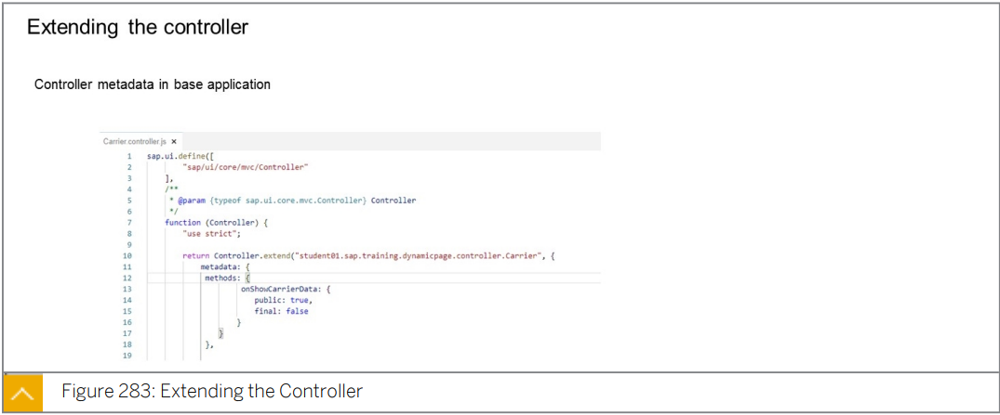

    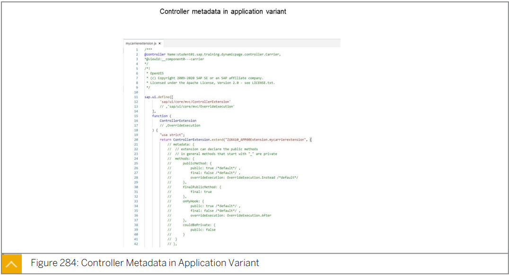

    ***<u>고객이 controller 의 기능을 재정의</u>***할 수 있어야 하는 경우 개발자는 ***<u>metadata 를 사용하여 controller facade 를 구현</u>***해야 한다.

    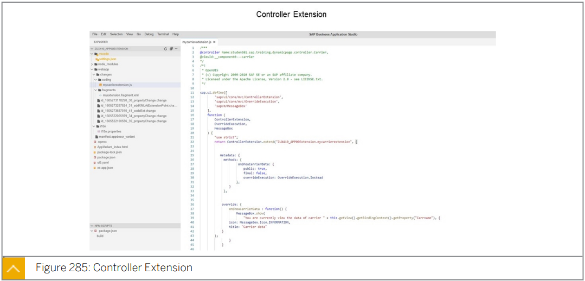

    Visual Editor를 사용하여 controller extension 을 추가하면 ***<u>새 JS 파일이 생성</u>***되어 ***<u>adaption project 의 코딩 폴더에 저장</u>***된다.

    파일에는 기본 controller 의 metadata 정보가 들어 있다.

    

    adaption project 에서 ***<u>고객은 기본 애플리케이션에서 controller 의 기능을 재정의</u>***할 수 있다.

    *<u>**`sap.ui.core.mvc.OverrideExecution` enumeration**</u>* 을 사용하여 function 를 ***<u>덮어쓸지 또는 향상시킬지 여부를</u>*** 설명할 수 있다.

* ### Controller Extensions and the LifeCycle Events

  > * onInit
  > * onBeforeRendering
  > * onAfterRendering
  > * onExit

  * extension 의 ***<u>onInit / onAfterRendering</u>*** 은 ***<u>standard/original controller</u>***  의 onInit / onAfterRendering ***<u>이후에 호출</u>*** 된다.
  * extension 의 ***<u>onExit / onBeforeRendering</u>*** 은 ***<u>standard/original controller</u>*** 의 onExit / onBeforeRendering ***<u>전에 호출</u>*** 된다.

  SAPUI5 controller extension concept 는 ***<u>상속을 사용하지 않는다</u>***.

  대신 custom controller 의 method 는 ***<u>동일한 이름의 standard method 를 redefine</u>*** 한다.

  ***<u>controller lifecycle method 는 예외</u>***이다. (onInit, onExit, onBeforeRendering, onAfterRendering)

  이러한 method 의 경우 custom application 의 controller method 는  standard lifecycle method 호출 이후나 이전에 호출된다.

  * #### Providing Hooks in the Standard Controller

    > Note:
    >
    > extension point 는 View code 에만 사용될 수 있다.

    * standard controller 에서 ***<u>custom code 를 추가하려는 위치를 식별</u>***한다.
    * ***<u>custom code 에 사용할 function 을 문서화</u>***한다.
      * 이 function 이 receive / return 할 수 있는 ***<u>argument 를 포함</u>***한다.
      * 본질적으로, ***<u>"reserved" function</u>*** 이 된다.
    * standard controller 에 code를 추가하여 ***<u>function 이 구현되었는지 확인하고 구현된 경우 function 을 호출</u>***한다.
    * 앞에 표시된 것처럼 ***<u>controller extension 을 생성</u>*** 한다.
    * ***<u>extension 에서 "reserved" function 을 구현</u>***한다.
    * 앞서 표시된 것처럼 controller extension 에 대한 component customizing 을 수행한다.

    ***<u>Hook</u>*** 는 controller extension 을 보다 ***<u>안정적으로</u>*** 만드는데 사용되는 ***<u>controller code 의 extension point</u>*** 이다.

    ***<u>controller extension concept</u>*** 를 사용하면 ***<u>모든 method 를 재정의</u>***할 수 있다.

    이는 ***<u>강력(powerful)하지만 취약(fragile)한 기능</u>***이다.

    ***<u>extension point : Hook 는 controller code 에서 제공</u>***될 수 있다.

    이러한 ***<u>Hook 는 문서화되고 안정적으로 유지</u>***될 수 있으므로 controller extension 을 위한 ***<u>app 업데이트 전반에 걸쳐 강력한 hook 를 제공</u>***한다.

    

    1. 애플리케이션에서 고객이 ***<u>custom code 를 연결하고 실행하고자 하는 controller code 내의 strategic location 를 식별</u>***한다.

    2. 애플리케이션에서 ***<u>extension 을 위해 예약된 새로운 function 이름을 정의</u>***한다,

       함수와 함수가 수신하거나 반환할 수 있는 인수를 문서화합니다.

    3. 응용 프로그램에 ***<u>code 라인을 추가</u>***하여 (아래 code snippet 참조) ***<u>function 이 구현되었는지 확인하고, 구현된 경우 function 을 호출</u>***한다.

       또한 return value 에 대한 sanity check 를 구현하는 것이 좋다.

    4. 그런 다음 고객은 ***<u>controller extension 을 구성하여 이 function 을 정확히 구현</u>***할 수 있습니다.

    5. SAPUI5 런타임은 새 controller extension 을 standard controller 에 병합한다.

       customizing이 활성화된 경우 새 function 을 실행할 수 있다.

    

    

* ### Deploy New Application Variant

  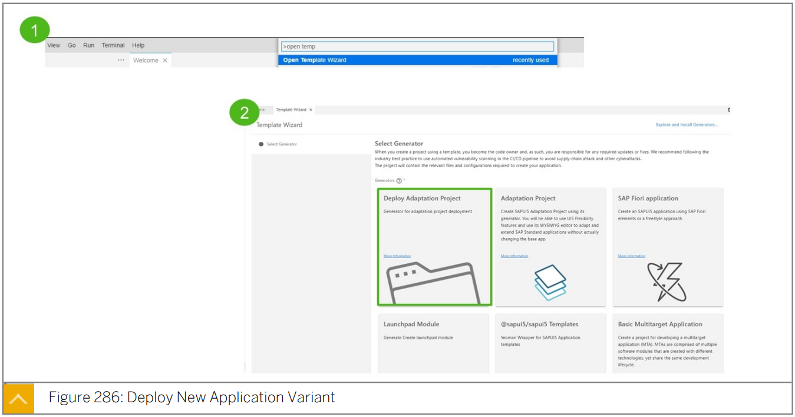

  > Template 에서 Wizard Deploy Adaption Project 를 선택하고 지침에 따라 새 app variant 를 배포한다.
  >
  > yo tool 을 사용하여 adaption project 의 ***<u>`manifest.appdescr_variant`  파일</u>***에 지정된 namespace 를 ***<u>namespace parameter 로 사용해 새 app variant 를 배포</u>***한다.

  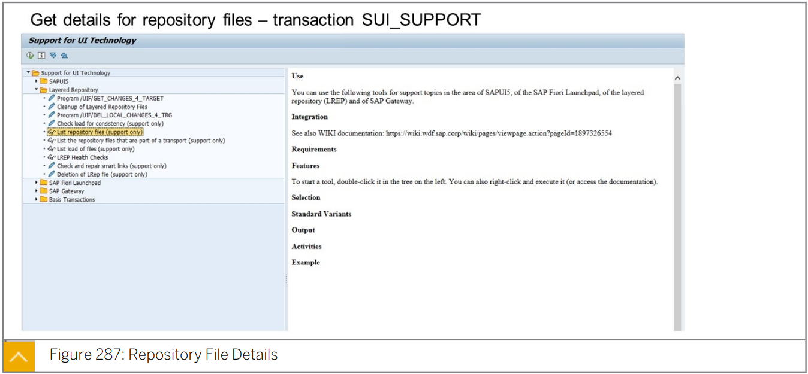

  > T-code SUI_SUPPORT 를 사용하여 repository 파일의 세부정보를 가져온다. 

  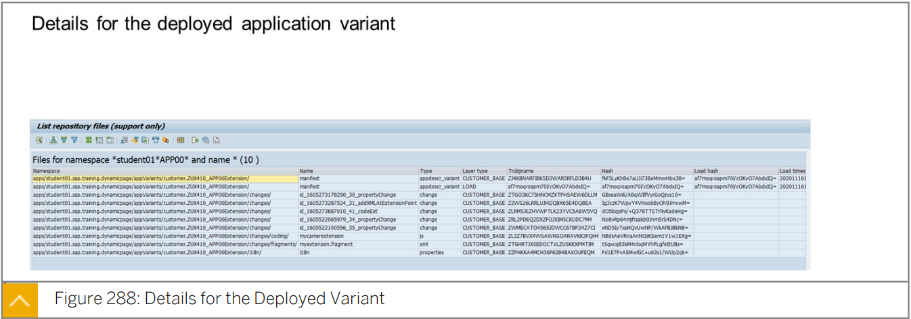

  > 이 세부 정보를 통해 관리자는 이제 app variant 에 대한 새 target mapping 을 만들 수 있다.
  >
  > 기본 애플리케이션을 일반적으로 숨기려면 ***<u>URL 매개 변수 `sap-appvar-id`</u>***를 ***<u>app variant 의 namespace 와 함께 기본 애플리케이션의 target mapping에 추가</u>***하여야한다.

