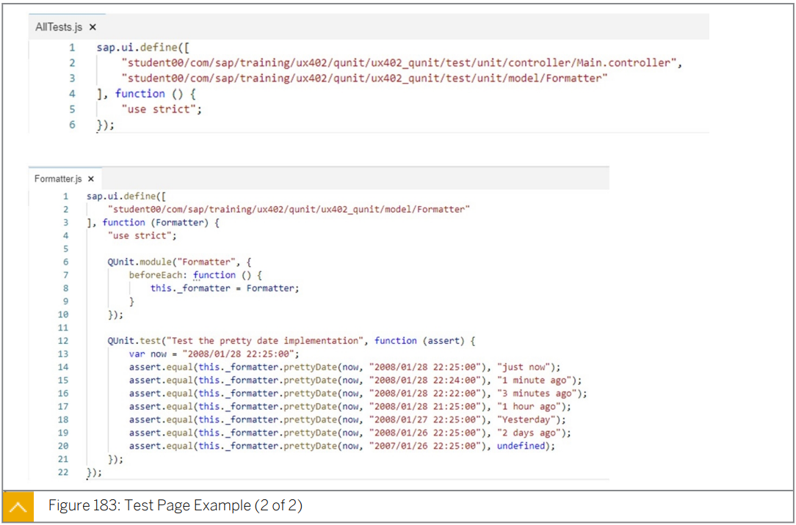

# 7. Deployment & Testing

#### UX410

* Deploy an application on an ABAP Server
* an application on the SAP Hana Cloud Platform => an application on the SAP BTP.

* Write Unit-Tests:white_check_mark:
* unit test with QUnit :white_check_mark:
* create a QUnit Test Scenario:white_check_mark:
* apply integration a test with OPA5:white_check_mark:
* create an OPA5 Test Scenario.:white_check_mark:

## Unit test with QUnit

첫번째 test 를 구현하기 전에 app 의 다양한 측면을 테스트 하는 방법을 생각해야한다.

QUnit test 는 다음 그림과 같이 Agile 테스트 피라미드를 기반으로 한다.

* Agile test 란?

  Agile 방법론을 기반으로 하는 테스트 방식

  개발과 테스트를 지속적으로 통합하여 시작할 수 있다. 

***<u>mock</u>*** 은 우리가 기댓값을 설정할 수 있고 기댓값 행동이 실제로 일어났음을 확인할 수 있는 object 이다.

***<u>stub</u>*** 은 테스트 대상 코드로 전달하는데 사용하는 object 이다. 

* stub 은 테스트 중인 모듈이 호출하는 다른 소프트웨어 구성 요소 를 일시적으로 대체하는 object 이다. 

expectation 을 설정할 수 있기때문에 특정한 방식으로 작동하지만 그러한 기댓값은 검증되지 않는다.

stub 의 property 는 자동으로 일반 property 처럼 작동하므로 stub 에 대한 expectation 을 설정할 수 없다.

test 중인 **code 의 동작을 확인하기위해** 적절한 **expectation 을 가진 mock 을 사용**하고 확인한다. 

특정 방식으로 동작해야 하지만 해당 test 의 **메인이 아닌 값을 전달할 경우** **stub 을 사용**한다.

stub 과 mock 은 manually 하게 구현할 수 있다.

Problem : 많은 추가 테스트 코드가 필요하고 유지보수가 어렵다.

Solution : mocking framework 즉 Sinon.JS 을 사용하여 동적으로 생성된 mock을 사용한다. 

Sinon.JS 는 다음과 같은 기능을 가진 JS mock framework 이다. 

* ### Sinon.JS

  * ***<u>spy / stub / mock</u>*** 을 지원한다.
  * 타이머 및 AJAX 요청에 대해 higher-level test double 을 지원한다. 
  * SAP UI5 라이브러리에 포함돼있다.

* ### QUnit 의 특징

  * JavaSctipt unit/integration test framework 이다.

  * 어떤 generic JS code 도 test 할 수 있다.

  * asynchronous(비동기) test 를 지원한다.

  * QUnit 은 단위 테스트에서 semantic meaning 을 제공하기 위해 top-level function 을 사용한다.

  * 대부분의 단위 테스트 프레임워크와 마찬가지로 단위 테스트 시 사용되는 일반적인 테스트 패턴인 ***<u>arrange-act-assert</u>*** 패턴을 따른다. 

    test 를 위한 설정, test 할 action , 결과의 평가를 명확하게 구별하기 위함이다.

  * 주요 construct

    * `module(string)` - 모듈을 정의
    * `test(string, function)`- test 정의
    * `ok(boolean, string)` - true/false 로 유효성 검사
    * `equal(value1, value2, message)` - double-equal comparator 를 사용하여 두 값을 비교
    * `deepEqual(value1, value2, message)` - ID 뿐 아니라 content 를 기준으로 두 값을 비교
    * `strictEqual(value1, value2, message)` - triple-equal comparator 를 사용하여 두값을 엄격하게 비교

    

* ### Test Double

  

  stub 은 mock method 호출을 위한 값만을 제공한다. (indirect input)

  또한 올바른 parameter(indirect output) 로 예상 method 가 호출되는지 확인한다.

  부작용 의 test 및 발견을 활성화 한다.

  주의!! mock 이 너무 엄격(strict) 하면 test 가 깨질 수 있다.

  

  Solution : mocking framework 를 사용하여 mock 을 동적으로 설계 

* ### Test Page

  

  위는 테스트할 앱의 예시이다.

  

  위는 테스트 페이지의 content 의 설명이다.

  * ##### `test` 폴더

    기본값으로 SAPUI5-project template 이 포함하고 있는 test 폴더이다.

  * ##### `test/integration/arrangements` 폴더

    관례상 ***<u>`Startup.js` method</u>*** 등과 같은 ***<u>test 를 위한 준비 폴더</u>***이다.

    ***<u>`AllJournes.js` 파일에서 참조</u>***해야한다.

  * ##### `test/integration/pages` 폴더

    test 대상 UI 를 나타내는 ***<u>page object 를 포함</u>***하고 있다.

    ***<u>locator / action / assertion</u>*** 을 포함하고 있다. 

  * ##### `test/integration/AllJournes.js` 파일

    test suite 들이 이 파일에 수집된다.

  * ##### `test/unit/unitTests.qunit.js` 파일

    unitTests 파일은  ***<u>SAPUI5 환경을 구축</u>***하고 ***<u>test 를 시작하기 위한 AllTests file 을 트리거</u>*** 한다.

  

  프로젝트의 ***<u>QUnit-test suite</u>*** 는 ***<u>서로 다른 책임</u>***을 가진 ***<u>서로 다른 파일</u>***로 분리된다.

  

  

  

* ### Unit Test Run Configuration

  

  위 스림은 SAP BAS 에서 unit test 실행을 configuration 하기 위한 프로젝트 설정을 보여준다.

  Unit test 를 실행하려면 script unit-test 가 사용된다.

  script 를 실행하려면 프로젝트를 선택하고 app 미리보기를 선택한다. 

* ### Unit Test Run

  

## Apply integration a test with OPA5(One-Page Acceptance)

* ### OPA5 란?

  * OPA5는 One-Page Acception Test의 약어입니다.
  * OPA5는 SAPUI5 를 위한 ***<u>JS-based framework</u>*** 로 다음을 개발 할 수 있다.
    * **UI test**
    * **SAPUI5 통합 test**
    * **Navigation test**
    * **Databinding**
  * OPA5 는 어떤 ***<u>mobile device 에서의 실행도 모두 지원</u>***된다.
  * 개발자는 개발 중에 test 를 작성한다.
  * ***<u>Test-Driven-Development(TDD : 테스트 주도 개발)</u>*** 은 깨지기 쉬운 code 를 줄여준다.
  * TDD 방법론을 사용함으로서 ***<u>지속가능한 코드를 생성</u>***할 수 있다. 

* ### OPA5 의 이점

  * **JS function** 으로의 *<u>**빠르고 쉬운 access**</u>*

  * QUnit 또는 Jasmine 과 같은 

    ***<u>JS 기반의 Unit test framework 와 함께 사용</u>***할 수 있기 때문에 

    ***<u>쉬운 ramp-up</u>***

  * **<u>동일한 runtime</u>** 을 사용하여 **<u>debugging 가능</u>**

  * Good SAPUI5 integration

  * 수초 이내의 feedback 을 통해 ***<u>수정 후 바로 테스트를 실행</u>***할 수 있다.

  * ***<u>timeout 대신 polling 을 통해 비동기성</u>***이 처리됨

    * #### Polling 이란?

      하나의 장치 또는 프로그램이 출동 회피 또는 동기화 처리 등을 목적으로 다른 장치의 상태를 주기적으로 검사하여 일정 조건을 만족할 때 송수신 등의 자료 처리를 하는 방식

  * ***<u>TDD 가능</u>***

* ### OPA5 의 한계

  * screen capturing

  * 둘 이상의 페이지를 걸쳐 테스트

  * 원격 테스트 실행

  * ***<u>인증문제와 테스트 데이터의 취약성</u>*** 때문에 ***<u>End-to-end test 를 권장하지 않음</u>*** 

    * #### E2E(End-to-end) test 란?

      사용자 중심으로 처음부터 끝까지 어플리케이션 흐름을 테스트하는 소프트웨어 테스트 방법 중 하나 

* ### OPA5 Bootstrapping

  

* ### OPA5 Library Loading and Test Initiation

  

  `AllJourneys.js` 파일은 test resource load 를 담당한다.

  UI test 를 수행하려면 먼저 test 대상 app 을 load 해야한다.

  app 을 wrapping 하는 component 는 `Startup.js` 파일에 load 된다.

  준비가 완료되면 NavigationJourney 가 실행될것이다.

  

* ### OPA5 Anatomy of a Test Case

  

  

  

  

* ### OPA5 Control Retrieval by ID

  

* ### OPA5 Control Retrieval without ID

  

  

  

  
