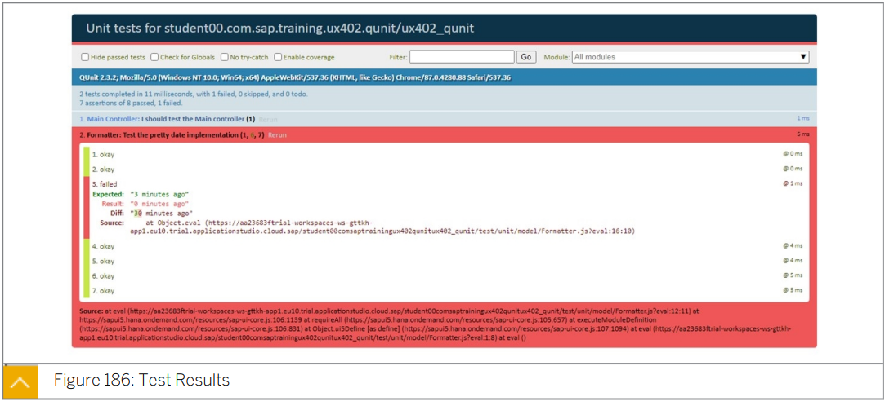
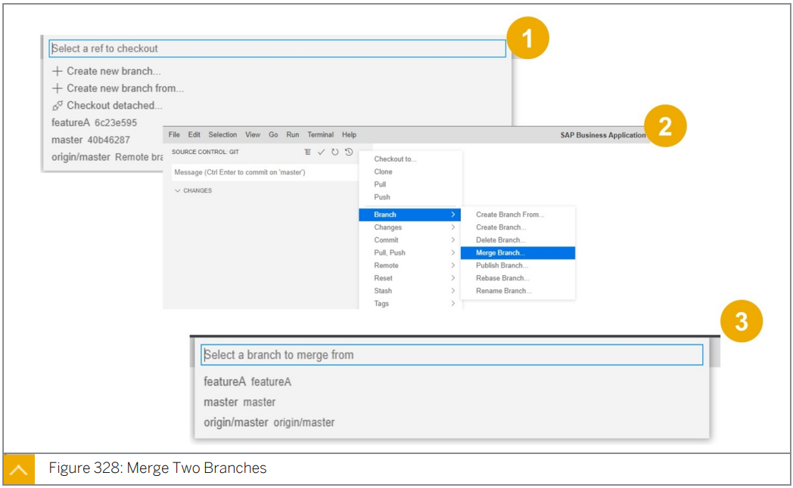

# 7. Deployment & Testing

#### UX410

* Deploy an application on an ABAP Server
* an application on the SAP Hana Cloud Platform => an application on the SAP BTP.

* Write Unit-Tests:white_check_mark:
* unit test with QUnit :white_check_mark:
* create a QUnit Test Scenario:white_check_mark:
* apply integration a test with OPA5:white_check_mark:
* create an OPA5 Test Scenario.:white_check_mark:

## Unit test with QUnit

첫번째 test 를 구현하기 전에 app 의 다양한 측면을 테스트 하는 방법을 생각해야한다.

QUnit test 는 다음 그림과 같이 Agile 테스트 피라미드를 기반으로 한다.

* Agile test 란?

  Agile 방법론을 기반으로 하는 테스트 방식

  개발과 테스트를 지속적으로 통합하여 시작할 수 있다. 

***<u>mock</u>*** 은 우리가 기댓값을 설정할 수 있고 기댓값 행동이 실제로 일어났음을 확인할 수 있는 object 이다.

***<u>stub</u>*** 은 테스트 대상 코드로 전달하는데 사용하는 object 이다. 

* stub 은 테스트 중인 모듈이 호출하는 다른 소프트웨어 구성 요소 를 일시적으로 대체하는 object 이다. 

expectation 을 설정할 수 있기때문에 특정한 방식으로 작동하지만 그러한 기댓값은 검증되지 않는다.

stub 의 property 는 자동으로 일반 property 처럼 작동하므로 stub 에 대한 expectation 을 설정할 수 없다.

test 중인 **code 의 동작을 확인하기위해** 적절한 **expectation 을 가진 mock 을 사용**하고 확인한다. 

특정 방식으로 동작해야 하지만 해당 test 의 **메인이 아닌 값을 전달할 경우** **stub 을 사용**한다.

stub 과 mock 은 manually 하게 구현할 수 있다.

Problem : 많은 추가 테스트 코드가 필요하고 유지보수가 어렵다.

Solution : mocking framework 즉 Sinon.JS 을 사용하여 동적으로 생성된 mock을 사용한다. 

Sinon.JS 는 다음과 같은 기능을 가진 JS mock framework 이다. 

* ### Sinon.JS

  * ***<u>spy / stub / mock</u>*** 을 지원한다.
  * 타이머 및 AJAX 요청에 대해 higher-level test double 을 지원한다. 
  * SAP UI5 라이브러리에 포함돼있다.

* ### QUnit 의 특징

  * JavaSctipt unit/integration test framework 이다.

  * 어떤 generic JS code 도 test 할 수 있다.

  * asynchronous(비동기) test 를 지원한다.

  * QUnit 은 단위 테스트에서 semantic meaning 을 제공하기 위해 top-level function 을 사용한다.

  * 대부분의 단위 테스트 프레임워크와 마찬가지로 단위 테스트 시 사용되는 일반적인 테스트 패턴인 ***<u>arrange-act-assert</u>*** 패턴을 따른다. 

    test 를 위한 설정, test 할 action , 결과의 평가를 명확하게 구별하기 위함이다.

  * 주요 construct

    * `module(string)` - 모듈을 정의
    * `test(string, function)`- test 정의
    * `ok(boolean, string)` - true/false 로 유효성 검사
    * `equal(value1, value2, message)` - double-equal comparator 를 사용하여 두 값을 비교
    * `deepEqual(value1, value2, message)` - ID 뿐 아니라 content 를 기준으로 두 값을 비교
    * `strictEqual(value1, value2, message)` - triple-equal comparator 를 사용하여 두값을 엄격하게 비교

    

* ### Test Double

  

  stub 은 mock method 호출을 위한 값만을 제공한다. (indirect input)

  또한 올바른 parameter(indirect output) 로 예상 method 가 호출되는지 확인한다.

  부작용 의 test 및 발견을 활성화 한다.

  주의!! mock 이 너무 엄격(strict) 하면 test 가 깨질 수 있다.

  

  Solution : mocking framework 를 사용하여 mock 을 동적으로 설계 

* ### Test Page

  

  위는 테스트할 앱의 예시이다.

  

  위는 테스트 페이지의 content 의 설명이다.

  * ##### `test` 폴더

    기본값으로 SAPUI5-project template 이 포함하고 있는 test 폴더이다.

  * ##### `test/integration/arrangements` 폴더

    관례상 ***<u>`Startup.js` method</u>*** 등과 같은 ***<u>test 를 위한 준비 폴더</u>***이다.

    ***<u>`AllJournes.js` 파일에서 참조</u>***해야한다.

  * ##### `test/integration/pages` 폴더

    test 대상 UI 를 나타내는 ***<u>page object 를 포함</u>***하고 있다.

    ***<u>locator / action / assertion</u>*** 을 포함하고 있다. 

  * ##### `test/integration/AllJournes.js` 파일

    test suite 들이 이 파일에 수집된다.

  * ##### `test/unit/unitTests.qunit.js` 파일

    unitTests 파일은  ***<u>SAPUI5 환경을 구축</u>***하고 ***<u>test 를 시작하기 위한 AllTests file 을 트리거</u>*** 한다.

  

  프로젝트의 ***<u>QUnit-test suite</u>*** 는 ***<u>서로 다른 책임</u>***을 가진 ***<u>서로 다른 파일</u>***로 분리된다.

  

  

  

* ### Unit Test Run Configuration

  

  위 스림은 SAP BAS 에서 unit test 실행을 configuration 하기 위한 프로젝트 설정을 보여준다.

  Unit test 를 실행하려면 script unit-test 가 사용된다.

  script 를 실행하려면 프로젝트를 선택하고 app 미리보기를 선택한다. 

* ### Unit Test Run

  

## Apply integration a test with OPA5(One-Page Acceptance)

* ### OPA5 란?

  * OPA5는 One-Page Acception Test의 약어입니다.
  * OPA5는 SAPUI5 를 위한 ***<u>JS-based framework</u>*** 로 다음을 개발 할 수 있다.
    * **UI test**
    * **SAPUI5 통합 test**
    * **Navigation test**
    * **Databinding**
  * OPA5 는 어떤 ***<u>mobile device 에서의 실행도 모두 지원</u>***된다.
  * 개발자는 개발 중에 test 를 작성한다.
  * ***<u>Test-Driven-Development(TDD : 테스트 주도 개발)</u>*** 은 깨지기 쉬운 code 를 줄여준다.
  * TDD 방법론을 사용함으로서 ***<u>지속가능한 코드를 생성</u>***할 수 있다. 

* ### OPA5 의 이점

  * **JS function** 으로의 *<u>**빠르고 쉬운 access**</u>*

  * QUnit 또는 Jasmine 과 같은 

    ***<u>JS 기반의 Unit test framework 와 함께 사용</u>***할 수 있기 때문에 

    ***<u>쉬운 ramp-up</u>***

  * **<u>동일한 runtime</u>** 을 사용하여 **<u>debugging 가능</u>**

  * Good SAPUI5 integration

  * 수초 이내의 feedback 을 통해 ***<u>수정 후 바로 테스트를 실행</u>***할 수 있다.

  * ***<u>timeout 대신 polling 을 통해 비동기성</u>***이 처리됨

    * #### Polling 이란?

      하나의 장치 또는 프로그램이 출동 회피 또는 동기화 처리 등을 목적으로 다른 장치의 상태를 주기적으로 검사하여 일정 조건을 만족할 때 송수신 등의 자료 처리를 하는 방식

  * ***<u>TDD 가능</u>***

* ### OPA5 의 한계

  * screen capturing

  * 둘 이상의 페이지를 걸쳐 테스트

  * 원격 테스트 실행

  * ***<u>인증문제와 테스트 데이터의 취약성</u>*** 때문에 ***<u>End-to-end test 를 권장하지 않음</u>*** 

    * #### E2E(End-to-end) test 란?

      사용자 중심으로 처음부터 끝까지 어플리케이션 흐름을 테스트하는 소프트웨어 테스트 방법 중 하나 

* ### OPA5 Bootstrapping

  

* ### OPA5 Library Loading and Test Initiation

  

  `AllJourneys.js` 파일은 test resource load 를 담당한다.

  UI test 를 수행하려면 먼저 test 대상 app 을 load 해야한다.

  app 을 wrapping 하는 component 는 `Startup.js` 파일에 load 된다.

  준비가 완료되면 NavigationJourney 가 실행될것이다.

  

* ### OPA5 Anatomy of a Test Case

  

  

  

  

* ### OPA5 Control Retrieval by ID

  

* ### OPA5 Control Retrieval without ID

  

  

  

  

## Version Control - Working in  Teams

* ### Working with GIT

  #### GIT Basics

  * GIT은 ***<u>snapshot 의 set 처럼 동작</u>***한다.
  * ***<u>모든 commit</u>*** 에서 GIT 은 ***<u>기본 파일의 현재 상태에 대한 snapshot 을 생성</u>***한다. 
  * ***<u>변경되지 않은 파일</u>***의 경우 파일에 대한 ***<u>reference 만 저장</u>***된다.
  * ***<u>대부분의 작업</u>***에는 ***<u>로컬 파일과 resource 만 필요</u>***하다.
  * ***<u>거의 모든 작업을 오프라인으로 수행</u>***할 수 있다.
  * GIT 은 ***<u>SHA-1 hash 에 기반한 checksum</u>*** 을 사용한다.

  

  #### GIT States

  * #### Committed

    데이터는 ***<u>로컬 데이터베이스에 안전하게 저장</u>***된다.

  * #### Modified

    ***<u>파일이 변경</u>***되었지만 아직 로컬 ***<u>데이터베이스에 커밋되지 않은 상태</u>***

  * #### Changed

    ***<u>파일이 현재 버전에서 수정된 것으로 표시</u>***되고 ***<u>다음 commit snapshot 으로 이동</u>***한다.

  

  #### GIT Basic Workflow

  

  1. 작업 tree 의 ***<u>파일 을 수정</u>***

  2. ***<u>파일을 stage</u>*** 하거나 ***<u>staging area 에 파일의 stapshot 을 추가</u>***

  3. <u>***commit 을 수행***</u>

     ***<u>stage area 에서 파일</u>***을 가져와 ***<u>snapshot 을 local GIT repository 에 영구적으로 저장</u>***

  

  #### GIT Installation

  * local 시스템에서 GIT 을 사용할 때는 GIT 을 설치해야한다. 

  * GIT은

    * Linux 
    * Solaris
    * Windows 
    * Mac
  
    에서 사용 가능하다.
  
  * [링크](https://git-scm.com/downloads) 를 통해 다운 받을 수 있다.
  
  * SAP BAS 에서는 이미 사용할 수 있으므로 별도의 설치는 필요 없다.
  
  
  
  #### GIT Repository - Getting Started
  
  1. 기존 directory 를 GIT으로 가져온다.
  
     *  프로젝트 directory 를 Create/Switch
  
       `cd/yourprojectdirectory`
  
     * Repository 초기화
  
       `git init`
  
     * 파일 stage
  
       `git add -A`
  
     * stage 된 파일 commit
  
       `git commit -m 'Commit Message'`
  
  2. server 로부터 기존 GIT repository Clone
  
     *  프로젝트 directory 를 Create/Switch
  
       `cd/yourprojectdirectory`
  
     * directory 복사
  
       `git clone https://github.com/SAP/hana-shine`
  
  
  
  #### GIT Working Directory
  
  * 작업 directory 의 각 파일은 다음과 같은 state 를 가질 수 있다.
  
    * #### Tracked
  
      ***<u>마지막 snapshot 의 일부</u>***였던 모든 파일
  
      추적된 파일은 다음 stage 에 있을 수 있다.
  
      * Unmodified
      * Modified
      * Staged
  
    * #### Untracked
  
      마지막 snapshot 의 일부가 아니었고 stage area 에 없는 작업 directory 의 모든 파일
  
  * 원격 repository 가 ***<u>복제</u>*** 되면 모든 파일이 ***<u>Tracked state 의 Unmodified stage</u>*** 가 된다.
  
  
  
  #### GIT Staging Area
  
  * GIT 의 독특한 특징중 하나
  * snapshot 을 *<u>**commit 하기 전에 관련 변경 사항을 매우 중점적인 snapshot 으로 그룹화**</u>*
  * Staging commands
    * Single File: `git add <Filename>`
    * Single Directory: `git add <Directory>`
    * Interactive: `git add -p`
  
  
  
  #### GIT Commit
  
  * stage 된 snapshot 을 project history 에 commit
  
  * commit 된 snapshot 은 project 의 safe version 이다.
  
  * Snapshot 은 local repository 에 commit 된다.
  
  * Commit command
  
    `git commit -m 'Commit Message'`
  
  
  
  #### GIT Checkout
  
  * Three distinct function
    * Checking out Files
    * Checking out Commit
    * Checking out Branch
  * Usages
    * Branch Checkout: `git checkout master`
    * Commit Checkout: `git checkout <commit>`
    * File Checkout: `git checkout <commit> <file>`
    * See all commits: `git log -oneline`
  
  

* ### GIT and SAP BAS

  #### Using GIT from the SAP BAS

  

  > SAP BAS 는 통합 GIT Client 와 함께 제공된다.
  >
  > Project 는 기본적으로 GIT Repository 와 연결되어있지 않다. 

  

  

  > 대부분의 GIT Command 는 menu 를 통해 사용할 수 있다.

  #### SAP BAS - Staging

  

  > 수정된 파일은 문자 M으로 표시된다.
  >
  > Stage Area에  변경 사항을 추가하려면 메뉴를 사용하여 변경된 모든 파일을 준비 영역에 추가하거나 파일 수준에서 + 기호를 통해 추가합니다.

  #### SAP BAS - GIT Commit

  

  #### SAP BAS - File State New

  

  >  파일 이름 앞에 + 기호가 표시된다.

  #### SAP BAS - File State Staged

  

  > New 파일을 staging 하면 수정된 파일이 M 으로 표시된다.
  >
  > 프로젝트에서 파일이 삭제되면 D로 표시된다. 

* ### Use GIT Repository

  #### GIT Revert

  > 
  >
  > * ***<u>commit</u>*** 된 snapshot을 ***<u>실행 취소</u>***한다.
  >
  > * commit 은 ***<u>프로젝트 history 에서 제거되지 않는다</u>***.
  >
  >   * GIT 은 변경 내용을 되돌리는 방법을 결정한다. 
  >   * GIT 은 새로운 commit 을 추가한다.
  >   * history 는 결코 사라지지 않는다.
  >
  > * Usage :
  >
  >   `git revert <commit>`

  

  #### GIT Reset

  > 
  >
  > * Project 의 ***<u>이전 상태로 돌아간다</u>***.
  >
  > * ***<u>이후의 모든 commit 을 제거</u>***한다. 
  >
  > * 현재 commit 에서만 역방향으로 작동한다.
  >
  > * Usage : 
  >
  >   `git reset`
  >
  >   `git reset <file>`

  

  #### GIT Clean

  > * 작업 directory 에서 추적되지 않은 모든 파일을 제거한다.
  >
  > * 실행 취소할 수 없다.
  >
  >   * dry run 할 수 있다.
  >
  > * Usage : 
  >
  >   `git clean`
  >
  >   Dry run : `git clean -n`
  >
  >   Forced clean : `git clean -f`

  

  #### GIT Fast Forward Merge

  > * 현 branch 에서 target branch 까지의 선형 경로가 있는 경우 가능하다. 
  >
  > * GIT 은 항상 fast-forward merge 를 먼저 시도한다.
  >
  > * 일반적으로 bug fix 또는 사소한 기능에 사용된다. 
  >
  > * branch 가 분기된 경우에는 불가능하다.
  >
  >   * 전용 commit 이 있는 three-way merge 가 필요하다.
  >
  > * fast-forward merge 를 억제할 수 있다.
  >
  >   `git merge --no-ff <branch>`

  

  #### GIT Conflict Resolution
  
  > * 동일한 파일이 다른 branch 에서 변경된 경우 merge 할 수 없다.
  > * 충돌은 수동으로 해결해야한다. 
  >   * edit / stage / commit workflow 사용
  >     * 먼저 영향 받는 파일을 찾는다.
  >   * GIT status 사용
  >     * 영향을 받는 파일에 대해 수동 변경을 수행
  >     * 충돌한 파일에서 git add 실행
  >     * git commit 실행
  
  
  
  #### GIT Tagging
  
  > * GIT 은 history 의 특정 지점에 대한 tag 지정을 지원한다.
  > * tag 는 기본적으로 git push 를 사용하여 원격 저장소로 push 되지 않는다. 
  > * Usage : 
  >   * List all tags : `git tag`
  >   * Create a tag : `git tag -a v1.5 -m "UX402 V 1.5"`
  >   * Show a specific tag : `git show <version>`, for example, `git show v1.5`
  >   * Push tags to a remote server : `git push origin <tagname>`
  >   * Checkout a tag : `git checkout <tagname>`, for example, `git checkout v1.5`
  
  
  
  #### Working with Remote GIT Repository
  
  > * GIT clone 은 origin shortname  reference 를 저장소에 추가한다. 
  >
  > * Usage
  >
  >   * 수동으로 repository 추가 : `git remote add <remote-name> <url>` 
  >   * repository에서 정보 가져오기 : `git fetch <remote-name> `
  >   * 원격 branch 에 push : `git push <remote-name> <branch-name>`
  >   * 원격 제거 : `git remote remove <remote-name>`
  >
  >   
  >
  > 
  >
  > 
  >
  > 
  >
  > 
  >
  > 
  >
  > 
  >
  > 

* ### Working with Branch

  #### Branches Explained
  
  > * 독립적인 개발 라인을 나타낸다.
  > * stage / commit process 의 추상화 역할을 한다.
  > * 독립적인 작업 directory 및 stage area 에서 작동한다. 
  > *  branch 는 commit 에 대한 reference 이다. 
  > * Usage : 
  >   * List all branches in the repository: `git branch`
  >   * Create a new branch: `git branch <branch name>`
  >   * Delete a branch: `git branch -d <branch name>`
  
  
  
  #### Branch Types
  
  > 
  
  
  
  #### Branch Checkout
  
  > 
  >
  > * 서로 다른 branch 간에 전환이 가능하다. 
  >
  > * Usage : 
  >
  >   * Switch to a branch: `git checkout <yourbranch>`
  >
  >   * Create and checkout a new branch: `git checkout -b <yourbranch>`
  >
  >   * Create and checkout a branch from an existing branch:
  >
  >     `git checkout -b <newbranch> <existingbranch>`
  
  
  
  #### GIT Merge
  
  > 
  >
  > * branch 를 다른 branch 로 통합할 수 있다.
  >
  > * Usage : 
  >
  >   * Merge a branch into the current branch : 
  >
  >     `git merge <yourbranch>`
  >
  >   * Create and checkout a new branch : 
  >
  >     `git checkout -b <yourbranch>`
  >
  >   * Create and checkout a branch from an existing branch :
  >
  >     `git checkout -b <newbranch> <existingbranch>`
  
  
  
  #### GIT Branch and SAP BAS
  
  > 
  >
  > 
  >
  > 
  >
  > 
  >
  > 
  >
  > > 1. 병합할 지점 확인
  > > 2. merge 명령 선택 
  > > 3. local repository 와 병합할 branch 선택 
  >
  > 
  >
  > > 병합이 완료되면 local repository 에 branch 에서 수행된 변경 내용이 포함된다.
  >
  > 
  >
  > > 1. 원격 branch 에 local 변경사항을 적용하려면 Pull, Push -> Push to 를 선택한다.
  > > 2. Push 가 완료되면 원격 repository 에서 변경 사항을 찾을 수 있다.
  
  

