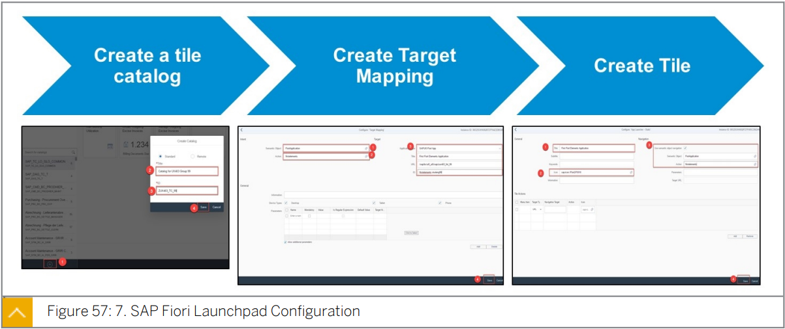
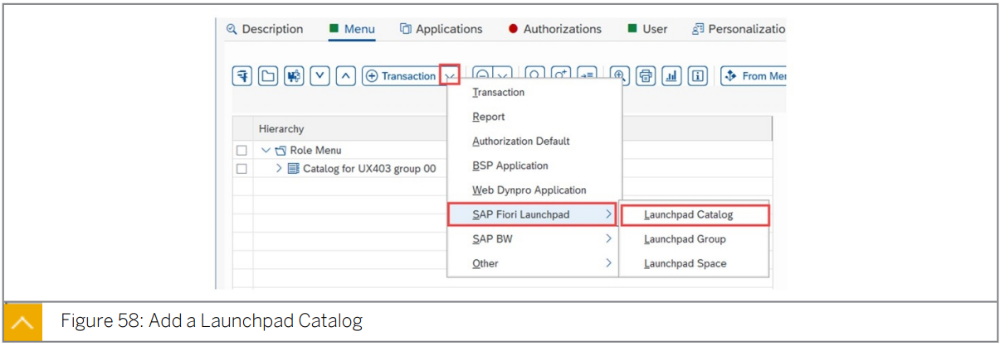

# 8. SAP Fiori Launchpad Configuration

#### UX402 / UX100, UX402

Explain configuration of SAP Fiori Launchpad.

=> Describe the configuration of SAP Fiori Launchpad, Launchpad navigation.

If the SAP Fiori elements application is deployed on Netweaver ABAP, you need to enable the 
application by the following steps:

1. Open SAP Fiori Launchpad Designer and create a tile catalog for the application.
2. Create a target mapping. Target mapping should have detailed technical information for 
  the access of the application, and expose the application as an intent (Semantic Object - 
  Action).
3. Create a tile based on the target mapping.
4. To give a user permission to access the SAP Fiori application, several application-specific 
  authorizations are needed.
  For front end user:
  The user must have a role which has the tile catalog in its role menu.
  For back end user:
