# 8. SAP Fiori Launchpad Configuration

#### UX402 / UX100, UX402

Explain configuration of SAP Fiori Launchpad.

=> Describe the configuration of SAP Fiori Launchpad, Launchpad navigation.

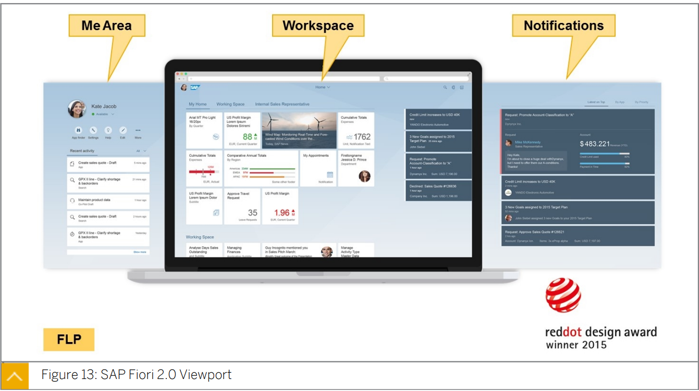

* #### Me Area

  자주 사용하는 앱과 최근 활동에 대한 액세스를 제공

* #### Notifications

  간단한 작업을 포함한 정보 및 태스크에 대한 빠른 액세스를 제공

  user role 로 활성화 할 수 있다.

  notification provider 에의해 생성되며 ***<u>SAP workflow 나 ABAP notification framework 를 기반</u>***으로 할 수 있다.

  빠른 작업을 제공할 수 있으며 알림 항목에 대한 세부 정보를 보여주는 적절한 앱을 시작할 수 있다.

* #### Workspace

  상단의 탐색 메뉴와 같은 앱간 이동을 위한 추가적인 가능성을 제공

  block/group /tile,link 로 구성

  block 은 header / anchor bar / group / footer 로 구성된다.  

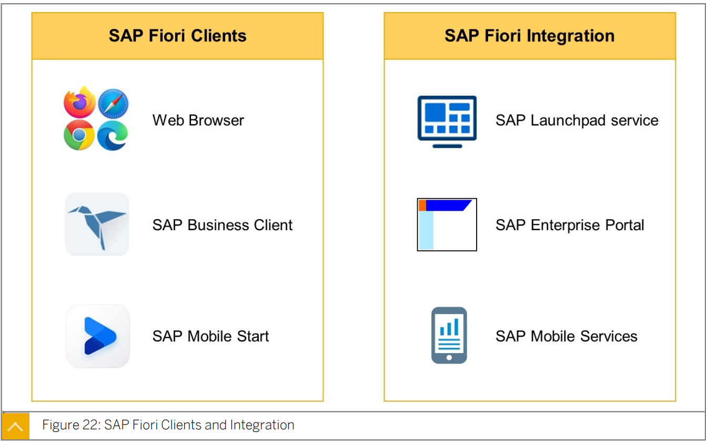

SAP Fiori 에 액세스 할 수 있는 client 는 Web browser / SAP Business Client / SAP Mobile Start 가 있다. 

● SAP Launchpad service
● SAP Enterprise Portal
● SAP Mobile Services

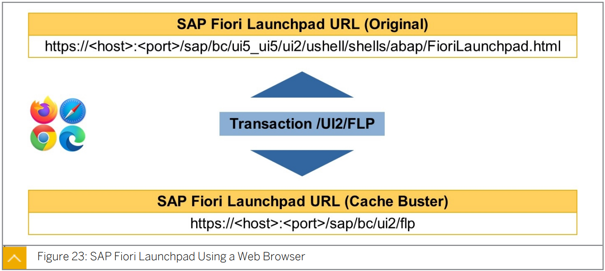

> Note:
>
> 기본적으로 /UI2/FLP 트랜잭션은 응용 프로그램 서버 인스턴스의 ICM(인터넷 통신 관리자) 프로세스를 통해 FLP를 시작한다. 
>
> database table ***<u>HTTPURLLOC</u>*** 는 SAP Web Dispatcher 와 같은 역방향 프록시를 호출하는 데 사용할 수 있다.

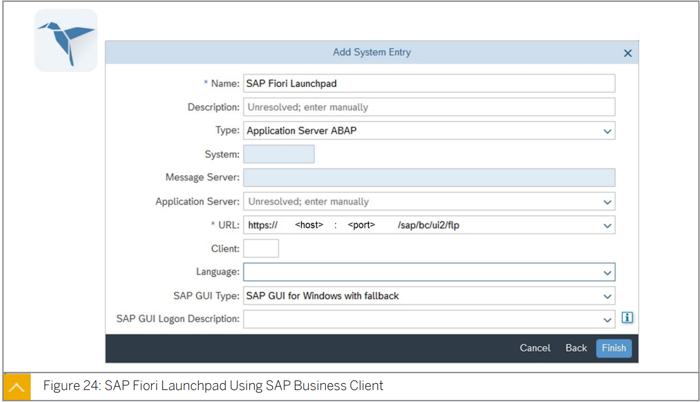

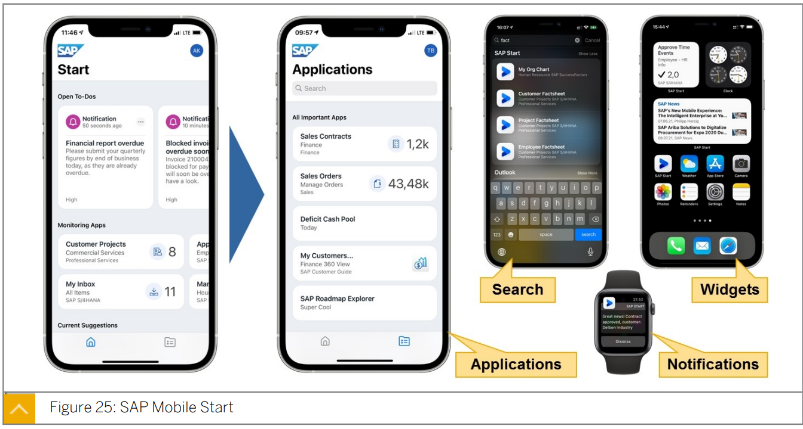

## Personalization

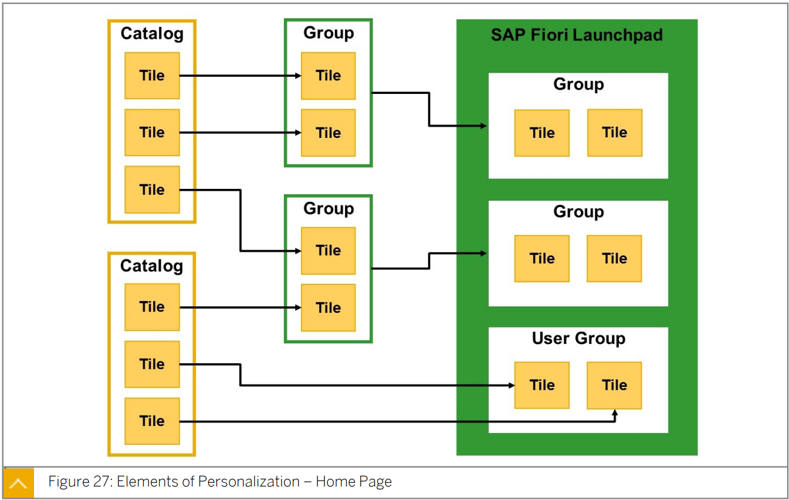

> 홈페이지 개념에서 사용자는 group 과 tile 을 재정렬하고 새 group 을 만들고 기존 group 에 tile 을 추가하거나 기존 group 에서 tile을 삭제하는 것이 가능하다.
>
> ***<u>tile 은 시스템의 catalog 에 정리</u>***되어있다.
>
> 이러한 ***<u>catalog 에는 응용프로그램을 시작하기 위한 모든 기술 정보</u>***가 들어있다.
>
> ***<u>FLP에 tile 을 표시하려면 tile 이 group 에 포함</u>***되어있어야 한다.
>
> 시스템에서 group 을 중앙에서 만든 다음 실행 창에 추가하거나 사용자가 자체 group 을 만들고 catalog 에서 tile 을 추가할 수 있다. 

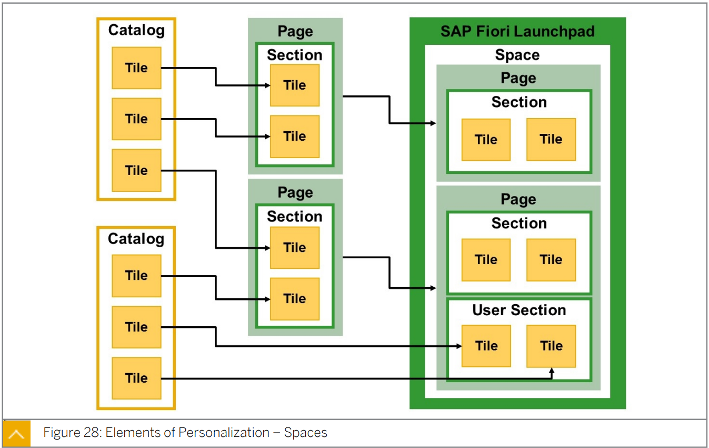

> SAP S/4HANA 2020 에서 도입된 ***<u>space 개념은 홈페이지의 group 에 대한 대안</u>***으로 사용될 수 있다.
>
> space 는 FLP 상단의  ribbon / tab으로 시각화되며 하나 이상의 페이지에 대한 프레임을 정의한다.
>
> 페이지는 group이 이전에 보여준 것과 동일한 방식으로 tile을 보여주는 섹션으로 구성된다.
>
> space 와 페이지는 시스템에서 중앙에 정의되지만 space 에 할당된 페이지를 포함하여 launchpad 에 space만 추가된다. 
>
> 섹션은 페이지의 필수적인 부분이며 사용자가 실행 창에서 만들 수도 있다.
>
> Note:
> Spaces(space) 아래 SAP Fiori launchpad  설정에서 space을 활성화할 수 있다.

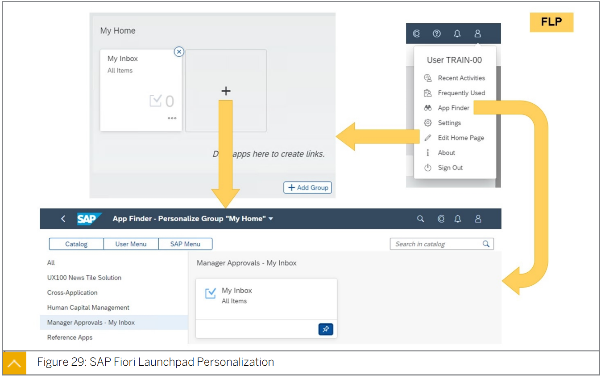

> action mode for personalization 로 들어가려면 FLP의  User Actions Menu 에서 Edit Home Page 를 선택해야 한다.
>
> 이 모드에서는 기존 그룹 또는 섹션에서 타일을 제거하고 새 그룹 또는 섹션을 만들고 다시 정렬할 수 있다.
>
> action mode 에서 그룹 또는 섹션에 새 타일을 추가하거나 사용자 작업 메뉴에서 앱 검색기를 선택하면 App Finder 가 표시된다.
>
> 여기서 사용자는 ***<u>user role 에 할당된 모든 카탈로그에서 타일을 선택</u>***할 수 있습니다.
>
> Note:
> 홈 페이지 및 응용프로그램 개인 설정 데이터를 다른 시스템으로 전송할 수 있다.
>
> /UIF/MIGrate_FES_PERSO 리포트를 사용하여 개인 설정 데이터를 수집하고 전송 요청에 기록할 수 있다.
>
> 자세한 내용은 SAP 노트 2789848을 참조

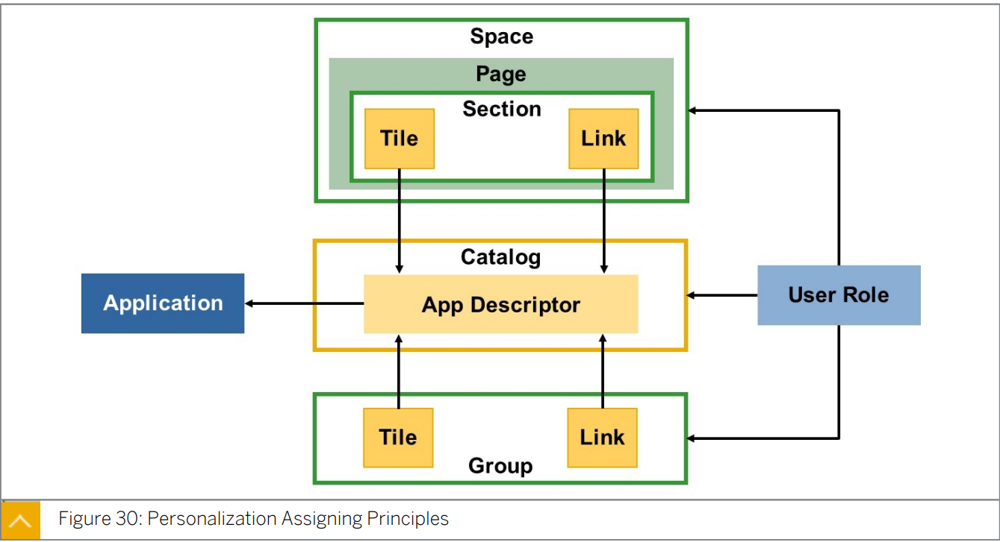

app descriptor는 FLP를 시스템의 app implementation 과 연결한다.

여기에는 올바른 매개 변수와 타일에 표시된 정보로 올바른 앱을 시작하는 것이 포함된다.

***<u>app descriptor</u>***는 한 솔루션 영역의 모든 앱을 수집하는 ***<u>카탈로그에 생성</u>***된다.

애플리케이션 descriptor 및 카탈로그는 SAP에서 제공한다. 

하지만, 그것들은 고객에 의해 만들어질 수도 있다.

app descriptor는 ***<u>그룹에서 참조한 다음 타일 또는 링크로 시각화</u>***할 수 있다.

***<u>그룹은 추가 설정을 추가하지 않으며</u>*** ***<u>앱에 직접 연결되지 않는다</u>***. 

***<u>카탈로그와 그룹을 모두 사용자 역할에 할당</u>***할 수 있다.

이는 user role 에 트랜잭션을 추가하고 카탈로그의 모든 앱에 대한 사용자 역할 액세스 권한을 부여하는 것과 유사하다.

또한 페이지별로 app descriptor를 참조한 다음 페이지를 space 에 할당할 때 타일 또는 링크로 시각화할 수 있다.

***<u>space 와 페이지는 추가 설정을 추가하지 않으며 앱에 직접 연결되지 않는다.</u>***

카탈로그와 space 를 모두 사용자 역할에 할당할 수 있지만 페이지에는 할당할 수 없다. 

이것은 카탈로그 및 그룹과 유사하게 작동한다.

SAP는 template catalogs, groups, spaces, roles 도 제공한다. 

그러나 이러한 요구사항은 고객의 요구사항, 더 정확하게는 고객의 사용자의 요구사항에 맞게 조정되어야 한다.

## Content Assignment

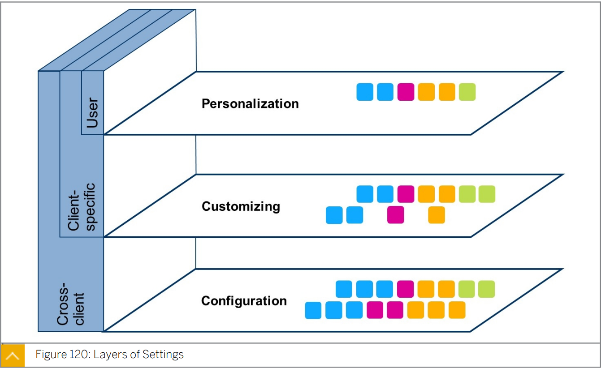

> SAP FLP 에 대한 설정은 세가지 계층으로 구성된다.
>
> * basic layer configuration은 AS ABAP 의 모든 클라이언트에 유효한 설정으로 구성된다.
> *  layer customizing 은 configuration 을 기반으로 하며 client 별 설정을 미세 조정한다. 
> * 그런 다음 end user 는 personalization layer 에서 이러한 설정을 personalization 할 수 있다. 
>
> 모든 layer 는 sub-level 에서 사용할수 있는 요소만 변경하거나 다음 layer 에서 사용하기 위해 요소를 줄일 수 있다. 
>
> 사용자는 원래 configuration layer 에서 제공되고 customizing layer 에서 사용할 수 있는 app 만 personalization 할 수 있다. 

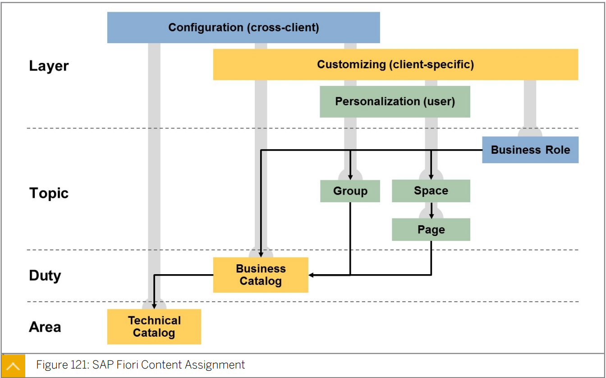

> 카탈로그는 FLP  의 SAP Fiori content 의 기본이다.
>
> ***<u>Technical catalog</u>*** 는 ***<u>solution area 별로 app 을 정의</u>***하는 반면
>
> ***<u>Business catalog</u>*** 는 ***<u>user Duty 별로 이러한 app 을 참조</u>***한다.
>
> ***<u>group, space 및 page 는 business catalog 에서</u>*** business 에서 ***<u>business Topic 별 tile 및 link 를 참조</u>***한다. 
>
> 그런 다음 ***<u>business catalog , group 및 space 를 business role 을 통해</u>*** **사용자에게 할당**할 수 있다. 
>
> ***<u>Technical catalog 는 configuration 에서만 정의</u>***할 수 있다. 
>
> ***<u>Business catalog 는 configuration 및 customizing 에서 정의</u>***할 수 있다.  
>
> ***<u>group</u>*** 은 ***<u>세 계층 모두에서 사용</u>***할 수 있는 ***<u>유일한 요소</u>***이다. 
>
> ***<u>space 와 page</u>*** 는 ***<u>customizing 에서 정의</u>***되며 ***<u>개인 설정에서 변경</u>***할 수 있다. 
>
> ***<u>Business role 은 customizing  시 사용자에게 할당</u>***된다. 

If the SAP Fiori elements application is deployed on Netweaver ABAP, you need to enable the 
application by the following steps:

1. Open SAP Fiori Launchpad Designer and create a tile catalog for the application.
2. Create a target mapping. Target mapping should have detailed technical information for 
    the access of the application, and expose the application as an intent (Semantic Object - 
    Action).
3. Create a tile based on the target mapping.
4. To give a user permission to access the SAP Fiori application, several application-specific 
    authorizations are needed.
    For front end user:
    The user must have a role which has the tile catalog in its role menu.
    For back end user:
