# 9.SAP Fiori Elements & Smartcontrols 

#### UX403

Describe the use of SAP Fiori Elements and Smartcontrols.


## UX402 Unit 3


## Fiori Elements, Overview

SAP Fiori element 는 UI 패턴에 대한 설계와 일반적으로 사용되는 app  패턴에 대한 predefine 된 템플릿을 제공한다.

개발자는 SAP Fiori element 를 사용하여 자밧크립트 UI 코딩이 필요 없는 OData 서비스 및 Annotation 기반으로 SAP Fiori 애플리케이션을 만들 수 있다.

결과 앱은 중앙에서 제공되는 predefine된 view 와 controller를 사용하므로 애플리케이션별 view 인스턴스가 필요하지 않다.

SAPUI5 런타임은 기본 OData 서비스의 metadata 및 annotation을 해석하고 시작 시 SAP Fiori 앱에 대한 해당 view를 사용한다.

predefine된 view 와 controller는 유사한 앱에서 UI 설계 일관성을 보장한다.

또한 metadata 기반 개발 모델은 각 앱의 프런트 엔드 코드 양을 크게 줄여 개발자가 비즈니스 로직에 집중할 수 있도록 한다.


* ### SAP Fiori Elements - Definition

  * #### No JavaSctipt UI Coding

    기존의 SAPUI5 개발과 달리 SAP Fiori Element 애플리케이션 개발에는 상세한 JavaScript 지식이 필수는 아니다.

    자바스크립트는 유연하고 완전히 동적인 언어이며 컴파일 타임 코드 검사가 없기 때문에 자바스크립트에 의해 작성된 코드는 런타임 오류의 가능성이 더 높다.

    SAP Fiori Element 는 JavaScript 코드를 공부하고 작성하고 디버깅하는 수고를 덜어준다.

    이러한 SAP Fiori 앱 개발 방식은 ***<u>특히 많은 SAP Fiori 앱이 필요한 경우</u>*** SAP Fiori 앱의 ***<u>전반적인 품질, 안정성 및 유지보수성</u>***을 제공한다.

    

  * #### Metadata-driven approach of SAP Fiori development

    이전 과정에서 배웠듯이 SAP Fiori 애플리케이션은 back end logic을 제공하는 OData 서비스에 의존한다.

    각 OData 서비스의 metadata document는 ***<u>Entity, 각 Entity 에 대한 property, collection, association 및 서비스 소비자를 위한 모든 것</u>***을 포함하는 서비스의 정보를 설명한다.

    SAP Fiori Element 개발의 접근 방식은 OData metadata document 에 보다 생생한 description 을 추가하는 것이다.

    이러한 description은 소비자가 data의 정보를 알 수 있을 뿐만 아니라 data를 표현하는 방법도 알 수 있게 해준다.

    OData metadata document 에 추가된 description 을 ***<u>OData Annotation</u>*** 이라고 한다.

    

  * #### Centrally Provided Templates covering Reporting, Analytic, Transaction scenarios.

    SAP는 SAP Fiori Element에 대한 템플릿을 제공한다.

    각 템플릿은 엔터프라이즈 애플리케이션의 공통 요구사항을 대상으로 한다.

    현재 우리는  Report, Overview Page, and Analytic List Page, targeting to daily reporting, analytic, transaction scenarios 를  보유하고 있다.

    SAP는 지속적으로 템플릿을 추가하여 SAP Fiori Element가 대부분의 일반적인 요구사항을 충족하도록 보장한다.


* ### Concept of Annotations of OData Services

  

  Annotation은 OData Service에 대한 description 정보이다.

  OData  V2.0에서 Annotation은 ***<u>OData metadata 의 XML tag</u>*** 에 저장되어 ***<u>data type,  nullable 등의 Entity 또는 Field 를 설명</u>***한다.

  SAP는 보다 ***<u>복잡한 용도를 충족하기 위해 표준 OData Annotation을 확장</u>***했다.

  SAP에서 지정한 모든 Annotation 은 ***<u>`sap:createable`, `sap:updatable`과 같이 `sap:`로 시작</u>*** 된다.

  이러한 Annotation은 ***<u>SAPUI5 애플리케이션에 영향을 주지 않는다</u>***.

  그러나 ***<u>'\CRUD Application'과 같은 wizard 에서 프로젝트를 생성</u>***하는 경우 생성된 코드는 ***<u>이러한 Annotation의 영향을 받는다</u>***.

  예를 들어, Record 업데이트를 위해 생성된 형식의 필드의 ***<u>editable property 은 해당 필드의 'sap:updatable' Annotation 에 의해 결정</u>*** 된다.

  

  OData V4.0 에서는 Annotation 이 OData metadata document 의 main part에서 분리된다.

  main part 와는 별도로 OData metadata document의 ***<u>stand alone part일 수도 있고 별도의 파일에 저장될 수도 있다.</u>***

  이를 통해 ***<u>보다 복잡한 Annotation 을 구축하거나 OData 서비스 하나에 대해 두 개 이상의 Annotation 을 작성</u>*** 하여 **서로 다른 요구 사항을 충족**할 수 있다.

  

  vocabulary는 OData 서비스에 annotation을 추가하는 방법을 정의한다.

  모든 annotation 파일은 참조에서 시작해야하고 일부 vocabulary 에 alias 를 제공해야 한다.

  vocabulary의 형식은 ***<u>Term 과 Type 의 정보를 포함하는 XML 문서</u>*** 이다.

  SAP Fiori Element 시나리오에서 가장 ***<u>중요한 vocabulary는 UI vocabulary</u>***이며 SAP Fiori Element에서 사용할 수 있는 ***<u>대부분의 annotation을 정의</u>*** 한다.

  Common , Communication 과 같은 다른 vocabulary는 ***<u>특정 도메인에서 annotation을 정의</u>***하며 ***<u>여러 시나리오에서 사용</u>***된다.

  

  Annotation은 ***<u>target별로 그룹화</u>***되어야 한다. 

  target은 ***<u>Annotation 그룹을 OData 서비스의 무언가에 연결</u>***한다.

  대부분의 Annotation은 data와 관련이 있으므로 ***<u>entity type 또는 property를 target</u>***으로 한다.

  경우에 따라 Annotation은 ***<u>OData Association, Function Import, 기타 object</u>***를 target으로 한다.

  일부 Annotation은 data에 관한 것이 아니거나 특정 Entity type과 결합하지 않으며, 이러한 Annotation에는 target이 없으므로 빈 "" target을 가진 Annotation 그룹에 포함되어야 한다.

  

  ***<u>모든 Annotation에는 term이 있어야 한다.</u>*** 

  term은 Annotation의 의미를 결정한다.

  예를 들어, ***<u>`UI.FieldGroup` term은 필드 그룹을 정의</u>***한다.

  동일한 target 에 대해 ***<u>동일한 term을 가진 두 개의 Annotation</u>***이 있는 경우 Annotation을 ***<u>고유하게</u>*** 만들려면 ***<u>qualifier 를 추가</u>***해야 한다.

  

  term 은 vocabulary로 정의된다. 

  다음 정보는 term 정의의 일부이다:

  * **Term Name** 

    term의 이름

  * **Data Type**

    term에 Record가 하나만 있는 경우 Type 을 작성한다.
    term에 다중 Record가 있을 수 있는 경우 Type attribute는 `Collection(<Data Type>)`이어야 한다

  * **Applies To**: 

    OData 서비스에서 이 term 의 target이 될 수 있는 element 의 종류를 정의한다.

  * **Nullable**: 

    기본값은 true 이다. 대부분의 Annotation 은 무효화할 수 있다. 

  * 이 term에 대한 Annotation 으로, 개발 도구에 사용된다.

  

  대부분의 term은 Complex type 으로 설명된다.
  Complex type은 다른 Complex type 이나 , (string,int32,boolean 같은) OData built in type (Edm) 에 의해 더 설명되는 property 를 가질 수 있다.

  

  더 나은 재사용성을 위해 type 상속이 지원된다.

  예를 들어 위의 `DataFieldAbstract`는 Abstract data type (`Abstract = true`)이고 

  `DataFieldWithAction` type은 `DataFieldAbstract`의 base type이므로 후자는 base type의 property 를 가지며 추가 property 가 정의된다.

  

  DataField 로 시작하는 Data Type 의 컬렉션은 UI Annotation의 기초이다.

  data 필드는 end user 가 보고 선택하고 검색하기 때문에 대부분의 term 과 Complex type은 이러한 data type과 관련이 있다.

  *<u>모든 type은 DataFieldAbstract에서 상속</u>*된다.

  * **DataFieldAbstract**

    모든 DataField type에 대한 Abstract type

    필드를 설명하는 공통 속성을 정의한다.

  * **DataField**

    화면의 일반 data field 

    OData 서비스의 entity type field 의 값을 표시한다.

  * **DataFieldForAnnotation**

    다른 Annotation은 화면에 표시되는 필드를 결정한다.

  * **DataFieldWithAction**

    단추 또는 링크로 렌더링되는 실제 작업은 필드 값과 관련이 있다.

  * **DataFieldForAction**
    단추 또는 링크로 렌더링되는 작업은 `DataFieldWithAction`과 달리 필드 값과 관련이 없다.

  * **DataFieldWithNavigationPath**
    필드의 data source는 association을 통해 액세스할 수 있는 다른 엔티티 type의 필드이다.

  * **DataFieldWithURL**
    data 필드는 하이퍼링크로 렌더링되며 사용자가 선택하면 URL이 열린다.

  * **DataFieldWithIntentBasedNavigation**
    data 필드가 하이퍼링크로 렌더링되고 SAP Fiori Launchpad에 정의된 intent로 이동한다. target 은 필드 값과 관련이 있다.

  * **DataFieldForIntentBasedNavigation**
    data 필드가 하이퍼링크로 렌더링되고 SAP Fiori Launchpad에 정의된 intent로 이동한다. 대상은 `DataFieldWithIntentBasedNavigation`과 달리 필드 값과 관련이 없다.


솔직히 무슨 내용인지 깊이 있게 이해되지 않는다.

> https://sap.github.io/odata-vocabularies/vocabularies/UI.html#DataFieldAbstract 
>

혹 시간이 된다면 참고 하자


* ### Smart Control, Concept

  

  스마트 컨트롤은 SAP Fiori element 이전에 개발된 컨트롤 collection 이다.

  초기 목적은 대부분의 일반적인 use case에서 SAPUI5의 basic control 을 대체하는 것이었다.

  이 아이디어는 스마트 컨트롤을 통해 전체 애플리케이션을 구축하는 것이었는데, 이는 SAP Fiori element의predecessor 인 Smart Template 이었다.

  개발자는 이러한 컨트롤을 독립적으로 사용하거나 스마트 템플릿을 사용하여 스마트 응용프로그램을 구축할 수 있다.

  Smart Control 과 SAP Fiori element의 ***<u>개발 및 유지보수는 별개</u>***이다.
  현재 SmartControl은 주로 SAP Fiori element용이며 ***<u>독립 실행형 사용에는 권장되지 않는다</u>***.
  스마트 컨트롤의 모든 ***<u>새로운 기능은 SAP Fiori element의 요구 사항에 따라 결정</u>***된다.

  


##  Templates for Fiori Elements

* ### List Repost

  

  List Report를 통해 사용자는 많은 item list 로 작업할 수 있다.

  큰 ***<u>list 를 필터링</u>***하는 강력한 기능과 **<u>*결과 item list 를 표시하는 다양한 방법*</u>**을 결합한다.

  #### List Report - Element

  * **Application header**

    variant management 를 포함한 smart filter bar 와 Send Email action 을 포함한 generic Share menu 

  * **Save as Tile**

    SAP Jam에서 공유(SAP Jam과 integration 이 구성된 경우).

    기본적으로 ***<u>smart filter bar 는 사용자가 앱을 시작할 때 표시</u>***된다. 

    **이동을 선택**하면 ***<u>List Report의 내용이 표시</u>***된다.

    사용자가 기본 variant 로 `Execute on Select` 를 설정한 경우 앱을 ***<u>시작하자마자 List Report의 내용이 표시되고 smart filter bar 가 축소</u>***된다.

  * **Smart table**

  * **Footer toolbar**

    optional action 을 포함할 수 있다.

    

  List Report는 plain text 뿐만 아니라 UX 를 개선하기 위해 다양한 다른 양식으로도 data 를 표시할 수 있다.

  또한 ***<u>편집 가능한 cell</u>*** 을 지원하며 CRUD 작업을 해당 백엔드 코드에 활용할 수 있다.

  이를 통해 ***<u>SAP GUI에서 ALV를 대체하는 List Report</u>***를 사용할 수 있다. 

  SQVI 및 ALV 기반 ABAP report 에 의해 생성된 많은 ABAP 쿼리를 List Report로 대체할 수 있다.


* ### Object Page

  

  Object Page에는 단일 비즈니스 entity의 정보가 표시된다.
  Object Page의 주요 entry 는 List Report에서 행을 선택하는 것이므로 이 페이지는 List Report 템플릿에 결합하여 사용한다.
  List Report 를 사용하여 SAP Fiori Element 애플리케이션을 생성하면 Object Page가 나타난다.

  #### Object Page - Element

  * 오브젝트 유형 또는 제품으로 설정된 **Page Title**

  * **Object Header**

    - 제목 및 부제
    - 상태 편집 icon

  * 일반 작업이 포함된 **Header toolbar** (Display mode)

  * 포함할 수 있는 **Optional Element**

    - description
    - object 의 image
    - use case-specific actions (예: 편집 및 삭제) 에 대한 헤더 header toolbar 의 button

  * object 에 대한 중요한 정보를 보여줄 **Header facets** 

    - 가격 또는 가용성 등을 표시하기 위한 Label-field pairs

      최대 5개의 Label-field pair 를 사용하는 것이 좋다.

    - 판매 수익을 자세히 설명하는 micro chart 를 표시하거나 user-assigned 등급의 평균을 시각화 하는 rating indicator 와 같은 것들을 보여주기 위한 smart control 

  * 사용자가 개별 content area section 으로 이동할 수 있는 **Anchor navigation area**

  * 필드 그룹 또는 테이블을 포함할 수 있는 섹션으로 데이터가 구성되는 **content area**

  * **Footer bar** 

    작업 및 메시지 표시 단추를 사용할 수 있다(해당하는 경우).

    하위 항목 Object Page의 Footer bar에는 create 및 edit 모드의 적용 button 도 포함된다.

    이 작업은 현재 create / edit 작업을 완료하고 draft 를 저장한 후 object hierarchy 에서 한 단계 위로 이동한다. 

    작업이 성공적인 경우 toast message 가 표시된다.


* ### Overview Page

  

  Overview Page는 ***<u>SAPUI5 technology, OData 서비스 및 대량의 정보를 구성하기 위한 Annotation</u>***을 사용하여 구축된 ***<u>data-driven(데이터 기반) SAP Fiori 애플리케이션</u>*** 이다.

  Overview Page에서는 중요한 비즈니스 정보를 ***<u>시각적이고 실행 가능한 카드 형태</u>***로 ***<u>한 눈에 빠르게 액세스</u>***할 수 있다.

  **<u>*사용자 친화적인 환경*</u>**을 통해 ***<u>데이터를 빠르고 간단하게 보고 필터링하고 처리</u>***할 수 있다.

  비즈니스 사용자는 큰 그림을 ***<u>한 눈에 보여주는 동시에 가장 중요한 작업에 집중</u>***하여 ***<u>신속한 의사 결정과 즉각적인 조치를 수행</u>***할 수 있다.

  응용프로그램을 사용하면 정보를 매력적이고 효율적인 방식으로 시각화하는 데 도움이 되는 **여러 유형의 콘텐츠에 대한 여러 카드**를 만들 수 있다.

  SAP Business Application Studio의 ***<u>Overview Page wizard</u>***를 사용하여 Overview Page를 생성하고 페이지에 카드를 추가할 수 있다.

  ***<u>표시된 데이터는 fully interactive</u>*** 하며, 클릭 가능한 영역을 통해 ***<u>관련 응용 프로그램으로 쉽게 이동</u>***할 수 있다.

  Overview Page는 SAP Fiori를 기반으로 완벽하게 응답하는 UI 로 action item 을 구성한다.

  사용자는 SAP Fiori Launchpad에서 Overview Page에 액세스하여 **<u>표시되는 정보를 좁히거나 특정 주제에 초점을 맞추기 위해 카드를 숨길</u>** 수 있다.

  #### Overview Page - Component

  * **Application header**
    이 응용 프로그램이 Overview 를 제공하는 영역(예: 조달 또는 판매)에 대한 설명을 제공한다.
    헤더 영역에서 ***<u>사용자 계정 설정을 변경하고 카드(표시/숨기기)를 관리</u>***할 수 있다.

  * **Smart filter**
    ***<u>카드에 표시되는 데이터 수준을 변경하기 위한 응용 프로그램 수준 필터</u>***를 제공한다.
    예를 들어 필터를 사용하여 10,000달러보다 큰 트랜잭션만 표시하고 50kg보다 가벼운 항목만 표시할 수 있다.

  * **Cards**
    카드는 ***<u>UI Annotation 을 사용하여 콘텐츠를 렌더링하는 smart component</u>*** 이다.

    각 카드는 ***<u>데이터 소스에 설정된 단일 Entity 에 바인딩</u>***됩니다. 

    카드는 ***<u>도넛, 막대 차트 또는 테이블을 표시</u>***할 수 있다.

    스택 카드는 ***<u>객체 스트림에서 볼 수 있는 일련의 quick view cards</u>***를 포함한다.

    카드는 최대 5개의 응답 열로 Overview Page에 표시되며 ***<u>끌어서 놓기를 통해 다시 정렬</u>***할 수 있다.


* ### Analytical List Page

  

  ALP(Analytical List Page)는 상세 분석을 위한 SAP Fiori Element 애플리케이션이다.

  ***<u>SAP S/4HANA 1709 및 ABAP 7.52에 도입</u>***된 새로운 템플릿이다.

  ***<u>다양한 관점에서 데이터를 분석하고 근본 원인을 조사하며 트랜잭션 콘텐츠에 대해 작업</u>***할 수 있다.

  ***<u>데이터 시각화 및 비즈니스 인텔리전스</u>***를 사용하여 ***<u>data set 또는 중요한 단일 인스턴스 내에서 관련 영역을 식별</u>***할 수 있다.

  이 모든 것을 ***<u>한 페이지 안에서 원활하게 수행</u>***할 수 있다.

  ***<u>차트 및 테이블 시각화</u>***를 사용하는 ***<u>트랜잭션 및 분석 데이터의 조합</u>***을 통해 **관련 데이터를 빠르게 볼 수 있다.**

  이러한 ***<u>data 의 hybrid view</u>*** 를 통해 ***<u>차트와 테이블 표현 간</u>***의 흥미로운 상호 작용이 가능하다.

  다음 사용 사례를 한 페이지에 원활하게 포함하도록 ALP를 구성한다:

  * 헤더 영역의 관련 KPI(key performance indicators) KPI tag 

  * 이러한 KPI 태그들은 또한 KPI 카드들을 통한 점진적인 개시 및 탐색을 가능하게 한다.

  * 다른 필터 모드를 통해 주 내용 영역에 사용되는 data set를 필터링한다.

    예를 들어 Visual Filter는 관련 측정값에서 필터 값을 선택하는 직관적인 방법을 제공한다.

  * 콘텐츠 영역 및 KPI 카드 영역에서 애플리케이션으로 원활하게 이동할 수 있다.

  * ALP를 사용자 정의하고 다른 사용자와 페이지 variant 로 공유한다.


## The Development Environment (중요 X)


### SAP Fiori Element 개발을 위한 요소들

* 개발 도구를 실행하기 위한 **SAP BTP 계정** – **SAP Business Application Studio** - dev space
* 서버는 OData back end 의 역할을 수행하며, 이 과정에서는 embeded시나리오를 사용한다.
  따라서 back end logic 에는 하나의 ABAP 서버 만 사용하고 OData 서비스 및 SAP Fiori 애플리케이션을 게시하는 데에는 **SAP Gateway 서버**를 사용합니다.
* 게이트웨이 서버와 SAP BTP 간의 보안 연결을 설정하는 **SAP Cloud Connector**


1. SAP Business Technology Platform에 계정을 등록

2. SAP BTP 계정을 SAP 클라우드에 추가

3. 내부 SAP Gateway 서버를 연결하고 가상 호스트 이름/포트를 통해 노출되도록 SAP Cloud Connector에서 액세스 제어 정보를 구성

4. SAP BTP의 연결 서비스에서 대상을 생성

   이 대상을 사용하여 SAP Cloud Connector에 정의된 가상 호스트 이름을 통해 내부 SAP 게이트웨이에 연결

5. SAP BAS wizard를 실행하여 구성을 테스트합니다. 생성한 대상을 선택하고 OData 서비스 목록이 표시되는지 확인

### Create Fiori Element

1. Create an SAP Fiori elements application.
2. Choose an OData service.
3. Create an annotation file and writing annotation.
4. Modify the configuration file.
5. Translate resource bundles.
6. Deploy your SAP Fiori elements application.
7. Configure SAP Fiori Launchpad.
8. Authorize user to access the SAP Fiori application.
9. Log on to SAP Fiori Launchpad and add the tile to the SAP Fiori Launchpad.


## Fiori Guided Development


## Using CDS(Core Data Service) View


* ### The Core Data Services (CDS) View

  

  ABAP Core Data Service (ABAP CDS) 는 AS ABAP 에 대한 일반 CDS 개념의 platform-independent implementation 이다.

  ABAP CDS 는 표준 AS ABAP database 에서 semantic data model 을 정의할 수 있다.

  SAP HANA-specific variant HANA CDS 와 달리 ***<u>ABAP CDS 는 database 시스템과 독립적</u>***이다.

  ABAP CDS 에 정의된 모델의 Entity 는 ABAP Dictionary 에 정의된 기존 database table 및 view 에 비해 향상된 access 기능을 제공하여 Open SQL 기반 app 을 최적화 할 수 있다.

  AS ABAP 이 SAP HANA database 를 사용할 때 메모리 내 특성을 최적의 방식으로 구현할 수 있기 때문에 이는 특히 명확하다.

  

  기본 CDS 는 view 를 정의하고 CDS 의 정의는 SQL 과 같은 구문을 사용한다.

  * **SQL View Name** : 

    ***<u>ABAP Dictionary 와의 호환성</u>***을 위해 각 CDS에는 ***<u>Old ABAP Dictionary (최대길이 : 16) 의 이름</u>***이 있어야 한다.

  * **Data Source** : 

    CDS View 는 ***<u>하나 이상의 database table 또는 CDS View 에서 데이터를 선택</u>***한다.

    데이터가 둘 이상의 data source 에서 가져온 경우 ***<u>SQL JOIN 구문을 사용하여 여러 data source 에서 데이터를 선택</u>***할 수 있다.

  * **Projection List** : 

    CDS View  에서 ***<u>가장 중요한 부분은 Projection List</u>*** 이다.

    Projection List 에서 계산된 ***<u>필드를 만드는 데 complex expression 을 사용할 수</u>*** 있다.


* ### Annotations for CDS Views

  

  CDS annotation 은 data 를 설명하기 위한 추가 정보로 CDS View 의 소비자가 CDS View 의 data 를 사용하는 방법을 알 수 있도록 한다.

  * CDS view 는 ABAP DDIC 에서 추출한 semantic information 으로 data 를 읽는 logic 을 정의한다.
  * CDS Annotation 은 data field 또는 view 자신의 추가 정보를 추가한다.
  * CDS Core annotation 은 모든 client 가 사용하는 가장 일반적인 정보를 포함한다.
  * CDS domain-specific annotation 은 특수 용도에 대한 정보를 포함한다.
  * CDS View 에 대한 annotation 작성 방법은 CDS View 용도에 따라 달라진다.

  

  | Domain                  | Usage                                                        |
  | ----------------------- | ------------------------------------------------------------ |
  | UI Annotation           | Fiori Element 의 가장 중요한 domain<br/>***<u>CDS Annotation 과 OData Annotation 간의 거의 one-to-one 관계</u>***이다. |
  | Consumption Annotations | data field 또는 전체 Entity 의 ***<u>가시성을 제어</u>***한다. <br/>field 에 대한 ***<u>value help 를 정의</u>***할 때 유용하다. |
  | Object Model Annotation | business data model 의 ***<u>구조적 측면 및 transaction 관련 측면에 대한 정의</u>*** 제공 |
  | Semantics Annotations   | data field 에 대한 ***<u>semantic information 의 강화</u>*** |

  

  ***<u>Annotation 은 용도에 따라 그룹화</u>*** 되며, 위 표의 SAP Fiori Element 와 관련된 Domain-Specific Annotation 은 SAP Fiori Element 와 가장 관련성이 높은 연관 그룹을 보여준다.

  > [***<u>CDS View Annotation  자료</u>***](https://help.sap.com/docs/SAP_NETWEAVER_AS_ABAP_751_IP/cc0c305d2fab47bd808adcad3ca7ee9d/630ce9b386b84e80bfade96779fbaeec.html?locale=en-US&amp;amp;version=7.51.13)
  >
  
  
  
  Annotation term 이 structure 를 나타내는 경우 annotation 작성에 두가지 옵션을 사용할 수 있다.
  
  * **Object Style**  
  
    클래스의 attribute 와 같은  ***<u>`.` 를 사용하여 sub level property 에 access</u>*** 한다.
  
  * **JSON Style** 
  
    JSON object 와 같은 방식으로 property 에 접근한다.
  
    `{}` 는 structure 를 나타낸다.
  
    property name 과 value 를 분리 하기 위해 `:` 를 사용한다.
  
    property 를 분리 하기 위해 `,` 를 사용한다.
  
  두 구문 모두 의미가 같으며 ***<u>`@UI.headerInfo.title: { value: 'SalesOrderID' }` 와 같이 둘을 조합하여 사용</u>***할 수도 있다.
  
  
  
  
  
  ***<u>annotation term 이 array 를 나타내는</u>*** 경우 유일한 option 은 ***<u>JSON array 를 사용</u>***하는 것이다.
  
  위 구문의 주요 기능
  
  * `{}` 는 structure 를 나타낸다.
  * `[]` 는 array 를 나타낸다.
  * property name 과 value 를 구분하기 위해 `:` 를 사용한다.
  * property 를 분리 하기 위해 `,` 를 사용한다.
  * 대부분의 경우 ***<u>각 라인은 식별을 위해 `qualifier` 라는 속성</u>***을 가져야 한다. 
  
  
  
  
  
  경우에 따라 term 이 array type 이지만 ***<u>대부분의 사용에는 single line record 만 있다</u>***.
  
  이 경우 ***<u>Object Style 을 사용하여 입력을 단순화</u>***할 수 있다.


* ### CDS Associations

  

  CDS View 는  일부 association 을 정의할 수 있다.

  Association 은 자체적으로 또는 이 CDS View 의 consumer 가 consume 할 수 있는 view 의 Association 을 선언하는 것이다.

  일반적으로 business entity 의 표현으로 association 을 정의하는 재사용 가능한 CDS View 를 정의해야한다. 

  그런 다음 interface view 를 data source 로 사용하는 consumption  CDS View 를 작성하여 data 와 association 을 사용할 수 있다.

  예를 들어 위 그림에서는 interface view1 에는 interface view3 과 interface view 2 에 연결된 두개의 association 이 있다.

  Consumption View 1 은 interface view1 의 데이터에 액세스 할 때 마다 다음을 수행할 수 있다.

  * interface view 1 의 field 에 access 

  * interface view 1 의 Association 1 을 통해 interface view 2 의  field 에 access

  * 이 view 의 consumer 가 interface view 3 의 field 에 access 할 수 있도록 하려면 interface view 1 의 association 2 를 다시 표시한다.

  

  

  위 그림의 association 의 구문은 세가지 main area 를 보여준다.

  * #### Define an association:

    ***<u>association 의 정의는 SQL JOIN 구문과 매우 유사</u>***하다. 

    현재 ***<u>프로젝트 list 에서 필드를 참조하는 쉬운 방법은 `$projection.`</u>*** 이다.

  * #### Use fields from an existing association:

    association name 과  field name 을 `.` 로 연결하는 것으로 association 으로 연결된 CDS View 로부터 field 에 access 할 수 있다.

    association 은 현 CDS View 또는 data source view 에서 정의할 수 있다.

  * #### Expose an association for external usage:

    이 view 의 consumer 를 위한 association 을 표시하기 위해 projection list 에 association name 을 작성한다.

    ***<u>association 과 field 는 구분 하기 위해</u>*** association name 의 앞에는 통상적으로 ***`_` 를 붙인다.***

    


## Using the Service Adaption Definition  Language (SADL)

* ### Service Adaptation Definition Language (SADL)

  

  SADL framework 는 연결된 CDS View group을 OData 서비스에 게시하는데 도움이 된다.

  각 ***<u>CDS View 는 Entity Set</u>*** 이며 그들의 ***<u>Association OData association 로 변환</u>***된다. 

  ***<u>association name 은 Navigation Property 로 OData Entity 에 반영</u>***된다.

  모든 SAP ***<u>Fiori Element 관련 annotation 은 OData annotation 으로 변환</u>***된다.

  **CDS View => Entity Set**

  **CDS Association => OData Association**

  **Association name => Navigation Property**

  **CDS UI Annotation => OData Annotation** 

  이러한 방식으로 비즈니스 logic, OData 서비스 개발 및 Annotation 을 하나의 CDS View 로 결합할 수 있다.


* ### CDS as an OData Service

  

  CDS View 에 ***<u>`@OData.publish:true` annotation 이 있는 경우</u>*** back end 시스템에 ***<u>OData 서비스가 자동으로 생성</u>***된다.

  프론트 엔트 시스템에서 활성화 하기만 하면 된다.

  작업중인 ***<u>CDS View 가 생성된 OData 서비스와 이름이 동인한 EntitySet</u>*** 으로 변환된다.

  이 view 와 연결된 모든 CDS View 도 EntitySet 으로 변환된다.

  Association relationship 이 OData 서비스에서 Association 및 Navigation Property 으로 변환된다.


* ### Creating an OData Service by Referencing a CDS

  

  SAP Gateway Service Builder 에서 기존 CDS View 를 참조할 수 있다.

  그런 다음 연결된 CDS View 를 선택적으로 추가할 수 있으며, 연결된 View 의 Association 도 OData 서비스에 추가할 수 있다.

  그런 다음 MPC 또는 DPC 표준 구현을 redefine 하여 OData 서비스에 대한 write support 및 OData service 를 위한 advanced OData 기능을 추가할 수 있다.

  *CDS 를 참조하여 OData Service 를 만드는 방법에 대한 자세한 내용은 GW100 참조* 


* ### Relationship Between CDS Annotation and OData Annotation

  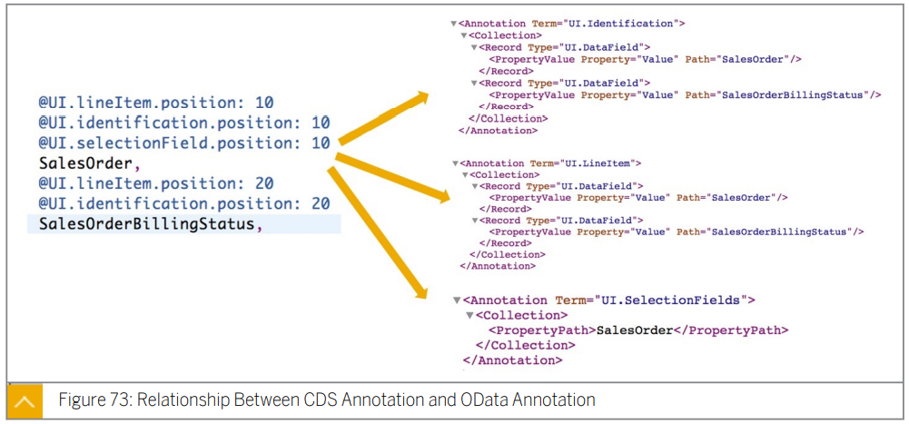

  OData 주석과 마찬가지로 CDS Annotation 을 EntitySet 또는 data field 에 적용할 수 있다.

  대부분의 경우 OData Annotaion term 과 CDS Annotation 사이에는 1:1 relationship 이 있으며 이름은 유사하다.

  CDS View 는 대상별로 그룹화 된다.

  동일한 대상을 가진 Annotation 은 함께 유지된다.

  OData Annotation 에는 고정된 위치가 없다. 

  일반적으로 term 별로 그룹화 된다.

  OData Annotation 으로 변환될 때 한 term 에 속하는 CDS Annotation 의 sequence 는 position property 에 의해 결정된다.


## Metadata Extension


***<u>complex annotation 이 필요한 경우</u>*** CDS 의 구문이 ***<u>증가하여 CDS 의 가독성이 저하</u>***될 수 있다.

Metadata Extension 은 annotation 을 비즈니스 logic 을 분리한다.

Metadata Extension 을 구현하려면 다음을 수행해야 한다.

1. CDS View 에 `@metadata.allExtensions:true` 의 Annotation 을 추가한다.
2. Metadata Extension 을 만들고 view 및 해당 field 에 대한 주석을 작성한다.
3. field 를 구분하려면 `;` 를 사용한다.

Metadata Extension 는 JSON Style 만 허용

> [***<u>동일한 CDS 에 대해 Metadata Extension annotation 이 두개 이상있는 경우 사용되는 Metadata Extension 을 결정하는 방법</u>***](https://help.sap.com/doc/abapdocu_752_index_htm/7.52/en-US/abencds_meta_data_extension_eval.htm)


## SADL vs Local Annotation

* ### Advantage of SADL

  Annotation and data stay together

  Syntax is simple

  Reusable

* ### Advantage Local Annotation

  single field 또는 entity 에 binding 되지 않은 complex annotation 처리 가능

  CDS Annotation 보다 빠른 Vocabulary list update

  CDS Annotation 을 재정의 가능


## List Report

### Basic Annotations for List Report


* #### Mandatory Annotations

  * **`@OData.publish:true`** : CDS View 를 OData Service 로 자동 exposure 한다.

  * **`@UI.headerInfo.typeNamePlural`** : List Report 좌측 상단 모서리에 표시되는 텍스트를 결정한다.


* #### Adding Columns to Report

  

  *<u>**`@UI.lineItem`**</u>* 는 List Report 의 ***<u>기본열을 설정하는데 사용</u>***된다.

  `@UI.lineItem` 의 data type 은 data field 의 collection 이지만 대부분의 경우 field 에 대해 단 한개의 `@UI.lineItem` 만 존재한다.

  ***<u>`@UI.lintItem.position`</u>*** 은 column 의 ***<u>순서를 결정하는 mandatory property</u>*** 이다.

  각 **필드의 label** 은 필드에 대한 ***<u>data element 의 field label</u>*** 에서 가져온다.

  List Report 에 계산된 field 를 추가할 수도 있다.

  해당 field 는 data element 를 참조하지 않으므로 ***<u>`@UI.lineItem.label` 을 통해 할당</u>***하거나 ***<u>function cast 를 통해 data type 을 data element 로 변환</u>***해야한다.


* #### Semantic Information for Amount / Quantity fields

  

  금액 및 수량 필드의 경우 통화/단위 필드를 찾을 수 있는 곳을 지정해야한다.

  DDIC 또는 다른 CDS Entity 에서 선택한 필드에 이미 이 정보가 있을 수 있다.

  올바르게 정의되어있는 경우 통화/단위가 금액 수량 필드와 함께 표시된다.

  올바르게 표시 되지 않는경우

  currency/unit field 에  

  ***<u>`@semantics.currencycode` / `@semantics.unitofmeasure`</u>*** 에 true 값을 준 annotation 을

  amount/quantity field 에 

  ***<u>`@semantics.amount.currencycode` / `@semantics.quantity.unitofmeasure`</u>***

  주석에 currencyCode / unit 정보가 있는 field 명을 값으로 준 annotaion 을 추가하여 연결할 수 있다.

  ***<u>계산된 field 에 대해서는 항상 semantic information annotation 을 추가</u>***해야한다.


* #### Options for Adjusting the Display of Columns 중요!!

  * **Importance of Columns**

    

    List Report 에 사용되는 control 은 모든 client 를 위해 설계 되어있다.

    client 마다 화면의 너비는 다르고 스마트폰에 표시되는 필드는 데시크톱 브라우저 보다 작아야한다.

    *<u>**`@UI.lineItem.importance`**</u>*를 통해 필드에 표시할 client 를 결정할 수 있다.

    * *<u>**#HIGH**</u>*  *<u>**`@UI.lineItem.importance: #HIGH`**</u>*

      기본값 모든 클라이언트에 표시

    * ***<u>#MEDIUM</u>*** *<u>**`@UI.lineItem.importance: #MEDIUM`**</u>*

      데스크톱 브라우저 또는 태블릿에만 표시

    * ***<u>#LOW</u>*** *<u>**`@UI.lineItem.importance: #LOW`**</u>*

      데스크 톱에만 표시

  * **Hiding Fields**

    List Report 우측 상단 모서리를 클릭하여 column 표시를 직접 설정할 수 있다.

    CDS View 의 일부 field 는 end user 에게 노출 되어서는 안된다.

    이런 경우 ***<u>`@UI.hidden`</u>***  를 사용하여 노출되지 않도록 숨길 수 있다.

    

### Searching and Filtering Data


Search Field 는 List Report 좌측 상단 모서리에 있는 입력 field 이다. 

Selection Field 는 ***<u>value help dialog 를 포함</u>***한 입력 field 이다.

각 Selection Field 는 ***<u>back end OData service 의 한 property</u>*** 를 나타낸다 ***<u>(1:1 관계)</u>***.


Search Field 를 사용하기 위해 ***<u>`@Search.searchable:true` annotation 을 추가</u>***한다. 

***<u>`@Search.defaultSearchElement: true` annotation</u>*** 을 통해 ***<u>하나 이상의 필드를 기본 요소로 설정</u>***해야 한다.

Fuzzy 기능을 사용하기 위해서는 ***<u>`@Search.fuzzinessThreshold` annotation 을 통해 위와 같이 threshold 값을 설정해 주어야 한다. (0~1)</u>***

***<u>값이 증가</u>***할 수록 검색 결과는 ***<u>더 정확하고 더 적은 record 를 반환</u>***한다.

통상적으로 0.8 을 사용한다.

* **Fuzzy Search**

  

  Fuzzy Search 가 적용 되지 않은 경우 ***<u>\* 또는 ? 같은 wildcard character 를 사용</u>***하여 검색해야 하지만

  Fuzzy Search 가 적용된 경우 키워드에 오타를 입력하면 ***<u>유사한 결과를 띄워준다</u>***.

다른 annotation 과 달리 Search Field 에 대한 주석은 OData service 의 metadata 에 만 영향을 미친다.

CDS View 에서 생성된 Entitiy Set 에 OData V2 주석이 있다.

기본 검색 요소 및 fuzzy 검색 관련 주석은 ***<u>UI 와 관련이 없으므로 OData annotation 에 나타나지 않는다</u>***. 

 


목록에서 선택한 값이 사용자가 원하는 케이스에 없는 경우 입력값은 조건의 자유로운 스타일 입력도 지원한다.

개발자가 값 도움말 대화 상자를 제공하지 않은 경우 자유 스타일 입력만 지원된다.

조건 입력이 완료되면 모든 조건이 검색 필드에 표시된다.

사용자는 오른쪽에서 X를 선택하여 단일 조건을 삭제할 수 있다.


Selection Field 를 사용하려면 ***<u>`@UI.selctionField.position` element annotation</u>*** 을 사용한다.

***<u>Column 에 display 되지 않는 field 도 filter 조건</u>***으로 사용할 수 있다.


### Value Help


field 에 대한 association 이 있는 경우 이 ***<u>association 을 field 에 대한 check table 로 사용</u>***할 수 있다.

이를 이용하여 사용자에게 value help 를 제공할 수 있다.

다음 단계는 foreign key 연결에대한 value help 를 제공하는데 사용된다.

1. value help 에대한 적절한 association 을 찾는다.
2. ***<u>`@ObjectModel.foreignkey.association`</u>*** 을 사용하여 selection field 에 annotation을 추가한다. 
3. association 을 expose 한다.


foreign key 기반으로 value help 를 선언하는 것은 쉽지만 다음과 같은 제한이 있다.

* 일반적으로 비즈니스 Entity 의 technical key field 만 end user 에게 숨기려는 필드인 다른 보기와 연결됩니다.

  association 으로 띄워지는 dialog 에서는 보여지는 field 를 설정 할 수 없다는 말로 이해

* search help window 에서는 key field 와 `@semantics.text:true` annotation 이 달린 하나의 필드만 검색 결과 창에 표시할 수 있다.
* check view 의 모든 field 는 value help screen 의 selection field 로 표시된다.


보다 나은 UX 를 위해 다음 단계에 따라 모델링된 value help view를 작성한다.

1. CDS View 를 만들고 기존 테이블 또는 CDS View 에서 데이터를 선택한다.

   Value help 에 display 할 field 만 expose 한다.

2. value help view 에 대한 조건 및 계산된 필드를 추가할 수 있다.

3. report CDS View 에서 value help view 로 의 association 을 만들고 end user 가 이해할 수 있는 selection field 로 연결한다.

4. selection field 에 `@Comsuption.valuehelp:'<association_name>` annotation 을 추가한다.

5. association 을 expose 한다.

6. value help CDS View 에 `@search` annotation 을 추가하여 value help 에 대한 full text fuzzy search function 을 추가할 수 있다.

* **Note :**
  * 계산된 필드를 꼭 필요한 경우가 아니라면 (?)검색 조건으로 사용하지 않기를 권장한다. 성능 문제로 이어질 수 있다.
  * value help view에서 계산된 필드의 경우 `@EndUserText.label` 에서 label 을 설정합니다.
  * value help view를 수정하고 활성화한 후 report CDS View 다시 배포해야한다.


### Variant Managemen


SAPUI5 flexibility 서비스를 사용하면 다양한 사용자 그룹이 SAP Fiori 앱을 개인화하고 런타임에 UI 를 조정하고 새 앱을 개발할 수 있습니다.

이 서비스는 user-specific data 및 client-wide data를 ABAP 서버의 특수 repository 에 저장합니다. 

이를 ***<u>layered repository</u>*** 라고 합니다.


**<u>SAPUI5 flexibility 서비스의 필수 구성 요소</u>**

* Server : ***<u>ABAP front end server 및 SAP NetWeaver 7.31 SP 11 이상</u>***
* 다음 ICF 노드를 활성화해야 한다:
  ***<u>/SAP/BC/UI5_UI5</u>***
  ***<u>/SAP/BC/LREP</u>***
* For creating shared variants
  * 권한 부여 필드가 ***<u>`/UIF/KEYU = 'X'` 인 ABAP authorization object `/UIF/FLEX`</u>***  가 필요하다.
  * 사용자에게 할당된 작업이 있는 ***<u>transaction request</u>*** 가 필요하다


SAP NetWeaver AS ABAP 인 경우에만 variant 관리가 가능하다.


* #### Variant Selection

  

  Selection Variant(선택 variant)는 사용자를 저장한다.

  데이터를 필터링한 후 사용자는 variant 로 조건을 저장할 수 있다. 

  다음 항목은 선택 variant 에 대한 옵션입니다:

  * Name : variant 의 이름
  * Default : report 를 열었을 때 이 variant 가 적용된다.
  * Execute on Select : 사용자가 variant 를 선택한 후 즉시 쿼리 실행
  * Shared : 공유 variant . variant 를 공유로 설정할 때 transaction request 가 할당되어야 합니다. 

  사용자는 Manage 버튼을 클릭하여 variant 를 관리할 수 있다.


* #### Presentation Variant

  


* #### Smart Variant Management

  

  Selection Variant 와 Presentation Variant 를 하나로 결합하기 위해 사용한다.

  사용하기 위해 manifest.json 을 편집하고 도메인 `sap.ui.generic.app` 을 찾아 위 그림과 같이 코드를 수정해야한다.


* #### Disable Variant Management

  

  Variant Management 를 비활성화하려면 manifest.json 을 편집하고 `sap.ui.generic.app` 도메인을 찾은 다음 위와 같이 수정한다.


* #### Transport Request for Shared Variants

  

  shared variant 를 생성하기 전에 사용자에게 할당된 작업과 함께 transport request 을 준비해야한다.

  SE10 에서는 tast 에서 LREpository content 를 찾을 수 있다.

  LRepository objects 는 client 에 종속 되므로 workbench 요청 또는 사용자 지정 요청이 필요하다.


## Object Page

### Basic Annotations for Object Page


End User 가 List Report 에서 row 를 선택하면 Object Page 에서 세부 내용을 display 한다.

기본 Object Page 는 header area 와 body  를 포함하고 있다.

최 상단 중안에 Object Page 를 설명하는 Name 이 존재한다.

Header area 에는 Record Title, description, image 가 포함된다.

value 는 OData  Service 의 Property 에 바인딩 되어야 한다.

body area 에는 기본적으로 ***<u>` @UI.identification` annotation 이 달린 field</u>*** 가 display 된다. 


* #### `@UI.headerinfo.typeName`

  비즈니스 개체의 ***<u>Type name</u>*** 을 나타낸다.

* #### `@UI.headerinfo.title.value`

  ID Data Field 를 가리킨다.*<u>(Title 부분)</u>*

* #### `@UI.headerinfo.description.value`

  Description data field 를 가리킨다.***<u>(Title 아래의 description)</u>***

* #### `@UI.identification`

  UI.LineItem 과 마찬가지로 이 annotation 이 있는 필드는 페이지의 ***<u>General Information section</u>*** 에 포함된다.

  ***<u>facet 이 구현된 경우에만 display</u>*** 된다.


### Header Facet for Object Pages


Header Facet 은 Object Page 의 Header 부분에 배치된 정보이다.

일반적으로 ***<u>주요 정보 및 상태 정보는</u>*** 이 영영에 입력해야한다.

* #### Types of Header Facets

  

  ***<u>Field Group Facet</u>*** 은 **Label 이 있는 Field Group** 을 표시한다.

  ***<u>Plain Text Facet</u>*** 은 정확히 **한 Field 의 description 을 표시**한다.

  ***<u>Communication Facet</u>*** 은 **Hyper link 를 생성**한다.

  **사용자는 링크를 선택하여 communication information(전화 / 이메일 ,,,) 에 액세스** 할 수 있다.

  

  ***<u>Smart Micro Chart Facet</u>*** 은 사용자가 가장 중요한 **KPI 정보를 얻을 수 있도록** **Micro chart 를 display** 한다.

  ***<u>Rating Indicator Facet</u>*** 은 **등급 정보를 별로** 표시한다.

  ***<u>Data Point Facet</u>*** 은 사용자가 의미를 한눈에 파악할 수 있도록 **주요 수치 또는 상태 정보를 다른 색상 또는 스타일로 표시한다**.

  

* #### Field Group Facet

  

  ***<u>`@UI.FieldGroup` 은 field group 을 정의</u>***하는데 사용된다.

  대부분의 경우 CDS View 에 둘 이상의 필드 그룹이 있으므로 각 필드 그룹에 qualifier 를 할당하여 해당 필드 그룹을 구분해야한다.

  필드는 서로 다른 필드 그룹에 속할 수 있으므로 각 필드에 대한 ***<u>`@UI.fieldGroup` annotation 은 array</u>*** 가 된다.

  annotation 은 향후 수정이 용이하도록 JSON 형식을 사용한다.

  Field Group  annotation 을 OData annotation 으로 변환할 때 동일한 qualifier 를 가진 모든 `@UI.fieldGroup` annotation 이 하나의 항으로 결합된다.

  필드 그룹의 ***<u>필드 순서는 CDS View 에 정의된 `@@UI.fieldGroup.position`</u>*** 에 따라 결정된다.

  

  Field Group Header Facet 을 정의하려면 CDS View 의 ***<u>첫번째 필드에 `@UI.facet` annotation 을 추가</u>***해야한다.

  ***<u>`@UI.facet` annotation 은 array</u>*** 이며 *<u>**모든 facet 정의를 포함**</u>*해야한다.

  * <u>***purpose***</u>

    <u>***#Header 로 설정한다.***</u>

  * <u>***type***</u>

    <u>***#FIELDGROUP_REFERENCE 로 설정한다.***</u>

  * <u>***targetQualifier***</u>

    <u>***해당 필드 그룹의 qualifier 로 설정한다.***</u>

  * <u>***position, label 을 설정한다.***</u>

  변환된 OData annotation 에는 ***<u>`UI.HeaderFacet` 가 있고 `UI.ReferenceFacet` 이 포함</u>***되어있다.

  더 일반적인 방법은 CDS View 에서 `UI.fieldGroup` 를 정의하는 것이다.

  필드 그룹은 데이터 집약적인 정보이므로 `UI.HeaderFacet` annotation 을 local annotation 으로 정의하고 facet 은 UI layer 과 더 관련이 있다.

  CDS View 의 `@UI.facet` annotation 은 NetWeaver ASABAP 7.52 에서만 지원된다.

  

* #### Plain Text Header Facet

  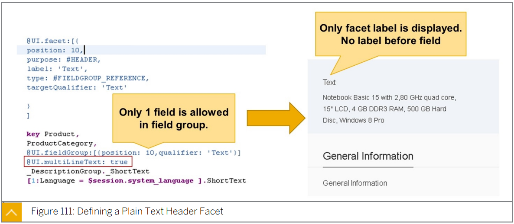

  Field Group Header Facet과 매우 유사 하다.

  * <u>***Field 를 하나만 포함하는 Field Group 을 정의한다.***</u>
  * <u>***Field 를 여러 줄 Text 로 설정한다.(`@UI.multiLineText: true`)***</u>
  * <u>***그 외는 위와 동일***</u>


* #### Communication Header Facet 

  

  기술적으로 Communication Header Facet 은 Field Group Facet 이다.

  ***<u>유일한 차이점</u>***은 필드 그룹의 ***<u>하나 이상의 필드가 `vCard.Contact` annotation 을 참조</u>***해야한다는 것이다.

  annotation modeler in SAP WebIDE 를 통해 만들 수 있다.

  * ***<u>`vCard.Contact` 를 추가</u>***하고 해당 ***<u>필드에 property 를 binding</u>*** 한다.

    전화 또는 이메일과 같은 속성의 경우 전화번호 또는 이메일 주소 의 사용을 명확히 하기 위해 type property 가 필요하다.

  * `vCard.Contact` annotation 을 참조하여 ***<u>DataFieldForAnnotation 항목과 함께 `UI.FieldGroup` term</u>*** 을 추가한다. 

  * `UI.HeaderFacet` term 을 추가한 다음 그 안에 ReferenceFacet 을 추가한다.

    Field Group  에 대한 Facet 을 참조한다.


* #### Arrangement of Header Facet

  

  Header Facet 이 두 개 이상인 경우, 그들은 한 줄로 정렬되고 공간이 충분하지 않다면 새 row 에 시작 될 것이다. 


### Sections and Facets in Object Pages


Object Page 의 Header Facet 아래 area 는 ***<u>Section 별로 Group 화 되어있는 Facet</u>*** 이다.

특정 섹션으로 이동할 수 있는 ***<u>navigation bar도 있다</u>***.

* #### Types of Facet in Sections

  

  * **Contact Facet**

    1~*  association 에 대한 contact 정보를 display 한다.

  * **Plain Text Facet**

    긴 description 을 display 한다.

  * **Smart Chart Facet**

    chart 를 보여준다.

    data 는 보통 1~* association 이다. 

  * **Field Group Facet**

    섹션에 Field Group 을 표시한다.


* #### Field Group Facets-CDS Annotation

  

  ***<u>`UI.facet` 은 facet 의 모든 type, 사용 목적, type property 을 나타내며 렌더링 하는 방법을 식별</u>***한다. 

  annotation 에 hierarchy relationship 없이 hierarchy relationship 은 ***<u>parentId property 에 의해 정의</u>***된다.

  

  Field Group Facet 은 section 내부에 넣어야 한다.

  

  * 섹션을 만들기 위해 ***<u>`@UI.facet` annotation 을 사용하여 `#COLLECTION` type 의 facet</u>*** 을 만들어고 ID 를 할당해야 한다.

  * Field Group Facet 을 생성하기 위해 `@UI.facet` annotation 에 

    ***<u>type 이 `@FIELDGROUP_REFERENCE`**</u>* 

    ***<u>targetQualifier 가 field group 의 qualifier</u>*** 로 설정된

    두번째 Record 를 추가한다.

  * 그런 다음 해당 Record 의 parentId 에 collection type facet 의 ID 를 할당한다.

  

* #### Field Group Facets-Local Annotation

  

  백엔드 시스템은 백엔드에서 facet 의 정의를 지원하지 않는다. 

  Local Annotation 을 사용하여 facet 을 정의할 수 있다.
  Guided Development 는 facet 을 작성하고 필요한 경우 facet 을 새로 작성한 section 에 추가하는 데 도움이 된다.

  1. `UI.CollectionFacet` 를 만든다.
  2. CollectionFacet 아래에 `UI.ReferenceFacet` 를 작성하고 Field Group Annotation 을 참조한다.


* #### Arrangement of Sections and Facets

  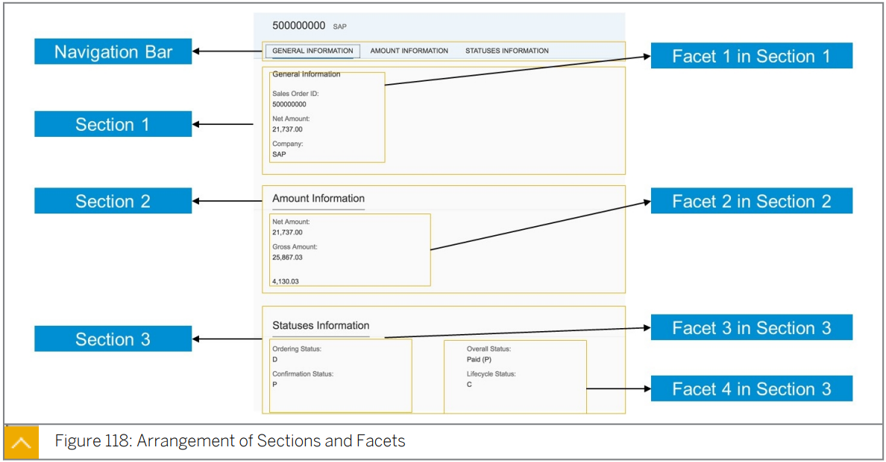

  모든 ***<u>section 들은 수직</u>***으로 정렬된다.

  모든 ***<u>facet 들은 수평</u>***으로 정렬된다. 


* #### Facets to Display Data from Sub-Entity

  

  Object Page 에서 1~* association data 를 ***<u>테이블로 display 해야하는 경우</u>*** *<u>**section 에는 하나의 facet 만 포함**</u>*할 수 있으므로 참조 facet 을 사용하여 section 을 생성해야한다. 

  

  1. detail data 에 대한 CDS View 를 만든다.

  2. ***<u>List Report 의 CDS View</u>*** 에서 ***<u>1단계에서 생성한 CDS View</u>*** 에 대한 *<u>**\* association 을 생성**</u>*한다.

  3. association 을 field 처럼 작성하여 expose 한다.

  4. ***<u>targetElement property 를 association 명으로 설정</u>***하고 

     ***<u>type 을 `#LINEITE_REFERENCE` 로 설정</u>***한 facet 을 만들어 연결한다.


* #### Display of Sub-Entity's Data - Local Annotation

  Local Annotation 인 경우 ***<u>`UI.ReferenceFact` 를 `UI.Facets` 의 direct child 로</u>*** 만들어야 한다.  

  ( No collection facet).

  reference facet 의 경우 association 과 annotaion 을 참조하여 target 을 설정해야한다.

  CDS View 를 OData Service 로 노출할 때 SAP 는 CDS Association 명 앞에 "to" 를 붙여 OData Association 명으로 설정한다.

  개발자는 새로운 섹션을 추가하기 위해 SAP BAS 의 guided development feature 를 사용할 수 있다.


## Advanced Topics of List Report and Object Page

### Explaining Navigation Concept and  Annotations


* Internal navigation 은 Fiori Element App 을 통한 navigation 이다.
* 기본 Internal navigation mode 는 ***<u>List Report => Object Page</u>*** 이다. 
* # Internal navigation 은 ***<u>manifest.json 에서 구성</u>***된다.

manifest.json 파일에서 앱에서 사용할 수 있는 페이지를 정의할 수 있다.

최상위 level 에서 array (`pages`) 가 정의된다.  

이 array 에서는 앱의 main entry point 이자 항상 List Report 인 entry point 가 하나만 있어야한다. 

각 page 는 지정된 page 의 모든 하위 page 를 포함하는 array `pages` 를 가질 수 있다.

List Report 에는 하위 page 가 하나만 허용된다.

이 page 는 동일한 Entity Set 에 대한 Object Page 여야한다.

기본적으로 Object Page 에는 하위 페이지가 없다.


* #### Internal Navigation - List report Only

  

  Object Page 없이 List Report 를 표시하려면 

  `ListReport` -> `<Your EntitySetName>` 에서 page  및 page 의 모든 property 들을 삭제할 수 있다.


* #### Subpages for Object Page

  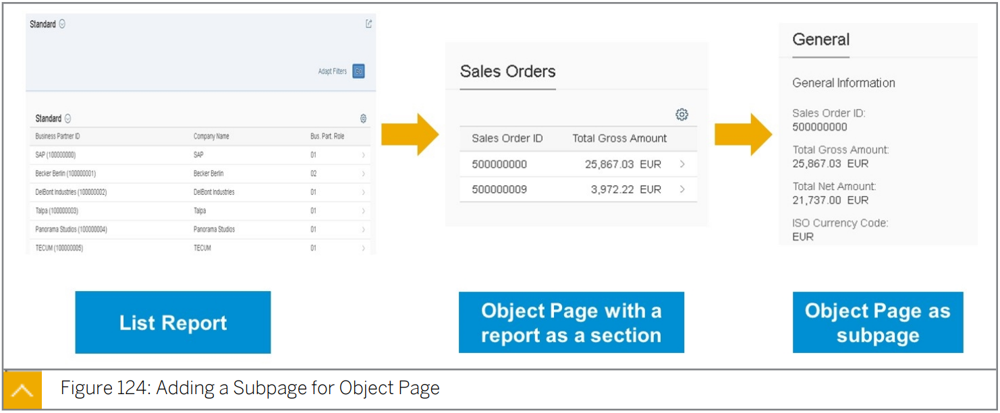

  Object Page 에 다른 Page 를 하위 페이지로 추가 할 수 있다.

  이렇게 하면 매우 상세한 정보 수준으로 이동할 수 있다.


* #### Adding a Subpage for Object Page-manifest.json

  

  Object Page node 에서 page 하위 node 를 추가하고 각 OData Entity Set 에 대한 하위 page 를 추가할 수 있다.

  

  


* #### Options of External Navigation

  

  SAP Fiori App 에서 External navigation 을 사용하여 다른 주소로 이동할 수 있다.

  이 기능은 List Report 와 Object Page 에서 모두 가능하다.

  External navigation 을 구현할 때 다음 두가지 방법을 사용할 수 있다.

  * <u>***URL 사용 : 어떤 URL 로든 Navigate***</u>
  * <u>***Semantic Object navigation 사용***</u> 
    * Display as a link
    * Use a button on the toolbar

  * ##### URL 사용

    

    1. URL 로 표시되는 field 를 생성한다.
    2. ***<u>field 에 링크를 추가하고 type 을 `#WITH_URL` 로 설정</u>***한 다음 URL property 를 사용하여 URL 필드를 가리킨다.

  * ##### Semantic Object 사용

    

    1. field 앞에 `@consumption.semanticObject` 를 추가한다.
    2. `UI.lineItem.type` 를 `#WITH_INTENT_BASED_NAVIGATION` ***<u>(링크)</u>*** 또는 `#FOR_INTENT_BASED_NAVIGATION` ***<u>(버튼)</u>*** 로 설정한다.
    3. `@UI.lineItem.semanticObjectAction` 를 설정한다.

    생성된 URL 에는 Semantic Object 및 action 이 포함되어있다.

    Entity 의 모든 값은 parameter 로 전달된다.

    ex) `https://.........#Product-display?CompanyName=SAP&CompanyName2=SAP& Currency=EUR&NetAmount=21737.00&SalesOrder=500000000&TaxAmount=4130.03`


### Using Data Visualization


List Report 와 Object Page 에서 data 를 시각화 하는 방법에는 여러가지가 있다.

* **Criticality**

  Neutral, Negative, Critical, Positive 를 통해 state 를 색상을 통해 시각화

* **As Rating Indicator or Progress Bar**

  등급 또는 진행률을 나타내는 데이터의 경우, Rating Indicator / Progress Bar 를 사용할 수 있다.

* **Micro Chart**

  Object Page 의 header 에 header facet 으로 추가하여 actual value / target value / predictive value / max value / min value 를 시각화 

* **Smart Chart**

  Object Page 의 Section area 에서 Smart Chart 를 section 으로 추가하여 0~* Association 으로 설정된 Entity 에서 insight 를 얻을 수 있다.


* #### Criticality

  

  Criticality 는 List Report 및 Obejct Page 에 표시되는 모든 data field 에 사용할 수 있다.

  또한 `UI.fieldGroup` 및 `UI.Identification` 와 같은 data type 으로 DataField 와 함께 다른 annotation 과 함께 작동된다.

  local annotation 을 사용하는 경우 Criticality 는 DataField 의 optional attribute 이므로 정적 값으로 설정하거나 속성을 참조할 수 있다.

  1. 일부 text 를 Critical Description Field 로 표시하는 Data Field 가 있는 경우 각 중요도 상태에 따라 출력이 다를 수 있다.

  2. 0~3의 값을 가진 다른 정수 data field 를 Critical Value 필드로 만든다.

     * 0 - Neutral
     * 1 - Negative
     * 2 - Critical
     * 3 - Positive

     일반적으로 이 field 는 수량 또는 status 를 기준으로 계산된다.

     사용자에게 번호를 직접 display 하지 않도록 하려면 field 를 hidden 처리 해줘야 한다.  

  3. Criticality Description Field 에 대한 annotation 작성은 이전 단계에서 작성되었다.

     `@UI.lineitem` 의 criticality property 를 사용하여 critical 정보를 Critical Value Field 로 지정한다.

     상태의 기본 색상은 다음과 같다.

     * Neutral = Black
     * Negative = Red
     * Critical = Yellow
     * Positive = Green

  Theme Designer 를 사용하여 테마를 조정하여 기본 색상을 변경할 수 있다.


* #### Rating Indicator and Progress Bar

  

  Rating Indicator and Progress Bar control 을 사용하려면 `@***<u>UI.lineItem`  를 `#AS_DATAPOINT` type 으로 설정</u>***한다. (`@UI.fieldGroup`, `@UI.identification` 및 기타 annotation 이 data field 를 참조하는 경우에도 적용)

  이후 ***<u>`@UI.dataPoint` annotation 을 추가하고 visualization property 를 `@RATING` 또는 `#PROGRESS` 로 설정</u>***한다.

  기본적으로 Rating Indicator 에는 별 5개가 있으며 Progress Bar 은 target 으로 100으로 설정된다.

  targetValue property 의 값을 설정하여 이러한 속성을 추가로 사용자 지정할 수 있다.


### Creating Charts

* #### OData Service with Analytic Function

  

  smart chart control 은 ***<u>`$select` OData parameter 를 전송하여 백엔드 서비스에 aggregate request 를 전송</u>***한다.

  normal entity set 은 `$select` 의 필드가 있는 모든 record 를 반환하지만 ***<u>analytic entity set</u>*** 은 ***<u>`$select` 의 필드를 고려하여 aggregate 된 결과를 반환</u>***한다.

  ***<u>analytic entity set 을 정의하려면 aggregate 해야 하는 field</u>*** (일반적으로 양 또는 수량 필드) 에 ***<u>`@defualtAggregation` annotation</u>*** 을 추가한다.

  생성된 analytic entity set 은 일반 entity set 과 비교하여 다음과 같은 차이가 있다.

  * 생성된 ID field 는 CDS View 의 ***<u>key 대신 default key</u>*** 로 사용된다.
  * $select 에서 액세스 하면 엔진은 `$select` 의 field 가 ***<u>`@defaultAggregation` 에 따라 attribute 인지 measure 인지 확인한 다음 `$select` 의 attribute 별로 그룹화 된 측정값을 계산</u>***한다.

  일반적인 시나리오는 List Report 와 Object Page 에 대한 CDS View 를 정규 Entity Set 으로 정의하고 CDS View 가 analytic entity set 으로 detail level entity을 나타내는 것으로 정의하는 것이다. 

  그런 다음 master level entity 에서 detail level entity 로의 1-* association 을 생성한다.

  그러면 사용자는 Object Page 에서 요약된 detail data 를 얻을 수 있다.

   

* #### Add `@UI.chart` Annotation

  

  `@UI.chart` annotation 은 smart chart 를 정의하는데 사용된다.

  ***<u>`chartType` property 에서 차트 type</u>*** 을 지정할 수 있다.

  ***<u>measure 및 dimension property 를 지정</u>***해야한다.

  `@UI.chart` 는 local annotation 에서도 사용할 수 있다.

  일반적으로 `@UI.chart` 는 analytic CDS View 에서 정의된다.


* #### Adding a Reference Facet

  

  Reference Facet 은 ***<u>`#CHART_REFERENCE` TYPE 의 `@UI.facet` 의 direct child 로 생성</u>***되어야 하며  association 을 통해 ***<u>`@UI.chart` annotation 을 참조</u>*** 해야한다.

  

* #### Micro Bullet Chart

  

  Micro Bullet chart 는 ***<u>actual value / minimum value / max value / forecast value / target value</u>*** 함께 입력한 다음 색상별로 중요도를 표시하여 ***<u>주요 수치를 평가하는 데 사용</u>***된다.

  

  smart chart 와 마찬가지로 micro chart 생성에는 `@UI.facet` 과 `@UI.chart` 가 포함된다.

  `@UI.dataPoint` 는 `@UI.chart` 와 같은 micro chart 생성하는데 관여 하므로 데이터 지점에 대한 모든 세부 정보를 포함하지는 않는다.

  평가된 값은 `@UI.chart.measure` 의 유일한 member 이어야하며 mesureAttributes 를 통해 `@UI.dataPoint` annotation 에 연결되어야 한다.

  다른 모든 값(max,min,target,forecast … ) 은 `@UI.dataPoint` 에서 할당된다.

   

  

* #### To Create a Chart

  1. analytic function 을 포함한 OData Entity set 을 생성
  2. Analytic OData Entity set 에 @UI.chart annotation 를 생성
  3. Reference Facet 을 생성해 chart 를 display


### Performing CRUD operations with BOPF (Business Object Processing Framework)

* #### Create and Delete Data with SAP Fiori Elements

  

  List Report 및 Object Page 를 사용하여 새로운 Object 를 생성할 수 있다.

  toolbar 의 + button 을 추가하면 모든 field 를 편집할 수 있는 Object Page 로 이동하여 새 object 를 생성할 수 있다.

  Record 왼쪽에 있는 radio button 을 선택한 다음 toolbar 에서 Delete 를 선택해 record 를 삭제할 수도 있다.


* #### Updating a Record

  

  Object Page 에 있는 경우 Edit 버튼을 사용하여  display mode 와 edit mode. 를 전환할 수 있다.
  Delete 를 선택해 record 를 삭제할 수도 있다.

  

* #### Draft Control

  

  SAP Fiori Element는 레코드의 status 를 처리할 수도 있다.
  예를 들어 사용자 A가 레코드를 업데이트하려는 경우 이 레코드에 대한 draft가 생성된다.
  사용자 B가 이 레코드를 동시에 업데이트하려는 경우 해당 사용자의 계정은 변경할 수 없도록 차단된다.


* #### Architecture

  

  1. ##### Create a database table.

    record 를 저장하려면 database table 이 필요하다.

    테이블에는 ***<u>structure `/bobf/s_lib_admin_data` 가 포함</u>***되어있어야한다.

  2. ##### Create a business object CDS view.

    생성한 테이블에서 데이터를 선택하는 ***<u>CDS View 를 만든 다음 관련 business entity 와 연결할 association 을 생성</u>***한다.

  3. ##### Generate a BOPF business object.

    BOPF 에서 business object 는 node 의 hierarchical tree 로 표현된다.

    단일 노드는 ***<u>semantic 한 관련이 있는 attribute 의 set 와 해당 비즈니스 logic</u>*** 을 포함한다.

    각 node 에 대해 business object 의 특정 business logic 부분을 설명하기 위해 여러 type 의 entity 를 정의할 수 있다.

    business object CDS View 에서 annotation 을 추가하여 BOPF 를 생성할 수 있다.

  4. ##### Add additional business logic in BOPF.

    ABAP code 로 작성된 추가 business logic 을 BOPF 에 추가할 수 있다.

    예를 들어, record 가 데이터베이스에 저장되기 전에 실행할 수 있는 유효성 검사 코드를 추가할 수 있다.

  5. ##### Create a consumption CDS view and write UI annotation on it.

    SAP Fiori Element 에 대한 CDS View 로 시작하고 여기에 UI Annotation 을 작성한다.

  6. ##### Generate OData Service.

  7. ##### Generate SAP Fiori Elements application.

  > ##### Note:
> For Detailed information of how to create transactional list report and object page.
> Please proceed as follows:
> Open URL https://help.sap.com/viewer/p/SAP_NETWEAVER_AS_ABAP_752, then navigate to Development→Development Information→Application Development on AS ABAP→SAP - ABAP Programming Model for SAP Fiori→Develop→Developing New Transactional Apps


## Overview Page

### Getting an Overview of the Overview Page  (OVP)


Overview Page 는 중요한 비즈니스 정보에 대한 신속한 액세스를 ***<u>시각적이고 실행 가능한 Card 형태로 한 눈에 제공</u>*** 한다. 

user-friendly 환경을 통해 데이터를 빠르고 간단하게 보고 필터링하고 처리할 수 있다.

비즈니스 사용자는 ***<u>큰 그림을 한 눈에 보여주는 동시에 가장 중요한 작업에 집중</u>***하여 신속한 의사 결정과 즉각적인 조치를 수행할 수 있다.

SAP BAS 의 ***<u>Overview Page Wizard</u>*** 를 사용하여 Overview Page 를 ***<u>생성 및 카드 추가</u>*** 를 할 수 있다.

***<u>표시된 데이터는 fully interactive</u>*** 이며, ***<u>클릭 가능한 영역을 통해 관련 응용 프로그램으로 쉽게 이동</u>***할 수 있다.

Overview Page 는 SAP Fiori를 기반으로 완벽하게 응답하는 UI 로 작업 항목을 구성한다.

사용자는 SAP Fiori Launchpad에서 Overview Page 에 액세스하여 ***<u>표시되는 정보를 좁히거나 특정 주제에 초점을 맞추기 위해 카드를 숨길 수 있다.</u>***


### Main Components of the Overview Page Application


* #### Application header :  

  이 응용프로그램이 개요를 제공하는 영역(예: 조달 또는 판매)에 대한 설명을 제공한다. 

  헤더 영역에서 ***<u>사용자 계정 설정을 변경하고 카드(표시/숨기기)를 관리</u>***할 수 있습니다.

* #### Smart Filter : 

  카드에 표시되는 ***<u>데이터 수준을 변경</u>***할 수 있는 응용 프로그램 수준 필터를 제공한다.

  예를 들어 필터를 사용하여 10,000달러보다 큰 트랜잭션만 표시하고 50kg보다 가벼운 항목만 표시할 수 있다.

* #### Card : 

  카드는 UI Annotation 을 사용하여 콘텐츠를 렌더링하는 smart component 이다.

  각 카드는 data source 에 설정된 단일 Entity 에 바인딩된다. 

  카드는 도넛, 막대 차트 또는 테이블을 표시할 수 있다.

  스택 카드는 Object stream 에서 볼 수 있는 일련의 quick view card 를 포함한다.

  카드는 최대 5개의 응답 열로 에 표시되며 끌어서 놓기를 통해 ***<u>다시 정렬</u>***할 수 있다.

  Overview Page 응용 프로그램 instance 는 Overview Page 응용 프로그램 component 를 확장하는 UI component 와 응용 프로그램 구성을 포함하는 manifest  파일로 구성된다.


### Type of Cards


* #### List Cards

  List Card 는  `com.sap.vocabularies.UI.v1.LineItem` 의 configuration 에 따라 record list 를 display 한다.

  List Card 는 각 list 에 최대 6개의 data field 를 표시한다.

* #### Bar Chart List Card

  Bar Chart List Card 는 object group card 의 type 이며 vertical list 에 item 의 set 을 display 한다. 

  List Card 와 달리 Bar Chart List Card 는 다음과 같은 다른 component 에 내장되어있다.  

  comparison micro chart

* #### Link List Cards

  title / picture / icon / subtitle 이 있는 link list 를 볼 수 있다.

* #### Analytic Cards

  Analytic Card 를 사용하면 다양한 chart 형식의 데이터를 볼 수 있다.

  card 는 두 area (헤더 / 차트) 로 나뉜다.

* #### Table Cards

  Table Card 는 `com.sap.vocabularies.UI.v1.LineItem` configuration 에 따라 record list 를 표시한다.

  Table Card 는 data 를 3열 테이블 layout 으로 display 한다.

  (optional) quick link 에 access 하도록 Table Card의 smart link 를 구성할 수 있다. 

* #### Quick View Cards

  Quick View Card 난 단일 Object Card 이다. 

  Name / Address / Phone Number 같은 한 object 에 대한 기본 세부정보를 display 한다.

* #### Stack Cards

  Stack Card 는 공통 주제 또는 작업에 기반한 동일한 type 의 card set 을 집계한다.

  이 옵션을 선택하면 object stream 에 최대 20개의 stack card 를 display 할 수 있다.

* #### Custom Cards

  Custom Card 를 사용하면 Overview Page 에서 card 의  모양과 card content area 에 나타나는 content type 을 정의할 수 있다.

  Overview Page 에 표준 카드에서 제공하지 않는 기능이 필요한 경우 추가적인 flexibility 를 제공한다.


### To Create an Overview Page

1. global filter 를 위한 backend 서비스를 준비
2. card backend 서비스를 준비
3. Overview Page 템플릿을 사용하여 SAP Fiori app 생성
4. Overview Page 에 card 추가


### Overview Page Creation

* #### 1st Step

  

  대부분의 Overview Page 의 경우 ***<u>페이지 상단에</u>*** ***<u>global filter를 지원하는 OData 서비스</u>***가 있다.

  global filter 에 대한 OData 서비스에는 attribute 값만 포함되어야 하며 이러한 값을 키 필드로 표시해야 한다.

  모든 필드는 selection 필드로 표시되어야 한다. 

  foreign key association 에 의해 생성된 value help 또는 모델링된 value help 를 selection field 에 할당해야 한다.

* #### 2nd Step

  

  global filter 의 동일한 OData 서비스 또는 독립 실행형 OData 서비스에서 백엔드 서비스를 제공할 수 있다.

  일반적으로 Overview Page 의  global filter 와 각 카드의 경우 기본 쿼리와 value help 또는 기타 관련 데이터 액세스를 서버하기 위해 CDS View group(Entity Set)이 필요하다.

  Overview Page 의 카드는 일반적으로 다양한 기본 CDS View 를 포함하므로 대부분의 경우 백엔드 로직이 동일한 카드를 제외하고는 각 카드에 대해 별도의 OData 서비스를 생성한다.

  ***<u>카드 유형에 따라 CDS View 에 다른 annotation 이 필요</u>***하다.

  예를 들어 ***<u>table cards 에는 `@UI.lineItem` 가 필요하고 analytic cards 에는 `@UI.Chart`, `@UI.identification` 이 필요</u>***하다.

  카드와 global filter 는 필드별로 연결되므로 global filter 를 설정하여 카드의 데이터를 필터링하려면 카드에 ***<u>global filter 에 동일한 이름 필드가 있어야 한다</u>***.

  이름이 일치하지 않으면 필터가 무시된다.

* #### 3rd Step

  
  Overview Page 를 만드는 프로세스는 List Report 와 유사하다:

  1. 프로젝트 템플릿에서 SAP Fiori Element 애플리케이션 템플릿을 선택
  2. floorplan으로 Overview Page를 선택

* #### 4th Step

  Overview Page 에 카드를 추가하려면 다음을 수행해야 한다:

  1. SAP Fiori Tools – Guided Development 를 시작
  2. 카드 유형에 적합한 가이드를 선택

  3. 템플릿을 구성


### OVP Configuration

* #### `smartVariantRequired`

  스마트 필터 바에서 스마트 variant 관리 컨트롤을 활성화/비활성화

* #### `showDateInRelativeFormat`

  어제, 내일 등같이 smart filter bar에 날짜를 표시

* #### `enableLiveFilter`

  smart filter bar 에 go button 을 display 할지 여부

* #### `refreshIntervalInMinutes`

  x 분 마다 OVP 를 새로고침한다. 최소값: 1분

* #### `useDateRangeType`

  true 시 Semantic Date 를 활성화 기본값: false


* #### `useBatch: false`

  > (https://sapui5.hana.ondemand.com/#/api/sap.ui.model.odata.v2.ODataModel/constructor)
  >
  
  OVP 애플리케이션에 하나의 analytical card 와 네 개의 transactional card (list, table, stack, linklist)가 있는 시나리오를 생각해 보자.
  
  analytical card 에 의해 수행되는 HTTPS 요청은 일반적으로 무겁다(시간이 오래 걸린다).
  
  분석 정보는 집계된 entity set 를 기반으로 하기 때문에 백엔드는 각 http 요청을 처리하는 데 시간이 필요하다.
  
  응용 프로그램의 ***<u>모든 카드가 동일한 모델(데이터 소스)을 사용하는 경우</u>***, 이러한 시나리오에서는 모든 카드가 데이터를 가져오기 위한 배치 ***<u>요청이 하나만 있을 것</u>***이다.
  
  analytical card 를 호출하는 데 시간이 너무 ***<u>오래 걸리기 때문에 다른 네 개의 카드에도 데이터가 표시되지 않는다</u>***.
  
  이 시나리오는 애플리케이션 ***<u>manifest 에 두 개의 개별 모델을 생성</u>***하고 ***<u>analytical card  모델에 대해 배치 모드를 비활성화</u>***하여 처리할 수 있습니다.
  
  이 경우 백엔드로부터의 응답이 더 빠르며 OVP가 ***<u>비교적 빨리 렌더링</u>***되는 것을 볼 수 있다.


* #### `preload: true`

  > (https://blogs.sap.com/2016/11/19/sapui5-application-startupperformance-advanced-topics/ - Section: Use model preload feature )
  >
  
  OVP 애플리케이션이 로드되기 전에 메타데이터와 annotation 을 로드하는 방법으로, 
  
  OVP가 메타데이터와 annotation 을 ***<u>'기다릴' 필요가 없으며 UI 렌더링을 직접 계속</u>***할 수 있다.


* #### **General performance guidelines** : 

  데이터를 반환하는 데 오랜 시간이 걸리는 analytical card 가 있는 경우 배치 모드를 비활성화하는 것을 고려할 수 있다(대량 배치 호출 하나에 비해 거의 ***<u>병렬 시간에 여러 개의 작은 요청이 실행되는 것이 더 빠름</u>***).

  이상적으로 제안된 방법은 모든 analytical card 가 사용하는 매니페스트에 하나의 모델과 모든 transaction card 가 사용하는 manifest 에 하나의 모델을 갖는 것이다.


### Type of Cards - Detail

* #### List Cards

  

  모든 데이터 필드가 왼쪽에 표시된다. 

  모든 데이터 point 가 오른쪽에 표시된다.
  현재로서는 ***<u>CDS에서 아직 `datafieldForAnnotation` annotation 이 지원되지 않기 때문에 로컬 주석 접근법을 사용</u>***해야 합니다.


* #### Table Cards

  


* #### Stack Cards

  

  ```json
  "card02": {
       "model": "mainService",
       "template": "sap.ovp.cards.stack",
       "settings": {
           "title": "{{card02_title}}",
           "subTitle": "{{card02_subtitle}}",
           "entitySet": "ZCDS_UX403_OVP_00",
           "annotationPath": "com.sap.vocabularies.UI.v1.FieldGroup#DETAILED"
       }
   }
  ```

  카드의 내용이 FieldGroup-Reference-facet 으로 구현된다.

  

  스택 카드의 내용은 `headerinfo` 및 `fieldgroup` annotation 을 사용하여 구현된다.

  ```json
  @UI.headerInfo: {
      typeNamePlural: 'Sales Orders',
      typeName: 'Sales Order',
      imageUrl: 'SAPIconUrl',
      title: {
          label: 'Sales Order ID',
          value: 'SalesOrder'
      },
      description: {
          label: 'Sales Order Item',
          value: 'SalesOrderItem'
      }
  }
  
  ```

  field group item 들 

  ```js
  @UI.fieldGroup: [
      {
          position: 20, 
          qualifier: 'DETAILED', 
          label: 'Product Category'
      }
  ]
  ```

  를 통해 projection list 의 field 에 대한 annotation 을 추가한다. 

  구성된 field group id 를 참조하여  Fieldgroup-Reference facet 을 생성한다.  

  ```js
  @UI.facet: [{ 
      type: #FIELDGROUP_REFERENCE, 
      targetQualifier: 'DETAILED',
      isSummary: true 
  }]
  ```


* #### Quick View Card

  


* #### Analytic Card

  

  다음은 도넛 차트를 보여주기 위한 Analytic Card 의 manifest.json 이다.

  ```json
  "card01": {
       "model": "mainService",
       "template": "sap.ovp.cards.charts.analytical",
       "chartType": "cardchartsdonut",
       "settings": {
           "title": "{{card01_title}}",
           "entitySet": "ZCDS_UX403_OVP_00",
           "identificationAnnotationPath": "com.sap.vocabularies.UI.v1.Identification",
           "chartAnnotationPath": "com.sap.vocabularies.UI.v1.Chart"
       }
   },
  ```

  card 의 내용은 ***<u>FieldGroup-Reference-facet 로 구현</u>***된다.


* #### Link List Cards

  

* #### Bar Chart List Card

* #### Custom Cards

  

* #### Note

  card items section의 navigate 는 상황에 따라 달라진다. 

  즉, table/list card 에서 특정 항목을 선택하면 이 정보가 selection variant 로 탐색 응용 프로그램으로 전송된다.
  특정 레코드와 관련된 모든 속성이 전송된다. 

  예를 들어, table card 에 데이터로 P1, P2, P3 property 가 표시 될 때 item 을 선택하면 모든 Odata property P1,P2,P3….Pn 는 selection variant 로 전송될 것이다.

  P1, P2, P3만 전달하려면 `addOataSelect:true` (https://help.sap.com/viewer/468a97775123488ab3345a0c48cadd8f/7.52.3/en-US/530f9e6f66104d5888ade79b5cf417e0.html)를 사용하면 된다.

  모든 카드에서 탐색이 가능하며 크기 조정 가능한 레이아웃에서도 지원된다.


## Analytical List Page

### Getting an Overview of the Analytical List Page

#### Analytic List Page (ALP)


End User 는 ALP 를 통해 데이터를 신속하게 분석하고 주의가 필요한 주의가 필요한 record 에 집중할 수 있다.

* Visual Filter를 사용하여 사용자는 상단(또는 하단) 에 x record 를 볼 수 있다.????????

  (The visual filters enable the user to look at the top (or bottom) x records. )

  즉 사용자는 ***<u>최고 성능의 cost center 나 최저 성능의 sales center</u>*** (기존의 소형필터로는 불가능한 것들) 를 ***<u>매우 빠르게 필터링</u>***할 수 있다.

* content area 의 차트가 존재함으로 user 는 전체적인 상황을 빠르게 이해할 수 있다.

  ***<u>Line Chart 나 Bubble Chart</u>***는 end user 에게 ***<u>많은 정보를 신속</u>***하게 제공할 수 있으며 사용자는 ***<u>차트에서 한번더 선택하여 차트의 영역을 더욱 좁힐 수 있다.</u>***  

  chart 를 통해 선택된 record 만 사용하여 ***<u>아래의 table들 또한 새로고침</u>***된다.

* user 는 ALP 의 table 에 관심 record 만 표시되는 것을 쉽게 보장받을 수 있다.

  또한 user 는 ***<u>추가 navigation (to Object Page or custom application page)</u>***을 위해 이러한 record 를 쉽게 선택하거나 ***<u>선택 record 에 대해 몇가지 작업</u>***을 수행할 수도 있다.

ALP 는 세부적인 분석을 위한 SAP Fiori Element app 이다.

**다양한 관점에서 데이터를 분석**하고 ***<u>root cause 를 조사</u>***하며 ***<u>transaction content 에 대해 작업</u>***할 수 있다.

***<u>데이터 시각화 및 비즈니스 intelligence</u>*** 를 사용하여 ***<u>데이터 set 또는 중요한 단일 instance</u>*** 내에서 관련 영역을 식별할 수 있다.

이 모든 것을 한 페이지 안에서 원활하게 수행할 수 있다.

차트와 테이블 시각화를 사용한 트랜잭션 및 분석 데이터의 조합을 통해 관련 데이터를 보다 신속하게 볼 수 있다.

이러한 하이브리드 데이터 view 를 통해 chart 와 table 표현간의 상호작용이 가능하다.

* header area 의 관련 KPI(Key Performance Indicators) 가 KPI tag 이다.

  이러한 ***<u>KPI tag 들은 또한 KPI card 들을 통해 혁신적인 disclosure 및 navigation</u>*** 이 가능하다.

* Filter 는 다양한 filter mode 를 통해 main content area 에 data set 을 필터링한다. 

  예를 들어 Visual Filter는 관련 measure value 에서 filter value 를 선택하는 직관적인 방법이다.

* content area 및 KPI card area 에서 app 으로 원활하게 이동할 수 있다.

* ALP 를 customize 하고 다른 사용자와 page variant 로 공유한다. 


> #### 주요 요구사항
>
> * ***<u>data 교환을 위한 protocal 인 OData V2</u>***
> * ***<u>UI Annotation</u>*** 
> * ***<u>Aggregate 기반 Entity Set</u>*** (Visual Filter 와 Chart 같은 Aggregate 기반 UI control 사용)
>
> #### 주요 기능
>
> * ***<u>KPI 통합</u>***
> * ***<u>소형 Filter bar 와 visual filter</u>***
> * ***<u>parameter화 된 entity set</u>*** 지원
> * 다양한 ***<u>data 시각화 및 display mode</u>*** 
>   * **table only**
>   * **chart only**
>   * **hybrid view**
> * ***<u>transaction object 에 대한 상황별 navigation</u>***
> * ***<u>variant 관리 및 개인화</u>***
> * ***<u>Extension</u>***


> #### List Report / Analytic List Page
>
> * ##### List Report
>
>   * ***<u>Object Page 에서 CRUD 작업을 허용</u>***하는 앱
>   * ***<u>Master Data List</u>***
>   * ***<u>여러 Table view 또는 여러 Chart</u>*** 가 필요한 App
>   * ***<u>Worklist</u>***
>
> * ##### Analytic List Page
>
>   * ***<u>Analytical App / Monitoring App / 여러 dimension 의 Complex content 가 보여져야 하는 App</u>*** 
>   * KPI 가 필요한 App
>   * ***<u>Visual Filter</u>*** 가 필요한 App
>   * ***<u>Split View 나 chart-table 간 상호작용 option</u>*** 이 필요한 App


### ALP 구성

* #### Title Area

  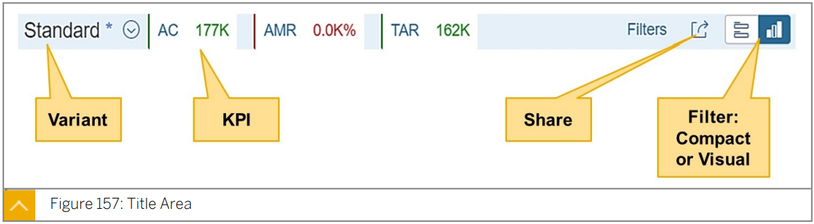

  header area 에서 ***<u>KPI 와 관련된 정보</u>***를 보거나 다음과 같은 ***<u>built-in SAP Fiori elements 기능을 선택하여 작업을 수행</u>***할 수 있다.

  * <u>***Define or manage page variants***</u>
  * <u>***Choose filter modes (compact or visual)***</u>
  * <u>***Customize filter area***</u>
  * <u>***Share ALP***</u>


* #### Visual Filters

  

  Visual Filter 는 연관된 ***<u>measure value 에서 filter value 를 선택하는 직관적인 방법</u>***이다.

  ***<u>Line, Bar, Donut Chart type</u>*** 들을 지원한다.

  Visual Filter 를 사용하여 ***<u>measure 또는 item 수를 Filter value 와 결합</u>***한다.

  차트 시각화는 ***<u>사용의 즐거움을 높이고 관련 데이터를 더 빠르게 인식</u>***할 수 있도록 해준다.

  하나 이상의 차트 데이터 포인트를 선택하면 ***<u>data set 를 신속하게 분석</u>***할 수 있다.

  Visual Filter bar 의 ***<u>default view</u>*** 는 Visual Filter 가 정의된 ***<u>`SelectionField` annotation 에 정의된 Filter Field 를 기반</u>***으로 한다.


* #### Content Area

  

  사용자는 차트와 테이블 모두와 상호 작용할 수 있다. 

  차트의 ***<u>initial view 는 전체 data set의 가장 중요한 측면을 시각화</u>***합니다.

  차트 영역 내에서 ***<u>dimension 을 선택하면 테이블 영역의 모든 관련 정보가 자동으로 필터링</u>***된다.

  예를 들어, 차트 선택이 `Country=ABC` 인 경우,  당 국가 selection 과 연관된 모든 record 가 table 에 필터링된다.

* **Note: **

  **For detailed information for Analytic List Page Please access website: **

  **https:// sapui5.netweaver.ondemand.com/sdk/#/topic and navigate to Developing Apps  with SAP Fiori Elements → Analytical List Page.**


### ALP and Its Key Capabilities

* #### Analytical Data

  aggregate based 데이터다. (예: 여러 region 에 걸친 sales data)

  서로 다른 aggregation level 에서 집계된 이러한 데이터는 사용자가 가장 높은(또는 가장 낮은) value 를 가진 areas(예: 가장 낮은 판매 가치를 가진 지역)에 매우 쉽게 초점을 맞출 수 있게 함으로써 ***<u>심층 분석에 도움</u>***이 된다.

  Analytic Data 는 Analytical models 을 사용하여 설계된다.

  집계의 이점을 활용하여 여러 area (ex: 시간별, 위치별, 책임별) 에 걸쳐 결과를 노출해야 하는 경우 report 목적으로 분석 모델을 사용하는 것이 좋다.

  이러한 ***<u>모델은</u>*** ***<u>Facts 및 Dimensions 을 통해 구상</u>***되며 이러한 view 에는 ***<u>세부 분석을 수행하고 비즈니스 가치를 도출하는 데 사용되는 기본 데이터가 포함</u>***되어 있다.

  

  고객, 제품, 날짜 및 판매 담당자를 기준으로 결과를 제공하는 영업 보고서를 예로 살펴보자.

  fact 는 판매 자체이며, 우리가 측정할 수 있는 값(예: 판매 수 및 총 판매 금액)을 보유하고 있다.

  고객, 제품, 시간 및 판매 담당자별 Filter 는 Dimension 이며, 이러한 Dimension 에는 특성 또는 텍스트(예: 고객 이름, 주소 및 제품 설명)가 부착되어 있을 수 있다.

  이것들을 연결하면 , 우리는 Cube 와 결과적으로 소비를 위해 준비된 분석 모델을 갖게 된다.


* #### Transaction Data

  필요한 경우 나중에 집계에 사용할 수 있는 Day-to-day Record. 

  (ex : 판매 지역, 주문한 자재, 공급업체, 판매 금액 등을 파악할 수 있는 everyday sales records)

  

  

> 애플리케이션이 관련 정보를 KPI로 가져오려면 다음 중 하나를 수행할 수 있다:
>
> * 백엔드에 ***<u>S/4 HANA Smart Business 가 있는 경우</u>*** 앱 개발자는 ***<u>Smart Business KPI Modeler 에서 노출된 KPI 집합을 사용하여 KPI 태그를 구성</u>***할 수 있다. 
>
>   (KPI 추가 플러그인을 사용할 때만 표시됨)
>
> * 백엔드가 S/4 HANA Smart Business이 아닌 경우, 앱 개발자가 ***<u>Local Annotation (`UI.KPI` annotation 을 보유)을 사용하여 KPI 태그를 구성하고 매니페스트를 수동으로 변경</u>***할 수 있다.
>
>   Add KPI plugin 은 아직 사용할 수 없다.


### Implementing ALP


앞서 설명한 바와 같이, ALP는 ***<u>Analytic Model 을 기반</u>***으로 한다. 

따라서 ALP를 구현하기 위한 ***<u>기초는 Analytic Model 을 구현</u>*** 이다.


***<u>CDS query 가</u>*** ***<u>Analytic Engine</u>***(***<u>BW에서는 OLAP Engine</u>***)***<u>에서 실행</u>***되므로 <u>***데이터 모델은 여전히 기존의 BW assumptions 과 일치***</u> 해야 한다.

***<u>CDS view</u>*** 는 이러한 **<u>*데이터 모델을 구축하는 더 빠르고, 쉽고, 유연한 방법을 제공*</u>**한다.


이 그림의 윗부분은 일반적인 BW 시스템의 전통적인 객체를 보여준다.

BW 시스템에 대해 보고하려면: `InfoProvider`는 HANA의 BW 또는 다른 DB에서의 BW를 위한 RSA1의 BW 모델링 툴을 사용하여 구축된다.

그런 다음 ***<u>BW query 는 Bex Query Designer 또는 Modeling Tool의 Query Designer</u>*** 둘중 하나를 사용하여 이러한 `InfoProvider` 에 작성된다.


transient query가 SAP S/4HANA와 같은 non-BW system 에서 Analytic Engine에서 실행되는 것과 유사하다.

사진의 아래 부분은 이것을 보여준다. 

`InfoProviders` 는 CDS View 를 사용하여 작성되어야 하며, CDS query 는 CDS View 를 사용하여 그 위에 작성되어야 한다. (Annotation 은 다르다.)

customer defined CDS 에서는 planning 이 지원되지 않는다.

(See Note 2874534 - Planning on ABAP CDS View.)

 

CDS View 는 ***<u>Analytic Engine의 데이터 모델을 구축하기 위한 새로운 도구일 뿐</u>*** 이다.

RSA1, Query Designer 또는 Modeling Tool과 같은 ***<u>기존 툴의 유일한 차이점</u>***은  ***<u>different objects 의 boundary 는 tool 에 잘 정의</u>***되어있다는 것이다.

이 도구들은 End User 가 유효한 모델을 구축하도록 안내한다.

그러나 CDS View 는 ***<u>강력한 기능을 가진 훨씬 가벼운 도구</u>***이며 

***<u>Extraction, Transformation, ETL(Extraction, Transformation, and Loading) 노력을 줄임</u>***으로써 일부 CDS Script 를 입력하여 데이터 모델을 매우 편리하게 구축할 수 있다. 

그러나, ***<u>object 의 경계는 흐릿</u>***하다.

전통적인 ***<u>BW 도구에 정의된 explicit restriction</u>*** 은 유효한 모델을 구축하기 위해 ***<u>사용자가 따라야 하는 암묵적 규칙이</u>*** 된다. 

CDS transient objects world 에는 `InfoProvider` or `Query` 와 같은 용어가 없지만, 그럼에도 불구하고 사용자는 business scenario 를 모델링할 때 이 그림을 염두에 두어야 한다.

이 개념을 통해 무엇을 정의해야 하는지 이해할 수 있다.


SAP S/4HANA 시스템에 analytical model 을 구현한 후 SAP BAS를 사용하여 ALP를 생성하려면 다음 단계가 필요하다:

1. SAP Fiori Elements를 프로젝트 템플릿으로 선택
2. Floorplan 으로 Analytical List Page 선택
3. 데이터 소스를 선택하고 OData-Service(`@OData.publish:true` 및 `@Analytics.query: true` 로 표시된 ABAP CDS)를 선택
4. OData-Service의 Main 엔티티를 선택하고 적절한 구성을 추가
5. 일반 프로젝트 설정을 삽입

6. 프로젝트가 생성된 후 필요한 경우 manifest.json 구성을 조정


### Implement Visual Filters

Visual Filter 는 연관된 측정 값에서 필터 값을 선택하는 직관적인 방법이다.

선, 막대 및 도넛 차트 유형을 지원한다.

차트 시각화는 ***<u>사용의 즐거움을 높이고 관련 데이터를 더 빠르게 인식</u>***하도록 돕는다.

***<u>하나 이상의 chart data points 를 선택하면 data set를 신속하게 분석</u>***할 수 있다.


***<u>Visual Filter 필드는 항상 compact filters의 subset</u>***이다.

이는 ***<u>compact filters dialog list</u>*** 에 ***<u>`"filterable"=true`로 표시된</u>*** Entity Set 의 ***<u>모든 필드가 나열되기 때문</u>*** 이다.

이 필드를 ***<u>Visual Filter로 렌더링</u>***하려면 이 외에도 Visual Filter Annotation (`PresentationVariantQualifier`로 향상된 `valuelist` annotation)이 필요하다.

Visual Filter를 사용하여 ***<u>measures 또는 item counts 를 filter value 와 결합</u>***한다.

***<u>Visual Filter bar 의 default view</u>*** 는 ***<u>Visual Filter가 정의된 `SelectionFields` annotation에 정의된 Filter Field를 기반</u>***으로 한다.


compact filter를 사용하여 동일한 Filter Field 의 Visual Filter에 대한 data set를 줄일 수 있다.

예를 들어, ***<u>Compact Filter와 Visual Filter 모두에</u>*** 필터로 ***<u>제품 필드</u>***가 있다.

(ex : 상위 세 개의 record 를 보여주는 막대 차트인 Revenue by Product)

User 가 제품: 에 대한 **compact filter에 complex condition filter(PRO포함)를 추가**하고 **visual filter 로 전환**하려고 한다.


사용자는 PRO가 포함된 제품만 visual filter를 불러올 수 있다고 예상할 수 있지만, 이는 사실이 아니며 설계상 그렇다.

***<u>Visual Filter는 compact filter의 동일한 필드 값에 관계없이</u>*** 상위 세 개의 제품을 표시하기 위한 것입니다.

그럼에도 불구하고 ***<u>Visual Filter의 오른쪽 상단에 있는 (1)을 선택하면 complex condition 이 나타나며 Content area 에 올바르게 전달</u>***된다.


그림에 표시된 예에서 처음 두 records 는 description 내에 PRO가 있으며 사용자는 해당 레코드가 강조 표시된 것으로 표시될 것으로 예상할 수 있지만 실재는 그렇지 않다.

다시, 적용된 complex condition 이 content area 로 올바르게 전달된다. 

그러나 현재 우리는 compact filter를 통해 오는 complex condition 을 기반으로 chart selections 을 강조하지 않는다.

> #### Known Restriction :
>
> * ##### Complex conditions:
>
>   visual filter 의 오른 쪽 상단 영역에만 표시된다.
>
>   ***<u>condition 들은 content area 으로 전달</u>***되지만 visual filter chart 에 표시된 ***<u>matching records 에 대해 선택된 상태로 표시되지는 않는다</u>***.
>
> * donut 의 ***<u>"Other" section</u>*** 은 ***<u>donut 의 다른 section 과 함께 선택할 수 없다.</u>***
>
> * donut 의 "Other" section 은 field 가 ***<u>dropdown 기반인 경우 선택 될 수 없다</u>***.
>
> * ***<u>interval based field (`sap: filter-restriction="interval"`)</u>*** 는 무시된다.


Visual Filter는 ***<u>semantic coloring을 지원</u>***한다. 

***<u>`UI.Criticality` / `UI.CriticalityCalculation` annotation</u>*** 이 모두 지원된다.

***<u>`UI.Criticality`</u>*** 는 애플리케이션이 주어진 ***<u>data point value 에 대한 semantic color 를 계산</u>***하기 위한 ***<u>자체 back end logic</u>*** 를 가질 수 있도록 한다.

***<u>`UI.CriticalityCalculation`</u>***은 ***<u>ALP framework 가 chart data points 에 semantic color 를 적용하는 데 사용할 fixed 또는 dynamic values을 지정</u>***할 수 있도록 한다(https://sapui5.hana.ondemand.com/#/174/1714720cae984ad8b9d9111937e7cd38).

애플리케이션은 scale factor 에 영향을 미칠 수 없다.

ALP는 ***<u>차트에 표시된 값을 기반</u>***으로 *<u>**SAPUI5 API 를 통해 최적의 scale factor를 결정**</u>*한다.

ALP는 UI를 무시합니다.IN 매핑이 UI로 표시된 필드를 가리킬 경우 필터를 선택할 때 숨겨진 필드.값 목록 엔터티 집합에 숨겨져 있다.

IN mapping 이 ***<u>`valuelist` Entity Set 에서 `UI.Hidden`로 표시된 필드</u>***를 가리키는 경우 필터를 선택할 때 ALP는 ***<u>`UI.Hidden` 필드를 무시</u>***한다.

예를 들어, ***<u>Main Entity Set의 `Status_ID`</u>*** 는 (visual filter의) ***<u>value help entity set 에서 `StatusCode`</u>*** 를 가리킨다.
<u>***StatusCode 가 `UI.Hidden` 로 표시된 경우 incoming value 는 무시***</u> 된다(https://sapui5.hana.ondemand.com/#/https/16d43eb0472c4d5a9439ca1https92c915d).


다음 단계에서는 visual filer를 만드는 방법을 보여 준다.


***<u>Visual Filter가 될 property</u>*** 에 ***<u>`@Consumption.valueHelpDefinition` annotation</u>*** 을 추가한다.


***<u>view 에 `@UI.presentationVariant` annotation 을 추가</u>***한다.


***<u>`@UI.chart` annotation 을 추가</u>***한다.


***<u>CDS annotation `@Consumption.valueHelpDefinition`</u>*** 은 ***<u>OData Common `Common.ValueList` annotation 으로 전송</u>***된다.


다음은 Visual Filter에 대한 value help 의 example definition 을 보여준다.


FLP 기본값은non-navigation context 에서만 적용된다. 

예를 들어 FLP 타일에서 직접 ALP 앱을 시작하는 경우 xapp-state navigation 이 필요하지 않다.

> * Filter bar Default 는 여러 소스를 통해 제공될 수 있다.
>   * CDS/OData metadata defaults (`Common.FilterDefaultValue`)
>   * Annotation : `UI.SelectionVariant`
>   * User default variant
>   * incoming navigation context
>   * FLP defaults
> * FLP 기본값은 non-navigation context 에서만 적용된다. (즉, static tile 을 통해 ALP가 실행되는 경우)
>   * default variant 가 없는 경우에만 CDS/OData metadata 및 SV annotation 의 전체 값을 재정의한다.
> * navigation context 에서는 FLP 설정의 `DisplayCurrency` 만 사용된다. (navigation context 에 아무것도 없는경우) 


### Implement Title Area

헤더 영역에서 ***<u>KPI(Key Performance Indicator)와 관련된 정보를 보거나 built-in SAP Fiori element 기능을 선택하여 다음 작업을 수행</u>***할 수 있다:

* <u>***page variants 정의 또는 관리***</u>
* <u>*** filter modes 선택(compact / visual)***</u>
* <u>***Customize filter area***</u>
* <u>***analytical list page 공유***</u>


KPI(Key Performance Indicators)를 통해 애플리케이션은 관련 ***<u>주요 지표(Outstands, Operating Margines, 순이익 등)를 가져올 수 있다</u>***.

이를 통해 End User 는 특히 KPI의 상태를 반영하기 위해 KPI를 Semantic Coloring 할 수 있다는 점으로 시스템의 전반적인 상태를 빠르게 파악할 수 있다.

***<u>글로벌 KPI는 filter bar 의 변경 사항에 반응하지 않는</u>*** 반면 ***<u>Filterable/Local KPIs 는 필터 바의 변경 사항에 반응한다</u>***.

예를 들어 filter bar 에서 특정 연도를 선택하면 NetSales 에서 필터링 가능한 KPI가 선택한 연도의 순 매출만 표시된다 (filter bar 연도 필드가 필터 가능한 필드로 설정된 KPI 엔터티에도 있다고 가정하면).

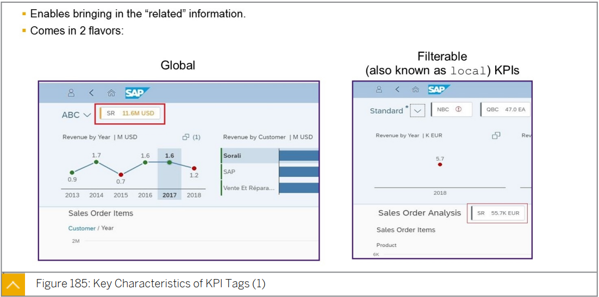

KPI에 대해 정의된 하드코딩된 criticality 가 있다면 이러한 KPI는 필터링 가능한 KPI에 적합하지 않을 것이다.

(필터 적용으로 인해 KPI 값 자체가 변경될 때 하드코딩된 임계값에 대한 의미 색상은 적용할 수 없기 때문이다)

필터를 적용할 때 `SalesRevenueTarget` 도 이에 따라 변경되는 경우(즉, 임계값이 정적이지 않음) `SalesRevenue` KPI를 semantic 하게 coloring 하는 것이 좋다.


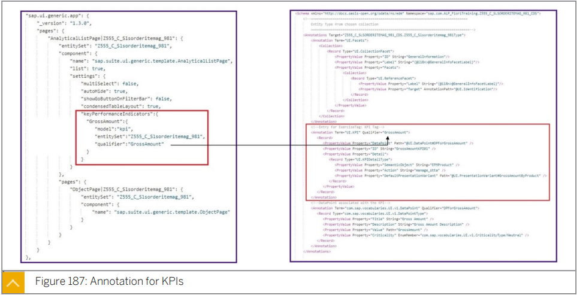


### Advance Topics


> * manifest 를 통해 정의된 custom action 으로 navigation
> * `DataFieldForIntentBasedNavigation` annotation 으로 정의된 targert

일부 응용 프로그램에는 ***<u>기본적으로 visual filter를 로드하는데 성능 문제</u>***가 있다.

대신 ***<u>기본적으로 compact filters 를 로드하려고 한다</u>***(예외적인 UX 승인 필요!).

그러나 compact filters 를 기본 필터 모드로 사용하여 애플리케이션을 로드하는 경우에도 visual filter 호출은 일반적으로 백그라운드에서 수행된다.

(사용자가 visual filter 모드로 전환할 때가 E2E 시간이 더 빠름)

사용자가 visual filter 모드로 전환하기를 원할 때까지 백그라운드에서 이러한 visual filter 호출을 수행하지 않기로 선택한 경우, 애플리케이션은 visual filter를 느리게 로드할 수 있다.


> 


## SAP Fiori Elements Applications

### Extending and Adapting SAP Fiori Elements Applications

* #### App Extension :

  개발자는 ***<u>Guided Development of SAP BAS 와 Extension API</u>*** 를 사용하여 SAP Fiori Element 기반 App 에 Extension 을  추가할 수 있다.

* #### Adaption extensions :

  Customer 와 Partner 는 SAP BAS 의 Adaptation 프로젝트를 사용하여 기존 앱에 자체 기능을 도입하여 upgrade-safe app variant 을 구축한다.

생성된 SAP Fiori Element App 은 제공된 SAP UI5  Extension 기능을 사용하여 구현할 수 있다.

App 확장은 ***<u>annotation 또는 manifest 설정을 사</u>***용하여 ***<u>요구사항을 구현할 수 없는 경우에만 주의하여 사용</u>***하여야 한다.

Extension 을 추가하면 ***<u>responsibility 가 App 으로 이동</u>***된다. 

https://ui5.sap.com/#/topic/d9c146a4e0f049108cf8231bfca5585b.html 참조

SAP BAS 의 ***<u>SAP Fiori elements Guided Development</u>*** 기능은 기존 SAP Fiori Element project 에 ***<u>visual 및 functional 측면을 추가</u>***하는데 사용된다.


### Extending List Report

* ***<u>Smart Filter Bar 에 custom field</u>*** 추가
* ***<u>custom action / popup</u>*** 추가 
* ***<u>Smart Table 에 추가 column</u>*** 추가


* #### Implementing Extension

  Extension 에서 원하는 방식으로 자신의 control 을 변경할 수 있다.

  ***<u>ID 로 access 하여 text 를 변경</u>***할 수 있다. 

  ***<u>SAP Fiori Element 에 의해 생성된 control 에 access 하거나 수정하면 안된다.</u>*** 

  ***<u>대신 `extensionAPI` 를 사용하</u>***여야 한다.

  

  

  Fiori Element 에 의해 생성된 control 은 ***<u>app coding 에 의해 접근되지 말아야 한다</u>***.

  <u>***App 이 property 를 읽기만 해도 값은 나중에 Fiori Element 에 의해 변경될 수 있다.***</u>

  <u>***(따라서 신뢰할 수 없다.)***</u>

  ListReport Template 의 `extensionAPI` 는 standard List Report 를 확장하기 위한 다양한 기능을 제공한다.

  > ***<u>[extensionAPI List Report Detail](https://ui5.sap.com/#/api/sap.suite.ui.generic.template.ListReport.extensionAPI.ExtensionAPI)</u>*** 

  SAP BAS 의 guided development 를 통해 list report 에 custom actions 을 추가할 수 있다.

  


* #### Adding Function Details

  1. **새 action 의 detail 을 선택**

     

     * Page type dropdown 을 사용하면 작업을 List Report page 또는 Object Page 에 추가할지 선택할 수 있다. 

     * Entity Set 선택을 통해 작업이 참조하는 Entity Set 을 선택할 수 있다.

     * Function Name 을 사용하여 function 의 이름을 삽입할 수 있다.

     ***<u>Function Name 은 접두사로 Entity Set 은 접미사</u>***로 사용되어 function 이름이 결정된다.

     ***<u>Entity Set 을 선택하지 않는 경우</u>*** 접미사는 ***<u>`REPLACE_WITH_ENTITY_SET`</u>*** 로 된다.

  2. Custom action 에 대한 configuration 을 추가

     

     manifest.json 에는 List Report 의 extension 에 대한 configuration 이 포함되어있다.

     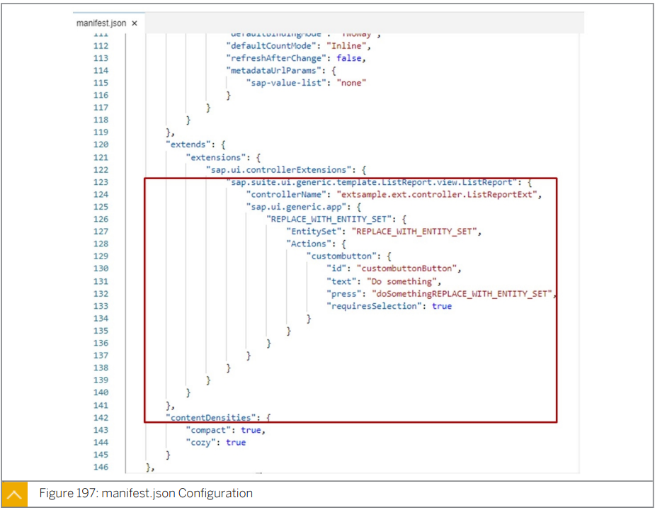

     guided development 이름이 `ext` 인 새 folder 의 controller 폴더를 추가한다.

     

     ***<u>`/webapp/ext/controller`</u>***

     controller extension 에 대한 controller implementation 이 controller 폴더에 추가된다.
     이제 controller 내부에서 extensionAPI-function 을 사용할 수 있다.


* #### `securedExecution` of `extensionAPI`

  * ***<u>비동기 작업</u>***

  * 사용자가 에 의해 잠재적으로 trigger 되는 ***<u>다른 operation 과 동기화 해야하는 operation</u>***

  * 사용자가 입력한 ***<u>데이터가 손실될 수 있는 Operation</u>*** 

    이것은 non-draft 시나리오에서만 관련이 있다.

  * 사용자에게 ***<u>custom messages display</u>*** (예 참조)

  * 시스템에서 quick action 을 수행한 후 ***<u>message popup title 변경</u>***

  


### Extending Object Page


* ***<u>custom action 또는 custom section</u>*** 추가

* ***<u>custom action 을 사용하여 Object Page 를 extension</u>*** 하는 것은 ***<u>List Report 를 extension 하는 것과 비슷</u>***하다.

  유일한 차이점은 Page Type 을 Object Page 로 선택해야 한다는 것이다.


* extension 을 생성한 후 extension 을 구현할 수 있다.
* SAP UI5 는 Object Page extension 를 위한 `extensionAPI` 를 제공한다.


* ListReport에서 이미 설명한 바와 같이 SAPUI5-API는 Object Page 에 대한 확장 API도 제공합니다.

> ***<u>[extensionAPI Object Page Detail](https://ui5.sap.com/#/api/sap.suite.ui.generic.template.ObjectPage.extensionAPI)</u>***

guided development 를 사용하여 Object Page custom section 을 추가할 수도 있다.

***<u>fragment 또는 view</u>*** 를 사용하여 custom section 의 내용을 구현할지 선택할 수 있다.

apply 가 선택되면 view 또는 fragment 가 생성되고 해당 폴더에 저장된다.


다음 단계에서는 manifest.json 에 configuration 을 추가한다.


이렇게 하면 생성된 view 또는 fragment 를 확장할 수 있다. 


### Extend Overview Page


* ***<u>Guided Development</u>*** 를 통해 ***<u>custom card / custom filter</u>*** 를 추가 가능
* Custom action 과 같은 다른 extension 은 직접 추가해야한다. 

> ***<u>[extensionAPI Overview Page Detail](https://sapui5.hana.ondemand.com/1.84.1/#/topic/b240f612227547d99e7fe76dd03da375)</u>***

* #### Create Custom Filter

  1. **detail 을 선택**

     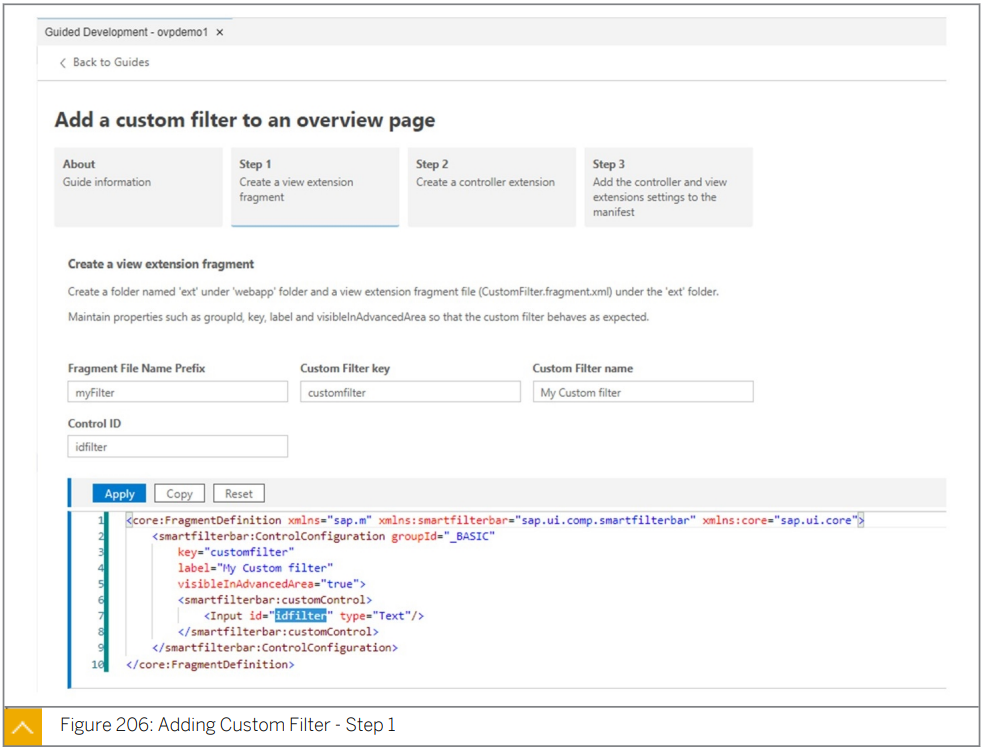

  2. 해당 controller code 가 생성된다.

     

  3. manifest.json 의 configuration 이 생성된다.

     개발자는 fragment 와 controller name 을 삽입해야한다.

     

  4. custom filter 에 필요한 모든 측면이 생성된 후 개발자는 생성된 fragment 와 controller 를 작성한다.

     

     * ***<u>`getCustomAppStateDataExtension`</u>***을 사용하여 모든 ***<u>custom filter 의 상태를 읽고 제공된 object 에 해당 상태를 저장</u>***하여 template 에서 navigation 에 사용할 수 있다.

     * ***<u>`restoreCustomAppStateDataExtension`</u>*** 을 사용하여 ***<u>`getCustomAppStateData`</u>*** 에서 제공한 ***<u>custom app state 를 가져오고 custom control 에 대한 해당 값을 설정</u>***한다.

       ex : navigation 에서 돌아온 후 이 메서드를 호출

     


* #### Create Custom Card

  

  

  1. ***<u>self-containing component</u>*** 를 통해 구현된다.

     

  2. ***<u>constroller 생성</u>***

     

  3. ##### ***<u>card 구현을 포함하는 fragment 가 구성된다.</u>***

     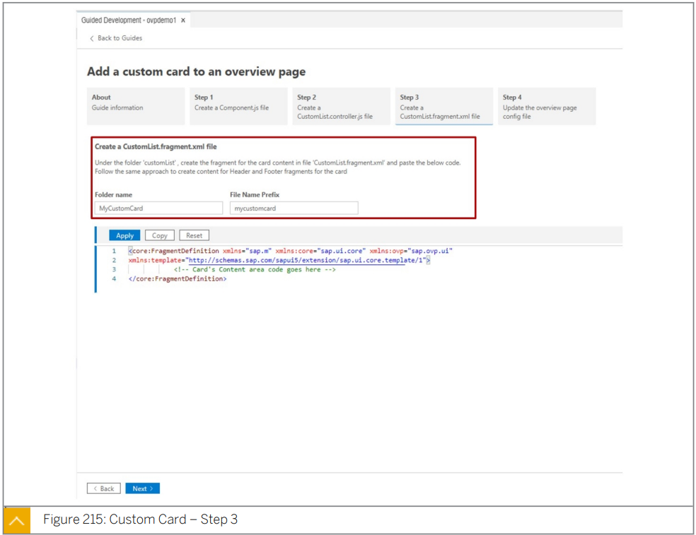

  4. ***<u>manifest.json 에 configuration 이 추가된다.</u>***

     

     ***<u>1단계 에서 삽입된 component 이름과 card id를 삽입</u>***해야한다.

  

  code artefact 가 생성되면 card 를 구현할 수 있다.

  card header 와 card content 에 대한 fragment 를 구현해야한다.


### SAP UI5 Flexibility


* ***<u>SAP UI5 Flexibility</u>*** 를 통해 다양한 user group 을 위한 function 들이 ***<u>SAP UI5 App 을 수정없이 단순하게 조정</u>***할 수 있다.
* It is available on ABAP platform, SAP Cloud Platform services in the Cloud Foundry environment.
* App ***<u>적응성을 확대하고 유지보수성과 단순성을 동시에 높여</u>*** ***<u>extensibility 개념을 대체</u>***한다.


***<u>UI adaptation</u>*** 은 ***<u>기술 지식과 개발자가 없는 key use</u>***r 가 ***<u>WYSIWYG 방식</u>*** 으로 UI 를 쉽게 변경할 수 있는 ***<u>SAP UI5 Flexibility 의 기술</u>***이다.


SAPUI5 flexibility 를 통해 ***<u>기존 app 에서 app variant 를 생성하여 UI 를 조정</u>***할 수 있다.

따라서 애플리케이션의 UI는 ***<u>원래 앱을 건드리지 않고 별도로 조정</u>***할 수 있다.

> ***<u>[참고](https://help.sap.com/viewer/a7b390faab1140c087b8926571e942b7/201809.002/en-US/af47058ad66144579db6a990f3b7b919.html)</u>***


### Adaptation Project

SAP UI5 Adaptation Project 를 통해 SAP BAS 에서 SAP Fiori App 을 확장할 수 있다.

> * SAP BAS 에서 고객과 개발자는 
>
>   ***<u>Adaptation Project</u>*** 를 통해 ***<u>기존 app 에 대한 app variant 를 create</u>***, 
>
>   ***<u>SAP UI5 Visual Editor</u>*** 를 통해 이를 ***<u>adapt</u>*** , 
>
>   ***<u>Git 에</u>*** 생성된 project 를 ***<u>store</u>***, 
>
>   ***<u>system에 deploy</u>*** 할 수 있다.
>
>   
>
> * ***<u>SAPUI5 Visual Editor</u>*** 는 ***<u>기본 코드를 변경하지 않고</u>*** ***<u>기존 SAP UI5 App 을 조정</u>***할 수 있는 기능을 제공하는 SAP BAS 의 ***<u>design-time editor</u>*** 이다.
>
>   
>
> * Standard SAP Fiori App 의 App variant 으로 ***<u>Extension</u>***
>
>   ***<u>(semantic/property changes, view/controller/i18n extension)</u>*** 
>
> * ***<u>View 를 Creation</u>***
>
>    (control variants · flex variant management)

***<u>SAP UI5 Adaptation Project</u>*** 를 사용하면 ***<u>SAP S/4HANA  on-premise ABAP syste</u>***m 에서 

기존 ***<u>SAP Fiori Element 기반 App 에 대한 variant 를 생성하고</u>***

***<u>UI5 control 을 위한 extension 기능을 제공</u>***할 수 있다.

***<u>source application 과 variant 자체에 대한 변경 사항을 포함</u>***하는 ***<u>app variant</u>*** 를 생성한다.

***<u>SAP UI5 flexibility 기능을 통해 확장</u>***되며 ***<u>source 를 수정하지 않는다.</u>***

이 수정 없는 접근 방식을 사용하면 ***<u>source artifacet 자체를 수정하는 대신</u>*** source app 과 artifect 를 ***<u>참조</u>*** 할 수 있다. 

Adaptation Project 는 ***<u>preview  로 사직</u>***하고 ***<u>SAP UI5 Adaptation Project 를 사용하여 adapt</u>*** 하고 ***<u>SAP BAS 에서 배포</u>***한다.

***<u>Adaptation Project 의 artifact</u>*** 는 사용자가 ***<u>변경한 내용만</u>*** 나타내며 재사용하는 ***<u>전체 app 은 표시하지 않는다</u>***.

***<u>app variant</u>*** 는 ***<u>원래 app 을 참조</u>***하지만 Adaptation Project 에 생성된 별도의 ***<u>변경 사항 집합을 포함</u>***한다.

또한 ***<u>App ID 가 variant 에 대해 정의</u>***되어있으며 ***<u>SAP Fiori Launchpad 에 별도의 등록</u>***이 필요하다.

기존 app 을 기반으로 app variant 를 만드는 option 을 사용하면 ***<u>두 instance 를 모두 계속 실행할 수 있으며 source app 을 그대로 유지</u>***할 수 있다.

***<u>FLP 에서 두 app instance 를 서로 다른 타일로 구성</u>***할 수 있다.

두 app 을 모두 사용하거나 다른 user set 에 app variant 를 할당할 수 있다.

현재 Adaptation Project 는 software component 의 version 이 ***<u>SAP_UI 7.53 SP00 인 on-premise ABAP system 에서만 지원</u>***된다.

SAP_UI 7.53 SP00 을 설치한 경우 ***<u>SAP note 2615176</u>*** 을 적용해야한다.

***<u>SAP UI5 는 최소 1.71 버전</u>***이어야한다.

> 


SAP Fiori App Refrence Library 는 제공되는 extensibility 기능 과 app 이름 뒤에 있는 technical app 이름에 대한 정보를 제공한다.

SAP Guided Answer 은 extend 방법에 대한 자세한 정보를 제공한다.

> [Extensibility 관련 자료](https://wiki.scn.sap.com/wiki/display/Fiori/Extensibility.) 
>
> 

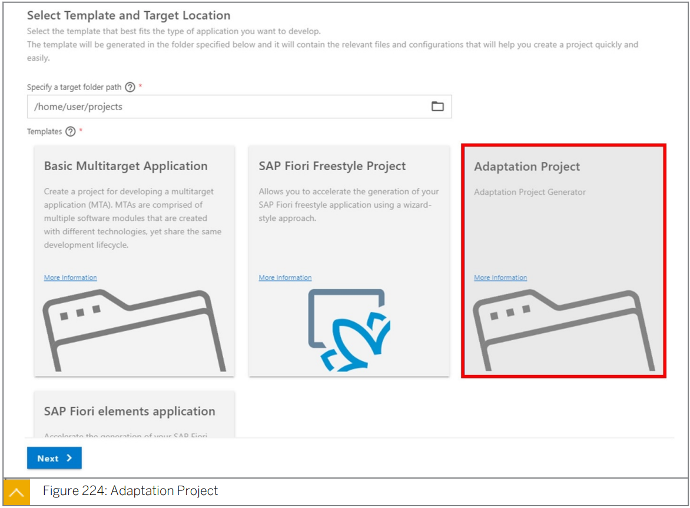

Adaptation Project 를 통해 개발자는 SAP BAS 에서 ***<u>SAP Fiori App 을 확장</u>***할 수 있다.

모든 기능을 사용하려면 기본 app 이 control 수준에서 안정적인 ID 를 제공하는 것이 중요하다.

SAP Fiori Element 는 각 control 이 안정적인 ID 를 갖도록 한다.

Adaptation Project 가 생성된 후에는 ***<u>새 project 를 새 workspace 에서 열어야 한다</u>***.

그렇지 않으면 ***<u>Visual Editor 가 올바르게 작동하지 않는다</u>***.(현시점에서)


SAP UI5 Visual Editor 는 app variant 를 생성하여 기본 app 을 확장하는데 사용된다.


Edit mode 에서 개발자는 현재 구현을 조정할 수 있다.

기본 app 이 안정적인 ID 를 사용하는 것이 중요하다.

안정적인 ID 없이 예를 들어 기존 control 의 property 는 수정할 수 없다.

개발자는 ***<u>깔대기 symbol</u>*** 을 사용하여 outline view ***<u>에서 control tree 를 enhance/reduce</u>*** 하고 app 에서 ***<u>사용 가능한 모든 control 을 표시</u>***할 수 있다.


***<u>app 을 미리보고 편집</u>***할 수 있는 visual editor 를 시작할 수 있다.

***<u>SAP Fiori Element 기반 app 과 Freestyle app 모두에서 동일한 방식</u>***으로 extend 할 수 있다.

UI 를 조정할 수 있다.

* Field 의 Add / Move / Remove
* section 재정렬
* embed iframe
* control property 변경
* i18n text extend
* XML Fragment 를 통한 content 추가  
* 등등,,,

또한 마우스 ***<u>우클릭을 통해 `Extend With Controller`option</u>*** 을 사용하여 controller 를 확장할 수도 있다.


Visual Editor 에 추가되거나 구성된 ***<u>Adaption 들은 `.change` 확장자 파일로 저장</u>***된다.

개발 artifact 는 project 에 위치한 variant 폴더에 저장된다.

***<u>Controller-extension 은 coding subfolder</u>*** 에 저장되며 ***<u>view enhancement 는 fragment subfolder</u>*** 에 저장된다.

 view modification 의 경우  SAPUI5 code 는 생성되지 않으며 `.change` 파일만 생성된다.


***<u>yo tool 을 사용하여 adaption project의 `manifest.appdescr_variant` 파일에 지정된 namespace 를 namespace parameter 로 새 app variant 를 배포</u>***한다.


***<u>T-code SUI_Support</u>*** 를 사용하여 ***<u>계층화된 repository 에 액세스</u>***한다.


이 세부 정보를 통해 관리자는 이제 app variant 에 대한 새 target mapping 을 만들 수 있다.

기본 app 을 일반적으로 숨기려면 URL parameter `sapappvar-id` 를 app variant namespace 와 함께 기본 app 의 target mapping 에 추가한다.


## SAP UI5 Smart Controls

* ### SmartField Controls

  * 입력 가능 field 를 효율적으로 추가할 수 있는 방법을 제공한다.
  * SmartField control 은 다음과 같이 기본 OData 서비스의 metadata 에 자동으로 조정된다.
    * ***<u>OData 속성의 값</u>***을 display 하기 위한 ***<u>control hosting</u>***
    * 자동으로 ***<u>value help 제공</u>***
    * ***<u>input check 수행</u>***
  * SmartField control 은 ***<u>field control 을 구현하고 message handling 을 지원</u>***한다.

  

  * #### Use Case

    * standalone control 로 사용 (ex: xml view 에서의 standalone control)
    * SmartForm control 과 함께 사용
    * SmartTable control 과 함께 사용
    * 수정 시나리오에서 cell editor 로서 사용

  

  * #### Detail

    * SmartField control 은 표시할 control 과 binding 된 OData 속성을 편집할 control 을 선택한다. 
    * 임의적이고 깊이 중첩된 complex property 가 지원된다.
    * SmartField control 을 사용하여 navigation property 를 바인딩 할 수 있다.
    * 바인딩과 관련된 Entity Set 은 control 의 entitySet 속성에 지정되어있거나 runtime 의 binding context 로 부터 파생된다. 
  
  
  
  nested control 을 선택하는 ***<u>main criterion</u>*** 은 SmartField control 이 바인딩 된 ***<u>OData 속성의 EDM type</u>*** 이다.
  
  ***<u>SmartField control 을 `Edm.Boolean` type 의 OData 서비스 속성에 바인딩</u>*** 할 때 SmartField control 이 read-only mode 인 경우 static text 가 visual representation 에 사용된다. 
  
  또한 SmartField control 의 configuration parameter 는 Yes/No 또는 True/False 와 같은 CheckBox 의 static text 속성을 정의할 수 있다. 
  
  SmartForm control 의 경우 custom data 를 이 목적으로 사용할 수 있다.
  
  * #### SmartField Control Configuration
  
    SmartField control 의 configuration aggregation SmartField control 의 기본 동작을 덮어 쓸 수 있는 옵션을 제공한다.
  
    controlType 속성을 사용하여 사용 가능한 다음 control type 중에서 usecase 에 적합한 control 을 선택할 수 있다. 
  
    * <u>***Check box***</u>
    * <u>***Date picker***</u>
    * <u>***Drop-down list (combo box)***</u>
    * <u>***Input***</u>
    * <u>***Select drop-down list (sap.m.Select)***</u>
  
  
  
  지원되는 control type 은 다음과 같은 관련 data type 에 따라 달라진다.
  
  * 관련 OData 속성이 `Edm.String` type 인 경우 SmartField control 을 구성하여 combo box 나 select drop-down list 를 렌더링할 수 있다.
  * 관련 OData 속성이 `Edm.Boolean` type 인 경우 SmartField control 을 구성하여 combo box 를 렌더링할 수 있다. 
  * 관련 OData 속성이 `Edm.DateTime` type 인 경우 SmartField control 을 구성하여 date picker 를 렌더링할 수 있다.
  
  
  
  * #### Available Control
  
    |                            | Editing Use Cases        | **Display Use Cases** |
    | -------------------------- | ------------------------ | --------------------- |
    | **EDM Type**               | **Control**              | **Control**           |
    | ***`Edm.Boolean`***        | *`sap.m.CheckBox`*       | *`sap.m.CheckBox`*    |
    | ***`Edm.Int16`***          | *`sap.m.Input`*          | *`sap.m.Text`*        |
    | ***`Edm.Int32`***          | *`sap.m.Input`*          | *`sap.m.Text`*        |
    | ***`Edm.Int64`***          | *`sap.m.Input`*          | *`sap.m.Text`*        |
    | ***`Edm.SByte`***          | *`sap.m.Input`*          | *`sap.m.Text`*        |
    | ***`Edm.Byte`***           | *`sap.m.Input`*          | *`sap.m.Text`*        |
    | ***`Edm.Single`***         | *`sap.m.Input`*          | *`sap.m.Text`*        |
    | ***`Edm. Float`***         | *`sap.m.Input`*          | *`sap.m.Text`*        |
    | ***`Edm.Double`***         | *`sap.m.Input`*          | *`sap.m.Text`*        |
    | ***`Edm. Decimal`***       | *`sap.m.Input`*          | *`sap.m.Text`*        |
    | ***`Edm.String`***         | *`sap.m.Input`*          | *`sap.m.Text`*        |
    | ***`Edm.DateTime`***       | *`sap.m.DateTimePicker`* | *`sap.m.Text`*        |
    | ***`Edm.DateTimeOffset`*** | *`sap.m.DateTimePicker`* | *`sap.m.Text`*        |
  
  
  
  * #### Field Control aspects of SmartField control
  
    Field Control 은 SmartField control 의 visual representation 을 처리한다. 
  
    Field Control 을 구현하는데 사용할 수 있는 특성은 다음과 같다.
  
    * ***<u>Enabled</u>***
      display 에서 edit mode 로 전환
  
    * ***<u>Visible</u>***
      SmartField control 을 숨김
  
    * ***<u>Mandatory</u>***
  
      입력이 필수인지 여부를 결정
  
  
  
  * #### Additional Properties of the SmartField control
  
    
  
    * ***<u>displayBehavior</u>***
  
      ID 와 decription 또는 Boolean value 이 읽기 전용 모드로 표시되는 방법을 정의한다. 
  
      * <u>***`sap.ui.comp.smartfield.DisplayBehaviour.descriptionAndId`***</u>
  
        사용 가능한 값에 대한 description 과 ID 를 표시한다.
  
      * <u>***`sap.ui.comp.smartfield.DisplayBehaviour.descriptionOnly`***</u>
  
        사용가능한 값에 대한 description 만 표시한다. 
  
      * <u>***`sap.ui.comp.smartfield.DisplayBehaviour.idAndDescription`***</u>
  
        사용가능한 값에 대한 ID 및 decription을 표시한다. 
  
      * <u>***`sap.ui.comp.smartfield.DisplayBehaviour.idOnly`***</u>
  
        사용가능한 값에 대한 ID 만 표시한다. 
  
      * <u>***`sap.ui.comp.smartfield.DisplayBehaviour.OnOff`***</u>
  
        부울 값을 On/Off로 표시한다.
  
      * <u>***`sap.ui.comp.smartfield.DisplayBehaviour.TrueFalse`***</u>
  
        부울 값을 True/Flase로 표시한다.
  
      * <u>***`sap.ui.comp.smartfield.DisplayBehaviour.YesNo`***</u>
  
        부울 값을 Yes/No 로 표시한다.
  
    * ***<u>preventInitialDataFetchInValueHelpDialog</u>***
  
      value help dialog 가 열리면 query 가 즉시 실행되는것을 방지한다.


* ### SmartForm Controls

  ***<u>`sap.ui.comp` 라이브러리</u>*** (smart control) 의 control 은 ***<u>SAP Fiori element 에 중점</u>***을 둔다.

  앞으로도 library 과 library 의 control 들을 계속 유지할 것이다.

  그러나 SAP Fiori Element 의 요청이 있지 않는 한 새로운 기능의 개발은 없다. 

  #### Overview

  * SmartForm control 은 form content 를 display 한다.
  * SmartField control 및 OData metadata annotation (along with additional configuration) 과 함께 사용하는 경우 최소한의 노력으로 form 을 만들 수 있다.
  * 사용자 권한에 따라 사용자는 다음과 같은 작업을 수행할 수 있다.
    * <u>***display / edit mode 전환***</u>
    * <u>***field 추가 / 그룹화***</u>
    * <u>***field label 이름 변경***</u>
    * <u>***user input check 구현***</u>
  
  
  
  #### Feature
  
  * ***<u>Adaptation setting</u>***
  
    주요 사용자는 한 클라이언트의 모든 사용자에 대해 form 을 조정할 수 있다.
  
    *  field 추가/숨기기
    * group 추가 / 숨기기
    * field / group 순서 변경
    * field label 이름 변경
  
  * ***<u>Display/Edit button</u>***
  
    option button 을 통해 display / edit mode 를 전환할 수 있다.
  
    > #### Note
    >
    > SmartField type 의 field 는 display mode 의 UI text 및 edit mode 의 user input 과 같이 필요한 모드에서 적절한 control 로 자동으로 표시된다.
    >
    > SmartField  이외의 control 을 사용하는 경우 해당 app 은 disaplay / edit mode 간의 전환을 처리해야한다.
  
  * ***<u>Field Label</u>***
  
    SmartField type 의 field 의 경우 SmartForm control 은 ***<u>OData metadata annotation 을 기반</u>***으로 ***<u>label 을 자동으로 생성</u>***한다.
  
  * ***<u>Check button</u>***
  
    option button 을 사용하여 사용자가 현재 user input 을 check 할 수 있다. 
    
    > #### Note
    >
    > SmartField type 의 field 의 경우 OData metadata annotation 을 기반으로 값이 check 된다.
    >
    > 정의된 theme 에 따라 오류가 있는 field 는 빨간색 동그라미로 display 된다.
    >
    > user 가 이러한 field 중 하나를 누르면 관련 오류 메시지가 표시된다.
  
  
  
  #### Detail
  
  * <u>***groups (`sap.ui.comp.smartform.Group`)***</u>
  * <u>***group elements (`sap.ui.comp.smartform.GroupElement`)***</u>
  
  group element 는 label 과 함께 표시되는 control 의 collection 이다.
  
  일반적으로 group element 는 ***<u>정확히 하나의 control 과 각 label 로 구성</u>***된다.
  
  ***<u>SmartForm control 은 group 을 집계</u>***하고 group 은 ***<u>group element 를 집계</u>***한다.
  
  ***<u>group element 자체는 `sap.ui.core.Control` type 의 element 를 집계</u>***한다.
  
  
  
  #### Layout
  
  * SmartForm control 은 조정할 수 있는 ***<u>ResponsiveGrid Layout 을 사용</u>***한다.
  * 다음 property 가 aggregation layout 에 표시된다.
    * ***<u>[sap.ui.comp.smartform.Layout](https://sapui5.hana.ondemand.com/sdk/#/api/sap.ui.comp.smartform.Layout%23controlProperties)</u>***
    * labelSpanXL / labelSpanL / labelSpanM / labelSpanS
    * emptySpanXL / emptySpanL / emptySpanM / emptySpanS
    * columnsXL / columnsL / columnsM
    * breakpointXL / breakpointL / breakpointM
    * gridDataSpan
  
  맨 위에 label 이 있는 field 를 서로 옆에 표시하려면 useHorizontalLayout property 와 함께  layout element 의 gridDataSpan property 를 사용할 수 있다. 
  
  
  
  확장 가능 property 가 설정된 경우 form 은 `sap.m.Panel` 에 포함된다.
  
  해당 속성을 통해 form 을 접거나 확장할 수 있다.
  
  #### Toolbar
  
  * SmartForm control 은 Toolbar 를 사용하여  form title 과 button 들을 display 한다.
  
    * <u>***Display/Edit (`editTogglable` property)***</u>
    * <u>***Check (`checkButton` property)***</u> 
  
  * 또는 custom toolbar 를 사용할 수 있다. (custom Toolbar aggregation)
  
    이경우 SmartForm control 은 standard toolbar 를 custom toolbar 로 바꾸고 요청에 따라 title 과 button 을 추가한다.
  
  
  
  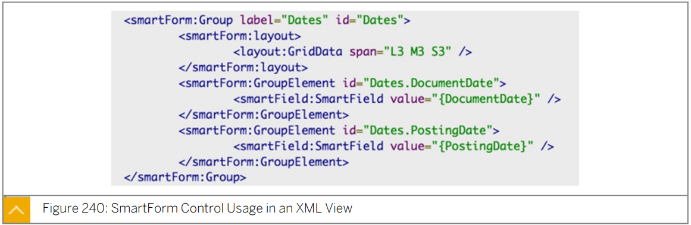


* ### SmartTable Controls

  #### Overview

  * ***<u>`sap.ui.comp.smarttable.SmartTable`</u>*** 은 SAP UI5 table 주변의 ***<u>wrapper control</u>*** 이다.
  * control 은 ***<u>OData 서비스의 $metadata document 를 분석</u>***하고 특정 ***<u>entity set 에 대한 table 을 렌더링</u>*** 한다.
  * 이 control 을 통해 consuming app 은 효율적이고 일관된 방식으로 list pattern 을 작성할 수 있으므로 사용자는 큰 노력 없이 쉽게 table 을 만들 수 있다.

  * 사용중인 app 은 OData 기본 정보를 덮어 쓸 수 있다.
  * SmartTable control 은 ***<u>row count 및 spreadsheet app 으로 내보낼</u>*** 수 있는 기능과 같은 built-in 기능들을 제공한다.

  

  #### Detail

  * SmartTable 은 internal responsive table 과 함께 사용할 때 ***<u>demandPopin property 를 true</u>*** 로 설정할 수 있다.

    이 property 는 ***<u>popup</u>*** 을 표시하여 화면에서 ***<u>사용 가능한 공간을 초과하는 열을 렌더링</u>***한다.

  * SmartTable 은 column 에 대한 ***<u>custom data section 을 check 하고  columnIndex attribute 을 읽어</u>*** XML View 에 정의된 ***<u>column 이 렌더링 되는 시기를 결정</u>***한다.

  * EntityType 에 대한 navigation Property field 를 표시하고 따르려면 SmartTable control 이 자동으로 ***<u>$expand 작업을 수행한다</u>***.

  > #### Note:
  >
  > spreadsheet 로 export 를 수행하는 동안 $expand 작업을 수행하면 $expand parameter 가 자동으로 제거된다. (Gateway export type 에만 관련됨)

  

  #### SmartTable Control Integration with Other Controls

  * SmartTable control은 다음과 같은 다른 control 과 밀접하게 연결되어있다.
    * <u>***VariantManagement***</u>
    * <u>***SmartFilterBar***</u>
    * <u>***P13nDialog***</u>
  * 이 control 은 ***<u>SmartLink control 의 popup 도 지원</u>***한다.

  

  ```xml
  <mvc:View
  	xmlns="sap.m"
  	xmlns:mvc="sap.ui.core.mvc"
  	xmlns:smartFilterBar="sap.ui.comp.smartfilterbar"
  	xmlns:smartTable="sap.ui.comp.smarttable"
  	xmlns:html="http://www.w3.org/1999/xhtml"
  	xmlns:app="http://schemas.sap.com/sapui5/extension/sap.ui.core.CustomData/1"
  	controllerName="sap.ui.comp.sample.smarttable.SmartTable"
  	height="100%">
  
  		<!-- use this to make the table occupy the available screen height -->
  		<VBox fitContainer="true">
  			<smartFilterBar:SmartFilterBar
                                             id="smartFilterBar" 
                                             entitySet="LineItemsSet"
                                             persistencyKey="SmartFilter_Explored"
                                             basicSearchFieldName="Bukrs" 
                                             enableBasicSearch="true" >
  				<smartFilterBar:controlConfiguration>
  					<smartFilterBar:ControlConfiguration key="Bukrs">
  					<smartFilterBar:defaultFilterValues>
  							<smartFilterBar:SelectOption low="0001">
  							</smartFilterBar:SelectOption>
  						</smartFilterBar:defaultFilterValues>
  					</smartFilterBar:ControlConfiguration>
  					<smartFilterBar:ControlConfiguration key="Gjahr">
  						<smartFilterBar:defaultFilterValues>
  								<smartFilterBar:SelectOption low="2014">
  								</smartFilterBar:SelectOption>
  						</smartFilterBar:defaultFilterValues>
  					</smartFilterBar:ControlConfiguration>
  				</smartFilterBar:controlConfiguration>
  <!-- layout data used to make the table growing but the filter bar fixed -->
  				<smartFilterBar:layoutData>
  					<FlexItemData shrinkFactor="0"/>
  				</smartFilterBar:layoutData>
  			</smartFilterBar:SmartFilterBar>
  			<smartTable:SmartTable 
                                     id="LineItemsSmartTable" 
                                     entitySet="LineItemsSet"
                                     smartFilterId="smartFilterBar" 
                                     tableType="Table" 
                                     useExportToExcel="true" 
                                     beforeExport="onBeforeExport" 
                                     useVariantManagement="true" 
                                     useTablePersonalisation="true" 
                                     header="Line Items" 
                                     showRowCount="true" 
                                     persistencyKey="SmartTableAnalytical_Explored" 
                                     enableAutoBinding="true" 
                                     class="sapUiResponsiveContentPadding" 
                                     enableAutoColumnWidth="true" 
                                     editTogglable="true" 
                                     app:useSmartToggle="true">				
  <!-- layout data used to make the table growing but the filter bar fixed -->
  				<smartTable:layoutData>
  					<FlexItemData growFactor="1" baseSize="0%"/>
  				</smartTable:layoutData>
  			</smartTable:SmartTable>
  		</VBox>
  </mvc:View>
  ```

  
