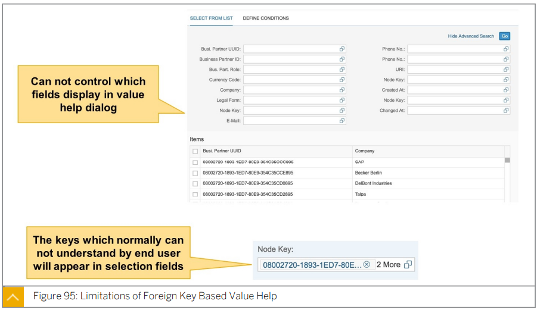

# 9.SAP Fiori Elements & Smartcontrols 

#### UX403

Describe the use of SAP Fiori Elements and Smartcontrols.

## 

## Fiori Elements, Overview

SAP Fiori element 는 UI 패턴에 대한 설계와 일반적으로 사용되는 app  패턴에 대한 predefine 된 템플릿을 제공한다.

개발자는 SAP Fiori element 를 사용하여 자밧크립트 UI 코딩이 필요 없는 OData 서비스 및 Annotation 기반으로 SAP Fiori 애플리케이션을 만들 수 있다.

결과 앱은 중앙에서 제공되는 predefine된 view 와 controller를 사용하므로 애플리케이션별 view 인스턴스가 필요하지 않다.

SAPUI5 런타임은 기본 OData 서비스의 metadata 및 annotation을 해석하고 시작 시 SAP Fiori 앱에 대한 해당 view를 사용한다.

predefine된 view 와 controller는 유사한 앱에서 UI 설계 일관성을 보장한다.

또한 metadata 기반 개발 모델은 각 앱의 프런트 엔드 코드 양을 크게 줄여 개발자가 비즈니스 로직에 집중할 수 있도록 한다.

* ### SAP Fiori Elements - Definition

  * #### No JavaSctipt UI Coding

    기존의 SAPUI5 개발과 달리 SAP Fiori Element 애플리케이션 개발에는 상세한 JavaScript 지식이 필수는 아니다.

    자바스크립트는 유연하고 완전히 동적인 언어이며 컴파일 타임 코드 검사가 없기 때문에 자바스크립트에 의해 작성된 코드는 런타임 오류의 가능성이 더 높다.

    SAP Fiori Element 는 JavaScript 코드를 공부하고 작성하고 디버깅하는 수고를 덜어준다.

    이러한 SAP Fiori 앱 개발 방식은 ***<u>특히 많은 SAP Fiori 앱이 필요한 경우</u>*** SAP Fiori 앱의 ***<u>전반적인 품질, 안정성 및 유지보수성</u>***을 제공한다.

    

  * #### Metadata-driven approach of SAP Fiori development

    이전 과정에서 배웠듯이 SAP Fiori 애플리케이션은 back end logic을 제공하는 OData 서비스에 의존한다.

    각 OData 서비스의 metadata document는 ***<u>Entity, 각 Entity 에 대한 property, collection, association 및 서비스 소비자를 위한 모든 것</u>***을 포함하는 서비스의 정보를 설명한다.

    SAP Fiori Element 개발의 접근 방식은 OData metadata document 에 보다 생생한 description 을 추가하는 것이다.

    이러한 description은 소비자가 data의 정보를 알 수 있을 뿐만 아니라 data를 표현하는 방법도 알 수 있게 해준다.

    OData metadata document 에 추가된 description 을 ***<u>OData Annotation</u>*** 이라고 한다.

    

  * #### Centrally Provided Templates covering Reporting, Analytic, Transaction scenarios.

    SAP는 SAP Fiori Element에 대한 템플릿을 제공한다.

    각 템플릿은 엔터프라이즈 애플리케이션의 공통 요구사항을 대상으로 한다.

    현재 우리는  Report, Overview Page, and Analytic List Page, targeting to daily reporting, analytic, transaction scenarios 를  보유하고 있다.

    SAP는 지속적으로 템플릿을 추가하여 SAP Fiori Element가 대부분의 일반적인 요구사항을 충족하도록 보장한다.

* ### Concept of Annotations of OData Services

  

  Annotation은 OData Service에 대한 description 정보이다.

  OData  V2.0에서 Annotation은 ***<u>OData metadata 의 XML tag</u>*** 에 저장되어 ***<u>data type,  nullable 등의 Entity 또는 Field 를 설명</u>***한다.

  SAP는 보다 ***<u>복잡한 용도를 충족하기 위해 표준 OData Annotation을 확장</u>***했다.

  SAP에서 지정한 모든 Annotation 은 ***<u>`sap:createable`, `sap:updatable`과 같이 `sap:`로 시작</u>*** 된다.

  이러한 Annotation은 ***<u>SAPUI5 애플리케이션에 영향을 주지 않는다</u>***.

  그러나 ***<u>'\CRUD Application'과 같은 wizard 에서 프로젝트를 생성</u>***하는 경우 생성된 코드는 ***<u>이러한 Annotation의 영향을 받는다</u>***.

  예를 들어, Record 업데이트를 위해 생성된 형식의 필드의 ***<u>editable property 은 해당 필드의 'sap:updatable' Annotation 에 의해 결정</u>*** 된다.

  

  OData V4.0 에서는 Annotation 이 OData metadata document 의 main part에서 분리된다.

  main part 와는 별도로 OData metadata document의 ***<u>stand alone part일 수도 있고 별도의 파일에 저장될 수도 있다.</u>***

  이를 통해 ***<u>보다 복잡한 Annotation 을 구축하거나 OData 서비스 하나에 대해 두 개 이상의 Annotation 을 작성</u>*** 하여 **서로 다른 요구 사항을 충족**할 수 있다.

  

  vocabulary는 OData 서비스에 annotation을 추가하는 방법을 정의한다.

  모든 annotation 파일은 참조에서 시작해야하고 일부 vocabulary 에 alias 를 제공해야 한다.

  vocabulary의 형식은 ***<u>Term 과 Type 의 정보를 포함하는 XML 문서</u>*** 이다.

  SAP Fiori Element 시나리오에서 가장 ***<u>중요한 vocabulary는 UI vocabulary</u>***이며 SAP Fiori Element에서 사용할 수 있는 ***<u>대부분의 annotation을 정의</u>*** 한다.

  Common , Communication 과 같은 다른 vocabulary는 ***<u>특정 도메인에서 annotation을 정의</u>***하며 ***<u>여러 시나리오에서 사용</u>***된다.

  

  Annotation은 ***<u>target별로 그룹화</u>***되어야 한다. 

  target은 ***<u>Annotation 그룹을 OData 서비스의 무언가에 연결</u>***한다.

  대부분의 Annotation은 data와 관련이 있으므로 ***<u>entity type 또는 property를 target</u>***으로 한다.

  경우에 따라 Annotation은 ***<u>OData Association, Function Import, 기타 object</u>***를 target으로 한다.

  일부 Annotation은 data에 관한 것이 아니거나 특정 Entity type과 결합하지 않으며, 이러한 Annotation에는 target이 없으므로 빈 "" target을 가진 Annotation 그룹에 포함되어야 한다.

  

  ***<u>모든 Annotation에는 term이 있어야 한다.</u>*** 

  term은 Annotation의 의미를 결정한다.

  예를 들어, ***<u>`UI.FieldGroup` term은 필드 그룹을 정의</u>***한다.

  동일한 target 에 대해 ***<u>동일한 term을 가진 두 개의 Annotation</u>***이 있는 경우 Annotation을 ***<u>고유하게</u>*** 만들려면 ***<u>qualifier 를 추가</u>***해야 한다.

  

  term 은 vocabulary로 정의된다. 

  다음 정보는 term 정의의 일부이다:

  * **Term Name** 

    term의 이름

  * **Data Type**

    term에 Record가 하나만 있는 경우 Type 을 작성한다.
    term에 다중 Record가 있을 수 있는 경우 Type attribute는 `Collection(<Data Type>)`이어야 한다

  * **Applies To**: 

    OData 서비스에서 이 term 의 target이 될 수 있는 element 의 종류를 정의한다.

  * **Nullable**: 

    기본값은 true 이다. 대부분의 Annotation 은 무효화할 수 있다. 

  * 이 term에 대한 Annotation 으로, 개발 도구에 사용된다.

  

  대부분의 term은 Complex type 으로 설명된다.
  Complex type은 다른 Complex type 이나 , (string,int32,boolean 같은) OData built in type (Edm) 에 의해 더 설명되는 property 를 가질 수 있다.

  

  더 나은 재사용성을 위해 type 상속이 지원된다.

  예를 들어 위의 `DataFieldAbstract`는 Abstract data type (`Abstract = true`)이고 

  `DataFieldWithAction` type은 `DataFieldAbstract`의 base type이므로 후자는 base type의 property 를 가지며 추가 property 가 정의된다.

  

  DataField 로 시작하는 Data Type 의 컬렉션은 UI Annotation의 기초이다.

  data 필드는 end user 가 보고 선택하고 검색하기 때문에 대부분의 term 과 Complex type은 이러한 data type과 관련이 있다.

  *<u>모든 type은 DataFieldAbstract에서 상속</u>*된다.

  * **DataFieldAbstract**

    모든 DataField type에 대한 Abstract type

    필드를 설명하는 공통 속성을 정의한다.

  * **DataField**

    화면의 일반 data field 

    OData 서비스의 entity type field 의 값을 표시한다.

  * **DataFieldForAnnotation**

    다른 Annotation은 화면에 표시되는 필드를 결정한다.

  * **DataFieldWithAction**

    단추 또는 링크로 렌더링되는 실제 작업은 필드 값과 관련이 있다.

  * **DataFieldForAction**
    단추 또는 링크로 렌더링되는 작업은 `DataFieldWithAction`과 달리 필드 값과 관련이 없다.

  * **DataFieldWithNavigationPath**
    필드의 data source는 association을 통해 액세스할 수 있는 다른 엔티티 type의 필드이다.

  * **DataFieldWithURL**
    data 필드는 하이퍼링크로 렌더링되며 사용자가 선택하면 URL이 열린다.

  * **DataFieldWithIntentBasedNavigation**
    data 필드가 하이퍼링크로 렌더링되고 SAP Fiori Launchpad에 정의된 intent로 이동한다. target 은 필드 값과 관련이 있다.

  * **DataFieldForIntentBasedNavigation**
    data 필드가 하이퍼링크로 렌더링되고 SAP Fiori Launchpad에 정의된 intent로 이동한다. 대상은 `DataFieldWithIntentBasedNavigation`과 달리 필드 값과 관련이 없다.

솔직히 무슨 내용인지 깊이 있게 이해되지 않는다.

https://sap.github.io/odata-vocabularies/vocabularies/UI.html#DataFieldAbstract 

혹 시간이 된다면 참고 하자

* ### Smart Control, Concept

  

  스마트 컨트롤은 SAP Fiori element 이전에 개발된 컨트롤 collection 이다.

  초기 목적은 대부분의 일반적인 use case에서 SAPUI5의 basic control 을 대체하는 것이었다.

  이 아이디어는 스마트 컨트롤을 통해 전체 애플리케이션을 구축하는 것이었는데, 이는 SAP Fiori element의predecessor 인 Smart Template 이었다.

  개발자는 이러한 컨트롤을 독립적으로 사용하거나 스마트 템플릿을 사용하여 스마트 응용프로그램을 구축할 수 있다.

  Smart Control 과 SAP Fiori element의 ***<u>개발 및 유지보수는 별개</u>***이다.
  현재 SmartControl은 주로 SAP Fiori element용이며 ***<u>독립 실행형 사용에는 권장되지 않는다</u>***.
  스마트 컨트롤의 모든 ***<u>새로운 기능은 SAP Fiori element의 요구 사항에 따라 결정</u>***된다.

  

##  Templates for Fiori Elements

* ### List Repost

  

  List Report를 통해 사용자는 많은 item list 로 작업할 수 있다.

  큰 ***<u>list 를 필터링</u>***하는 강력한 기능과 **<u>*결과 item list 를 표시하는 다양한 방법*</u>**을 결합한다.

  #### List Report - Element

  * **Application header**

    variant management 를 포함한 smart filter bar 와 Send Email action 을 포함한 generic Share menu 

  * **Save as Tile**

    SAP Jam에서 공유(SAP Jam과 integration 이 구성된 경우).

    기본적으로 ***<u>smart filter bar 는 사용자가 앱을 시작할 때 표시</u>***된다. 

    **이동을 선택**하면 ***<u>List Report의 내용이 표시</u>***된다.

    사용자가 기본 variant 로 `Execute on Select` 를 설정한 경우 앱을 ***<u>시작하자마자 List Report의 내용이 표시되고 smart filter bar 가 축소</u>***된다.

  * **Smart table**

  * **Footer toolbar**

    optional action 을 포함할 수 있다.

    

  List Report는 plain text 뿐만 아니라 UX 를 개선하기 위해 다양한 다른 양식으로도 data 를 표시할 수 있다.

  또한 ***<u>편집 가능한 cell</u>*** 을 지원하며 CRUD 작업을 해당 백엔드 코드에 활용할 수 있다.

  이를 통해 ***<u>SAP GUI에서 ALV를 대체하는 List Report</u>***를 사용할 수 있다. 

  SQVI 및 ALV 기반 ABAP report 에 의해 생성된 많은 ABAP 쿼리를 List Report로 대체할 수 있다.

* ### Object Page

  

  Object Page에는 단일 비즈니스 entity의 정보가 표시된다.
  Object Page의 주요 entry 는 List Report에서 행을 선택하는 것이므로 이 페이지는 List Report 템플릿에 결합하여 사용한다.
  List Report 를 사용하여 SAP Fiori Element 애플리케이션을 생성하면 Object Page가 나타난다.

  #### Object Page - Element

  * 오브젝트 유형 또는 제품으로 설정된 **Page Title**

  * **Object Header**

    - 제목 및 부제
    - 상태 편집 icon

  * 일반 작업이 포함된 **Header toolbar** (Display mode)

  * 포함할 수 있는 **Optional Element**

    - description
    - object 의 image
    - use case-specific actions (예: 편집 및 삭제) 에 대한 헤더 header toolbar 의 button

  * object 에 대한 중요한 정보를 보여줄 **Header facets** 

    - 가격 또는 가용성 등을 표시하기 위한 Label-field pairs

      최대 5개의 Label-field pair 를 사용하는 것이 좋다.

    - 판매 수익을 자세히 설명하는 micro chart 를 표시하거나 user-assigned 등급의 평균을 시각화 하는 rating indicator 와 같은 것들을 보여주기 위한 smart control 

  * 사용자가 개별 content area section 으로 이동할 수 있는 **Anchor navigation area**

  * 필드 그룹 또는 테이블을 포함할 수 있는 섹션으로 데이터가 구성되는 **content area**

  * **Footer bar** 

    작업 및 메시지 표시 단추를 사용할 수 있다(해당하는 경우).

    하위 항목 Object Page의 Footer bar에는 create 및 edit 모드의 적용 button 도 포함된다.

    이 작업은 현재 create / edit 작업을 완료하고 draft 를 저장한 후 object hierarchy 에서 한 단계 위로 이동한다. 

    작업이 성공적인 경우 toast message 가 표시된다.

* ### Overview Page

  

  Overview Page는 ***<u>SAPUI5 technology, OData 서비스 및 대량의 정보를 구성하기 위한 Annotation</u>***을 사용하여 구축된 ***<u>data-driven(데이터 기반) SAP Fiori 애플리케이션</u>*** 이다.

  Overview Page에서는 중요한 비즈니스 정보를 ***<u>시각적이고 실행 가능한 카드 형태</u>***로 ***<u>한 눈에 빠르게 액세스</u>***할 수 있다.

  **<u>*사용자 친화적인 환경*</u>**을 통해 ***<u>데이터를 빠르고 간단하게 보고 필터링하고 처리</u>***할 수 있다.

  비즈니스 사용자는 큰 그림을 ***<u>한 눈에 보여주는 동시에 가장 중요한 작업에 집중</u>***하여 ***<u>신속한 의사 결정과 즉각적인 조치를 수행</u>***할 수 있다.

  응용프로그램을 사용하면 정보를 매력적이고 효율적인 방식으로 시각화하는 데 도움이 되는 **여러 유형의 콘텐츠에 대한 여러 카드**를 만들 수 있다.

  SAP Business Application Studio의 ***<u>Overview Page wizard</u>***를 사용하여 Overview Page를 생성하고 페이지에 카드를 추가할 수 있다.

  ***<u>표시된 데이터는 fully interactive</u>*** 하며, 클릭 가능한 영역을 통해 ***<u>관련 응용 프로그램으로 쉽게 이동</u>***할 수 있다.

  Overview Page는 SAP Fiori를 기반으로 완벽하게 응답하는 UI 로 action item 을 구성한다.

  사용자는 SAP Fiori Launchpad에서 Overview Page에 액세스하여 **<u>표시되는 정보를 좁히거나 특정 주제에 초점을 맞추기 위해 카드를 숨길</u>** 수 있다.

  #### Overview Page - Component

  * **Application header**
    이 응용 프로그램이 Overview 를 제공하는 영역(예: 조달 또는 판매)에 대한 설명을 제공한다.
    헤더 영역에서 ***<u>사용자 계정 설정을 변경하고 카드(표시/숨기기)를 관리</u>***할 수 있다.

  * **Smart filter**
    ***<u>카드에 표시되는 데이터 수준을 변경하기 위한 응용 프로그램 수준 필터</u>***를 제공한다.
    예를 들어 필터를 사용하여 10,000달러보다 큰 트랜잭션만 표시하고 50kg보다 가벼운 항목만 표시할 수 있다.

  * **Cards**
    카드는 ***<u>UI Annotation 을 사용하여 콘텐츠를 렌더링하는 smart component</u>*** 이다.

    각 카드는 ***<u>데이터 소스에 설정된 단일 Entity 에 바인딩</u>***됩니다. 

    카드는 ***<u>도넛, 막대 차트 또는 테이블을 표시</u>***할 수 있다.

    스택 카드는 ***<u>객체 스트림에서 볼 수 있는 일련의 quick view cards</u>***를 포함한다.

    카드는 최대 5개의 응답 열로 Overview Page에 표시되며 ***<u>끌어서 놓기를 통해 다시 정렬</u>***할 수 있다.

* ### Analytical List Page

  

  ALP(Analytical List Page)는 상세 분석을 위한 SAP Fiori Element 애플리케이션이다.

  ***<u>SAP S/4HANA 1709 및 ABAP 7.52에 도입</u>***된 새로운 템플릿이다.

  ***<u>다양한 관점에서 데이터를 분석하고 근본 원인을 조사하며 트랜잭션 콘텐츠에 대해 작업</u>***할 수 있다.

  ***<u>데이터 시각화 및 비즈니스 인텔리전스</u>***를 사용하여 ***<u>데이터 세트 또는 중요한 단일 인스턴스 내에서 관련 영역을 식별</u>***할 수 있다.

  이 모든 것을 ***<u>한 페이지 안에서 원활하게 수행</u>***할 수 있다.

  ***<u>차트 및 테이블 시각화</u>***를 사용하는 ***<u>트랜잭션 및 분석 데이터의 조합</u>***을 통해 **관련 데이터를 빠르게 볼 수 있다.**

  이러한 ***<u>data 의 hybrid view</u>*** 를 통해 ***<u>차트와 테이블 표현 간</u>***의 흥미로운 상호 작용이 가능하다.

  다음 사용 사례를 한 페이지에 원활하게 포함하도록 ALP를 구성한다:

  * 헤더 영역의 관련 KPI(key performance indicators) KPI tag 

  * 이러한 KPI 태그들은 또한 KPI 카드들을 통한 점진적인 개시 및 탐색을 가능하게 한다.

  * 다른 필터 모드를 통해 주 내용 영역에 사용되는 데이터 세트를 필터링한다.

    예를 들어 시각적 필터는 관련 측정값에서 필터 값을 선택하는 직관적인 방법을 제공한다.

  * 콘텐츠 영역 및 KPI 카드 영역에서 애플리케이션으로 원활하게 이동할 수 있다.

  * ALP를 사용자 정의하고 다른 사용자와 페이지 variant 로 공유한다.

## The Development Environment (중요 X)

### SAP Fiori Element 개발을 위한 요소들

* 개발 도구를 실행하기 위한 **SAP BTP 계정** – **SAP Business Application Studio** - dev space
* 서버는 OData back end 의 역할을 수행하며, 이 과정에서는 embeded시나리오를 사용한다.
  따라서 back end logic 에는 하나의 ABAP 서버 만 사용하고 OData 서비스 및 SAP Fiori 애플리케이션을 게시하는 데에는 **SAP Gateway 서버**를 사용합니다.
* 게이트웨이 서버와 SAP BTP 간의 보안 연결을 설정하는 **SAP Cloud Connector**

1. SAP Business Technology Platform에 계정을 등록

2. SAP BTP 계정을 SAP 클라우드에 추가

3. 내부 SAP Gateway 서버를 연결하고 가상 호스트 이름/포트를 통해 노출되도록 SAP Cloud Connector에서 액세스 제어 정보를 구성

4. SAP BTP의 연결 서비스에서 대상을 생성

   이 대상을 사용하여 SAP Cloud Connector에 정의된 가상 호스트 이름을 통해 내부 SAP 게이트웨이에 연결

5. SAP BAS wizard를 실행하여 구성을 테스트합니다. 생성한 대상을 선택하고 OData 서비스 목록이 표시되는지 확인

### Create Fiori Element

1. Create an SAP Fiori elements application.
2. Choose an OData service.
3. Create an annotation file and writing annotation.
4. Modify the configuration file.
5. Translate resource bundles.
6. Deploy your SAP Fiori elements application.
7. Configure SAP Fiori Launchpad.
8. Authorize user to access the SAP Fiori application.
9. Log on to SAP Fiori Launchpad and add the tile to the SAP Fiori Launchpad.

## Fiori Guided Development

## Using CDS(Core Data Service) View

* ### The Core Data Services (CDS) View

  

  ABAP Core Data Service (ABAP CDS) 는 AS ABAP 에 대한 일반 CDS 개념의 platform-independent implementation 이다.

  ABAP CDS 는 표준 AS ABAP database 에서 semantic data model 을 정의할 수 있다.

  SAP HANA-specific variant HANA CDS 와 달리 ***<u>ABAP CDS 는 database 시스템과 독립적</u>***이다.

  ABAP CDS 에 정의된 모델의 Entity 는 ABAP Dictionary 에 정의된 기존 database table 및 view 에 비해 향상된 access 기능을 제공하여 Open SQL 기반 app 을 최적화 할 수 있다.

  AS ABAP 이 SAP HANA database 를 사용할 때 메모리 내 특성을 최적의 방식으로 구현할 수 있기 때문에 이는 특히 명확하다.

  

  기본 CDS 는 view 를 정의하고 CDS 의 정의는 SQL 과 같은 구문을 사용한다.

  * **SQL View Name** : 

    ***<u>ABAP Dictionary 와의 호환성</u>***을 위해 각 CDS에는 ***<u>Old ABAP Dictionary (최대길이 : 16) 의 이름</u>***이 있어야 한다.

  * **Data Source** : 

    CDS View 는 ***<u>하나 이상의 database table 또는 CDS View 에서 데이터를 선택</u>***한다.

    데이터가 둘 이상의 data source 에서 가져온 경우 ***<u>SQL JOIN 구문을 사용하여 여러 data source 에서 데이터를 선택</u>***할 수 있다.

  * **Projection List** : 

    CDS View  에서 ***<u>가장 중요한 부분은 Projection List</u>*** 이다.

    Projection List 에서 계산된 ***<u>필드를 만드는 데 complex expression 을 사용할 수</u>*** 있다.

* ### Annotations for CDS Views

  

  CDS annotation 은 data 를 설명하기 위한 추가 정보로 CDS View 의 소비자가 CDS View 의 data 를 사용하는 방법을 알 수 있도록 한다.

  * CDS view 는 ABAP DDIC 에서 추출한 semantic information 으로 data 를 읽는 logic 을 정의한다.
  * CDS Annotation 은 data field 또는 view 자신의 추가 정보를 추가한다.
  * CDS Core annotation 은 모든 client 가 사용하는 가장 일반적인 정보를 포함한다.
  * CDS domain-specific annotation 은 특수 용도에 대한 정보를 포함한다.
  * CDS View 에 대한 annotation 작성 방법은 CDS View 용도에 따라 달라진다.

  

  | Domain                  | Usage                                                        |
  | ----------------------- | ------------------------------------------------------------ |
  | UI Annotation           | Fiori Element 의 가장 중요한 domain ***<u>CDS Annotation 과 OData Annotation 간의 거의 one-to-one 관계</u>***이다. |
  | Consumption Annotations | data field 또는 전체 Entity 의 ***<u>가시성을 제어</u>***한다.  field 에 대한 ***<u>value help 를 정의</u>***할 때 유용하다. |
  | Object Model Annotation | business data model 의 ***<u>구조적 측면 및 transaction 관련 측면에 대한 정의</u>*** 제공 |
  | Semantics Annotations   | data field 에 대한 ***<u>semantic information 의 강화</u>*** |

  

  ***<u>Annotation 은 용도에 따라 그룹화</u>*** 되며, 위 표의 SAP Fiori Element 와 관련된 Domain-Specific Annotation 은 SAP Fiori Element 와 가장 관련성이 높은 연관 그룹을 보여준다.

  [***<u>CDS View Annotation  자료</u>***](https://help.sap.com/docs/SAP_NETWEAVER_AS_ABAP_751_IP/cc0c305d2fab47bd808adcad3ca7ee9d/630ce9b386b84e80bfade96779fbaeec.html?locale=en-US&amp;amp;version=7.51.13)

  

  Annotation term 이 structure 를 나타내는 경우 annotation 작성에 두가지 옵션을 사용할 수 있다.

  * **Object Style**  

    클래스의 attribute 와 같은  ***<u>`.` 를 사용하여 sub level property 에 access</u>*** 한다.

  * **JSON Style** 

    JSON object 와 같은 방식으로 property 에 접근한다.

    `{}` 는 structure 를 나타낸다.

    property name 과 value 를 분리 하기 위해 `:` 를 사용한다.

    property 를 분리 하기 위해 `,` 를 사용한다.

  두 구문 모두 의미가 같으며 ***<u>`@UI.headerInfo.title: { value: 'SalesOrderID' }` 와 같이 둘을 조합하여 사용</u>***할 수도 있다.

  

  

  ***<u>annotation term 이 array 를 나타내는</u>*** 경우 유일한 option 은 ***<u>JSON array 를 사용</u>***하는 것이다.

  위 구문의 주요 기능

  * `{}` 는 structure 를 나타낸다.
  * `[]` 는 array 를 나타낸다.
  * property name 과 value 를 구분하기 위해 `:` 를 사용한다.
  * property 를 분리 하기 위해 `,` 를 사용한다.
  * 대부분의 경우 ***<u>각 라인은 식별을 위해 `qualifier` 라는 속성</u>***을 가져야 한다. 

  

  

  경우에 따라 term 이 array type 이지만 ***<u>대부분의 사용에는 single line record 만 있다</u>***.

  이 경우 ***<u>Object Style 을 사용하여 입력을 단순화</u>***할 수 있다.

* ### CDS Associations

  

  CDS View 는  일부 association 을 정의할 수 있다.

  Association 은 자체적으로 또는 이 CDS View 의 consumer 가 consume 할 수 있는 view 의 Association 을 선언하는 것이다.

  일반적으로 business entity 의 표현으로 association 을 정의하는 재사용 가능한 CDS View 를 정의해야한다. 

  그런 다음 interface view 를 data source 로 사용하는 consumption  CDS View 를 작성하여 data 와 association 을 사용할 수 있다.

  예를 들어 위 그림에서는 interface view1 에는 interface view3 과 interface view 2 에 연결된 두개의 association 이 있다.

  Consumption View 1 은 interface view1 의 데이터에 액세스 할 때 마다 다음을 수행할 수 있다.

  * interface view 1 의 field 에 access 

  * interface view 1 의 Association 1 을 통해 interface view 2 의  field 에 access

  * 이 view 의 consumer 가 interface view 3 의 field 에 access 할 수 있도록 하려면 interface view 1 의 association 2 를 다시 표시한다.

  

  

  위 그림의 association 의 구문은 세가지 main area 를 보여준다.

  * #### Define an association:

    ***<u>association 의 정의는 SQL JOIN 구문과 매우 유사</u>***하다. 

    현재 ***<u>프로젝트 list 에서 필드를 참조하는 쉬운 방법은 `$projection.`</u>*** 이다.

  * #### Use fields from an existing association:

    association name 과  field name 을 `.` 로 연결하는 것으로 association 으로 연결된 CDS View 로부터 field 에 access 할 수 있다.

    association 은 현 CDS View 또는 data source view 에서 정의할 수 있다.

  * #### Expose an association for external usage:

    이 view 의 consumer 를 위한 association 을 표시하기 위해 projection list 에 association name 을 작성한다.

    ***<u>association 과 field 는 구분 하기 위해</u>*** association name 의 앞에는 통상적으로 ***`_` 를 붙인다.***

    

## Using the Service Adaption Definition  Language (SADL)

* ### Service Adaptation Definition Language (SADL)

  

  SADL framework 는 연결된 CDS View group을 OData 서비스에 게시하는데 도움이 된다.

  각 ***<u>CDS View 는 Entity Set</u>*** 이며 그들의 ***<u>Association OData association 로 변환</u>***된다. 

  ***<u>association name 은 Navigation Property 로 OData Entity 에 반영</u>***된다.

  모든 SAP ***<u>Fiori Element 관련 annotation 은 OData annotation 으로 변환</u>***된다.

  **CDS View => Entity Set**

  **CDS Association => OData Association**

  **Association name => Navigation Property**

  **CDS UI Annotation => OData Annotation** 

  이러한 방식으로 비즈니스 logic, OData 서비스 개발 및 Annotation 을 하나의 CDS View 로 결합할 수 있다.

* ### CDS as an OData Service

  

  CDS View 에 ***<u>`@OData.publish:true` annotation 이 있는 경우</u>*** back end 시스템에 ***<u>OData 서비스가 자동으로 생성</u>***된다.

  프론트 엔트 시스템에서 활성화 하기만 하면 된다.

  작업중인 ***<u>CDS View 가 생성된 OData 서비스와 이름이 동인한 EntitySet</u>*** 으로 변환된다.

  이 view 와 연결된 모든 CDS View 도 EntitySet 으로 변환된다.

  Association relationship 이 OData 서비스에서 Association 및 Navigation Property 으로 변환된다.

* ### Creating an OData Service by Referencing a CDS

  

  SAP Gateway Service Builder 에서 기존 CDS View 를 참조할 수 있다.

  그런 다음 연결된 CDS View 를 선택적으로 추가할 수 있으며, 연결된 View 의 Association 도 OData 서비스에 추가할 수 있다.

  그런 다음 MPC 또는 DPC 표준 구현을 redefine 하여 OData 서비스에 대한 write support 및 OData service 를 위한 advanced OData 기능을 추가할 수 있다.

  *CDS 를 참조하여 OData Service 를 만드는 방법에 대한 자세한 내용은 GW100 참조* 

* ### Relationship Between CDS Annotation and OData Annotation

  

  OData 주석과 마찬가지로 CDS Annotation 을 EntitySet 또는 data field 에 적용할 수 있다.

  대부분의 경우 OData Annotaion term 과 CDS Annotation 사이에는 1:1 relationship 이 있으며 이름은 유사하다.

  CDS View 는 대상별로 그룹화 된다.

  동일한 대상을 가진 Annotation 은 함께 유지된다.

  OData Annotation 에는 고정된 위치가 없다. 

  일반적으로 term 별로 그룹화 된다.

  OData Annotation 으로 변환될 때 한 term 에 속하는 CDS Annotation 의 sequence 는 position property 에 의해 결정된다.

## Metadata Extension

***<u>complex annotation 이 필요한 경우</u>*** CDS 의 구문이 ***<u>증가하여 CDS 의 가독성이 저하</u>***될 수 있다.

Metadata Extension 은 annotation 을 비즈니스 logic 을 분리한다.

Metadata Extension 을 구현하려면 다음을 수행해야 한다.

1. CDS View 에 `@metadata.allExtensions:true` 의 Annotation 을 추가한다.
2. Metadata Extension 을 만들고 view 및 해당 field 에 대한 주석을 작성한다.
3. field 를 구분하려면 `;` 를 사용한다.

Metadata Extension 는 JSON Style 만 허용

[***<u>동일한 CDS 에 대해 Metadata Extension annotation 이 두개 이상있는 경우 사용되는 Metadata Extension 을 결정하는 방법</u>***](https://help.sap.com/doc/abapdocu_752_index_htm/7.52/en-US/abencds_meta_data_extension_eval.htm)

## SADL vs Local Annotation

* ### Advantage of SADL

  Annotation and data stay together

  Syntax is simple

  Reusable

* ### Advantage Local Annotation

  single field 또는 entity 에 binding 되지 않은 complex annotation 처리 가능

  CDS Annotation 보다 빠른 Vocabulary list update

  CDS Annotation 을 재정의 가능

## List Report

### Basic Annotations for List Report

* #### Mandatory Annotations

  * **`@OData.publish:true`** : CDS View 를 OData Service 로 자동 exposure 한다.

  * **`@UI.headerInfo.typeNamePlural`** : List Report 좌측 상단 모서리에 표시되는 텍스트를 결정한다.

* #### Adding Columns to Report

  

  *<u>**`@UI.lineItem`**</u>* 는 List Report 의 ***<u>기본열을 설정하는데 사용</u>***된다.

  `@UI.lineItem` 의 data type 은 data field 의 collection 이지만 대부분의 경우 field 에 대해 단 한개의 `@UI.lineItem` 만 존재한다.

  ***<u>`@UI.lintItem.position`</u>*** 은 column 의 ***<u>순서를 결정하는 mandatory property</u>*** 이다.

  각 **필드의 label** 은 필드에 대한 ***<u>data element 의 field label</u>*** 에서 가져온다.

  List Report 에 계산된 field 를 추가할 수도 있다.

  해당 field 는 data element 를 참조하지 않으므로 ***<u>`@UI.lineItem.label` 을 통해 할당</u>***하거나 ***<u>function cast 를 통해 data type 을 data element 로 변환</u>***해야한다.

* #### Semantic Information for Amount / Quantity fields

  

  금액 및 수량 필드의 경우 통화/단위 필드를 찾을 수 있는 곳을 지정해야한다.

  DDIC 또는 다른 CDS Entity 에서 선택한 필드에 이미 이 정보가 있을 수 있다.

  올바르게 정의되어있는 경우 통화/단위가 금액 수량 필드와 함께 표시된다.

  올바르게 표시 되지 않는경우

  currency/unit field 에  

  ***<u>`@semantics.currencycode` / `@semantics.unitofmeasure`</u>*** 에 true 값을 준 annotation 을

  amount/quantity field 에 

  ***<u>`@semantics.amount.currencycode` / `@semantics.quantity.unitofmeasure`</u>***

  주석에 currencyCode / unit 정보가 있는 field 명을 값으로 준 annotaion 을 추가하여 연결할 수 있다.

  ***<u>계산된 field 에 대해서는 항상 semantic information annotation 을 추가</u>***해야한다.

* #### Options for Adjusting the Display of Columns 중요!!

  * **Importance of Columns**

    

    List Report 에 사용되는 control 은 모든 client 를 위해 설계 되어있다.

    client 마다 화면의 너비는 다르고 스마트폰에 표시되는 필드는 데시크톱 브라우저 보다 작아야한다.

    *<u>**`@UI.lineItem.importance`**</u>*를 통해 필드에 표시할 client 를 결정할 수 있다.

    * *<u>**#HIGH**</u>*  *<u>**`@UI.lineItem.importance: #HIGH`**</u>*

      기본값 모든 클라이언트에 표시

    * ***<u>#MEDIUM</u>*** *<u>**`@UI.lineItem.importance: #MEDIUM`**</u>*

      데스크톱 브라우저 또는 태블릿에만 표시

    * ***<u>#LOW</u>*** *<u>**`@UI.lineItem.importance: #LOW`**</u>*

      데스크 톱에만 표시

  * **Hiding Fields**

    List Report 우측 상단 모서리를 클릭하여 column 표시를 직접 설정할 수 있다.

    CDS View 의 일부 field 는 end user 에게 노출 되어서는 안된다.

    이런 경우 ***<u>`@UI.hidden`</u>***  를 사용하여 노출되지 않도록 숨길 수 있다.

    

### Searching and Filtering Data

Search Field 는 List Report 좌측 상단 모서리에 있는 입력 field 이다. 

Selection Field 는 ***<u>value help dialog 를 포함</u>***한 입력 field 이다.

각 Selection Field 는 ***<u>back end OData service 의 한 property</u>*** 를 나타낸다 ***<u>(1:1 관계)</u>***.

Search Field 를 사용하기 위해 ***<u>`@Search.searchable:true` annotation 을 추가</u>***한다. 

***<u>`@Search.defaultSearchElement: true` annotation</u>*** 을 통해 ***<u>하나 이상의 필드를 기본 요소로 설정</u>***해야 한다.

Fuzzy 기능을 사용하기 위해서는 ***<u>`@Search.fuzzinessThreshold` annotation 을 통해 위와 같이 threshold 값을 설정해 주어야 한다. (0~1)</u>***

***<u>값이 증가</u>***할 수록 검색 결과는 ***<u>더 정확하고 더 적은 record 를 반환</u>***한다.

통상적으로 0.8 을 사용한다.

* **Fuzzy Search**

  

  Fuzzy Search 가 적용 되지 않은 경우 ***<u>\* 또는 ? 같은 wildcard character 를 사용</u>***하여 검색해야 하지만

  Fuzzy Search 가 적용된 경우 키워드에 오타를 입력하면 ***<u>유사한 결과를 띄워준다</u>***.

다른 annotation 과 달리 Search Field 에 대한 주석은 OData service 의 metadata 에 만 영향을 미친다.

CDS View 에서 생성된 Entitiy Set 에 OData V2 주석이 있다.

기본 검색 요소 및 fuzzy 검색 관련 주석은 ***<u>UI 와 관련이 없으므로 OData annotation 에 나타나지 않는다</u>***. 

 

목록에서 선택한 값이 사용자가 원하는 케이스에 없는 경우 입력값은 조건의 자유로운 스타일 입력도 지원한다.

개발자가 값 도움말 대화 상자를 제공하지 않은 경우 자유 스타일 입력만 지원된다.

조건 입력이 완료되면 모든 조건이 검색 필드에 표시된다.

사용자는 오른쪽에서 X를 선택하여 단일 조건을 삭제할 수 있다.

Selection Field 를 사용하려면 ***<u>`@UI.selctionField.position` element annotation</u>*** 을 사용한다.

***<u>Column 에 display 되지 않는 field 도 filter 조건</u>***으로 사용할 수 있다.

### Value Help

field 에 대한 association 이 있는 경우 이 ***<u>association 을 field 에 대한 check table 로 사용</u>***할 수 있다.

이를 이용하여 사용자에게 value help 를 제공할 수 있다.

다음 단계는 foreign key 연결에대한 value help 를 제공하는데 사용된다.

1. value help 에대한 적절한 association 을 찾는다.
2. ***<u>`@ObjectModel.foreignkey.association`</u>*** 을 사용하여 selection field 에 annotation을 추가한다. 
3. association 을 expose 한다.

foreign key 기반으로 value help 를 선언하는 것은 쉽지만 다음과 같은 제한이 있다.

* 일반적으로 비즈니스 Entity 의 technical key field 만 end user 에게 숨기려는 필드인 다른 보기와 연결됩니다.

  association 으로 띄워지는 dialog 에서는 보여지는 field 를 설정 할 수 없다는 말로 이해

* search help window 에서는 key field 와 `@semantics.text:true` annotation 이 달린 하나의 필드만 검색 결과 창에 표시할 수 있다.
* check view 의 모든 field 는 value help screen 의 selection field 로 표시된다.

보다 나은 UX 를 위해 다음 단계에 따라 모델링된 value help view를 작성한다.

1. CDS View 를 만들고 기존 테이블 또는 CDS View 에서 데이터를 선택한다.

   Value help 에 display 할 field 만 expose 한다.

2. value help view 에 대한 조건 및 계산된 필드를 추가할 수 있다.

3. report CDS View 에서 value help view 로 의 association 을 만들고 end user 가 이해할 수 있는 selection field 로 연결한다.

4. selection field 에 `@Comsuption.valuehelp:'<association_name>` annotation 을 추가한다.

5. association 을 expose 한다.

6. value help CDS View 에 `@search` annotation 을 추가하여 value help 에 대한 full text fuzzy search function 을 추가할 수 있다.

* **Note :**
  * 계산된 필드를 꼭 필요한 경우가 아니라면 (?)검색 조건으로 사용하지 않기를 권장한다. 성능 문제로 이어질 수 있다.
  * value help view에서 계산된 필드의 경우 `@EndUserText.label` 에서 label 을 설정합니다.
  * value help view를 수정하고 활성화한 후 report CDS View 다시 배포해야한다.

### Variant Managemen

SAPUI5 flexibility 서비스를 사용하면 다양한 사용자 그룹이 SAP Fiori 앱을 개인화하고 런타임에 UI 를 조정하고 새 앱을 개발할 수 있습니다.

이 서비스는 user-specific data 및 client-wide data를 ABAP 서버의 특수 repository 에 저장합니다. 

이를 ***<u>layered repository</u>*** 라고 합니다.

**<u>SAPUI5 flexibility 서비스의 필수 구성 요소</u>**

* Server : ***<u>ABAP front end server 및 SAP NetWeaver 7.31 SP 11 이상</u>***
* 다음 ICF 노드를 활성화해야 한다:
  ***<u>/SAP/BC/UI5_UI5</u>***
  ***<u>/SAP/BC/LREP</u>***
* For creating shared variants
  * 권한 부여 필드가 ***<u>`/UIF/KEYU = 'X'` 인 ABAP authorization object `/UIF/FLEX`</u>***  가 필요하다.
  * 사용자에게 할당된 작업이 있는 ***<u>transaction request</u>*** 가 필요하다

SAP NetWeaver AS ABAP 인 경우에만 variant 관리가 가능하다.

* #### Variant Selection

  

  Selection Variant(선택 variant)는 사용자를 저장한다.

  데이터를 필터링한 후 사용자는 variant 로 조건을 저장할 수 있다. 

  다음 항목은 선택 variant 에 대한 옵션입니다:

  * Name : variant 의 이름
  * Default : report 를 열었을 때 이 variant 가 적용된다.
  * Execute on Select : 사용자가 variant 를 선택한 후 즉시 쿼리 실행
  * Shared : 공유 variant . variant 를 공유로 설정할 때 transaction request 가 할당되어야 합니다. 

  사용자는 Manage 버튼을 클릭하여 variant 를 관리할 수 있다.

* #### Presentation Variant

  

* #### Smart Variant Management

  

  Selection Variant 와 Presentation Variant 를 하나로 결합하기 위해 사용한다.

  사용하기 위해 manifest.json 을 편집하고 도메인 `sap.ui.generic.app` 을 찾아 위 그림과 같이 코드를 수정해야한다.

* #### Disable Variant Management

  

  Variant Management 를 비활성화하려면 manifest.json 을 편집하고 `sap.ui.generic.app` 도메인을 찾은 다음 위와 같이 수정한다.

* #### Transport Request for Shared Variants

  

  shared variant 를 생성하기 전에 사용자에게 할당된 작업과 함께 transport request 을 준비해야한다.

  SE10 에서는 tast 에서 LREpository content 를 찾을 수 있다.

  LRepository objects 는 client 에 종속 되므로 workbench 요청 또는 사용자 지정 요청이 필요하다.

## Object Page

### Basic Annotations for Object Page

End User 가 List Report 에서 row 를 선택하면 Object Page 에서 세부 내용을 display 한다.

기본 Object Page 는 header area 와 body  를 포함하고 있다.

최 상단 중안에 Object Page 를 설명하는 Name 이 존재한다.

Header area 에는 Record Title, description, image 가 포함된다.

value 는 OData  Service 의 Property 에 바인딩 되어야 한다.

body area 에는 기본적으로 ***<u>` @UI.identification` annotation 이 달린 field</u>*** 가 display 된다. 

* #### `@UI.headerinfo.typeName`

  비즈니스 개체의 ***<u>Type name</u>*** 을 나타낸다.

* #### `@UI.headerinfo.title.value`

  ID Data Field 를 가리킨다.*<u>(Title 부분)</u>*

* #### `@UI.headerinfo.description.value`

  Description data field 를 가리킨다.***<u>(Title 아래의 description)</u>***

* #### `@UI.identification`

  UI.LineItem 과 마찬가지로 이 annotation 이 있는 필드는 페이지의 ***<u>General Information section</u>*** 에 포함된다.

  ***<u>facet 이 구현된 경우에만 display</u>*** 된다.

### Header Facet for Object Pages

Header Facet 은 Object Page 의 Header 부분에 배치된 정보이다.

일반적으로 ***<u>주요 정보 및 상태 정보는</u>*** 이 영영에 입력해야한다.

* #### Types of Header Facets

  

  ***<u>Field Group Facet</u>*** 은 **Label 이 있는 Field Group** 을 표시한다.

  ***<u>Plain Text Facet</u>*** 은 정확히 **한 Field 의 description 을 표시**한다.

  ***<u>Communication Facet</u>*** 은 **Hyper link 를 생성**한다.

  **사용자는 링크를 선택하여 communication information(전화 / 이메일 ,,,) 에 액세스** 할 수 있다.

  

  ***<u>Smart Micro Chart Facet</u>*** 은 사용자가 가장 중요한 **KPI 정보를 얻을 수 있도록** **Micro chart 를 display** 한다.

  ***<u>Rating Indicator Facet</u>*** 은 **등급 정보를 별로** 표시한다.

  ***<u>Data Point Facet</u>*** 은 사용자가 의미를 한눈에 파악할 수 있도록 **주요 수치 또는 상태 정보를 다른 색상 또는 스타일로 표시한다**.

  

* #### Field Group Facet

  

  ***<u>`@UI.FieldGroup` 은 field group 을 정의</u>***하는데 사용된다.

  대부분의 경우 CDS View 에 둘 이상의 필드 그룹이 있으므로 각 필드 그룹에 qualifier 를 할당하여 해당 필드 그룹을 구분해야한다.

  필드는 서로 다른 필드 그룹에 속할 수 있으므로 각 필드에 대한 ***<u>`@UI.fieldGroup` annotation 은 array</u>*** 가 된다.

  annotation 은 향후 수정이 용이하도록 JSON 형식을 사용한다.

  Field Group  annotation 을 OData annotation 으로 변환할 때 동일한 qualifier 를 가진 모든 `@UI.fieldGroup` annotation 이 하나의 항으로 결합된다.

  필드 그룹의 ***<u>필드 순서는 CDS View 에 정의된 `@@UI.fieldGroup.position`</u>*** 에 따라 결정된다.

  

  Field Group Header Facet 을 정의하려면 CDS View 의 ***<u>첫번째 필드에 `@UI.facet` annotation 을 추가</u>***해야한다.

  ***<u>`@UI.facet` annotation 은 array</u>*** 이며 *<u>**모든 facet 정의를 포함**</u>*해야한다.

  * <u>***purpose***</u>

    <u>***#Header 로 설정한다.***</u>

  * <u>***type***</u>

    <u>***#FIELDGROUP_REFERENCE 로 설정한다.***</u>

  * <u>***targetQualifier***</u>

    <u>***해당 필드 그룹의 qualifier 로 설정한다.***</u>

  * <u>***position, label 을 설정한다.***</u>

  변환된 OData annotation 에는 ***<u>`UI.HeaderFacet` 가 있고 `UI.ReferenceFacet` 이 포함</u>***되어있다.

  더 일반적인 방법은 CDS View 에서 `UI.fieldGroup` 를 정의하는 것이다.

  필드 그룹은 데이터 집약적인 정보이므로 `UI.HeaderFacet` annotation 을 local annotation 으로 정의하고 facet 은 UI layer 과 더 관련이 있다.

  CDS View 의 `@UI.facet` annotation 은 NetWeaver ASABAP 7.52 에서만 지원된다.

  

* #### Plain Text Header Facet

  

  Field Group Header Facet과 매우 유사 하다.

  * <u>***Field 를 하나만 포함하는 Field Group 을 정의한다.***</u>
  * <u>***Field 를 여러 줄 Text 로 설정한다.(`@UI.multiLineText: true`)***</u>
  * <u>***그 외는 위와 동일***</u>

* #### Communication Header Facet 

  

  기술적으로 Communication Header Facet 은 Field Group Facet 이다.

  ***<u>유일한 차이점</u>***은 필드 그룹의 ***<u>하나 이상의 필드가 `vCard.Contact` annotation 을 참조</u>***해야한다는 것이다.

  annotation modeler in SAP WebIDE 를 통해 만들 수 있다.

  * ***<u>`vCard.Contact` 를 추가</u>***하고 해당 ***<u>필드에 property 를 binding</u>*** 한다.

    전화 또는 이메일과 같은 속성의 경우 전화번호 또는 이메일 주소 의 사용을 명확히 하기 위해 type property 가 필요하다.

  * `vCard.Contact` annotation 을 참조하여 ***<u>DataFieldForAnnotation 항목과 함께 `UI.FieldGroup` term</u>*** 을 추가한다. 

  * `UI.HeaderFacet` term 을 추가한 다음 그 안에 ReferenceFacet 을 추가한다.

    Field Group  에 대한 Facet 을 참조한다.

* #### Arrangement of Header Facet

  

  Header Facet 이 두 개 이상인 경우, 그들은 한 줄로 정렬되고 공간이 충분하지 않다면 새 row 에 시작 될 것이다. 

### Sections and Facets in Object Pages

Object Page 의 Header Facet 아래 area 는 ***<u>Section 별로 Group 화 되어있는 Facet</u>*** 이다.

특정 섹션으로 이동할 수 있는 ***<u>navigation bar도 있다</u>***.

* #### Types of Facet in Sections

  

  * **Contact Facet**

    1~*  association 에 대한 contact 정보를 display 한다.

  * **Plain Text Facet**

    긴 description 을 display 한다.

  * **Smart Chart Facet**

    chart 를 보여준다.

    data 는 보통 1~* association 이다. 

  * **Field Group Facet**

    섹션에 Field Group 을 표시한다.

* #### Field Group Facets-CDS Annotation

  

  ***<u>`UI.facet` 은 facet 의 모든 type, 사용 목적, type property 을 나타내며 렌더링 하는 방법을 식별</u>***한다. 

  annotation 에 hierarchy relationship 없이 hierarchy relationship 은 ***<u>parentId property 에 의해 정의</u>***된다.

  

  Field Group Facet 은 section 내부에 넣어야 한다.

  

  * 섹션을 만들기 위해 ***<u>`@UI.facet` annotation 을 사용하여 `#COLLECTION` type 의 facet</u>*** 을 만들어고 ID 를 할당해야 한다.

  * Field Group Facet 을 생성하기 위해 `@UI.facet` annotation 에 

    ***<u>type 이 `@FIELDGROUP_REFERENCE`**</u>* 

    ***<u>targetQualifier 가 field group 의 qualifier</u>*** 로 설정된

    두번째 Record 를 추가한다.

  * 그런 다음 해당 Record 의 parentId 에 collection type facet 의 ID 를 할당한다.

  

* #### Field Group Facets-Local Annotation

  

  백엔드 시스템은 백엔드에서 facet 의 정의를 지원하지 않는다. 

  Local Annotation 을 사용하여 facet 을 정의할 수 있다.
  Guided Development 는 facet 을 작성하고 필요한 경우 facet 을 새로 작성한 section 에 추가하는 데 도움이 된다.

  1. `UI.CollectionFacet` 를 만든다.
  2. CollectionFacet 아래에 `UI.ReferenceFacet` 를 작성하고 Field Group Annotation 을 참조한다.

* #### Arrangement of Sections and Facets

  

  모든 ***<u>section 들은 수직</u>***으로 정렬된다.

  모든 ***<u>facet 들은 수평</u>***으로 정렬된다. 

* #### Facets to Display Data from Sub-Entity

  

  Object Page 에서 1~* association data 를 ***<u>테이블로 display 해야하는 경우</u>*** *<u>**section 에는 하나의 facet 만 포함**</u>*할 수 있으므로 참조 facet 을 사용하여 section 을 생성해야한다. 

  

  1. detail data 에 대한 CDS View 를 만든다.

  2. ***<u>List Report 의 CDS View</u>*** 에서 ***<u>1단계에서 생성한 CDS View</u>*** 에 대한 *<u>**\* association 을 생성**</u>*한다.

  3. association 을 field 처럼 작성하여 expose 한다.

  4. ***<u>targetElement property 를 association 명으로 설정</u>***하고 

     ***<u>type 을 `#LINEITE_REFERENCE` 로 설정</u>***한 facet 을 만들어 연결한다.

* #### Display of Sub-Entity's Data - Local Annotation

  Local Annotation 인 경우 ***<u>`UI.ReferenceFact` 를 `UI.Facets` 의 direct child 로</u>*** 만들어야 한다.  

  ( No collection facet).

  reference facet 의 경우 association 과 annotaion 을 참조하여 target 을 설정해야한다.

  CDS View 를 OData Service 로 노출할 때 SAP 는 CDS Association 명 앞에 "to" 를 붙여 OData Association 명으로 설정한다.

  개발자는 새로운 섹션을 추가하기 위해 SAP BAS 의 guided development feature 를 사용할 수 있다.

## Advanced Topics of List Report and Object Page

## Overview Page

## Analytical List Page

## SAP Fiori Elements Applications
