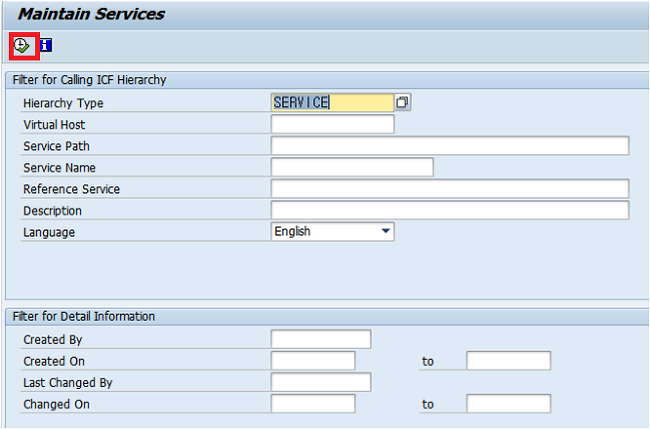
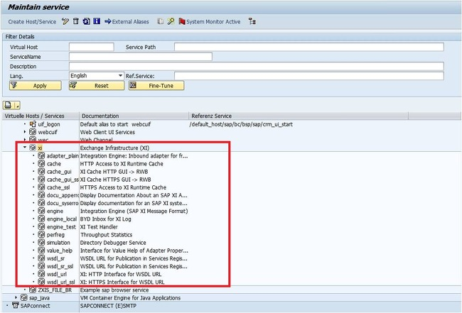

# FIORI CERTI 정리


# UX 100

****

****

# Unit 1.

****

## What are the main principles of SAP Fiori? 

## (Choose the correct answers).

### Role-based 

### Adaptive 

### Simple 

### Coherent 

### Delightful

****

:book: UX100 - Unit 1 

https://experience.sap.com/fiori-design-web/design-principles/

****


## Which <u>dimensions</u> define SAP Fiori? (Choose the correct answers). 

### Concept 

### Design 

Performance 

### Technology.

****

:book: UX100 - Unit 1 

****


## Which <u>platforms</u> support the integration of SAP Fiori? 

## (Choose the correct answers). 

### SAP Enterprise Portal 

### SAP Cloud Platform Portal 

### SAP Cloud Platform Mobile Services.

SAP Process Integration 

SAP HANA Enterprise Cloud 

****

:book: UX100 - Unit 1 

****


## Which <u>clients</u> can be used for SAP Fiori? 

## (Choose the correct answers). 

### Web Browser 

### SAP Fiori Client 

### SAP Business Client.

SAP Logon 

SAP Easy Access 

****

:book: UX100 - Unit 1 

****


## Which personalization element <u>refers to the application</u>? 

## (Choose the correct answer). 

Fiori Group 

Fiori Group Tile 

Fiori Catalog 

### Fiori Catalog Tile.

****

:book: UX100 - Unit 1 

****


## Which personalization elements can be <u>assigned to user roles</u>? 

## (Choose the correct answers). 

### Fiori Group 

Fiori Group Tile 

### Fiori Catalog 

Fiori Catalog Tile.

****

:book: UX100 - Unit 1 

****


## What is meant by the term data-driven navigation? (Choose the correct answer). 

### Data objects offer navigation links to dependent data objects and functions. 

???.

****

:book: UX100 - Unit 1 

(데이터 기반 탐색) 데이터 개체는 종속 데이터 개체 및 함수에 대한 탐색 링크를 제공한다.

****


# Unit 2.

****

## What is JavaScript Object Notation (JSON) 

## (Choose the correct answer). 

### JSON is a format definition to structure data transferred using web technologies 

???.

****

:book: UX100 - Unit 2 

JSON 은 웹 기술을 사용하여 전송되는 데이터를 구조화 하기 위한 format 정의 이다.

****


## Which apps are meant by the term legacy apps? 

## (Choose the correct answer). 

###  ABAP Transactions  /  Web Dynpro ABAP applications 

???.

****

:book: UX100 - Unit 2

https://www.munich-enterprise.com/en/sap-fiori)

****


## What is used as container for SAPUI5 apps in the <u>ABAP repository</u>? 

## (Choose the correct answer). 

### Business Server Pages (BSP) 

???.

****

:book: UX100 - Unit 2 

****


## Where are the <u>services for SAPUI5 apps organized</u>? 

## (Choose the correct answer). 

### Internet Communication Framework (ICF) 

???.

****

:book: UX100 - Unit 2 

virtual host 를 생성할 수 있으며 

참조되는 icf sercvice 에 semantic name 을 부여할 수 있다. 





****


## What is the central frame application of SAP Fiori? (Choose the correct answer). 

### SAP Fiori launchpad 

???.

****

:book: UX100 - Unit 2 

****


## Which OData option grants access to the service definition? 

## (Choose the correct answer). 

### $metadata 

???.

****

:book: UX100 - Unit 2 

****


## What are the app types of SAP Fiori? 

## (Choose the correct answers). 

### Transactional 

### Analytical 

Smart 

Principal 

### Fact Sheet.

****

:book: UX100 - Unit 2 

http://blog.sap-press.com/sap-fiori-apps-for-sap-s4hana-sd

****


## What does CRUD stand for? (Choose the correct answer). 

### Create, Read, Update, Delete 

???.

****

:book: UX100 - Unit 2 

******


# Unit 3.

****

## What is SAP S/4HANA? (Choose the correct answer). 

### The fourth generation of the SAP Business Suite based on SAP HANA renewing enterprise business 

???.

****

:book: UX100 - Unit 3 

****


## What is used in SAP S/4HANA to read data from the database? 

## (Choose the correct answer).

### ABAP Core Data Services (CDS) 

???.

****

:book: UX100 - Unit 3  

****


## Which system part provides the analytical data in SAP S/4HANA? 

## (Choose the correct answer). 

### SAP S/4HANA Embedded Analytics 

???.

****

:book: UX100 - Unit 3 

https://www.scirp.org/journal/paperinformation.aspx?paperid=77387

****


## Which data processing capabilities does SAP HANA combine? (Choose the correct answer). 

### Analytical / transactional 

???.

****

:book: UX100 - Unit 3 

****


## Which ABAP repository element contains the service logic? (Choose the correct answer). 

### Data Provider Class (DPC) 

???.

****

:book: UX100 - Unit 3 

https://boy0.tistory.com/159

model provider class(MPC) : service metadata 를 위환 코딩을 제공

gateway

****


## Which system holds the SAP Fiori launchpad? (Choose the correct answer). 

### Front-End Server (FES) 

???.

****

:book: UX100 - Unit 3 

****


## How is the implementation of Fiori apps delivered by SAP? (Choose the correct answer). 

### Updates of the back-end server 

???.

****

:book: UX100 - Unit 3 

****


## What is the data source definition for the SAP Fiori search? 

## (Choose the correct answer). 

### Search connectors 

???.

****

:book: UX100 - Unit 3 

https://help.sap.com/docs/SAP_FIORI_OVERVIEW/17ca92fbe8f54d9d8dfbe830cbb0c8d2/12af5252b10d5a64e10000000a423f68.html?version=4_S4H1909.01&locale=en-US

****


## Which system part provides the OData services for analytical apps? (Choose the correct answer). 

### SAP HANA e**<u>X</u>**tended application <u>S</u>ervices (XS) 

???.

****

:book: UX100 - Unit 3 

https://help.sap.com/docs/SAP_HANA_PLATFORM/52715f71adba4aaeb480d946c742d1f6/a6c0749255d84a81a154a7fc87dd33ce.html?version=2.0.03&locale=en-US

****


# Unit 4. 

****

## For intent-based navigation, what does an intent consist of? (Choose the correct answers). 

Target mapping 

### Semantic object 

### Action 

ICF path.

****

:book: UX100 - Unit 4 

https://help.sap.com/docs/SAP_HANA_PLATFORM/52715f71adba4aaeb480d946c742d1f6/5ff538515a2a455696f9c203939d9360.html?version=2.0.01&locale=en-US

****


## Which ABAP transactions can be used to analyze the intents used in target mappings? 

## (Choose the correct answers). 

/UI2/FSAC 

### /UI2/FLIA 

### /UI2/FLC 

/UI2/FLP

****

:book: UX100 - Unit 4 

FLIA : Fiori launchpad Intent Analysis

FLC : Fiori launchpad Check

****


## What is meant by the term legacy app descriptor? 

## (Choose the correct answer). 

### Assignment of tiles and target mappings     to transaction codes or Web Dynpro applications 

???.

****

:book: UX100 - Unit 4 

****


## Which layers of settings are available for SAP Fiori? 

## (Choose the correct answers). 

### Configuration 

### Personalization 

### Customizing 

Internationalization.

****

:book: UX100 - Unit 4 

****


## Which element groups Fiori apps based on <u>business topic</u>? 

## (Choose the correct answer). 

### Business Catalog Group (BCG) 

???.

****

:book: UX100 - Unit 4 

****


## Which element groups Fiori apps based on <u>business area</u>? 

business area 에 따라 피오리 앱을 그룹화하는 요소는 무엇입니까?

## (Choose the correct answer). 

### Technical Catalog (TC) 

???

****

:book: UX100 - Unit 4 

https://help.sap.com/docs/SAP%20Fiori%20launchpad/d4650bf68a9f4f67a1fda673f09926a9/af35d42e7d4f49d7b8e46080cd01c299.html?version=753.04&locale=en-US

**Technical Catalog** 

* 모든 앱의 저장소 역할
* application area 별 app 과 관련된 모든 대상 mapping 및 app launcher tile 이 포함된다. 
* Technical Catalog 는 사용자에게 직접 할당되지 않는다. 

**Business Catalog**

* Business roll 과 관련된 대상 매핑 과 app launcher tile 의 sample collection 이 포함되어있다.
* Business Catalog 의 content 들은 Technical Catalog content 의 하위 집합니다.
* 이 하위 집합은 특정 Business 사용자의 요구사항을 반영한다.  

Business catalogs contain a sample collection of target mappings and app launcher tiles relevant for a business role. The content of the business catalog is a subset of the content of the technical catalog. This subset reflects the requirements of a specific business user. 

****


## Which tool is used in an <u>S/4HANA</u> environment to model KPIs? (Choose the correct answer). 

### KPI Design 

???.

****

:book: UX100 - Unit 4 

https://www.sapbwconsulting.com/blog/5-kpi-design-best-practice-guidelines

검증필요

****


## Which tool is used in a <u>Suite on HANA</u> environment to model KPI? 

## (Choose the correct answer). 

### KPI Modeler 

???.

****

:book: UX100 - Unit 4 

https://help.sap.com/saphelp_ssb/helpdata/en/0d/7532521603f009e10000000a44166d/frameset.htm

****


## What does a KPI consist of? (Choose the correct answers). 

### Evaluation 

Authentication 

### Drill-down 

### Tile 

Indicator.

****

:book: UX100 - Unit 4

1. Create KPI 

2. Create **Evaluation** 
3. Create **Tile** 
4. Configure **Drill-Down** 
5. Manage KPI Associations (optional)

****


## Which tool provides the definition of Fiori tiles? (Choose the correct answer). 

### SAP Fiori launchpad designer 

???.


****

:book: UX100 - Unit 4 

****


## What can be used as target in a target mapping? (Choose the correct answers).

### Web Dynpro application 

### Generic URL 

### ABAP Transaction 

### SAPUI5 application.

****

:book: UX100 - Unit 4 

****


# Unit 5.

****

## Which system environments offer the UI theme designer? 

## (Choose the correct answers). 

### SAP Enterprise Portal 

### SAP NetWeaver Application Server ABAP 

### SAP Cloud Platform 

SAP NetWeaver Application Server Java 

SAP Business Intelligence.

****

:book: UX100 - Unit 5  

****


## Which terms are correct when talking about extensibility for SAP applications in a frontend server? (Choose the correct answers). 

SAP Gateway Redefinition 

CDS View Extension 

### SAPUI5 Extension 

ABAP Enhancement 

### SAP Fiori Elements Adaptation.

****

:book: UX100 - Unit 5 

****


## Where are the themes saved for the Fiori launchpad? 

## (Choose the correct answer).

### Theme repository in front-end server 

???.

****

:book: UX100 - Unit 5 

https://blogs.sap.com/2017/01/24/customizing-sap-fiori-launchpad-using-the-ui-theme-designer/

The UI theme repository on the ABAP frontend server contains SAP standard themes and custom themes. 

****


## Which design template is used for SAP Fiori 2.0? 

## (Choose the correct answer). 

### SAP Belize 

???.

****

:book: UX100 - Unit 5 

https://help.sap.com/docs/SAP_S4HANA_ON-PREMISE/8ec2dae34eb44cbbb560be3f9f1592fe/977672c6940f48578d08d770bee236f2.html?version=1709%20000&locale=en-US

* **SAP Belize**

  SAP Fiori 2.0

* **SAP Blue Crystal**

  SAP Fiori 1.0

* **SAP High Contrsat Black**

  접근성 목적으로 공개된 테마

  SAP Fiori 2.0 에서 적용되지 않는다.

* **SAP Gold Reflection**

  non-Fiori 독립 실행형 앱 용으로 공개된 테마

  SAP Fiori 1.0, 2.0 에서 적용되지 않는다.

****


## How do you enter the UI adaptation mode of SAP Fiori apps? 

## (Choose the correct answer). 

**Start app→ Me Area→ Adapt UI** 

???.

****

:book: UX100 - Unit 5 

https://blogs.sap.com/2018/05/12/fiori-for-s4hana-adapting-terminology-in-sap-fiori-apps-via-key-user-tools/

****


## How can you enable adaptation at runtime for SAP Fiori apps? (Choose the correct answers). 

### Target mapping to runtime authoring plugin 

Fiori catalog SAP_CA_BC_SSB 

### User role SAP_UI_FLEX_KEY_USER 

### Fiori catalog /UIF/SAP_RTA_PLUGIN 

User role SAP_S_RFCACL.

****

:book: UX100 - Unit 5 

https://help.sap.com/docs/UI_ADD-ON_FOR_SAP_NETWEAVER_20/17ae0e97e0fc424a9c368f350c0ba6bd/402b392585834dd38dd381d8f04b2616.html

****


## What is SAP Screen Personas? 

## (Choose the correct answer). 

### A web-based layer for personalization of SAP GUI Dynpro and Web Dynpro ABAP 

???.

****

:book: UX100 - Unit 5 

SAP GUI 환경의 불편함(처음 사용자가 적응하기 힘들다. 사용하지 않는 항목이 노출되어 업무에 집중하기 힘들다 등등)을 해소하기 위해서 각 업무 환경에 맞게 화면을 단순화하거나 재배치할 수 있는 기능을 제공하는 것이 SAP Screen Personas 입니다.

https://www.avelon.be/news-blog/sap-screen-personas-versus-fiori

****


## What is created with SAP Screen Personas to change the structure of classical screens? 

## (Choose the correct answer). 

### Flavors 

???.

****

:book: UX100 - Unit 5 

https://www.avelon.be/news-blog/sap-screen-personas-versus-fiori

****


## Which UI clients does SAP Screen Personas support? (Choose the correct answers). 

### SAP Business Client 

SAP Fiori Client 

### SAP GUI for Windows 

### SAP GUI for HTML 

SAP GUI for Java.

****

:book: UX100 - Unit 5 

****


# Unit 6. 

****

## What can be used as <u>middleware</u> to improve SAP Fiori for mobile? 

## (Choose the correct answer). 

sap Afaria

SAP Unwired Platform (SUP) 

### SAP Mobile Platform (SMP)

### SAP Cloud Platform Mobile Services.

****

:book: UX100 - Unit 6 

https://blogs.sap.com/2019/02/01/migration-to-sap-cloud-platform-mobile-services/

SAP Cloud Platform Mobile Services 가 SAP Mobile Platform 의 개선된 후속 모델 정도로 이해하면 될것 같다.

책 ux100 에는 smp 도 답으로 나와있다.

****


## Which benefits are offered by the SAP Fiori Client alone over a Web browser? (Choose the correct answers). 

### Full screen 

Offline data 

### Delta caching 

Push notifications 

### Attachment viewer.

****

:book: UX100 - Unit 6 

****


## What are the SAP Fiori for iOS design guidelines based on? (Choose the correct answer). 

### Apple Human Interface Guidelines (HIG) 

???.

****

:book: UX100 - Unit 6

****


## What is SAP Cloud Platform SDK Assistant? (Choose the correct answer). 

### Plugin for Apple Xcode to create ready-to-run Xcode projects for SAP Fiori 

???.

****

:book: UX100 - Unit 6 

****


## Which native capabilities of a mobile device can only be leveraged when using SAP Fiori for iOS? 

## (Choose the correct answers). 

### Touch ID 

Camera 

### Facetime 

### iBeacon 

Geolocation.

****

:book: UX100 - Unit 6 

검증필요

facetime / touch id / iBeacon 는 확인 된바 있다.

책에는

* facetime
* touch id 
* iBeacon
* Maps
* Notification
* Calendar
* Contacts

****


# Unit 7. 

****

## What is used as a container for SAP Fiori in an <u>Enterprise Portal</u>? 

## (Choose the correct answer). 

### Fiori iView 

???.

****

:book: UX100 - Unit 7 

검증필요

****


## What establishes a secure connection between on-premise systems and SAP CP? 

## (Choose the correct answer). 

### Cloud Connector 

???.

****

:book: UX100 - Unit 7 

****


## What is the central app to display Workflow items in SAP Fiori? 

## (Choose the correct answer). 

### My Inbox

???.

****

:book: UX100 - Unit 7 

****


## Which shell configurations are available to adapt the header of the app? 

## (Choose the correct answers). 

encapsulated 

### embedded 

### standalone 

### headerless 

footless.

****

:book: UX100 - Unit 7 

https://help.sap.com/docs/SAP_S4HANA_ON-PREMISE/a7b390faab1140c087b8926571e942b7/537758e0deb0477386ea400c915073b3.html


| Parameter Value (State) | Description                                                  | Relevant to                    |
| ----------------------- | ------------------------------------------------------------ | ------------------------------ |
| standalone              | Displays only the  *(Me Area launcher)* button or the user photo/avatar,  *(Back)* button, company logo, and the application title.The  button or the user photo/avatar opens an options menu that contains only the following default application-specific menu items: **Contact Support**, **Give Feedback**, and **About**.It also shows custom application-specific menu items they have been developed for the app.**Note**This specific *standalone state* should not be confused with the broader concept of running apps in the *standalone mode*. This setting simply defines one of the possible states of the header bar for any standalone app. | Applications only              |
| embedded                | Same as standalone, except it displays the  *(Home)* button instead of the company logo. | Applications only              |
| merged                  | Displays only the application's title, and the  *(Back)* and  *(Home)* buttons. The launchpad shell header items, such as the  *(Me Area launcher)* button or the user photo/avatar, company logo, search bar, and  *(Notifications)* button, are not shown.When navigating to the launchpad, it is not possible to personalize the home page. This means that the user cannot move or remove tiles. | Applications and the launchpad |
| headerless              | Does not display the launchpad shell header bar or the application title. When navigating to the launchpad, it is not possible to personalize the home page. This means that the user cannot move or remove tiles. | Applications and the launchpad |


****


## What is SAP Cloud Platform (CP)? (Choose the correct answer). 

###  SAP's platform-as-a-service (PaaS) providing in-memory database and application services 

???.

****

:book: UX100 - Unit 7

****


## In which system is the SAP Gateway workflow service implemented? (Choose the correct answer). 

### Front-End Server (FES) 

???.

****

:book: UX100 - Unit 7 

https://help.sap.com/docs/SAP_FIORI_OVERVIEW/1f0c69c2f76b445c98b89cc1f41d7ae4/6cb9b4c90de345ca9a6182049ee6f8da.html?locale=en-US

****


## Which service is responsible for OData services in the SAP CP? (Choose the correct answer). 

### SAP CP OData provisioning 

???.

****

:book: UX100 - Unit 7 

https://www.acorel.nl/2017/09/odata-provisioning-in-sap-cloud-platform-integration/

****


****


# UX399 _ 67

*****

****


# Unit 1.

****

## Which of these is abbreviated to CSS? (Choose the correct answer). 

Complex Style Syntax 

### Cascading Style Sheet 

Cascading Syntax System.

****

:book: UX399 - Unit 1 

****


## What is true for HTML and UI5? (Choose the correct answers). 

### Dynamic web content 

### Client side rendering 

Code on demand 

Static web pages.

****

:book: UX399 - Unit 1 

검증필요

****


## What is an HTML-Tag? (Choose the correct answer). 

### A HTML-Tag is a processing instruction for the web browser.

 A HTML-Tag marks an aspect of the web page 

A HTML-Tag Is a pre-processor instruction for the browser

****

:book: UX399 - Unit 1 

****


## What is the DOCTYPE? (Choose the correct answer). 

### A The <!DOCTYPE> declaration is not an HTML tag; it is an instruction to the web browser on what version of HTML to use. 

The <!DOCTYPE> Is a pre-processing instruction for the JavaScript-Engine. 

The <!DOCTYPE> Is used to define the mime-type.

****

:book: UX399 - Unit 1 

****


## Which of the following are known as BOM Objects? 

## (Choose the correct answers). 

Document 

### Window 

### History 

### Location.

****

:book: UX399 - Unit 1 

https://www.javascripttutorial.net/javascript-bom/

https://pridiot.tistory.com/170

**BOM** (**B**rowser **O**bject **M**odel)

웹 브라우저 전체를 객체로 관리하는 것으로 자바스크립트 프로그램을 통해 브라우저 창을 관리할 수 있도록 브라우저 요소를 객체화 해 놓은 것이다.

* **내장 객체**

  * ***Window :*** 

    브라우저 창이 열릴 때마다 하나 씩 만들어지는 객체

    브라우저 창 안에 존재하는 모든 요소의 최상위 객체

  * ***Document :*** 

    웹 문서에서 \<body> 태그를 만나면 만들어지는 객체

    HTML 문서 정보를 가지고 있다.

  * ***History :*** 

    현재 창에서 사용자 방문 기록을 저장하고 있는 객체

  * ***Location :***

    현재 페이지에 대한 URL 정보를 가지고 있는 객체

  * ***Navigator :***

    현재 사용 중인 웹브라우저 정보를 가지고 있는 객체

  * ***Screen :***

    현재 사용중인 화면 정보를 다루는 객체

****


## What is the name of the consortium that standardised the DOM? (Choose the correct answer). 

WWF 

### W3C 

WC3.

****

:book: UX399 - Unit 1 

https://ko.wikipedia.org/wiki/W3C

****


## What is the name of the SAP Development tool? (Choose the correct answer). 

### SAP Web IDE  => BAS

SAP Cloud IDE 

SAP Web Cloud IDE.

****

:book: UX399 - Unit 1 

****


## What parts of the software development life-cycle are supported by the SAP development tool? (Choose the correct answer). 

Only implementation functionality such as syntax highlighting and editing are supported. 

Test, code and debug are supported 

### The full life-cycle of software development is supported.

****

:book: UX399 - Unit 1 

검증필요

****


## What URL do you enter when you want to see the source code of a web page? 

## (Choose the correct answer). 

### view-source:https://www.google.com 

view-code:https://www.google.com 

show-source: https://www.google.com.

****

:book: UX399 - Unit 1

https://m.blog.naver.com/PostView.naver?isHttpsRedirect=true&blogId=leosaint&logNo=120011242924

****


## What is the keyboard shortcut in most browsers to open the browser development tools? (Choose the correct answer). 

F1 

### F12 

D+E+V.

****

:book: UX399 - Unit 1 

****


## What is a code validator? (Choose the correct answer). 

### A code validator is a software program that checks the code against coding rules and standards. 

A code validator is a code generator tool that generates valid code. 

A code validator is a type of extension to the browser.

****

:book: UX399 - Unit 1 

****


## How many heading elements are specified in the HTML specification? 

## (Choose the correct answer). 

4 

3 

### 6 

1.

****

:book: UX399 - Unit 1 

****


## Which of the following is true? 

## (Choose the correct answer).

A `<p>` tag has high semantic expressiveness. 

### The `<a>` tag is used to specify HTML Links. 

The `<li>` element can only be used inside of an `<ol>` element.

****

 :book: UX399 - Unit 1 

****


## What markup should be used to describe a long text in an html document? 

## (Choose the correct answer). 

### \<article>

`<p>` 

`<div>`

****

:book: UX399 - Unit 1 

****


## For what purpose should you use the header element? (Choose the correct answer). 

### For introductory content 

For headings 

As a container for the article element.

****

:book: UX399 - Unit 1 

****


## What is the purpose of the action attribute in the form element? (Choose the correct answer). 

### The action attribute contains the reference to the program that processes the submitted form. 

The action attribute defines the allowed HTTP verbs. 

The action attribute contains the JavaScript event handler that is invoked when the user submits the form.

****

:book: UX399 - Unit 1 

****


## Which of the following is true? 

## (Choose the correct answer). 

You can use the focus attribute on multiple form fields. 

The focus attribute can only used at one form field. 

### Only the first form field with the focus attribute will get the focus.

****

:book: UX399 - Unit 1 

커서가 올라가있는 필드 지정하는 focus 기능을 말하는듯 하다.

****


## What value do you assign to the auto-complete attribute so the browser knows not to attempt to fill the form fields? (Choose the correct answer). 

### off 

false 

no.

****

:book: UX399 - Unit 1 

https://www.w3schools.com/tags/att_autocomplete.asp

****


## What attribute can you use to inform the end-user of what kind of data he should enter in a form field? 

textsuggestion 

### placeholder 

textphrase

****

:book: UX399 - Unit 1 

****


## What is the prefix to introduce a custom attribute? (Choose the correct answer). 

custData 

### data 

sapdata.

****

:book: UX399 - Unit 1 

https://developer.mozilla.org/ko/docs/Learn/HTML/Howto/Use_data_attributes

****


## What is the name of the attribute to access the custom attributes in your JavaScript code? 

## (Choose the correct answer). 

### dataset 

attributeset 

customDatas.

****

:book: UX399 - Unit 1 

검증필요

****


# Unit 2.

****

## What is the correct prefix for the ID selector? (Choose the correct answer). 

### # 

. 

~

****

:book: UX399 - Unit 2 

****


## What is the order of processing CSS instructions?

## (Choose the correct answer). 

### Importance, Specificity, Source order 

Specificity, Source order, Importance 

Source-order, Importance, Specificity.

****

:book: UX399 - Unit 2 

검증필요

****


## What is a pseudo-class or pseudo-element? (Choose the correct answer). 

### A CSS technique to permit formatting based on information that lies outside the DOM tree 

A CSS technique to prohibit formatting based on information that lies outside the DOM tree 

A CSS technique to introduce pseudo-style-attributes.

****

:book: UX399 - Unit 2 

****


## What of the following is true? 

## (Choose the correct answers). 

### The :last-child selector matches every element that is the last child of its parent. 

### The :nth-last-child(n) selector matches every element that is the nth child, regardless of parent type, counting from the last child 

The :last-child(n) selector matches every element that is the nth child, regardless of parent type, counting from the last child.

****

:book: UX399 - Unit 2 

****


# Unit 3.

****

## What is the recent version of JavaScript? 

## (Choose the correct answer). 

ECMA Script 5 

### ECMA Script 6 

ECMA Script 3.

****

****

:book: UX399 - Unit 3 

****


## What is the purpose of the defer attribute? (Choose the correct answer). 

### When present, it specifies that the script is executed when the page has finished parsing. 

When present, it specifies that the script should be executed immediately. 

When present, it specifies that the JavaScript engine should execute the script in a very strictly.

****

:book: UX399 - Unit 3 

http://www.tcpschool.com/html-tag-attrs/script-defer

****


## What is true for a variable that holds the value undefined? (Choose the correct answer). 

It represents the intentional absence of an object value. 

it is a keyword. 

### It expresses that a variable is not yet initialized. 

It functions without a return value, and returns undefined.

****

:book: UX399 - Unit 3 

****


## What JavaScript function can be used to separate strings? (Choose the correct answer). 

### split 

slice 

separate.

****

:book: UX399 - Unit 3 

****


## What method do you use since ECMA 5 to define a read only property? 

## (Choose the correct answer). 

### defineProperty 

setReadOnly 

defineReadOnly.

****

:book: UX399 - Unit 3 

https://opentutorials.org/course/787/5111

****


## JavaScript functions are so called first-class objects. What characteristics do functions have? (Choose the correct answers). 

### A function is an instance of the object type. 

### A function can have properties and has a link back to its constructor method. 

### A function can be stored in a variable. 

### A function can pass as a parameter to another function. 

### A function can return from a function.

****

:book: UX399 - Unit 3 

검증필요

****


## What does the == operator check? (Choose the correct answer). 

Equal value and equal type 

### Equal value 

Equals type.

****

UX399 - Unit 3 

****


## What is the result of the following 2+3+"3"+23+3+"seven"+12? 

## (Choose the correct answer). 

### 53233seven12 

53326seven12 

23326seven12

****

:book: UX399 - Unit 3 

****


## Is the following true? The if-condition can be either a boolean variable or can also check if objects are defined and have a correct value (Choose the correct answer). 

No 

### Yes 

It depends on the JavaScript version.

****

:book: UX399 - Unit 3 

****


## What is the purpose of the method hasOwnProperty? (Choose the correct answer). 

### It checks if the property is defined on the current object 

It checks whether the object has properties. 

It checks if the objects have their own and inherited properties.

****

:book: UX399 - Unit 3 

****


## What is the difference between scope and execution context? 

## (Choose the correct answer). 

### Scope is function based while execution context is object based. 

Scope context is object based while context is function based. 

It depends on the invocation target whether a function has a scope or a context.

****

:book: UX399 - Unit 3 

https://velog.io/@jhy979/Execution-Context-Scope

****


## Which of the following is true? (Choose the correct answer). 

The this reference in JavaScript is comparable to the this reference of other programming languages. 

### A this in JavaScript points to the execution context of the function where the this keyword is used. 

A this in JavaScript is like a property of the function.

****

:book: UX399 - Unit 3 

****


## What is the visibility of a variable that is defined inside a function? 

## (Choose the correct answer). 

### It is only visible inside the function. 

It is only visible inside the statement where the variable is defined 

As a variable in JavaScript it is always globally visible.

****

:book: UX399 - Unit 3 

****


## What does “closed-over” mean in the context of closures? (Choose the correct answer). 

### When an inner function makes reference to a variable in the outer function’s lexical scope, the inner function is said to have “closed over” that variable. 

???.

****

:book: UX399 - Unit 3 

****


## What operator do you use to inform the runtime that an error occurred? (Choose the correct answer). 

### throw 

throws 

toss.

****

:book: UX399 - Unit 3 

****


## When do you throw an error? (Choose the correct answer). 

It is a good practice to throw errors in every function. 

### Helpful when designing libraries to inform a higher layer that a problem occurred. 

To make the debugging of the code easier.

****

:book: UX399 - Unit 3 

*****


## What are the three keyword when it comes to error handling? (Choose the correct answer). 

### try, catch, finally 

throws, catch, attheend 

try, finally, handle.

****

:book: UX399 - Unit 3 

https://blog.naver.com/PostView.nhn?isHttpsRedirect=true&blogId=highkrs&logNo=220238284097&beginTime=0&jumpingVid=&from=section&redirect=Log&widgetTypeCall=true

****


## Describe what design decision is normally made when you have to deal with errors? (Choose the correct answer). 

### Lower, technical layers throw errors. Higher, application layers handle errors. 

???.

****

:book: UX399 - Unit 3 

****


## What method is introduced with HTML5 to have a more powerful selection mechanism? 

## (Choose the correct answer). 

processSelector

getElements

### querySelector

****

:book: UX399 - Unit 3

****


## What does the childNode property return? 

## (Choose the correct answer). 

### The childNode property returns a live collection of child nodes of the given element. 

Returns the node immediately following the specified one in the parent childNode list 

Returns the list of childNodes of the document.

****

:book: UX399 - Unit 3 

****


## What does the createAttribute method return? 

## (Choose the correct answer). 

### An object of the type Attr 

An object of the type Attribute 

The method returns void.

****

:book: UX399 - Unit 3 

http://www.w3big.com/ko/jsref/met-document-createattribute.html

****


## What does the method document.createElement(“article”) do? 

## (Choose the correct answer). 

### It creates an element of the type HTMLUnknownElement. 

It creates an element of the type article 

It throws an error. 

****

:book: UX399 - Unit 3 

테스트 결과 article 생성되는데 왜 답이 저거인지 모르겠다.

검증필요

****


## What is the recommended DOM level you should use? (Choose the correct answer). 

### 2 

1 

3.

****

:book: UX399 - Unit 3 

****


## Describe what is meant by event bubbling. (Choose the correct answer). 

### The concept of event bubbling was introduced to deal with situations where a single event, such as a mouse click, may be handled by two or more event handlers defined at different levels of the Document Object Model (DOM) hierarchy. 

???.

****

:book: UX399 - Unit 3 

https://ko.javascript.info/bubbling-and-capturing

****


## What is meant by the namespace in the context of JavaScript? (Choose the correct answer). 

It is the name of a function. 

It is where you change the visibility of a variable. 

### It is a container to bundle functionality under a unique identifier.

****

:book: UX399 - Unit 3 

****


## What mode do you have to use when you want to use the new ECMA6 language features? 

## (Choose the correct answer). 

### strict mode 

base mode 

standard mode.

****

:book: UX399 - Unit 3

검증필요

****


## What is true for the prototype? 

## (Choose the correct answers). 

### Every function has a prototype 

### Each object can act as a prototype 

### Any change on the prototype object is immediately visible to all referencing objects.

****

:book: UX399 - Unit 3 

****


## What is AJAX? 

## (Choose the correct answer). 

### Asynchronous JavaScript and XML 

Another JavaScript XML Library 

Asynchronous Java XML.

****

:book: UX399 - Unit 3 

****


## What JavaScript object do you use when you send a request to a back-end service? (Choose the correct answer). 

### XMLHttpRequest 

XMLHttp 

XMLHttpPoll

****

:book: UX399 - Unit 3 

https://developer.mozilla.org/ko/docs/Web/API/XMLHttpRequest

****


## What problem is solved when using promises? (Choose the correct answer). 

### A Pyramid of doom 

Nested callbacks 

Synchronous back-end request processing.

****

:book: UX399 - Unit 3 

https://5-ssssseung.tistory.com/96

****


## What are the three states of a promise? 

## (Choose the correct answer). 

### Pending, Fulfilled, Rejected 

Waiting, Finished, Started 

Pending, Finished, Aborted

****

:book: UX399 - Unit 3 

**JavaScript - Three states of Promise** 

* **pending**

  초기 상태, 완료 또는 실행되지 않은 상태

* **fulfilled**

  작업이 성공적으로 완료 된 상태

* **rejected**

  작업이 실패한 상태


* **settled**

****


# Unit 4.

****

## Is it possible to read CSS properties with the CSS method? 

## (Choose the correct answer). 

### True 

False.

****

:book: UX399 - Unit 4 

****


## What is the counterpart function of focus? (Choose the correct answer). 

### blur 

lostFocus 

noFocus.

****

:book: UX399 - Unit 4 

****


## When do you use the toggleClass method? (Choose the correct answer). 

Use the method to react to on-click events 

Use the method for handleMouse events. 

### Use the method when adding and removing a class where an specific event occurs or reoccurs.

****

:book: UX399 - Unit 4 

****


## What is true for the functions after and insertAfter? 

## (Choose the correct answers).

### The way the elements are selected is different 

There is no difference in the result. 

The insertAfter function performs better than the after function.

****

:book: UX399 - Unit 4 

검증필요

답에는 둘 의 결과가 차이가 없다고 나와있다 

A.after(B) – A 뒤에 B를 추가 
A.insertAfter(B) – B 뒤에 A를 추가

****


## What is jQuery? (Choose the correct answer). 

CSS Framework 

### A free, lightweight and extendable JavaScript library 

A set of HTML controls.

****

:book: UX399 - Unit 4 

****


## What version of jQuery first provided the AJAX method? 

## (Choose the correct answer). 

Version 1.4 

### Version 1.5 

Version 1.0.

****

:book: UX399 - Unit 4 

검증필요

****


## When do you use the load method? 

## (Choose the correct answer). 

### You want to load the response of the given URL into an object 

You want to load the jQuery library 

You want to load an xml file asynchronously.

****

:book: UX399 - Unit 4 

https://offbyone.tistory.com/235

****


## What features are contained in jQuery? 

## (Choose the correct answers). 

### HTML, DOM, CSS manipulation 

UI5 event 

### Effects and animations 

### AJAX.

****

:book: UX399 - Unit 4 

https://micropyramid.com/blog/jquery-features-overview-and-its-future/

검증필요

UI5 event 를 포함하지 않는지 확인 필요

****


## What jQuery method can be used to wrap every element of the current collection to provide an HTML structure? (Choose the correct answer). 

### wrap 

wrapAll 

envelope.

****

:book: UX399 - Unit 4 

https://www.codingfactory.net/10214

****


## When using the on-function of jQuery, how many event handlers can be attached ? (Choose the correct answer). 

### multiple 

one 

None.

****

:book: UX399 - Unit 4 

https://api.jquery.com/on/

****


## What does $("p.intro") select? (Choose the correct answer). 

### Selects all \<p>-elements with class="intro 

Selects a \<p>-element with the innerHTML intro 

Selects a \<p.intro>-elementl.

****

:book: UX399 - Unit 4 

https://secr.tistory.com/61

****


## What is the corresponding CSS selector of $('#some-id')? 

## (Choose the correct answer). 

### #some-id { } 

some-id{ } 

*some-id{ }.

****

:book: UX399 - Unit 4 

검증필요

****


****


# UX400 _ 43

****

****


# Unit 1.

****

## Which of the following SAP Key UI technologies are currently recommended by SAP? 

## (Choose the correct answers).

Web Dynpro Java 

### Web Dynpro ABAP with Screen Personas 

### Dynpro with Screen Personas 

Java Dynpro 

### SAPUI5.

****

:book: UX400 - Unit 1 

****


## Which of the following statements are true when talking about SAP Fiori? (Choose the correct answers). 

### SAP Fiori is SAP’s user experience that applies modern user-centric design principals 

SAP Fiori is SAP’s product for implementing SAP Enterprise Portal components 

SAP Fiori is SAP’s UI technology for implementing application for mobile devices 

### SAP Fiori is SAP Fiori can be personalized, is simple, and runs on any device 

### SAP Fiori is SAP Fiori provides a consistent and role-specific experience across all tasks, for all lines of business.

****

:book: UX400 - Unit 1 

****


## What is the vision of SAP when considering SAP’s UX direction? (Choose the correct answer). 

Deliver attractive applications that make people successful at work 

### Provide the leading user experience for business applications 

Provide UX as service to gain productivity 

Deliver SAP modules in an SaaS manner.

****

:book: UX400 - Unit 1 

****


# Unit 2.

****

## What is the key concept of SAPUI5 that enables the separation of information representation from user interaction? (Choose the correct answer). 

### Model View Controller 

Drag-and-drop 

Slideshow 

A forgiving format.

****

:book: UX400 - Unit 2 

****


## Which of the following statements are true for OpenUI5? 

## (Choose the correct answers). 

### OpenUI5 includes all of the main features of SAPUI5. 

OpenUI5 contains sap.viz and sap.ui.com. 

### OpenUI5 is free for use. 

OpenUI5 implements its own Core-Component 

### OpenUI5 encompasses the complete SAPUI5 Core, plus many front-end controls that are also included in SAPUI5.

****

:book: UX400 - Unit 2 

****


## Which of the following are key features of SAPUI5? (Choose the correct answers). 

### Full translation support 

Web Dynpro extensibility 

### Responsive across browsers and devices 

Less open for custom developmen 

### Based on open standards such as, JavaScript, CSS3, and HTML5.

****

:book: UX400 - Unit 2 

****


# Unit 3.

****

## Which of the following parameters must you provide when you create an initial SAP Cloud Connector configuration? (Choose the correct answers). 

### Region Host 

Display Name 

### Sub-account Name 

### Password 

Location ID 

### Sub-account User.

****

:book: UX400 - Unit 3 

https://blogs.sap.com/2021/09/05/installation-and-configuration-of-sap-cloud-connector/

****


## What tool is used to connect the SAP Cloud Platform to an on-premise system? (Choose the correct answer). 

SAP Destination Connector 

### SAP Cloud Connector

SAP Connector App 

SAP Cloud Manager.

****

:book: UX400 - Unit 3

on-premise 시스템에서 reverce-invoke process 를 통해 connectivity 생성

SAP HANA Cloud 와 on-premise 시스템 사이에서 SSL tunnel  보장

역방향 호출은 보안 네트워크(인트라넷)에서 네트워크 연결을 설정할 수 있도록 하는 기술입니다. 외부 연결이 방화벽을 통해 네트워크로 들어갈 수 없기 때문에 네트워크 보안이 향상됩니다. 비무장 지대(DMZ)의 호스트와 인트라넷의 호스트(방화벽 뒤) 사이에 연결을 설정하려는 경우 DMZ의 호스트는 연결을 열 수 없습니다.

****


## Which of the following statements are true with respect to the SAP Web IDE? (Choose the correct answers). 

### A browser-based integrated development environment 

Available only in the SAP Cloud Platform 

Integrated in the SAP GUI

### Supports the End-to-End (E2E) application lifecycle 

### Provides WYSIWYG tooling.

****

:book: UX400 - Unit 3 

https://blogs.sap.com/2015/06/22/sap-web-ide-layout-editor-wysiwyg-or-dragdrop-available-for-productive-use/

****


# Unit 4. 

****

## What is the initial starting phase of SAPUI5 called? 

## (Choose the correct answer). 

### Bootstrapping 

AutoStart 

ConfigurationLoad 

Startup-phase.

****

:book: UX400 - Unit 4 

SAP UI5 의 초기 시작 단계를 "부트스트랩" 이라고 한다. 부트 스트랩 단계에서는 SAP UI5 어플리케이션 실행에 필요한 모든 런타임 아티펙트가 인스턴스화 되고 구성된다.

https://help.sap.com/saphelp_snc700_ehp04/helpdata/en/a0/4b0d10fb494d1cb722b9e341b584ba/frameset.htm

You can use the SAPUI5 bootstrap script in your page to initialize SAPUI5 runtime automatically as soon as the script is loaded and executed by the browser. For simple use cases as well as the default SAPUI5 installation, this is sufficient to build and run UIs. In addition to this, you can specify the set of SAPUI5 libraries and the theme used for your application in the configuration settings.

***<u>index.html</u>***

```html
<!DOCTYPE html>
<html>
	<head>
		<meta charset="utf-8">
		<title>SAPUI5 Walkthrough</title>
		<script
			id="sap-ui-bootstrap"
			src="/resources/sap-ui-core.js"
			data-sap-ui-theme="sap_belize"
			data-sap-ui-libs="sap.m"
			data-sap-ui-compatVersion="edge"
               data-sap-ui-async="true"
               data-sap-ui-onInit="module:my/app/main"
               data-sap-ui-resourceRoots='{"my.app": "./"}'
 			></script>
	</head>
	<body class="sapUiBody" id="content">
	</body>
</html>
```

****


## What is the name of the event that is fired after a successful SAPUI5 initialization? (Choose the correct answer). 

### init 

startUpDone 

loadDone 

bootDone.

****

:book: UX400 - Unit 4 

****


## What is the prefix of the HTML custom attributes of SAPUI5? 

## (Choose the correct answer). 

data-sap-ui5 

### data-sap-ui 

data-sap-uiconfig 

data-sap-config-ui.

****

:book: UX400 - Unit 4 

```html
<!DOCTYPE html>
<html>
	<head>
		<meta charset="utf-8">
		<title>SAPUI5 Walkthrough</title>
		<script
			id="sap-ui-bootstrap"
			src="/resources/sap-ui-core.js"
			data-sap-ui-theme="sap_belize"
			data-sap-ui-libs="sap.m"
			data-sap-ui-compatVersion="edge"
               data-sap-ui-async="true"
               data-sap-ui-onInit="module:my/app/main"
               data-sap-ui-resourceRoots='{"my.app": "./"}'
 			></script>
	</head>
	<body class="sapUiBody" id="content">
	</body>
</html>
```

****


# Unit 5.

****

## Which of the following features can be used to describe a module? 

## (Choose the correct answers). 

### Name 

Association 

### Definition 

Scope 

### Dependencies.

****

:book: UX400 - Unit 5 

https://stackoverflow.com/questions/48956829/how-to-load-dependencies-relative-to-defining-module

****


## Which JavaScript function is called to define a module?

## (Choose the correct answer). 

jQuery.sap.require 

jQuery.sap.define 

### sap.ui.define 

sap.ui.declare.

****

:book: UX400 - Unit 5 

```js
sap.ui.define (sModuleName, aDependencies, vFactory, bExport) {
    
}
```

* **{ string } sModuleName**

  약식 리소스 이름 구문에서 모듈의 이름이다.

  생략할 경우 로더가 요청에서 이름을 결정한다.

* **{ string[ ] } aDependencies**

  모듈 종속성 리스트이다.

  ```js
  ["sap/m/MessageBox", "sap/ui/core/format/DateFormat"]
  ```

* **{ function | any } vFactory**

  듈 값 또는 값을 계산하는 함수

* **{ boolean } bExport**

  전역 이름으로 엑스포트해야 하는지 여부

****


## Which JavaScript function is used to load a module asynchronously? (Choose the correct answer). 

jQuery.sap.require 

### sap.ui.require 

sap.ui.define 

sap.ui.loadModule.

****

:book: UX400 - Unit 5 

****


# Unit 6.

****


## What view type does SAP recommend? 

## (Choose the correct answer). 

 JSON

### XML 

HTML 

JavaScript.

****

:book: UX400 - Unit 6 

****


## Which of the following lifecycle hook methods can be implemented by the developer in a view controller? (Choose the correct answers). 

### onInit 

onRender 

### onAfterRendering 

### onExit 

### onBeforeRendering.

****

:book: UX400 - Unit 6 

https://blogs.sap.com/2018/11/12/sapui5-controller-lifecycle-methods-explained/

### onInit  

### onExit 

### onAfterRendering

뷰가 렌더링 되면 호출

### onBeforeRendering.

onAfterRendering 과 비슷하지만 onInit() 이 사용되기 전이 아니라 컨트롤러의 뷰가 다시 렌더링 되기 전에 호출 된다.

****


## Which class is normally used as the base class when implementing a SAPUI5 view controller? (Choose the correct answer). 

### sap.ui.core.mvc.Controller 

sap.ui.view.Controller 

sap.m.Controller 

sap.ui.layout.Controller.

****

:book: UX400 - Unit 6 

****


## Which function is provided to register a URL prefix for a module name prefix? (Choose the correct answer). 

jQuery.sap.mapModulePath() 

### jQuery.sap.registerModulePath() 

sap.ui.registerModulePath() 

jQuery.sap.declareModulePath().

****

:book: UX400 - Unit 6 

https://sapui5.hana.ondemand.com/sdk/#/api/jQuery.sap%23methods/jQuery.sap.registerModulePath

URL 접두부를 모듈 이름 접두부에 등록하는 목적으로 프레임 워크에서 제공된다.

****


# Unit 7.

****

## Which layout control can help you group UI controls? (Choose the correct answer). 

### sap.ui.layout.Panel 

sap.m.Panel 

sap.ui.layout.Group 

sap.m.GridGroup.

****

:book: UX400 - Unit 7 

https://experience.sap.com/fiori-design-web/panel/

****


## What is the preferred way, when you have the requirement, to hide certain UI controls on a specific form factor? 

## (Choose the correct answer). 

Get the form factor using the device and call the setVisible() function of the UI control. 

### Assign a standard CSS class, such as sapUiVisibleOnlyOnDesktop of SAPUI5, to the UI control. 

Bind the formFactor property of the device model to the visible property of the UI control.

****

:book: UX400 - Unit 7 

https://stackoverflow.com/questions/66930485/device-adaptation-how-to-hide-an-ui-element-for-a-specific-device-type-on-ui5

****


## Which measurement unit is used for the property hSpacing? (Choose the correct answer). 

em 

### rem 

px 

percentage.

****

:book: UX400 - Unit 7 

****


# Unit 8. 

****

## When you implement a dialog using a fragment, you should bind the fragment to the lifecyle management of the consuming view. Which function do you need to call on the consuming view to connect the dialog to the lifecyle management of the view? 

## (Choose the correct answer). 

### addDependent() 

connectToView() 

addFragment() 

assignDependent().

****

:book: UX400 - Unit 8 

https://answers.sap.com/questions/707789/use-of-adddependent-in-fragment.html

****


## Which of the following statements are true with respect to fragments? 

## (Choose the correct answers). 

### Fragments are defined in a manner similar to views. 

A fragment itself has a HTML representation. 

### Fragments are light-weight UI parts. 

Fragments need a controller, similar to views.

****

:book: UX400 - Unit 8 

****


## Which fragment type is not available in SAPUI5? 

## (Choose the correct answer). 

XML fragment 

### JSON fragment 

HTML fragment 

JavaScript fragment.

****

:book: UX400 - Unit 8 

****


# Unit 9.

****

## Which of the following model types are supported by SAPUI5? 

## (Choose the correct answers). 

## XML 

## JSON 

## OData 

SOAP.

****

:book: UX400 - Unit 9 

resource model 

클라이언트 측 모델 

주로 텍스트를 다른 언어로 제공하기 위해 리소스 번들의 데이터를 처리하도록 설계한다.

****


## Which of the following are the binding types supported in SAPUI5? 

## (Choose the correct answers). 

### Property binding 

Default binding 

### Aggregation binding 

Elementary binding 

### Element binding.

****

:book: UX400 - Unit 9

**Property binding** 

컨트롤의 속성이 자동으로 초기화되고 모델 데이터에 따라 업데이트 될 수 있다.

**Aggregation binding**  

모델 데이터에 따라 하위 컨트롤을 자동으로 생성할 수 있다.

**Element binding**

UI 요소를 모델 데이터의 특정 오브젝트에 바인딩 할 수 있다.

마스터 / 세부사항 시나리오에 특히 유용하다.

******


## Which enumeration defines the various binding modes provided by SAP? 

## (Choose the correct answer). 

### sap.ui.model.BindingMode 

sap.ui.binding.BindingMode 

sap.ui.bindingmode.Mode 

sap.ui.model.binding.Mode.

****

:book: UX400 - Unit 9 

https://sapui5.hana.ondemand.com/sdk/#/api/sap.ui.model.BindingMode%23properties

* **일회성**
* **단방향**
* **양방향**

****


# Unit 10.

****

## Which parameter do you need to provide to the ResourceModel() function to specify the SAPUI5 module name of the .properties file? (Choose the correct answer). 

### bundleName 

resourceBundleName 

resourceName 

bundlePath.

****

:book: UX400 - Unit 10 

https://stackoverflow.com/questions/63841814/sap-ui5-resource-bundle

https://blogs.sap.com/2017/11/23/sap-fiori-consume-odata-service-css-i18n-properties-in-ui5-application/

****


## Which of the following properties can be used to define a resource bundle and an alias inside an XML view? 

## (Choose the correct answers). 

resourceBundle 

### resourceBundleName 

resourceAlias 

### resourceBundleAlias.

****

:book: UX400 - Unit 10 

<mvc:View
    **resourceBundleName**="sap.ui.core.messagebundle"
    **resourceBundleAlias**="i18n"
    xmlns:mvc="sap.ui.core.mvc"
    xmlns:l="sap.ui.layout"
    xmlns="sap.m">

****


## Which of the following are the two options provided by SAPUI5 for working with i18n texts? (Choose the correct answers). 

### jQuery.sap.resources (Deprecated) => sap/base/i18n/ResourceBundle

Aggregation Binding 

### Data Binding 

Resource Consumption.

****

:book: UX400 - Unit 10 

****


## SAP UI5 APP 내 입력 언어를 de_CH 로 가정할 경우 적합한 리소스 번들 파일을 로드하기 위해 SAP UI5 에 사용되는 로컬 대체(fallback) 체인은 다음중 무엇인가?

### "de_CH" => "de" => "en" => ""

"de_CH" => "de" => "" => "en" 

"de_CH" => "de" => ""

****

:book: UX400 - Unit 10 

****


# Unit 11.

****

## What does OData use for resource identification? (Choose the correct answer). 

Email address 

### URI 

Harmonized WSDL paths.

****

:book: UX400 - Unit 11 

****


## Which design pattern is used for resolving relationships between resources? (Choose the correct answer). 

Resource design pattern 

### Hypermedia design pattern 

Metadata design pattern.

****

:book: UX400 - Unit 11 

검증필요

****


## Which of the following return types are supported by service operations? 

## (Choose the correct answers). 

### Complex Types 

### Primitive Types 

Aggregation Type 

Infinitive Types.

****

:book: UX400 - Unit 11 

### Complex Types

키 없이 속성 리스트로 구성된 구조 유형이다.

엔티티 유형의 속성에 유형을 지정하는데 복합 유형이 사용된다.

### Primitive Types

****


# Unit 12.

****

## Which OData versions are currently supported by SAPUI5? (Choose the correct answers). 

OData Version 1.0 

### OData Version 2.0 

OData Version 3.0 

### OData Version 4.0.

****

:book: UX400 - Unit 12 

****


## Does the invocation of the getProperty() method on an OData model object trigger a request to the backend? (Choose the correct answer).

Yes, for each getProperty() call, an synchronous request to the OData service is triggered to get the property value. 

### No, a request is not triggered. The getProperty() method returns the current value from the OData model object at the client side. If the value is not available, undefined is returned. 

It depends on how the getProperty() method is parametrized by the developer. There is a property called bFetchFromServer . If this parameter is true, a request to the server-side is sent.

****

:book: UX400 - Unit 12 

getProperty 메소드는 백엔드의 데이터를 요청하지 않는다.

캐시에 저장된 엔티티에만 엑세스 할 수 있다.

리턴하는 값은 JSON 모델에서 처럼 참조가 아닌 모델 데이터의 복사본이다.

****


## What function can be used to check whether the OData model contains changes? (Choose the correct answer). 

hasUpdatedValues() 

### hasPendingChanges() 

hasPendingValues() 

hasUpdatedChanges().

****

:book: UX400 - Unit 12 

****


# Unit 13.

****

## In which file is the Component controller implemented? 

## (Choose the correct answer). 

Component.json 

### Component.js 

UIComponent.js 

BaseComponent.js.

*****

:book: UX400 - Unit 13 

## Which type of UI control is used to embed a component into a component consumer? (Choose the correct answer). 

sap.ui.core.ComponentGroup 

### sap.ui.core.ComponentContainer 

sap.ui.core.ComponentPane 

sap.ui.core.ComponentArea.

****

:book: UX400 - Unit 13 

****


## Which types of components are provided by SAPUI5? (Choose the correct answers). 

### Faceless Components 

### UI Components 

Backend Components 

Agile Components.

****

:book: UX400 - Unit 13 

https://sapui5.hana.ondemand.com/sdk/#/topic/958ead51e2e94ab8bcdc90fb7e9d53d0.html

****


# Unit 14.

****

## Which function invocation is necessary to set up the routing inside a full-screen app? 

## (Choose the correct answer). 

### this.getRouter().initialize(); 

this.getRouter().setup(); 

this.getRouter().init(); 

this.getRouter().registerRoutes();.

****

:book: UX400 - Unit 14 

****


## Which root element can be used when developing a full-screen app? 

## (Choose the correct answer). 

### sap.m.App 

sap.m.FullScreenApp 

sap.m.BaseApp 

sap.m.SplitApp

****

:book: UX400 - Unit 14 

****


## How do you catch invalid hashes in your routing configuration? (Choose the correct answer). 

Handle the invalid hashes during component initialization and forward them to a central routing target. 

### Use the bypassed attribute inside the routing configuration. 

Register an event handler to handle invalid hashes and navigation to the correct target when the invalidHashOccurs event is raised.

****

:book: UX400 - Unit 14 

https://sapui5.hana.ondemand.com/sdk/#/topic/a7932a791adc4a58ae4693400801ea5f

****


****


# UX402 _ 78

****

****


# Unit 1.

****

## What are the SAP Fiori principles? (Choose the correct answers). 

### Role-based 

### Adaptive 

Creative 

### Coherent 

Complex.

****

:book: UX402 - Unit 1

https://experience.sap.com/fiori-design-web/design-principles/

**Role-based** 

**Adaptive (적응형)**

**Coherent (일관성)**

**Simple (단순성)**

**Delightful**

****


## What impact does SAP Fiori have on business? 

## (Choose the correct answers). 

### Digitalization 

### Simplification 

Support the web and open standards 

Provides a user-centered approach 

### Leads to re-imagination of processes.

****

:book: UX402 - Unit 1

Business

* digitalization
* simplification
* re-imagination of processes

User

* 사용자 중심
* 디자인 중심 개발
* 모든 SAP 솔루션에서 공통된 UX

Technology

* 웹 및 개방형 표준
* 서비스 지향
* 인메모리 및 클라우드 컴퓨팅

****


## What impact does UX have on monetary values? 

## (Choose the correct answers). 

Increases user satisfaction. 

### Provides productivity gains and increases data quality. 

Strengthens relationships with customers. 

### Provides training cost savings 

### Reduces the number of change requests and user errors.

****

:book: UX402 - Unit 1

****


## What is the principle of SAP UX strategy? 

## (Choose the correct answer). 

Design Strategy ????

New, Renew, Enablement 

### New, Renew, Empower 

Architecture and Technology ????

SAP Screen Personas.

****

:book: UX402 - Unit 1 

https://www.eventservice.kr/2017/sap/00/file/2017_2pm_0405_Session.pdf

****


## What are the goals of the SAPUI5 framework? (Choose the correct answers). 

### Provide a user interface technology for building and adapting client applications. 

Provide a user interface technology for building and adapting server-based applications. 

Provide a lightweight programming model for desktop only applications 

### Provide an extensible framework for building desktop and mobile applications.

****

:book: UX402 - Unit 1

****


## Which of the following steps are part of the design phase in the DLD? 

다음 중 DLD의 design 단계의 일부인 단계는?

## (Choose the correct answers). 

Test 

### Validate 

### Prototype 

Scope 

### Ideate

****

:book: UX402 - Unit 1

https://experience.sap.com/fiori-design-web/design-led-development-process-external/

https://blogs.sap.com/2017/03/01/good-things-come-in-3s-intro-to-the-dld-process/

**DLD 의 세가지 단계**

* **Discover**
  * Scope
  * 360° Research
  * Synthesize
* **Design**
  * ideate
  * Prototype
  * validate
* **Deliver**
  * implement
  * Test
  * Deploy

DLD = **D**esign-**l**ed **d**evelopment

개발 프로세스이다.

****


## Which of the following steps are part of the discover phase in the DLD? (Choose the correct answers). 

### Scope 

Test 

Implement 

### Research 

### Synthesize.

****

:book: UX402 - Unit 1

https://blogs.sap.com/2017/03/01/good-things-come-in-3s-intro-to-the-dld-process/

****


## Which of the following are the current SAP UI Tools? (Choose the correct answers). 

### SAPUI5 Application Development Tools 

### SAP Screen Personas 

SAP NetWeaver Portal 

### Flexible UI Designer 

SAP NetWeaver Gateway.

****

:book: UX402 - Unit 1

검증필요

****


## What are the current UI Technologies of SAP? 

## (Choose the correct answers). 

Business Server Pages 

### SAPUI5 

Java Server Pages 

### Web Dynpro ABAP / Floorplan Manager 

### Dynpro.

****

:book: UX402 - Unit 1

https://help.sap.com/doc/saphelp_nw74/7.4.16/en-us/4f/47faaced4b49e985dd31298bd3775f/frameset.htm

****


# Unit 2.

****

## Which model types are supported by SAPUI5? 

## (Choose the correct answers). 

### JSON model 

### Resource model 

Translation model 

### XML Model 

### OData model.

****

:book: UX402 - Unit 2 

https://velog.io/@opensapkr/Step-6-Resource-Models-cfjxl5770h

****


## Which OData versions are currently supported by SAPUI5? (Choose the correct answers). 

### OData V2 

OData V5 

### OData V4 

OData V7.

****

:book: UX402 - Unit 2 

****


## Which binding modes are supported by SAPUI5? (Choose the correct answers). 

### One-time 

### One-way 

Single-time-only 

### Two-way 

Once.

****

:book: UX402 - Unit 2 

****


## What is the data binding used for? (Choose the correct answer). 

### Data Binding is used to bind two data sources together and keeping them in sync. 

???.

****

:book: UX402 - Unit 2 

****


## What is the relation between the model and the controller in the standard MVC implementation? (Choose the correct answers). 

### The controller modifies the model. 

### The model notifies the controller about changes. 

The model updates the controller. 

The controller sets the model visibility.

****

:book: UX402 - Unit 2 

****


## What is the best approach to showing a UI control on a desktop only, and not on a mobile device? 

## (Choose the correct answer). 

Use the Device API to check the environment and call setVisible on the UI control. 

Use the UI control from sap.ui.commons.  These UI controls can handle this automatically. 

### Use the standard CSS class sapUiVisibleOnlyOnDesktop.

****

:book: UX402 - Unit 2 

****


## What are the different content densities provided by SAPUI5? 

## (Choose the correct answers). 

### cozy 

large 

### condensed 

strict 

### compact.

****

:book: UX402 - Unit 2 

https://sapui5.hana.ondemand.com/sdk/#/topic/e54f729da8e3405fae5e4fe8ae7784c1.html

****


## What configuration steps are necessary to define a navigation route? 

## (Choose the correct answers). 

### Configure a route in the manifest.json file. 

### Configure a target. 

### Assign at least one target to the route.

Activate routing in the sap.app.

****

:book: UX402 - Unit 2 

****


## What approach gives you the most flexibility for your SAPUI5 app? 

## (Choose the correct answer). 

Using a controller-based approach 

Using a view-only based approach 

Implement complex UIs in the index.html file 

### Using a component-based approach.

****

:book: UX402 - Unit 2 

****


## What aspects of the runtime environment can be accessed by the Device API of SAPUI5? (Choose the correct answers). 

### Operating system 

### Screen size 

### Orientation change 

Language 

### Touch-specific features.

****

:book: UX402 - Unit 2 

검증필요

****


## Which of the following are best practices when developing a SAPUI5 app? (Choose the correct answers). 

### Describe your app using a set of metadata. 

Use the Synchronous Model Definition (SMD) syntax. 

### Minimize the code in the index.html file. 

### Make use of patterns. 

### Use an asynchronous model definition in your JavaScript code.

****

:book: UX402 - Unit 2 

검증필요

****


## Which file contains the initialization code for the UI library? (Choose the correct answer). 

library.load.js 

### library.js 

loadlibrary.js 

lib.dll.

*****

:book: UX402 - Unit 2 

****


## What method is called inside the library.js file? (Choose the correct answer).  

sap.ui.getCore().registerLibrary 

### sap.ui.getCore().initLibrary 

sap.ui.getCore().loadLibrary 

sap.ui.getCore().runLibrary.

****

:book: UX402 - Unit 2 - !!! Originale Antwort falsch, bitte überprüfen. 

****


## What message types are known to SAPUI5? (Choose the correct answers). 

Control message 

### UI message 

### Server message 

Log message.

****

:book: UX402 - Unit 2 !!! Die originale Antwort scheint falsch zu sein. Zur Sicherheit anschauen. 

https://help.sap.com/saphelp_snc700_ehp04/helpdata/de/62/b1481d3e084cb49dd30956d183c6a0/frameset.htm

****


## You want to define a property with the name width to enhance a standard UI5 control. The property should hold the current width of the UI control. What is the best approach to defining the type of such a property? (Choose the correct answer). 

Define the property width of the type string. 

Define the property width of the type sap.ui.core.Integer 

### Define the property width of the type sap.ui.core.CSSSize.

Define the property width of the type sap.ui.core.type.CSSSize.

****

:book: UX402 - Unit 2 

https://sapui5.hana.ondemand.com/sdk/#/api/sap.ui.core.CSSSize

****


## Which of the following aspects are true for a SAPUI5 UI element? (Choose the correct answers). 

### A UI element has an API. 

### A UI element does not have a renderer. 

A UI element has a renderer. 

### A UI element can have events.

****

:book: UX402 - Unit 2 

검증필요

****


## How do you access the MessageManager? (Choose the correct answer). 

### It is a singleton and can be accessed by the getMessageManager function on the core object. 

You have to instantiate the MessageManager using the constructor function. 

Each UI control provides a function to access the MessageManager.

****

:book: UX402 - Unit 2 

****


## What layout control is used to achieve flexible and responsive(반응형) layouts? 

## (Choose the correct answers). 

VerticalLayout 

FlexBox 

### Grid 

Splitter

****

:book: UX402 - Unit 2 

****


## Which control is used in the index.html file to support letterboxing if required? 

## (Choose the correct answer). 

sap.ui.core.ComponentContainer 

sap.ui.core.Component 

### sap.m.Shell 

sap.ui.core.View.

****

:book: UX402 - Unit 2 

https://experience.sap.com/fiori-design-web/letter-boxing/#guidelines

****


## What are the two aggregations provided by sap.m.SplitApp control to add page implementations? 

## (Choose the correct answers). 

mainPages 

### masterPages 

infoPages 

### detailPages 

detail.

****

:book: UX402 - Unit 2 

****


## Which modes are provided by the sap.m.SplitAppMode enumeration? 

## (Choose the correct answers). 

### ShowHideMode 

HideShowMode 

### StretchCompressMode 

### PopoverMode 

ShrinkCozyMode.

****

:book: UX402 - Unit 2 

https://sapui5.hana.ondemand.com/sdk/#/api/sap.m.SplitAppMode

* sap.m.SplitAppMode.HideMode
* sap.m.SplitAppMode.PopoverMode
* sap.m.SplitAppMode.ShowHideMode
* sap.m.SplitAppMode.StretchCompressMode

****


## From which control does the sap.m.App control inherit navigation capabilities? 

## (Choose the correct answer). 

sap.m.NavigationContainer 

### sap.m.NavContainer 

sap.ui.core.NavContainer.

****

:book: UX402 - Unit 2 

https://sapui5.hana.ondemand.com/#/api/sap.m.NavContainer%23overview

****


## Is it true to say that the sap.m.App control does not provide responsive behavior? 

## (Choose the correct answer). 

That is true, the sap.m.App control does not provide responsive behavior It depends on the SAPUI5 version. 

From version 1.30 and later, the sap.m.App control provides responsive behavior. 

### No, that is not true. The sap.m.App control provides responsive behavior.

****

:book: UX402 - Unit 2 

****


## What is the name of the aggregation of the sap.m.App control, or more precisely the name of the sap.m.NavContainer control, in which UI controls are aggregated? 

## (Choose the correct answer). 

fullPages 

### pages 

masterPages 

detailPages.

****

:book: UX402 - Unit 2 

https://sapui5.hana.ondemand.com/sdk/#/api/sap.m.NavContainer%23aggregations

****


## When is the use of a master-detail pattern not recommended? 

## (Choose the correct answers). 

### You need to offer complex filters for the master list of items. 

You want to display a single object. 

### When you want to display different facets of the same object, data, or both.

****

:book: UX402 - Unit 2 

검증필요

****


## What is the base class for all UI controls in SAPUI5? (Choose the correct answer). 

sap.ui.Control 

### sap.ui.core.Control 

sap.ui.base.Control 

sap.ui.Element.

****

:book: UX402 - Unit 2 

****


## In which base class implementation is the setModel function implemented? (Choose the correct answer). 

### sap.ui.base.ManagedObject 

sap.ui.base.Object 

sap.ui.base.Interface 

sap.ui.model.base.BaseModel.

****

:book: UX402 - Unit 2 

https://sapui5.hana.ondemand.com/sdk/#/api/sap.ui.base.ManagedObject%23methods/setModel

****


## Which function must be called inside a control renderer to add the control ID to the DOM tree and support eventing? (Choose the correct answer). 

writeClasses 

writeIcon 

### writeControlData 

write.

****

:book: UX402 - Unit 2 

https://velog.io/@rumblekat/Tutorial-10.-Custom-controls

****


****

문제에 나온 보기 정리

## QUnit

* view test 지원 X
* 즉시 사용할 수 있는 동기식 test 만 지원
* QUnit 은 javascript unit test / integration test 프레임워크이다.
* javascript 코드 테스트 가능

## OPA5

* view test 지원
* interaction test 가능
* javascript unit test / integration test 가능
* navigation test 가능

****


## Does QUnit support SAPUI5 view tests? 

## (Choose the correct answer). 

Yes, you can implement a test class to test UI aspects of SAPUI5. 

### No, for UI tests you must use OPA5. 

You can use the QUnit-extensions, called Selenium, to test SAPUI5 controls.

****

:book: UX402 - Unit 2 

https://help.sap.com/saphelp_uiaddon10/helpdata/en/a6/b0657d226343da81ad96632cd1bd83/content.htm?no_cache=true

https://help.sap.com/saphelp_uiaddon10/helpdata/en/26/96ab50faad458f9b4027ec2f9b884d/content.htm?no_cache=true

검증필요

****


## Which of the following statements are true with regard to OPA5? (Choose the correct answers). 

### Can be used for user interaction tests

### Can be used for SAPUI5 integration tests. 

Is a view controller test framework 

### Provides the possibility to test navigation.

****

:book: UX402 - Unit 2 

검증필요

****


## Which of the following statements are true with respect to QUnit? (Choose the correct answers). 

### Supports only synchronous testing out of the box. 

### QUnit is a JavaScript unit and integration test framework. 

Supports asynchronous tests out-of-the-box

###  Is capable of testing any generic JavaScript code.

****

:book: UX402 - Unit 2 

****


## In what configuration area of the manifest.json file can you activate automatic message creation? 

## (Choose the correct answer). 

sap.app 

sap.ui 

### sap.ui5

****

:book: UX402 - Unit 2 

sap ui5 dependencies

app id / name / version

referenced data source


client side data-model X

lacalization keys X

```js
"sap.ui5": {
       "handleValidation": true,
}
```

****


## How can a renderer access the associated elements? (Choose the correct answer). 

The developer must implement an appropriate function to access the elements. 

### SAPUI5 provides functions to access all properties, associations, and aggregations. 

The developer must define a property method in the control metadata and declare the access control.

****

:book: UX402 - Unit 2 

검증필요

****


## Which of the following statements are true with regard to implementing your own renderer? (Choose the correct answers). 

Implement the render function inside the control. 

### Implement a renderer class, derived from sap.ui.core.Renderer, in a separate file. 

### Implement the renderer using AMD syntax. 

### Assign a reference to the renderer property of the UI control.

****

:book: UX402 - Unit 2 

검증필요

****


# Unit  3.

****

## What is returned by the function createEntry?

## (Choose the correct answer). 

The ID of the newly created entity 

### A binding context object 

A newly created object in JSON-format.

****

:book: UX402 - Unit 3 

****


## Which function do you call on the ODataModel to trigger a deep insert? 

## (Choose the correct answer). 

### create 

createDeep 

insertDeep 

updateDeep.

****

:book: UX402 - Unit 3 

create_deep_entity 를 controller 에서 접근 하는 방법을 묻는 문제인데

create_deep_entity 는 동일하게 create 메소드로 접근 가능하다.

****


## When do you use deep insert? 

## (Choose the correct answer). 

When working with aggregation binding to update / insert an entity in the bound complex structure. 

When adding a new entity to an entity set. 

### When working with hierarchical data where the data can only be stored in the full hierarchy.

****

:book: UX402 - Unit 3 

hierarchical data = 계층형 데이터 (트리 구조) 

****


## What method must be implemented on the back end to support deep inserts? (Choose the correct answer). 

INSERT_ENTITY_DEEP 

CREATE_ENTITY_DEEP 

### CREATE_DEEP_ENTITY 

APPLY_DEEP_ENTITY.

****

:book: UX402 - Unit 3 


****


## What query option is needed to access the data of an entity in the JSON format? 

## (Choose the correct answer). 

$json 

### $format=json 

format=json

****

:book: UX402 - Unit 3 

https://stackoverflow.com/questions/42249587/why-can-i-get-to-use-format-json-with-entities-but-not-with-metadata-using-odat

*****


## How does the OData Model handle XSRF tokens? 

## (Choose the correct answer). 

The OData Model does not handle XSRF-tokens. The developer must implement token handling. 

### The OData Model fetches the token when reading the metadata and sends the token automatically in each write request header. 

The OData Model fetches the token for each request and sends the token automatically with each request.

*****

:book: UX402 - Unit 3 

https://help.sap.com/saphelp_snc700_ehp04/helpdata/de/6c/47b2b39db9404582994070ec3d57a2/content.htm?no_cache=true

백엔드 시스템에 data 를 업데이트 하는 SAP UI5 를 개발하기 위해서는

XSRF token을 구현할때

만료된 토큰을 Refresh 하는 method 를 수행해야하며 토큰을 검색하여 각 서비스 요청과 함께 전송하여야 한다.

  

****


## When do you need to work with local data? (Choose the correct answers). 

### When working with static data. 

When performance is poor in the productive system. 

### To perform a quick test without creating live entities on the back-end server. 

When you want to reduce the complexity of your application.

****

:book: UX402 - Unit 3 

****


## What class in the SAPUI5 API supports back-end mock up and is recommended by SAP? 

## (Choose the correct answer). 

sap.ui.app.MockServer 

### sap.ui.core.util.MockServer 

sap.m.MockServer 

sap.ui.core.MockServer.

****

:book: UX402 - Unit 3 

****


## What parameter must you provide when calling the simulate function of the mock server? 

## (Choose the correct answer). 

The full qualified path to the model and the URI for the service document. 

### The full qualified path to the local metadata file and the folder where the model data are stored locally. 

The autoRespondAfter parameter and the full qualified path to the local metadata file.

****

:book: UX402 - Unit 3 

**Mock data** (json files)

You can let the mock server generate random mock data automatically based on services metadata. For this, provide only the path to the metadata file and omit the second parameter of the simulate function as follows:

// url to the service metadata document

​    var sMetadataUrl = "testdata/rmtsampleflight/metadata.xml";

​    oMockServer.simulate(sMetadataUrl);

You can provide your own mock data in .json files, which can either be created manually or saved from an OData service response. Mock data in JSON format can be generated from an OData service by adding the $format=json parameter to the URL. Save the browser response which is called <entity type name>.json, for example Mock.json and put it into the mock data folder. Add the path to the simulate function

http://www.sapui5tutors.com/2016/06/mockserver-in-sapui5.html

****


## Where is the best place to store local data when using the SAP Web IDE? 

## (Choose the correct answers). 

In the models folder. 

### In the localService folder. 

### In the mockdata folder.

****

:book: UX402 - Unit 3 

검증필요

맞는거 같다

****


## What type of concurrency control is offered by OData? 

## (Choose the correct answer). 

Pessimistic concurrency control

No concurrency control

### Optimistic concurrency control

Exclusive concurrency control

****

:book: UX402 - Unit 3 

****


## What parameter is needed when instantiating a MockServer object? 

## (Choose the correct answer). 

uri 

### rootUri 

url 

rootUrl.

****

:book: UX402 - Unit 3 

**Questions :** SAPUI5 Problem with rootUri in Mock Sever

SAPUI5 Problem with rootUri in Mock Sever

**Questions :** SAPUI5 Problem with rootUri in Mock Sever

Thanks a lot to all of you, my friends for anycodings_manifest.json your help and advices. Guys, I think I anycodings_manifest.json solved the problem, almost. Just need your anycodings_manifest.json help with this moment: My Table get data anycodings_manifest.json from mock server, but doesn't show it to anycodings_manifest.json user. Instead of the rows it shows an empty anycodings_manifest.json table where the rows count is equal to the anycodings_manifest.json data in my mockserver file. I mean: At the anycodings_manifest.json moment, in "ZMA_BPSet" there'se 8 rows. anycodings_manifest.json Because of this you can see 8 rows in anycodings_manifest.json table. Can anybody help me?


[SAPUI5](https://www.anycodings.com/search?q=sapui5)[MANIFEST.JSON](https://www.anycodings.com/search?q=manifest.json)[MOCKSERVER](https://www.anycodings.com/search?q=mockserver)

Total Answers **1**

## **Answers 1 :** of SAPUI5 Problem with rootUri in Mock Sever

rootUri is used to determine the path of anycodings_mockserver the OData service that should by anycodings_mockserver intercepted by the mock server. It anycodings_mockserver should always correspond to the service anycodings_mockserver uri of your OData service specified in anycodings_mockserver manifest.json.

So, if you have this in your manifest

```json
"dataSources": {
    "mainService": {
        "uri": "/sap/opu/odata/your-service/",
        "type": "OData",
        "settings": {
            "localUri": "localService/metadata.xml"
        }
    }
},
```

your mock server constructor should look anycodings_mockserver like this:

```csharp
var oMockServer = new MockServer({
    rootUri: "/sap/opu/odata/your-service/"
});
```

Note that the rootUri must always have a anycodings_mockserver trailing slash. If your service url in anycodings_mockserver manifest.json does not have one, make anycodings_mockserver sure that rootUri does.

You don't have to change anything in anycodings_mockserver your manifest.json. All test setups are anycodings_mockserver done in mockServer.html and its anycodings_mockserver referenced files.

https://velog.io/@opensapkr/Step-27-Mock-Server-Configuration-apjxptcpgp

****


## Which of the following statements are true for SAP Fiori elements? 

## (Choose the correct answers). 

Heavy UI coding is necessary when working with SAP Fiori Elements. 

### SAP Fiori elements provide designs for UI patterns and predefined templates. 

### Apps are based on OData services and annotations.

*****

:book: UX402 - Unit 3 

https://blogs.sap.com/2021/10/12/what-is-sap-fiori-elements-new-video/

****


## What is the namespace in which the smart controls are bundled? (Choose the correct answer). 

sap.ui.smart 

### sap.ui.comp

sap.m

****

:book: UX402 - Unit 3 

https://sapui5.hana.ondemand.com/#/entity/sap.ui.comp.tutorial.smartControls

OData service annotation 에 따라 동적으로 reder 될 수 있는 control

****


## Which aggregation is used to overwrite the standard behavior of a SmartField control. (Choose the correct answer). 

overwrite 

### configure 

extension.

****

:book: UX402 - Unit 3 

https://sapui5.hana.ondemand.com/sdk/#/topic/4864403f08c64ca08a2b0ee1fa9cb5e2.html

검증필요

****


## Which of the following describe benefits of SAP Fiori elements? (Choose the correct answers). 

### Consistent UI design. 

Full control of the of the generated code at design time. 

### Less support effort. 

Flexibility and freedom in UI design.

****

:book: UX402 - Unit 3 

* 기능 재사용
* 일관성 
* 편집 모드 컨트롤
* 메시지 처리
* SAP UI5 유연성 서비스 지원
* 드래프트 문서 처리 및 드래프트 저장
* 중요도를 표시하는 상태 색상 및 아이콘

****


## Which of the following SAP Fiori element based UIs are currently available? (Choose the correct answers). 

Wizard Form 

### List Report 

Master-Detail 

### Overview Pages 

### Object Page.

****

:book: UX402 - Unit 3 

****


## Which UI annotation is used to declare a field for the smart filter template? 

## (Choose the correct answer). 

UI.searchField 

### UI.selectionField 

UI.filterField 

UI.finderField

****

:book: UX402 - Unit 3 

https://help.sap.com/doc/saphelp_nw75/7.5.5/en-US/f8/af07bb0770414bb38a25cae29a12e9/content.htm?no_cache=true

****


## Which UI annotation is used in the object page to display the object header? (Choose the correct answer). 

UI.headerObject 

UI.objectheader 

### UI.headerInfo 

UI.header

****

:book: UX402 - Unit 3 

https://help.sap.com/saphelp_snc700_ehp04/helpdata/de/f8/af07bb0770414bb38a25cae29a12e9/content.htm?no_cache=true

****


# Unit 4. 

****

## Is it possible to add an extension point in the component implementation? 

## (Choose the correct answer).

Yes 

### No 

It depends on the type of component. 

****

:book:  UX402 - Unit 4

검증필요 

****


## How is the extension type called to hide UI controls? 

## (Choose the correct answer). 

Control replacement 

Control modification 

### View modification 

Element modification.

****

:book: UX402 - Unit 4 

https://help.sap.com/docs/FIORI_IMPLEMENTATION_740/9231fb54517b4759a855c716887b842e/f0f0df5215eb5c3fe10000000a423f68.html?version=7.40.3.0

- **Controller hooks**: Controller hooks are predefined and documented enhancement options which are documented and promised to be stable across application lifecycle. A new documented function name is used as a hook, and the developer needs to implement (code) this function in the custom controller.

  

- **Controller replacement**: In the controller replacement technique, standard controller is replaced by a custom controller in the extension project. A typed controller can be extended only using this technique.

  

- **Extension project**: This is a new SAPUI5 project in a customer’s namespace, where all extension-related artifacts are stored. The component of the extension project extends the standard component.

  

- **Extension point**: These are predefined places within the SAPUI5 code acting as anchor points for extensions. These are documented and kept safe so that extensions created by customers are safe across upgrades.

  

- **UI controller hooks**: This is a type of extension point for the controller. These are methods within the standard controller that allow customers to define its content.

  

- **View extension**: View extension is a technique of using extension points to enhance views. An extension point is assigned to a custom view or a fragment, whose content will be plugged into the enhanced view.

  

- **View modification**: This is one of the view enhancement techniques which involves changing properties of the view by customizing entries in manifest.json file of the app. However, visible is the only property that can be influenced with the latest version of SAPUI5.

  

- **View replacement**: As the name suggests, this technique is used to replace the standard view with a custom view. Developer has a complete freedom to define content of the custom view. This technique is suitable whenever any of the standard enhancement options do not suit the requirements.

****


## What is meant by the phrase “SAPUI5 supports modification free enhancements”? (Choose the correct answer). 

The developer must create a copy of the application that should be enhanced and the enhancement is done in the copy. 

### The delivered standard application remains unchanged and hence the extension is considered to be modification free. 

SAP provides a service in the cloud to generate an enhanced application using aspect-oriented programming.

****

:book: UX402 - Unit 4 

검증필요

****


## When you implement a controller extension and you implement the onInit and onAfterRendering functions in the extension, when are they called? (Choose the correct answer). 

### After the corresponding functions form the standard controller. 

Only the functions of the controller extensions are called. 

Before the corresponding functions from the standard controller.

****

:book: UX402 - Unit 4 

검증필요

****


## What types of extensions/replacements are supported by SAPUI5? (Choose the correct answers). 

Component replacement 

### View replacement 

### View modification 

### Replace service 

### Implement UI Controller Hooks 

Manifest.json replacement.

****

:book: UX402 - Unit 4 

https://help.sap.com/docs/FIORI_IMPLEMENTATION_740/9231fb54517b4759a855c716887b842e/f0f0df5215eb5c3fe10000000a423f68.html?version=7.40.3.0

https://sapui5.hana.ondemand.com/sdk/#/topic/c264d66d6e3c4104818bc52c174a000c

검증필요

****


# Unit 5.

****

## What is a GIT branch? 

## (Choose the correct answer). 

A GIT branch represents a local working copy of the main development line. 

A GIT branch always represents the main development line. 

### A GIT branch represents an independent line of development. 

A GIT branch is the SAP implementation of GIT.

****

:book: UX402 - Unit 5 

****


## What is the result of a GIT Revert? (Choose the correct answer). 

### Undoes a committed snapshot. 

Removes all untracked files from the working directory. 

Reverts back to the previous state of the project.

****

:book: UX402 - Unit 5 

****


## What is the result of a GIT Reset? (Choose the correct answer). 

Undo a committed snapshot. 

Removes all untracked files from the working directory. 

### Returns a project back to the previous state.

****

:book: UX402 - Unit 5 

****


## What is the result of a GIT Clean? (Choose the correct answer). 

Undoes a committed snapshot. 

### Removes all untracked files from the working directory 

Reverts back to the previous state of the project.

****

:book: UX402 - Unit 5 

****


## Which of the following best describes a commit? (Choose the correct answer). 

With every commit, GIT create a new branch. 

### With every commit, GIT takes a snapshot of the current state of the underlying files. 

With every commit, a new local repository is created. 

A commit in GIT is a local operation.

****

:book: UX402 - Unit 5 

****


## A GIT branch is the SAP implementation of GIT. (Choose the correct answer). 

A merge deletes the content of a branch. 

Allows the merging of two local branches into one local branch. 

### Allows integration of a branch into another branch.

****

:book: UX402 - Unit 5 

문제 이상

******


## In which state are the files in GIT when a remote repository is cloned? 

## (Choose the correct answers). 

Staged and modified 

### Tracked and unmodified 

Tracked and staged 

Modified and tracked.

****

:book: UX402 - Unit 5 !!! Falsche Antwort absichtlich im original. 

https://88240.tistory.com/313

https://m.blog.naver.com/sw4r/221258249271

****


## Which of the following are the main states of a file in GIT? (Choose the correct answers). 

### Committed 

### Changed 

Released 

### Modified.

****

:book: UX402 - Unit 5 

https://git-scm.com/book/en/v2/Getting-Started-What-is-Git%3F

committed staged modified 세개로 나와있다.

검증필요

****


****


# UX403 _ 43

****

****


# Unit 1.

****

## What are the SAP Fiori principles? (Choose the correct answers). 

### Role-based 

### Adaptive 

Creative 

### Coherent 

Complex.

****

:book: UX403 - Unit 1

https://experience.sap.com/fiori-design-web/design-principles/

**Role-based** 

**Adaptive (적응형)**

**Coherent (일관성)**

**Simple (단순성)**

**Delightful**

****


## What are the current UI Technologies of SAP? 

## (Choose the correct answers). 

Business Server Pages 

### SAPUI5 

Java Server Pages 

### Web Dynpro ABAP / Floorplan Manager 

### Dynpro.

****

:book: UX403 - Unit 1 

검증필요

https://help.sap.com/doc/saphelp_nw74/7.4.16/en-us/4f/47faaced4b49e985dd31298bd3775f/frameset.htm

****


## What impact does SAP Fiori have on business? 

## (Choose the correct answers). 

### Digitalization 

### Simplification 

Support the web and open standards 

Provides a user-centered approach 

### Leads to re-imagination of processes.

****

:book: UX403 - Unit 1 

Business

* digitalization
* simplification
* re-imagination of processes

User

* 사용자 중심
* 디자인 중심 개발
* 모든 SAP 솔루션에서 공통된 UX

Technology

* 웹 및 개방형 표준
* 서비스 지향
* 인메모리 및 클라우드 컴퓨팅

****


## What impact does UX have on monetary values? 

## (Choose the correct answers). 

Increases user satisfaction. 

### Provides productivity gains and increases data quality. 

Strengthens relationships with customers. 

### Provides training cost savings 

### Reduces the number of change requests and user errors.

****

:book: UX403 - Unit 1 

검증필요

****


## Which of the following steps are part of the design phase in the DLD? 

다음 중 DLD의 design 단계의 일부인 단계는?

## (Choose the correct answers). 

Test 

### Validate 

### Prototype 

Scope 

### Ideate

****

:book: UX403 - Unit 1 

https://experience.sap.com/fiori-design-web/design-led-development-process-external/

https://blogs.sap.com/2017/03/01/good-things-come-in-3s-intro-to-the-dld-process/

**DLD 의 세가지 단계**

* **Discover**
  * Scope
  * 360° Research
  * Synthesize
* **Design**
  * ideate
  * Prototype
  * validate
* **Deliver**
  * implement
  * Test
  * Deploy

DLD = **D**esign-**l**ed **d**evelopment

개발 프로세스이다.

****


## Which of the following steps are part of the discover phase in the DLD? (Choose the correct answers). 

### Scope 

Test 

Implement 

### Research 

### Synthesize.

****

:book: UX403 - Unit 1 

https://blogs.sap.com/2017/03/01/good-things-come-in-3s-intro-to-the-dld-process/

****


## What are the goals of the SAPUI5 framework? (Choose the correct answers). 

### Provide a user interface technology for building and adapting client applications. 

Provide a user interface technology for building and adapting server-based applications. 

Provide a lightweight programming model for desktop only applications 

### Provide an extensible framework for building desktop and mobile applications.

****

:book: UX403 - Unit 1 

****


## Which of the following are the current SAP UI Tools? (Choose the correct answers). 

### SAPUI5 Application Development Tools 

### SAP Screen Personas 

SAP NetWeaver Portal 

### Flexible UI Designer 

SAP NetWeaver Gateway.

****

:book: UX403 - Unit 1 

검증필요

****


## What are the ideas behind the SAP UX strategy? (Choose the correct answers). 

### Design Strategy 

New / Renew / Enablement 

### New / Renew /Empower 

### Architecture and Technology 

SAP Screen Personas.

****

:book: UX403 - Unit 1, UX410 - Unit 2 

검증필요

****


# Unit 2.

****

## What are the features of Fiori Elements? (Choose the correct answers). 

### No JavaScript UI Coding. 

### Metadata-driven approach of Fiori development. 

A replacement for traditional free style SAPUI5 programming, can satisfy all customer needs in a brand new approach. 

### Centrally Provided Templates covering Reporting, Analytic, Transaction scenarios.

****

:book: UX403 - Unit 2 

검증필요

****


## Which info will be used for creating a destination in SAP Cloud Platform for Fiori Elements development? (Choose the correct answer). 

### Virtual name in SAP Cloud Connector. 

Internal name in SAP Could Connector. 

External name in SAP Cloud Connector. 

Internal address of SAP Backend Server.

****

:book: UX403 - Unit 2 

검증필요

****


## The combination of  Term/Target is unique, that means for an Entity or a field, every term can be used only once. (Choose the correct answer). 

True 

### False.

****

:book: UX403 - Unit 2 

검증필요

****


## What are the limitations of publishing CDS as OData service by adding a @OData.publish:true? 

## (Choose the correct answers). 

Can not expose associations. 

### Can not change names of entity sets. 

### Only 1 level is taken into consideration when exposing associations. 

### No customized ABAP code in SAP Gateway.

****

:book: UX403 - Unit 2 

검증필요 

일전 신행준 멘토님이 알려주셨던 cds view 를 통해 read 가능한 odata service 를 생성했던 내용과 관련 있는듯 하다.

****


## In which cases, is a local annotation better than a CDS annotation? 

## (Choose the correct answers). 

UI with data intensive. 

Annotations is for 1 field. 

### Complex UI relevant annotations. 

### You want to use annotations which are not support by your current ABAP version.

****

:book: UX403 - Unit 2 

검증필요

****


## Which of following steps are needed to create an association in CDS and expose it? (Choose the correct answers). 

### Declare an association using “association to” statement. 

Declare an association using “left outer join” statement. 

### Expose the association by writing its name in projection list. 

Expose fields in the association by writing each field in projection list.

****

:book: UX403 - Unit 2 

https://help.sap.com/docs/SAP_HANA_PLATFORM/09b6623836854766b682356393c6c416/6fcd6e5883f04de5b618a6d91141afb4.html?version=2.0.02&locale=en-US

****


## When creating a CDS view, the SQL view name and view name for CDS must be identical. (Choose the correct answer). 

True 

### False.

****

:book: UX403 - Unit 2 

****


## Which of the following information about an OData service should be provided as an annotation? (Choose the correct answer). 

The entities of an OData service. 

Properties of an Entity Set/Collection. 

### The position for each field in a list report. 

Data type for each property in an Entity Set/ Connection.

****

:book: UX403 - Unit 2 

검증필요

****


## Which of following templates display only one business entity? 

## (Choose the correct answer). 

List Report 

### Object Page 

Overview Page 

Analytic List Page.

****

:book: UX403 - Unit 2 

검증필요

****


## Using S/4 HANA 1610 with ABAP 7.51, which of following templates can you use for Fiori Element? 

## (Choose the correct answers). 

### List Report 

### Object Page 

### Overview Page 

Analytic List Page.

****

:book: UX403 - Unit 2 

맞는거 같다

******


# Unit 3.

****

## What steps needs to be done in manifest.json if you need to hide variant function in a list report? (Choose the correct answers). 

### Add setting to enable smart Variant Management. 

Add setting to disable smart Variant Management. 

### Set setting variantManagementHidden to true. 

Set setting showVariantManagement to false.

****

:book: UX403 - Unit 3 

검증필요

****


## When running a list report, users can only filter data using fields provided as selection fields by developer. 

## (Choose the correct answer). 

True

### False.

****

:book: UX403 - Unit 3 

검증필요

****


## Choose available options for creating a value help for a selection field. (Choose the correct answers). 

### By adding a foreign key annotation. 

### By adding a value help annotation. 

If the domain which associates to the field, has a fixed value, the value help will be generated automatically. 

By adding annotations to list all possible in source code of CDS.

****

:book: UX403 - Unit 3 

검증필요

****


## For a list report, which annotation is used to describe the name of business entity displayed on the report? 

## (Choose the correct answer). 

@UI.lineItem.title 

@UI.headerInfo.type 

@UI.headerInfo.typeName 

### @UI.headerInfo.typeNamePlural.

****

:book: UX403 - Unit 3 

https://help.sap.com/saphelp_snc700_ehp04/helpdata/de/f8/af07bb0770414bb38a25cae29a12e9/content.htm?no_cache=true

****


## Which of following description about search field is NOT true? 

## (Choose the correct answer). 

The Search field is searching on more than one data field. 

There is only 1 search field per list report. 

### Search field searches for only 1 data field. 

Search field support fuzzy search.

****

:book: UX403 - Unit 3 

****


## What is the use of the annotation @UI.hidden? (Choose the correct answer). 

Prevent a column from display on the UI. 

Not expose these fields as a property of OData service. 

### Prevent a column selected by user when customizing table settings. 

Create a invisible column to save the value in a hidden control of HTML.

****

:book: UX403 - Unit 3 

@UI.hidden 은 UI 렌더링 결과에서 필드를 숨긴다.

@Consumption.hidden 이 포함된 필드 주석은 클라이언트에 표시 되지 않는다

****


## How can you hide some columns when the list report is accessed by a mobile phone? (Choose the correct answer). 

Put all fields, which are not important at the end of the report, when screen gets smaller, the fields will hide automatically. 

Add @UI.hidden for fields. not import. 

Prepare a different version of @UI.lineItem and assign them as adifferent qualifier. 

### Set UI.lineItem.importance for those fields as #LOW or @Medium.

****

:book: UX403 - Unit 3 

HIGH : 기본값 모든 클라이언트에 표시된다.

MEDIUM : 데스크톱 브라우저나 태블릿에만 표시

LOW : 데스크톱 브라우저에만 표시

****


# Unit 4.

****

## Which of the following properties are relevant to the type of facet? (Choose the correct answers). 

### purpose 

targetQualifier 

parentId 

### type.

****

:book: UX403 - Unit 4

검증필요

****


## How do you set a field as the title for a business entity? (Choose the correct answer). 

Add @UI.title annotation for that field. 

Add @UI.headerInfo.title annotation for that field. 

### Add @UI.headerInfo.title.value for the CDS view and reference it to the field. 

Add @UI.headerInfo.title for the CDS view and reference it to the field.

****

:book: UX403 - Unit 4 

검증필요

****


## To add a header facet, you should use @UI.HeaderFacet annotation and put it before the define statement of your CDS view. (Choose the correct answer). 

True 

### False.

****

:book: UX403 - Unit 4 

****


# Unit 5.

****

## What can you do by editing manifest.json? 

## (Choose the correct answers). 

### Disable object page. 

### Add object pages as sub page under an object page. 

Define facets on Object Page. 

Disable List Report.

****

:book: UX403 - Unit 5 

검증필요

****


## What steps are used to display a field as a rating indicator? 

## (Choose the correct answers). 

### Set type of line item to #AS_DATAPOINT . 

### Add a @UI.datapoint to the field and set visualization to #RATING. 

Add a @UI.chart annotation to the field and set visualization to #RATING. 

Set the visualization of line item to #RATING.

****

:book: UX403 - Unit 5

https://sapui5.hana.ondemand.com/sdk/#/topic/a797173b84724ef1bc54d59dc575e52f.html

****


## What are the differences between analytical entity set and normal entity set from an OData consumer perspective? 

## (Choose the correct answers). 

### The Analytical entity set, generates a new field for primary key. 

### The Analytical entity set, returns all data, needed to analyze the client. 

The Analytical entity set, returns summarized results according to the $select parameter. 

### Analyzes the use of the database and runs faster when SAP HANA is used as database compared to a normal entity set.

****

:book: UX403 - Unit 5 

검증필요

****


## The field indicate criticality should be hidden because it means nothing to end user. (Choose the correct answer). 

### True 

False.

****

:book: UX403 - Unit 5 

검증필요

****


## Fiori Elements support write operations, if the backend service is written by CDS working with BOPF. (Choose the correct answer). 

### True 

False.

****

:book: UX403 - Unit 5 

****


## What are the options for external navigation? (Choose the correct answers). 

### Navigation to URL (As a link). 

Navigation to URL (As a button). 

### Navigation to Intent (As a link). 

### Navigation to Intent (As a button).

****

:book: UX403 - Unit 5 

검증필요

****


# Unit 6.

****

## Which of the following types are types of cards in an Overview Page? (Choose the correct answers). 

### List Cards

### Link List Cards 

### Analytic Cards 

### Table Cards 

### Stack Cards.

****

:book: UX403 - Unit 6 

https://experience.sap.com/fiori-design-web/cards/

답 검증필요

****


## In an overview page, all entity sets for cards have an association with the entity set for global filter, otherwise the filter will not work on the card. (Choose the correct answer). 

True 

### False.

****

:book: UX403 - Unit 6 

검증필요

****


# Unit 7.

****

## In an Analytic List Page, the user can filter data by clicking some points in the chart. 

## which javascript function is called(Choose the correct answer). 

### True 

False

****

:book: UX403 - Unit 7 

****


## Which areas are part of an Analytic List Page? (Choose the correct answers). 

### Title Area 

### Visual Filters 

Selection Fields 

### Content Area.

****

:book: UX403 - Unit 7 

https://experience.sap.com/fiori-design-web/analytical-list-page/#components

****


# UX410 _ 81

****

****


# Unit 1.

****

## What is described as the person's perceptions and response that result from the use or anticipated use of a product, system, or service? (Choose the correct answer). 

User interface 

### User experience 

Usability 

User acceptance.

****

:book: UX410 - Unit 1 

****


## Which of the following can be used for usability assessment? (Choose the correct answers). 

### Heuristic evaluation 

### User testing 

User observation 

### Questionnaires (질의서).	

****

:book: UX410 - Unit 1 

****

 


## What does effectiveness mean in the relation to the user interface? (Choose the correct answer). 

The resources expended in relation to the accuracy and completeness of goals achieved 

### The accuracy and completeness with which specified users can achieve specified goals in specific environments 

The comfort and acceptability of the work system to its users and other people affected by its use.

****

:book: UX410 - Unit 1 

* **Effectiveness (유효성)**

  특정 사용자가 특별한 환경에서 지정된 목표를 달성할 때 이룰 수 있는 정확성과 완성도

* **Efficiency (효율성)**

  다ㄹ성한 목표의 정확성과 완성도에 따라 증가하는 리소스의변화

* **Satisfaction (만족도)**

  시스템의 편안함과 수용 가능성

****


# Unit 2.

****

## What impact does SAP Fiori have on business? 

## (Choose the correct answers). 

### Digitalization 

### Simplification 

Support the web and open standards 

Provides a user-centered approach 

### Leads to re-imagination of processes.

****

:book: UX410 - Unit 2 

Business

* digitalization
* simplification
* re-imagination of processes

User

* 사용자 중심
* 디자인 중심 개발
* 모든 SAP 솔루션에서 공통된 UX

Technology

* 웹 및 개방형 표준
* 서비스 지향
* 인메모리 및 클라우드 컴퓨팅

****


## What impact does UX have on monetary values? 

## (Choose the correct answers). 

Increases user satisfaction. 

### Provides productivity gains and increases data quality. 

Strengthens relationships with customers. 

### Provides training cost savings 

### Reduces the number of change requests and user errors.

****

:book: UX410 - Unit 2 

****


## What are the ideas behind the SAP UX strategy? (Choose the correct answers). 

### Design Strategy 

New / Renew / Enablement 

### New / Renew /Empower 

### Architecture and Technology 

SAP Screen Personas.

****

:book: UX403 - Unit 1, UX410 - Unit 2 

검증필요

****


# Unit 3.

****

## What is the preferred technology to implement SAP Fiori applications? 

## (Choose the correct answer). 

Web Dynpro ABAP 

### SAPUI5 

Web Dynpro Java 

Dynpro.

****

:book: UX410 - Unit 3 

****


## What application type is implemented to analyze a huge amount of data with diagrams? 

## (Choose the correct answer). 

Transactional 

### Analytical 

Fact sheet.

****

:book: UX410 - Unit 3 

https://help.sap.com/saphelp_ssb/helpdata/en/ec/a941524a6b6760e10000000a423f68/content.htm?no_cache=true

****


## What names have the view ports of the SAP Fiori launchpad? 

## (Choose the correct answers). 

### Me area 

Desktop 

### Workspace 

### Notification area.

****

:book: UX410 - Unit 3 

****


## What are the SAP Fiori principles? (Choose the correct answers). 

### Role-based 

### Adaptive 

Creative 

### Coherent 

Complex.

****

:book: UX410 - Unit 3 

https://experience.sap.com/fiori-design-web/design-principles/

**Role-based** 

**Adaptive (적응형)**

**Coherent (일관성)**

**Simple (단순성)**

**Delightful**

****


# Unit 4.

****

## What is the purpose of SAP Build? 

## (Choose the correct answer). 

### Provides tooling to support the designer during various phases of design thinking. 

Provides tooling to support the developer during the development of back-end services. 

Provides tooling to support the developer during the development of SAPUI5 applications.

****

:book: UX410 - Unit 4 

****


## What do you focus on when it comes to decomposition and re-composition? 

## (Choose the correct answer). 

The building of mega transactions to support all needs of all people 

### The person’s tasks that should be supported by the application 

The expensive of the implementation 

The data and functions that are already in the system.

****

:book: UX410 - Unit 4 

### de-composition re-composition 시 기대 되는 결과

* A purpose-built app to support personas
* The prevention of irrelevant data being shown to the user
* The break-down of a large transaction

******


## What are common design thinking brainstorming rules? (Choose the correct answers). 

### Be visual 

Discuss and judge every idea 

Go for quality 

### Fail early and often.

****

:book: UX410 - Unit 4 

* 다른 사람의 아이디어를 바탕으로
* 판단은 신중하게
* 주제에 집중하기
* 실패는 일찍, 그리고 자주
* 쓰고 그리기
* 한번에 하나의 주제만
* 사용자 중심 사고
* 질보다 양
* 자유로운 발상
* 시각적일 것

****


## What are the main spaces in the design thinking process? (Choose the correct answers). 

### Problem Space 

Ideation Space 

### Solution Space 

Test Space.

****

:book: UX410 - Unit 4 

****


## What three key aspects are important when talking about innovation? (Choose the correct answers). 

### Feasibility (타당성)

Scalability

### Viability (실행 가능성)

### Desirability (바람직성).

****

:book: UX410 - Unit 4 

****


# Unit 5.

****

## The SAP Fiori Design Guidelines are available for various device types. For what device types are the design guidelines available? (Choose the correct answers). 

SAP Fiori for Windows 

### SAP Fiori for Android 

### SAP Fiori for Web 

### SAP Fiori for iOS 

SAP Fiori for Blackberry.

****

:book: UX410 - Unit 5 	

****


## What content density is used for touch-enabled devices? (Choose the correct answer). 

Compact form factor 

Mobile form factor 

### Cozy form factor 

Desktop form factor 

Small form factor.

****

:book: UX410 - Unit 5 

https://experience.sap.com/fiori-design-web/cozy-compact/

SAP 는 Cozy 및 Compact form factor 를 사용하는 것을 권장한다.

* Cozy form factor

  앱 의 모든 컨트롤이 손가락 끝으로 누르기에 충분한 크기로 표시되어 있는 form factor

  터치 장치에서 사용

* Compact form factor

  터치가 아닌 마우스와 키보드를 사용하는 장치에서 실행되는 경우, 컨트롤 크기를 줄이면 화면에 표시할 수 있는 정보 밀도가 높아지는 form factor 이다.

  기본 컨트롤 영역이 3rem 에서 2rem 으로 줄어든다.

****


## Which different app types can be found in SAP Fiori? (Choose the correct answers). 

### Conceptual 

Industrial 

### Technical 

Infrastructural 

Mobile.

****

:book: UX410 - Unit 5 


****


## Which technical application types are defined for SAP HANA? (Choose the correct answers). 

### Transactional 

Secure 

### Fact Sheets 

### Analytical 

Drill-down.

****

:book: UX410 - Unit 5 

**Transactional**

**Fact Sheets**

* 데이터베이스에서만 실행되며 ABAP 스택이 필요하다.
* 비지니스 운영에 사용되는 핵심 오브젝트에 대한 상황별 정보 표시
* 직관적이면서 통일감 있는 디자인
* 특정 팩트 시트에서 관련 팩트 시트로 이동
* 운영 체제에서 관련 트랜잭션에 액세스 가능
* 백엔드 시스템에 액세스 하여 문서 세부사항을 조회하거나 문서 팩트 시트에서 문서 편집

**Analytical**

****


# Unit  6. 

****


****

## SAP BAS 

* 브라우저 기반 개발 환경
* 어플리케이션 템플릿 제공

### IDE 툴

* Git 통합
* 검색
* 명령어 팔레트
* 개요 뷰
* 문제 뷰

****


## Which of the following statements are correct with respect to the SAP Web IDE? 

## (Choose the correct answers). 

SAP web IDE is a development environment for SAP ABAP. 

### SAP web IDE is a browser-based development environment. 

### SAP web IDE provides application templates as a foundation of highly efficient app development.

****

:book: UX410 - Unit 6 

https://dhan-description.tistory.com/152

******


## What is true of the SAP Cloud Platform Web IDE for full-stack development?

## (Choose the correct answers). 

### It requires zero Installation. 

It is released with SAP HANA SPS’s. 

### There are twice weekly updates. 

It is included with SAP HANA express edition.

****

:book: UX410 - Unit 6 

BAS 또한 동일하다

****


## What are the main artefacts of an SAPUI5 application? (Choose the correct answers). 

CSS 

### Views 

### Controllers 

### Models 

controls.

****

:book: UX410 - Unit 6, UX410 - Unit 7 

****


## What are the tasks of the controller in the Model-View-Controller implementation? (Choose the correct answers). 

Updates using data binding 

### Modifies the model 

### Modifies the view via API 

Holds the business data 

Contains the UI implementation.

****

:book: UX410 - Unit 6, UX410 - Unit 7 

검증필요

****


# Unit 7.

****

## What are the main artefacts of an SAPUI5 application? (Choose the correct answers). 

CSS 

### Views 

### Controllers 

### Models 

controls.

****

:book: UX410 - Unit 6, UX410 - Unit 7 

****


## What are the tasks of the controller in the Model-View-Controller implementation? (Choose the correct answers). 

Updates using data binding 

### Modifies the model 

### Modifies the view via API 

Holds the business data 

Contains the UI implementation.

****

:book: UX410 - Unit 6, UX410 - Unit 7 

****


## Which of the following statements are talking about the SAP Fiori app architecture? (Choose the correct answers). 

### SAP Fiori apps are implemented using the component-based approach. 

### SAP Fiori apps have a index.html file that is used for SAP Fiori launchpad integration. 

SAP Fiori apps need to have an app descriptor that describes the applications metadata. 

SAP Fiori apps should use the SAPUI5 core as a place to hold app data models.

****

:book: UX410 - Unit 7 

* SAP UI5 Fiori 앱은 component 를 기반으로 하며 component controler 가 있다.
* app descriptor 에는 app 고유 구성 설정이 포함되어있다.
* SAP UI5 앱에는 둘 이상의 모델이 포함될 수 있으며 각기 다른 모델 유형을 사용할 수 있다.
* SAP UI5 view 는 controler 를 사용하여 빌드 되며, view controler 를 통해 이벤트를 처리할 수 있다.
* 재사용 가능한 view 컨텐트는 Fragment 으로 그룹화하여 재사용할 수 있다.
* 하나의 어플리케이션에 다양한 view type 을 사용할 수 있다.

****


## SAPUI5 provides two different router implementations. What router class is used in SAP Fiori apps as a router or as a router base class, when you want to implement your own router? 

## (Choose the correct answer). 

### sap.m.routing.Router 

sap.ui.core.routing.Router 

sap.m.Router 

sap.routing.Router.

****

:book: UX410 - Unit 7 

****


## 

## What are the main configuration objects of the routing configuration? (Choose the correct answers). 

### config (구성)

routing 

### routes (경로)

### targets (대상).

****

:book: UX410 - Unit 7 

https://sapui5.hana.ondemand.com/sdk/#/topic/902313063d6f45aeaa3388cc4c13c34e.html

****


## What is the main benefit to using predefined CSS margin/padding classes of SAPUI5? 

## (Choose the correct answer). 

### Consistent spacing 

Consistent borders 

Consistent width 

Consistent height.

****

:book: UX410 - Unit 7 

****


## Which of the following artefacts are contained in the OData URL structure? (Choose the correct answers). 

### Service Root URI 

Header data 

### Resource Path 

### Query Options.

****

:book: UX410 - Unit 7 

### OData URL 구조 :

http://`Service_Root_URI`+`Resource_Path`+`Query_Option`

****


## What aggregations are defined by the sap.suite.ui.commons.ChartContainer? (Choose the correct answers). 

### content 

container 

### dimensionSelector 

### customicons 

legend.

****

:book: UX410 - Unit 7 

https://sapui5.hana.ondemand.com/sdk/#/api/sap.suite.ui.commons.ChartContainer%23aggregations

******


## What main aspects does the developer have to configure for a sap.viz.ui5.controls.VizFrame control? (Choose the correct answers). 

### Dataset 

Datacontainer 

### DimensionDefinition 

### MeasureDefinition 

### Feed.

****

:book: UX410 - Unit 7 

### sap.viz.ui5.controls.VizFrame : 

* Dataset : 데이터 모델 엔티티 세트에 대한 참조

* DimensionDefinition / MeasureDefinition : 

  다이어그램의 차원 정의

  x / y 축의 바인딩 지정

* Feed : 

  축 지정

  다이어그램 내부에 표시되는 데이터세트의 데이터를 지정

****


## What is the purpose of the neo-app.json file located in the project root folder of your SAP Web IDE project? (Choose the correct answer). 

It contains the OData service configuration parameters used at runtime. 

### It contains the mapping between an application URL and a destination configured in the SAP Cloud Platform. 

It contains the configuration for the mock server. 

It contains the mapping configuration of the front-end and back-end server URLs.

****

:book: UX410 - Unit 7 

https://sapui5.hana.ondemand.com/sdk/#/topic/28fa7538c67e4280a0b7708de2951278

****


## SAP Fiori ABAP 프로그래밍 모델의 중요 기술에 해당하는 것은?

### SAP UI5 / SAP Fiori Element (UI 구현)

### ABAP Core Data Service (DB 액세스 구현)

### SAP HANA (기본 DB)

****

:book: UX410 - Unit 7 

****


# Unit 8. SAP UI5 개발의 골든 룰

****

## What is the idea behind the golden rule of having one common UX? (Choose the correct answer). 

### Having a common UX reduces training costs and increases the quality of data. 

Having a common UX reduces the overall total cost of ownership. 

Having a common UX reduces development costs.

****

:book: UX410 - Unit 8 

### SAP UI5 Golden Rule

* SAP FIori 앱은 승인된 UX 디자인이 있어야 한다.
* SAP Fiori UI 는 SAP UI5 로 빌드된다.
* SAP Fiori UI 및 OData 서비스를 기반으로 한다.
* SAP Fiori app 은 OData Service 를 기반으로 한다.
* 단일 SAP Fiori app - 단일 OData 서비스를 기반으로 한다.
* 모든 SAP Fiori app 이 metadata set 으로 정의된다.
* SAP Fiori app 에는 사용자 정의 CSS 를 사용할 수 없다.
* 모든 SAP Fiori 앱은 SAP Fiori 앱은 웹 앱으로 실행되어야한다.
* 모든 SAP Fiori 앱은 SAP Fiori Launchpad 에서 실행되어야한다.
* 모든 SAP Fiori 앱은 기본 앱 패러다임에 따라 모바일 장치에서 실행되어야 한다. 

****


## Why is it advisable to not use a custom CSS file in your SAP UI5 applications? (Choose the correct answer). 

SAPUI5 has problems with custom CSS. 

### Having one central design created with the theme designer is very efficient. When something needs to be changed at the client interface, it is easier to handle. 

Time spent designing modified CSS is expensive.

****

:book: UX410 - Unit 8 

****


## Which of the following should you avoid with regard to the golden rule “Every SAP Fiori app must run as a web app”? (Choose the correct answers). 

### Absolute URLs generated in front or back-end. 

Using SAPUI5 

### Hard dependencies between apps 

### Calling UI2 services directly instead of using APIs 

### Use of platform-specific functionality without availability check.

******

:book: UX410 - Unit 8 

### 금지사항

* 프론트엔드 또는 백엔드에서 절대 URL 생성
* 앱 간 종속성이 높음
* 개인 UI5 속성 또는 함수 사용
* API 를 사용하는 대신 UI2 서비스 직접 호출
* 가용성 점검 없이 플랫폼 고유 기능 사용

****


# Unit 9. SAP Fiori LaunchPad

****

## Which factors are key to the user experience with user assistance? 

## (Choose the correct answers). 

### Instant 

### Context-sensitive 

confusing 

### Seamless 

Error prone.

****

:book: UX410 - Unit 9 

생산성 + 

****


## What areas are mandatory in the tile layout? 

## (Choose the correct answers). 

Subtitle 

### Header Area 

### Content Area 

Status Area 

KPI Area.

****

:book: UX410 - Unit 9 

https://experience.sap.com/fiori-design-web/tile/#header-area

정답에는 header area 와 content area 가 필수라고 되어있으나 

위 링크에 보면 content area 는 optional 이라고 되어있다.

책에는 content area 또한 필수라 되어있다.

### 구조

* 헤더 영역 (필수)
* 부제목
* 컨텐트 영역 (필수) 
* 상태 영역

****


****

## Tile Types

* KPI 타일
* 비교 차트 타일
* 불릿 차트 / 추세 차트 / 세로 막대 차트 등 미니 차트
* 기본 시작 타일
* 모니터링 타일
* SAP JAM 타일
* 피드 타일

****


## Which of the following components are part of the SAP Fiori launchpad? 

## (Choose the correct answers). 

### Shell services 

UI2 services 

### Shell container 

Runtime container 

### Runtime configuration.

****

:book: UX410 - Unit 9 

검증필요

****


## Which types of services are known or supported by the SAP Fiori launchpad? (Choose the correct answers). 

### Platform-specific services 

UI5 services 

### Platform-independent services 

UI2 Services.

****

:book: UX410 - Unit 9 

검증필요

****


# Unit 10. SAP Fiori LaunchPad 구성 이해

****

## Which of the following make up the configuration of a tile for launching an SAP Fiori app of type SAPUI5 in the SAP Fiori launchpad designer? (Choose the correct answers). 

### Semantic object 

Launchpad creation via LPD_CUST 

### Target Mapping 

### Tile configuration 

Tile implementation.

****

:book: UX410 - Unit 10 

### SAP Fiori LaunchPad 구성

* 시멘틱 오브젝트 유지보수
  * 시멘틱 오브젝트 생성 /UI2/SEMOBJ
* LP 디자이너
  * 카탈로그 생성
  * tile / target mapping 복사 / 생성
  * 선택사항 : 그룹 생성 타일 지정
* 역할 유지보수
  * PFCG 역할 생성
  * 역할에 카탈로그 / 그룹 지정
  * 역할에 사용자 지정

****


## What transaction is used to create an semantic object for customer configuration? (Choose the correct answer). 

/UI5/LPD_CUST 

### /UI2/SEMOBJ 

/UI5/SEMOBJ 

pfcg 

su01.

****

:book: UX410 - Unit 10 

****


## What application in the SAP Fiori launchpad helps the user to find applications that are available to the user? 

## (Choose the correct answer). 

Tile Finder 

### Application Finder 

Fiori Designer 

Fiori Appsearch.

****

:book: UX410 - Unit 10

https://experience.sap.com/fiori-design-web/app-finder/

****


# Unit 11. SAP Fiori 레이아웃 결정 가이드 라인

****

## Since when is the Split-Screen-layout deprecated? 

## (Choose the correct answer). 

1.42 

1.44 

1.46 

### 1.48 

1.50

****

:book: UX410 - Unit 11 

https://experience.sap.com/fiori-design-web/v1-40/master-list/

****


## Since when is the full-screen layout deprecated? 

## (Choose the correct answer). 

1.42 

### 1.44 

1.56 

1.58 

1.60.

****

:book: UX410 - Unit 11 

https://experience.sap.com/fiori-design-web/full-screen/


1.48 부터 Master-Detail layout 은 사용되지 않는다.

****


## Which of the following layouts, are described in version 1.48 of the Guidelines? (Choose the correct answers). 

### Dynamic Page 

Full-Screen 

Split-Screen 

### Flexible Column Layout 

MobileDeviceLayout.

****

:book: UX410 - Unit 11 

****


## What aspects should be considered in deciding which layout template to use? (Choose the correct answers). 

### When deciding which template to use for your app, you need to consider what the user wants to achieve when working in the app. 

When deciding which template to use for your app, you need to analyse what end device the app is executed on. 

### It is helpful to answer questions on the nature of the tasks. 

When deciding which template to use for your app, you need to consider what browser type is used. 

You need to analyze the capabilities of the users.

****

:book: UX410 - Unit 11 

******


## Which types of application can use the dynamic page layout? (Choose the correct answer). 

The layout is deprecated, which means that you should not use the layout anymore. 

### You can use the dynamic page layout for any kind of application. 

The layout is only used for master-detail scenarios. 

The dynamic page layout is only used for analytical applications.

****

:book: UX410 - Unit 11 

****


## When should you not use the dynamic page layout? 

## (Choose the correct answers). 

### You are planning to use SAP Fiori elements, such as the list report, analytical list page, overview page, or object page, which already incorporates the dynamic page layout. 

You are building a freestyle application that uses the dynamic page header and footer toolbar features of SAP Fiori 2.0 (versions 1.40 and higher) 

### You want to implement an initial page or object page floor plan. These floor plans already incorporate snapping header and footer toolbar features. The behavior is comparable to the dynamic page behavior, but the technical foundation is different. 

You are building an analytical application that is using the sap.viz API. 

### You only need to display a small amount of information. In this case, use a dialog instead. If you cannot avoid using the dynamic page layout, use letterboxing to mitigate the issue.

****

:book: UX410 - Unit 11 

https://experience.sap.com/fiori-design-web/dynamic-page-layout/#do-not-use-the-dynamic-page-if

list report / analytical list page / overview page / object page 

initial page or object page floor plan

소량의 정보만 표시하면 되는 경우

****


## When do you use the flexible-column layout? (Choose the correct answer). 

You want to open multiple instances of the same object type. 

### You want to create a master-detail or master-detail-detail scenario in which the user can drill down or navigate. 

You want to split a single object into multiple columns, or display only a small amount of information. 

You want to embed the SAP Fiori launchpad, or overview page into one of the columns.

****

:book: UX410 - Unit 11 

****


## How many columns are supported by the flexible-column layout? (Choose the correct answer). 

1 

2 

### 3 

4 

5.

****

:book: UX410 - Unit 11 

****


# Unit 12. SAP Fiori  디자인 가이드 라인

****

## What is a SAP Fiori floorplan? 

## (Choose the correct answer). 

A floorplan is a layout control of SAPUI5. 

### A floorplan is a UI pattern that provides consistent UX. 

A floorplan defines the overall layout of an application. 

A floorplan is a layout of the SAP Web-Dynpro layouts for SAP Fiori apps.

****

:book: UX410 - Unit 12 

특정 태스크나 작업에서 일관된 UX 를 제공하는 UI 레이아웃이다.

******


## When do you have to implement the SAP Fiori floorplan <u>initial page</u>? (Choose the correct answer). 

The Initial page floorplan is used when the user needs to select an item from a list 

### The Initial page floorplan is used when the user needs to navigate to a single object. 

The Initial page floorplan is used to show a single object. 

The Initial page floorplan is used when the user needs to process a complex task.

****

:book: UX410 - Unit 12 

https://experience.sap.com/fiori-design-web/initial-page-floorplan/

사용자가 검색 수행 후 검색 결과에서 찾은 오브젝트를 탐색할 수 있도록 엔트리 포인트를 제공한다.

초기 페이지는 상호작용의 시작점으로 사용되는 단일 페이지를 제공한다.

오브젝트를 선택해 필요한 오브젝트로 이동할 수 있다.

단일 오브젝트를 탐색해야 할 때 사용된다.

상호작용 또는 시작점은 몇 단계만에 찾고 있는 오브젝트로 이동할 수 있는 단일 입력 필드이다.

입력 필드는 값 도움말일 수도 있고 필드에 직접 입력하는 검색일 수 있다.

### 사용하지 않는 경우

둘 이상의 오브젝트를 표시하려는 경우에는 이 플로어 플랜을 사용하지 않는다. (List Report Floorplan 을 사용)

****


## What SAPUI5 control is used as a starting point to implement the initial page? (Choose the correct answer). 

sap.m.Select 

### sap.m.Input 

sap.m.Table 

sap.m.List.

****

:book: UX410 - Unit 12 

https://experience.sap.com/fiori-design-web/initial-page-floorplan/

****


## What problem is solved by the <u>list report</u> floorplan? (Choose the correct answer). 

You want to display all the information of a simple or complex object with different facets in a responsive way. 

You want to display a collection of items and process them or delegate them to someone else. 

The user needs to process a long and unfamiliar task. 

### You want to display a large collection of items and the user can take some action.

****

:book: UX410 - Unit 12 

크기가 큰 item 의 collection을 표시하고 사용자에게 특정 조치를 제공할 수 있다.

대용량 리스트를 필터링하는 함수를 제공한다.

항목을 표시하는 다양한 방법을 제공한다.

전체화면 레이아웃을 사용할 때에만 적용 가능하다.

### 사용하는 경우

* 검색, 필터링, 정렬, 그룹화를 통해 크기가 큰 항목 세트 안에서 관련 항목을 찾아내고 그에 대한 조치를 취해야 한다.

* 다양한 시각화를 사용하여 이들 시각화 간에 상호작용할 필요 없이 전체 데이터 세트를 조회해야한다.

  사용 케이스 예로 리포팅을 들 수 있다.

* 같은 컨텐트의 여러 뷰를 사용해야 한다.(미결 / 처리 중 / 완료됨)

  탭, 세그멘테이션 버튼 또는 select 컨트롤을 사용하여 뷰를 전환할 수 있다.

* 드릴 다운 기능은 거의 사용되지 않거나 다른 페이지로 탐색하는 경우에만 사용 가능하며 페이지 자체에서 원하는 대로 또는 유연하게 드릴 다운 할 수 없다.

* 다양한 type 의 항목을 사용하여 작업하는 경우


### 사용하지 않는 경우

* 항목 및 그와 관련된 모든 세부사항을 조회하거나 편집해야 하는 경우 (Object Page 사용)

* 하나의 특정 항목을 찾아야하며, 사용자가 해당 항목 또는 식별용 데이터 포인트 를 알고 있다.

  (initial page 사용)

* 비교적 작은 크기의 항목 세트 전체를 하나씩 작업해야하는 경우 

  (Worklist Report 사용)

* 재 상황을 더 정확히 이해하거나 특정 값의 근본 원인을 찾기 위해 데이터에서 지식이나 인사이트를 추출해야한다.

  (Analytic List Page 사용)

* 차트가 시각화에만 사용되지 않는다. 통합된 차트 뷰와 테이블 뷰(하이브리드 뷰) 간에 전환해야 한다.

  (Analytic List Page 사용)

* 사용자의 조치가 KPI 에 미치는 영향을 확인해야한다.

  (Analytic List Page 사용)

* 필터 설정의 결과뿐 아니라 해당 설정이 차트 표시에 미치는 직접적인 영향도 확인해야 한다.

  (Analytic List Page 사용)

****


## What problem is solved by the <u>object page</u> floorplan? (Choose the correct answer). 

### You want to display all the information of a simple or complex object with different facets in a responsive way 

You want to display a collection of items and process them or delegate them to someone else. 

The user must process a long and unfamiliar task. 

You want to display a large collection of items and the user can take some action.

****

:book: UX410 - Unit 12 

전체 화면과 master-detail 어플리케이션에 맞는 플로어플랜을 정의한다.

다양한 패싯이 포함된 복합 오브젝트를 표시할 때는 안정적인 UX 를 정의한다.

### 사용하지 않는 경우

* 동시에 여러 항목을 편집하려는 경우 

  (List Report 사용)

* 정확한 항목 세부사항을 모르는 상태에서 관련 항목을 찾아야하는 경우

  (List Report 사용)

* 하나의 특정 항목을 찾아야 하며, 사용자가 해당 항목 또는 식별용 데이터 포인트를 알고 있는 경우

  (Initial Page 사용)

* 새로운 오브젝트를 생성하는 일련의 단계에 대한 안내가 필요한 경우

  (Wizard 사용)


### 구성

* ### 헤더

  * 동적 페이지 헤더
  * 탐색바
  * 컨텐트 영역
  * 셀 바
  * 탐색 경로
  * 글로벌 액션
  * 헤더 컨텐트
  * 바닥글 툴바

****


## What problem is solved by the <u>worklist Report</u> floorplan? 

## (Choose the correct answer). 

You want to display all the information of a simple or complex object with different facets in a responsive way. 

### You want to display a collection of items and process them or delegate them to someone else. 

The user must process a long and unfamiliar task. 

You want to display a large collection of items and the user can take some action.

****

:book: UX410 - Unit 12 

https://experience.sap.com/fiori-design-web/work-list/

항목 컬렉션을 표시하고 각 항목의 세부사항을 조회하고, 각 항목을 처리 또는 위임할 수 있는 형식을 정의한다.

사용자가 작업 항목에 직접 조치를 취할 수 있게 하려는 경우

사용자가 처음으로 처리할 작업 항목을 결정해야 하는 경우

앱에 전체 화면 레이아웃이 사용되는 경우

같은 컨텐트의 여러 뷰를 사용해야 하는 경우 (미결 / 처리중 / 완료됨)

탭 바를 사용하여 여러 뷰 간 전환 가능

### 사용하지 않는 경우

* 표시하는 항목이 작업 항목이 아닌 경우

* 앱에 분할 앱 레이아웃이 사용되는 경우

* 다양한 데이터 시각화를 사용하여 크기가 큰 항목 리스트를 표시하려는 경우

  (List Report 사용)

****


## What problem is solved by the <u>wizard</u> floorplan? (Choose the correct answer). 

You want to display all the information of a simple or complex object, with different facets, in a responsive way. 

You want to display a collection of items and process them or delegate them to someone else. 

### The user must process a long and unfamiliar task 

You want to display a large collection of items, and the user can take some action.

****

:book: UX410 - Unit 12 

규모가 크거나 복잡한 태스크를 여러 세그먼트로 분할하여 사용자의 작업을 돕기 위해 사용

사용자가 오래 걸리는 태스크 (긴 질의서 입력 같은) 또는 익숙하지 않은 태스크를 수행해야 하는 경우(최소 3단계에서 8단계로 구성)

시나리오의 생성과 편집에 모두 사용할 수 있다.

### 사용하지 않는 경우

* 태스크가 2단계로 구성되어있거나 사용자가 익숙하지 않은 형식으로 되어있는 경우

****


## What is the nature of the <u>overview page</u> floorplan? 

## (Choose the correct answer). 

You want to display all the information of a simple or complex object with different facets, in a responsive way. 

You want to display a collection of items, and process them or delegate them to someone else. 

### You want to show all information that is needed by the user on a single page, based on a user specific domain or role. 

You want to display a large collection of items, and the user can take some action.

****

:book: UX410 - Unit 12 

https://experience.sap.com/fiori-design-web/overview-page/#when-to-use

****


## When do you not use the overview page floorplan? (Choose the correct answers). 

### A high-level or birds-eye view of an application content is sufficient. 

You want to display a collection of items and process them or delegate them to someone else. 

### You want to show information about one object only. In this case, use the object page instead. 

### You just represent one application and less than three cards.

****

:book: UX410 - Unit 12 

https://experience.sap.com/fiori-design-web/overview-page/#do-not-use-the-overview-page-if

****


# Unit 13. SAP UI5 유연성

****

## What UI control can be used to define a hook to extend an application? 

## (Choose the correct answer).

sap.m.Extend 

sap.ui.core.Extend 

### sap.ui.core.ExtensionPoint 

sap.comp.ExtendControl. 

****

:book: UX410 - Unit 13 

https://help.sap.com/doc/saphelp_nw74/7.4.16/en-us/40/3c050da4ae4566b6aafec2bc590389/content.htm?no_cache=true

****


## What ways are there, of extending or modifying a SAPUI5 view? (Choose the correct answers). 

### View extension 

View enhancement 

### View replacement  

### View modification.

****

:book: UX410 - Unit 13 !!! Falsche Antwort im original 

https://sapui5.hana.ondemand.com/sdk/#/topic/c264d66d6e3c4104818bc52c174a000c

****


## What happens if the text is not available in the customized bundle of your extension? (Choose the correct answer). 

The key will display in the application in capital letters. 

### SAPUI5 tries to find the text in the resource bundle of the standard application. 

An exception is raised. 

No text is displayed.

****

:book: UX410 - Unit 13 

****


## What concept is provided by SAP to make it possible to extend standard SAPUI5 function in the basic application? 

## (Choose the correct answer). 

Base methods 

### Hook methods 

View controllers 

Extension controller.

****

:book: UX410 - Unit 13 

https://sapui5.hana.ondemand.com/sdk/#/topic/8fbf4e728bd146fcb2053aeb6ca741f9

****


# Unit 14. SAP Fiori Element

****

## What is the goal of every developer? 

## (Choose the correct answers). 

### Increase efficiency 

### Develop faster 

Increase development effort 

### Less maintenance.

****

:book: UX410 - Unit 14 

효율성 향상

개발 가속화

유지 보수 작업 감소

****


****

## Fiori Element 의 기능

* 기능 재사용
* 일관성 
* 편집 모드 컨트롤
* 메시지 처리
* SAP UI5 유연성 서비스 지원
* 드래프트 문서 처리 및 드래프트 저장
* 중요도를 표시하는 상태 색상 및 아이콘

****


## What possible values can be used for the annotation @UI.LineItem.importance? 

## (Choose the correct answers). 

### LOW 

VERY_HIGH 

### HIGH 

### MEDIUM.

****

:book: UX410 - Unit 14 

https://help.sap.com/docs/SAP_BW4HANA/107a6e8a38b74ede94c833ca3b7b6f51/f8af07bb0770414bb38a25cae29a12e9.html?version=2.0.0&locale=en-US

HIGH : 기본값 모든 클라이언트에 표시된다.

MEDIUM : 데스크톱 브라우저나 태블릿에만 표시

LOW : 데스크톱 브라우저에만 표시

****


## What annotation is used to define the heading of list report? (Choose the correct answer). 

### @UI.headerInfo.typeNamePlural 

@UI.LineItem.headerTitle 

@UI.headerInfo.typeName 

@UI.header.title.

****

:book: UX410 - Unit 14 

****


## What annotation is used to declare that a field of the projection list contains currency? (Choose the correct answer). 

### @Semantics.currencyCode 

@UI.LineItem.currencyCode 

@UI.currencyCode 

@Semantics.currency.

****

:book: UX410 - Unit 14 

****


## What are the main characteristics of a search field in SAP Fiori element-based applications? (Choose the correct answers). 

### No value help dialog 

### Supports fuzzy search 

Provides multiple search fields 

### Finds a keyword in multiply fields.

****

:book: UX410 - Unit 14 

https://experience.sap.com/fiori-design-web/search/

### Search Field

* fuzzy search 지원
* 여러 필드에서 키워드 찾기 
* 값 도움말 다이얼로그 없음

### Selection Field

* 1: 선택 필드와 OData 속성 간 1개의 관계
* 값 도움말 다이얼로그를 사용하여 데이터 검색 가능

****


## What annotations are required to declare that an ABAP Core Data System supports search capabilities? (Choose the correct answer). 

@Search.possible 

### @Search.searchable 

@Search.allowed

****

:book: UX410 - Unit 14 

****


## What property is used in the manifest file, to configure how the selection and presentation variants display using a single variant management area? (Choose the correct answer). 

variantManagement 

### smartVariantManagement 

allowSmartVariantManagement.

****

:book: UX410 - Unit 14 

****


## What annotation is used to show fields of the projection list in the general information section? (Choose the correct answer). 

@UI.headerInfo.field 

@UI.lineItem.ident 

### @UI.identification 

@UI.ident.

****

:book: UX410 - Unit 14 

검증필요

****


## What attribute is assigned to the @UI.fieldGroup to add an identifier? (Choose the correct answer). 

identify 

quantify 

### qualifier 

identifier.

****

:book: UX410 - Unit 14 

****


# Unit 15. 연속 통합 및 지속적인 업데이트

****

## What is the purpose of a build server? 

## (Choose the correct answer). 

Used for code review 

### Provides software that allows continuous integration. 

Used for version control 

Manages components, builds artifacts, and releases candidates in one central location.

****

:book: UX410 - Unit 15 

https://www.techtarget.com/searchapparchitecture/tip/Why-should-I-use-a-build-server

****


## What goals are achieved by a Lean Development Infrastructure? (Choose the correct answers). 

### Allows for faster innovation through independently released and serial versions of components 

### Either automates or provides self-service response 

Used to increase the development effort 

Used for ABAP development with Eclipse Oxygen.

****

:book: UX410 - Unit 15 

검증필요

****


# Unit 16.

****

## What options are known to consume SAP Fiori apps on mobile clients without using the SDK for iOS or Android? 

ios 나 Android 의 SDK 를 사용하지 않고 mobile client 에서 SAP Fiori app 을 사용하도록 알려진 option 들은 무엇인가

## (Choose the correct answers). 

### SAP Fiori in a browser 

### SAP Fiori Client app or custom SAP Fiori Client 

SAP Fiori GUI Client 

### SAP Fiori Mobile with Kapsel SDK.

****

:book: UX410 - Unit 16 

검증필요

****


## What is SAP Kapsel? 

## (Choose the correct answers). 

### SAP specific plug-in for Cordova 

SAP specific plug-in for Apple iOS 

SAP specific plug-in for Android 

### SAP Kapsel provides the API to interact from Cordova based web applications to SMP3 and software cloud platforms.

****

:book: UX410 - Unit 16 

****


## What is Apache Cordova? (Choose the correct answer). 

### Apache Cordova is an open-source mobile development framework. 

Apache Cordova is the SAP product to run SAP Fiori applications on mobile devices. 

Apache Cordova is a cloud service to access data from mobile devices. 

Apache Cordova is the API provided by SAP to access mobile device features.

****

:book: UX410 - Unit 16 

https://ko.wikipedia.org/wiki/%EC%95%84%ED%8C%8C%EC%B9%98_%EC%BD%94%EB%8F%84%EB%B0%94

****


## Which of the following components make up the SAP Web IDE Hybrid App Toolkit? (Choose the correct answers). 

### SAP Web IDE plugin 

### Hybrid App Toolkit connector 

SAP Cloud Platform service 

### SAP Hybrid App Toolkit companion.

****

:book: UX410 - Unit 16 

****


## Which of the following user authentication and Single Sign-On mechanisms are supported by the SAP Fiori Client? (Choose the correct answers). 

### One-Time Password 

### SAML 

Iris scan 

### X.509 client certificates.

****

:book: UX410 - Unit 16 

https://help.sap.com/doc/38ec5403bfbf4d7a8fdd3fee5f9605e0/3.0.14/en-US/c7ee0275986543a9a9ddd1f1061f43e3.html

****


## What features are available in the SAP Web IDE when using the SAP Web IDE plugin from the Hybrid App Toolkit? (Choose the correct answers). 

### Code completion for Cordova and Kapsel plugin APIs 

### Device Configuration 

### Deploy and run an app on a target device 

Access to iOS-only features.

****

:book: UX410 - Unit 16 

검증필요

****


## 
