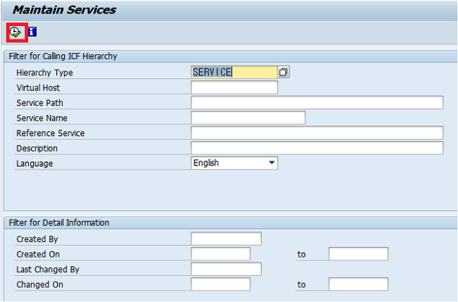

# Fiori 덤프


## What type of concurrency control is offered by OData? 

## (Choose the correct answer). 

Pessimistic concurrency control

No concurrency control

### Optimistic concurrency control

Exclusive concurrency control

****

:book: UX402 - Unit 3 

****


## What method is introduced with HTML5 to have a more powerful selection mechanism? 

## (Choose the correct answer). 

processSelector

getElement

### querySelector

****

:book: UX399 - Unit 3

****


## Which apps are meant by the term legacy apps? 

## (Choose the correct answer). 

###  ABAP Transactions and Web Dynpro ABAP applications 

???.

****

:book: UX100 - Unit 2

검증필요 (맞는거 같다. https://www.munich-enterprise.com/en/sap-fiori)

****


## Is it possible to add an extension point in the component implementation? 

## (Choose the correct answer).

Yes 

### No 

It depends on the type of component. 

****

:book: UX402 - Unit 4

검증필요 

****


## Which of the following model types are supported by SAPUI5? 

## (Choose the correct answers). 

## XML 

## JSON 

## OData 

SOAP.

****

:book: UX400 - Unit 9 

****


## Which system environments offer the UI theme designer? 

## (Choose the correct answers). 

### SAP Enterprise Portal 

### SAP NetWeaver Application Server ABAP 

### SAP Cloud Platform 

SAP NetWeaver Application Server Java 

SAP Business Intelligence.

****

:book: UX100 - Unit 5 

검증필요

****


## Which of the following steps are part of the design phase in the DLD? 

다음 중 DLD의 design 단계의 일부인 단계는?

## (Choose the correct answers). 

Test 

### Validate 

### Prototype 

Scope 

### Ideate

****

:book: UX402 - Unit 1 / UX403 - Unit 1 

https://experience.sap.com/fiori-design-web/design-led-development-process-external/

https://blogs.sap.com/2017/03/01/good-things-come-in-3s-intro-to-the-dld-process/

**DLD 의 세가지 단계**

* **Discover**
  * Scope
  * 360° Research
  * Synthesize
* **Design**
  * ideate
  * Prototype
  * validate
* **Deliver**
  * implement
  * Test
  * Deploy

DLD = **D**esign-**l**ed **d**evelopment

개발 프로세스이다.

****


## What are the three states of a promise? 

## (Choose the correct answer). 

### Pending, Fulfilled, Rejected 

Waiting, Finished, Started 

Pending, Finished, Aborted

****

:book: UX399 - Unit 3 

**JavaScript - Three states of Promise** 

* **pending**

  초기 상태, 완료 또는 실행되지 않은 상태

* **fulfilled**

  작업이 성공적으로 완료 된 상태

* **rejected**

  작업이 실패한 상태


* **settled**

****


## What is returned by the function createEntry?

## (Choose the correct answer). 

The ID of the newly created entity 

### A binding context object 

A newly created object in JSON-format.

****

:book: UX402 - Unit 3 

검증 필요 

****


## What options are known to consume SAP Fiori apps on mobile clients without using the SDK for iOS or Android? 

ios 나 Android 의 SDK 를 사용하지 않고 mobile client 에서 SAP Fiori app 을 사용하도록 알려진 option 들은 무엇인가

## (Choose the correct answers). 

### SAP Fiori in a browser 

### SAP Fiori Client app or custom SAP Fiori Client 

SAP Fiori GUI Client 

### SAP Fiori Mobile with Kapsel SDK.

****

:book: UX410 - Unit 16 

검증필요

****


## What is the nature of the overview page floorplan? 

## (Choose the correct answer). 

You want to display all the information of a simple or complex object with different facets, in a responsive way. 

You want to display a collection of items, and process them or delegate them to someone else. 

### You want to show all information that is needed by the user on a single page, based on a user specific domain or role. 

You want to display a large collection of items, and the user can take some action.


****

:book: UX410 - Unit 12 

https://experience.sap.com/fiori-design-web/overview-page/#when-to-use

****


## What is the recent version of JavaScript? 

## (Choose the correct answer). 

ECMA Script 5 

### ECMA Script 6 

ECMA Script 3.

****

****

:book: UX399 - Unit 3 

****


## Where are the themes saved for the Fiori launchpad? 

## (Choose the correct answer).

### Theme repository in front-end server 

???.

****

:book: UX100 - Unit 5 

https://blogs.sap.com/2017/01/24/customizing-sap-fiori-launchpad-using-the-ui-theme-designer/

The UI theme repository on the ABAP frontend server contains SAP standard themes and custom themes. 

****


## What can be used as middleware to improve SAP Fiori for mobile? 

## (Choose the correct answer). 

SAP Unwired Platform (SUP) 

SAP Mobile Platform (SMP)

SAP Cloud Platform Mobile Services.

****

:book: UX100 - Unit 6 

https://blogs.sap.com/2019/02/01/migration-to-sap-cloud-platform-mobile-services/

SAP Cloud Platform Mobile Services 가 SAP Mobile Platform 의 개선된 후속 모델 정도로 이해하면 될것 같다.

****


## When do you use the load method? 

## (Choose the correct answer). 

### You want to load the response of the given URL into an object 

You want to load the jQuery library 

You want to load an xml file asynchronously.

****

:book: UX399 - Unit 4 

https://offbyone.tistory.com/235

****


## Which of the following statements are true for SAP Fiori elements? 

## (Choose the correct answers). 

Heavy UI coding is necessary when working with SAP Fiori Elements. 

### SAP Fiori elements provide designs for UI patterns and predefined templates. 

### Apps are based on OData services and annotations.

*****

:book: UX402 - Unit 3 

https://blogs.sap.com/2021/10/12/what-is-sap-fiori-elements-new-video/

****


## What is meant by the term legacy app descriptor? 

## (Choose the correct answer). 

### Assignment of tiles and target mappings to transaction codes or Web Dynpro applications 

???.

****

:book: UX100 - Unit 4 

검증필요

****


## What layout control is used to achieve flexible and responsive(반응형) layouts? 

## (Choose the correct answers). 

VerticalLayout 

FlexBox 

### Grid 

Splitter

****

:book: UX402 - Unit 2 

****


## What is created with SAP Screen Personas to change the structure of classical screens? 

## (Choose the correct answer). 

### Flavors 

???.

****

:book: UX100 - Unit 5 

https://www.avelon.be/news-blog/sap-screen-personas-versus-fiori

****


## What markup should be used to describe a long text in an html document? 

## (Choose the correct answer). 

### \<article>

`<p>` 

`<div>`

****

:book: UX399 - Unit 1 

****


## What is JavaScript Object Notation (JSON) 

## (Choose the correct answer). 

### JSON is a format definition to structure data transferred using web technologies 

???.

****

:book: UX100 - Unit 2 

****


## Which of the following features can be used to describe a module? 

## (Choose the correct answers). 

### Name 

Association 

### Definition 

Scope 

### Dependencies.

****

:book: UX400 - Unit 5 

검증필요 

https://stackoverflow.com/questions/48956829/how-to-load-dependencies-relative-to-defining-module

****


## Which function do you call on the ODataModel to trigger a deep insert? 

## (Choose the correct answer). 

### create 

createDeep 

insertDeep 

updateDeep.

****

:book: UX402 - Unit 3 

create_deep_entity 를 controller 에서 접근 하는 방법을 묻는 문제인데

create_deep_entity 는 동일하게 create 메소드로 접근 가능하다.

****


## Which personalization element refers to the application? 

## (Choose the correct answer). 

Fiori Group 

Fiori Group Tile 

Fiori Catalog 

### Fiori Catalog Tile.

****

:book: UX100 - Unit 1 

검증 필요

****


## Which of the following is true? 

## (Choose the correct answer).

A `<p>` tag has high semantic expressiveness. 

### The `<a>` tag is used to specify HTML Links. 

The `<li>` element can only be used inside of an <ol> element.

****

 :book: UX399 - Unit 1 

****


## Which personalization elements can be assigned to user roles? 

## (Choose the correct answers). 

### Fiori Group 

Fiori Group Tile 

### Fiori Catalog 

Fiori Catalog Tile.

****

:book: UX100 - Unit 1 

****


## What is the preferred way, when you have the requirement, to hide certain UI controls on a specific form factor? 

## (Choose the correct answer). 

Get the form factor using the device and call the setVisible() function of the UI control. 

### Assign a standard CSS class, such as sapUiVisibleOnlyOnDesktop of SAPUI5, to the UI control. 

Bind the formFactor property of the device model to the visible property of the UI control.

****

:book: UX400 - Unit 7 

https://stackoverflow.com/questions/66930485/device-adaptation-how-to-hide-an-ui-element-for-a-specific-device-type-on-ui5

****


## What is true of the SAP Cloud Platform Web IDE for full-stack development?

## (Choose the correct answers). 

### It requires zero Installation. 

It is released with SAP HANA SPS’s. 

### There are twice weekly updates. 

It is included with SAP HANA express edition.

****

:book: UX410 - Unit 6 

검증필요

****


## What are the current UI Technologies of SAP? 

## (Choose the correct answers). 

Business Server Pages 

### SAPUI5 

Java Server Pages 

### Web Dynpro ABAP / Floorplan Manager 

### Dynpro.

****

:book: UX402 - Unit 1, UX403 - Unit 1 

검증필요

https://help.sap.com/doc/saphelp_nw74/7.4.16/en-us/4f/47faaced4b49e985dd31298bd3775f/frameset.htm

****


## What configuration steps are necessary to define a navigation route? 

## (Choose the correct answers). 

### Configure a route in the manifest.json file. 

### Configure a target. 

### Assign at least one target to the route.

Activate routing in the sap.app.

****

:book: UX402 - Unit 2 

검증필요

****


## What class in the SAPUI5 API supports back-end mock up and is recommended by SAP? 

## (Choose the correct answer). 

sap.ui.app.MockServer 

### sap.ui.core.util.MockServer 

sap.m.MockServer 

sap.ui.core.MockServer.

****

:book: UX402 - Unit 3 

****


## Since when is the Split-Screen-layout deprecated? 

## (Choose the correct answer). 

1.42 

1.44 

1.46 

### 1.48 

1.50

****

:book: UX410 - Unit 11 

****


## What is a GIT branch? 

## (Choose the correct answer). 

A GIT branch represents a local working copy of the main development line. 

A GIT branch always represents the main development line. 

### A GIT branch represents an independent line of development. 

A GIT branch is the SAP implementation of GIT.

****

:book: UX402 - Unit 5 

****


## What is the name of the attribute to access the custom attributes in your JavaScript code? 

## (Choose the correct answer). 

### dataset 

attributeset 

customDatas.

****

:book: UX399 - Unit 1 

검증필요

****


## Which of the following components are part of the SAP Fiori launchpad? 

## (Choose the correct answers). 

### Shell services 

UI2 services 

### Shell container 

Runtime container 

### Runtime configuration.

****

:book: UX410 - Unit 9 

검증필요

****


## What is the prefix of the HTML custom attributes of SAPUI5? 

## (Choose the correct answer). 

data-sap-ui5 

### data-sap-ui 

data-sap-uiconfig 

data-sap-config-ui.

****

:book: UX400 - Unit 4 

검증필요

****


## What is used in SAP S/4HANA to read data from the database? 

## (Choose the correct answer).

### ABAP Core Data Services (CDS) 

???.

****

:book: UX100 - Unit 3  

****


## What parameter is needed when instantiating a MockServer object? 

## (Choose the correct answer). 

uri 

rootUri 

url 

rootUrl.

****

:book: UX402 - Unit 3 

**Questions :** SAPUI5 Problem with rootUri in Mock Sever

SAPUI5 Problem with rootUri in Mock Sever

**Questions :** SAPUI5 Problem with rootUri in Mock Sever

Thanks a lot to all of you, my friends for anycodings_manifest.json your help and advices. Guys, I think I anycodings_manifest.json solved the problem, almost. Just need your anycodings_manifest.json help with this moment: My Table get data anycodings_manifest.json from mock server, but doesn't show it to anycodings_manifest.json user. Instead of the rows it shows an empty anycodings_manifest.json table where the rows count is equal to the anycodings_manifest.json data in my mockserver file. I mean: At the anycodings_manifest.json moment, in "ZMA_BPSet" there'se 8 rows. anycodings_manifest.json Because of this you can see 8 rows in anycodings_manifest.json table. Can anybody help me?


[SAPUI5](https://www.anycodings.com/search?q=sapui5)[MANIFEST.JSON](https://www.anycodings.com/search?q=manifest.json)[MOCKSERVER](https://www.anycodings.com/search?q=mockserver)

Total Answers **1**

## **Answers 1 :** of SAPUI5 Problem with rootUri in Mock Sever

rootUri is used to determine the path of anycodings_mockserver the OData service that should by anycodings_mockserver intercepted by the mock server. It anycodings_mockserver should always correspond to the service anycodings_mockserver uri of your OData service specified in anycodings_mockserver manifest.json.

So, if you have this in your manifest

```json
"dataSources": {
    "mainService": {
        "uri": "/sap/opu/odata/your-service/",
        "type": "OData",
        "settings": {
            "localUri": "localService/metadata.xml"
        }
    }
},
```

your mock server constructor should look anycodings_mockserver like this:

```csharp
var oMockServer = new MockServer({
    rootUri: "/sap/opu/odata/your-service/"
});
```

Note that the rootUri must always have a anycodings_mockserver trailing slash. If your service url in anycodings_mockserver manifest.json does not have one, make anycodings_mockserver sure that rootUri does.

You don't have to change anything in anycodings_mockserver your manifest.json. All test setups are anycodings_mockserver done in mockServer.html and its anycodings_mockserver referenced files.

https://velog.io/@opensapkr/Step-27-Mock-Server-Configuration-apjxptcpgp

****


## What is used as a container for SAP Fiori in an Enterprise Portal? 

## (Choose the correct answer). 

### Fiori iView 

???.

****

:book: UX100 - Unit 7 

검증필요

****


## Is it true to say that the sap.m.App control does not provide responsive behavior? 

## (Choose the correct answer). 

That is true, the sap.m.App control does not provide responsive behavior It depends on the SAPUI5 version. 

From version 1.30 and later, the sap.m.App control provides responsive behavior. 

### No, that is not true. The sap.m.App control provides responsive behavior.

****

:book: UX402 - Unit 2 

검증필요

****


## When is the use of a master-detail pattern not recommended? 

## (Choose the correct answers). 

### You need to offer complex filters for the master list of items. 

You want to display a single object. 

### When you want to display different facets of the same object, data, or both.

****

:book: UX402 - Unit 2 

검증필요

****


## What does the createAttribute method return? 

## (Choose the correct answer). 

An object of the type Attr 

An object of the type Attribute 

The method returns void.

****

:book: UX399 - Unit 3 

http://www.w3big.com/ko/jsref/met-document-createattribute.html

****


## What features are contained in jQuery? 

## (Choose the correct answers). 

### HTML, DOM, CSS manipulation 

UI5 event 

### Effects and animations 

### AJAX.

****

:book: UX399 - Unit 4 

https://micropyramid.com/blog/jquery-features-overview-and-its-future/

검증필요

UI5 event 를 포함하지 않는지 확인 필요

****


## If your backend system is based on ABAP 7.50, which are available ways of using facets? 

## (Choose the correct answers). 

Declare both: field groups and facets in CDS view. 

### Declare both: field group and facet as local annotation using WebIDE. 

### Declare field group in CDS view, declare facets as local annotation using WebIDE. 

It is not possible to use facets in ABAP 7.50.

****

:book: UX403 - Unit 4 

검증필요

****


## How many heading elements are specified in the HTML specification? 

## (Choose the correct answer). 

4 

3 

### 6 

1.

****

:book: UX399 - Unit 1 

****


## What is true for the prototype? 

## (Choose the correct answers). 

### Every function has a prototype 

### Each object can act as a prototype 

### Any change on the prototype object is immediately visible to all referencing objects.

****

:book: UX399 - Unit 3 

****


## What does the method document.createElement(“article”) do? 

## (Choose the correct answer). 

### It creates an element of the type HTMLUnknownElement. 

It creates an element of the type article 

It throws an error.

****

:book: UX399 - Unit 3 

테스트 결과 article 생성되는데 왜 답이 저거인지 모르겠다.

검증필요

****


## Where are the services for SAPUI5 apps organized? 

## (Choose the correct answer). 

### Internet Communication Framework (ICF) 

???.

****

:book: UX100 - Unit 2 




****


## What can you do by editing manifest.json? 

## (Choose the correct answers). 

### Disable object page. 

### Add object pages as sub page under an object page. 

Define facets on Object Page. 

Disable List Report.

****

:book: UX403 - Unit 5 

검증필요

****


## Which layers of settings are available for SAP Fiori? 

## (Choose the correct answers). 

### Configuration 

### Personalization 

### Customizing 

Internationalization.

****

:book: UX100 - Unit 4 

****


## Which model types are supported by SAPUI5? 

## (Choose the correct answers). 

### JSON model 

### Resource model 

Translation model 

### XML Model 

### OData model.

****

:book: UX402 - Unit 2 

https://velog.io/@opensapkr/Step-6-Resource-Models-cfjxl5770h

****


## Which native capabilities of a mobile device can only be leveraged when using SAP Fiori for iOS? 

## (Choose the correct answers). 

### Touch ID 

Camera 

### Facetime 

### iBeacon 

Geolocation.

****

:book: UX100 - Unit 6 

검증필요

facetime / touch id / iBeacon 는 확인 된바 있다.

****


## What is the best approach to showing a UI control on a desktop only, and not on a mobile device? 

## (Choose the correct answer). 

Use the Device API to check the environment and call setVisible on the UI control. 

Use the UI control from sap.ui.commons.  These UI controls can handle this automatically. 

### Use the standard CSS class sapUiVisibleOnlyOnDesktop.

****

:book: UX402 - Unit 2 

****


## What possible values can be used for the annotation @UI.LineItem.importance? 

## (Choose the correct answers). 

### LOW 

VERY_HIGH 

### HIGH 

### MEDIUM.

****

:book: UX410 - Unit 14 

https://help.sap.com/docs/SAP_BW4HANA/107a6e8a38b74ede94c833ca3b7b6f51/f8af07bb0770414bb38a25cae29a12e9.html?version=2.0.0&locale=en-US

!!! Original answer is not correct. See the explanation section. 

****


## When do you use deep insert? 

## (Choose the correct answer). 

When working with aggregation binding to update / insert an entity in the bound complex structure. 

When adding a new entity to an entity set. 

### When working with hierarchical data where the data can only be stored in the full hierarchy.

****

:book: UX402 - Unit 3 

hierarchical data = 계층형 데이터 (트리 구조) 

****


## Is it possible to read CSS properties with the CSS method? 

## (Choose the correct answer). 

### True 

False.

****

:book: UX399 - Unit 4 

****


## What are the limitations of publishing CDS as OData service by adding a @OData.publish:true? 

## (Choose the correct answers). 

Can not expose associations. 

### Can not change names of entity sets. 

### Only 1 level is taken into consideration when exposing associations. 

### No customized ABAP code in SAP Gateway.

****

:book: UX403 - Unit 2 

검증필요 

일전 신행준 멘토님이 알려주셨던 cds view 를 통해 read 가능한 odata service 를 생성했던 내용과 관련 있는듯 하다.

****


## Which fragment type is not available in SAPUI5? 

## (Choose the correct answer). 

XML fragment 

### JSON fragment 

HTML fragment 

JavaScript fragment.

****

:book: UX400 - Unit 8 

****


## How is the extension type called to hide UI controls? 

## (Choose the correct answer). 

Control replacement 

Control modification 

### View modification 

Element modification.

****

:book: UX402 - Unit 4 

https://help.sap.com/docs/FIORI_IMPLEMENTATION_740/9231fb54517b4759a855c716887b842e/f0f0df5215eb5c3fe10000000a423f68.html?version=7.40.3.0

****


## Which UI annotation is used to declare a field for the smart filter template? 

## (Choose the correct answer). 

UI.searchField 

### UI.selectionField 

UI.filterField 

UI.finderField

****

:book: UX402 - Unit 3 

https://help.sap.com/doc/saphelp_nw75/7.5.5/en-US/f8/af07bb0770414bb38a25cae29a12e9/content.htm?no_cache=true

****


## What is the goal of every developer? 

## (Choose the correct answers). 

### Increase efficiency 

### Develop faster 

Increase development effort 

### Less maintenance.

****

:book: UX410 - Unit 14 

****


## Which of the following properties can be used to define a resource bundle and an alias inside an XML view? 

## (Choose the correct answers). 

resourceBundle 

### resourceBundleName 

resourceAlias 

### resourceBundleAlias.

****

:book: UX400 - Unit 10 

<mvc:View
    **resourceBundleName**="sap.ui.core.messagebundle"
    **resourceBundleAlias**="i18n"
    xmlns:mvc="sap.ui.core.mvc"
    xmlns:l="sap.ui.layout"
    xmlns="sap.m">

****


## Which OData option grants access to the service definition? 

## (Choose the correct answer). 

### $metadata 

???.

****

:book: UX100 - Unit 2 

****


## What impact does SAP Fiori have on business? 

## (Choose the correct answers). 

### Digitalization 

### Simplification 

Support the web and open standards 

Provides a user-centered approach 

### Leads to re-imagination of processes.

****

:book: UX402 - Unit 1, UX403 - Unit 1, UX410 - Unit 2 

검증필요

****


## What attribute can you use to inform the end-user of what kind of data he should enter in a form field? 

textsuggestion 

### placeholder 

textphrase

****

:book: 확실

****


## What is the data source definition for the SAP Fiori search? 

## (Choose the correct answer). 

### Search connectors 

???.

****

:book: UX100 - Unit 3 

https://help.sap.com/docs/SAP_FIORI_OVERVIEW/17ca92fbe8f54d9d8dfbe830cbb0c8d2/12af5252b10d5a64e10000000a423f68.html?version=4_S4H1909.01&locale=en-US

****


## What does the childNode property return? 

## (Choose the correct answer). 

### The childNode property returns a live collection of child nodes of the given element. 

Returns the node immediately following the specified one in the parent childNode list 

Returns the list of childNodes of the document.

****

:book: UX399 - Unit 3 

****


## What establishes a secure connection between on-premise systems and SAP CP? 

## (Choose the correct answer). 

### Cloud Connector 

???.

****

:book: UX100 - Unit 7 

****


## What are the different content densities provided by SAPUI5? 

## (Choose the correct answers). 

### cozy 

large 

### condensed 

strict 

### compact.

****

:book: UX402 - Unit 2 

https://sapui5.hana.ondemand.com/sdk/#/topic/e54f729da8e3405fae5e4fe8ae7784c1.html

****


## What impact does UX have on monetary values? 

## (Choose the correct answers). 

Increases user satisfaction. 

### Provides productivity gains and increases data quality. 

Strengthens relationships with customers. 

### Provides training cost savings 

### Reduces the number of change requests and user errors.

****

:book: UX402 - Unit 1, UX403 - Unit 1, UX410 - Unit 2 

검증필요

****


## Which function invocation is necessary to set up the routing inside a full-screen app? 

## (Choose the correct answer). 

### this.getRouter().initialize(); 

this.getRouter().setup(); 

this.getRouter().init(); 

this.getRouter().registerRoutes();.

****

:book: UX400 - Unit 14 

검증필요

****


## When should you not use the dynamic page layout? 

## (Choose the correct answers). 

### You are planning to use SAP Fiori elements, such as the list report, analytical list page, overview page, or object page, which already incorporates the dynamic page layout. 

You are building a freestyle application that uses the dynamic page header and footer toolbar features of SAP Fiori 2.0 (versions 1.40 and higher) 

### You want to implement an initial page or object page floor plan. These floor plans already incorporate snapping header and footer toolbar features. The behavior is comparable to the dynamic page behavior, but the technical foundation is different. 

You are building an analytical application that is using the sap.viz API. 

### You only need to display a small amount of information. In this case, use a dialog instead. If you cannot avoid using the dynamic page layout, use letterboxing to mitigate the issue.

****

:book: UX410 - Unit 11 

https://experience.sap.com/fiori-design-web/dynamic-page-layout/#do-not-use-the-dynamic-page-if

list report / analytical list page / overview page / object page 

initial page or object page floor plan

소량의 정보만 표시하면 되는 경우

****


## Which element groups Fiori apps based on business topic? 

## (Choose the correct answer). 

### Business Catalog Group (BCG) 

???.

****

:book: UX100 - Unit 4 

https://help.sap.com/docs/SAP%20Fiori%20launchpad/d4650bf68a9f4f67a1fda673f09926a9/af35d42e7d4f49d7b8e46080cd01c299.html?version=753.04&locale=en-US

**Technical Catalog** 

* 모든 앱의 저장소 역할
* application area 별 app 과 관련된 모든 대상 mapping 및 app launcher tile 이 포함된다. 
* Technical Catalog 는 사용자에게 직접 할당되지 않는다. 

**Business Catalog**

* Business roll 과 관련된 대상 매핑 과 app launcher tile 의 sample collection 이 포함되어있다.
* Business Catalog 의 content 들은 Technical Catalog content 의 하위 집합니다.
* 이 하위 집합은 특정 Business 사용자의 요구사항을 반영한다.  

Business catalogs contain a sample collection of target mappings and app launcher tiles relevant for a business role. The content of the business catalog is a subset of the content of the technical catalog. This subset reflects the requirements of a specific business user. 

****


## Which element groups Fiori apps based on business area? 

business area 에 따라 피오리 앱을 그룹화하는 요소는 무엇입니까?

## (Choose the correct answer). 

### Technical Catalog (TC) 

???

****

:book: UX100 - Unit 4 

검증필요

https://help.sap.com/docs/SAP%20Fiori%20launchpad/d4650bf68a9f4f67a1fda673f09926a9/af35d42e7d4f49d7b8e46080cd01c299.html?version=753.04&locale=en-US

**Technical Catalog** 

* 모든 앱의 저장소 역할
* application area 별 app 과 관련된 모든 대상 mapping 및 app launcher tile 이 포함된다. 
* Technical Catalog 는 사용자에게 직접 할당되지 않는다. 

**Business Catalog**

* Business roll 과 관련된 대상 매핑 과 app launcher tile 의 sample collection 이 포함되어있다.
* Business Catalog 의 content 들은 Technical Catalog content 의 하위 집합니다.
* 이 하위 집합은 특정 Business 사용자의 요구사항을 반영한다.  

Business catalogs contain a sample collection of target mappings and app launcher tiles relevant for a business role. The content of the business catalog is a subset of the content of the technical catalog. This subset reflects the requirements of a specific business user. 

****


## What is used as container for SAPUI5 apps in the ABAP repository? 

## (Choose the correct answer). 

### Business Server Pages (BSP) 

???.

****

:book: UX100 - Unit 2 

****


## In which state are the files in GIT when a remote repository is cloned? 

## (Choose the correct answers). 

Staged and modified 

### Tracked and unmodified 

Tracked and staged 

Modified and tracked.

****

:book: UX402 - Unit 5 !!! Falsche Antwort absichtlich im original. 

https://88240.tistory.com/313

https://m.blog.naver.com/sw4r/221258249271

****


## What is SAP Screen Personas? 

## (Choose the correct answer). 

### A web-based layer for personalization of SAP GUI Dynpro and Web Dynpro ABAP 

???.

****

:book: UX100 - Unit 5 

SAP GUI 환경의 불편함(처음 사용자가 적응하기 힘들다. 사용하지 않는 항목이 노출되어 업무에 집중하기 힘들다 등등)을 해소하기 위해서 각 업무 환경에 맞게 화면을 단순화하거나 재배치할 수 있는 기능을 제공하는 것이 SAP Screen Personas 입니다.

https://www.avelon.be/news-blog/sap-screen-personas-versus-fiori

****


## Which of the following is true? 

## (Choose the correct answer). 

You can use the focus attribute on multiple form fields. 

### The focus attribute can only used at one form field. 

Only the first form field with the focus attribute will get the focus.

****

:book: UX399 - Unit 1 

커서가 올라가있는 필드 지정하는 focus 기능을 말하는듯 하다.

****


## What is the purpose of a build server? 

## (Choose the correct answer). 

Used for code review 

### Provides software that allows continuous integration. 

Used for version control 

Manages components, builds artifacts, and releases candidates in one central location.

****

:book: UX410 - Unit 15 

https://www.techtarget.com/searchapparchitecture/tip/Why-should-I-use-a-build-server

****


## What is the preferred technology to implement SAP Fiori applications? 

## (Choose the correct answer). 

Web Dynpro ABAP 

### SAPUI5 

Web Dynpro Java 

Dynpro.

****

:book: UX410 - Unit 3 

****


## Which control is used in the index.html file to support letterboxing if required? 

## (Choose the correct answer). 

sap.ui.core.ComponentContainer 

sap.ui.core.Component 

### sap.m.Shell 

sap.ui.core.View.

****

:book: UX402 - Unit 2 

https://experience.sap.com/fiori-design-web/letter-boxing/#guidelines

****


## What concept is provided by SAP to make it possible to extend standard SAPUI5 function in the basic application? 

## (Choose the correct answer). 

Base methods 

### Hook methods 

View controllers 

Extension controller.

****

:book: UX410 - Unit 13 

https://sapui5.hana.ondemand.com/sdk/#/topic/8fbf4e728bd146fcb2053aeb6ca741f9

****


## Which design template is used for SAP Fiori 2.0? 

## (Choose the correct answer). 

### SAP Belize 

???.

****

:book: UX100 - Unit 5 

https://help.sap.com/docs/SAP_S4HANA_ON-PREMISE/8ec2dae34eb44cbbb560be3f9f1592fe/977672c6940f48578d08d770bee236f2.html?version=1709%20000&locale=en-US

****


## Which clients can be used for SAP Fiori? 

## (Choose the correct answers). 

### Web Browser 

SAP Logon 

### SAP Fiori Client 

SAP Easy Access 

### SAP Business Client.

****

:book: UX100 - Unit 1 

검증필요

****


## Which of the following are known as BOM Objects? 

## (Choose the correct answers). 

Document 

### Window 

### History 

### Location.

****

:book: UX399 - Unit 1 

https://www.javascripttutorial.net/javascript-bom/

https://pridiot.tistory.com/170

**BOM** (**B**rowser **O**bject **M**odel)

웹 브라우저 전체를 객체로 관리하는 것으로 자바스크립트 프로그램을 통해 브라우저 창을 관리할 수 있도록 브라우저 요소를 객체화 해 놓은 것이다.

* **내장 객체**

  * ***Window :*** 

    브라우저 창이 열릴 때마다 하나 씩 만들어지는 객체

    브라우저 창 안에 존재하는 모든 요소의 최상위 객체

  * ***Document :*** 

    웹 문서에서 \<body> 태그를 만나면 만들어지는 객체

    HTML 문서 정보를 가지고 있다.

  * ***History :*** 

    현재 창에서 사용자 방문 기록을 저장하고 있는 객체

  * ***Location :***

    현재 페이지에 대한 URL 정보를 가지고 있는 객체

  * ***Navigator :***

    현재 사용 중인 웹브라우저 정보를 가지고 있는 객체

  * ***Screen :***

    현재 사용중인 화면 정보를 다루는 객체

****


## Does QUnit support SAPUI5 view tests? 

## (Choose the correct answer). 

Yes, you can implement a test class to test UI aspects of SAPUI5. 

### No, for UI tests you must use OPA5. 

You can use the QUnit-extensions, called Selenium, to test SAPUI5 controls.

****

:book: UX402 - Unit 2 

https://help.sap.com/saphelp_uiaddon10/helpdata/en/a6/b0657d226343da81ad96632cd1bd83/content.htm?no_cache=true

https://help.sap.com/saphelp_uiaddon10/helpdata/en/26/96ab50faad458f9b4027ec2f9b884d/content.htm?no_cache=true

검증필요

****


## How do you enter the UI adaptation mode of SAP Fiori apps? 

## (Choose the correct answer). 

Start app→ Me Area→ Adapt UI 

???.

****

:book: UX100 - Unit 5 

https://blogs.sap.com/2018/05/12/fiori-for-s4hana-adapting-terminology-in-sap-fiori-apps-via-key-user-tools/

****


## What is the order of processing CSS instructions?

## (Choose the correct answer). 

### Importance, Specificity, Source order 

Specificity, Source order, Importance 

Source-order, Importance, Specificity.

****

:book: UX399 - Unit 2 

검증필요

****


## In which file is the Component controller implemented? 

## (Choose the correct answer). 

Component.json 

### Component.js 

UIComponent.js 

BaseComponent.js.

*****

:book: UX400 - Unit 13 

****


## What areas are mandatory in the tile layout? 

## (Choose the correct answers). 

Subtitle 

### Header Area 

Content Area 

Status Area 

KPI Area.

****

:book: UX410 - Unit 9 

https://experience.sap.com/fiori-design-web/tile/#header-area

정답에는 header area 와 content area 가 필수라고 되어있으나 

위 링크에 보면 content area 는 optional 이라고 되어있다.

검증필요

****


## Which JavaScript function is called to define a module?

## (Choose the correct answer). 

jQuery.sap.require 

jQuery.sap.define 

### sap.ui.define 

sap.ui.declare.

****

:book: UX400 - Unit 5 

We define a module, by calling sap.ui.define,

****


## What is true for the functions after and insertAfter? 

## (Choose the correct answers).

### The way the elements are selected is different 

There is no difference in the result. 

The insertAfter function performs better than the after function.

****

:book: UX399 - Unit 4 

검증필요

답에는 둘 의 결과가 차이가 없다고 나와있다 

A.after(B) – A 뒤에 B를 추가 
A.insertAfter(B) – B 뒤에 A를 추가

****


## How does the OData Model handle XSRF tokens? 

## (Choose the correct answer). 

The OData Model does not handle XSRF-tokens. The developer must implement token handling. 

### The OData Model fetches the token when reading the metadata and sends the token automatically in each write request header. 

The OData Model fetches the token for each request and sends the token automatically with each request.

*****

:book: UX402 - Unit 3 

https://help.sap.com/saphelp_snc700_ehp04/helpdata/de/6c/47b2b39db9404582994070ec3d57a2/content.htm?no_cache=true

****


## What of the following is true? 

## (Choose the correct answers). 

### The :last-child selector matches every element that is the last child of its parent. 

### The :nth-last-child(n) selector matches every element that is the nth child, regardless of parent type, counting from the last child 

The :last-child(n) selector matches every element that is the nth child, regardless of parent type, counting from the last child.

****

:book: UX399 - Unit 2 

****


## What is the visibility of a variable that is defined inside a function? 

## (Choose the correct answer). 

It is only visible inside the function. 

It is only visible inside the statement where the variable is defined 

As a variable in JavaScript it is always globally visible.

****

:book: UX399 - Unit 3 

****


## Which root element can be used when developing a full-screen app? 

## (Choose the correct answer). 

### sap.m.App 

sap.m.FullScreenApp 

sap.m.BaseApp 

sap.m.SplitApp

****

:book: UX400 - Unit 14 

****


## In an Analytic List Page, the user can filter data by clicking some points in the chart. 

## (Choose the correct answer). 

### True 

False

****

:book: UX403 - Unit 7 

****


## Which of following templates display only one business entity? 

## (Choose the correct answer). 

List Report 

### Object Page 

Overview Page 

Analytic List Page.

****

:book: UX403 - Unit 2 

검증필요

****


## When running a list report, users can only filter data using fields provided as selection fields by developer. 

## (Choose the correct answer). 

True

### False.

****

:book: UX403 - Unit 3 

검증필요

****


## What are the two aggregations provided by sap.m.SplitApp control to add page implementations? 

## (Choose the correct answers). 

mainPages 

### masterPages 

infoPages 

### detailPages 

detail.

****

:book: UX402 - Unit 2 

****


## What is the purpose of SAP Build? 

## (Choose the correct answer). 

### Provides tooling to support the designer during various phases of design thinking. 

Provides tooling to support the developer during the development of back-end services. 

Provides tooling to support the developer during the development of SAPUI5 applications.

****

:book: UX410 - Unit 4 

****


## What is the central app to display Workflow items in SAP Fiori? 

## (Choose the correct answer). 

### My Inbox

???.

****

:book: UX100 - Unit 7 

검증필요

****


## From which control does the sap.m.App control inherit navigation capabilities? 

## (Choose the correct answer). 

sap.m.NavigationContainer 

### sap.m.NavContainer 

sap.ui.core.NavContainer.

****

:book: UX402 - Unit 2 

https://sapui5.hana.ondemand.com/#/api/sap.m.NavContainer%23overview

****


## Which of the following statements are true with respect to fragments? 

## (Choose the correct answers). 

### Fragments are defined in a manner similar to views. 

A fragment itself has a HTML representation. 

### Fragments are light-weight UI parts. 

Fragments need a controller, similar to views.

****

:book: UX400 - Unit 8 

****


## Which enumeration defines the various binding modes provided by SAP? 

## (Choose the correct answer). 

### sap.ui.model.BindingMode 

sap.ui.binding.BindingMode 

sap.ui.bindingmode.Mode 

sap.ui.model.binding.Mode.

****

:book: UX400 - Unit 9 

https://sapui5.hana.ondemand.com/sdk/#/api/sap.ui.model.BindingMode%23properties

****


## What is the name of the aggregation of the sap.m.App control, or more precisely the name of the sap.m.NavContainer control, in which UI controls are aggregated? 

## (Choose the correct answer). 

fullPages 

### pages 

masterPages 

detailPages.

****

:book: UX402 - Unit 2 

https://sapui5.hana.ondemand.com/sdk/#/api/sap.m.NavContainer%23aggregations

****


## Which of the following are the binding types supported in SAPUI5? 

## (Choose the correct answers). 

### Property binding 

Default binding 

### Aggregation binding 

Elementary binding 

### Element binding.

****

:book: UX400 - Unit 9

******


## In what configuration area of the manifest.json file can you activate automatic message creation? 

## (Choose the correct answer). 

sap.app 

sap.ui 

### sap.ui5

****

:book: UX402 - Unit 2 

검증필요

****


## What is SAP Kapsel? 

## (Choose the correct answers). 

### SAP specific plug-in for Cordova 

SAP specific plug-in for Apple iOS 

SAP specific plug-in for Android 

### SAP Kapsel provides the API to interact from Cordova based web applications to SMP3 and software cloud platforms.

****

:book: UX410 - Unit 16 

검증필요

****


## Which tool is used in a Suite on HANA environment to model KPI? 

## (Choose the correct answer). 

### KPI Modeler 

???.

****

:book: UX100 - Unit 4 

https://help.sap.com/saphelp_ssb/helpdata/en/0d/7532521603f009e10000000a44166d/frameset.htm

****


## Which system part provides the analytical data in SAP S/4HANA? 

## (Choose the correct answer). 

### SAP S/4HANA Embedded Analytics 

???.

****

:book: UX100 - Unit 3 

https://www.scirp.org/journal/paperinformation.aspx?paperid=77387

****


## Which modes are provided by the sap.m.SplitAppMode enumeration? 

## (Choose the correct answers). 

### ShowHideMode 

HideShowMode 

### StretchCompressMode 

### PopoverMode 

ShrinkCozyMode.

****

:book: UX402 - Unit 2 

https://sapui5.hana.ondemand.com/sdk/#/api/sap.m.SplitAppMode

* sap.m.SplitAppMode.HideMode
* sap.m.SplitAppMode.PopoverMode
* sap.m.SplitAppMode.ShowHideMode
* sap.m.SplitAppMode.StretchCompressMode

****


## What approach gives you the most flexibility for your SAPUI5 app? 

## (Choose the correct answer). 

Using a controller-based approach 

Using a view-only based approach 

Implement complex UIs in the index.html file 

### Using a component-based approach.

****

:book: UX402 - Unit 2 

검증필요

****


## What is the difference between scope and execution context? 

## (Choose the correct answer). 

### Scope is function based while execution context is object based. 

Scope context is object based while context is function based. 

It depends on the invocation target whether a function has a scope or a context.

****

:book: UX399 - Unit 3 

https://velog.io/@jhy979/Execution-Context-Scope

****


## What steps are used to display a field as a rating indicator? 

## (Choose the correct answers). 

### Set type of line item to #AS_DATAPOINT . 

### Add a @UI.datapoint to the field and set visualization to #RATING. 

Add a @UI.chart annotation to the field and set visualization to #RATING. 

Set the visualization of line item to #RATING.

****

:book: UX403 - Unit 5

https://sapui5.hana.ondemand.com/sdk/#/topic/a797173b84724ef1bc54d59dc575e52f.html

****


## Since when is the full-screen layout deprecated? 

## (Choose the correct answer). 

1.42 

### 1.44 

1.56 

1.58 

1.60.

****

:book: UX410 - Unit 11 

https://experience.sap.com/fiori-design-web/full-screen/

검증필요

****


## What is the result of the following 2+3+"3"+23+3+"seven"+12? 

## (Choose the correct answer). 

### 53233seven12 

53326seven12 

23326seven12

****

:book: UX399 - Unit 3 

****


## What is the corresponding CSS selector of $('#some-id')? 

## (Choose the correct answer). 

### #some-id { } 

some-id{ } 

*some-id{ }.

****

:book: UX399 - Unit 4 

검증필요

****


## What application in the SAP Fiori launchpad helps the user to find applications that are available to the user? 

## (Choose the correct answer). 

Tile Finder 

### Application Finder 

Fiori Designer 

Fiori Appsearch.

****

:book: UX410 - Unit 10

https://experience.sap.com/fiori-design-web/app-finder/

****


## What do you focus on when it comes to decomposition and re-composition? 

## (Choose the correct answer). 

The building of mega transactions to support all needs of all people 

### The person’s tasks that should be supported by the application 

The expensive of the implementation 

The data and functions that are already in the system.

****

:book: UX410 - Unit 4 

검증필요

******


## What application type is implemented to analyze a huge amount of data with diagrams? 

## (Choose the correct answer). 

Transactional 

### Analytical 

Fact sheet.

****

:book: UX410 - Unit 3 

https://help.sap.com/saphelp_ssb/helpdata/en/ec/a941524a6b6760e10000000a423f68/content.htm?no_cache=true

****


## What are the main principles of SAP Fiori? 

## (Choose the correct answers).

### Role-based 

### Adaptive 

### Simple 

### Coherent 

### Delightful

****

:book: UX100 - Unit 1 

https://experience.sap.com/fiori-design-web/design-principles/

****


## SAPUI5 provides two different router implementations. What router class is used in SAP Fiori apps as a router or as a router base class, when you want to implement your own router? 

## (Choose the correct answer). 

### sap.m.routing.Router 

sap.ui.core.routing.Router 

sap.m.Router 

sap.routing.Router.

****

:book: UX410 - Unit 7 

검증필요

****


## Which of the following statements are true for OpenUI5? 

## (Choose the correct answers). 

### OpenUI5 includes all of the main features of SAPUI5. 

OpenUI5 contains sap.viz and sap.ui.com. 

### OpenUI5 is free for use. 

OpenUI5 implements its own Core-Component 

### OpenUI5 encompasses the complete SAPUI5 Core, plus many front-end controls that are also included in SAPUI5.

****

:book: UX400 - Unit 2 

검증필요

****


## Which of the following SAP Key UI technologies are currently recommended by SAP? 

## (Choose the correct answers).

Web Dynpro Java 

### Web Dynpro ABAP with Screen Personas 

### Dynpro with Screen Personas 

Java Dynpro 

### SAPUI5.

****

:book: UX400 - Unit 1 

검증필요

****


## What view type does SAP recommend? 

## (Choose the correct answer). 

 JSON

### XML 

HTML 

JavaScript.

****

:book: UX400 - Unit 6 

****


## What is AJAX? 

## (Choose the correct answer). 

### Asynchronous JavaScript and XML 

Another JavaScript XML Library 

Asynchronous Java XML.

****

:book: UX399 - Unit 3 

****


## What is a SAP Fiori floorplan? 

## (Choose the correct answer). 

A floorplan is a layout control of SAPUI5. 

### A floorplan is a UI pattern that provides consistent UX. 

A floorplan defines the overall layout of an application. 

A floorplan is a layout of the SAP Web-Dynpro layouts for SAP Fiori apps.

****

:book: UX410 - Unit 12 

******


## What names have the view ports of the SAP Fiori launchpad? 

## (Choose the correct answers). 

### Me area 

Desktop 

### Workspace 

### Notification area.

****

:book: UX410 - Unit 3 

검증필요

****


## Which shell configurations are available to adapt the header of the app? 

## (Choose the correct answers). 

encapsulated 

### embedded 

### standalone 

### headerless 

footless.

****

:book: UX100 - Unit 7 

https://help.sap.com/docs/SAP_S4HANA_ON-PREMISE/a7b390faab1140c087b8926571e942b7/537758e0deb0477386ea400c915073b3.html

****


## Using S/4 HANA 1610 with ABAP 7.51, which of following templates can you use for Fiori Element? 

## (Choose the correct answers). 

### List Report 

### Object Page 

### Overview Page 

Analytic List Page.

****

:book: UX403 - Unit 2 

맞는거 같다

******


## What UI control can be used to define a hook to extend an application? 

## (Choose the correct answer).

sap.m.Extend 

sap.ui.core.Extend 

### sap.ui.core.ExtensionPoint 

sap.comp.ExtendControl. 

****

:book: UX410 - Unit 13 

https://help.sap.com/doc/saphelp_nw74/7.4.16/en-us/40/3c050da4ae4566b6aafec2bc590389/content.htm?no_cache=true

맞는거 같다

****


## What query option is needed to access the data of an entity in the JSON format? 

## (Choose the correct answer). 

$json 

### $format=json 

format=json

****

:book: UX402 - Unit 3 

https://stackoverflow.com/questions/42249587/why-can-i-get-to-use-format-json-with-entities-but-not-with-metadata-using-odat

*****


## Which of the following statements are correct with respect to the SAP Web IDE? 

## (Choose the correct answers). 

SAP web IDE is a development environment for SAP ABAP. 

### SAP web IDE is a browser-based development environment. 

### SAP web IDE provides application templates as a foundation of highly efficient app development.

****

:book: UX410 - Unit 6 

https://dhan-description.tistory.com/152

******


## Which of the following return types are supported by service operations? 

## (Choose the correct answers). 

### Complex Types 

### Primitive Types 

Aggregation Type 

Infinitive Types.

****

:book: UX400 - Unit 11 

검증필요

****


## What problem is solved by the worklist Report floorplan? 

## (Choose the correct answer). 

You want to display all the information of a simple or complex object with different facets in a responsive way. 

### You want to display a collection of items and process them or delegate them to someone else. 

The user must process a long and unfamiliar task. 

You want to display a large collection of items and the user can take some action.

****

:book: UX410 - Unit 12 

https://experience.sap.com/fiori-design-web/work-list/

****


## What version of jQuery first provided the AJAX method? 

## (Choose the correct answer). 

Version 1.4 

### Version 1.5 

Version 1.0.

****

:book: UX399 - Unit 4 

검증필요

****


## When you implement a dialog using a fragment, you should bind the fragment to the lifecyle management of the consuming view. Which function do you need to call on the consuming view to connect the dialog to the lifecyle management of the view? 

## (Choose the correct answer). 

### addDependent() 

connectToView() 

addFragment() 

assignDependent().

****

:book: UX400 - Unit 8 

https://answers.sap.com/questions/707789/use-of-adddependent-in-fragment.html

****


## The CDS annotation @UI.facet is used to: 

## (Choose the correct answers). 

### Create a Header Facet 

### Create a collection facet, which is displayed as section. 

### Create a reference under collection facet. 

Create content, like field groups, or charts for a Facet.

****

:book: UX403 - Unit 4 

검증필요

****


## What is Apache Cordova? (Choose the correct answer). 

### Apache Cordova is an open-source mobile development framework. 

Apache Cordova is the SAP product to run SAP Fiori applications on mobile devices. 

Apache Cordova is a cloud service to access data from mobile devices. 

Apache Cordova is the API provided by SAP to access mobile device features.

****

:book: UX410 - Unit 16 

https://ko.wikipedia.org/wiki/%EC%95%84%ED%8C%8C%EC%B9%98_%EC%BD%94%EB%8F%84%EB%B0%94

****


## Which ABAP transactions can be used to analyze the intents used in target mappings? 

## (Choose the correct answers). 

/UI2/FSAC 

### /UI2/FLIA 

### /UI2/FLC 

/UI2/FLP

****

:book: UX100 - Unit 4 

검증필요

****


## In which cases, is a local annotation better than a CDS annotation? 

## (Choose the correct answers). 

UI with data intensive. 

Annotations is for 1 field. 

### Complex UI relevant annotations. 

### You want to use annotations which are not support by your current ABAP version.

****

:book: UX403 - Unit 2 

검증필요

****


## Which platforms support the integration of SAP Fiori? 

## (Choose the correct answers). 

### SAP Enterprise Portal 

SAP Process Integration 

SAP HANA Enterprise Cloud 

### SAP Cloud Platform Portal 

### SAP Cloud Platform Mobile Services.

****
:book: UX100 - Unit 1 

****


## What are the differences between analytical entity set and normal entity set from an OData consumer perspective? 

## (Choose the correct answers). 

### The Analytical entity set, generates a new field for primary key. 

### The Analytical entity set, returns all data, needed to analyze the client. 

The Analytical entity set, returns summarized results according to the $select parameter. 

### Analyzes the use of the database and runs faster when SAP HANA is used as database compared to a normal entity set.

****

:book: UX403 - Unit 5 

검증필요

****


## For a list report, which annotation is used to describe the name of business entity displayed on the report? 

## (Choose the correct answer). 

@UI.lineItem.title 

@UI.headerInfo.type 

@UI.headerInfo.typeName 

### @UI.headerInfo.typeNamePlural.

****

:book: UX403 - Unit 3 

https://help.sap.com/saphelp_snc700_ehp04/helpdata/de/f8/af07bb0770414bb38a25cae29a12e9/content.htm?no_cache=true

****


## Which factors are key to the user experience with user assistance? 

## (Choose the correct answers). 

### Instant 

### Context-sensitive 

confusing 

### Seamless 

Error prone.

****

:book: UX410 - Unit 9 

검증필요

****


## Which of following description about search field is NOT true? 

## (Choose the correct answer). 

The Search field is searching on more than one data field. 

There is only 1 search field per list report. 

### Search field searches for only 1 data field. 

Search field support fuzzy search.

****

:book: UX403 - Unit 3 

****


## What method do you use since ECMA 5 to define a read only property? 

## (Choose the correct answer). 

### defineProperty 

setReadOnly 

defineReadOnly.

****

:book: UX399 - Unit 3 

https://opentutorials.org/course/787/5111

****


## What parameter must you provide when calling the simulate function of the mock server? 

## (Choose the correct answer). 

The full qualified path to the model and the URI for the service document. 

### The full qualified path to the local metadata file and the folder where the model data are stored locally. 

The autoRespondAfter parameter and the full qualified path to the local metadata file.

****

:book: UX402 - Unit 3 

**Mock data** (json files)

You can let the mock server generate random mock data automatically based on services metadata. For this, provide only the path to the metadata file and omit the second parameter of the simulate function as follows:

// url to the service metadata document

​    var sMetadataUrl = "testdata/rmtsampleflight/metadata.xml";

​    oMockServer.simulate(sMetadataUrl);

You can provide your own mock data in .json files, which can either be created manually or saved from an OData service response. Mock data in JSON format can be generated from an OData service by adding the $format=json parameter to the URL. Save the browser response which is called <entity type name>.json, for example Mock.json and put it into the mock data folder. Add the path to the simulate function

http://www.sapui5tutors.com/2016/06/mockserver-in-sapui5.html

****


## What is the initial starting phase of SAPUI5 called? 

## (Choose the correct answer). 

### Bootstrapping 

AutoStart 

ConfigurationLoad 

Startup-phase.

****

:book: UX400 - Unit 4 

https://help.sap.com/saphelp_snc700_ehp04/helpdata/en/a0/4b0d10fb494d1cb722b9e341b584ba/frameset.htm

You can use the SAPUI5 bootstrap script in your page to initialize SAPUI5 runtime automatically as soon as the script is loaded and executed by the browser. For simple use cases as well as the default SAPUI5 installation, this is sufficient to build and run UIs. In addition to this, you can specify the set of SAPUI5 libraries and the theme used for your application in the configuration settings.

***<u>index.html</u>***

```html
<!DOCTYPE html>
<html>
	<head>
		<meta charset="utf-8">
		<title>SAPUI5 Walkthrough</title>
		<script
			id="sap-ui-bootstrap"
			src="/resources/sap-ui-core.js"
			data-sap-ui-theme="sap_belize"
			data-sap-ui-libs="sap.m"
			data-sap-ui-compatVersion="edge"
               data-sap-ui-async="true"
               data-sap-ui-onInit="module:my/app/main"
               data-sap-ui-resourceRoots='{"my.app": "./"}'
 			></script>
	</head>
	<body class="sapUiBody" id="content">
	</body>
</html>
```

****


## What mode do you have to use when you want to use the new ECMA6 language features? 

## (Choose the correct answer). 

### strict mode 

base mode 

standard mode.

****

:book: UX399 - Unit 3

검증필요

****


## What is the principle of SAP UX strategy? 

## (Choose the correct answer). 

Design Strategy 

New, Renew, Enablement 

### New, Renew, Empower 

Architecture and Technology 

SAP Screen Personas.

****

:book: UX402 - Unit 1 

https://www.eventservice.kr/2017/sap/00/file/2017_2pm_0405_Session.pdf

****


## What URL do you enter when you want to see the source code of a web page? 

## (Choose the correct answer). 

### A view-source:https://www.google.com 

view-code:https://www.google.com 

show-source: https://www.google.com.

****

:book: UX399 - Unit 1

https://m.blog.naver.com/PostView.naver?isHttpsRedirect=true&blogId=leosaint&logNo=120011242924

****


## Where is the best place to store local data when using the SAP Web IDE? 

## (Choose the correct answers). 

In the models folder. 

### In the localService folder. 

### In the mockdata folder.

****

:book: UX402 - Unit 3 

검증필요

맞는거 같다

****


## What are the app types of SAP Fiori? 

## (Choose the correct answers). 

### Transactional 

### Analytical 

Smart 

Principal 

### Fact Sheet.

****

:book: UX100 - Unit 2 

http://blog.sap-press.com/sap-fiori-apps-for-sap-s4hana-sd

****


## What is the main benefit to using predefined CSS margin/padding classes of SAPUI5? 

## (Choose the correct answer). 

### Consistent spacing 

Consistent borders 

Consistent width 

Consistent height.

****

:book: UX410 - Unit 7 

****


## The field indicate criticality should be hidden because it means nothing to end user. (Choose the correct answer). 

### True 

False.

****

:book: UX403 - Unit 5 

검증필요

****


## What is jQuery? (Choose the correct answer). 

CSS Framework 

### A free, lightweight and extendable JavaScript library 

A set of HTML controls.

****

:book: UX399 - Unit 4 

****


## Why is it advisable to not use a custom CSS file in your SAP UI5 applications? (Choose the correct answer). 

SAPUI5 has problems with custom CSS. 

### Having one central design created with the theme designer is very efficient.

 When something needs to be changed at the client interface, it is easier to handle. 

Time spent designing modified CSS is expensive.

****

:book: UX410 - Unit 8 

****


## What is a pseudo-class or pseudo-element? (Choose the correct answer). 

### A A CSS technique to permit formatting based on information that lies outside the DOM tree 

A CSS technique to prohibit formatting based on information that lies outside the DOM tree 

A CSS technique to introduce pseudo-style-attributes.

****

:book: UX399 - Unit 2 

****


## Which of the following statements are talking about the SAP Fiori app architecture? (Choose the correct answers). 

### SAP Fiori apps are implemented using the component-based approach. 

### SAP Fiori apps have a index.html file that is used for SAP Fiori launchpad integration. 

SAP Fiori apps need to have an app descriptor that describes the applications metadata. 

SAP Fiori apps should use the SAPUI5 core as a place to hold app data models.

****

:book: UX410 - Unit 7 

검증필요

****


## What is the name of the consortium that standardised the DOM? (Choose the correct answer). 

WWF 

### W3C 

WC3.

****

:book: UX399 - Unit 1 

https://ko.wikipedia.org/wiki/W3C

****


## Which of the following layouts, are described in version 1.48 of the Guidelines? (Choose the correct answers). 

### Dynamic Page 

Full-Screen 

Split-Screen 

### Flexible Column Layout 

MobileDeviceLayout.

****

:book: UX410 - Unit 11 

****


## JavaScript functions are so called first-class objects. What characteristics do functions have? (Choose the correct answers). 

### A function is an instance of the object type. 

### A function can have properties and has a link back to its constructor method. 

### A function can be stored in a variable. 

### A function can pass as a parameter to another function. 

### A function can return from a function.

****

:book: UX399 - Unit 3 

검증필요

****


## What is true for a variable that holds the value undefined? (Choose the correct answer). 

It represents the intentional absence of an object value. 

it is a keyword. 

### It expresses that a variable is not yet initialized. 

It functions without a return value, and returns undefined.

****

:book: UX399 - Unit 3 

****


## What are common design thinking brainstorming rules? (Choose the correct answers). 

### Be visual 

Discuss and judge every idea 

Go for quality 

### Fail early and often.

****

:book: UX410 - Unit 4 

검증필요

****


## What is SAP Cloud Platform (CP)? (Choose the correct answer). 

###  SAP's platform-as-a-service (PaaS) providing in-memory database and application services 

???.

****

:book: UX100 - Unit 7

****


## Which benefits are offered by the SAP Fiori Client alone over a Web browser? (Choose the correct answers). 

### Full screen 

Offline data 

### Delta caching 

Push notifications 

### Attachment viewer.

****

:book: UX100 - Unit 6 

검증필요

****


## What operator do you use to inform the runtime that an error occurred? (Choose the correct answer). 

### throw 

throws 

toss.

****

:book: UX399 - Unit 3 

****


## What tool is used to connect the SAP Cloud Platform to an on-premise system? (Choose the correct answer). 

SAP Destination Connector 

### SAP Cloud Connector

SAP Connector App 

SAP Cloud Manager.

****

:book: UX400 - Unit 3

****


## Which of the following steps are part of the discover phase in the DLD? (Choose the correct answers). 

### Scope 

Test 

Implement 

### Research 

### Synthesize.

****

:book: UX402 - Unit 1, UX403 - Unit 1 

https://blogs.sap.com/2017/03/01/good-things-come-in-3s-intro-to-the-dld-process/

****


## A GIT branch is the SAP implementation of GIT. (Choose the correct answer). 

A merge deletes the content of a branch. 

Allows the merging of two local branches into one local branch. 

### Allows integration of a branch into another branch.

****

:book: UX402 - Unit 5 

문제 이상

******


## What are the three keyword when it comes to error handling? (Choose the correct answer). 

### try, catch, finally 

throws, catch, attheend 

try, finally, handle.

****

:book: UX399 - Unit 3 

https://blog.naver.com/PostView.nhn?isHttpsRedirect=true&blogId=highkrs&logNo=220238284097&beginTime=0&jumpingVid=&from=section&redirect=Log&widgetTypeCall=true

****


## How do you catch invalid hashes in your routing configuration? (Choose the correct answer). 

Handle the invalid hashes during component initialization and forward them to a central routing target. 

### Use the bypassed attribute inside the routing configuration. 

Register an event handler to handle invalid hashes and navigation to the correct target when the invalidHashOccurs event is raised.

****

:book: UX400 - Unit 14 

https://sapui5.hana.ondemand.com/sdk/#/topic/a7932a791adc4a58ae4693400801ea5f

****


## What are the main configuration objects of the routing configuration? (Choose the correct answers). 

### config 

routing 

### routes 

### targets.

****

:book: UX410 - Unit 7 

https://sapui5.hana.ondemand.com/sdk/#/topic/902313063d6f45aeaa3388cc4c13c34e.html

****


## What is SAP S/4HANA? (Choose the correct answer). 

### The fourth generation of the SAP Business Suite based on SAP HANA renewing enterprise business 

???.

****

:book: UX100 - Unit 3 

****


## What is the name of the SAP Development tool? (Choose the correct answer). 

### SAP Web IDE 

SAP Cloud IDE 

SAP Web Cloud IDE.

****

:book: UX399 - Unit 1 

****


## Which of the following statements are true with regard to OPA5? (Choose the correct answers). 

### Can be used for user interaction tests

### Can be used for SAPUI5 integration tests. 

Is a view controller test framework 

### Provides the possibility to test navigation.

****

:book: UX402 - Unit 2 

검증필요

****


## Which of the following types are types of cards in an Overview Page? (Choose the correct answers). 

### List Cards

### Link List Cards 

### Analytic Cards 

### Table Cards 

### Stack Cards.

****

:book: UX403 - Unit 6 

https://experience.sap.com/fiori-design-web/cards/

답 검증필요

****


## Which of the following aspects are true for a SAPUI5 UI element? (Choose the correct answers). 

### A UI element has an API. 

### A UI element does not have a renderer. 

A UI element has a renderer. 

### A UI element can have events.

****

:book: UX402 - Unit 2 

검증필요

****


## What content density is used for touch-enabled devices? (Choose the correct answer). 

Compact form factor 

Mobile form factor 

### Cozy form factor 

Desktop form factor 

Small form factor.

****

:book: UX410 - Unit 5 

https://experience.sap.com/fiori-design-web/cozy-compact/

****


## How can you enable adaptation at runtime for SAP Fiori apps? (Choose the correct answers). 

### Target mapping to runtime authoring plugin 

Fiori catalog SAP_CA_BC_SSB 

### User role SAP_UI_FLEX_KEY_USER 

### Fiori catalog /UIF/SAP_RTA_PLUGIN 

User role SAP_S_RFCACL.

****

:book: UX100 - Unit 5 

https://help.sap.com/docs/UI_ADD-ON_FOR_SAP_NETWEAVER_20/17ae0e97e0fc424a9c368f350c0ba6bd/402b392585834dd38dd381d8f04b2616.html

검증필요

****


## Which system holds the SAP Fiori launchpad? (Choose the correct answer). 

### Front-End Server (FES) 

???.

****

:book: UX100 - Unit 3 

검증필요

****


## When do you not use the overview page floorplan? (Choose the correct answers). 

### A high-level or birds-eye view of an application content is sufficient. 

You want to display a collection of items and process them or delegate them to someone else. 

### You want to show information about one object only. In this case, use the object page instead. 

### You just represent one application and less than three cards.

****

:book: UX410 - Unit 12 

https://experience.sap.com/fiori-design-web/overview-page/#do-not-use-the-overview-page-if

****


## What aggregations are defined by the sap.suite.ui.commons.ChartContainer? (Choose the correct answers). 

### content 

container 

### dimensionSelector 

### customicons 

legend.

****

:book: UX410 - Unit 7 

https://sapui5.hana.ondemand.com/sdk/#/api/sap.suite.ui.commons.ChartContainer%23aggregations

******


## Which of the following statements are true when talking about SAP Fiori? (Choose the correct answers). 

### SAP Fiori is SAP’s user experience that applies modern user-centric design principals 

SAP Fiori is SAP’s product for implementing SAP Enterprise Portal components 

SAP Fiori is SAP’s UI technology for implementing application for mobile devices 

### SAP Fiori is SAP Fiori can be personalized, is simple, and runs on any device 

### SAP Fiori is SAP Fiori provides a consistent and role-specific experience across all tasks, for all lines of business.

****

:book: UX400 - Unit 1 

검증필요

****


## For intent-based navigation, what does an intent consist of? (Choose the correct answers). 

Target mapping 

### Semantic object 

### Action 

ICF path.

****

:book: UX100 - Unit 4 

https://help.sap.com/docs/SAP_HANA_PLATFORM/52715f71adba4aaeb480d946c742d1f6/5ff538515a2a455696f9c203939d9360.html?version=2.0.01&locale=en-US

****


## What is the result of a GIT Clean? (Choose the correct answer). 

Undoes a committed snapshot. 

### Removes all untracked files from the working directory 

Reverts back to the previous state of the project.

****

:book: UX402 - Unit 5 

****


## What is meant by the phrase “SAPUI5 supports modification free enhancements”? (Choose the correct answer). 

The developer must create a copy of the application that should be enhanced and the enhancement is done in the copy. 

### The delivered standard application remains unchanged and hence the extension is considered to be modification free. 

SAP provides a service in the cloud to generate an enhanced application using aspect-oriented programming.

****

:book: UX402 - Unit 4 

검증필요

****


## What function can be used to check whether the OData model contains changes? (Choose the correct answer). 

hasUpdatedValues() 

### hasPendingChanges() 

hasPendingValues() 

hasUpdatedChanges().

****

:book: UX400 - Unit 12 

****


## Which of the following statements are true with respect to the SAP Web IDE? (Choose the correct answers). 

### A browser-based integrated development environment 

Available only in the SAP Cloud Platform 

Integrated in the SAP GUI

### Supports the End-to-End (E2E) application lifecycle 

### Provides WYSIWYG tooling.

****

:book: UX400 - Unit 3 

https://blogs.sap.com/2015/06/22/sap-web-ide-layout-editor-wysiwyg-or-dragdrop-available-for-productive-use/

****


## Which info will be used for creating a destination in SAP Cloud Platform for Fiori Elements development? (Choose the correct answer). 

### Virtual name in SAP Cloud Connector. 

Internal name in SAP Could Connector. 

External name in SAP Cloud Connector. 

Internal address of SAP Backend Server.

****

:book: UX403 - Unit 2 

검증필요

****


## The combination of  Term/Target is unique, that means for an Entity or a field, every term can be used only once. (Choose the correct answer). 

True 

### False.

****

:book: UX403 - Unit 2 

검증필요

****


## What annotation is used to declare that a field of the projection list contains currency? (Choose the correct answer). 

### @Semantics.currencyCode 

@UI.LineItem.currencyCode 

@UI.currencyCode 

@Semantics.currency.

****

:book: UX410 - Unit 14 

****


## What are the ideas behind the SAP UX strategy? (Choose the correct answers). 

### Design Strategy 

New / Renew / Enablement 

### New / Renew /Empower 

### Architecture and Technology 

SAP Screen Personas.

****

:book: UX403 - Unit 1, UX410 - Unit 2 

검증필요

****


## Describe what is meant by event bubbling. (Choose the correct answer). 

### The concept of event bubbling was introduced to deal with situations where a single event, such as a mouse click, may be handled by two or more event handlers defined at different levels of the Document Object Model (DOM) hierarchy. 

???.

****

:book: UX399 - Unit 3 

https://ko.javascript.info/bubbling-and-capturing

****


## Which OData versions are currently supported by SAPUI5? (Choose the correct answers). 

### OData V2 

OData V5 

### OData V4 

OData V7.

****

:book: UX402 - Unit 2 

****


## Which of the following components make up the SAP Web IDE Hybrid App Toolkit? (Choose the correct answers). 

### SAP Web IDE plugin 

### Hybrid App Toolkit connector 

SAP Cloud Platform service 

### SAP Hybrid App Toolkit companion.

****

:book: UX410 - Unit 16 

****


## What are the main characteristics of a search field in SAP Fiori element-based applications? (Choose the correct answers). 

### No value help dialog 

### Supports fuzzy search 

Provides multiple search fields 

### Finds a keyword in multiply fields.

****

:book: UX410 - Unit 14 

https://experience.sap.com/fiori-design-web/search/

검증필요

****


## Which technical application types are defined for SAP HANA? (Choose the correct answers). 

### Transactional 

Secure 

### Fact Sheets 

### Analytical 

Drill-down.

****

:book: UX410 - Unit 5 

검증필요 맞는거 같다

****


:book: 