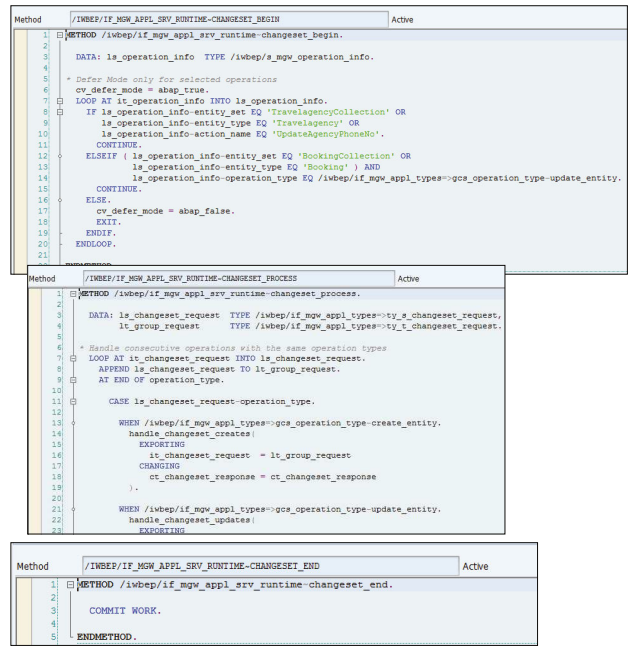

# SAP Fiori Certi Guide

****

****

# 1. SAP Fiori Strategy, Standards, and GuideLines

****


## UX 의 중요성

* 사용자 참여 / 생산성 향상
* 간단한 UI 로 교육 비용 절감, 신규 직원 생산성 향상
* 프로세스 규정 준수 및 효율적인 프로세스 개선을 통한 감사 비용 감소
* 데이터 입력 중 오류 감소, 의사 결정에 도움이 되는 정확한 Report 생성 


## SAP 의 New UX 전략

기존 전략

* ### New

* ### Renew

* ### Empower


## Fiori  Application Types

* ### Transactional

  Task based 이며 business process 를 수행한다.

  CRUD 작업중 하나 이상이 있으며 app 과 back-end 간에 양방향 데이터 이동을 수반한다.

  **SAP HANA DB 가 필수는 아니지만 최적의 성능을 위해 권장한다.**

  

* ### Analytical

  **읽기 전용 앱**으로 일반적으로 SAP HANA 의 기능을 사용하여 숫자 크런칭, 데이터 시각화, 미래 예측 등의 사용 사례를 해결한다.

  SAP 에서 제공되는 KPI Modeler 를 사용하여 프로그래밍 없이 KPI 그래프/차트 를 생성할 수 있다.

  기본 제공되는 KPI 도 존재한다.

  **SAP HANA 가 데이터베이스로 필요하다.**

  

* ### Fact Sheet

  Business object 또는 Business transaction 에 대한 상황별 정보를 표시한다.

  이 앱들은 보통 실행 타일이 없다.

  대신 검색 결과를 클릭하거나 다른 Transactional / Analytical / Fact Sheet App 에서 사용할 수 있는 다양한 드릴다운 링크를 클릭하여 실행된다.

  다른 Transactional app 에 대한 링크도 제공한다.

  (ex. 구매 주문 정보 시트 앱에서 구매 요청을 구매 주문으로 변환하는 트랜잭션 앱으로 이동할 수 있다.)

  **읽기 전용 앱**으로 데이터를 CDS view 로 보며 UI rendering annotation 을 사용한다.

  **SAP HANA 가 데이터베이스로 필요하다.**

  

  

## SAP Fiori 주요 설계 원칙

* ### Role-based apps

* ### Adaptive

* ### Simple

* ### Coherent

* ### Delightful


## UX Design

* ### Visual design

* ### Information archtecture

* ### Interaction Design

* ### Usability

* ### Accesibility

* ### Human-computer interation


## Design Thinking process

### 세가지 요소

* ### Multidisciplinary teams

* ###  Design Thinking workshop

* ### Creative and collaborative space

### 두가지 영역

* ### Problem Space

  * Understand
  * Observe
  * Point of View

* ### Solution Space

  * Ideate
  * Prototype
  * Test


## De-composition and Re-composition

SAP Fiori 애플리케이션은 하나의 크고 복잡한 SAP 트랜잭션의 기능을 여러 Fiori 애플리케이션으로 분해할 수 있다. 이를 **De-composition** 이라 한다. 

여러 SAP 트랜잭션의 기능을 결합하여 전체 비즈니스 트랜잭션을 수행하는 SAP Fiori 애플리케이션을 만들 수도 있다. 이를 **Re-composition** 이라 한다.

SAP Fiori app 을 설계할 때는 system 이 고려 대상이 되는 경우는 거의 없다.오히려 사용자 중심적이다.

* ### Re-composition 

  SAP Fiori app 을 사용하면 GUI 의 여러 Transaction 의 기능을 결합하여 기능을 구축할 수 있다.

  **사용자 탐색의 감소 / 화면 상호 작용의 단순화**

  **=> 사용자 생산성 향상**

* ### De-composition

  다른 Role 을 가진 많은 사용자가 사용하는 일반적인 T-Code 는 각 Role에 대해 여러 앱으로 분할 될 수 있다. 

  SAP Fiori 는 Role-based 이기 때문에 사용자가 업무와 필요에 따라 작업을 수행할 수 있도록 필요한 화면 요소만 제공

  => 사용자 집중력 유지 / 효율적인 작업 


## SAP Build

맞춤형 SAP Fiori app 을 **설계**하고 **프로토타입**을 만들기 위해 구축된 **클라우드 기반 툴**이다.

* ### Inviting a Team

* ### Creating a Persona

* ### Creating a Prototype

* ### Creating a Study

  **Feedback**

  * Annotations
  * Text
  * Multiple choices
  * Perform action
  * prototype 을 직접 수정하지는 않는다. 


## SAP Fiori Stencils

Design stencils allow you to quickly design wireframes for your application. Wireframes and prototypes built with these stencils aren’t as elaborative as those built with SAP Build, but they can meet the need for quick prototypes.
SAP provides stencils in two flavors:

* ###  Design stencils for Axure RP

  Axure RP is a powerful tool for building interactive prototypes. Axure provides its own UI elements to build the prototype. However, if you want the prototype to have an SAP Fiori flavor, then you need to load the stencils provided by SAP into the Axure tool and use the UI elements provided by SAP to build your prototype.

* ###  Design stencils for Microsoft PowerPoint

  These are draft slides provided by SAP as PowerPoint slides. These slides can be edited, and UI elements can be moved to achieve the desired mock-ups. SAP provides only a limited number of controls and layouts as stencils for PowerPoint. Mock-ups created with these stencils don’t represent the SAP Fiori visual design exactly.


## SAP Fiori Design Guideline

* ### Message Handling

  **종류**

  * Error
  * Warning
  * Information
  * Success
  * Confirmation

  ### Message Elements

  * message popover

    서버 쪽 메시지를 자동으로 표시할 수 있다.

    page 하단에 버튼을 클릭시 올라와 여러 메시지 내역을 확인할 수 있는 것

    여러 메시지를 띄울 때 용의

    https://sapui5.hana.ondemand.com/sdk/#/entity/sap.m.MessagePopover/sample/sap.m.sample.MessagePopover

  * message box

  * message strip

    내가 개발한 app 에서도 사용한 것 

    특정 위치에 띄운후 끌 수 있는 message strip 을 생성

  * message toast

    시간이 지나면 자동으로 지워지는 message

  * message page

* ## Fiori Elements

  * ### 목표

    * Design consistency

    * Auto update of the apps per the latest design guidelines

      최신 design guidelines 에 따라 자동 update

    * Minimal or no frontend coding

      Front-end Code 의 최소화 

  * ### Floorplans from Back-end Annotation

    * List report
    * Object page
    * Overview page

     :heavy_check_mark:이부분은 ux 책 / Fiori design guideline 참고 하자

  * ### Fllorplans 

    :heavy_check_mark:이부분은 ux 책 / Fiori design guideline 참고 하자

  * ### Draft Handling and Lock Concept

    시스템에서 아직 activate 됮 않은 business object 또는 transaction 의 중간 버전이다.

    **Draft 의 목적 :**

    * 사용자가 언제든지 개체 작업을 중지하고 나중에 계속하도록 허용
    * app 또는 네트워크가 예기치 않게 종료될 경우 데이터 손실을 방지
    * Lock 기능 (동일한 비즈니스 문서를 동시 편집할 수 없도록함)


## Practice

## 1. Which of the following attributes <u>can’t</u> be associated with SAP Build?

 A. <u>***Cloud-based***</u> tool

 B. Used to build **<u>*complete responsive prototypes*</u>**

###  C. Enables writing JavaScript code for data binding in advanced mode

 D. Generates SAPUI5 **<u>*starter code*</u>** for the finalized prototype


## 2. This floorplan can be used to <u>guide the user</u> through the data entry process, one step at a time.

A. Overview page

B. Object page

C. Worklist

### D. Wizard


## 3. Which control is recommended to <u>show multiple messages</u> from the server on a form?

 A. sap.m.Dialog

 B. sap.m.MessageStrip

 C. sap.m.MessageBox

###  D. sap.m.MessagePopover


## 4. In SAP Build, you need to create the following object for getting feedback on the prototype from users.

 A. Feedback

###  B. Study

 C. Team

 D. Dialog


## 5. Which of the following is not an objective of the draft feature within SAP Fiori.

 A. Enable the lock feature.

 B. Allow the user to continue data entry at a later point in time.

 C. Prevent loss of data due to network failure.

###  D. Allow data review by peers.


## 6. Which application type provides information about a business object or a transaction?

 A. Transaction apps

 B. Analytical apps

###  C. Fact sheet apps


## 7. The process of combining the functionality of multiple GUI transactions into one SAP Fiori app is called decomposition.

###  A. True

 B. False


## 8. An overview page is made up of

 A. Tiles

###  B. Cards

 C. Charts

 D. Tables


## 9. SAP-provided SAP Fiori apps represent which part of SAP’s UX strategy?

 A. New

###  B. Renew

 C. Enable

 D. Empower


## 10. Which of these services are not part of SAP UX Design Services?

 A. Design Thinking workshops

 B. Advice on technologies

 C. Train the developers on Design Thinking

###  D. Train the end users on the application


## 11. Which of these key design principle talks about having a single UI language?

 A. Simple

###  B. Coherent

 C. Adaptive

 D. Delightful


## 12. Which apps are usually opened from search results or by clicking drilldown links within other SAP Fiori apps?

###  A. Fact sheet apps

 B. Analytical apps

 C. KPI apps

 D. Transactional apps


## 13. In a Design Thinking process, which of the following tasks belong to the problem space?

###  A. Understand

###  B. Observe

 C. Ideate

 D. Test


## 14. Which of the following is the final converging step in the solution space of Design Thinking process?

###  A. Test

 B. Point-of-view

 C. Prototype

 D. Ideate


## 15. In SAP Build, by using the Invite Team option, you send the study to users for feedback on the prototype. 

 A. True

###  B. False


## 16. What is the limitation of the SAP Build free trial?

 A. Limited time trial

 B. Limited number of team members

 C. Limited number of users

###  D. Limited number of active projects


## 17. In SAP Build, which of the following is not a valid feedback response?

 A. Free text

 B. Multiple-choice options

###  C. Editing the prototype

 D. Annotation on the prototype


## 18. Which of the following tools does not allow you to create responsive prototypes? 

## (응답형 prototype)

###  A. Microsoft PowerPoint stencils

 B. Axure stencils

 C. SAP Build


## 19. A message toast can be used in which of the following scenarios?

###  A. A message indicating a successful update

 B. A message asking the user to confirm an action
 C. A message warning the user
 D. A message informing the user that an action failed


## 20. Overview page can be displayed on the SAP Fiori launchpad.

 A. True

###  B. False

****


****

*****


# 2. SAP Fiori Architecture Overview

****


## Generic Archtecture

* ### Client

* ### SAP Web Dispatcher

  SAP Web App 시스템 간의 Load 를 분산 처리하는 역할

  특정 http 요청을 허용하거나 차단하는 스위치 역할

  SAP Fiori app 의 역방향 프록시 역할

* ### Frontend Server

* ### Backend Server

* ### Database

* ### SAP Cloud Platform

* ### SAP Fiori Cloud

* ### OData Provisioning

* ### SAP Mobile Service

* ### SAP Web IDE

* ### App Repository

* ### SAP Cloud Platform Cloud Connector


## SAP Fiori On-Premise


## SAP S/4 HANA

SAP Fiori 아키텍처는 SAP S/4 HANA 에서 

* ### One Archetype

* ### One user/authorization management

  분석 app 용 SAP Buisiness Suite 의 이전 아키텍처에서는 SAP HANA XS 계층에 직접 연결되어있었다.

  사용자와 사용자의 권한을 별도로 유지해야했다. 그러나 현 아키텍처에서는 SAP HANA 에 대한 모든 연결이 ABAP 계층 을 통해 이루어지며 SAP HANA 시스템에 직접 액세스 할 수 없다.

  따라서 별도의 사용자 목록을 유지하고 사용자의 권한을 처리할 필요가 없다.

* ### One business model

* ### One lifecycle to manage

* ### One protocol (OData) and one implementation layer (SAP Gateway)


## Data Flow in SAP Fiori for SAP S/4HANA Transactional Applications

* ### Data query

  ABAP CDS View 는 비지니스 객체의 모든 필수 데이터에 대해 모델링된다.

  이러한 CDS View 에는 SAP Fiori 요소에 속하는 컨트롤에 사용할 수 있도록 Annotation 도 표시된다.

  CDS View를 사용하면 Code Push Down technique 를 사용하여 쿼리 성능을 향상 시킬 수 있다. 

  모든 쿼리는 CDS View 를 통과한다.

  

* ### Draft handling

  비즈니스 객체를 변경하는 동안 사용자는 비즈니스 문서 / 개체를 중간에 저장한 다음 나중에 계속해야 하는 경우가 많다.

**BOPF**(**B**usiness **O**bject **P**rocessing **F**ramework) 는 비즈니스 객체를 모델링하고 Draft handling 을 포함한 App 개발의 모든 측면을 제공하는데 사용된다. 비즈니스 문서가 편집 또는 작성되는 즉시 Draft 버전이 작성된다.

변경 내용은 명시적으로 저장된 경우에만 실제 비즈니스 개체에 저장된다.

Draft handling 도 단일 비즈니스 개체에 대한 동시 처리에도 사용된다.

기존 비즈니스 개체의 초안은 한번에 하나만 허용된다. 

사용자가 편집 모드에서 개체를 열면 해당 개체의 임시 버전이 생성되어 사용자에게 할당된다. 

초안의 변경사항은 원래 오브젝트에 복사되고 사용자가 모든 변경사항을 저장할 때 초안이 삭제된다. 사용자가 변경사항을 명시적으로 저장하지 않는 한, 다른 사용자는 새로운 미발송 문서를 작성할 수 없으며 동일한 오브젝트를 편집할 수 없다.


## SAP Fiori Cloud

* ### Content of SAP Fiori Cloud

  * Runtime and configuration services
  * Lifecycle management services
  * Development services

* ### Architecture and Landscape

  * Internal access point 
  * External access point
  * Using OData Provisioning Service


## SAP Gateway Deployment Options

* ### Hub Deployment Option

  허브 배포 옵션에는 SAP Gateway 서버 기능에 사용할 수 있는 전용 SAP NetWeaver 서버가 있다. 

  * ### Multiple Routings

    여러 백엔드 시스템에 연결할 수 있다. 

    각 백엔드 시스템에는 해당 SAP Fiori 앱별 백엔드 소프트 웨어 구성 요소가 설치된다.

    이러한 다양한 SAP Fiori App 의 프런트 엔드 구성 요소는 허브 시스템에 설치된다. 

    허브시스템에서 호스팅 되는 SAP Fiori 런치패드는 SAP ERP 기반의 SAP Fiori 앱 뿐만 아니라 SAP CRM, SAP SRM 등의 다른 시스템도 보여준다. 

    

  * ### Separating the User Interface Lifecycle

  * ### Better Security and Authentication

* ### Embedded Deployment Option 

  * ### Less Runtime Overhead

  * ### No Extra System to Maintain

  * ### Disadvantage

    * 임베디드 시스템을 다른 비즈니스 시스템의 허브 시스템으로 사용하면 안 되기 때문에 더 이상 모든 비즈니스 시스템에 단일 통합 SAP Fiori 출시 패드를 사용할 수 없다.
    * SAP 백엔드 비즈니스 시스템은 자주 업그레이드할 수 없기 때문에 SAP 게이트웨이 시스템에 대한 혁신을 자주 가져올 수 없다.
    * HTTP 연결이 비즈니스 시스템에서 끝나 외부 인터넷 공격에 노출되므로 네트워크에서 추가 보안 조치를 확인해야 한다.

  

  * ### SAP Cloud Platform OData Provisioning

    SAP Cloud Platform의 OData Provisioning 서비스는 허브 구축 옵션에서 SAP Gateway 시스템을 대체한다.

    이 배포 옵션의 장점은 허브 배포 옵션과 유사하며, 이는 고객이 선호하는 배포 옵션 중 하나이다. 

    * ### Advantage

      * SAP 게이트웨이에 비해 총 소유 비용(TCO) 절감
      * 클라우드에서 빈번한 소프트웨어 업데이트
      * 자동화된 시스템 모니터링 및 관리 태스크
      * 필요할 때 클라우드의 일부가 되어 탄력성 확보


## SAP Fiori Launchpad Configuration

* ### Fiori launchpad designer

  * 정적, 동적 및 뉴스 타일 구성
  * 카탈로그 및 그룹을 만들고 여기에 타일 할당
  * 이 아티팩트를 transport requests에 할당


* ### Scope for Content Adaption

  * **CONF-configuration scope**

    configuration scope 는 교차 클라이언트이므로 시스템 별 설정을 참조한다. 

    SAP 에서 제공하는 모든 Standard Content 가 이 범위에 포함된다. 

    URL 매개변수 scope= 를 사용할 수 있다.

    

  * **CUST-customization scope**

    사용자 지정 범위는 클라이언트에 한정된다.

    URL 매개 변수 범위가 지정되지 않은 경우 모든 SAP Fiori Launchpad Designer 컨텐츠에 대한 기본범위이기도 하다.

    URL 매개 변수 scope= 를 사용할 수 있다.

    

  * **PERS-personalization scope**


* ### Fiori Catalog

  Role 에 할당될 애플리케이션 집합

  

* ### Fiori Group

  Role 통해 사용자에게 SAP Fiori 그룹이 할당되면 이러한 모든 SAP Fiori 앱이 그룹 제목과 함께 사용자의 SAP Fiori Launchpad 의 입력 페이지에 나타납니다.


## SAP Fiori Theming

* ### UI Theme Desinger

  **SAP Cloud Platform / on-premise / SAP Enterprise Portal** 에서 제공 되며 색 / logo / 배경을 변경하는데 사용할 수 있다.

  * ### Quick mode:

    가장 필요한 색상 / 배경 / 회사 로고를 편집

  * ### Expert mode:

    semantic parameters를 사용하여 속성을 변경할 수 있다.

    이러한 semantic parameters는 UI 전체에서 재사용되므로 테스트 하는 것이 중요

  * ### Palette: 

    팔레트를 사용하면 회사 색상을 정의하고 재사용할 수 있는 이름을 제공하므로 필요할 때마다 정의할 필요 없다.

  * ### CSS pane: 

    사용자 정의 CSS 를 삽입하여 SAP 테마 색상을 재정의할 수 있따.


## Maintaining Themes

/UI2/NWBC_CFG_CUST

“SAP_FLP” in the Filter field

enter “Theme” in the Parameter Name field

* ### Transporting Theme

  To transport the themes, you need to go to generic Transaction /UI5/ THEME_TOOL. This tool will list each of the custom themes created in the server. Against each theme name, it provides options such as **Info,** **Transport, Download, and Delete**, as shown in Figure 2.33.


## Practice

## 1. Which of the following is not one of the advantage of SAP Web Dispatcher?

 A. Acts as a switch to allow or block certain HTTP requests

 B. Performs load balancing

###  C. Replaces the SAP Gateway server

 D. Acts as a reverse proxy for SAP Fiori apps


## 2. What is true about an SAP Gateway server or frontend server in a hub architecture?

 A. It’s the same as the SAP business system server.

 B. This is where OData implementations are coded.

###  C. The SAP Fiori UI repository is located here.

 D. It can connect to only one SAP backend server.


## 3. In SAP Fiori architecture for SAP Business Suite systems, which type of application does not require an SAP Web Dispatcher? 

###  A. Transactional apps

 B. KPI apps

 C. Fact sheet apps

 D. Smart Business apps


## 4. Which of the following is not one of the advantages of the hub deployment architecture?

###  A. Lower TCO

 B. Better security

 C. Routing to multiple backend business systems

 D. Separation of innovation lifecycles


## 5. Which of the following describe the OData provisioning service? (2 correct answers)

 A. Provides an SAP Fiori UI repository to store app-specific UIs

###  B. Provides a way to register and expose OData services

###  C. Lowers TCO of the SAP Gateway landscape

 D. Used in the internal access point scenario of SAP Fiori Cloud


## 6. UI theme designer is available in which platforms? (3 correct answers)

###  A. SAP Cloud Platform

 B. SAP Mobile Platform

###  C. SAP Enterprise Portal

###  D. SAP ABAP Server (frontend server)

****

### SAP Enterprise Portal 

### SAP NetWeaver Application Server ABAP 

### SAP Cloud Platform 

****


## 7. UI theme designer cannot be used to perform which of the following?

 A. Use a CSS editor to change CSS properties to affect an SAPUI5 application

###  B. Add background images to tiles using Expert mode

 C. Add a custom logo to SAP Fiori launchpad

 D. Change the background color of a button when it is hovered over

****

A background image can’t be added to a tile using Expert mode. Instead, you need to use the **CSS section** of the UI theme designer, which isn’t recommended due to the high TCO involved.

****


## 8. Transaction /UI5/THEME_TOOL does not offer which of the following capabilities?

 A. Upload

 B. Download

 C. Transport

###  D. Copy


****


****

****

# 3. SAPUI5 Foundations

## Hook Method

### onInit  

### onExit 

### onAfterRendering

뷰가 렌더링 되면 호출

### onBeforeRendering.

onAfterRendering 과 비슷하지만 onInit() 이 사용되기 전이 아니라 컨트롤러의 뷰가 다시 렌더링 되기 전에 호출 된다.

onInit => onBeforeRendering => View Rendered => onAfterRendering 

=> 

Re-rendering => onBeforeRendering   

View destroy => onExit


## Component and Application Descriptor

* ### Component

  A component is a self-contained and reusable piece of code in an SAPUI5 application. Components are classified into the following two types:

  * UI components
    UI components have an associated UI part in addition to the application logic.
    These components inherit from the sap.ui.core.UIComponent class. An SAP Fiori app is an example of a UI component.
  * Faceless components
    Faceless components are code-only parts without any UI. They inherit from the sap.ui.core.Component class. For example, all the attachment-related functionality can be handled by a faceless component and reused across SAP Fiori apps.

  SAP Fiori apps are component-based apps, which means that in an SAP Fiori launchpad, an SAP Fiori app is represented by a component. Thus, components are entry
  points to SAP Fiori apps. Each SAP Fiori app will have one primary component,
  which will be registered with the SAP Fiori launchpad so that this component gets
  loaded upon clicking the corresponding SAP Fiori tile in the SAP Fiori launchpad.

* ### Metadata

  Before SAPUI5 version 1.30, a component’s metadata property was used to store several app-related settings and properties. From version 1.30, a new application descriptor file called manifest.json was introduced, and all app-specific settings were moved to that file. Component.js will contain a reference to manifest.json, as shown in Listing 3.13, directing the SAPUI5 framework to fetch settings from there.

  ```js
  sap.ui.core.Component.extend("certification.fiori.Component", {
    "metadata": {
        "manifest": "json"
    }
  });
  ```

  * ### init

    This method will be called only once per component instance while the component is getting initialized. This method is rarely called explicitly; rather, it’s called automatically by the SAPUI5 framework. You can use this method to perform any one-time operations related to the component or the app.

  * ### createContent

    As the method name indicates, this method creates the content of the component. This method should return a hierarchy of SAPUI5 controls, representing the UI part of the component.


* ### manifest.json

  다양한 구성 및 속성을 가진 파일이다. W3C 사양인 웹 앱 manifest 에서 영감을 받았다.
  
  표준에 따르면 manifest 파일은 개발자가 app 의 속성을 제어하고 애플리케이션 관련 메타 데이터를 저장할 수 있는 중앙 장소를 제공하는 JSON 기반 파일이어야한다.
  
  manifest.json 파일은 Component.js 와 동일한 수준의 SAPUI5 app 루트에 생성해야한다. 
  
  OData 모델이 인스턴스화 될 때마다 먼저 모델의 메타데이터를 로드한다. manifest.json 의 속성을 사용하여 메타데이터를 미리 로드하여 앱 성능을 향상 시킬 수 있다. JSON 및 XML 모델의 경우, 데이터 소스가 외부 URL 에서 온 경우, 사전 로드 기능은 구성 요소 로드와 함께 전체 데이터를 로드하므로 성능이 향상된다.
  
  그러나 데이터가 앱 내에서 로컬에 있는 경우 component-preload.js 에서 데이터를 이미 사용할 수 있으므로 사전 로드 기능은 의미가 없다.
  
  동일한 이유로 리소스 모델에 사전 로드 기능을 사용하면 안된다. 
  
  
  
  | Attribute Name             | Attribute Description                                        |
  | -------------------------- | ------------------------------------------------------------ |
  | **sap.app**                | 응용 프로그램 별 특성을 포함                                 |
  | sap.app.id (필수)          | SAP Fiori App 의 네임 스페이스                               |
  | sap.app.type               | 구성하려는 앙목을 정의                                       |
  | sap.app.i18n               | resource bundle 파일 경로                                    |
  | sap.app.title              | 앱의 resource bundle 에서 참조하는 app 제목                  |
  | sap.app.description        | 응용 프로그램이 수행하느 간단한 설명 텍스트                  |
  | sap.app.applicationVersion | 응용 프로그램 버전                                           |
  | **sap.ui**                 | UI 관련 속성 제공                                            |
  | sap.ui.technology          | UI 기술을 지정 SAPUI5 사용                                   |
  | sap.ui.deviceTypes         | 앱에서 지원하는 기기 기본값은 모두 true                      |
  | **sap.ui5**                | sap.ui5 네입 스페이스는 SAPUI5 에 의해 자동으로 처리되는 SAPUI5 관련 구성 매개 변수를 추가 |
  | rootView                   | component 가 자동으로 view 를 인스턴스화 하고 이것을 루트로 사용 |
  | dependencies               | app에 사용 된 UI 라이브러리를 선언                           |
  | models                     | 설명자의 이 섹션에서는 app 이 시작될 때 SAPUI5 에 의해 자동으로 인스턴스화 될 모델을 정의<br/>로컬 resource bundle 을 정의 할 수 있다. 모델 "i18n"의 이름을 키로 정의하고 namespace 로 번들 파일을 지정한다. <br/>이전 단계에서와 마찬가지로 번역된 텍스트가 있는 파일은 i18n 폴더에 지정되고 i18n.properties 로 이름이 지정된다. |
  
  

143 참조


## Data Binding

| Binding Mode Models | One-Way | Two-Way | One-Time | Default  |
| :------------------ | :-----: | :-----: | :------: | -------- |
| JSON                |    X    |    X    |    X     | Two-Way  |
| XML                 |    X    |    X    |    X     | Two-Way  |
| OData               |    X    |    X    |    X     | One-Way  |
| Resource            |         |         |    X     | One-Time |


## Routing

일반적인 SAPUI5 App 은 여러 view 들을 포함하고 있으며 use case 는 여러 view 들에 걸쳐 있는 것이 일반적이다.

SAPUI5 의 routing API 들은 view 를 탐색하고 차후 App states 가 direct 하게 방문될 수 있게 하는 bookmarkable URL 을 생성하는 기능을 제공한다.


## Routing in Classical Web Applications

Classical web applications은 일반적으로 여러 page 들을 포함하며 routing 은 server side 에서 처리된다. 

사용자는 다른 URL 을 명시적으로 호출하여 다른 web page 들을 요청한다.   

여기서 큰 단점중 하나는 현재 페이지가 이전 페이지와 약간만 다르더라도 전체 웹 페이지를 다시 로드하고 서버에서 다시 렌더링해야 한다는 것이다.

SAPUI5 와 같은 단일 페이지 App framework 들은 이름에서 알 수 있듯이 한 페이지만 포함한다. 

화면 변경은 client side 에서 동일한 페이지 내에서 서로 다른 SAPUI5 control 을 동적으로 로드하여 처리한다.  즉, 사용자는 한 페이지 내에서만 탐색한다. 

하지만 차후 다시 망문하기 위해 해당 URL 을 bookmark 할 수 있도록 응용프로그램의 다양한 탐색 상태에 대해 URL 을 갖는 것이 중요하다. 

탐색은 server path 또는 URL parameter 대신 URL 의 hash 에 반영된다. 

탐색이 발생할 때마다 hash 앞의 URL 내용은 변경되지 않고 대신 hash 이후의 내용만 변경된다는 점에 유의

hash 후 URL 변경 시 브라우저는 서버에서 페이지를 다시 로드하지 않으므로 서버에서 페이지를 다시 로드하지 않고 다른 탐색 상태가 자체 URL 을 가질 수 있으며 더 나은 사용자 환경을 제공한다.

이러한 해시 변경은 렌더링할 control / view 를 결정하기 위해 응용 프로그램에 의해 캡쳐된다. 

SAPUI5 App 에서 Router class 는 해시에 대한 모든 변경 사항을 캡처하고 라우터 구성에 따라 다른 view 를 로드한다. 

또한 라우터는 기록을 추적하여 이전 및 이후 탐색에 도움이 된다. 

또한 라우터는 해시를 업데이트 하지 않고 기록을 업데이트 하지 않고 탐색을 수행할 수 있는 방법을 제공한다.


## Routing Configuration

Routing Configuration 은 SAPUI5 App 의 manifest.json 의 일부이다.

여기서는 앱 내에서 사용 가능한 다양한 경로를 구성하고 다양한 route 및 관련 configuration에 대해 인스턴스화할 view 를 SAPUI5 framework 에 지시한다.

Routing Configuration 은 App 의  component 에서도 지정될 수 있지만 더 이상 **권장하지 않는다.** 

High level 에서 routing 을 구성하는 세가지 속성이 있다. 

### Three properties to configure the routing

| Property    | Description                                                  |
| ----------- | ------------------------------------------------------------ |
| **config**  | 이 parameter 은 global routing configuration parameter 를 정의하며 여러 route 와 target 을 위한 기본 값을 정의한다.<br/>sap.ui.core.routing.Router 는 routerClass 속성의 기본 라우팅 클래스이다.<br/>sap.ui.core.routing.Router 의 subclass 인 custom routing class 를 사용할 수 있다. <br/>custom routing class 를 정의하면 custom parameter 를 정의하고 routing 내에서 이러한 parameter 를 처리하는 방법에 대한 동작을 정의할 수 있다. <br/>Property **viewType** 은 앱 전체에서 사용되는 default view type 을 정읳나다. <br/>**viewPath** 는 모든 view 가 위치한 기본 폴더를 정의한다. <br/>**controlId** 와 **controlAggregation** 은 각각의 view 가 rendering 되는 control 의 ID 와 Aggregation 을 정의한다. |
| **routes**  | App 내에서 서로 다른 유효한 route 와 navigation 의 array 이다. <br/>pattern 은 현 경로가 유효한 URL 의 hash 부분에 대한 패턴을 정의한다. pattern 과 일치하는 첫 번째 경로가 선택된다. <br/>**route 들의 순서가 중요하다.** <br/>이름은 경로에 대한 고유한 ID 를 제공하므로 이 이름을 참조하여 프로그래밍 방식으로 주소를 지정할 수 있다. <br/>대상은 URL 해시가 패턴과 일치할 때 표시할 하나 이상의 대상을 정의할 수 있다. |
| **targets** | 각 target 은 이름 을 가진 후 view 를 지정한다. <br/>대상을 선택하면 지정된 view 가 인스턴스화 되고 controlId의 controlAggregation 에 추가된다. <br/>여러 경로에서 단일 대상을 사용할 수 있다. <br/>viewLevel 은 view 가 표시될 때 애니메이션 효과를 결정하는 속성이다.<br/>target 은 route와 연관되지 않고 프로그램적으로 앱에 직접 표시될 수 있다. <br/>이름이 notFound 인 대상을 표시하기 위한 샘플 코딩은 다음과 같다. <br/>this.getRouter().getTargets().display("notFound"); |


## Initialize Routing

App 전체에서 사용할 수 있도록 component 에서는 routing 은 명시적으로 initialize 되어야 한다. 

manifest.json 에 입력한 configuration 은 router 를 인스턴스화 하는 동안 로드된다. 

인스턴스화는 App 당 한번만 수행되므로 다음과 같이 Component.js 의 init 메서드에 배치된다. 

```js
init: function () {
    // call parent's init
    UIComponent.prototype.init.apply(this, arguments);
    // Initialize the router
    this.getRouter().initialize();
}
```


## Three different events that trigger navigation and subsequent steps

* URL 에 대한 hash 가 바뀔 때 (bookmark 입력 또는 선택), SAPUI5 framework 는 routing configuration 을 고려하여 App 에 display 할 target 을 선택한다.

* Router 의 navTo(`route_name`) method 가 호출되면 SAPUI5 framework 는 router configuration 을 고려하여 URL hash 를 업데이트 하고 구성된 target 으로 이동한다.

* getTargets().display(`target_name`) 가 호출 되면 SAPUI5 framewokr 는 router configuration 을 고려하여 지정된 target 으로 이동한다.

  이번에는 URL 해시가 변경되지 않는다. 


## Practice


## 1. You need to set the binding context explicitly for a page and all its child controls. Which binding type would you use?

 A. Aggregation binding 

###  B. Element binding 

 C. Property binding

 D. Resource binding


## 2. Which is a widely used SAPUI5 view type while building an SAP Fiori app?

 A. JSON view

 B. JavaScript view

###  C. XML view

 D. HTML view


## 3. Which of the following is the file name for the descriptor for applications, components, and libraries?

 A. app_descriptor.json

###  B. manifest.json

 C. application.xml

 D. i18n.properties


## 4. Which lifecycle event would you use if you need a hook every time a view is rendered?

###  A. onAfterRendering

 B. onAfterShow

 C. onInit

 D. onAfterViewRender


## 5. Which model is used to fetch data from the server and update data into the server?

###  A. OData model

 B. JSON model

 C. XML model

 D. Resource model


## 6.Which form factor is suggested for nontouch scenarios?

###  A. Compact

 B. Compress

 C. Cozy

 D. Bigger


## 7. In a JavaScript view, this method returns a tree of SAPUI5 controls to be part of the view.

 A. getContent

 B. buildControlTree

 C. getController

###  D. createContent


## 8. Which OData version is supported by SAPUI5 OData sap.ui.model.odata.ODataModel?

 A. V1

###  B. V2

 C. V3

 D. V4

****

삭제되었다.

sap.ui.model.odata.v2.ODataModel

사용

****


## 9. Which is the default file in the internationalization (i18n) folder?

###  A. i18n.properties

 B. i18n_default.properties

 C. i18n_en.properties

 D. i18n_de.properties


## 10. Which of the following is not an advantage of an MVC pattern?

 A. Reusability

 B. Code readability

###  C. Better performance

 D. Increased speed of development


## 11. True or False: It’s always better to use expression binding wherever possible.

 A. True

###  B. False 


## 12. As of SAPUI5 version 1.44, which of the following is an advantage of using AMD syntax.

 A. Better performance

 B. Better code readability

###  C. Future compatibility with asynchronous module loading

 D. Reduced bandwidth usage 


## 13. In this root tag of an XML view, which is the default namespace? 

 A. sap.ui.core.mvc

###  B. sap.m

 C. sap.ui.commons.layout

 D. sap.ui.commons 


## 14. Routing configuration can be specified in which two of the following places.  

 A. Controller

###  B. Component

###  C. manifest.json

 D. Index.htm 

****

manifest 에서 하기를 권장한다.

****


## 15. True or False: A fragment, when included as part of an existing view, inherits the model as well as the binding context. 

###  A. True

 B. False

****


****

****

# 4. SAP Cloud Platform and SAP Web IDE 

12


## Practice

## 1. Which is the recommended tool for developing and extending SAP Fiori apps?

 A. Eclipse Mars

###  B. SAP Web IDE => BAS

 C. SAP Cloud Connector

 D. Git


## 2. Which of the following is not a benefit of cloud computing?

 A. Scalability (확장성)

 B. Cost benefit (비용적 이익)

 C. Reliability (신뢰성)

###  D. Application performance

****

* Cost benefit
* Flexibility
* Reliabilty
* Security
* Scalability

****


## 3. Which of the following is not offered as a of cloud service?

 A. Platform

 B. Software

###  C. Training

 D. Infrastructure


## 4. Neo is an SAP Cloud Platform environment based on open source technology and standard. True or False?

 A. True

###  B. False

****

SAP 전용 환경 및 기술

****


## 5. Which of the following is not a feature provided by SAP Web IDE? 무시

###  A. Multiple workspaces to manage and organize your code

 B. Ability to perform Application Build

 C. Provides a graphical editor to create an XML view

 D. Provides a mock server to work with test data


## 6. When you want to update the committed code in your local repository into the remote repository, which command would you run?

 A. Commit

 B. Pull

###  C. Push

 D. Update


## 7. Which of the following is a valid way to import applications into SAP Web IDE? 무시

 A. Import from Eclipse SAPUI5 plug-in

 B. Import from a different SAP Web IDE’s workspace

###  C. Import from a different SAP Cloud Platform’s Git repository

 D. Import from subversion (SVN)


## 8. What is the extension of an OData model metadata file?

###  A. .edmx

 B. .xml

 C. .json

 D. .exe


## 9. Which file contains the minified version of application files?

 A. application-preload.js

 B. library-preload.js

 C. project-preload.js

###  D. component-preload.js

****

component-preload.js에는 파일의 최소 버전이 포함되어 있다. 이것은 응용 프로그램 빌드가 발생할 때 생성된다.

****


## 10. Which folder contains the file component preload.json?

###  A. dist

 B. webapp

 C. project

 D. app


## 11. Which view type can be visualized from layout editor?

 A. JSON

 B. JavaScript

###  C. XML

****

layout editor

****


## 12. Which of the following is not a feature of SAP Web IDE multi-cloud version on SAP Cloud Platform?

 A. Grunt task runner available

 B. A Multitarget application can be created

###  C. Register the app to On-premise SAP Fiori launchpad

 D. Import from SAP Build

****


****

****

# 5. OData and Advanced Data Handling


## $Batch

UI 는 여러 정보를 한 번에 Update 하기 위해 back-end 에 여러번 호출할 준비가 되어있다. 

이러한 경우 Batch 요청을 사용할 수 있다.

배치 요청은 여러 요청을 **하나의 HTTP POST** 요청에 결합한다.

$Batch 는 여러 HTTP 요청을 제거함으로써 UX 의 속도를 높일 수 있다.

Batch request body 에는 여러 Query / Change operation 이 포함될 수 있다.

또한 데이터 일관성을 유지하려면 변경 요청 집합이 **모두 성공하거나 하나라도 실패시 Rollback** 해야 하는 시나리오가 있다. 

이러한 단일 요청 그룹을 **changeset** 이라 한다.

단일 changeset 은 다른 changeset 을 포함할 수 없다.

Batch request 의 response body 에는 각 Retrieve / Change operation 에 대한 응답을 포함된다.

back-end 가 Batch request 를 처리할 수 있는 한 response status code는 202-Accepted 이다. (개별 요청 상태는 중요하지 않음)

changeset request 의 response body 는 성공 또는 실패를 나타내는 단일 응답이거나, 성공적인 처리의 경우 내부의 각 변경 집합 작업에 대해 하나의 응답을 가질 수 있다.

change set request 의 어떤 하나라도 실패 한다면 error 를 포함한 한개의 response 만이 있다.    


## Implementation: SAP Gateway

Batch 호출에는 구현이 필요 없다. 

SAP Gateway framework 는 각 Retrieve 또는 Update 작업에 해당하는 API 를 호출한다. 

Batch 요청 내의 여러 Retrieve 작업은 서로 독립적이기 때문에 **성능을 최적화**하기 위해 **병렬로 실행**된다. 

configuration 을 사용하여 서비스 또는 전 시스템 에서 병렬화를 비활성화 할 수 있다.

changeset 내의 전체 작업 집합이 backend 의 단일 API를 사용하여 처리될 수 있는 경우 성능 관점에서 유용할 수 있다. 

여러 작업을 한번에 처리할 수 있는 각 엔티티에 대해 SAP Gateway framework 에 정보를 제공하여 이러한 호출에 대한 일반 작업  performing method 들을 자동으로 호출하지 않도록 해야한다. 

이는 CV_DEFER_MODE 라는 변수를 설정하여 메서드 CHANGESET_BEGIN 에서 수행되며, 변수 CV_DEFERED_MODE 를 true 로 설정한 후 framework 에서 method CHANGESET_PROCESS 를 호출하여 해당 구현 코드를 실행한다.

마지막으로 CHANGESET_END 메서드에서 COMMIT WORK 를 호출하여 모든 변경사항을 커밋한다. 




## Implementation: SAPUI5 

sap.ui.model.odata.v2.ODataModel 에서는 백엔드에 대한 모든 호출이 기본적으로 Batch 요청으로 전송된다.

OData 모델을 인스턴스화 하는 동안 useBatch 매개 변수를 사용하여 이 기능을 비활성화할 수 있다. 

SAP Fiori 앱의 manifest.json 파일에도 입력할 수 있다.  


## Grouping Batch Calls

CRUD OData V2 Model 의 API를 사용하여 작업이 트리거 될 때마다 각 API 에는 groupid 라는 parameter 가 있다. 

OData 호출을 배치로 그룹화 하는 데 사용할 수 있다.

groupId 가 동일한 작업은 backend 로 단일 Batch 요청으로 번들 된다. 

groupid 는 다음과 같이 바인딩에도 할당될 수 있으므로 동일한 groupid 를 가지 바인딩에서 트리거 되는 모든 요청이 함께 전송된다. 

{pa}


Grouping Batch Calls
Whenever an operation is triggered using any of the OData V2 model’s APIs such as create, update, remove, and read, each of these APIs have a parameter called groupId. This can be used to group OData calls as batches. Operations with the same groupId will be bundled as a single batch request to the backend.
groupIds can be assigned to bindings as well, as shown here, so that all requests triggering from the bindings with the same groupIds are sent together:

{path:"/SalesOrders", parameters: {groupId: "myFirstGroup"}}

In these cases, all batch requests are formed and sent at the end of the current call stack. All operations that don’t have a groupId assigned are grouped together with a default groupId. However, you might require a better control on batch requests and might want to trigger a batch request only at a specific instance. SAP provides an API for this. All the batchIds that need to be triggered in a controlled manner must be specified in an API setDeferredGroups as follows:
oModel.setDeferredGroups(["myFirstGroup", "myThirdGroup"]);
Now, to trigger a batch request for a specific groupId, you need to call an API submitChanges and specify the groupId under which all the requests are grouped. Here is a sample submitChanges call:
oModel.submitChanges({groupId:"myFirstGroup",success: mySuccessHandler, error: myErrorHandler});
In the preceding case, only requests with batchId as myFirstGroup will be sent as a single batch request.


Change Sets
Consider a scenario where you need to send multiple Change operations (Create/ Delete/Update) as a single logical unit of an operation, which means that either all of them should succeed or none of them should succeed to keep the data consistent.
For such scenarios, SAPUI5 offers the concept of changesets, which are similar to groupIds. With all the Change operations, you can specify a changeSetId in addition to groupId. All the Change operations with the same changeSetId will be sent as a single changeset within a batch request. If changeSetId isn’t specified, then each change will have its own changeSetId.


Download/Get File
It’s a common requirement to show or download an attachment from the server.
An entity needs to model for media operations with properties describing the content of the download. This entity needs to be marked as Media as shown in Figure 5.18.


## Practice

## 1. In an OData service, this is usually cached in the browser as well as in the SAP Gateway layer.

 A. Query

 B. Service operation

###  C. Metadata

 D. Read


## 2. Which of the following cannot be bookmarked in an SAP Fiori app?

 A. Filters

 B. Dialogs

 C. Tabs

###  D. None

****

* Views / Business Objects
* Tabs
* "Search" Results (Filters)
* Dialogs

****


## 3. Which of the following concepts is used to group multiple OData change requests as a single logical operation?

 A. Batch

 B. Group

###  C. Change set

 D. Expand


## 4. If an OData operation does not fit into any of Create/Read-Query/Update/Delete, then which of the following options can be used?

 A. Function modules

 B. Service operations

 C. Metadata update

 D. Deep Insert


## 5. Within the MPC, which of the following methods is triggered upon metadata request.

 A. DEFINE

 B. GET_METADATA

 C. DEFINE_META

 D. GET_ENTITIES


## 6. An $expand URL will contain which of the following to represent the child entities?

 A. Child entity set name

 B. Navigation property name

 C. Association name

 D. Child entity name


## 7. How does the SAP Gateway framework determine if the create request is a single entity create or a Deep Insert?

 A. URL contains navigation properties

 B. HTTP headers

 C. URL ends with key word “Deep”

 D. Request body contains the parent as well as child Entity data


## 8. Which is the right place to declare router configurations?

 A. manifest.json

 B. index.html

 C. Component.js

 D. router.js


## 9. Which events get triggered in a facet filter upon the user completing the selection of facet filter values (or closing the facet filter dialog)? (2 possible answers)

 A. Confirm

 B. ListOpen

 C. ListClose

 D. Reset

****


****

****

# 6. Extensibility in SAPUI5

11 


****


****

****

# 7. Deployment

9 


****


****

****

# 8. SAP Hybrid App Toolkit

7 


****


****

****

# 9. Testing

5

