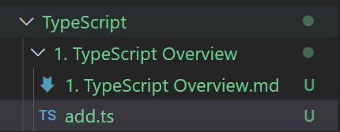
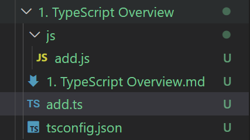
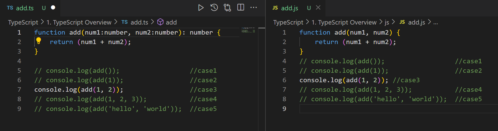

# TypeScript Overview


## TypeScript

> TypeScript 는 JS 호환되며 JS 기능을 그대로 사용할 수 있으며 TypeScript 만의 문법이 추가된 JS 의 슈퍼셋이다. 
>
> TypeScript 는 ***<u>Compiled Language</u>*** 이다.
>
> * TypeScript 는 JS 와 달리 브라우저에서 실행하려면 파일을 한번 Compile 해주어야 한다.
> * 전통적인 ***<u>Compiled Language 와는 다른점이 많다.</u>*** 
> * 그래서 ***<u>Transpile</u>*** 이라는 용어를 사용하기도 한다. 
>
> Javascript 는 ***<u>Interpreted Language</u>*** 이다.
>
> 
>
> ```js
> function add(num1, num2) {
>     return (num1 + num2);
> }
> 
> console.log(add()); 				//case1
> console.log(add(1)); 				//case2
> console.log(add(1, 2));				//case3
> console.log(add(1, 2, 3));			//case4
> console.log(add('hello', 'world'));	//case5
> ```
>
> 위와 같은 경우 console 에는 이 찍히게 된다.
>
> `NaN`
>
> `NaN`
>
> `3`
>
> `3`
>
> `helloworld` 
>
> 가 찍히게 된다. 
>
> js 코드의 함수 add 의 parameter 인 `num1` 과 `num2` 에 어떤 타입의 값도 들어갈 수 있다.
>
> case1 의 경우 `undefined` 두개가 더해지게 되어 `NaN` 을 반환하게 된다. 
>
> case4 의 경우 앞의 1 과 2 가 `num1` 과 `num2` 의 값이 되어 계산 된다. 이 경우 `1+2+3` 을 예상한 개발자는 add(num1, num2, num3) 형식의 함수가 정의되지 않았다는 사실을 모를 수 있다. 
>
> ```typescript
> function add(num1, num2) {
>     return (num1 + num2);
> }
> 
> console.log(add()); 				//case1
> console.log(add(1)); 				//case2
> console.log(add(1, 2));				//case3
> console.log(add(1, 2, 3));			//case4
> console.log(add('hello', 'world'));	//case5
> ```
>
> TypeScript 에서 같은 코드를 작성하면 `num1` 과 `num2` 는  `any` 타입으로 정의 되고 case1/2/4 에서 오류가 발생한다는 것을 알 수 있다.
>
> ```typescript
> function add(num1:number, num2:number): number {
>     return (num1 + num2);
> }
> 
> console.log(add()); 				//case1
> console.log(add(1)); 				//case2
> console.log(add(1, 2));				//case3
> console.log(add(1, 2, 3));			//case4
> console.log(add('hello', 'world'));	//case5
> ```
>
> 이 경우  `num1` 과 `num2` 는  `number` 타입으로 정의 되어 case5 에서도 오류가 발생하는 것을 알 수 있다. 


## Compiled Language / Interpreted Language

> |               |   Compiled Language    |    Interpreted Language    |
> | ------------- | :--------------------: | :------------------------: |
> | 컴파일 필요   |           O            |             X              |
> | 컴파일러 필요 |           O            |             X              |
> |               | 컴파일된 결과물을 실행 | 코드 자체를 실행 => 런타임 |


## 정적 타입 언어 / 동적 타입 언어

> * ### 정적 타입 언어
>
>   C / C# / C++ / Java 와 같이 Type 을 Compile 시에 결정하는 언어들이다. 
>
>   이들 언어는 변수에 들어갈 값의 Type 을 지정해 주어야 한다. 
>
>   Compile 시 변수 Type 에 맞지 않은 값이 들어있을 시 Compile Error 가 발생한다. 
>
> * ### 동적 타입 언어
>
>   JavaScript / Ruby / Python 등과 같이 Compile 시 Type을 정하는 것이 아닌 실행시 결정하는 것이다. 
>
>   Run time 까지 Type 에 대한 결정을 끌고 갈 수 있기 때문에 많은 선택의 여지가 있다. 
>
>   실행 도중 변수에 예상치 못한 Type 이 들어와 Type Error 를 발생시키는 경우가 생길 수 있다. 


## Traditional Compiled Language

> * Compile 언어라고 한다. 
> * C / C++ / C# / Go / Java .... 등이 있다.
> * 프로그래머가 작성한 ***<u>Source Code</u>*** 를 기계어로 변환하는 과정을 ***<u>Compile</u>*** 이라고 한다.
> * 기계어로 변환된 결과물을 ***<u>Object Code</u>*** 라 한다. 
> * ***<u>Compile</u>*** 하는 프로그램을 *<u>**Compiler**</u>* 라 한다.  
> * Compile 하는 동안을 ***<u>Compile Time</u>*** 이라 한다.
> * 컴파일된 코드는 프로세서에 따라 다르다.
> * 소스 코드에서는 OS 에 따라 라이브러리가 다르다.
> * 컴파일된 코드는 작은 크기에 최적화 된다. 
> * 일반적으로 실행시 기계어를 바꾸는 방식(Interpreted Language) 보다 빠르다. 
>   * 실행시 기계어로 바꿔주는 연산이 필요 없기 때문 


## TypeScript  개발 환경 구축 

> * ### node.js
>
>   Chrome's VB JavaScript Engine 을 사용하여 자바스크립트를 해석하고 OS 레벨에서의 API 를 제공하는 서버사이드 용 JS 런타임 환경
>
> * ### Browser
>
>   HTML 을 동적으로 만들기 위해 브라우저에서 자바스크립트를 해석하고 DOM 을 제어할 수 있도록 하는 자바스크립트 런타임 환경


## TypeScript 컴파일 하기 

> ```typescript
> function add(num1:number, num2:number): number {
>     return (num1 + num2);
> }
> 
> //console.log(add()); 					//case1
> //console.log(add(1)); 					//case2
> console.log(add(1, 2));					//case3
> //console.log(add(1, 2, 3));			//case4
> //console.log(add('hello', 'world'));	//case5
> ```
>
> 위 코드를 `add.ts` 파일로 생성후 compile 해보자.
>
> 
>
> `tsc --target es6 --outDir js add.ts` 를 통해 `--target es6` 를 통해 ECMAScript 대상 버전을 es6 로 지정하고 `--outDir js` 를 통해 js 폴더를 별도로 만들어 컴파일한 코드 파일을 해당 폴더에 생성하도록 하였다. 
>
> 
>
> 
>
> ###  [다양한 타입스크립트 컴파일러 옵션](https://typescript-kr.github.io/pages/compiler-options.html)