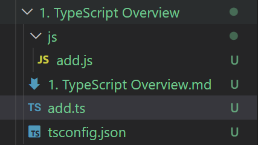

# TypeScript Overview


## TypeScript

> TypeScript 는 JS 호환되며 JS 기능을 그대로 사용할 수 있으며 TypeScript 만의 문법이 추가된 JS 의 슈퍼셋이다. 
>
> TypeScript 는 ***<u>Compiled Language</u>*** 이다.
>
> * TypeScript 는 JS 와 달리 브라우저에서 실행하려면 파일을 한번 Compile 해주어야 한다.
> * 전통적인 ***<u>Compiled Language 와는 다른점이 많다.</u>*** 
> * 그래서 ***<u>Transpile</u>*** 이라는 용어를 사용하기도 한다. 
>
> Javascript 는 ***<u>Interpreted Language</u>*** 이다.
>
> 
>
> ```js
> function add(num1, num2) {
>     return (num1 + num2);
> }
> 
> console.log(add()); 				//case1
> console.log(add(1)); 				//case2
> console.log(add(1, 2));				//case3
> console.log(add(1, 2, 3));			//case4
> console.log(add('hello', 'world'));	//case5
> ```
>
> 위와 같은 경우 console 에는 이 찍히게 된다.
>
> `NaN`
>
> `NaN`
>
> `3`
>
> `3`
>
> `helloworld` 
>
> 가 찍히게 된다. 
>
> js 코드의 함수 add 의 parameter 인 `num1` 과 `num2` 에 어떤 타입의 값도 들어갈 수 있다.
>
> case1 의 경우 `undefined` 두개가 더해지게 되어 `NaN` 을 반환하게 된다. 
>
> case4 의 경우 앞의 1 과 2 가 `num1` 과 `num2` 의 값이 되어 계산 된다. 이 경우 `1+2+3` 을 예상한 개발자는 add(num1, num2, num3) 형식의 함수가 정의되지 않았다는 사실을 모를 수 있다. 
>
> ```typescript
> function add(num1, num2) {
>     return (num1 + num2);
> }
> 
> console.log(add()); 				//case1
> console.log(add(1)); 				//case2
> console.log(add(1, 2));				//case3
> console.log(add(1, 2, 3));			//case4
> console.log(add('hello', 'world'));	//case5
> ```
>
> TypeScript 에서 같은 코드를 작성하면 `num1` 과 `num2` 는  `any` 타입으로 정의 되고 case1/2/4 에서 오류가 발생한다는 것을 알 수 있다.
>
> ```typescript
> function add(num1:number, num2:number): number {
>     return (num1 + num2);
> }
> 
> console.log(add()); 				//case1
> console.log(add(1)); 				//case2
> console.log(add(1, 2));				//case3
> console.log(add(1, 2, 3));			//case4
> console.log(add('hello', 'world'));	//case5
> ```
>
> 이 경우  `num1` 과 `num2` 는  `number` 타입으로 정의 되어 case5 에서도 오류가 발생하는 것을 알 수 있다. 


## Compiled Language / Interpreted Language

> |               |   Compiled Language    |    Interpreted Language    |
> | ------------- | :--------------------: | :------------------------: |
> | 컴파일 필요   |           O            |             X              |
> | 컴파일러 필요 |           O            |             X              |
> |               | 컴파일된 결과물을 실행 | 코드 자체를 실행 => 런타임 |


## 정적 타입 언어 / 동적 타입 언어

> * ### 정적 타입 언어
>
>   C / C# / C++ / Java 와 같이 Type 을 Compile 시에 결정하는 언어들이다. 
>
>   이들 언어는 변수에 들어갈 값의 Type 을 지정해 주어야 한다. 
>
>   Compile 시 변수 Type 에 맞지 않은 값이 들어있을 시 Compile Error 가 발생한다. 
>
> * ### 동적 타입 언어
>
>   JavaScript / Ruby / Python 등과 같이 Compile 시 Type을 정하는 것이 아닌 실행시 결정하는 것이다. 
>
>   Run time 까지 Type 에 대한 결정을 끌고 갈 수 있기 때문에 많은 선택의 여지가 있다. 
>
>   실행 도중 변수에 예상치 못한 Type 이 들어와 Type Error 를 발생시키는 경우가 생길 수 있다. 


## Traditional Compiled Language

> * Compile 언어라고 한다. 
> * C / C++ / C# / Go / Java .... 등이 있다.
> * 프로그래머가 작성한 ***<u>Source Code</u>*** 를 기계어로 변환하는 과정을 ***<u>Compile</u>*** 이라고 한다.
> * 기계어로 변환된 결과물을 ***<u>Object Code</u>*** 라 한다. 
> * ***<u>Compile</u>*** 하는 프로그램을 *<u>**Compiler**</u>* 라 한다.  
> * Compile 하는 동안을 ***<u>Compile Time</u>*** 이라 한다.
> * 컴파일된 코드는 프로세서에 따라 다르다.
> * 소스 코드에서는 OS 에 따라 라이브러리가 다르다.
> * 컴파일된 코드는 작은 크기에 최적화 된다. 
> * 일반적으로 실행시 기계어를 바꾸는 방식(Interpreted Language) 보다 빠르다. 
>   * 실행시 기계어로 바꿔주는 연산이 필요 없기 때문 


## TypeScript  개발 환경 구축 

> * ### node.js
>
>   Chrome's VB JavaScript Engine 을 사용하여 자바스크립트를 해석하고 OS 레벨에서의 API 를 제공하는 서버사이드 용 JS 런타임 환경
>
> * ### Browser
>
>   HTML 을 동적으로 만들기 위해 브라우저에서 자바스크립트를 해석하고 DOM 을 제어할 수 있도록 하는 자바스크립트 런타임 환경


## TypeScript 컴파일 하기 

> ```typescript
> function add(num1:number, num2:number): number {
>     return (num1 + num2);
> }
> 
> //console.log(add()); 					//case1
> //console.log(add(1)); 					//case2
> console.log(add(1, 2));					//case3
> //console.log(add(1, 2, 3));			//case4
> //console.log(add('hello', 'world'));	//case5
> ```
>
> 위 코드를 `add.ts` 파일로 생성후 compile 해보자.
>
> 
>
> `tsc --target es6 --outDir js add.ts` 를 통해 `--target es6` 를 통해 ECMAScript 대상 버전을 es6 로 지정하고 `--outDir js` 를 통해 js 폴더를 별도로 만들어 컴파일한 코드 파일을 해당 폴더에 생성하도록 하였다. 
>
> 
>
> 
>
> ###  [다양한 타입스크립트 컴파일러 옵션](https://typescript-kr.github.io/pages/compiler-options.html)


## tsconfig.json

> ```json
> {
>   "compilerOptions": {
>     /* Visit https://aka.ms/tsconfig to read more about this file */
> 
>     /* Projects */
>     // "incremental": true,                              /* Save .tsbuildinfo files to allow for incremental compilation of projects. */
>     // "composite": true,                                /* Enable constraints that allow a TypeScript project to be used with project references. */
>     // "tsBuildInfoFile": "./.tsbuildinfo",              /* Specify the path to .tsbuildinfo incremental compilation file. */
>     // "disableSourceOfProjectReferenceRedirect": true,  /* Disable preferring source files instead of declaration files when referencing composite projects. */
>     // "disableSolutionSearching": true,                 /* Opt a project out of multi-project reference checking when editing. */
>     // "disableReferencedProjectLoad": true,             /* Reduce the number of projects loaded automatically by TypeScript. */
> 
>     /* Language and Environment */
>     "target": "es2016",                                  /* Set the JavaScript language version for emitted JavaScript and include compatible library declarations. */
>     // "lib": [],                                        /* Specify a set of bundled library declaration files that describe the target runtime environment. */
>     // "jsx": "preserve",                                /* Specify what JSX code is generated. */
>     // "experimentalDecorators": true,                   /* Enable experimental support for legacy experimental decorators. */
>     // "emitDecoratorMetadata": true,                    /* Emit design-type metadata for decorated declarations in source files. */
>     // "jsxFactory": "",                                 /* Specify the JSX factory function used when targeting React JSX emit, e.g. 'React.createElement' or 'h'. */
>     // "jsxFragmentFactory": "",                         /* Specify the JSX Fragment reference used for fragments when targeting React JSX emit e.g. 'React.Fragment' or 'Fragment'. */
>     // "jsxImportSource": "",                            /* Specify module specifier used to import the JSX factory functions when using 'jsx: react-jsx*'. */
>     // "reactNamespace": "",                             /* Specify the object invoked for 'createElement'. This only applies when targeting 'react' JSX emit. */
>     // "noLib": true,                                    /* Disable including any library files, including the default lib.d.ts. */
>     // "useDefineForClassFields": true,                  /* Emit ECMAScript-standard-compliant class fields. */
>     // "moduleDetection": "auto",                        /* Control what method is used to detect module-format JS files. */
> 
>     /* Modules */
>     "module": "commonjs",                                /* Specify what module code is generated. */
>     "rootDir": "./",                                  /* Specify the root folder within your source files. */
>     // "moduleResolution": "node10",                     /* Specify how TypeScript looks up a file from a given module specifier. */
>     // "baseUrl": "./",                                  /* Specify the base directory to resolve non-relative module names. */
>     // "paths": {},                                      /* Specify a set of entries that re-map imports to additional lookup locations. */
>     // "rootDirs": [],                                   /* Allow multiple folders to be treated as one when resolving modules. */
>     // "typeRoots": [],                                  /* Specify multiple folders that act like './node_modules/@types'. */
>     // "types": [],                                      /* Specify type package names to be included without being referenced in a source file. */
>     // "allowUmdGlobalAccess": true,                     /* Allow accessing UMD globals from modules. */
>     // "moduleSuffixes": [],                             /* List of file name suffixes to search when resolving a module. */
>     // "allowImportingTsExtensions": true,               /* Allow imports to include TypeScript file extensions. Requires '--moduleResolution bundler' and either '--noEmit' or '--emitDeclarationOnly' to be set. */
>     // "resolvePackageJsonExports": true,                /* Use the package.json 'exports' field when resolving package imports. */
>     // "resolvePackageJsonImports": true,                /* Use the package.json 'imports' field when resolving imports. */
>     // "customConditions": [],                           /* Conditions to set in addition to the resolver-specific defaults when resolving imports. */
>     // "resolveJsonModule": true,                        /* Enable importing .json files. */
>     // "allowArbitraryExtensions": true,                 /* Enable importing files with any extension, provided a declaration file is present. */
>     // "noResolve": true,                                /* Disallow 'import's, 'require's or '<reference>'s from expanding the number of files TypeScript should add to a project. */
> 
>     /* JavaScript Support */
>     // "allowJs": true,                                  /* Allow JavaScript files to be a part of your program. Use the 'checkJS' option to get errors from these files. */
>     // "checkJs": true,                                  /* Enable error reporting in type-checked JavaScript files. */
>     // "maxNodeModuleJsDepth": 1,                        /* Specify the maximum folder depth used for checking JavaScript files from 'node_modules'. Only applicable with 'allowJs'. */
> 
>     /* Emit */
>     // "declaration": true,                              /* Generate .d.ts files from TypeScript and JavaScript files in your project. */
>     // "declarationMap": true,                           /* Create sourcemaps for d.ts files. */
>     // "emitDeclarationOnly": true,                      /* Only output d.ts files and not JavaScript files. */
>     // "sourceMap": true,                                /* Create source map files for emitted JavaScript files. */
>     // "inlineSourceMap": true,                          /* Include sourcemap files inside the emitted JavaScript. */
>     // "outFile": "./",                                  /* Specify a file that bundles all outputs into one JavaScript file. If 'declaration' is true, also designates a file that bundles all .d.ts output. */
>     "outDir": "./build",                                   /* Specify an output folder for all emitted files. */
>     // "removeComments": true,                           /* Disable emitting comments. */
>     // "noEmit": true,                                   /* Disable emitting files from a compilation. */
>     // "importHelpers": true,                            /* Allow importing helper functions from tslib once per project, instead of including them per-file. */
>     // "importsNotUsedAsValues": "remove",               /* Specify emit/checking behavior for imports that are only used for types. */
>     // "downlevelIteration": true,                       /* Emit more compliant, but verbose and less performant JavaScript for iteration. */
>     // "sourceRoot": "",                                 /* Specify the root path for debuggers to find the reference source code. */
>     // "mapRoot": "",                                    /* Specify the location where debugger should locate map files instead of generated locations. */
>     // "inlineSources": true,                            /* Include source code in the sourcemaps inside the emitted JavaScript. */
>     // "emitBOM": true,                                  /* Emit a UTF-8 Byte Order Mark (BOM) in the beginning of output files. */
>     // "newLine": "crlf",                                /* Set the newline character for emitting files. */
>     // "stripInternal": true,                            /* Disable emitting declarations that have '@internal' in their JSDoc comments. */
>     // "noEmitHelpers": true,                            /* Disable generating custom helper functions like '__extends' in compiled output. */
>     // "noEmitOnError": true,                            /* Disable emitting files if any type checking errors are reported. */
>     // "preserveConstEnums": true,                       /* Disable erasing 'const enum' declarations in generated code. */
>     // "declarationDir": "./",                           /* Specify the output directory for generated declaration files. */
>     // "preserveValueImports": true,                     /* Preserve unused imported values in the JavaScript output that would otherwise be removed. */
> 
>     /* Interop Constraints */
>     // "isolatedModules": true,                          /* Ensure that each file can be safely transpiled without relying on other imports. */
>     // "verbatimModuleSyntax": true,                     /* Do not transform or elide any imports or exports not marked as type-only, ensuring they are written in the output file's format based on the 'module' setting. */
>     // "allowSyntheticDefaultImports": true,             /* Allow 'import x from y' when a module doesn't have a default export. */
>     "esModuleInterop": true,                             /* Emit additional JavaScript to ease support for importing CommonJS modules. This enables 'allowSyntheticDefaultImports' for type compatibility. */
>     // "preserveSymlinks": true,                         /* Disable resolving symlinks to their realpath. This correlates to the same flag in node. */
>     "forceConsistentCasingInFileNames": true,            /* Ensure that casing is correct in imports. */
> 
>     /* Type Checking */
>     "strict": true,                                      /* Enable all strict type-checking options. */
>     // "noImplicitAny": true,                            /* Enable error reporting for expressions and declarations with an implied 'any' type. */
>     // "strictNullChecks": true,                         /* When type checking, take into account 'null' and 'undefined'. */
>     // "strictFunctionTypes": true,                      /* When assigning functions, check to ensure parameters and the return values are subtype-compatible. */
>     // "strictBindCallApply": true,                      /* Check that the arguments for 'bind', 'call', and 'apply' methods match the original function. */
>     // "strictPropertyInitialization": true,             /* Check for class properties that are declared but not set in the constructor. */
>     // "noImplicitThis": true,                           /* Enable error reporting when 'this' is given the type 'any'. */
>     // "useUnknownInCatchVariables": true,               /* Default catch clause variables as 'unknown' instead of 'any'. */
>     // "alwaysStrict": true,                             /* Ensure 'use strict' is always emitted. */
>     // "noUnusedLocals": true,                           /* Enable error reporting when local variables aren't read. */
>     // "noUnusedParameters": true,                       /* Raise an error when a function parameter isn't read. */
>     // "exactOptionalPropertyTypes": true,               /* Interpret optional property types as written, rather than adding 'undefined'. */
>     // "noImplicitReturns": true,                        /* Enable error reporting for codepaths that do not explicitly return in a function. */
>     // "noFallthroughCasesInSwitch": true,               /* Enable error reporting for fallthrough cases in switch statements. */
>     // "noUncheckedIndexedAccess": true,                 /* Add 'undefined' to a type when accessed using an index. */
>     // "noImplicitOverride": true,                       /* Ensure overriding members in derived classes are marked with an override modifier. */
>     // "noPropertyAccessFromIndexSignature": true,       /* Enforces using indexed accessors for keys declared using an indexed type. */
>     // "allowUnusedLabels": true,                        /* Disable error reporting for unused labels. */
>     // "allowUnreachableCode": true,                     /* Disable error reporting for unreachable code. */
> 
>     /* Completeness */
>     // "skipDefaultLibCheck": true,                      /* Skip type checking .d.ts files that are included with TypeScript. */
>     "skipLibCheck": true                                 /* Skip type checking all .d.ts files. */
>   }
> }
> 
> ```
>
> `tsc --init` 을 통해 tsconfig.json 파일을 생성할 수 있다. 
>
> 해당 파일을 통해 ts 파일을 .js 파일로 컴파일 할 때 사용할 세부 설정이 가능하다. 
>
> ```json
> {
>  "compilerOptions": {
> 
>   "target": "es5", // 'es3', 'es5', 'es6', 'es2015', 'es2016', 'es2017','es2018', 'esnext' 가능
>   "module": "commonjs", //무슨 import 문법 쓸건지 'none', 'commonjs', 'amd', 'umd', 'system', 'es6'/'es2015',
>      					//						'es2020', 'es2022', 'esnext', 'node16', 'nodenext'
>   "allowJs": true, // js 파일들 ts에서 import해서 쓸 수 있는지 
>   "checkJs": true, // 일반 js 파일에서도 에러체크 여부 
>   "jsx": "preserve", // tsx 파일을 jsx로 어떻게 컴파일할 것인지 'preserve', 'react-native', 'react'
>   "declaration": true, //컴파일시 .d.ts 파일도 자동으로 함께생성 (현재쓰는 모든 타입이 정의된 파일)
>   "outFile": "./", //모든 ts파일을 js파일 하나로 컴파일해줌 (module이 none, amd, system일 때만 가능)
>   "outDir": "./", //js파일 아웃풋 경로바꾸기
>   "rootDir": "./", //루트경로 바꾸기 (js 파일 아웃풋 경로에 영향줌)
>   "removeComments": true, //컴파일시 주석제거 
> 
>   "strict": true, /* Enable all strict type-checking options. */
>   "noImplicitAny": true, //any타입 금지 여부
>   "strictNullChecks": true, //null, undefined 타입에 이상한 짓 할시 에러내기 
>   "strictFunctionTypes": true, //함수파라미터 타입체크 강하게 
>   "strictPropertyInitialization": true, //class constructor 작성시 타입체크 강하게
>   "noImplicitThis": true, //this 키워드가 any 타입일 경우 에러내기
>   "alwaysStrict": true, //자바스크립트 "use strict" 모드 켜기
> 
>   "noUnusedLocals": true, //쓰지않는 지역변수 있으면 에러내기
>   "noUnusedParameters": true, //쓰지않는 파라미터 있으면 에러내기
>   "noImplicitReturns": true, //함수에서 return 빼먹으면 에러내기 
>   "noFallthroughCasesInSwitch": true, //switch문 이상하면 에러내기 
>  }
> }
> ```
>
> ***<u>[tsconfig Reference](https://www.typescriptlang.org/tsconfig)</u>*** 에서 자세한 내용을 확인할 수 있다. 

