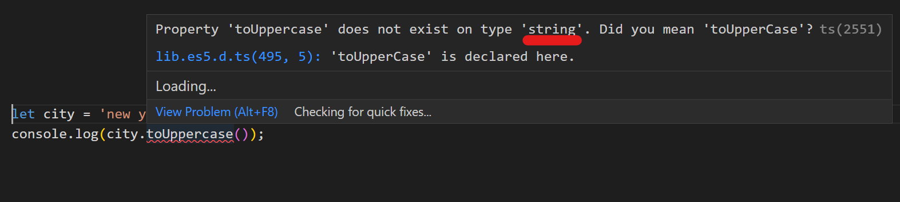
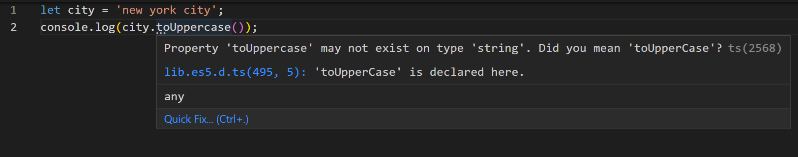
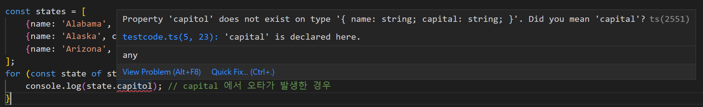

# TypeScript 와 JavaScript 의 관계

> ## TypeScript = JavaScript 의 superset
>
> 타입 스크립트는 타입이 정의된 자바스크립트의 superset 이다.
>
> JavaScript 프로그램에 문법 적 오류가 없다면 유효한 TypeScript 프로그램이라 할 수 있다.
>
> js 프로그램에 어떤 이슈가 존재한다면 문법적 오류가 아니더라도 타입 체커에게 지적당할 가능성이 높다.  
>
> 그러나 ***<u>문법의 유효성과 동작의 이슈는 독립적인 문제</u>***이다.
>
> => 이런 이슈가 존재하더라도 타입스크립트는 여전히 작성된 코드를 파싱하고 자바스크립트로 변환할 수 있다. (item 3 에서 자세히 다룸)
>
> 
>
> ts 는 js 의 superset 이다.
>
> * => .js 파일의 코드는 이미 ts 라 할 수 있다. (ex_ main.js 를 main.ts 로 확장자를 바꾼다 해도 달라지는 것은 없다.)
>
>   => 기존 코드를 그대로 유지 / 일부분만 ts 적용 가능
>
>   => 마이그래이션 하는데 큰 이점 
>
>   (8장에서 자세히 다룸)
>
> * ts 는 타입을 명시하는 ***<u>추가적인 문법을 가진다</u>***.
>
>   => 명제 `js 프로그램이다. => ts 프로그램이다.` 의 역은 성립 X
>
>   (item 53 에서 자세히 다룸)
>
>   ex)
>
>   ```ts
>   function greet(who: string) {		// 타입을 명시하는 문법 구문
>       console.log('Hello', who);
>   }
>   ```
>
>   위와 같은 ts 프로그램은 js 를 구동하는 node 같은 프로그램에서 오류를 출력한다.
>
>   ```ts
>   function greet(who: string) {
>      				  ^
>   SyntaxError: Unexpected token: 
>   ```
>
>   
>
> 
>
> ## 정적 타입 언어 ts 와 type checker
>
> ts compiler 는 ts 뿐 아니라 일반 js 프로그램에도 유용하다. 
>
> ex)
>
> ```js
> let city = 'new york city';
> console.log(city.toUppercase());
> // TypeError: city.toUppercase is not a function
> ```
>
> 위 코드에는 type 구문은 없지만 ts 의 타입 체커는 문제점을 찾아낸다.
>
> `city` 변수가 string 타입이라는 것을 명시하지 않아도 ts 는 초깃값 `'new york city'` 로 부터 ***<u>타입 추론</u>*** 을 한다. 
>
> (타입 추론에 대해서는 3장에서 자세히 다룬다.)
>
> 
>
> > js 파일에 동일한 코드를 작성할 경우 
> >
> > 
>
> 그러나 타입 체커가 모든 오류를 찾아내지는 않는다.
>
> 오류가 나지 않지만 의도와 다르게 동작하는 코드도 있다.
>
> ```js
> const states = [
>     {name: 'Alabama', capital: 'Montgomery'},
>     {name: 'Alaska', capital: 'Juneau'},
>     {name: 'Arizona', capital: 'Phoenix'},
> ];
> for (const state of states) {
>     console.log(state.capitol); // capital 에서 오타가 발생한 경우 
> }
> ```
>
> 앞의 코드는 유효한 js 코드이며 어떠한 오류도 없다. 
>
> 다만 `state` 내에 `capitol` 이라는 property 는 존재하지 않으므로 `undefined` 가 출력된다. (의도와 다르게 동작 / 오류발생 X)
>
> 타입체커는 추가적인 type 구문 없이도 오류를 찾아내며 해결책을 제시한다. 
>
> 
>
> capitol 과 capital 의 위치를 바꾸는 경우에도 같은 방식으로 해결책을 제시한다. 
>
> => 어떤것이 오타인지 까지는 타입체커도 확인 불가
>
> => 오류의 원인을 추측 할 수는 있지만 항상 정확하지는 않다.
>
> => 따라서 명시적으로 states 를 선언하여 의도를 분명히 !!
>
> ```ts
> interface State {
>     name: string;
>     capital: string;
> }
> const states: State[] = [
>     {name: 'Alabama', capitol: 'Montgomery'}, // 오류
>     {name: 'Alaska', capital: 'Juneau'},
>     {name: 'Arizona', capital: 'Phoenix'},
> ]
> ```
>
> ```
> Type '{ name: string; capitol: string; }' is not assignable to type 'State'.
>   Object literal may only specify known properties, but 'capitol' does not exist in type 'State'. Did you mean to write 'capital'?
> ```
>
> => `interface` 구문 없이 `const states = [{name: 'Alabama', capitol: 'Montgomery'}, {name: 'Alaska', capital: 'Juneau'}, {name: 'Arizona', capital: 'Phoenix'},]` 와 같이 작성되었다면 오류가 발생하지 않았을 것이다.
>
> => `interface` 를 통한 명시적 선언을 통해 오류의 위치와 해결책을 좀더 명확히 찾을 수 있다.  
>
> 
>
> 모든 js 는 ts 이지만 일부 js 만이 타입체크를 통과한다. 
>
> 
>
> 
>
> 일부는 js 와 동일하게 동작하며 타입체크를 통과하는 반면
>
> ```ts
> const x = 2 + '3';  // string / '23'
> const y = '2' + 3;  // string / '23'
> ```
>
> 아래와 같은 코드는 타입 체크를 통과하지 못한다. 
>
>  ```ts
>  const a = null + 7			 	// js any 7		ts The value 'null' cannot be used here.
>  const b = [] + 12				// js any 12	ts Operator '+' cannot be applied to types 'never[]' and 'number'.
>  alert('Hello', 'TypeScript');	// js 오류X 첫번째 par만	 ts Expected 0-1 arguments, but got 2.
>  ```
>
> js 런타임 동작을 모델링하는 것은 ts 타입 시스템의 기본 원칙 
>
> 하지만 그것 뿐 아니라 위처럼 의도치 않은 이상한 코드가 오류로 이어질 수 있다는 것을 고려 필요
>
> 
>
> => 언제 js 런타임 동작을 그대로 모델링할지 또는 타입체크를 할지 분명하지 않음 => 타입 스크립트를 사용해도 되는가? 
>
> 한가지 확실한건 ***<u>의도를 확실하게 명시한 ts 코드</u>***는 ts 의 도움으로 오류가 적은 코드를 완성할 수 있다. 
>
> 
>
> ```ts
> const names = ['Alice', 'Bob'];
> console.log(names[2].toUpperCase());
> ```
>
> 타입 체크 통과  but 실행시 오류 (js 에서도 오류)
>
> 타입체크를 통과 했다는 점을 지적하고 싶은 것 같다. 
>
> `any` 을 사용할 때도 예상치 못한 오류가 자주 발생한다.  (item 5 , 5장 참고)
>
>  
>
> 이와 같은 경우들의 근본 원인은 ***<u>ts 가 이해하는 값의 type 과 실제 값에 차이</u>***가 있기 때문 
>
> ts 의 type 시스템이 정적 타입의 정확성을 보장해 줄 것 같지만 그렇지 않다.
>
> *<u>**애초에 타입 시스템은 그런 목적으로 만들어지지도 않았다.**</u>* 
>
> 