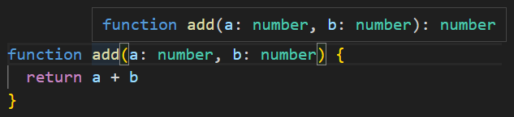
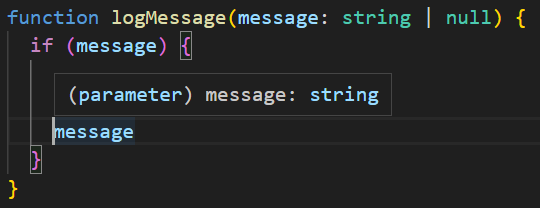
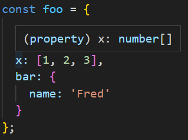

backgroundImage: url(../../IMG/프레젠테이션1.png)
# header: ''
# footer: ''
---

<style>
  h1 {
    font-size: 60px;
  }
  h2 {
    font-size: 30px;
  }  
  h3 {
    font-size: 28px;
    padding-bottom: 10px;
  }
  section {
    font-size: 20px;
  }  
</style>

<br/>
<br/>
<br/>
<br/>


# 편집기를 사용하여 타입 시스템 탐색

---

## 언어 서비스
* 코드 자동완성
* 명세(사양, specification) 검사/검색/리펙터링
* TypeScript Compiler (tsc) editor 를 통해 사용
* TypeScript Server(tsserver) 언어 서비스 설정 권장


---

### 언어 서비스의 효과

* **Symbol 의 Type 확인**
  ```ts
  let num = 10;
  // num 에 호버링시 
  // let num: number
  // 변수 type 추론
  ```
  
  ```ts
  function add(a: number, b: number) {
    return a + b
  }
  // add 에 호버링 시
  // function add(a: number, b: number): number
  // return type 추론
  ```

---

* **Return Type 추론** 

  

---

### Type 확인_1

* **조건문의 분기 별 Type**

  


* **Object 속성 Type**

  


## 타입 시스템이 동작하는 방식 / 타입 추론의 개념을 이해할 수 있다.


## ts 가 동작을 어떻게 모델링 하는지 알기 위해 타입 선언 파일을 찾아보는 법도 터득
