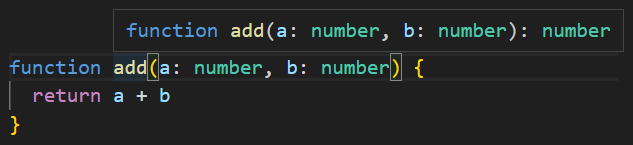
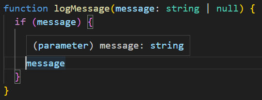
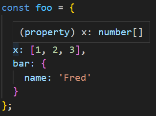

# 편집기를 사용하여 타입 시스템 탐색

---

## 언어 서비스
* 코드 자동완성
* 명세(사양, specification) 검사/검색/리펙터링
* TypeScript Compiler (tsc) 
* TypeScript Server(tsserver) 언어 서비스 설정 권장

---

### Type 확인_1

* **Symbol 의 Type 확인**

  

* **Return Type 추론** 

  

---

### Type 확인_1

* **조건문의 분기 별 Type**

  

* **Object 속성 Type**

  

## 타입 시스템이 동작하는 방식 / 타입 추론의 개념을 이해할 수 있다.

## ts 가 동작을 어떻게 모델링 하는지 알기 위해 타입 선언 파일을 찾아보는 법도 터득
