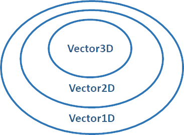

<style>
  h1 {
    font-size: 60px;
  }
  h2 {
    font-size: 30px;
  }  
  h3 {
    font-size: 28px;
    padding-bottom: 10px;
  }
  section {
    font-size: 20px;
  }  
</style>

<br/>
<br/>
<br/>
<br/>

# 타입이 값들의 집합이라고 생각하기

---


## Type = 값들의 집합

<br/>

* ### never = ∅

  never 로 선언된 변수에는 어떤 값도 할당할 수 없다. 

  ```ts
  const x: never = 12;
  // 어떤 값을 넣어도 never 에 할당할 수 없다는 에러가 발생
  ```
<br/>

* ### Unit Type

  한가지 값만 포함하는 리터럴 타입
  ```ts
  type a = 'a';
  type b = 'b';
  type Twelve = 12;
  let Num: Twelve = 13;
  // Type '13' is not assignable to type '12'.
  ```

---


## Type = 값들의 집합

<br/>

* ### Union type


  타입들의 합집합 
  ```ts
  type ab = 'a' | 'b';
  type ab12 = 'a' | 'b' | 12;
  const C: ab = 'c';
  //Type '"c"' is not assignable to type 'ab'.
  ```
  `C` 는 "c" 단일 값으로 구성된 unit 타입 
  ab 의 부분집합이 아니므로 오류 

<br/>

* ### 개념 확장
  
  **Type = 할당 가능한 값들의 집합** 
  
  **Type Check = 하나의 집합이 다른 집합의 부분 집합인지 검사**
  
  

---


## Type 의 관점으로 본 interface

  <br/>

* ### Type 의 관점으로 본 Interface

  ```ts
  interface Person {
    name: string;
  }
  let jihoon: Person = {
    name: 'Jihoon'
  }
  ```

  ''`string` 으로 이루어진 name 이라는 속성을 가지고 있는 객체" 는 Person 타입이라고 할 수 있다.

  <br/>

* ### 덕타이핑

  객체가 어떤 타입에 부합하는 변수와 메서드를 가질 경우 객체를 해당 타입에 속하는 것으로 간주하는 방식

  => 어떤 타입에 부합하는 변수와 메서드를 가질 경우 해당 타입의 집합에 속한다.

---

## Type 의 관점으로 본 interface

* ### keyof(A&B) = keyof(A)|keyof(B) 

  `obj` 가 `A&B` Type 이다. 

  <=> `obj` 가 `A&B` 에 속한다.. 

  <=> `obj` 가 `A` 에 속하며 `B` 에도 속한다.. 

  <=> `obj` 가 `A` 의 속성을 모두 가지고 있으며 `B` 의 속성도 모두 가지고 있다.

---

## Type 의 관점으로 본 interface

* ### keyof(A&B) = keyof(A)|keyof(B) 

  ```ts
  interface Person {
      firstName: string;
      lastName: string;
  }
  interface Lifespan {
      birth: Date;
      death?: Date;
  }
  
  type PersonSpan1 = Person & Lifespan
  
  let jihoon1: PersonSpan1 = {
      firstName: 'Jihoon',
      lastName: "Chae"
      death: new Date()
  }// 오류
  
  let jihoon1_1: PersonSpan1 = {
      firstName: "Jihoon",
      lastName: "Chae",
      birth: new Date(),
      death: new Date(),
  }
  ```

---

## Type 의 관점으로 본 interface

* ### keyof(A|B) = keyof(A)&keyof(B) ???

  `obj` 가 `A|B` Type 이다. 

  <=> `obj` 가 `A|B` 에 속한다.

  <=> `obj` 가 `A` 에 속하거나 `B` 에 속한다.

  <=> `obj` 가 `A` 의 속성을 모두 가지고 있거나 `B` 의 속성을 모두 가지고 있다.

---

## Type 의 관점으로 본 interface

* ### keyof(A|B) = keyof(A)&keyof(B) ???

  ```ts
  interface Person {
    firstName: string;
    lastName: string;
  }
  interface Lifespan {
    birth: Date;
    death?: Date;
  }
  type PersonSpan2 = Person | Lifespan
  
  let jihoon2: PersonSpan2 = {
    firstName: 'Jihoon',
    death: new Date()
  }//오류
  
  let jihoon2_2: PersonSpan2 = {
    firstName: 'Jihoon',
    lastName: "Chae",
    death: new Date()
  }
  ```

  But keyof(A|B) 의 타입은 `never`

  `keyof` 로 타입을 정할 경우 해당 object type 의 common property 들의 타입들을 반환

  `A|B` 의 경우 common property 특정 불가 => `never` 타입 반환???
  

---

## 집합의 관점으로 본 extends

* ### extends 키워드의 이해

  PersonSpan 을 선언하는 조금더 일반적인 방법은 extends 
  
  ```ts
  interface Perons {
   name: string;
  }
  interface PersonSpan extends Person {
   birth: Date;
   death?: Date;
  }
  ```
  
  
  <br/>


* ### `extends A` <=> "A 의 부분집합"

  PersonSpan 타입의 모든 값은 문자열 name 속성을 가져야한다. **(`Person` Type 만족)**

  \+ birth 속성을 가져야 한다. 

  `타입 = 집합` 관점에서 `extends` 의 의미는  '~의 부분집합' 이라는 의미


---

## 집합의 관점으로 본 extends

* ### 예시

  ```ts
  interface Vector1D {x: number;}
  interface Vector2D extends Vector1D {y: number;}
  interface Vector3D extends Vector2D {z: number;}
  ```

  <=>

  ```ts
  interface Vector1D {x: number;}
  interface Vector2D {x: number; y: number;}
  interface Vector3D {x: number; y: number; z: number;}
  ```

  

---

## 집합의 관점으로 본 extends

* ### Generic Type
  <!-- ```ts
  function getKey_1<K>(val: any, key: K) {
    //...
  }
  getKey_1<number>({}, 1);
  ``` -->
  ```ts
  function getKey_1<K extends string>(val: any, key: K) {
    //...
  }
  getKey_1({}, 'x');
  getKey_1({}, Math.random() < 0.5 ? 'a' : 'b');
  getKey_1({}, 12);
  // Argument of type 'number' is not assignable to parameter of type 'string'.
  getKey_1<number>({}, 12);
  // Type 'number' does not satisfy the constraint 'string'.
  ```
  **`extends A` <=> "A 의 부분집합"**

  Generic type은 extends 의 부분집합에 해당하는 Type만을 사용가능

---

## 집합의 관점으로 본 extends

* ### Generic Type 예시
  ```ts
  interface point {
    x: number;
    y: number;  
  }
  type pointKeys = keyof Point; // Type is 'x' | 'y'
  
  function sortBy<K extends keyof T, T>(vals: T[], key: K): T[] {
    vals.sort((a, b) => (a[key] === b[key] ? 0 : a[key] < b[key] ? -1 : +1));
    return vals;
  }
  
  const pts: Point[] = [
    { x: 1, y: 1 },
    { x: 2, y: 0 },
  ];
  
  sortBy(pts, 'x')
  sortBy(pts, Math.random() < 0.5 ? 'x' : 'y')
  sortBy(pts, 'z') //Argument of type '"z"' is not assignable to parameter of type 'keyof Point'
  ```
  `K extends keyof T` 
  
  `pts` 에 의해 `T` 는 `Point` => `K extends keyof Point`
  
  => `keyof Point` 타입인 `'x'|'y'` 의 부분집합만 사용가능

---

## 집합의 관점으로 본 array / tuple Type

* ### array 와 tuple 의 포함 관계
  ```ts
  const list = [1,2] // number[] Type
  const tuple : [number, number] = list // Type 'number[]' is not assignable to type 'number,number]'.
  // Target requires 2 elements but source may have fewer
  ```

  Index 의 수와 각 Index 값의 Type 이 동일해도 tuple type 에 array type 의 값을 할당할 수 없다.

  반대로 

  Index 의 수와 각 Index 값의 Type 이 동일하면 array type 에 tuple type 의 값을 할당할 수 있다.. 

---

## 집합의 관점으로 본 array / tuple Type

* ### undefined
  ```ts
  const triple: [number, number, number] = [1, 2, 3];
  const double: [number, number] = triple
  // Type '[number, number, number]' is not assignable to type '[number, number]'.
  // Source has 3 element(s) but target allows only 2.
  ```

  TypeScript 는 tuple 을 `{0: number, 1: number}` 로 모델링하지 않는다. 
  `{0: number, 1: number, 2: length} `

  따라서 length 의 값으로 인해 오류 발생

  tuple type 에서 길이 체크가 중요

  ```ts
  type Jihoon = [string, string, string]

  let jihoonLen: Jihoon["length"]  
  
  // jihoonLen 의 타입이 튜플의 길이를 값으로 갖는 Unit Type 이 된것을 확인 
  ```

---
## Type 의 제외

* ### `Exclude<T, U>`
  ```ts
  type T = Exclude<string | Date, string | number>; // Date
  type Never = Exclude<string | Date, string | Date>; // never
  type NonZeroNums = Exclude<number, 0>; // number
  ```

  **결과가** 적절한 TypeScript Type 인 경우만 제대로 동작


