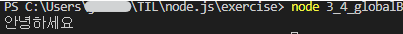

# 3. 노드 기능 알아보기

****

****


# REPL 사용하기

스크립트 언어인 자바스크립트는 컴파일 하지 않아도 즉석에서 코드 실행이 가능

노드 또한 브라우저 콘솔 탭과 비슷한 콘솔을 제공한다.

코드를 Read(읽기) / Eval(해석) / Print(반환) 종료할 때 까지 Loop(반복) => REPL 이라고 부른다.


REPL 은 한두 줄 짜리 코드를 테스트 해보는 용도로는 좋지만 여러줄의 코드를 실행하기에는 불편하다.


*****

# JS 파일 실행하기


*<u>**3\_2\_helloWorld**</u>*

```js
function helloWorld() {
    console.log('Hello World');
    helloNode();
}

function helloNode() {
    console.log('Hello Node');
}

helloWorld();
```


REPL 로 들어가는 명령어 node 뒤에 실행하고자 하는 JS 파일의 경로를 입력하면 REPL 에서 해당 JS 파일을 실행하여 결과가 출력되는 것을 확인할 수 있다.


****

# 모듈로 만들기

노드는 코드를 모듈로 만들 수 있다는 점에서 브라우저에서의 자바스크립트와 다르다.

* ### 모듈

  특정한 기능을 하는 함수나 변수들의 집합

  자체로도 하나의 프로그램이면서 다른 프로그램의 부품으로도 사용 가능


***<u>3\_3\_var.js</u>***

```js
const odd = '홀수입니다.';
const even = '짝수입니다.';

module.exports = {
    odd,
    even,
};
```

var.js 에 변수 두개를 선언한 후 module.exports 에 변수들을 담은 객체를 대입했다.

이제 이 파일은 모듈로서 기능을 한다.

***<u>3_3_func.js</u>***

```js
const { odd, even } = require('./3_3_var');

function checkOddOrEven(num) {
    if (num % 2) {
        return odd;
    }
    return even;
}

module.exports = checkOddOrEven;
```

require 함수 안에 불러올 모듈의 경로를 적는다. 위 예제에서는 같은 exercise 폴더 안에 있으므로 상대 경로를 통해 ./(현 위치)3_2_var.js 에 접근한다.

이후 구조분해 할당을 이용해 { odd, even } 에 3_2_var 에서 module.exports 에 담은 { odd, even } 을 할당한다.


이후 정의한 checkOddOrEven 함수를 다시 module.exports 에 담는다.

 module.exports 는 객체만 대입해야 하는 것이 아니라 함수, 변수 를 대입할 수도 있다.


***<u>3\_3\_index.js</u>***

```js
const {odd, even} = require('./3_3_var');
const checkNumber = require('./3_3_func');

function checkStringOddOrEven(str) {
    if (str.length % 2 ) {
        return odd;
    }
    return even;
}

console.log(checkNumber(10));
console.log(checkStringOddOrEven('hello'));
```


이렇게 여러 파일에 걸쳐 재사용되는 함수나 변수를 모듈로 만들어두면 편리하다.그러나 모듈이 많아지고 모듈간 관계가 얽히게 되면 구조를 파악하기 어렵다는 단점도 있다.

* ## ES2015 모듈

  ES2015 가 도입되면서 자바스크림트도 자체 모듈 시스템 문법이 생겼다. 

  func.js 를 ES2015 모듀 ㄹ스타일로 바꿔보면

  ```js
  import {odd, even} from './var';
  
  function checkOddOrEven(num) {
      if (num % 2) {
          return odd;
      }
      return even;
  }
  
  export default checkOddOrEven;
  ```

  가 된다. require 함수가 ***import from*** 구문으로 module.export 가 ***export default*** 구문으로 바뀐것을 볼 수 있다.


****

# 노드 내장 객체 알아보기


노드에서는 기본적인 내장 객체와 내장 모듈을 제공한다.

따로 설치 하지 않아도 바로 사용할 수 있으며 브라우저의 window 객체와 비슷하다고 보면된다.


* ## global

  global 은 브라우저의 window 같은전역객체로 모든 파일에서 접근 가능하다.

  또한 window.open 메서드를 그냥 open 으로 호출할 수 있는 것처럼 global 또한 생략 가능하다.

  이전 절의 require 함수나 console 객체도 global 을 생략한 것이다.\

  global 객체 의 내부를 보려면 REPL 에 들어가 global 을 입력하면 된다.

  ```
  > global.console
  Object [console] {
    log: [Function: log],
    warn: [Function: warn],
    dir: [Function: dir],
    time: [Function: time],
    timeEnd: [Function: timeEnd],
    timeLog: [Function: timeLog],
    trace: [Function: trace],
    assert: [Function: assert],
    clear: [Function: clear],
    count: [Function: count],
    countReset: [Function: countReset],
    group: [Function: group],
    groupEnd: [Function: groupEnd],
    table: [Function: table],
    debug: [Function: debug],
    info: [Function: info],
    dirxml: [Function: dirxml],
    error: [Function: error],
    groupCollapsed: [Function: groupCollapsed],
    Console: [Function: Console],
    profile: [Function: profile],
    profileEnd: [Function: profileEnd],
    timeStamp: [Function: timeStamp],
    context: [Function: context]
  }
  >
  ```

  전역 객체라는 점을 이용하여 파일간에 간단한 데이터를 공유할 때 사용하기도 한다.

  ***<u>3\_4\_globalA.js</u>***

  ```js
  module.exports = () =>  global.message;;
  ```

  ***<u>3\_4\_globalB.js</u>***

  ```js
  const A = require('./3_4_globalA');
  
  global.message = '안녕하세요';
  console.log(A());
  ```

  globalA 모듈의 함수는 global.message 를 반환한다.

  globalB.js 에서는 global 객체에 속성명이 message 인 값을 대입하고 globalA 모듈의 함수를 호출한다. 콘솔 결과는 globalB 에서 넣은 global.message 값을 globalA 에서도 접근할 수 있음을 보여준다.

  


* ## console

  지금까지 사용했던 console 도 노드에서는 window 대신 global 객체 안에 들어 있으며, 브라우저에서의 console 과 비슷하다.

  console 객체는 보통 디버깅을 위해 사용한다. 

  * 변수에 값이 제대로 들어있는지 확인하기 위해
  * 에러 발생시 에러 내용을 콘솔에 표시하기 위해 
  * 코드 실행 시간을 알아보기 위해

  사용한다.

  ***<u>3\_4\_console.js</u>***

  ```js
  const string = 'abc';
  const number = 1;
  const boolean = true;
  const obj = {
      outside: {
          inside: {
              key: 'value',
          },
      },
  };
  console.time('전체 시간');
  console.log('평볌한 로그이다. 쉼표로 구분해 여러 값을 찍을 수 있다.');
  console.log(string, number, boolean);
  console.error('에러 메시지는 console.error에 담는다.');
  
  console.table([{ name: '제로', birth: 1994 }, { name: 'hero', birth: 1988 }]);
  
  console.dir(obj, { colors: false, depth: 2 });
  console.dir(obj, { colors: true, depth: 1 });
  
  console.time('시간 측정');
  for (let i = 0; i < 100000; i++) {}
  console.timeEnd('시간 측정');
  
  function b() {
      console.trace('에러 위치 추적');
  }
  function a() {
      b();
  }
  a();
  
  console.timeEnd('전체 시간');
  ```

  

  * ### console.time(레이블) :

    console.timeEnd(레이블) 과 대응되어 같은 레이블을 가진 time 과 timeEnd 사이의 시간을 측정한다.

  * ### console.log(내용):

    평범한 로그를 콘솔에 표시한다. console.log(내용, 내용, ...) 처럼 여러 내용을 동시에 표시할 수 있다.

  * ### console.error(에러 내용):

    에러를 콘솔에 표시한다.

  * ### console.table(배열):

    배열의 요소로 객체 리터럴을 넣으면, 객체의 속성들이 테이블 형식으로 표현된다.

  * ### console.dir(객체, 옵션) :

    객체를 콘솔에 표시할 때 사용한다. 첫번째 인수로 표시할 객체를 넣고, 두번째 인수로 옵션을 넣는다.

    옵션의 colors를 true 로 하면 콘솔에 색이 추가되어 보기가 편해진다. 

    depth 는 객체 안의 객체를 몇단계까지 보여줄지를 결정한다. 

    기본값은 2이다.

  * ### console.trace(레이블):

    에러가 어디서 발생했는지 추적할 수 있게 한다.

    일반적으로 에러 발생시 에러 위치를 알려주므로 자주 사용하지는 않지만 위치가 나오지 않는다면 사용할 만하다.


* ## 타이머 

  타이머 기능을 제공하는 함수인 setTimeout, setInterval, setImmediate 노드에서 window 대신 global 객체 안에 들어있다. setTimeout 과 setInterval 은 웹 브라우저에서도 자주 사용된다.

  * ### setTimeout(콜백함수, 밀리초):

    주어진 밀리초(1/1000초) 이후에 콜백 함수를 실행한다.

  * ### setInterval(콜백함수, 밀리초):

    주어진 밀리초마다 콜백함수를 반복 실행한다.

  * ### setImmediate(콜백함수):

    콜백 함수를 즉시 실행한다.

  이 타이머 함수들은 모두 아이디를 반환한다.

  아이디를 사용하여 타이머를 취소할 수 있다.

  * ### clearTimeout(아이디):

    setTimeout 취소

  * ### setInterval(아이디):

    setTimeout 취소

  * ### clearImmediate(아이디):

    setImmediate 취소

  

  ***<u>3\_4\_timer.js</u>***

  ```js
  const timeout = setTimeout(() => {
      console.log('1.5초 후 실행');
  }, 1500);
  
  const interval = setInterval(() => {
      console.log('1초 마다 실행');
  }, 1000);
  
  const timeout2 = setTimeout(() => {
      console.log('실행되지 않는다.');
  }, 3000);
  
  setTimeout(() => {
      clearTimeout(timeout2);
      clearInterval(interval);
  }, 2500);
  
  const immediate = setImmediate(() => {
      console.log('즉시 실행');
  });
  
  const immediate2 = setImmediate(() => {
      console.log('실행되지 않는다.');
  });
  
  clearImmediate(immediate2);
  ```

  |  초  | 실행                                  | Console        |
  | :--: | ------------------------------------- | -------------- |
  |  0   | immediate<br/>*immediate2(취소)*      | 즉시 실행      |
  |  1   | interval                              | 1초마다 실행   |
  | 1.5  | timeout                               | 1.5초마다 실행 |
  |  2   | interval                              | 1초마다 실행   |
  | 2.5  | *timeout2(취소)*<br/>*interval(취소)* |                |

  

  * ### setImmediate(콜백) 과 setTimeout(콜백,0) 차이

    파일 시스템 접근, 네트워킹 같은 I / O 작업의 콜백 함수 안에서 타이머를 호출 하는 경우에 setImmediate 는 setTimeout(콜백, 0) 보다 먼저 실행된다.

    하지만 setImmediate 가 항상 setTimeout(콜백, 0) 보다 먼저 호출되지는 않는다는 사실을 기억해야한다. 

    setTimeout(콜백, 0)은 사용하지 않는 것을 권장한다.


* ## \_\_filename, \_\_dirname

  노드에서는 파일 사이에 모듈 관계가 있는 경우가 많으므로 때로는 현재 파일의 경로나 파일명을 알아야 한다. 

  노드는 \_\_filename, \_\_dirname라는 키워드로 경로에 대한 정보를 제공한다.

  파일에 \_\_filename, \_\_dirname 을 넣어두면 실행 시 현 파일명과 현재 파일 경로로 바뀐다.

  ***<u>3\_4\_filename.js</u>***

  ```
  console.log(__filename);
  console.log(__dirname);
  ```

  

  이렇게 얻은 정보를 사용해서 경로 처리를 할 수도 있다. 하지만 경로가 문자열로 반환되기도 하고, \ 나 / 같은 경로 구분자 문제도 있으므로 보통은 이를 해결해주는 path 모듈 (3.5.2) 과 함께 사용한다.


* ## module, exports, require

  

  ## exports

  ***<u>3\_3\_var.js</u>***

  ```js
  const odd = '홀수입니다.';
  const even = '짝수입니다.';
  
  module.exports = {
      odd,
      even,
  };
  ```

  를 다음과 같이 수정해도  index.js 에서는 동일하게 불러올 수 있다.

  ***<u>3\_4\_var.js</u>***

  ```js
  exports.odd = '홀수입니다.';
  exports.even = '짝수입니다.';
  ```

  

  module.exports 로 한번에 대입하는 대신, 각각의 변수를 exports 객체에 하나씩 넣을 수 있다.

  module.exports 와 exports 가 같은 객체를 참조하기 때문이다.

  실제로 console.log(module.exports === exports) 를 하면 true 가 나온다. 

  

  * ### exports 객체 사용시 주의점

    **exports =(참조)=> module.exports =(참조)=> {  }** 

    exports 객체를 사용할 때는 module.exports 와의 참조 관계가 깨지지 않도록 주의

    module.exports 에는 어떤 값이든 대입해도 되지만 exports 에는 반드시 객체처럼 속성명과 속성값을 대입해야한다.

    exports 에 다른 값을 대입하면 객체의 참조 관계가 끊겨 더 이상 모듈로 기능하지 않는다.

  

  

  * ###  노드에서 this 는 무엇인가?

    노드에서 this 를 사용할 때 주의하여야 할 점

    ***<u>3\_4\_this.js</u>***

    ```js
    console.log(this);
    console.log(this === module.exports);
    console.log(this === exports);
    
    function whatIsThis() {
        console.log('function', this === exports, this === global);
    }
    whatIsThis();
    ```

    ```
    {}
    true
    true
    function false true
    ```

    다른 부분은 브라우저의 자바스크립트와 동일하지만 최상위 스코드에 존재하는 this는 module.exports 를 가리킨다. 또한 함수 선언문 내부의 this는 global 객체를 가리킨다.

  

  ## require

  require 은 함수이며 함수는 객체이므로 require은 객체로서 몇가지 속성을 갖고 있다.

  ***<u>3\_4\_require.js</u>***

  ```js
  console.log('require 이 가장 위에 오지 않아도 된다.');
  
  module.exports = 'find me';
  
  require('./3_4_var');
  
  console.log('require.cache 이다.');
  console.log(require.cache);
  console.log('require.main 이다.');
  console.log(require.main === module);
  console.log(require.main.filename);
  ```

  ```
  require 이 가장 위에 오지 않아도 된다.
  require.cache 이다.
  [Object: null prototype] {
    'c:\\Users\\***\\TIL\\node.js\\exercise\\tempCodeRunnerFile.js': Module {
      id: '.',
      path: 'c:\\Users\\***\\TIL\\node.js\\exercise',
      exports: 'find me',
      filename: 'c:\\Users\\***\\TIL\\node.js\\exercise\\tempCodeRunnerFile.js',
      loaded: false,
      children: [ [Module] ],
      paths: [
        'c:\\Users\\***\\TIL\\node.js\\exercise\\node_modules',
        'c:\\Users\\***\\TIL\\node.js\\node_modules',
        'c:\\Users\\***\\TIL\\node_modules',
        'c:\\Users\\***\\node_modules',
        'c:\\Users\\node_modules',
        'c:\\node_modules'
      ]
    },
    'c:\\Users\\***\\TIL\\node.js\\exercise\\3_4_var.js': Module {
      id: 'c:\\Users\\***\\TIL\\node.js\\exercise\\3_4_var.js',
      path: 'c:\\Users\\***\\TIL\\node.js\\exercise',
      exports: { odd: '홀수입니다.', even: '짝수입니다.' },
      filename: 'c:\\Users\\***\\TIL\\node.js\\exercise\\3_4_var.js',
      loaded: true,
      children: [],
      paths: [
        'c:\\Users\\***\\TIL\\node.js\\exercise\\node_modules',
        'c:\\Users\\***\\TIL\\node.js\\node_modules',
        'c:\\Users\\***\\TIL\\node_modules',
        'c:\\Users\\***\\node_modules',
        'c:\\Users\\node_modules',
        'c:\\node_modules'
      ]
    }
  }
  require.main 이다.
  true
  c:\Users\***\TIL\node.js\exercise\tempCodeRunnerFile.js
  ```

  * require 은 반드시 파일 최상단에 위치할 필요는 없다.

  * module.exports 또한 최하단에 위치할 필요가 없다.

  * require.cache 객체에 3_4_require.js 나 3_4_var.js 같은 

  * 파일 이름이 속성명에 들어있는 것을 볼 수 있다.

    속성값으로는 각 파일의 모듈 객체가 들어있다.

  * 한번 require 한 파일은 require.chache 에 저장되므로 다음번에 require 할 때는 새로 불러오지 않고 require.cache 에 있는 것이 재사용된다.

  * 만약 새로 require 하길 원한다면, require.cache 의 속성을 제거하면 된다. 

    (프로그램의 동작이 꼬일 수 있으므로 권장하지는 않는다.)

  * 속성을 자세히 살펴보면 module.exports 했던 부분이나 로딩 여부, 부모, 자식 모듈 관계를 찾을 수 있다.

  * require.main 은 노드 실행 시 첫 모듈을 가리킨다. 

    require.main 객체의 모양은 require.cache의 모듈 객체와 같다.

  * 현 파일이 첫 모듈인지 알아보려면 require.main === module 을 해보면 된다.

  * 현 실습의 경우 node 3\_4\_require 을 실행한 경우 3\_4\_var.js 에서 require.main === module 을 실행하면 false 가 반환될 것이다.

  * 첫 모듈의 이름을 알아보려면 require.main.filename으로 확인하면 된다.

  * 모듈을 사용할 때 주의해야할 점이 있다.

    ***<u>3\_4\_dep1.js</u>***

    ```js
    const dep2 = require('./3_4_dep2');
    console.log('require dep2', dep2);
    module.exports = () => {
      console.log('dep2', dep2);
    }
    ```

    ***<u>3\_4\_dep2.js</u>***

    ```js
    const dep1 = require('./3_4_dep1');
    console.log('require dep1', dep1);
    module.exports = () => {
      console.log('dep1', dep1);
    }
    ```

    ***<u>3\_4\_dep-run.js</u>***

    ```js
    const dep1 = require('./3_4_dep1');
    const dep2 = require('./3_4_dep2');
    dep1();
    dep2();
    ```

    3\_4\_dep-run.js 를 만들어 두 모듈을 실행해보면 코드가 위에서부터 실행되므로  require('./3\_4\_dep1') 이 먼저 실행된다. 3\_4\_dep1.js 에서는 제일 먼저 require('./3\_4\_dep2') 이 실행된다. 

    다시 3\_4\_dep2.js 에서는 require('./3\_4\_dep1') 이 실행된다. 

    ```
    require dep1 {}
    require dep2 [Function (anonymous)]
    dep2 [Function (anonymous)]
    dep1 {}
    (node:14536) Warning: Accessing non-existent property 'Symbol(nodejs.util.inspect.custom)' of module exports inside circular dependency
    (Use `node --trace-warnings ...` to show where the warning was created)
    (node:14536) Warning: Accessing non-existent property 'constructor' of module exports inside circular dependency
    (node:14536) Warning: Accessing non-existent property 'Symbol(Symbol.toStringTag)' of module exports inside circular dependency
    (node:14536) Warning: Accessing non-existent property 'Symbol(nodejs.util.inspect.custom)' of module exports inside circular dependency
    (node:14536) Warning: Accessing non-existent property 'constructor' of module exports inside circular dependency
    (node:14536) Warning: Accessing non-existent property 'Symbol(Symbol.toStringTag)' of module exports inside circular dependency
    ```

    dep1 의 module.exports 가 함수가 아니라 빈 객체로 표시된다. 이러한 현상을 **<u>순환 참조(circular dependency)</u>** 라고 부른다. 

    이렇게 순한 참조가 있을 경우에는 순환 참조되는 대상을 빈 객체로 만든다.

    이때 에러가 발생하지 않고 조용히 빈 객체로 변경되므로 예기치 못한 동작이 발생할 수 있다. 

    따라서 순환 참조가 발생하지 않도록 구조를 잘 잡는 것이 중요하다. 


* ## process

  process 객체는 현재 실행되고 있는 노드 프로세스에 대한 정보를 담고 있다. 

  process 객체 안에는 다양한 속성이 있다. 

  ```js
  > process.version
  'v18.8.0'
  > process.arch
  'x64'
  > process.platform
  'win32'
  > process.pid
  12548
  > process.uptime()
  54.7947493
  > process.execPath
  'C:\\Program Files\\nodejs\\node.exe'
  > process.cwd()
  'C:\\Users\\jihoon\\TIL\\node.js\\exercise'
  > process.cpuUsage()
  { user: 1421000, system: 640000 }
  ```

  사용 빈도는 그리 높지 않지만, 일반적으로 운영체제나 실행 환경별로 다른 동작을 하고 싶을 때 사용한다. 

  process.env 와 process.nextTick , process.exit() 은 중요하다.

  

  * ### process.env

    REPL에 process.env 를 입력하면 시스템 환경 변수가 출력된다.

    시스템 환경 변수는 노드에 직접 영향을 미치기도 한다.

    대표적인 것이 UV_THREADPOOL_SIZE 와 NODE_OPTIONS 가 있다.

    NODE_OPTIONS = --max-old-space-size=8192

    UV_THREADPOOL_SIZE = 8

    왼쪽이 환경 변수의 이름이며 오른 쪽이 값이다. 

    NODE_OPTIONS 는 노드를 실행할 때의 옵션들을 입력받는 환경변수이다.

    --max-old-space-size = 8192 는 노드의 메모리를 8GB 까지 사용할 수 있게 한다. 

    옵션이 다양하게 존재한다.

    UV_THREADPOOL_SIZE 는 노드에서 기본적으로 사용하는 스레드풀의 스레드 개수를 조절할 수 있게 한다.

    

    시스템 환경 변수 외에도 임의로 환경 변수를 저장할 수 있다. process.env는 서비스의 중요한 키를 저장 공간으로 사용된다.

    서버나 데이터베이스의 비밀번호와 각종 API 키를 코드에 직접 입력하는 것은 위험하다. 

    따라서 중요한 비밀번호는 다음과 같이 process.env 의 속성으로 대체한다.

    ```js
    const secretId = process.env.SECRET_ID;
    const secretCode = process.env.SECRET_CODE;
    ```

    이제 process.env 에 직접 SECRET_ID 와 SECRET_CODE 를 넣으면 된다.

    넣는 방법은 운영체제마다 차이가 있다.

    하지만 모든 운영체제에 동일하게 넣을 수 있는 방법이 있다. 6.2절에서 dotenv 를 사용할 때 배운다. 

  

  

  * ### process.nextTick(콜백)

    이벤트 루프가 다른 콜백 함수들 보다 nextTick 의 **콜백 함수를 우선으로 처리**하도록 만든다.

    ***<u>3\_4\_nextTick.js</u>***

    ```js
    setImmediate(() => {
        console.log('immediate');
    });
    
    process.nextTick(() => {
        console.log('nextTick');
    });
    
    setTimeout(() => {
        console.log('timeout');
    }, 0);
    
    Promise.resolve().then(() => console.log('promise'));
    ```

    process.nextTick 은 setImmediate 나 setTimeout 보다 먼저 실행된다. 

    코드 맨 밑에 Promise 를 넣은 것은 resolve 된 Promise 도 nextTick 처럼 다름 콜백들보다 우선시 되기 때문이다.

    process.nextTick과 Promise 를 **마이크로태스크(microtask)** 라고 따로 구분지어 부른다.

    ```js
    nextTick
    promise
    timeout
    immediate
    ```

    * ### 마이크로 태스크의 재귀 호출

      process.nextTick 으로 받은 콜백 함수나 resolve 된 Promise 는 다른 이벤트 루프에서 대기하는 콜백 함수보다도 먼저 실행된다. 그래서 비동기 처리를 할 때 setImmediate 보다 process.nextTick 을 더 선호하는 개발자도 있다.

      하지만 이런 마이크로 태스크를 재귀호출하게 되면 이벤트 루프는 다른 콜백함수보다 마이크로 태스크를 우선 처리하게 되어 콜백함수들이 실행되지 않을 수 있다.

    

  * ### process.exit(코드) 

    실행 중인 **노드 프로세스를 종료**한다.

    서버 환경에서 이 함수를 사용하면 서버가 멈추므로 특수한 경우를 제외하고는 잘 사용하지 않는다.

    서버 외의 독립적인 프로그램에서는 수동으로 노드를 멈추기 위해 사용

    ***<u>3\_4\_exit.js</u>***

    ```js
    let i = 1;
    
    setInterval(() => {
        if (i === 5) {
            console.log('종료!');
            process.exit();
        }
        console.log(i);
        i += 1;
    }, 1000);
    ```

    process.exit 메서드는 인수로 코드 번호를 줄 수 있다. 

    * 인수를 주지 않거나 0을 주면 정상 종료
    * 1을 주면 비정상 종료

    를 의미한다.

    만약 에러가 발생하여 종료하는 경우에는 1을 넣으면 된다.


****

# 노드 내장 모듈 사용하기


* ## os

  웹 브라우저의 자바스크립트는 운영체제의 정보를 가져올 수 없지만 노드는 os 모듈에 정보가 담겨 있다.

  ### os 모듈 대표 메소드

  ***<u>os.js</u>***

  ```js
  const os = require('os');
  
  console.log('----운영체제 정보 --------------------------');
  console.log(`os.arch():        ${os.arch()}`);
  console.log(`os.platform:      ${os.platform()}`);
  console.log(`os.type():        ${os.type()}`);
  console.log(`os.uptime():      ${os.uptime()}`);
  console.log(`os.hostname():    ${os.hostname()}`);
  console.log(`os.release():     ${os.release()}`);
  
  console.log('----경로------------------------------------');
  console.log(`os.homedir():     ${os.homedir()}`);
  console.log(`os.tmpdir():      ${os.tmpdir()}`);
  
  console.log('----cpu 정보--------------------------------');
  console.log(`os.cpus():        ${os.cpus()}`);
  console.log(`os.cpus().length: ${os.cpus().length}`);
  
  console.log('----메모리 정보------------------------------');
  console.log(`os.freemem():     ${os.freemem()}`);
  console.log(`os.totalmem():    ${os.totalmem()}`);
  ```

  ```js
  ----운영체제 정보 --------------------------
  os.arch():        x64
  os.platform:      win32
  os.type():        Windows_NT
  os.uptime():      933614
  os.hostname():    DESKTOP-4RL1TCV
  os.release():     10.0.19044
  ----경로------------------------------------
  os.homedir():     C:\Users\jihoon
  os.tmpdir():      C:\Users\jihoon\AppData\Local\Temp
  ----cpu 정보--------------------------------
  os.cpus():        [object Object],[object Object],[object Object],[object Object]
  os.cpus().length: 4
  ----메모리 정보------------------------------
  os.freemem():     3316424704
  os.totalmem():    8487632896
  ```

  ### 운영체제 정보

  * ### os.arch(): 

    process.arch 와 동일하다.

  * ### os.platform():

    process.platform 과 동일

  * ### os.type():

    운영체제의 종류를 보여준다.

  * ### os.uptime():

    운영체제 부팅 이후 흐른 시간(초) 을 보여준다. 

    process.uptime() 은 노드의 실행 시간이었다.

    

  ### 경로

  * ### os.hostname(): 

    컴퓨터의 이름을 보여준다.

  * ### os.release():

    운영체제의 버전을 보여준다.

  * ### os.homedir():

    홈 디렉터리 경로를 보여준다.

  * ### os.tmpdir():

    임시 파일 저장 경로를 보여준다.

    

  ### cpu 정보

  * ### os.cpus(): 

    컴퓨터의 코어 정보를 보여준다.

  * ### os.cpus().length:

    코어의 개수가 숫자로 나온다. 

    하지만 노드에서 싱글 스레드 프로그래밍을 하면 코어가 몇개이든 상관 없이 대부분의 경우 코어를 하나밖에 사용하지 않는다.

    하지만 4.5 절 의 cluster 모듈을 사용하는 경우 코어 개수에 맞춰서 프로세스를 늘릴 수 있다. 

  

  ### 메모리 정보

  * ### os.freemem(): 

    사용 가능한 메모리(RAM)를 보여준다.

  * ### os.totalmem():    

    전체 메모리 용량을 보여준다.

    

    

  * ### os.constants

    각종 에러와 신호에 대한 정보가 담겨 있는 객체

    EADDRINUSE 와 ECONNRESET 같은 에러 코드를 함께 보여준다.

    에러 코드가 너무 많아 발생할 때마다 검색해 보는 것이 빠르다.

  

  OS 모듈은 주로 컴퓨터 내부 자원에 빈번하게 접근 하는 경우 사용된다. 

  즉, 일반적인 웹 서비스를 제작할 때는 사용빈도가 많지 않다.

  하지만 운영체제별로 다른 서비스를 제공하고 싶을 때 os 모듈이 유용하다.

  

* ## path

  **폴더와 파일 경로를 쉽게 조작**하도록 도와주는 모듈

  path 모듈이 필요한 이유중 하나는 운영체제별로 **경로 구분자**가 다르기 때문

  크게 윈도 타입과 POSIX 타입으로 구분된다.

  POSIX는 유닉스 기반의 운영체제들을 의미하며 맥과 리눅스가 속해 있다.

  * **윈도 :** C:\Users\ 처럼 \ 로 구분
  * **POSIX :** /home/ 처럼 / 로 구분

  따라서 맥이나 리눅스에서 예제를 실습하고 있다면 \ 대신 / 가 나오는 것이 정상이다.

  이외에도 파일 경로에서 파일명이나 확장자만 따로 떼어주는 기능을 구현해 두어 직접 구현하지 않고도 편리하게 사용할 수 있다.

  ### path 모듈의 속성과 메서드

  ***<u>path.js</u>*** 

  ```js
  const path = require('path');
  
  const string = __filename;
  
  console.log(`path.sep:                ${path.sep}`);
  console.log(`path.delimiter:          ${path.delimiter}`);
  console.log('--------------------------------------------------------------------');
  console.log(`path.dirname():          ${path.dirname(string)}`);
  console.log(`path.extname():          ${path.extname(string)}`);
  console.log(`path.basename():         ${path.basename(string)}`);
  console.log(`path.basename - extname: ${path.basename(string, path.extname(string))}`);
  console.log('--------------------------------------------------------------------');
  console.log(`path.parse():            ${path.parse(string)}`);
  console.log(`path.format():           ${path.format({ dir: 'C:\\users\\zerocho', name: 'path', ext: '.js' })}`);
  console.log(`path.normalize():        ${path.normalize('C://users\\\\zerocho\\\path.js')}`);
  console.log('--------------------------------------------------------------------');
  console.log(`path.isAbsolute(C:\\):   ${path.isAbsolute('C:\\')}`);
  console.log(`path.isAbsolute(./home): ${path.isAbsolute('./home')}`);
  console.log('--------------------------------------------------------------------');
  console.log(`path.relative():         ${path.relative('C:\\users\\zerocho\\path.js', 'C:\\')}`);
  console.log(`path.join():             ${path.join(__dirname, '..', '..', '/users', '.', '/zerocho')}`);
  console.log(`path.resolve():          ${path.resolve(__dirname, '..', 'users', '.', '/zerocho')}`);
  ```

  ```js
  path.sep:                \
  path.delimiter:          ;
  --------------------------------------------------------------------
  path.dirname():          c:\Users\jihoon\TIL\node.js\exercise\chapt3
  path.extname():          .js
  path.basename():         path.js
  path.basename - extname: path
  --------------------------------------------------------------------
  path.parse():            [object Object]
  path.format():           C:\users\zerocho\path.js
  path.normalize():        C:\users\zerocho\path.js
  --------------------------------------------------------------------
  path.isAbsolute(C:\):   true
  path.isAbsolute(./home): false
  --------------------------------------------------------------------
  path.relative():         ..\..\..
  path.join():             c:\Users\jihoon\TIL\node.js\users\zerocho
  path.resolve():          c:\zerocho
  ```

  * ### path.sep:

    경로의 구분자

    윈도우는 \, POSIX 는 / 이다.

  * ### path.delimiter:

    환경 변수의 구분자이다.

    process.env.PATH 를 입력하면 여러개의 경로가 이 구분자로 구분되어 있다.

    윈도는 세미콜론(;) 이며 POSIX 는 콜론(:) 이다.

  * ### path.dirname(경로): 

    파일이 위치한 폴더 경로를 보여준다.

  * ### path.extname(경로):

    파일의 확장자를 보여준다.

  * ### path.basename(경로, 확장자):

    파일의 이름(확장자 포함)을 표시한다. 

    파일의 이름만 표시하고 싶다면 basename 의 두 번째 인수로 파일의 확장자를 넣으면 된다.

  * ### path.basename - extname: 

  * ### path.parse(경로): 

    파일의 경로를 root, dir, base, ext, name 으로 분리한다.

  * ### path.format(객체):

    path.parse() 한 객체를 파일 경로로 합친다.

  * ### path.normalize(경로):        

    / 나 \를 실수로 여러번 사용했거나 혼용했을 때 정상적인 경로로 변환한다.

  * ### path.isAbsolute(경로):

    파일의 경로가 절대 경로인지 상대경로인지를 true 나 false 로 알린다. 

  * ### path.relative(기준경로, 비교경로):         

    경로를 두 개 넣으면 첫 번째 경로에서 두 번째 경로로 가는 방법을 알린다.

  * ### path.join(경로, ...):

    여러 인수를 넣으면 하나의 경로로 합친다. 상대 경로인 ..(부모 디렉터리) 과 .(현위치)도 알아서 처리한다.

  * ### path.resolve(경로, ...):

    path.join() 과 비슷하지만 차이가 있다. 

    /를 만나면 path.resolve 는 절대 경로로 인식해서 앞의 경로를 무시한다.

    

  * ### join 과 resolve 의 차이

    / 를 만나는 경우

    * path.resolve 

      절대 경로로 인식해서 앞의 경로를 무시한다.

    * path.join 

      상대 경로로 처리한다.

    path.join('/a', '/b', 'c');         => /a/b/c/

    path.resolve('/a', '/b', 'c');   => /b/c

  

  * ### 어떤 경우에 \\ 를 사용하며 어떤 경우 \ 를 사용하는가

    기본적으로 경로는 \ 하나를 사용해서 표시한다. 하지만 자바스크립트 문자열에서는 \ 가 특수 문자이므로 \를 두개 붙여서 경로를 표시해야한다.

    예를 들어 \n 은 자바스크립트 문자열에서 줄바꿈을 의미한다.

    예를 들어 C:**\n**ode 의 경우 의도하지 않은 오류가 발생할 수 있다.

    따라서 이런 경우 C:\\\\node 처럼 표시해야한다.

    path 모듈은 위와 같은 경우에 발생하는 문제를 알아서 처리한다. 

  

  가끔 윈도에서 POSIX 스타일 경로를 사용하는 경우가 있으며 그 반대일 경우도 있다.

  이런 경우 **path.posix.sep 나 path.posix.join() / path.win32.sep 나 path.win32.join** 처럼 사용한다.

  노드는 require.main 파일을 기준으로 상대 경로를 인식한다. 따라서 require.main 과는 다른 디렉터리의 파일이 상대 경로를 갖고 있다면 예상과 다르게 동작할 수 있다. 이러한 문제를 path 모듈을 통해 해결 할 수 있다.


* ## url

  인터넷 주소를 쉽게 조작하도록 도와주는 모듈

  url 처리에는 크게 두가지 방식이 있다.

  * 노드 버전 7에서 추가된 WHATWG(웹 표준을 정하는 단체) 방식의 URL
  * 예전부터 노드에서 사용하던 방식의 url 

  이 있다.

  주소의 각 부분별 명칭은 

  |    NODE    |   protocol   |     auth     |     auth     |      href      |    href    |     path     |      path      |   hash   |
  | :--------: | :----------: | :----------: | :----------: | :------------: | :--------: | :----------: | :------------: | :------: |
  |            |              |              |              |  **hostname**  |  **port**  | **pathname** |   **search**   |          |
  |            |              |              |              |                |            |              |   **query**    |          |
  |            |   https://   |    user:     |     pass     | @sub.host.com: |    8080    |   /p/a/t/h   | ? query=string |  #hash   |
  | **WHATWG** |              |              |              |  **hostname**  |  **port**  |              |                |          |
  |            | **protocol** | **username** | **password** |    **host**    |  **host**  |              |                |          |
  |            |  **origin**  |              |              |   **origin**   | **origin** | **pathname** |   **search**   | **hash** |

  

  ```js
  const url = require('url');
  
  const { URL } = url;
  const myURL = new URL('http://www.gilbut.co.kr/book/bookList.aspx?sercate1=001001000#anchor');
  
  console.log(`new URL():    ${myURL}`);
  console.log(`url.format(): ${url.format(myURL)}`);
  console.log('----------------------------------------------------------------------------------')
  
  const parsedUrl = url.parse('http://www.gilbut.co.kr/book/bookList.aspx?sercate1=001001000#anchor');
  console.log(`url.parse():  ${parsedUrl}`);
  console.log(`url.format(): ${url.format(parsedUrl)}`);
  ```

  ```js
  new URL():    http://www.gilbut.co.kr/book/bookList.aspx?sercate1=001001000#anchor
  url.format(): http://www.gilbut.co.kr/book/bookList.aspx?sercate1=001001000#anchor
  ----------------------------------------------------------------------------------
  url.parse():  [object Object]
  url.format(): http://www.gilbut.co.kr/book/bookList.aspx?sercate1=001001000#anchor
  ```

  기존 노드 방식에서는 두 메서드를 주로 사용한다.

  * ### url.parse(주소) : 

    주소를 분해한다. WHATWG 방식과 비교하면 

    username 과 password 대신 auth 속성이 있고, 

    searchParams 대신 query 가 있다.

  * ### url.format(객체) : 

    WHATWG 방식 url 과 기존 노드의 url 을 모두 사용할 수 있다.

    분해되었던 url 객체를 다시 원래 상태로 조립한다.

  WHATWG 와 노드의 url 은 취향에 따라 사용하면 되지만, 노드의 url 형식을 반드시 사용해야하는 경우가 있다.

  host 부분 없이 pathname 부분 만 오는 주소인 경우 WHATWG 방식이 처리할 수 없다.

  4장에서 서버를 만들 때는 host 부분 없이 pathname 만 오는 주소를 보게 될것이다.

  

  WHATWG 방식은 search 부분을 searchParams 라는 특수한 객체로 반환하므로 유용하다.

  search 부분은 보통 주소를 통해 데이터를 전달할때 사용된다. 

  search 는 물음표 ?로 시작하고, 그 뒤에 키=값 형식으로 데이터를 전달한다. 여러 키가 있을 경우에는 &로 구분한다.

  

  ***<u>searchParams.js</u>***

  ```js
  const { URL } = require('url');
  
  const myURL = new URL('http://www.gilbut.co.kr/page=3&limit=10&category=nodejs&category=javascript');
  console.log('searchParams:', myURL.searchParams);
  console.log('searchParams.getAll():', myURL.searchParams.getAll('category'));
  console.log('searchParams.get():', myURL.searchParams.get('limit'));
  console.log('searchParams.has():', myURL.searchParams.has('page'));
  
  console.log('searchParams.keys():', myURL.searchParams.keys());
  console.log('searchParams.values():', myURL.searchParams.values());
  
  myURL.searchParams.append('filter', 'es3');
  myURL.searchParams.append('filter', 'es5');
  console.log(myURL.searchParams.getAll('filter'));
  
  myURL.searchParams.set('filter', 'es6');
  console.log(myURL.searchParams.getAll('filter'));
  
  myURL.searchParams.delete('filter');
  console.log(myURL.searchParams.getAll('filter'));
  
  console.log('searchParams.toString():', myURL.searchParams.toString());
  myURL.search = myURL.searchParams.toString();
  ```

  ```js
  searchParams: URLSearchParams {
    'page' => '3',
    'limit' => '10',
    'category' => 'nodejs',
    'category' => 'javascript' }
  searchParams.getAll(): [ 'nodejs', 'javascript' ]
  searchParams.get(): 10
  searchParams.has(): true
  searchParams.keys(): URLSearchParams Iterator { 'page', 'limit', 'category', 'category' }
  searchParams.values(): URLSearchParams Iterator { '3', '10', 'nodejs', 'javascript' }
  [ 'es3', 'es5' ]
  [ 'es6' ]
  []
  searchParams.toString(): page=3&limit=10&category=nodejs&category=javascript
  ```

  URL 생성자를 통해 myURL 이라는 주소 객체를 만들었다.

  myURL 안에는 serchParams 객체가 있다. 이 객체는 search 부분을 조작하는 다양한 메서드를 지원한다.

  * ### getAll(키) :

    키에 해당하는 모든 값들을 가져온다. category 키에는 nodejs 와 javascript 라는 두가지 값이 있다. 

  * ### get(키) :

    키에 해당하는 첫번째 값만 가져온다.

  * ### has(키) :

    해당 키가 있는지 여부를 체크

  * ### keys() :

    searchParams 의 모든 키를 반복기(iterator)(ES2015 문법) 객체로 가져온다.

  * ### values() :

    searchParams 의 모든 값을 반복기 객체로 가져온다. 

  * ### append(키, 값) : 

    해당 키를 추가한다. 같은 키의 값이 있다면 유지하고 하나더 추가

  * ### set(키, 값) : 

    append 와 비슷하지만 같은 키의 값들을 모두 지우고 새로 추가한다.

  * ### delete(키) : 

    해당 키를 제거한다.

  * ### toString() : 

    조작한 searchParams 객체를 다시 문자열로 만든다. 

    이 문자열을 search에 대입하면 주소 객체에 반영된다.


* ## querystring

  WHATWG 방식의 url 대신 기존 노드의 url 을 사용할 때 search 부분을 사용하기 쉽게 객체로 만드는 모듈

  ```js
  const url = require('url');
  const querystring = require('querystring');
  
  const parsedUrl = url.parse('http://www.gilbut.co.kr/?page=3&limit=10&category=nodejs&category=javascript');
  const query = querystring.parse(parsedUrl.query);
  console.log('querystring.parse():', query);
  console.log('querystring.stringify():', querystring.stringify(query));
  ```

  ```js
  querystring.parse(): [Object: null prototype] {
    page: '3',
    limit: '10',
    category: [ 'nodejs', 'javascript' ]
  }
  querystring.stringify(): page=3&limit=10&category=nodejs&category=javascript
  ```

  * ### querystring.parse(쿼리) : 

    url 의 query 부분을 자바스크립트 객체로 분해한다.

  * ### querystring.stringify(객체) :

    분해된 query 객체를 문자열로 다시 조립한다.


* ## crypto

  다양한 방식의 암호화를 도와주는 모듈

  몇가지 메서드는 익혀두면 실제 서비스에도 적용할 수 있어 유용하다.

  * ### 단방향 암호화

    복호화 할 수 암호화 방식 (해시 함수 / 해시 기법)

    비밀번호는 보통 단방향 암호화 알고리즘을 사용해 암호화한다.

    1. 데이터 베이스에 비밀번호를 암호화 하여 저장한다. 
    2. 로그인할 때마다 입력받은 비밀번호를 같은 암호화 알고리즘으로 암호화한다.
    3. 데이터 베이스의 암호화된 비밀번호와 비교한다.

    ***<u>hash.js</u>***

    ```JS
    const crypto = require('crypto');
    
    console.log('base64: ', crypto.createHash('sha512').update('비밀번호').digest('base64'));
    console.log('hex: ', crypto.createHash('sha512').update('비밀번호').digest('hex'));
    console.log('base64: ', crypto.createHash('sha512').update('다른 비밀번호').digest('base64'));
    ```

    ```js
    base64:  dvfV6nyLRRt3NxKSlTHOkkEGgqW2HRtfu19Ou/psUXvwlebbXCboxIPmDYOFRIpqav2eUTBFuHaZri5x+usy1g==
    hex:  76f7d5ea7c8b451b773712929531ce92410682a5b61d1b5fbb5f4ebbfa6c517bf095e6db5c26e8c483e60d8385448a6a6afd9e513045b87699ae2e71faeb32d6
    base64:  cx49cjC8ctKtMzwJGBY853itZeb6qxzXGvuUJkbWTGn5VXAFbAwXGEOxU2Qksoj+aM2GWPhc1O7mmkyohXMsQw==
    ```

    * ### createHash(알고리즘) : 
    
      사용할 해시 알고리즘을 넣는다. 
    
      md5, sha1, sha256, sha512 등이 가능하지만 md5 나 sha1 은 이미 취약점이 발견되었다.
    
      현재는 sha512 정도로 충분하지만 sha512 마저도 취약해지면 더 강화된 알고리즘으로 바꿔야 한다.(sha3)
    
    * ### update(문자열) :
    
      변환할 문자열을 넣는다.
    
    * ### digest(인코딩) :
    
      인코딩할 알고리즘을 넣는다. 
    
      base64, hex, latin1 이 주로 사용되는데 그중 base64 가 결과 문자열이 가장 짧아 애용된다. 
    
      결과물로 변환된 문자열을 반환한다.
    
    
    
    가끔  nopqrst 라는 문자열이 qvew 로 반환되어 abcdefgh 를 넣었을 때와 똑같은 출력 문자열로 바뀔 때도 있다.
    
    이러한 상황을 충돌이 발생했다고 표현한다. 
    
    해킹용 컴퓨터의 역할은 어떠한 문자열이 같은 출력 문자열을 반환하는지 찾아내는 것이다.
    
    여러 입력 문자열이 같은 출력 문자열로 변환될 수 있으므로 비밀번호를 abcdefgh 로 설정 했어도 nopqrst 로 뚫기는 사태가 발생하게 된다.
    
    현재는 주로 pbkdf2 나 bcrypt, scrypt 라는 알고리즘으로 비밀번호를 암호화하고 있다.
    
    
    
    ***<u>pbkdf2.js</u>*** 
    
    ```js
    const crypto = require('crypto');
    
    crypto.randomBytes(64, (err, buf) => {
        const salt = buf.toString('base64');
        console.log('salt: ', salt);
        crypto.pbkdf2('비밀번호', salt, 100000, 64, 'sha512', (err, key) => {
            console.log('password: ', key.toString('base64'));
        });
    });
    ```
    
    ```js
    salt:  C2Z2tV2nWO0wUpngC48TYLNeHRMxV/zRQ/DtAXp9mJ7XJCMuc2RTXVoo6QP+rCeSzridGmS0gxWdCSKeTNws3Q==
    password:  vd/cn2GLIrAY4Idsguu8/tsDvyawPPPdoYiBHjzvdXzmFaoQ87o6HOrevzFsYG/Mp3+cmu1j7sEeFwgwmB3wFg==
    ```
    
    먼저 randomBytes() 메서드로 64 바이트 길이의 문자열을 만든다.
    
    이것이 salt 가 된다.
    
    pbkdf2() 메서드에는 순서대로 비밀번호, salt, 반복횟수, 출력 바이트, 해시 알고리즘을 인수로 넣는다.
    
    예시에서는 10만번 반복해서 적용한다고 한다. 
    
    즉, sha512 로 변환된 결괏값을 다시 sha512 로 변환하는 과정을 10만번 반복하는 것이다.
    
    이러한 과정은 1초 정도 밖에 걸리지 않는다. 
    
    이는 컴퓨터의 성능에 좌우되므로 조금 느리다 싶으면 반복 횟수를 낮추고 너무 빠르다 싶으면 1초 정도가 되도록 반복 횟수를 늘린다.
    
    
    
    싱글 스레드 프로그래밍을 할 때 1초 동안 블로킹이 되는 것은 아닌지 걱정할 수도 있다.
    
    다행히 crypto.randomBytes 와 crypto.pbkdf2 메서드는 내부적으로 스레드풀을 사용해 멀티스레딩으로 동작한다.
    
    randomBytes 이므로 매번 실행할 때마다 결과가 달라진다. 따라서 salt 를 잘 보관하고 있어야 비밀번호도 찾을 수 있다.
    
    pbkdf2 는 간단하지만 bcrypt 나 scrypt 보다 취약하므로 나중에 더 나은 보안이 필요하면 bcrypt 나 scrypt 방식을 사용하면 된다. 
    
    이 책에서는 나중에 회원의 비밀번호를 암호화할 때 bcrypt 방식을 사용한다.

  

  

  * ### 양방향 암호화

    이번에는 양방향 대칭형 암호화를 알아보자.

    암호화된 문자열을 복호화할 수 있으며, 키 라는 것이 사용된다.

    대칭형 암호화에서 암호를 복호화하려면 암호화할 때 사용한 키와 같은 키를 사용해야한다.

    

    ***<u>cipher.js</u>***

    ```js
    const crypto = require('crypto');
    
    const algorithm = 'aes-256-cbc';
    const key = 'abcdefghijklmnopqrstuvwxyz123456';
    const iv = '1234567890123456';
    const cipher = crypto.createCipheriv(algorithm, key, iv);
    let result = cipher.update('암호화할 문장', 'utf8', 'base64');
    result += cipher.final('base64');
    console.log('암호화: ', result);
    
    const decipher = crypto.createDecipheriv(algorithm, key, iv);
    let result2 = decipher.update(result, 'base64', 'utf8');
    result2 += decipher.final('utf8');
    console.log('복호화: ', result2);
    ```

    ```js
    암호화:  iiopeG2GsYlk6ccoBoFvEH2EBDMWv1kK9bNuDjYxiN0=
    복호화:  암호화할 문장
    ```

    

    * ### crypto.createCipheriv(알고리즘, 키, iv) :

      암호화 알고리즘과 키, iv 를 넣는다.

      암호화 알고리즘은 aes-256-cbc 를 사용했으며, 다른 알고리즘을 사용해도 된다.

      aes-256-cbc 알고리즘의 경우 키는 32바이트여야 하고, iv 는 16바이트여야 한다. 

      iv 는 암호화할 때 사용하는 초기화 벡터를 의미하지만, 이 책에서 설명하기에는 내용이 많다.

      (AES 암호화에 대해 따로 공부하는 것이 좋다.)

      **사용 가능한 알고리즘 목록**은 **crypto.getCiphers()** 를 호출하면 볼 수 있다.

    * ### cipher.update(문자열, 인코딩, 출력 인코딩) : 

      암호화할 대상과 대상의 인코딩, 출력 결과물의 인코딩을 넣는다. 

      보통 문자열은 utf8 인코딩을, 암호는 base64를 많이 사용한다. 

    * ### cipher.final(출력 인코딩) : 

      출력 결과물의 인코딩을 넣으면 암호화가 완료된다.

    * ### crypto.createDecipheriv(알고리즘, 키, iv) : 

      복호화 할 때 사용한다. 암호화할 때 사용 했던 알고리즘과 키, iv 를 그대로 넣어야 한다.

    * ### decipher.update(문자열, 인코딩, 출력 인코딩) : 

      암호화된 문장, 그 문장의 인코딩, 복호화할 인코딩을 넣는다. 

      createCipheriv 의 update()에서 utf8, base64 순으로 넣었다면 createDecipheriv 의 update() 에서는 base64, utf8 순으로 넣으면 된다.

    * ### decipher.final(출력 인코딩) :

      복호화 결과물의 인코딩을 넣는다.

    

    

    위 이외에도 crypto 모듈은 양방향 비대칭형 암호화, HMAC 등과 같은 다양한 암호화를 제공하고 있다.

    노드 공식 문서(https://nodejs.org/api/crypto.html) 에서 확인할 수 있다.

    좀더 간단하게 암호화를 하고 싶다면 npm 패키지인 crypto-js(https://www.npmjs.com/package/crypto-js) 를 사용할 수 있다.

    

    

* ## util 

  util 이라는 이름처럼 **각종 편의 기능**을 모아둔 모듈이다. 

  계속해서 API 가 추가되고 있으며, 가끔은 deprecated 되어 사라지는 경우도 있다.

  * ### deprecated 란?

    프로그래밍 용어로 <u>***중요도가 떨어져 더이상 사용되지 않고 앞으로는 사라지게 될 것***</u> 이라는 뜻이다. 

    새로운 기능이 나와서 기존 기능보다 더 좋을 때, 기존 기능을 deprecated 처리하곤 한다.

    이전 사용자를 위해 기능을 제거하지는 않지만 곧 업앨 예정이므로 더이상 사용하지 말라는 의미이다.

  

  ***<u>util.js</u>***

  ```js
  const util = require('util');
  const crypto = require('crypto');
  
  const dontUseMe = util.deprecate((x, y) => {
      console.log(x + y);
  }, 'dontUseMe 함수는 deprecated되었으니 더 이상 사용하지 마시오!');
  dontUseMe(1, 2);
  
  const randomBytesPromise = util.promisify(crypto.randomBytes);
  randomBytesPromise(64)
      .then((buf) => {
          console.log(buf.toString('base64'));
      })
      .catch((error) => {
          console.error(error);
      });
  ```

  ```
  3
  (node:8412) DeprecationWarning: dontUseMe 함수는 deprecated되었으니 더 이상 사용하지 마시오!
  (Use `node --trace-deprecation ...` to show where the warning was created)
  pvOegYcpHboe0sDERH+SKu4HF5zPDvkCHSNcVzyR3yHyXY+32sti6B9yf12PSAFaClshkZIX0DT2+Yfhd9RPTw==
  ```

  * ### util.deprecate : 

    함수가 deprecated 처리되었음을 알린다. 

    첫 번째 인수로 넣은 함수를 사용했을 때 경고 메시지가 출력된다. 

    두 번째 인수로 경고 메시지 내용을 넣으면 된다.

    함수가 조만간 사라지거나 변경될 대 알려줄 수 있어 유용하다.

    

  * ### util.promisify : 

    콜백 패턴은 프로미스 패턴으로 바꾼다.

    바꿀 함수를 인수로 제공하면 된다. 

    이렇게 바꿔두면 async / await 패턴 까지 사용할 수 있어 좋다.

    프로미스를 콜백으로 바꾸는 util.callbackify도 있지만 자주 사용되지는 않는다.


* ## worker_threads

  노드에서 **멀티 스레드 방식으로 작업** 가능하도록 해준다. 

  

  ***<u>worker_threads.js</u>***

  ```js
  const {
  		Worker, isMainThread, parentPort,
  } = require('worker_threads');
  
  if (isMainThread) { // 부모일 때
  	const worker = new Worker(__filename);
  	worker.on('message', message => console.log('from worker', message));
  	worker.on('exit', () => console.log('worker exit'));
  	worker.postMessage('ping');
  } else { // 워커일 때
  	parentPort.on('message', (value) => {
  			console.log('from parent', value);
  			parentPort.postMessage('pong');
  			parentPort.close();
  	});
  }
  ```

  ```js
  from parent ping
  from worker pong
  worker exit
  ```

  * ### isMainTread

    isMainTread 를 통해 현재 코드가 메인 스레드에서 실행되는지 아니면 생성한 워커 스레드에서 실행되는지 구분 된다.

  

  * **메인 스레드**

    기존에 동작하던 싱글 스레드를 메인 스레드 또는 부모 스레드라 부른다.

  

  메인 스레드에서는 **new Worker 를 통해 현재 파일(\_\_filename) 을 워커 스레드에서 실행**시키고 있다.

  물론 현재 파일의 else 부분만 워커스레드에서 실행된다.

  

  부모에서는 워커 생성 후 worker.postMessage 로 워커에 데이터를 보낼 수 있다. 

  워커는 parentPort.on('message') 이벤트 리스너로 부모로 부터 메시지를 받고, parentPort.postMessage 로 부모에게 메시지를 보낸다.

  부모는 worker.on('message') 로 메시지를 받는다. 

  참고로 메시지를 한번 받고 싶다면 once('message') 를 사용하면 된다.

  

  워커에서 on 메서드를 사용할 때는 직접 워커를 종료해야 한다는 점을 주의해야한다.

  parentPort.close() 를 하면 부모와의 연결이 종료된다. 

  종료될 때는 worker.on('exit') 이 실행된다.

  

  

  다음은 여러개의 워커 스레드에 데이터를 넘기는 작업이다.

  ***<u>worker_data.js</u>***

  ```js
  const {
    Worker, isMainThread, parentPort, workerData,
  } = require('worker_threads');
  
  if (isMainThread) { // 부모인 경우
    const threads = new Set();
    threads.add(new Worker(__filename, {
      workerData: { start: 1 },
    }));
    threads.add(new Worker(__filename, {
      workerData: { start: 2 },
    }));
    for (let worker of threads) {
      worker.on('message', message => console.log('from woker', message));
      worker.on('exit', () => {
        threads.delete(worker);
        if (threads.size === 0) {
          console.log('job done');
        }
      });
    }
  } else {
    const data = workerData;
    parentPort.postMessage(data.start + 100);
  }
  ```

  ```
  from woker 102
  from woker 101
  job done
  ```

  new Worker 를 호출 할 때 두 번째 인수의 **workerData 속성으로 원하는 데이터를 보낼 수 있다**.

  워커에서는 workerData 로 부모로 부터 데이터를 받는다.

  현재 두 개의 워커가 돌아가고 있다. 

  각각 부모로부터 받은 숫자에 100을 더해 돌려준다. 돌려주는 순간 워커가 종료되어 worker.on('exit') 이 실행된다.

  워커 두개 모두 종료되면 job done 이 로깅된다.

  

  

  소수를 찾는 작업은 연산이 많이 들어가는 대표적인 작업이다.

  ***<u>prime.js</u>***

  ```js
  const min = 2;
  const max = 10000000;
  const primes = [];
  
  function generatePrimes(start, range) {
    let isPrime = true;
    const end = start + range;
    for (let i = start; i < end; i++) {
      for (let j = min; j < Math.sqrt(end); j++) {
        if (i !== j && i % j === 0) {
          isPrime = false;
          break;
        }
      }
      if (isPrime) {
        primes.push(i);
      }
      isPrime = true;
    }
  }
  console.time('prime');
  generatePrimes(min, max);
  console.timeEnd('prime');
  console.log(primes.length);
  ```

  ```
  prime: 18.559s
  664579
  ```

  상당한 시간이 소요된 것을 확인할 수 있다.

  

  ***<u>prime-worker.js</u>***

  ```js
  const { Worker, isMainThread, parentPort, workerData } = require('worker_threads');
  
  const min = 2;
  let primes = [];
  
  function findPrimes(start, range) {
    let isPrime = true;
    const end = start + range;
    for (let i = start; i < end; i++) {
      for (let j = min; j < Math.sqrt(end); j++) {
        if (i !== j && i % j === 0) {
          isPrime = false;
          break;
        }
      }
      if (isPrime) {
        primes.push(i);
      }
      isPrime = true;
    }
  }
  
  if (isMainThread) {
    const max = 10000000;
    const threadCount = 8;
    const threads = new Set();
    const range = Math.ceil((max - min) / threadCount);
    let start = min;
    console.time('prime');
    for (let i = 0; i < threadCount - 1; i++) {
      const wStart = start;
      threads.add(new Worker(__filename, { workerData: { start: wStart, range } }));
      start += range;
    }
    threads.add(new Worker(__filename, { workerData: { start, range: range + ((max - min + 1) % threadCount) } }));
    for (let worker of threads) {
      worker.on('error', (err) => {
        throw err;
      });
      worker.on('exit', () => {
        threads.delete(worker);
        if (threads.size === 0) {
          console.timeEnd('prime');
          console.log(primes.length);
        }
      });
      worker.on('message', (msg) => {
        primes = primes.concat(msg);
      });
    }
  } else {
    findPrimes(workerData.start, workerData.range);
    parentPort.postMessage(primes);
  }
  ```

  ```js
  prime: 6.817s
  664579
  ```

  여덟 개의 스레드가 일을 나눠서 처리하게 했다.

  멀티 스레딩을 할때 가장 어려운 일은 일을 나눠서 처리하도록 하는 것이다. 

  어떤 일은 공유하고 있는 데이터가 많아 일을 나누기가 어렵다.

  

  워커 스레드의 갯수 를 늘렸다고 그만큼 속도가 빨라지는 것이 아니다 

  스레드 사이에서 통신하는 데 상당한 비용이 발생하므로, 이 점을 고려해서 멀티 스레딩을 해야한다. 


* ## child_process

  노드에서 **다른 프로그램을 실행하거나 명령어를 수행하고자 할 때 사용**하는 모듈

  **다른 언어의 코드를 실행하고 결괏값**을 받을 수 있다.  

  이름이 child_process 인 이유는 현재 노드 프로세스 외에 새로운 프로세스를 띄워서 명령을 수행하고, 노드 프로세스에 결과를 알려주기 때문이다.

  

  ***<u>exec.js</u>***

  ```js
  const exec = require('child_process').exec;
  
  const process = exec('dir');
  
  process.stdout.on('data', function(data) {
    console.log(data.toString());
  });
  
  process.stderr.on('data', function(data) {
    console.error(data.toString());
  });
  ```

  현재 폴더의 파일 목록을 표시 해 준다.

  

  exec 인 첫 번 째 인수로 'dir' 명령어를 넣는다. 

  리눅스나 맥인 경우 ls를 입력하면 된다. 

  stdout(표준출력)과 stderr(표준에러) 에 붙여둔 data 이벤트 리스너에 버퍼 형태로 전달된다.

  성공적인 결과는 표준 출력에서, 실패한 결과는 표준 에러에서 표시된다.

  

  

  ### python 프로그램의 실행

  ***<u>test.py</u>***

  ```python
  print('hello python')
  ```

  ***<u>spawn.js</u>***

  ```js
  const spawn = require('child_process').spawn;
  
  const process = spawn('python', ['test.py']);
  
  process.stdout.on('data', function(data) {
    console.log(data.toString());
  });
  
  process.stderr.on('data', function(data) {
    console.error(data.toString());
  });
  ```

  ```js
  node spawn
  hello python
  ```

  spawn 의 첫번 째 인수로 명령어를, 두번 째 인수로 옵션 배열을 넣으면 된다. 

  

  exec 는 셸을 실행해서 명령어를 수행하며 

  spawn 은 새로운 프로세스를 띄우면서 명령어를 실행한다. 

  spawn 에서도 세번째 인수로 {shell: true} 를 제공하면 exec 처럼 셸을 실행해서 명령어를 수행한다. 

  셸을 실행하는지 마는지에 따라 수행할 수 있는 명령어가 다르다.


* ## 기타 모듈들 

  * ### assert :

    값을 비교하여 프로그램이 제대로 동작하는지 테스트

  * ### dns : 

    도메인 이름에 대한 IP 주소를 얻어내는 데 사용

  * ### net :

    HTTP 보다 로우 레벨인 TCP 나 IPC 통신을 할 때 사용

  * ### string_decoder : 

    버퍼 데이터를 문자열로 바꾸는데 사용

  * ### tls : 

    TLS 와 SSL 에 관련된 작업을 할 때 사용

  * ### tty : 

    터미널과 관련된 작업을 할 때 사용

  * ### dgram : 

    UDP 와 관련된 작업을 할 때 사용

  * ### v8 : 

    V8 엔진에 직접 접근할 때 사용

  * ### vm : 

    가상 머신에 직접 겁근 할 때 사용


****

# 파일 시스템 접근하기


fs 모듈은 파일 시스템에 접근하는 모듈이다. 즉, 파일을 생성하거나 삭제하고, 읽거나 쓸 수 있다.

웹 브라우저에서 자바스크립트를 사용할 때는 일부를 제외하고는 파일 시스템 접근이 금지되어 있다.


***<u>readme.txt</u>***

```markdown
Exercise 3 실습
```

***<u>readFile.js</u>***

```js
const fs = require('fs');

fs.readFile('./readme.txt', (err, data) => {
    if (err) {
        throw err;
    }
    console.log(data);
    console.log(data.toString());
});
```

```
node readFile
<Buffer 45 78 65 72 63 69 73 65 20 33 20 ec 8b a4 ec 8a b5>
Exercise 3 실습
```

fs 모듈을 불러온 후 읽을 파일의 경로를 지정한다. 

여기서는 파일의 경로가 현재 파일 기준이 아니라 node 명령어를 실행하는 콘솔 기준이라는 점을 주의

더 내부에 들어있는 파일을 실행할 때 경로 문제가 발생할 수 있다. 

만약 C:\ 디렉터리에서 node folder/file.js 를 실행하면 C:\folder\readme.txt 가 실행되는게 아니라 C:\readme.txt 가 실행된다.

파일을 읽은 후에 실행될 콜백 함수도 readFile 메서드의 인수로 같이 넣는다. 

이 콜백 함수의 매개변수로 에러 또는 데이터를 받는다. 

* console.log(data) 의 결과로 Buffer 라는 것이 출력된 것을 확인할 수 있다. 

* data 에 toString 을 붙여서 console.log(data.toString()) 를 통해 문자열로 변환하여 출력한다.   


***<u>readFilePromise.js</u>***

```js
const fs = require('fs').promises;

fs.readFile('./readme.txt')
  .then((data) => {
    console.log(data);
    console.log(data.toString());
  })
  .catch((err) => {
    console.error(err);
  });
```

```js
node readFilePromise 
<Buffer 45 78 65 72 63 69 73 65 20 33 20 ec 8b a4 ec 8a b5>
Exercise 3 실습
```


fs 모듈에서 promise 속성을 불러오면 프로미스 기반의 fs 모듈을 사용할 수 있게 된다. 

앞으로는 프로미스 기반의 fs 모듈을 사용한다.

***<u>writeFile.js</u>***

```js
const fs = require('fs').promises;

fs.writeFile('./writeme.txt', '글이 입력된다.')
  .then(() => {
    return  fs.readFile('./writeme.txt');
  })
  .then((data) => {
    console.log(data.toString());
  })
  .catch((err) => {
    console.error(err);
  });
```

***<u>writeme.txt</u>***

```
글이 입력된다.
```

파일이 생성되고 내용이 작성된 것을 확인할 수 있다.


* ## 동기 메서드와 비동기 메서드

  setTimeout 같은 타이머와 process.nextTick 외에도, 노드는 대부분의 메서드를 비동기 방식으로 처리한다.

  몇몇 메서드는 동기 방식으로도 사용할 수 있다.

  특히 fs 모듈이 그러한 메서드를 많이 가지고 있다. 

  

  ***<u>readme2.txt</u>***

  ```
  째 읽기
  ```

  ***<u>async.js</u>***

  ```js
  const fs = require('fs');
  
  console.log('시작');
  fs.readFile('./readme2.txt', (err, data) => {
    if(err) {
      throw err;
    }
    console.log('1번', data.toString());
  });
  
  fs.readFile('./readme2.txt', (err, data) => {
    if(err) {
      throw err;
    }
    console.log('2번', data.toString());
  });
  
  fs.readFile('./readme2.txt', (err, data) => {
    if(err) {
      throw err;
    }
    console.log('3번', data.toString());
  });
  console.log('끝');
  ```

  ```
  시작
  끝
  1번 째 읽기
  2번 째 읽기
  3번 째 읽기
  ```

  ```
  시작
  끝
  2번 째 읽기
  1번 째 읽기
  3번 째 읽기
  ```

  여러번 실행해 본 결과 실행마다 순서가 다른 것을 확인할 수 있다.

  **비동기 메서드들은 백그라운드에** 해당 파일을 읽으라고만 요청하고 다음 작업으로 넘어간다. 

  따라서 파일 읽기 요청만 세 번을 보내고 console.log('끝') 을 찍는다. 

  나중에 읽기가 완료되면 백그라운드가 다시 메인 스레드에 알린다. 

  메인 스레드는 그제서야 등록도니 콜백함수를 실행한다.

  

  이 방식에는 장점이 있다. 

  * 수백 개의 I/O 요청이 들어와도 메인 스레드는 백그라운드에 요청 처리를 위임한다.
  * 그 후로도 얼마든지 요청을 더 받을 수 있다.
  * 차후 백그라운드가 각각의 요청을 완료 되었음을 알리면 그때 콜백 함수를 처리하면 된다.
  * 백그라운드에서는 요청 세개를 거의 동시에 실행한다.

  

  

  

  * ### 동기와 비동기, 블로킹과 논 블로킹

    동기와 비동기, 블로킹과 논 블로킹이라는 네 개의 용어가 노드에서 혼용되고 있으며 의미도 서로 다르다.

    * 동기와 비동기 : 백그라운드 작업 완료 확인 여부
    * 블로킹과 논 블로킹 : 함수가 바로 return 되는지 여부

    노드에서는 동기-블로킹 방식과 비동기-논 블로킹 방식이 대부분이다.

    동기-논블로킹 이나 비동기-블로킹 방식은 없다고 봐도 무방하다.

    동기-블로킹 방식에서는 백그라운드 작업 완료 여부를 계속 확인하며, 호출한 함수가 바로 return 되지 않고 백그라운드 작업이 끝나야 return 된다.

    비동기-논블로킹 방식에서는 호출한 함수가 바로 return 되어 다음 작업으로 넘어가며, 백그라운드 작업 완료 여부는 신경 쓰지 않고 나중에 백그라운드가 알림을 줄 때 비로소 처리한다. 

  

  

  ***<u>sync.js</u>***

  ```js
  const fs = require('fs');
  
  console.log('시작');
  let data = fs.readFileSync('./readme2.txt');
  console.log('1번', data.toString());
  data = fs.readFileSync('./readme2.txt');
  console.log('2번', data.toString());
  data = fs.readFileSync('./readme2.txt');
  console.log('3번', data.toString());
  console.log('끝');
  ```

  ```
  시작
  1번 째 읽기
  2번 째 읽기
  3번 째 읽기
  끝
  ```

  위와 이 readFileSync 메서드를 사용하는 경우 readFile 과 달리 callback 함수를 사용하지 않고 직접 return 하여 바로 다음 줄부터 사용할 수 있다.

  하지만 치명적인 단점이 있다.

  readFileSync 메서드를 사용하면 요청이 수백개 이상이 들어올 경우 성능에 문제가 생긴다.

  sync 메서드를 사용할 때는 이전 작업이 완료되어야 다음 작업을 진행할 수 있다.

  즉 백그라운드가 작업하는 동안 메인 스레드는 대기하게 되므로 비효율적이다.

  **동기 메서드들은 이름 뒤에 Sync 가 붙어** 있어 구분하기 쉽다.

  

  비동기 방식으로 하되 순서를 유지 하는 방법은 무엇인가?

  

  ***<u>asyncOrder.js</u>***

  ```js
  const fs = require('fs');
  
  console.log('시작');
  fs.readFile('./readme2.txt', (err, data) => {
    if(err) {
      throw err;
    }
    console.log('1번', data.toString());
    fs.readFile('./readme2.txt', (err, data) => {
      if(err) {
        throw err;
      }
      console.log('2번', data.toString());
      fs.readFile('./readme2.txt', (err, data) => {
        if(err) {
          throw err;
        }
        console.log('3번', data.toString());
        console.log('끝');
      });
    });
  });
  ```

  ```
  시작
  1번 째 읽기
  2번 째 읽기
  3번 째 읽기
  끝
  ```

  비동기 방식을 중첩하여 구현


* ## 버퍼와 스트림 이해

  파일을 read / write 하는 방식에는 크게 두가지 방식이 있다.

  * 버퍼를 이용하는 방식 
  * 스트림을 이용하는 방식

  해당 두 용어는 영상에서도 쓰이는데 영상을 로딩할 때는 버퍼링 / 영상을 실시간으로 송출할 때는 스트리밍한다고 한다.

  버퍼링은 영상을 재생할 수 있을 때까지 데이터를 모으는 동장이고, 스트리밍은 방송인의 컴퓨터에서 시청자의 컴퓨터로 영상 데이터를 조금씩 전송하는 동작이다.

  

  노드의 버퍼와 스트림도 비슷하다.

  앞의 readFile 메서드를 사용할 때 읽었던 파일이 버퍼 형식으로 출력되었다. 

  노드는 파일을 읽을 때 메모리에 파일 크기 만큼 공간을 마련해두며 파일 데이터를 메모리에 저장한 뒤 사용자가 조작할 수 있도록 한다.

  이때 메모리에 저장된 데이터가 버퍼이다.

  이 버퍼를 직접 다룰 수 있는 클래스가 Buffer 이다.

  

  ***<u>buffer.js</u>***

  ```js
  const buffer = Buffer.from('버퍼로 바꿔라');
  
  console.log('from() : ', buffer);
  console.log('length : ', buffer.length);
  console.log('toString() : ', buffer.toString());
  
  const array = [Buffer.from('띄엄 '), Buffer.from('띄엄 '), Buffer.from('띄어쓰기')];
  const buffer2 = Buffer.concat(array);
  console.log('concat() : ', buffer2.toString());
  
  const buffer3 = Buffer.alloc(5);
  console.log('alloc() : ', buffer3);
  ```

  ```js
  from() :  <Buffer eb b2 84 ed 8d bc eb a1 9c 20 eb b0 94 ea bf 94 eb 9d bc>
  length :  19
  toString() :  버퍼로 바꿔라
  concat() :  띄엄 띄엄 띄어쓰기
  alloc() :  <Buffer 00 00 00 00 00>
  ```

  * ### from(문자열) : 

    문자열을 버퍼로 바꿀 수 있다.

    length 속성은 버퍼의 크기를 알린다.

    바이트 단위이다.

  * ### toString(버퍼) : 

    버퍼를 다시 문자열로 바꿀 수 있다. 

    이때 base64 나 hex 를 인수로 넣으면 해당 인코딩으로 변환 가능하다.

  * ### concat(배열) : 

    배열 안의 버퍼들을 하나로 합친다.

  * ### alloc(바이트) : 

    빈 버퍼를 생성한다. 바이트를 인수로 넣으면 해당 크기의 버퍼가 생성된다.

  

  readFile 방식의 버퍼가 편리하기는 하지만 문제점도 있다. 

  만양 100MB 인 파일이 있으면 읽을 때 메모리에 100MB 의 버퍼를 만들어야 한다. 

  이 작업을 동시에 열개만 해도 1GB 에 달하는 메모리가 사용된다. 

  특히 서버처럼 몇명이 이용할 지 모르는 환경에서는 메모리 문제가 발생할 수 있다.

  

  또한 모든 내용을 버퍼에 다 쓴 후에야 다음 동작으로 넘어가므로 파일 읽기, 압축, 파일 쓰기 등의

  조작을 연달아 할 때 매번 전체 용량을 버퍼로 처리해야 다음 단계로 넘어갈 수 있다.

  

  그래서 버퍼의 크기를 작게 만든 후 여러번으로 나눠 보내는 방식이 등장했다.

  예를 들면 버퍼 1MB 를 만든 후 100MB 파일을 100번에 걸쳐 나눠 보내는 것이다.

  이로써 메모리 1MB 로 100MB 파일을 전송할 수 있다. 

  이를 편리하게 만든것이 스트림이다.

  

  **파일을 읽는 스트림 메서드**로는 **createReadStream** 이 있다. 

  

  ***<u>readme3.txt</u>***

  ```
  조금씩 나눠서 전달
  나눠진 조각을 chunk 라 부른다.
  ```

  ***<u>createReadStream.js</u>***

  ```js
  const fs = require('fs');
  
  const readStream = fs.createReadStream('./readme3.txt', { highWaterMark: 16 });
  const data = [];
  
  readStream.on('data', (chunk) => {
    data.push(chunk);
    console.log('data : ', chunk, chunk.length);
  });
  
  readStream.on('end', () => {
    console.log('end : ', Buffer.concat(data).toString());
  });
  
  readStream.on('error', (err) => {
    console.log('error : ', err);
  });
  ```

  ```js
  data :  <Buffer ec a1 b0 ea b8 88 ec 94 a9 20 eb 82 98 eb 88 a0> 16
  data :  <Buffer ec 84 9c 20 ec a0 84 eb 8b ac 0d 0a eb 82 98 eb> 16
  data :  <Buffer 88 a0 ec a7 84 20 ec a1 b0 ea b0 81 ec 9d 84 20> 16
  data :  <Buffer 63 68 75 6e 6b 20 eb 9d bc 20 eb b6 80 eb a5 b8> 16
  data :  <Buffer eb 8b a4 2e> 4
  end :  조금씩 나눠서 전달
  나눠진 조각을 chunk 라 부른다.
  ```

  먼저 createReadStream 으로 읽기 스트림을 만든다. 

  첫 번째 인수로 읽을 파일 경로를 넣는다. 

  두번째 인수는 옵션 객체인데 highWaterMark 라는 옵션이 버퍼의 크기(바이트 단위) 를 정할 수 있는 옵션이다.

  기본값은 64KB 이지만 여러번 나눠서 보내는 모습을 보여주기 위해 16B로 낮췄다.

  

  readStream 은 이벤트 리스너를 붙여서 사용한다. 보통 data, end, error 이벤트를 사용한다.

  위 예제의 readStream.on('data') 와 같이 이벤트 리스너를 붙이면 된다.

  파일을 읽기 시작하면 data 이벤트가 발생한다.

  16B 씩 읽도록 설정 했으므로 파일의 크기가 16B 보다 크다면 여러번 발생할 수도 있다. 

  파일을 다 읽으면 end 이벤트가 발생한다.

  

  위에서는 미리 data 배열을 만들어놓고 들어오는 chunk 들을 하나씩 push 한 뒤 마지막에 Buffer.concat() 으로 합쳐서 다시 문자열을 만든다.

  

  파일의 크기가 99B 라 7번에 걸쳐 데이터를 전송한다. 하지만 기본값으로는 64KB 씩 전송하므로 대부분 txt파일들은 한번에 전송된다.

   
