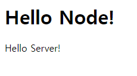

# 4. http 모듈로 서버 만들기

****

****


# 4.1 요청과 응답 이해

클라이언트에서 서버로 요청(request) 을 보내고 서버에서는 요청의 내용을 읽고 처리한 뒤 클라이언트에 응답(resoponse)을 보낸다.

따라서 서버는 요청을 받는 부분과 응답을 보내는 부분이 있어야 한다.

 **요청과 응답은 이벤트 방식**이라고 생각하면 된다.

클라이언트로 부터 요청이 왔을 때 어떤 작업을 수행할지 이벤트 리스너를 미리 등록해 두어야한다.


***<u>createServer.js</u>***

```js
const http = require('http');

http.createServer((req, res) => {
  // 응답 방식을 적는다.
});
```

**http 서버가 있어야 웹 브라우저의 요청을 처리할 수** 있으므로 **http 모듈**을 사용하였다.

http 모듈에는 **createServer 메서드**가 있다.

인수로 요청에 대한 콜백 함수를 넣을 수 있으며, 요청이 들어올 때마다 매번 콜백 함수가 실행된다.

따라서 이 콜백 함수에 응답을 적으면 된다.


createServer 의 콜백 부분을 보면 req 와 res 매개 변수가 있다.

* request 를 줄여 req
* response 를 줄여 res 

라고 표현한다.

즉 req 는 요청에 대한 정보를 res 는 응답에 관한 정보를 담고 있다.


***<u>server1.js</u>***

```js
const http = require('http');

http.createServer((req, res) => {
  res.writeHead(200, { 'Content-Type': 'text/html; charset=utf-8'});
  res.write('<h1>Hello Node!</h1>');
  res.end('<p>Hello Server!</p>');
}).listen(8080, () => { // 서버 연결
  console.log('8080번 포트에서 서버 대기 중')
});
```



http://localhost:8080/ 또는 http://127.0.0.1:8080 에 접속한 결과 위와 같은 페이지가 뜨게 된다.

createServer 메서드 뒤에 **listen 이라는 메서드**를 붙이고 

* 클라이언트에 공개할 **포트 번호**
* 열결 완료 후 실행될 **콜백 함수**

를 넣는다.

이 파일을 실행하면 **서버는 8080 포트에서 요청이 오기를 기다린다**.


res 객체에는 

* **res.writeHead** 

  응답에 대한 정보를 기록하는 메서드

  해당 정보가 기록되는 부분을 Header 라고 부른다.

  * 첫번째 인수로 성공적인 요청임을 의미하는 200

  * 두번째 인수로 응담에 대한 정보를 보내는데 콘텐츠의 형식이 HTML 이며 charset 이 utf-8 임을 알리고 있다.

    {'Content-Type': 'text/html; charset=utf-8'}

* **res.write**

  데이터가 기록되는 부분은 Body 이다.

  * 첫번째 인수는 클라이언트에게 보낼 데이터이다.
  * 버퍼를 보낼 수도 있다.
  * 여러번 호출해서 데이터를 여러개 보내도 된다.

* **res.end**

  응답을 종료하는 메서드이다. 

  인수가 있다면 그 데이터도 클라이언트로 보내고 응답을 종료한다. 

메서드가 있다.

브라우저는 각 메서드에서 받은 응답 내용을 렌더링한다.


* ### localhost 와 포트란?

  localhost 는 현재 컴퓨터의 내부 주소를 가리킨다. 외부에서는 접근 할 수 없고 자신의 컴퓨터에서만 접근할 수 있으므로, 서버 개발 시 테스트용으로 많이 사용된다. 

  localhost 대신 127.0.0.1 을 주소로 사용해도 같다.

  이러한 주소를 IP 라 부른다.

  

  포트는 서버 내에서 프로세스를 구분하는 번호이다. 

  서버는 HTTP 요청을 대기하는 것 외에도 다양한 작업을 한다.

  데이터베이스와도 통신해야하고, FTP 요청을 처리하기도한다.

  따라서 서버는 프로세스에 포트를 다르게 할당하여 들어오는 요청을 구분한다.

  **21(FTP) / 80(HTTP) / 443(HTTPS) / 3306(MYSQL)**

  포트 번호는 IP 주소 뒤에 콜론(:) 과 함께 붙여 사용한다.

  HTTP 주소에서 80번 포트를 사용하면 주소에서 포트를 생략할 수 있다.

  HTTPS 주소에서는 443번 포트를 사용하면 주소에서 포트를 생략할 수 있다.

  

  리눅스와 맥에서는 1024번 포트에 연결할 때 관리자 권한이 필요하다. 

  따라서 명령어 앞에 sudo 를 붙여야 한다. 


* ### 포트 충돌

  다른 서비스가 사용하고 있는 포트를 사용할 경우 Error: listen EADDRINUSE ::: 포트 번호 같은 에러가 발생한다.

  이런 경우에는 그 서비스를 종료하거나 노드의 포트를 다른 번호로 바꾸면 된다.


***<u>server1-1.js</u>***

```js
const http = require('http');

const server = http.createServer((req, res) => {
  res.writeHead(200, { 'Content-Type': 'text/html; charset=utf-8'});
  res.write('<h1>Hello Node!</h1>');
  res.end('<p>Hello Server!</p>');
});

server.listen(8080);

server.on('listening', () => {
  console.log('8080번 포트에서 서버 대기 중')
});

server.on('error', (error) => {
  console.error(error);
});
```


***<u>server1-2.js</u>***

```js
const http = require('http');

http.createServer((req, res) => {
  res.writeHead(200, { 'Content-Type': 'text/html; charset=utf-8'});
  res.write('<h1>Hello Node!!</h1>');
  res.end('<p>Hello Server!!</p>');
}).listen(8080, () => {
  console.log('8080번 포트에서 서버 대기 중')
});

http.createServer((req, res) => {
  reswriteHead(200, {'Content-Type': 'text/html; charset=utf-8'});
  res.write('<h1>Hello Node!!</h1>');
  res.end('<p>Hello Server!!</p>');
}).listen(8081, () => {
  console.log('8081번 포트에서 서버 대기 중')
});
```


각각 localhost:8080 과 localhost:8081 주소로 접속할 수 있다.

이때 포트 번호가 달라야한다.

포트 번호가 중복 되는 경우 EADDRINUSE 에러가 발생한다.

단, 실무에서는 이런 식으로 서버를 여러개 띄우는 일은 드물다.

res.write 와 res.end 에 일일이 HTML 을 적는 것은 비효율적이므로 미리 HTML 파일을 만들어 두면 좋다.

그 HTML 파일을 fs 모듈로 읽어 전송한다.


***<u>server2.html</u>***

```html
<!DOCTYPE html>
<html>
<head>
    <meta charset="utf-8" />
    <title>Node.js 웹 서버</title>
</head>
<body>
    <h1>Node.js 웹 서버</h1>
    <p>만들 준비되셨나요?</p>
</body>
</html>
```

***<u>server2.js</u>***

```js
const http = require('http');
const fs = require('fs').promises;

http.createServer(async (req, res) => {
  try {
    const data = await fs.readFile('./server2.html');
    res.writeHead(200, { 'Content-Type': 'text/html; charset=utf-8' });
    res.end(data);
  } catch (err) {
    console.error(err);
    res.writeHead(500, { 'Content-Type': 'text/plain; charset=utf-8' });
    res.end(err.message);
  }
})
  .listen(8081, () => {
    console.log('8081번 포트에서 서버 대기 중입니다!');
  });
```


요청이 들어오면 우선 fs 모듈로 html 파일을 읽는다. 

data 변수에 저장된 버퍼를 그대로 클라이언트에 보내면 된다. 

이전 예제에서는 문자열을 보냈지만, 저렇게 버퍼를 보낼 수도 있다.


* ### HTTP 상태 코드

  200이나 500 같은 숫자는 HTTP 상태 코드이다. 

  res.writeHead에 첫번째 인수로 상태 코드를 넣었는데 브라우저는 서버에서 보내주는 상태 코드를 보고 요청이 성공했는지 실패했는지를 판단한다. 

  * **2XX** : 

    성공을 알리는 상태코드이다. 

    대표적으로 200(성공), 201(작성됨)  이 많이 쓰인다.

  * **3XX** : 

    리다이렉션(다른 페이지로 이동) 을 알리는 상태 코드이다.

    어떤 주소를 입력했는데 다른 주소의 페이지로 넘어갈 때 이 코드가 사용된다.

    대표적으로 301(영구이동), 302(임시이동) 이 있다.

    304(수정되지 않음) 는 요청 응답으로 캐시를 사용했다는 뜻이다.

  * **4XX** :  

    요청오류를 나타낸다.

    요청 자체에 오류가 있을 때 표시된다.

    400(잘못된 요청), 401(권한 없음), 403(금지됨), 404(찾을 수 없음) 가 있다.

  * **5XX** : 

    서버 오류를 나타낸다.

    요청에는 문제가 없지만 서버에 오류가 발생했을때 발생한다. ㄴ

    이 오류가 뜨지 않도록 주의해야한다.

    res.writeHead로 클라이언트에 직접 보내는 경우는 거의 없고 예기치 못한 에러 발생 시 서버가 알아서 5xx 대 코드를 보낸다. 

    500(내부 서버 오류), 502(불량 게이트웨이), 503(서비스를 사용할 수 없음) 이 자주 사용된다.


****

# 4.2 REST 와 라우팅 사용하기


서버에 요청을 보낼 때는 주소를 통해 요청의 내용을 표현한다.

REST 는 **RE**presentational **S**tate **T**ransfer 의 줄임말이며, 서버의 자원을 정의하고 자원에 대한 주소를 지정하는 방법을 가리킨다.

일종의 약속이라 봐도 무방

자원이라고 해서 꼭 파일일 필요는 없고 서버가 행할 수 있는 것들을 통틀어서 의미한다고 보면 된다.

REST API 에는 많은 규칙들이 있으나 모든 규칙을 지키는 것은 현실적으로 어려우므로 기본적인 개념만 빌려 사용한다.


단순히 명사만 있으면 무슨 동작을 행하는 것인지 알기 어려우므로 REST 에서는 주소 외에도 **HTTP 요청 메서드** 라는 것을 사용한다.

* ### GET

  서버 자원을 가져오고자 할 때 사용

  요청 본문에 데이터를 넣지 않는다.

  데이터를 서버로 보내야한다면 쿼리 스트링을 사용한다.

* ### POST

  서버에 자원을 새로 등록하고자 할 때 사용

  요청의 본문에 새로 등록할 데이터를 넣어 보낸다.

* ### PUT

  서버의 자원을 요청에 들어 있는 자원으로 치환하고자 할 때 사용

  요청의 본문에 치환할 데이터를 넣어 보낸다.

* ### PATCH

  서버 자원의 일부만 수정하고자 할 때 사용

  요청의 본문에 일부 수정할 데이터를 넣어 보낸다.

* ### DELETE

  서버의 자원을 삭제하고자 할 때 사용한다.

  요청의 본문에 데이터를 넣지 않는다.

* ### OPTIONS

  요청을 하기 전에 통신 옵션을 설명하기 위해 사용한다.


주소 하나가 요청 메서드를 여러 개 가질 수 있다.

GET 메서드 같은 경우에는 브라우저에서 캐싱 할 수있어 같은 주소로 GET 요청을 할 때 서버에서 가져오는 것이 아니라 캐시에서 가져올 수도 있다.

이렇게 캐싱이 되면 성능이 좋아진다.


그리고 HTTP  통신을 사용하면 클라이언트가 누그든 상관 없이 같은 방식으로 서버와 소통할 수 있다.

IOS, 안드로이드, 웹, 다른 서버가 모두 같은 주소로 요청을 보낼 수 있다. 즉, 서버와 클라이언트가 분리되어 있다.

이렇게 서버와 클라이언트를 분리하면 추후에 서버를 확장할 때 클라이언트에 구애되지 않아 좋다.


 

***<u>restFront.css</u>***

```css
a { color: blue; text-decoration: none; }
```

***<u>restFront.html</u>***

```html
<!DOCTYPE html>
<html lang="ko">
<head>
  <meta charset="utf-8" />
  <title>RESTful SERVER</title>
  <link rel="stylesheet" href="./restFront.css" />
</head>
<body>
<nav>
  <a href="/">Home</a>
  <a href="/about">About</a>
</nav>
<div>
  <form id="form">
    <input type="text" id="username">
    <button type="submit">등록</button>
  </form>
</div>
<div id="list"></div>
<script src="https://unpkg.com/axios/dist/axios.min.js"></script>
<script src="./restFront.js"></script>
</body>
</html>
```

***<u>restFront.js</u>***

```js
async function getUser() { // 로딩 시 사용자 가져오는 함수
  try {
    const res = await axios.get('/users');
    const users = res.data;
    const list = document.getElementById('list');
    list.innerHTML = '';
    // 사용자마다 반복적으로 화면 표시 및 이벤트 연결
    Object.keys(users).map(function (key) {
      const userDiv = document.createElement('div');
      const span = document.createElement('span');
      span.textContent = users[key];
      const edit = document.createElement('button');
      edit.textContent = '수정';
      edit.addEventListener('click', async () => { // 수정 버튼 클릭
        const name = prompt('바꿀 이름을 입력하세요');
        if (!name) {
          return alert('이름을 반드시 입력하셔야 합니다');
        }
        try {
          await axios.put('/user/' + key, { name });
          getUser();
        } catch (err) {
          console.error(err);
        }
      });
      const remove = document.createElement('button');
      remove.textContent = '삭제';
      remove.addEventListener('click', async () => { // 삭제 버튼 클릭
        try {
          await axios.delete('/user/' + key);
          getUser();
        } catch (err) {
          console.error(err);
        }
      });
      userDiv.appendChild(span);
      userDiv.appendChild(edit);
      userDiv.appendChild(remove);
      list.appendChild(userDiv);
      console.log(res.data);
    });
  } catch (err) {
    console.error(err);
  }
}

window.onload = getUser; // 화면 로딩 시 getUser 호출
// 폼 제출(submit) 시 실행
document.getElementById('form').addEventListener('submit', async (e) => {
  e.preventDefault();
  const name = e.target.username.value;
  if (!name) {
    return alert('이름을 입력하세요');
  }
  try {
    await axios.post('/user', { name });
    getUser();
  } catch (err) {
    console.error(err);
  }
  e.target.username.value = '';
});
```

***<u>about.html</u>***

```html
<!DOCTYPE html>
<html>
<head>
  <meta charset="utf-8" />
  <title>RESTful SERVER</title>
  <link rel="stylesheet" href="./restFront.css" />
</head>
<body>
<nav>
  <a href="/">Home</a>
  <a href="/about">About</a>
</nav>
<div>
  <h2>소개 페이지입니다.</h2>
  <p>사용자 이름을 등록하세요!</p>
</div>
</body>
</html>
```

***<u>restServer.js</u>***

```js
const http = require('http');
const fs = require('fs').promises;

const users = {}; // 데이터 저장용

http.createServer(async (req, res) => {
  try {
    if (req.method === 'GET') {
      if (req.url === '/') {
        const data = await fs.readFile('./restFront.html');
        res.writeHead(200, { 'Content-Type': 'text/html; charset=utf-8' });
        return res.end(data);
      } else if (req.url === '/about') {
        const data = await fs.readFile('./about.html');
        res.writeHead(200, { 'Content-Type': 'text/html; charset=utf-8' });
        return res.end(data);
      } else if (req.url === '/users') {
        res.writeHead(200, { 'Content-Type': 'application/json; charset=utf-8' });
        return res.end(JSON.stringify(users));
      }
      // /도 /about도 /users도 아니면
      try {
        const data = await fs.readFile(`.${req.url}`);
        return res.end(data);
      } catch (err) {
        // 주소에 해당하는 라우트를 못 찾았다는 404 Not Found error 발생
      }
    } else if (req.method === 'POST') {
      if (req.url === '/user') {
        let body = '';
        // 요청의 body를 stream 형식으로 받음
        req.on('data', (data) => {
          body += data;
        });
        // 요청의 body를 다 받은 후 실행됨
        return req.on('end', () => {
          console.log('POST 본문(Body):', body);
          const { name } = JSON.parse(body);
          const id = Date.now();
          users[id] = name;
          res.writeHead(201, { 'Content-Type': 'text/plain; charset=utf-8' });
          res.end('ok');
        });
      }
    } else if (req.method === 'PUT') {
      if (req.url.startsWith('/user/')) {
        const key = req.url.split('/')[2];
        let body = '';
        req.on('data', (data) => {
          body += data;
        });
        return req.on('end', () => {
          console.log('PUT 본문(Body):', body);
          users[key] = JSON.parse(body).name;
          res.writeHead(200, { 'Content-Type': 'text/plain; charset=utf-8' });
          return res.end('ok');
        });
      }
    } else if (req.method === 'DELETE') {
      if (req.url.startsWith('/user/')) {
        const key = req.url.split('/')[2];
        delete users[key];
        res.writeHead(200, { 'Content-Type': 'text/plain; charset=utf-8' });
        return res.end('ok');
      }
    }
    res.writeHead(404);
    return res.end('NOT FOUND');
  } catch (err) {
    console.error(err);
    res.writeHead(500, { 'Content-Type': 'text/plain; charset=utf-8' });
    res.end(err.message);
  }
})
  .listen(8082, () => {
    console.log('8082번 포트에서 서버 대기 중입니다');
  });
```

