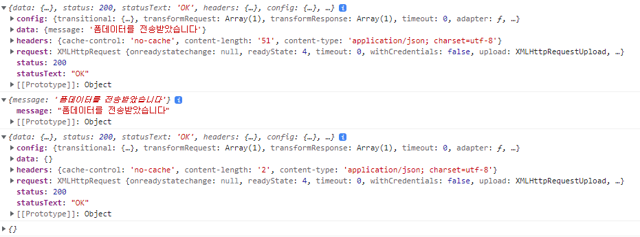

# 2. Javascript 문법


****


# 2.1 ES2015+


## 템플릿 문자열

'(작은 따옴표) 이 아닌 `(백틱) 으로 감싼 문자열이다. 해당 백틱 안에는 일반적인 문자열과 잘리 변수를 넣을 수 있다.

```javascript
let lastNm = '채'
let frstNm = '지훈'
let fullNm = '내이름은 ' + lastNm + frstNm + ' 입니다.'

console.log(fullNm)
//=> 실핻 결과 : 내이름은 채지훈 입니다.

let lastNm = '채'
let frstNm = '지훈'
let fullNm = `내이름은 ${lastNm}${frstNm} 입니다.`

console.log(fullNm)
//=> 실핻 결과 : 내이름은 채지훈 입니다.
```

위와 같이 기존 ' ' 를 사용하는 경우보다 간편하게 코드를 작성할 수 있다.


## 객체 리터럴

기존의 경우 객체를 사용할때

```javascript
let sayNode = function () {
  console.log("Node");
};
let es = 'ES';
let oldObject = {
	sayJS: function() {
		console.log('JS');
	},
	sayNode: sayNode,
};

oldObject[es + 6] = 'Fantastic';
oldObject.sayNode();
oldObject.sayJS();
console.log(oldObject.ES6);
```

 위와 같이 객체에 동적으로 속성을 추가하였다.

이코드를 다음과 같이 다시 쓸 수 있다.

```js
const newObject = {
	sayJS() {
		console.log('JS');
	},
	sayNode,
	[es + 6]: 'Fantastic',
};

newObject.sayNode();
newObject.sayJS();
console.log(newObject.ES6);
```

* 객체의 메서드에 함수를 연결할 때 더는 :(콜론) 과 function 을 붙이지 않아도 된다.
* 속성명과 변수 명이 같은 경우 한번만 써도 되도록 바뀌었다.
* 예전 문법에서는 위 ES6 라는 속성명을 만들기위해 객체 리터럴 바깥에서 [es + 6] 을 해야 했으나 이제 객체 리터럴 안에서 동적 속성을 선언해도 된다.


## Arrow function

 ```js
 function add1(x, y) {
 	return x + y;
 }
 
 const add2 = (x, y) => {
 	return x + y;
 }
 
 const add3 = (x, y) => x + y;
 
 const add4 = (x, y) => (x + y);
 
 function not1(x) {
 	return !x;
 }
 
 const not2 = x => !x;
 
 console.log(add1(1, 2)); // 3
 console.log(add2(1, 2)); // 3
 console.log(add3(1, 2)); // 3
 console.log(add4(1, 2)); // 3
 console.log(not1(1)); // false
 console.log(not2(1)); // false
 ```

위와 같이 return 문을 생략할 수 있다.

this 바인드 방식에서도 차이가 난다.

```js
let relationship1 = {
	name: 'zero',
	friends: ['nero', 'hero', 'xero'],
	logFriends: function() {
		let that = this;
		this.friends.forEach(function (friend) {
			console.log(that.name, friend);
		});
	},
};
relationship1.logFriends();

const relationship2 = {
	name: 'zero',
	friends: ['nero', 'hero', 'xero'],
	logFriends: function() {
		this.friends.forEach(friend => {
			console.log(this.name, friend);
		});
	},
};
relationship2.logFriends();
```

위 예시를 보면 기존의 방식에서는 forEach 문 내부의 function 과 이전의 function 은 서로 다른 스코프의 this 를 가지므로 forEach 문 내부의 함수에 접근하기 전 that 이라는 변수에 기존의 this 를 담아 사용하고 있는 것을 확인할 수 있다.

하지만 Arrow function 을 사용할 시 상위 스코프의 this를 그대로 물려받아 사용할 수 있다.


## 구조 분해 할당

```js
// 구조 분해 할당
let candyMachine = {
  status: {
    name: "node",
    count: 5,
  },
  getCandy: function () {
    this.status.count--;
    return this.status.count;
  }
};
// var getCandy = candyMachine.getCandy;
// console.log(getCandy());
// var count = candyMachine.status.count;
// console.log(count);
// =>
const {
  getCandy,
  status: { count },
} = candyMachine;
```


## 클래스

다음은 프로토타입 기반 문법을 클래스로 바꾼 것이다.

```js
var Human = function (type) {
  this.type = type || "human";
};

Human.ishuman = function (human) {
  return human instanceof Human;
};

Human.prototype.breathe = function () {
  alert("h-a-a-a-m");
};

var Zero = function (typ, firstName, lastName) {
  Human.apply(this, arguments);
  this.firstName = firstName;
  this.lastName = lastName;
};

Zero.prototype = Object.create(Human.prototype);
Zero.prototype.constructor = Zero; //상속이 이루어지는 부분
Zero.prototype.sayName = function () {
  alert(`${this.firstName} ${this.lastName}`);
};

var oldZero = new Zero("human", "Zero", "Cho");

Human.ishuman(oldZero);
```

현 코드는 prototype 기반으로 Object.create() 를 활용해 상속을 구현한 것이다.

해당 내용에 대한 자세한 내용은 TIL/web/JS_OOP 에서 공부한 바 있다.

이를 CLASS 를 활요하여 구현하면

다음과 같다.

```js
class Human {
  constructor(type = "human") {
    this.type = type;
  }

  static ishuman(human) {
    return human instanceof Human;
  }
  breathe() {
    alert("h-a-a-a-m");
  }
};

class Zero extends Humane {
	constructor(type, firstName, lastName) {
		super(type);
		this.firstName = firstName;
		this.lastName = lastName;
	}

	sayName() {
		super.breathe();
		alert(`${this.firstName} ${this.lastName}`);
	}
};

const newZero = new Zero('human', 'Zero', 'Cho');

Human.ishuman(newZero);
```

생성자 함수는 constructor 안으로 들어갔으며 Human.isHuman 같은 클래스 함수는 static 키워드로 전환되었다.

프로토타입 함수들도 모두 class 블록 안에 포함되어 어떤 함수가 어떤 클래스 소속인지 보기 쉬워졌다.

상속 또한 extends 키워드로 쉽게 가능하다.

다만 이렇게 class 문법으로 바뀌었다고 하여도 js 는 prototype 기반으로 동작한다는 것을 기억해야 한다.


## Promise

자바스크립트와 노드에서는 주로 비동기를 접한다. 특히 이벤트 리스너를 사용할 때 콜백 함수를 자주 사용한다.

ES2015 부터는 자바스크립트와 노드의 API 들이 콜백 대신 Promise 기반으로 재구성 되며, 악명 높은 callback 지옥 현상을 극복했다는 평가를 받고 있다.

Promise 는 반드시 알아두어야 하는 객체이다.

프로미스를 사용하기 위해서는 먼저 프로미스 객체를 생성해야한다.

```js
const condition = true;
const promise = new Promise((resolve, reject) => {
	if (condition) {
		resolve('성공');
	} else {
		reject('실패');
	}
});

promise
	.then((message) => {
		console.log(message);
	})
	.catch((error) => {
		console.log(error);
	})
	.finally(() => {
		console.log('무조건');
	});
	
```

new Promise 를 통해 promise 를 생성할 수 있으며 그 내부에 resolve 와 reject 를 매개변수로 갖는 callback 함수를 넣는다.

이렇게 만든 promise 변수에 then 과 catch 메서드를 붙일 수 있다.

프로미스 내부에서 resolve 가 호출 되면 then 이 실행되고, reject 가 호출 되면 catch 가 실행된다.

finally 는 성공 / 실패 여부와 상관없이 실행된다.

resolve 와 reject 에 넣어준 인수는 각각 then 과 catch 의 매개변수에서 받을 수 있다.

즉, resolve('성공') 이 호출 되면 then 의 message 가 '성공' 이된다. 

만약 reject('실패') 가 호출 되면 catch 의 error 가 '실패' 가 되는 것이다.

condition 변수를 false 로 바꿔 보면 catch 에서 에러가 로깅된다.  

프로미스를 쉽게 설명하자면, 실행은 바로 하되 결괏값은 나중에 받는 객체이다. 결괏값은 실행이 완료된 후 then 이나 catch 메서드를 통해 받는다.

위 예제에서는 new Promise 와 promise.then 사이에 다른 코드가 들어갈 수 있다. new Promise 는 바로 실행되지만 결괏값은 then 을 붙였을 때 받게 된다.

then 이나 catch 에서 다른 then 이나 catch 를 붙일 수 있다. 이전 then 의 return 값을 다음 then 의 매개변수로 넘긴다. 프로미스를 return 한 경우에는 프로미스가 수행된 후 다음 then 이나 catch 가 호출 된다.

```js
promise
  .then((message) => {
    return new Promise((resolve, reject) => {
      resolve(message);
    });
  })
  .then((message2) => {
    console.log(message2);
    return new Promise((resolve, reject) => {
      resolve(message2);
    });
  })
  .then((message3) => {
    console.log(message3);
  })
  .catch((error) => {
    console.error(error);
  })
```

처음 then 에서 message 를 resolve 하면 다음 then 에서 message2 로 받을 수 있다.

여기서 message2 를 resolve 한 것을 다음 then 에서 message3 로 받았다. 

단 then 에서 new Promise 를 return 해야 다음 then 에서 받을 수 있다는 것을 기억해야한다.

이것을 활용해서 callback을 프로미스로 바꿀 수 있다.

다음은 callback 을 쓰는 패턴 중 하나이다.

차후 8장을 배우면 이 코드를 더 정확히 이해할 수 있다.

```js
function findAndSaveUser(Users) {
  Users.findOne({}, (err, user) => {  // 첫번째 콜백
    if (err) {
      return console.error(err);
    }
    user.name = 'zero';
    user.save((err) => { // 두번째 콜백
      if(err) {
        return console.error(err);
      }
      Users.findOne({ geender : 'm' }, (err, user) => {
        // 생략
      });
    });
  });
}
```

콜백 함수가 세 번 중첩되어 있다. 콜백 함수가 나올 때마다 코드의 깊이가 깊어진다.

각 콜백 함수마다 에러도 따로 처리해줘야 한다. 이 코드를 다음과 같이 바꿀 수 있다.

```js
function findAndSaveUser(Users) {
  Users.findOne({}) 
    .then((usuer) => {
      user.name = 'zero';
      return user.save();
    })
    .then((user) => {
      return Users.findOne({ gender: 'm' });
    })
    .then((user) => {
      // 생략
    })
    .catch(err => {
      console.error(err);
    });
}
```

코드의 깊이가 세단계 이상 깊어지지 않는다. 위 코드에서 then 메서드들은 순차적으로 실행된다.

콜백엣 매번 따로 처리해야 했던 에러도 마지막 catch 에서 한번에 처리할 수 있다.

하지만 모든 콜백 함수를 위와 같이 바꿀 수 있는 것은 아니다.

메서드가 프로미스 방식을 지원해야한다.

예제의 코드는 findOne 과 save 메서드가 내부적으로 프로미스 객체를 가지고 있다고 가정했기에 가능하다.(new Promise 가 함수 내부에 구현되어있어야한다.) 

지원하지 않을 경우 콜백 함수를 프로미스로 바꿀 수 있는 방법은 3.5.6절에 나와있다.

프로미스 여러 개를 한번에 실행할 수 있는 방법이 있다. 기존의 콜백 패턴이었다면 콜백을 여러번 중첩해서 사용해야했을 것이다.

하지만 Promise.all 을 활용하면 간단히 해결 가능하다.

```js
const promise1 = Promise.resolve('성공1');
const promise2 = Promise.resolve('성공2');
Promise.all([promise1, promise2])
  .then((result) => {
    console.log(result);
  })
  .catch((error) => {
    console.error(error);
  });
```

 Promise.resolve 는 즉시 resolve 하는 프로미스를 만드는 방법이다. 비슷한 것으로 즉시 reject 하는 Promise.reject 도 있다. 

프로미스가 여러개 있을 때 Promise.all 에 넣으면 모두 resolve 될 때까지 기다렸다가 then 으로 넘긴다.

result 매개변수에 각각의 프로미스 결괏값이 배열로 들어있다. Promise 중 하나라도 reject 되면 catch 로 넘어간다.


## async / await

노드 7.6 버전 부터 지원되는 기능이다. ES2017 에서 추가되었으며 알아두면 정말 편리한 기능이다. 특히 노드 처럼 비동기 위주로 프로그래밍을 해야 할 때 도움이 많이 된다.

프로미스가 콜백 지옥을 해결했다지만, 여전히 코드가 장황하다. then 과 catch 가 계속 반봅되기 때문이다.

async / await 문법은 프로미스 를 사용한 코드를 한 번 더 깔끔하게 줄여준다.

```js
function findAndSaveUser(Users) {
  Users.findOne({}) 
    .then((usuer) => {
      user.name = 'zero';
      return user.save();
    })
    .then((user) => {
      return Users.findOne({ gender: 'm' });
    })
    .then((user) => {
      // 생략
    })
    .catch(err => {
      console.error(err);
    });
}
```

위에서 보았던 코드를 다시한번 보자

콜백과 다르게 코드의 깊이가 깊어지진 않았지만, 코드는 여전히 길다. async / await 문법을 사용하면 다음과 같이 바꿀 수 있다. 

async function 이라는 것이 추가되었다.

```js
async function findAndSaveUser(Users) {
  let user = await Users.findOne({});
  user.name = 'zero';
  user = await user.save();
  user = await Users.findOne({ gender: 'm' });
  // 생략
}
```

놀라울 정도로 코드가 짧아졌다.

함수 선언부를 일반 함수 대신 async function 으로 교체한 후, 프로미스 앞에 await 를 붙였다. 

이제 함수는 해당 프로미스가 resolve 될 때 까지 기다린 뒤 다음 로직으로 넘어간다. 예를 들면 await User.findOne({}) 이 resolve 될 때 까지 기다린 다음에 user 변수를 초기화 하는 것이다.

위 코드는 에러를 처리하는 부분(프로미스가 reject 된 경우) 이 없으므로 다음과 같은 추가 작업이 필요하다.

```js
async function findAndSaveUser(Users) {
  try {
    let user = await Users.findOne({});
    user.name = 'zero';
    user = await user.save();
    user = await Users.findOne({ gender: 'm' });
    // 생략
  } catch (error) {
    console.error(error);
  }
};
```

 for 문과 async / await 를 같이 써서 프로미스를 순차적으로 실행할 수 있다. 

for 문과 함께 쓰는 것은 노드 10 버전부터 지원하는 ES2018 문법이다.

```js
const promise1 = Promise.resolve('성공1');
const promise2 = Promise.resolve('성공2');
(async () => {
  for await (promise of [promise1, promise2]) {
    console.log(promise);
  }
});
```

 for await of 문을 사용해서 프로미스 배열을 순회하는 모습이다. async 함수의 반환 값은 항상 Promise 로 감싸진다.

따라서 실행 후 then 을 붙이거나 또 다른 async 함수 안에서 await 를 붙여서 처리할 수 있다.

```js
async function findAndSaveUser(Users) {
  // 생략
}
findAndSaveUser().then(() => { /* 생략 */ });
// 또는
async function ohter() {
  const result = await findAndSaveUser();
}
```

앞으로 중첩되는 콜백 함수가 있다면 프로미스를 거쳐 async / await 문법으로 바꾸는 연습이 필요하다.


****

# 프론트엔드 자바스크립트


## AJAX

AJAX 는 비동기적 웹 서비스를 개발할 때 사용하는 기법이다.

이름에 XML 이 들어있지만 꼭 XML 을 사용해야 하는 것은 아니며, 요즘에는 JSON 을 많이 사용한다.

쉽게 말해 페이지 이동 없이 서버에 요청을 보내고 응답 받는 기술이다. 요청과 응답은 4.1 절에 설명 되어있다.

웹 사이트중 페이지 전환 없이 새로운 데이터를 불러오는 사이트는 대부분 AJAX  기술을 사용하고 있다고 보면 된다.

보통 AJAX 요청은 jQuery 나 axios 같은 라이브러리를 이용해서 보낸다. 

브라우저에서 기본적으로 XMLHttpRequest 객체를 제공하긴 하지만, 사용 방법이 복잡하고 서버에서는 사용할 수 없으므로 이 책에서는 전반적으로 axios 를 사용한다.

프런트엔드에서 사용하려면 HTML 파일을 하나 만들고 그 안에 script 태그를 추가해야 한다.

두 번째 script 태그 안에 앞으로 나오는 프론트엔드 예제 코드를 넣으면 된다.

```html
<script src="https://unpkg.com/axios/dist/axios.min.js"></script>
<script>
  axios.get("https://www.zerocho.com/api/get")
    .then((result) => {
      console.log(result);
      console.log(result.data); // {}
    })
    .catch((error) => {
      console.error(error);
    });
</script>
```

axios.get 는 내부에 new Promise 가 들어 있으므로 then 과 catch 를 사용할 수 있다.

result.data 에는 서버로부터 보낸 데이터가 들어 있다. 

이는 개발자 도구 Console 탭에서 확인할 수 있다.

프로미스이므로 async / await 방식으로 변경할 수 있다.

```html
<script src="https://unpkg.com/axios/dist/axios.min.js"></script>
<script>
	(async () => {
		try {
			const result = await axios.get('https://www.zerocho.com/api/get');
			console.log(result);
			console.log(result.data); // {}
		} catch (error) {
			console.error(error);
		}
	})();
</script>
```

익명의 즉시 실행 arrow function 은 소괄호로 감싸서 호출한다.

다음은 POST 방식으로 요청을 보내는 code 이다.

POST 요청에서는 데이터를 서버로 보낼 수 있다.

```html
<script src="https://unpkg.com/axios/dist/axios.min.js"></script>
<script>
	(async () => {
		try {
			const result = await axios.post('https://www.zerocho.com/api/post/json', {
				name: 'zerocho',
				birth: 1994,
			});
			console.log(result);
			console.log(result.data); // {}
		} catch (error) {
			console.error(error);
		}
	})();
</script>
```

전체적인 구조는 비슷한데 두 번째 인수로 데이터를 넣어 보내는 것이 다르다.

GET 요청이면 axios.get 을 POST 요청이면 axios.post 를 사용한다.


## FormData


HTML form 태그의 데이터를 동적으로 제어할 수 있는 기능이다. 주로 AJAX 와 함께 사용한다.

```js
	const formData = new FormData();
	formData.append('name', 'zerocho');
	formData.append('item', 'orange');
	formData.append('item', 'melon');
	formData.has('item'); // true
	formData.has('money'); // false
	formData.get('item'); // orange
	formData.getAll('item'); // ['orange', 'melon']
	formData.append('test', ['hi', 'zero']);
	formData.get('test'); // hi, zero
	formData.delete('test');
	formData.get('test'); // null
	formdata.set('item', 'apple');
	formData.getAll('item'); // ['apple']
```

생성된 객체의 append 메서드로 키-값 형식의 데이터를 저장할 수 있다. 

append 메서드를 여러 번 사용하여 키 하나에 여러 개의 값을 추가해도 된다.

has 메서드는 주어진 키에 해당하는 값이 있는지 여부를 알린다. 

get 메서드는 주어진 키에 해당하는 값 하나를 가져오며

getAll 메서드는 해당하는 모든 값을 가져온다.

delete 메서드는 현재 키를 제거하는 메서드이다.

set 메서드는 현재 키를 수정한다.


다음은 axios 로 폼 데이터를 서버에 보내는 code 이다.

```js
	(async () => {
		try {
			const formData = new FormData();
			formData.append('name', 'zerocho');
			formData.append('birth', 1994);
			const result = await axios.post('https://www.zerocho.com/api/post/formdata', formData);
			console.log(result);
			console.log(result.data);
		} catch (error) {
			console.error(error);
		}
	})();
```

두번째 인수에 데이터를 넣어 보낸다.




## encodeURIComponent, decodeURIComponent

AJAX 요청을 보낸 때, 'http://localhost:4000/search/노드' 처럼 주소에 한글이 들어가 있는 경우가 있다.

서버 종류에 따라 다르지만 서버가 한글 주소를 이해하지 못하는 경우가 있는데 이럴때는 window 객체의 메서드인 encodeURIComponent 메서드를 사용한다. 노드에서도 사용할 수 있다.

한글 주소 부분만 encodeURIComponent 메서드로 감싼다.

```js
	(async () => {
		try {
			const result = await axios.get(`https://www.zerocho.com/api/search/${encodeURIComponent('노드')}`);
			console.log(result);
			console.log(result.data);
		} catch (error) {
			console.error(error);
		}
	})();
```

노드라는 한글 주소가 %EB%85%B8%EB%93%9C 라는 문자열로 변환되었다.

받는 쪽에서는 decodeURIComponent 를 사용하면 된다. 역시 브라우저뿐 아니라 노드에서도 사용 가능하다.

```js
decodeURIComponent('%EB%85%B8%EB%93%9C'); // 노드
```

한글이 다시 원래 상태로 복구 되었다. 


## 데이터 속성과 dataset

노드를 웹 서버로 사용하는 경우, 클라이언트(프런트엔드) 와 빈번하게 데이터를 주고받게 된다.

자바스크립트 변수에 저장해도 되지만 HTML5 와 HTML 과 관련된 데이터를 저장하는 공식적인 방법이 있다.

바로 데이터 속성(data attribute) 이다.

```html
<ul>
  <li data-id="1" data-user-job="programmer">Zero</li>
  <li data-id="2" data-user-job="designer">Nero</li>
  <li data-id="3" data-user-job="programmer">Hero</li>
  <li data-id="4" data-user-job="ceo">Kero</li>
</ul>
<script>
  console.log(document.querySelector('li').dataset);
  // { id: '1', userJob: 'programmer' } 
</script>
```

HTML 태그 속성으로 data- 로 시작하는 것들을 넣는다. 

이들이 데이터 속성이다. 여기서 data-id 와 data-user-job 을 주었다. 화면에 나타나지는 않지만 웹 어플리케이션 구동에 필요한 데이터들이다. 

데이터 속성의 장점은 자바스크립트로 쉽게 접근 할 수 있다는 점이다.

script 태그를 보면 dataset 속성을 통해 첫 번째 li 태그의 데이터 속성에 접근하고 있다. 

단, 데이터 속성 이름이 조금씩 변형되었다. 앞의 data- 접두어는 사라지고 - 뒤에 위치한 글자는 대문자가 된다.

data-id 는 id . data-user-job 은 userjob 이 되는 것이다.

반대로 dataset에 데이터를 넣어도 HTML 태그에 반영된다. dataset.monthSalary=10000; 을 넣으면 

data-month-salary="10000"이라는 속성이 생긴다.

  


이때 서버에서 보내준 데이터를 프런트엔드 