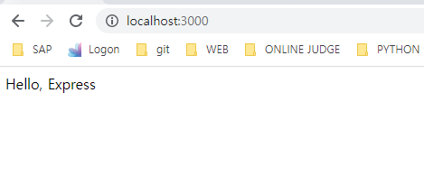
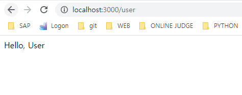

# 6. 익스프레스 웹 서버 만들기

****

****


4장에서의 웹 서버를 코드는 가독성도 떨어지고 확장성도 좋지 않다.

npm 에는 서버를 제작하는 과정에서의 불편함을 해소하고 편의 기능을 추가한 웹 서버 프레임워크가 있다.

대표적인 것이 익스프레스이다.

익스프레스는 http 모듈의 요청과 응답 객체에 추가 기능들을 부여했다.

기존 메서드들도 계속 사용할 수 있지만 편리한 메서드들을 추가하여 기능들을 부여했다.

기존 메서드들도 계속 사용할 수 있지만 편리한 메서드들을 추가하여 기능을 보완했다.

또한 코드를 분리하기 쉽게 만들어 관리하기도 용이하다.

더이상 if 문으로 요청 메서드와 주소를 구별하지 않아도 된다.


* ### express 이외에는?

  koa나 hapi 같은 웹서버 프레임워크가 있다.

  하지만 npm 패키지의 다운로드 수를 비교할 수 있는 npmtrends(http://www.npmtrends.com/) 에 따르면 익스프레스가 다른 두 프레임워크에 비해 압도적으로 사용량이 많다.


****

# 6.1 익스프레스 프로젝트 시작하기


***<u>package.json</u>***

```js
{
  "name": "learn-express",
  "version": "0.0.1",
  "description": "express 학습",
  "main": "index.js",
  "scripts": {
    "start": "nodemon app",
    "test": "echo \"Error: no test specified\" && exit 1"
  },
  "author": "cjhoon",
  "license": "MIT",
  "dependencies": {
    "express": "^4.18.1"
  },
  "devDependencies": {
    "nodemon": "^2.0.19"
  }
}
```

nodemon 모듈로 서버를 자동으로 재시작한다. 

서버 코드를 수정하면 nodemon 이 서버를 자동으로 재시작한다.

nodemon이 실행되는 콘솔에 rs 를 입력해서 수동으로 재시작 할 수 있다.

nodemon 은 개발용으로만 사용하는 것을 권장한다. 

배포 후에는 서버 코드가 빈번하게 변경될 일이 없으므로 nodemon  을 사용하지 않아도 된다.


***<u>app.js</u>***

```js
const express = require('express');

const app = express();
app.set('port', process.env.PORT || 3000);

app.get('/', (req, res) => {
  res.send('Hello, Express');
});

app.listen(app.get('port'), () => {
  console.log(app.get('port'), '번 포트에서 대기 중');
});
```

Express 모듈을 실행해 app 변수에 할당한다. 

익스프레스 내부에 http 모듈이 내장되어 있으므로 서버의 역할을 할 수 있다.

app.set('port', 포트) 로 서버가 실행될 포트를 설정한다.

process.env 객체에 PORT 속성이 있다면 그 값을 사용하고 없다면 기본값 3000 번 포트를 이용하도록 되어있다.

이렇게 **app.set(키, 값) 을 사용해서 데이터를 저장**할 수 있다.

나중에 **데이터를 app.get(키) 로 가져올 수 있다.**


**app.get(주소, 라우터)** 는 주소에 대한 **GET 요청이 올 때 어떤 동작을 할지** 적는 부분이다.

매개변수 **req 는 요청에 관한 정보**가 들어있는 객체이고, **res는 응답에 관한 정보**가 들어있는 객체이다.

현재 GET / 요청 시 응답으로 Hello, Express 를 전송한다.

**익스프레스에서는 res.write나 res.end 대신 res.send 를 사용**하면 된다.

GET 요청 이외에도 POST, PUT, PATCH, DELETE, OPTIONS 에 대한 라우터를 위한 app.post, app.put, app.patch, app.delete, app.options 메서드가 존재한다.

listen 을 하는 부분은 http 웹 서버와 동일하다. 

포트는 app.get('port') 로 가져왔다.

```js
$ npm start

> learn-express@0.0.1 start
> nodemon app

[nodemon] 2.0.19
[nodemon] to restart at any time, enter `rs`
[nodemon] watching path(s): *.*
[nodemon] watching extensions: js,mjs,json
[nodemon] starting `node app.js`
3000 번 포트에서 대기 중
```


***<u>index.html</u>***

```html
<html>
<head>
  <meta charset="UTF-8" />
  <title>익스프레스 서버</title>
</head>
<body>
  <h1>익스프레스</h1>
  <p>배워봅시다.</p>
</body>
</html>
```

***<u>app.js</u>***

```js
const express = require('express');
const path = require('path')

const app = express();
app.set('port', process.env.PORT || 3000);

app.get('/', (req, res) => {
  res.sendFile(path.join(__dirname, '/index.html'));
});

app.listen(app.get('port'), () => {
  console.log(app.get('port'), '번 포트에서 대기 중');
});
```

단순한 문자열 대신 HTML 로 응답하는 경우 **res.sedFile** 메서드를 사용한다.

파일의 경로는 path 모듈을 사용해서 지정한다.


****

# 6.2 자주 사용하는 미들웨어


미들웨어는 익스프레스의 핵심이다.

요청과 응답의 중간 (미들 (middle)) 에 위치하여 미들웨어라 부른다.

뒤에 나오는 라우터와 에러 핸들러 또한 미들웨어의 일종이므로 미들웨어가 익스프레스의 전부라고 해도 과언이 아니다.

미들웨어는 요청과 응답을 조작하여 기능을 추가하기도 나쁜 요청을 걸러내기도 한다.


미들 웨어는 **app.use 와 함께 사용**된다.

**app.use(미들웨어)** 방식의 코드를 사용한다.

***<u>app.js</u>***

```js
const express = require('express');
const path = require('path')

const app = express();
app.set('port', process.env.PORT || 3000);

app.use((req, res, next) => {
  console.log('모든 요청에 다 실행');
  next();
});

app.get('/', (req, res, next) => {
  console.log('GET / 요청에서만 실행된다.');
  next();
}, (req, res) => {
  throw new Error('에러는 에러 처리 미들웨어로 간다.')
});

app.use((err, req, res, next) => {
  console.error(err);
  res.status(500).send(err.message);
})

app.listen(app.get('port'), () => {
  console.log(app.get('port'), '번 포트에서 대기 중');
});
```

app.use 에 매개변수가 req, res, next 인 함수를 넣으면 된다.

미들웨어는 위에서부터 아래로 순서대로 실행되면서 요청과 응답 사이에 특별한 기능을 추가할 수 있다.

next 라는 세번째 매개변수는 다음 미들웨어로 넘어가는 함수이다.

next 를 실행하지 않으면 다음 미들웨어가 실행되지 않는다.

주소를 첫번째 인수로 넣어주지 않는다면 미들웨어는 모든 요청에서 실행되고, 주소를 넣는다면 해당하는 요청에서만 실행된다고 보면 된다.

| **app.use(미들웨어)**           | **모든 요청에 미들웨어 실행**                   |
| ------------------------------- | ----------------------------------------------- |
| **app.use('/abc', 미들웨어)**   | **abc 로 시작하는 요청에서 미들웨어 실행**      |
| **app.post('/abc', 미들 웨어)** | **abc 로 시작하는 POST 요청에서 미들웨어 실행** |

app.use 나 app.get 같은 라우터에 미들웨어를 여러개 장착할 수 있다.

이 경우에도 next 를 호출해야 다음 미들웨어로 넘어갈 수 있다.


app.get 라우터에 미들웨어가 두개 연결되어있다.

app.get('/') 의 **두번째 미들웨어에서 에러가 발생**하고, 이 에러는 그 **아래에 있는 에러 처리 비들웨어에 전달**된다.

에러 처리 미들웨어는 매개변수가 err, req, res, next 로 네개이다.

모든 매개변수를 **사용하지 않더라도 매개 변수가 반드시 네개**여야한다.

err 에는 에러에 관한 정보가 담겨있다.

res.status 메서드로 HTTP 상태 코드를 지정할 수 있다.

에러처리 미들웨어를 직접 연결하지 않아도 기본적으로 익스프레스에서 에러를 처리하긴 하지만 실무에서는 직접 에러처리 미들웨어를 연결해 주는 것이 좋다.

특별한 경우가 아니면 가장 아래에 위치시킨다.


```js
$ npm i morgan cookie-parser express-session dotenv
```

dotenv 를 제외한 다른 패키지들은 미들웨어이다.

dotenv 는 process.env 를 관리하기 위해 설치한다.

***<u>app.js</u>***

```js
const express = require('express'); 
const morgan = require('morgan');
const cookieParser = require('cookie-parser');
const session = require('express-session');
const dotenv = require('dotenv');
const path = require('path');

dotenv.config();
const app = express();
app.set('port', process.env.PORT || 3000);

app.use(morgan('dev'));
app.use('/', express.static(path.join(__dirname, 'public')));
app.use(express.json());
app.use(express.urlencoded({extended: false}));
app.use(cookieParser(process.env.COOKIESECRET));
app.use(session({
  resave: false,
  saveUninitialized: false,
  secret: process.env.COOKIESECRET,
  cookie: {
    httpOnly: true,
    secure: false,
  },
  name: 'session-cookie',
}));

app.use((req, res, next) => {
  console.log('모든 요청에 다 실행');
  next();
});

app.get('/', (req, res, next) => {
  console.log('GET / 요청에서만 실행된다.');
  next();
}, (req, res) => {
  throw new Error('에러는 에러 처리 미들웨어로 간다.')
});

app.use((err, req, res, next) => {
  console.error(err);
  res.status(500).send(err.message);
})

app.listen(app.get('port'), () => {
  console.log(app.get('port'), '번 포트에서 대기 중');
});
```

***<u>.env</u>***

```
COOKIE_SECRET=cookiesecret
```

req, res, next 같은 매개 변수들은 미들 웨어 내부에 들어있다.

next 도 내부적으로 호출하기에 다음 미들웨어로 넘어갈 수 있다.


dotenv 패키지는 .env 파일을 읽어 process.env 로 만든다.

dotenv 패키지의 이름이 dot+env 인 이유이다.

process.env.COOKIE_SECRET 에 cookiesecret 값이 할당된다.

key=value 구조로 추가하면 된다.

process.env 를 별도의 파일로 관리하는 이유는 보안과 설정의 편의성 때문이다.

비밀 키들을 소스코드에 그대로 적어두면 소스 코드가 유출 되었을 시 키도 같이 유출된다.

따라서 .env 같은 별도의 파일에 비밀 키를 적어두고 dotenv 패키지로 비밀키를 로딩하는 방식으로 관리하곤 한다.


* ## 6.2.1 morgan

  morgan 연결후 localhost:3000에 다시 접속하면 기존 로그 외에 추가적인 로그를 볼 수 있다.

  `GET / 500 25.230 ms - 35` 

  이 로그는 morgan 미들 웨어에서 나오는 것이다.

  요청과 응답에 대한 정보를 콘솔에 기록한다.

  morgan 미들 웨어는 다음과 같이 사용한다.

   ```js
   app.use(morgan('dev'));
   ```

  인수로 dev 외에 **combined, common, short, tiny** 등을 넣을 수 있다.

  인수를 바꾸면 로그가 달라진다.

  dev 모드 기준으로 `GET / 500 25.230 ms - 35`  은 각각 

  [HTTP 메서드] [주소] [HTTP 상태 코드] [응답속도] - [응답 바이트]

  를 의미한다.

  요청과 응답을 한눈에 볼 수 있어 편리하다.


* ## 6.2.2 static

  static 미들웨어는 정적인 파일들을 제공하는 라우터 역할을 한다.

  기본적으로 제공되기에 따로 설치할 필요 없이 express 객체안에서 꺼내 장착하면 된다.

  ```js
  app.use('요청 경로', express.static('실제 경로'));
  app.use('/', express.static(path.join(__dirname, 'public')));
  ```

  함수의 인수로 정적 파일이 담긴 폴더를 지정한다.

  위의 경우 public 폴더가 지정되어있다.

  public 폴더 내부에 stylesheets/style.css 파일이 있다면 localhost:3000/stylesheets/style.css 로 접근할 수 있다.

  즉 서버 폴더 경로와 요청 경로가 다르므로 서버 구조를 쉽게 파악할 수 없어

  보안에 큰 도움이 된다.

  

  또한 정적 파일들을 알아서 제공해주므로 4.3 절 처럼 fs.readFile 로 파일을 직접 읽어서 전송할 필요가 없다.

  파일을 발견한 경우 다음 미들웨어는 실행되지 않고 응답으로 파일을 보낸다.

  만약 요청 파일이 없는 경우 알아서 내부적으로 next 를 호출한다.


* ## 6.2.3 body-parser

  요청의 **본문에 있는 데이터를 해석해 req.body 객체로 만들어주는 미들웨어**이다.

  보통 폼 데이터나 AJAX 요청의 데이터를 처리한다.

  단, 멀티파트(이미지, 동영상, 파일) 데이터는 처리하지 못한다.

  이 경우에는 multer 모듈을 사용한다.

  

  4.16.0 버전부터 body-parser 미들웨어의 일부 기능이 익스프레스에 내장되어 따로 설치할 필요가 없다.

  JSON 과 URL-encoded 형식의 데이터 외에도 Raw, Text 형식의 데이터를 추가로 해석할 수 있다. 이런 경우 추가로 설치해야한다.

  Raw 는 요청의 본문이 버퍼 데이터일 때, Text 는 텍스트 데이터일 때 해석하는 미들 웨어이다.버퍼나 텍스트 요청을 처리할 필요가 있는 경우

  body-parser 를 설치한 후 `$ npm i body-parser`

  ```js
  const bodyParser = require('body-parser');
  app.use(bodyParser.raw());
  app.use(bodyParser.text());
  ```

  와 같이 처리한다.

  

  ```js
  app.use(express.json());
  app.use(express.urlencoded({extended: false}));
  ```

  `.json() `은 JSON 형식의 데이터 전달 방식이고

  `.urlencoded({extended: false})`은 주소 형식으로 데이터를 보내는 방식이다.(폼 전송에 사용된다)

   `extended: false` 라는 옵션은 노드의 querysting 모듈을 사용하여 쿼리 스트링을 해석하는 방식이며 

  `extended: true` 인 경우 qs 모듈을 사용하여 쿼리 스트링을 해석한다.

  qs 모듈은 내장 모듈이 아니라 npm 패키지이며, querystring 모듈의 기능을 좀 더 확장한 모듈이다.

  

  4.2 절의 POST 와 PUT 요청의 본문을 전달받으려면 req.on('data') 와 req.on('end') 로 스트림을 사용해야했으나

  body-parser 를 사용하면 내부적으로 스트림을 처리해 req.body 에 추가한다.

  예를 들어 JSON 형식으로 `{name: 'zerocho', book: 'nodejs'}`를 본문으로 보낸다면 req.body 에 그대로 들어간다.

  URL-encoded 형식으로 `name=zerocho&book=node.js` 를 본문으로 보낸다면 req.body에 `{name: 'zerocho', book: 'nodejs'}`가 들어간다.


* ## 6.2.4 cookie-parser

  cookie-parser 는 **요청에 동봉된 쿠키를 해석해 `req.cooies` 객체로 만든다**.

  4.3 절의 parseCookies 함수와 기능이 비슷하다.

  cookie-parser 미들웨어는 다음과 같이 사용한다.

  ```js
  app.use(cookieParser(비밀키));
  ```

  해석된 쿠키들은 req.cookies 객체에 들어간다.

  예를 들어 `name=zerocho` 쿠키를 보냈다면 `req.cookies`는 `{name: 'zerocho'}`가 된다.

  유효기간이 지난 쿠키는 알아서 걸러낸다.

  첫번째 인수로 비밀 키를 넣어줄 수 있다.

  서명된 쿠키가 있는 경우, 제공한 비밀 키를 통해 해당 쿠키가 내 서버가 만든 쿠키임을 검증할 수 있다.

  쿠키는 클라이언트에서 위조하기 쉬우므로 비밀키를 통해 만들어낸 서명을 쿠키 값 뒤에 쿹인다. 

  서명이 붙으면 쿠키가 `name=zerocho.sign`과 같은 모양이 된다. 

  서명된 쿠키는 `req.cookies`대신 `req.signedCookies` 객체에 들어 있다.

  

  cookie-parser 가 쿠키를 생성할 때 쓰이는 것은 아니다.

  쿠키를 생성/제거 하기 위해서는 `res.cookie`, `res.clearCookie` 메서드를 사용해야 한다.

  `res.cookie(키, 값, 옵션)` 형식으로 사용한다.

  옵션은 4.3 절에서 살펴본 쿠키 옵션과 동일하다.

  domain, expires, httpOnly, maxAge, path, secure 등이 있다.

  

  ```js
  res.cookie('name', 'zerocho', {
      expires: new Date(Date.now() + 900000),
      httpOnly: true,
      secure: true,
  });
  resclearCookie('name', 'zerocho', {httpOnly: true, secure: true});
  ```

  쿠키를 지우려면, 키와 값 외에 옵션도 정확히 일치해야 쿠키가 지워진다. 

  단, expires 나 maxAge 옵션은 일치할 필요가 없다.

  

  옵션중에는 signed라는 옵션이 있는데, 이를 true 로 설정하면 쿠키 뒤에 서명이 붙는다. 

  내 서버가 쿠키를 만들었다는 것을 검증할 수 있으므로 대부분의 경우 서명 옵션을 켜두는 것이 좋다.

  서명을 위한 비밀 키는 cookieParser 미들웨어에 인수로 넣은 `process.env.COOKIE_SECRET` 이 된다.


* ## 6.2.5 express-session

  **세션 관리용 미들웨어**이다.

  로그인 등의 이유로 세션을 구현하거나 특정 사용자를 위한 데이터를 임시적으로 저장해둘 때 매우 유용하다.

  세션은 사용자별로 `req.session` 객체안에 유지된다.

  ```js
  app.use(session({
      resave: false,
      saveUninitialized: false,
      secret: process.env.COOKIE_SECRET,
      cookie: {
          httpOnly: true,
          secure: false,
      },
      name: 'session-cookie',
  }));
  ```

  express-session 1.5 버전 이전에는 내부적으로 cookie-parser 를 사용하고 있어서 cookie-parser 미들웨어보다 뒤에 위치해야 했으나 1.5 버전 이후로부터는 사용하지 않게 되어 순서가  상관 없어졌다.

  그래도 현재 어떤 버전을 사용하고 있는지 모른다면 cookie-parser 미들웨어 뒤에 놓는 것이 안전하다.

  

  express-session 은 인수로 세션에 대한 설정을 받는다. 

  * **resave** 

    요청이 올 때 세션에 수정 사항이 생기지 않더라도 세션을 다시 저장할지 설정

  * **saveUninitialized**

    세션에 저장할 내역이 없더라도 처음부터 세션을 생성할지 설정

    

  세션 관리시 클라이언트에 쿠키를 보낸다.  

  세션 쿠키가 이것이다.

  안전하게 쿠키를 전송하려면 쿠키에 서명을 추가해야하며 쿠키를 서명하는데 secret 의 값이 필요하다.

  cookie-parser 의 secret 과 같게 설정하는 것이 좋다.

  세션 쿠키의 이름은 name 옵션으로 설정한다.

  기본 이름은 connect.sid 이다.

  

  cookie 옵션은 세션 쿠키에 대한 설정이다.

  maxAge, domain, path, expires, sameSite, httpOnly, secure 과 같은 쿠키 옵션이 모두 제공된다.

  배포시에는 https 를 적용하고 secure 도 true 로 설정하는 것이 좋다.

  

  store 라는 옵션은 현재는 메모리에 세션을 저장하도록 되어있으나 서버를 재시작하면 메모리가 초기화 되어 세션이 모두 사라진다.

  따라서 배포시에는 store 에 데이터베이스를 연결하여 세션을 유지하는 것이 좋다.

  보통 레디스가 자주 쓰인다. 

  

  ```js
  req.session.name = 'zerocho'; // 세션 등록
  req.sessionID; // 세션 아이디 확인
  req.session.destroy(); // 세션 모두 제거
  ```

  express-session 으로 만들어진 `req.session` 객체에 값을 대입하거나 삭제해서 세션을 변경할 수 있다.

  나중에 세션을 한번에 삭제하려면 `req.session.destroy` 메서드를 호출하면 된다.

  현재 세션의 아이디는 `req.sessionID` 로 확인할 수 있다.

  세션을 강제로 저장하기 위해 `req.session.save` 메서드가 존재하지만, 일반적으로 요청이 끝날 때 자동으로 호출되므로 직접 save 메서드를 호출할 일은 거의 없다.

  

  express-session 에서 서명한 쿠키 앞에는 s: 가 붙는다. 

  실제로는 encodeURIComponent 함수가 실행되어 s%3A 가된다.


* ## 6.2.6 미들웨어의 특성 활용하기

  

  ```js
  app.use((req,res,next) => {
      console.log('모든 요청에 다 실행된다.');
      next();
  });
  ```

  * 미들웨어는 req, res, next 를 매개변수로 가지는 함수이다.

    (에러 처리 미들웨어만 예외적으로 err, req, next 를 가진다.)

  * app.use / app.get / app.post 등으로 장착한다.

  * 동시에 여러개의 미들웨어를 장착할 수 있다.

  * 특정 주소의 요청에만 미들웨어가 실행되게 하려면 첫 번 째 인수로 주소를 넣으면 된다.

    ```js
    app.use(
        morgan('dev'),
        express.static('/', path.join(__dirname, 'public')),
        express.json(),
        express.urlencoded({extended: false}),
        cookieParser(process.env.COOKIE_SECRET),
    );
    ```

  * 다음 미들웨어로 넘어가려면 next 함수를 호출해야한다.

  * next 를 호출하지 않는 미들웨어는 `res.send` 나 `res.sendFile` 등의 메서드로 응답을 보내야한다.

  * `express.static` 과 같은 미들웨어는 정적 파일을 제공할 때 next 대신 `res.sendFile` 메서드로 응답을 보낸다.

    따라서 정적 파일을 제공하는 경우 express.json, express.urlencoded, cookieParser 미들웨어는 실행되지 않는다. 

  * 미들웨어 장착 순서에 따라 어떤 미들웨어는 실행되지 않을 수 있다.

  * next 함수에 인수를 넣을 수 있다.

    인수를 넣는 경우 특수한 동작을 한다.

    route 라는 문자열을 넣으면 다음 라우터의 미들웨어로 바로 이동하고, 

    그외의 인수를 넣으면 바로 에러처리 미들웨어로 이동한다.

    이때의 인수는 **에러 처리 미들웨어의 err 매개변수**가 된다. 

    

  * ### 미들웨어 간 데이터를 전달하는 방법

    세션을 사용한다면 `req.session` 객체에 데이터를 넣어 전달 (세션이 유지되는 동안 데이터도 계속 유지된다는 단점)

    req 객체에 데이터를 넣어 전달 (요청이 끝날 때 까지만 데이터를 유지)

    ```js
    app.use((req, res, next) => {
        req.data = '데이터 넣기';
        next();
    }, (req, res, next) => {
        console.log(req.data) // 데이터 받기
        next();
    });
    ```

    현재 요청이 처리되는 동안 req.data 를 통해 미들웨어 간에 데이터를 공유할 수 있다.

    새로운 요청이 오면 req.data 는 초기화된다.

    속성명이 data일 필요는 없다.

    * ### app.set 과의 차이

      `app.set` 으로 익스프레스에서 데이터를 저장할 수 있다.

      `app.get` 또는 `req.app.get`으로 어디서든 데이터를 가져올 수 있다.

      하지만 `app.set`을 사용하지 않고 req 객체에 데이터를 넣어서 다음 미들웨어로 전달하는 이유가 있다.

      `app.set` 은 익스프레스에서 전역으로 사용되므로 사용자 개개인의 값을 넣기에는 부적절하며 

      앱 전체의 설정을 공유할 때 사용한다.

      req 객체는 요청을 보낸 사용자 개개인에게 귀속되므로 req 객체를 통해 개인의 데이터를 전달하는 것이 좋다.

      

  * ### 미들웨어를 사용할 때 유용한 패턴

    미들웨어 안에 미들웨어를 넣는 방식

    ```js
    app.use(morgan('dev'));
    //또는 
    app.use((req, res, next) => {
        morgan('dev')(req, res, next);
    });
    ```

    이 패턴이 유용한 이유는 기존 미들웨어의 기능을 확장할 수 있기 때문이다.

    ```js
    app.use((req, res, next) => {
        if (process.env.NODE_ENV === 'production') {
            morgan('combined')(req, res, next);
        } else {
            morgan('dev')(req,res,next);
        }
    });
    ```

    위와 같이 분기 처리를 할 수 있다. 

    조건문에 따라 다른 미들웨어를 적용하는 코드이다.


* ## 6.2.7 multer

  **이미지, 동영상 등을 비롯한 여러 가지 파일**들을 **멀티파트 형식으로 업로드**할 때 사용하는 미들웨어이다.

  

  * ### 멀티파트 형식이란?

    enctype 이 multipart/form-data 인 폼을 통해 업로드하는 데이터의 형식을 의미한다.

  

  ***<u>multipart.html</u>***

  ```html
  <form action="/upload" method="post" enctype="multipart/form-data">
    <input type="file" name="image" />
    <input type="text" name="title" />
    <button type="submit">업로드</button>
  </form>
  ```

  위와 같은 multipart.html 이 있다면 멀티파트 형식으로 데이터를 업로드할 수 있다.

  아직 서버 쪽 라우터를 만들지 않았으므로 예제가 실행되지는 않는다.

  

  멀티파트 형식으로 업로드 하는 데이터는 개발자 도구 Network 탭에서 확인가능하다.

  

  이러한 폼을 통해 업로드하는 파일은 body-parser 로는 처리할 수 없고 직접 파싱(해석) 하기도 어려우므로 multer라는 미드웨어를 따로 사용하면 편리하다.

  

  ```
  $ npm i multer
  ```

  multer 패키지 안에는 여러 종류의 미들웨어가 들어있다.

  

  ```js
  const multer = require('multer');
  
  const upload = multer({
      storage: multer.diskStorage({
          destination(req, file, done) {
              done(null, 'uploads/');
          },
          filename(req, file, done) {
              const ext = path.extname(file.originalname);
              done(null, path.basename(file.originalname, ext) + Date.now() + ext);
          },
      }),
      limits: { fileSize: 5 * 1024 * 1024 },
  });
  ```

  multer 함수의 인수로 설정을 넣는다. 

  * **storage**

    어디에(destination) 어떤 이름으로(filename) 저장할지를 넣는다.

    destination 과 filename 함수의 매개변수

    * **req** : 요청에 대한 정보
    * **file** : 업로드한 파일에 대한 정보
    * **done** : 첫번째 인수에는 에러가 있다면 에러를 두번째 인수에는 실제  경로나 파일이름을 넣어주는 함수 

    req 나 file 의 데이터를 가공하여 done 으로 넘기는 형식

  * **limits** 

    업로드에 대한 제한 사항을 설정할 수 있다.

  

  현재 설정으로는 uploads 라는 폴더에 [파일명 + 현재시간.확장자] 파일명으로 업로드 하고있으며 파일 사이즈는 5MB 로 제한하고 있다.

  

  위 설정으로 실행하기 위해서는 uploads 폴더가 필요하다.

  

  ```js
  const fs = require('fs');
  
  try {
      fs.readdirSync('uploads');
  } catch (error) {
      console.error('uploads 폴더가 없어 uploads 폴더를 생성한다.');
      fs.mkdirSync('uploads');
  }
  ```

  위와 같이 없는 경우 fs 모듈을 사용하여 생성한다.

  

  설정이 끝나면 upload 변수가 생기는데, 여기에 다양한 종류의 미들웨어가 들어있다.

  

  파일 하나만 업로드 하는 경우 single 미들웨어를 사용한다.

  ```js
  app.post('/upload', upload.single('image'), (req, res) => {
      console.log(req.file, req.body);
      res.send('ok');
  });
  ```

  single 미들웨어를 라우터 미들웨어 앞에 넣어두면, multer 설정에 따라 파일 업로드 후 req.file 객체가 생성된다.

  인수는 input 태그의 name 이나 폼 데이터의 키와 일치하게 넣으면 된다.

  업로드 성공 시 결과는 req.file 객체 안에 들어있다.

  req.body 에는 파일이 아닌 데이터인 title 이 들어있다.

  req.file 객체는 다음과 같다.

  ```js
  {
      fieldname: 'img',
      originalname: 'nodejs.png',
  	encoding: '7bit',
  	mimetype: 'image/png',
      destination: 'nodejs1514197844339.png',
      path: 'uploads\\nodejs1514197844339.png',
  	size: 53357
  }
  ```

  

  

  여러 파일을 업로드하는 경우 HTML 의 input 태그에는 multiple 을 쓰면 된다.

  ```html
  <form id="form" action="/upload" method="post" enctype="multipart/form-data">
    <input type="file" name="many" multiple />
    <input type="text" name="title" />
    <button type="submit">업로드</button>
  </form>
  ```

  미들웨어는 single 대신 array 로 교체한다.

  ```js
  app.post('/upload', upload.array('many'), (req, res) => {
      console.log(req.files, req.body);
      res.send('ok');
  });
  ```

  업로드 결과도 req.file 대신 req.files 배열에 들어있다.

  

  

  

  파일을 여러개 업로드 하지만 input 태그가 폼 데이터의 키가 다른 경우에는 fields 미들웨어를 사용한다.  

  ```html
  <form id="form" action="/upload" method="post" enctype="multipart/form-data">
    <input type="file" name="image1" />
    <input type="file" name="image2" />
    <input type="text" name="title" />
    <button type="submit">업로드</button>
  </form>
  ```

  fields 미들웨어의 인수로 input 태그의 name 을 각각 적는다.

  ```js
  app.post('/upload',
  	upload.fields([{name: 'image1'}, {name: 'image2'}]),
  	(req, res) => {
      	console.log(req.files, req.body);
      	res.send('ok');
  	},
  );
  ```

  업로드 결과도 `req.files.image1`, `req.files.image2` 에 각각 들어있다.

  

  

  특수한 경우지만 파일을 업로드 하지 않고도 멀티파트 형식으로 업로드 하는 경우가 있다.

  그럴 경우 none 미들웨어를 사용한다.

  ```html
  <form id="form" action="/upload" method="post" enctype="multipart/form-data">
    <input type="text" name="title" />
    <button type="submit">업로드</button>
  </form>
  ```

  ```js
  app.post('/upload', upload.none(}, (req, res) => {
  	console.log(req.body);
      res.send('ok');
  });
  ```

  파일을 업로드 하지 않았으므로  req.body 만 존재한다.

  

  | **multer** | **-**  | **single** |  **-**  | **이미지 하나는 req.file** |
  | ---------- | :----: | ---------- | :-----: | -------------------------- |
  |            | **\|** |            | **\\_** | **나머지 정보는 req.body** |
  |            | **\|** |            |         |                            |
  |            | **+**  | **array**  |         |                            |
  |            | **\|** |            | **\\**  | **이미지들은 req.files**   |
  |            | **\|** |            |  **/**  | **나머지 정보는 req.body** |
  |            | **+**  | **fields** |         |                            |
  |            | **\|** |            |         |                            |
  |            | **+**  | **none**   |  **-**  | **모든 정보를 req.body**   |

  

  

  

  ***<u>app.js</u>***

  ```js
  const express = require('express');
  const morgan = require('morgan');
  const cookieParser = require('cookie-parser');
  const session = require('express-session');
  const dotenv = require('dotenv');
  const path = require('path');
  
  dotenv.config();
  const app = express();
  app.set('port', process.env.PORT || 3000);
  
  app.use(morgan('dev'));
  app.use('/', express.static(path.join(__dirname, 'public')));
  app.use(express.json());
  app.use(express.urlencoded({ extended: false }));
  app.use(cookieParser(process.env.COOKIE_SECRET));
  app.use(session({
    resave: false,
    saveUninitialized: false,
    secret: process.env.COOKIE_SECRET,
    cookie: {
      httpOnly: true,
      secure: false,
    },
    name: 'session-cookie',
  }));
  
  const multer = require('multer');
  const fs = require('fs');
  
  try {
    fs.readdirSync('uploads');
  } catch (error) {
    console.error('uploads 폴더가 없어 uploads 폴더를 생성합니다.');
    fs.mkdirSync('uploads');
  }
  const upload = multer({
    storage: multer.diskStorage({
      destination(req, file, done) {
        done(null, 'uploads/');
      },
      filename(req, file, done) {
        const ext = path.extname(file.originalname);
        done(null, path.basename(file.originalname, ext) + Date.now() + ext);
      },
    }),
    limits: { fileSize: 5 * 1024 * 1024 },
  });
  app.get('/upload', (req, res) => {
    res.sendFile(path.join(__dirname, 'multipart.html'));
  });
  app.post('/upload', upload.single('image'), (req, res) => {
    console.log(req.file);
    res.send('ok');
  });
  
  app.get('/', (req, res, next) => {
    console.log('GET / 요청에서만 실행됩니다.');
    next();
  }, (req, res) => {
    throw new Error('에러는 에러 처리 미들웨어로 갑니다.')
  });
  app.use((err, req, res, next) => {
    console.error(err);
    res.status(500).send(err.message);
  });
  
  app.listen(app.get('port'), () => {
    console.log(app.get('port'), '번 포트에서 대기 중');
  });
  ```

  ***<u>multipart.html</u>***

  ```html
  <form id="form" action="/upload" method="post" enctype="multipart/form-data">
    <input type="file" name="image1" />
    <input type="file" name="image2" />
    <input type="text" name="title" />
    <button type="submit">업로드</button>
  </form>
  ```


****

# 6.3 Router 객체로 라우팅 분리


4.2 절에서 라우터를 만들 때는 요청 메서드와 주소별로 분기 처리를 하느라 코드가 매우 복잡했다.

if 문으로 분기하고 코딩하여 가시성과 확장성이 떨어졌다. 

익스프레스를 사용하는 이유 중 하나는 바로 라우팅을 깔끔하게 관리할 수 있다는 점이다.


app.js 의 app.get 같은 메서드가 라우터 부분이다.

라우터를 많이 연결하면 app.js 코드가 매우 길어지므로 익스프레스에서는 **라우터를 분리** 할 수 있는 방법을 제공한다. 

routes 폴더를 만들고 그 안에 index.js 와 user.js 를 생성한다.

***<u>routes/index.js</u>***

```js
const express = require('express');

const router = express.Router();

// Get / 라우터
router.get('/', (req, res) => {
  res.send('Hello, Express');
});

module.exports = router;
```

***<u>routes/user.js</u>***

```js
const express = require('express');

const router = express.Router();

// Get / user 라우터
router.get('/', (req, res) => {
  res.send('Hello, User');
});

module.exports = router;
```

생성한 index.js 와 user.js 를 app.use 를 통해 app.js 와 연결한다.

에러 처리 미들웨어 위에 404 상태 코드를 응답하는 미들웨어를 하나 추가한다.

***<u>app.js</u>***

```js
const express = require('express');
const morgan = require('morgan');
const cookieParser = require('cookie-parser');
const session = require('express-session');
const dotenv = require('dotenv');
const path = require('path');

dotenv.config();
const indexRouter = require('./routes');
const userRouter = require('./routes/user');

const app = express();
app.set('port', process.env.PORT || 3000);

app.use(morgan('dev'));
app.use('/', express.static(path.join(__dirname, 'public')));
app.use(express.json());
app.use(express.urlencoded({ extended: false }));
app.use(cookieParser(process.env.COOKIE_SECRET));
app.use(session({
  resave: false,
  saveUninitialized: false,
  secret: process.env.COOKIE_SECRET,
  cookie: {
    httpOnly: true,
    secure: false,
  },
  name: 'session-cookie',
}));

app.use('/', indexRouter);
app.use('/user', userRouter);

app.use((req, res, next) => {
  res.status(404).send('Not Found');
});

app.use((err, req, res, next) => {
  console.error(err);
  res.status(500).send(err.message);
});

app.listen(app.get('port'), () => {
  console.log(app.get('port'), '번 포트에서 대기 중');
});
```

indexRouter 를 ./routes 로 require 할 수 있는 이유는 index.js 는 생략할 수 있기 때문이다.

require('./routes/index.js') 와 require('./routes') 는 같다.

index.js 와 user.js 는 모양이 거의 비슷하지만 다른 주소의 라우터 역할을 하고 있다.

app.use 로 연결할때의 차이때문이다.

indexRouter 는 app.use('/') 에 연결했고, userRouter 는 app.use('/user') 에 연결했다.

indexRouter 는 use 의 '/' 와 get 의 '/' 가 합쳐져 GET / 라우터 가 되었고 

userRouter 는 use 의 '/user' 와 get 의 '/' 가 합쳐져 GET /user 라우터 가 되었다.

이렇게 app.use 로 연결할 때 주소가 합쳐진다는 것을 염두에 두면 된다.






next 함수에는 다음 라우터로 넘어가는 기능이 있다.

next('route') 이며, 라우터에 연결된 나머지 미들웨어들을 건너뛰고 싶을 때 사용한다.

```js
router.get('/', function(req, res, next) {
    next('route');
}, function(req, res, next) {
    console.log('실행되지 않는다.');
	next();
}, function(req, res, next) {
    console.log('실행되지 않는다.');
	next();
});
router.get('/', function(router.get('/', function(req,res) {
    console.log('실행된다.');
	res.send('Hello, Express');
})
```

같은 주소의 라우터를 여러개 만들어도 된다. 

라우터가 몇개든 next() 를 호출하면 다음 미들웨어가 실행된다.


라우터 주소에는 정규표현식을 비롯한 특수 패턴을 사용할 수 있다.

여러가지 패턴이 있지만 라우트 매개변수라 불리는 패턴이 자주쓰인다.

```js
router.get('/user/:id', function(req, res) {
    console.log(req.params, req.query);
});
```

주소에 :id 가 있는데 문자 그대로 : id 를 의미하는 것이 아닌 이부분에 다른 값을 넣을 수 있다.

:id 면 req.params.id로 :type 이면 req.params.type 으로 조회할 수 있다.

단 이 패턴을 사용할 경우 일반 라우터보다 뒤에 위치해야한다.

다양한 라우터를 아우르는 와일드카드 역할을 하므로 일반 라우터보다는 뒤에 위치해야 다른 라우터를 방해하지 않는다.


```js
router.get('/user/:id', function(req,res) {
    console.log('얘만 실행된다.');
});
router.get('/user/like', function(req, res) {
    console.log('실행되지 않는다.');
});
```

/user/like 같은 라우터는 /user/:id 같은 라우트 매개변수를 쓰는 라우터보다 위에 위치해야한다.


주소에 쿼리스트링을 사용하는 경우도 있다.

쿼리스트링의 키-값 정보는 req.query 객체 안에 들어있다.

예를 들어 /users/123?limit=5&skip=10 이라는 주소의 요청이 들어왔을 경우 req.params 와 req.query 객체는 다음과 같다.

`{id: '123'} {limit: '5', skip: '10'}`

app.js 에서 에러 처리 미들웨어 위에 넣어둔 미들웨어는 일치하는 라우터가 없을 때 404 상태 코드를 응답하는 역할을 한다.

미들웨어가 존재하지 않아도 익스프레스가 자체적으로 404 에러를 처리해 주지만

웬만하면 404 응답 미들웨어와 에러처리 미들웨어를 연결해주는 것이 좋다.


```js
app.use((req, res, next) => {
    res.status(404).send('Not Found');
});
```

이 미들웨어를 제거하고 localhost:300/abc 에 접속하면 404 상태 코드와 함께 Cannot Get/abc 메시지가 응답된다.

라우터에서 자주 쓰이는 활용법으로 app.route 나 router.route 가 있다.


다음과 같이 주소는 같지만 메서드가 다른 코드가 있을 때 이를 하나의 덩어리로 줄일 수 있따.


```js
route.get('/abc', (req, res) => {
    res.send('GET /abc');
});

router.post('/abc', (req, res) => {
    res.send('POST /abc');
});
```


다음과 같이 과녈ㄴ 있느 ㄴ코드끼리 묶여 있어 더 보기 좋아진다.


```js
router.route('/abc')
	.get((req,res) => {
		res.send('GET/abc');
	})
	.post((req,res) => {
    	res.send('POST /abc')
	})
```


****

# 6.4 req, res 객체 살펴보기


익스프레스의 req, res 객체는 http 모듈의 req, res 객체를 확장한 것이다.

기존 http 모듈의 메서드도 사용할 수 있고 익스프레스가 추가한 메서드나 속성을 사용할 수도 잇다.

예를 들어 res.writeHead, res.write, res.end 메서드를 그대로 사용할 수 있으면서 res.send 나 res.sendFile  같은 메서드도 쓸 수 있다.

다만 익스프레스의 메서드가 사용하기에 더 편리하다.


## req attributes

* ### req.app : 

  req 객체를 통해 app 객체에 접근할 수 있다.

  req.app.get('port') 와 같은 식으로 사용할 수있다.

* ### req.body : 

  body-parser 미들웨어가 만드는 요청의 본문을 해석한 객체

* ### req.cookies : 

  cookie-parser 미들웨가 만드는 요청의 쿠키를 해석한 객체

* ### req.ip : 

  요청의 ip 주소가 담겨있다.

* ### req.params : 

  라우트 매개변수에 대한 정보가 담긴 객체

* ### req.query : 

  쿼리스트링에 대한 정보가 담긴 객체

* ### req.signedCookies : 

  서명한 쿠키들은 req.cookies 대신 여기에 담겨 있다.

* ### req.get(헤더이름) : 

  헤더의 값을 가져오고 싶을 때 사용하는 메서드

  

## res attributes

* ### res.app :

  req.app 처럼 res 객체를 통해 app 객체에 접근할 수 있다.

* ### res.cookie(키, 값, 옵션) :

  쿠키를 설정하는 메서드이다.

* ### res.clearCookie(키, 값, 옵션) :

  쿠키를 제거하는 메서드

* ### res.end() :

  데이터 없이 응답을 보낸다.

* ### res.json(JSON) :

  JSON 형식의 응답을 보낸다.

* ### res.redirect(주소) :

  리다이렉트할 주소와 함께 응답을 보낸다.

* ### res.render(뷰, 데이터) :

  템플릿 엔진을 렌더링해서 응답할 때 사용하는  메서드

* ### res.send(데이터) :

  데이터와 함께 응답을 보낸다.

  데이터는 문자열 / HTML / 버퍼 / 객체 / 배열 일 수 있다.

* ### res.sendFile(경로) :

  경로에 위치한 파일을 응답한다.

* ### res.set(헤더, 값) :

  응답의 헤더를 설정한다.

* ### res.status(코드) :  

  응답시의 HTTP 상태 코드를 지정한다.


****

# 6.5 템플릿 엔진 사용하기

