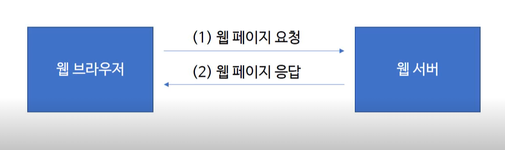
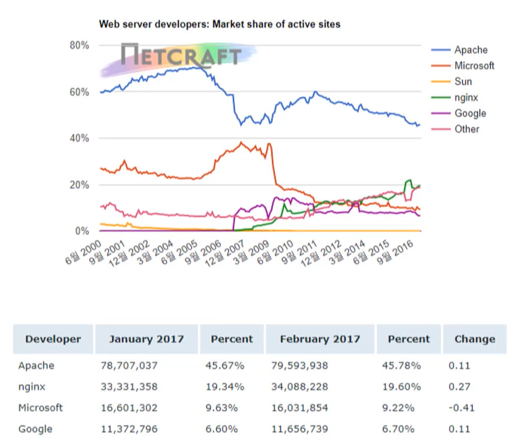

# 웹 서버란?
* 웹 서버는 소프트웨어(Software)를 보통 말하지만, 웹 서버 소프트웨어가 동작하는 컴퓨터를 말한다.
* 웹 서버의 가장 중요한 기능은 클라이언트(Client)가 요청하는 HTML 문서나 각종 리소스(Resource)를 전달하는 것이다.
* 웹 브라우저나 웹 크롤러가 요청하는 리소스는 컴퓨터에 저장된 정적(static)인 데이터이거나 동적인 결과가 될 수 있다.
    * 동적인 결과란 웹서버에 의해서 실행되는 프로그램을 통해 만들어진 결과들
    * 웹 크롤러란 네이버, 구글 같은 검색 사이트에서 다른 웹 사이트 정보를 읽어갈 때 사용하는 소프트웨어 

클라이언트와 웹 서버 간에는 보통 http(**H**yper**t**ext **T**ransfer **P**rotocol) 를 통해 통신하게 된다.
http란 인터넷 상의 데이터를 주고받기 위한 프로토콜(규약)
클라이언트와 서버도 미리 정해놓은 규칙을 가지고 통신을 해야만 한다. 이러한 규정들을 Protocol 이라 한다.

# 웹 서버 소프트웨어의 종류

* 가장 많이 사용하는 웹 서버는 Apache, Nginx, Microsoft IIS
* Apache웹 서버는 Apache Software Foundation에서 개발한 웹서버로 오픈소스 소프트웨어(Open-source Software)이며, 거의 대부분 운영체제에서 설치 및 사용을 할 수 있다.
* Nginx는 차세대 웹서버로 불리며 더 적은 자원으로 더 빠르게 데이터를 서비스하는 것을 목적으로 만들어진 서버이며 Apache웹 서버와 마찬가지로 오픈소스 소프트웨어이다.

  
[출처](http://news.netcraft.com/archives/2017/02/27/february-2017-web-server-survey.html)