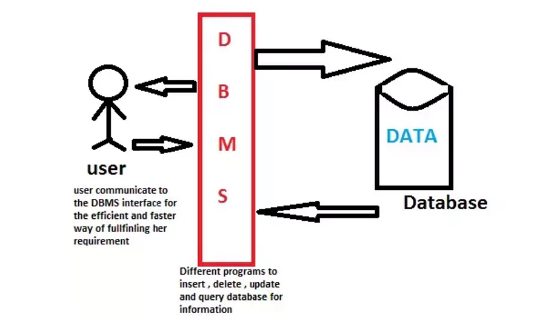
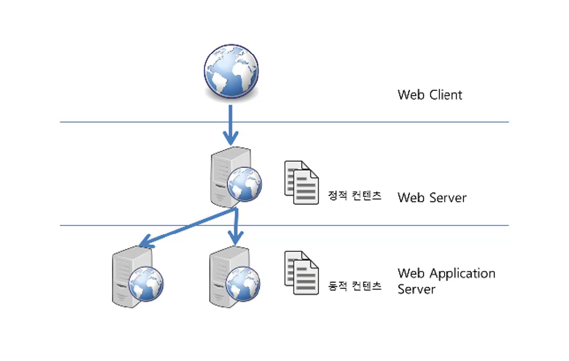

# 클라이언트/서버 구조

클라이언트(Client)는 서비스(Service)를 제공하는 서버(Server)에게 정보를 요청하여 응답 받은 결과를 사용한다.

  
클라이언트/서버 구조

# DBMS (DataBase Management System)

* 데이터베이스를 관리하는 시스템  
* 다수의 사용자가 데이터베이스 내의 데이터에 접근할 수 있도록 해주는 소프트웨어  
* 대표적으로 MySQL, MariaDB, Oracle, PostgreSQL 등이 있다.
* DBMS는 보통 서버 형태로 서비스를 제공 
    * 한때 DBMS에 접속해서 동작하는 클라이언트 프로그램이 많이 만들어졌다.
    * 이러한 방식의 문제점: 
        1. 클라이언트의 로직이 많아지고 클라이언트 프로그램의 크기가 커진다.
        2. 프로그램 로직이 변경되면 클라이언트가 매번 배포되어야 한다.
        3. 대부분의 로직이 클라이언트에 포함되어 배포가 되기 때문에 보안이 나쁘다.  
        **==>** 이러한 단점을 보완하기 위해 나온 것이 미들웨어(MiddleWare)

  
DBMS (DataBase Management System)

# 미들웨어 (MiddleWare)

* 클라이언트와 DBMS 사이에 아래 그림과 같이 또 다른 서버를 두는 방식
* 클라이언트는 단순히 요청만을 중앙 서버 (미들웨어)로 보냄
* 미들웨어는 대부분의 로직을 수행
    * 데이터를 조작할 일이 있으면 DBMS에게 요청
* 클라이언트는 그 결과를 화면에 전송
* 프로그램 로직이 변경 되어도 모든 클라이언트를 다시 배포할 필요 없이 미들웨어만 변경하면 되는 장점

* 클라이언트 쪽에 비즈니스 로직이 많을 경우, 클라이언트 관리(배포 등)로 인해 비용이 많이 발생하는 문제가 있다.

* 비즈니스 로직을 클라이언트와 DBMS사이의 미들웨어 서버에서 동작하도록 함으로써 클라이언트는 입력과 출력만 담당하도록 한다.

  
미들웨어(MiddleWare)

# WAS (Web Application Server)
1. 웹이 널리 사용됨에 따라 사용자의 요구 사항이 커지게 됨
2. 웹에서 데이터를 입력하고 조회하는 등의 동적인 기능을 요구 
3. 동적인 기능은 프로그래밍을 통해서 가능
    * CGI :     
        웹 서버에서 프로그래밍 기능이 들어가는 방식
        단순한 프로그래밍에서는 사용시 별 문제가 없음
4. 웹이 점점 복잡해짐에 따라 더욱 복잡한 프로그래밍적 기능을 요구하게 됨
    * 보통 이러한 기능들은 DBMS와 연관된 경우가 굉장히 많았다.
    * 브라우저를 클라이언트로 본다면 브라우저와 DBMS 사이에서 동작하는 미들웨어가 필요하게 된것

* 이러한 미들웨어를 WAS라고 말한다.
* WAS 또한 넓게 보면 미들웨어에 포함된다고 할 수 있다.

* WAS 가 가지는 중요한 기본 기능은 세가지가 있다.
    1. 프로그램 실행 환경과 데이터베이스 접속 기능을 제공
    2. 여러개의 트랜잭션을 관리
        * 트랜 잭션은 논리적인 작업 단위라고 할 수 있다.(이후 데이터베이스 프로그래밍을 설명할때 추가 설명)
    3. 업무를 처리하는 비지니스 로직을 수행
* 이외에도 웹서버의 기능 등 다양한 기능을 제공
    * 본 과정에서는 웹 서버 따로 WAS 따로 설치하지 않고 **톰캣** 이라는 WAS 하나만을 설치하여 진행
    * 보통의 경우 웹 서버는 정적인 콘텐츠를 웹 브라우저에 전송하는 역할, WAS는 프로그램의 동적인 결과를 웹 브라우저에 전송하는 역할을 담당한다.
    * WAS 초창기의 경우 WAS에 내장된 웹 서버 성능이 떨어졌으나 현재는 문제 없다.
    * 그럼에도 웹 서버가 있으면 좋은 점
        * 사람들이 많이 접속하는 대용량 웹 애플리케이션의 경우 서버의 수가 여러대일 수 있다.  
            ==> WAS를 통해 동작하는 프로그램의 오작동 되는 경우 WAS를 재시작 해야한다.  
            ==> 문제가 있는 WAS를 재시작할 때, 웹 서버에서 해당 WAS를 이용하지 못하도록 하는 경우 WAS의 문제가 발생한지 모르고 실행 가능  
            * 이러한 처리를 장애 극복 기능이라 한다.
            * 대용량 웹 애플리케이션에는 무중단으로 운영하기 위해서 상당히 중요한 기능!!!!
        * 웹서버는 상대적으로 WAS보다 간단한 구조

* WAS는 일종의 미들웨어로 웹 클라이언트(보통 웹 브라우저)의 요청 중 웹 애플리케이션이 동작하도록 지원하는 목적을 가진다.

웹 서버 vs WAS  
WAS도 보통 자체적으로 웹 서버 기능을 내장하고 있다.  
현재는 WAS가 가지고 있는 웹 서버도 정적인 콘텐츠를 처리하는 데 있어서 성능상 큰 차이가 없다.  
규모가 커질수록 웹 서버와 WAS를 분리한다.  
자원 이용의 효율성 및 장애 극복, 배포 및 유지보수의 편의성을 위해 웹서버와 WAS를 대체로 분리한다.  

{: width="70%" height="70%"}

WAS (Web Application Server)