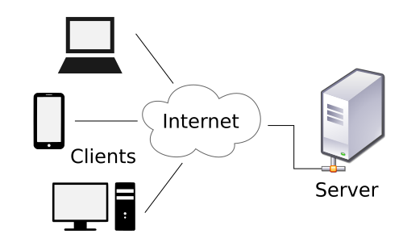

# 클라이언트/서버 구조

클라이언트(Client)는 서비스(Service)를 제공하는 서버(Server)에게 정보를 요청하여 응답 받은 결과를 사용한다.

  
클라이언트/서버 구조

# DBMS (DataBase Management System)

* 데이터베이스를 관리하는 시스템  
* 다수의 사용자가 데이터베이스 내의 데이터에 접근할 수 있도록 해주는 소프트웨어  
* 대표적으로 MySQL, MariaDB, Oracle, PostgreSQL 등이 있다.
* DBMS는 보통 서버 형태로 서비스를 제공 
    * 한때 DBMS에 접속해서 동작하는 클라이언트 프로그램이 많이 만들어졌다.
    * 이러한 방식의 문제점: 
        1. 클라이언트의 로직이 많아지고 클라이언트 프로그램의 크기가 커진다.
        2. 프로그램 로직이 변경되면 클라이언트가 매번 배포되어야 한다.
        3. 대부분의 로직이 클라이언트에 포함되어 배포가 되기 때문에 보안이 나쁘다.  
        **==>** 이러한 단점을 보완하기 위해 나온 것이 미들웨어(MiddleWare)

  
DBMS (DataBase Management System)

# 미들웨어 (MiddleWare)

* 클라이언트와 DBMS 사이에 아래 그림과 같이 또 다른 서버를 두는 방식
* 클라이언트는 단순히 요청만을 중앙 서버 (미들웨어)로 보냄
* 미들웨어는 대부분의 로직을 수행
    * 데이터를 조작할 일이 있으면 DBMS에게 요청
* 클라이언트는 그 결과를 화면에 전송
* 프로그램 로직이 변경 되어도 모든 클라이언트를 다시 배포할 필요 없이 미들웨어만 변경하면 되는 장점

* 클라이언트 쪽에 비즈니스 로직이 많을 경우, 클라이언트 관리(배포 등)로 인해 비용이 많이 발생하는 문제가 있다.

* 비즈니스 로직을 클라이언트와 DBMS사이의 미들웨어 서버에서 동작하도록 함으로써 클라이언트는 입력과 출력만 담당하도록 한다.

  
미들웨어(MiddleWare)

# WAS (Web Application Server)
WAS는 일종의 미들웨어로 웹 클라이언트(보통 웹 브라우저)의 요청 중 웹 애플리케이션이 동작하도록 지원하는 목적을 가집니다.

WAS (Web Application Server)
웹 서버 vs WAS
WAS도 보통 자체적으로 웹 서버 기능을 내장하고 있습니다.
현재는 WAS가 가지고 있는 웹 서버도 정적인 콘텐츠를 처리하는 데 있어서 성능상 큰 차이가 없습니다.
규모가 커질수록 웹 서버와 WAS를 분리합니다.
자원 이용의 효율성 및 장애 극복, 배포 및 유지보수의 편의성을 위해 웹서버와 WAS를 대체로 분리합니다.