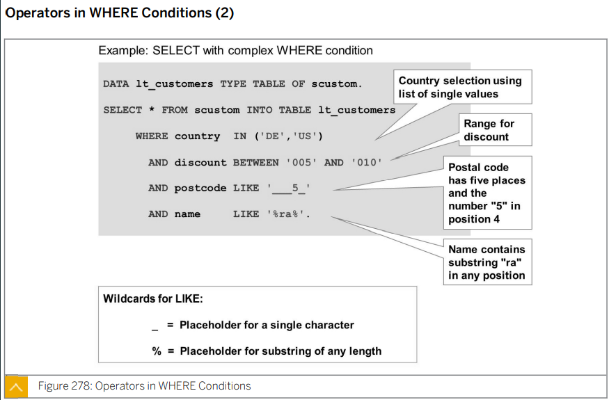
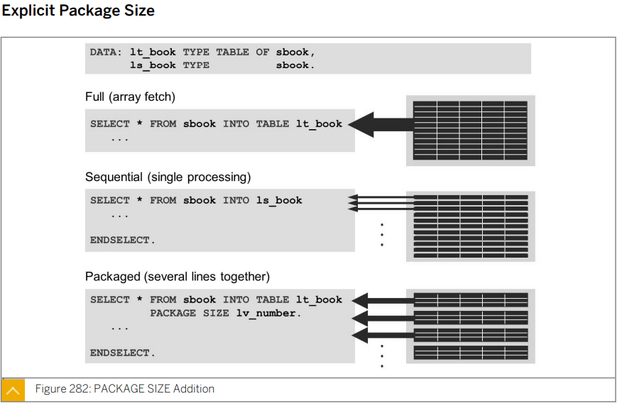

# Unit 16. ABAP Open SQL


# Lesson 1. Processing and Aggregating Datasets on the Database


* ## Ordered Datasets

  ```ABAP
  SELECT * 
  	FROM ___ INTO ___ WHERE ___
      ORDER BY PRIMARY KEY.
      
  SELECT * 
  	FROM ___ INTO ___ WHERE ___
      ORDER BY <COLUMN> <COLUMN>.
      
  SELECT * 
  	FROM ___ INTO ___ WHERE ___
      ORDER BY <COLUMN> DESCENDING <COLUMN> ASCENDING.
  ```


* ## Condensed Datasets

  ```ABAP
  SELECT DISTINCT carrid connid
  	FROM ___ INTO ___ WHERE ___
      ORDER BY <COLUMN> DESCENDING <COLUMN> ASCENDING.
  ```

  #### DISTINCT 뒤에 있는 것들이 모두 중복인 데이터들을 삭제하고 SELECT

  ```ABAP
  *&---------------------------------------------------------------------*
  *& Report ZB23_00022
  *&---------------------------------------------------------------------*
  *&
  *&---------------------------------------------------------------------*
  REPORT zb23_00022.
  
  
  DATA gt_itab TYPE TABLE OF spfli.
  
  SELECT DISTINCT carrid
         INTO CORRESPONDING FIELDS OF TABLE gt_itab
         FROM spfli.
  
  cl_demo_output=>display_data( gt_itab ).
  ```

  

  

* ## Aggregate Expressions

  | Function | Meaning of Result and Conditions | Data Type of Result |
  | -------- | -------------------------------- | ------------------- |
  | MIN(col) |                                  |                     |
  | MAX      |                                  |                     |
  | SUM      |                                  |                     |
  | AVG      |                                  |                     |
  | COUNT    |                                  |                     |

  

* ## Field Lists with Aggregate Expressions and Field Names

  group by

  

  

* ## Having addition

  Aggregation 한 결과의 제약


select

into

from

where

group by

having 

order by


# Lesson 2. Implementing Complex WHERE Conditions and Special INTO Clauses


* ## Operators in WHERE Conditions

  

  ```ABAP
  *&---------------------------------------------------------------------*
  *& Report ZB23_00023
  *&---------------------------------------------------------------------*
  *&
  *&---------------------------------------------------------------------*
  REPORT zb23_00023.
  
  DATA it TYPE TABLE OF scarr.
  DATA lv_where TYPE string.
  
  PARAMETERS p_name TYPE c LENGTH 20 LOWER CASE.			"*****소문자 허용
  
  * 검색조건에서 입력한 단어가 들어간 모든 항공사 취득 하기.
  CONCATENATE '%' p_name '%' INTO lv_where.				"*****중요!!!!
  
  SELECT *
    INTO TABLE it
    FROM scarr
    WHERE carrname LIKE lv_where.
  
  
  cl_demo_output=>display_data(  it ).
  ```

  

  


* ## Target Areas for INTO Clause

  

  

  

  거의 쓸일 없다.

  INTO 를 사용할 경우 기존에 INTERNAL TABLE에 있던 데이터를 모두 삭제하고 다시 넣는 것

  APPENDING은 기존에 있던 데이터 뒤에 새로운 데이터를 넣어 준다.
  
  
  
  거의 쓸일 없다.


# Lesson 3. Selecting Data from Multiple Database Tables


사용하지 않는 방법


* ## New Open SQL

  * ### New Open SQL (가급적 사용 X) 

    * 모든 변수 앞에 @를 붙여야 함

    * 컬럼과 컬럼 사이는 ','로 구분

  ```ABAP
  *&---------------------------------------------------------------------*
  *& Report ZB23_00024
  *&---------------------------------------------------------------------*
  *&
  *&---------------------------------------------------------------------*
  REPORT zb23_00024.
  
  DATA it TYPE TABLE OF scarr.
  
  PARAMETERS: p_cur TYPE scarr-currcode.
  
  SELECT carrid carrname
    INTO CORRESPONDING FIELDS OF TABLE it
    FROM scarr
    WHERE currcode = p_cur.
  
  
  * New Open SQL (가급적 사용 X)
  
  * 모든 변수 앞에 @를 붙여야 함
  * 컬럼과 컬럼 사이는 ','로 구분.
  
  SELECT carrid, carrname
    INTO CORRESPONDING FIELDS OF TABLE @it
    FROM scarr
    WHERE currcode = @p_cur.
  ```

  


# 부록

* ## LOWER CASE

  PARAMETERS 문 뒤에 LOWER CASE 입력시 입력 값에 소문자를 허용해 준다.

  ```ABAP
  PARAMETERS p_name TYPE c LENGTH 20 LOWER CASE.		
  ```


* ## Control Level Processing

  ```ABAP
  *&---------------------------------------------------------------------*
  *& Report ZB23_CUST_LIST
  *&---------------------------------------------------------------------*
  *&
  *&---------------------------------------------------------------------*
  REPORT zb23_cust_list.
  
  TYPE-POOLS: icon, col.
  
  TYPES: BEGIN OF ts_rslt,
           cancelled  TYPE sbook-cancelled,
           customid   TYPE sbook-customid,
           name       TYPE scustom-name,
           carrid     TYPE sbook-carrid,
           carrname   TYPE scarr-carrname,
           connid     TYPE sbook-connid,
           fldate     TYPE sbook-fldate,
           custtype   TYPE sbook-custtype,
           order_date TYPE sbook-order_date,
           loccuram   TYPE sbook-loccuram,
           loccurkey  TYPE sbook-loccurkey,
         END OF ts_rslt.
  
  TYPES: tt_rslt TYPE TABLE OF ts_rslt,
         tr_fld  TYPE RANGE OF sbook-fldate,
         tr_cid  TYPE RANGE OF scustom-id.
  
  DATA: gt_rslt TYPE tt_rslt,
        gs_rslt TYPE ts_rslt.
  
  SELECT-OPTIONS: s_cid FOR gs_rslt-customid OBLIGATORY.
  
  PARAMETERS: p_name  TYPE scustom-name LOWER CASE,
              p_class TYPE sbook-custtype.
  
  SELECT-OPTIONS: s_fld FOR gs_rslt-fldate.
  
  
  
  
  INITIALIZATION.
    PERFORM init_1000 USING p_name p_class s_fld[] s_cid[].
  
  
  AT SELECTION-SCREEN.
  
  
  START-OF-SELECTION.
    PERFORM get_data USING p_name p_class s_fld[] s_cid[]
                     CHANGING gt_rslt.
  
  
  
  
  
  
  
  
  *&---------------------------------------------------------------------*
  *& Form init_1000
  *&---------------------------------------------------------------------*
  *& text
  *&---------------------------------------------------------------------*
  *&      --> P_NAME
  *&      --> P_CLASS
  *&      --> S_FLD[]
  *&      --> S_CID[]
  *&---------------------------------------------------------------------*
  FORM init_1000  USING    p_name   TYPE scustom-name
                           p_class  TYPE sbook-custtype
                           p_fld    TYPE tr_fld
                           p_cid    TYPE tr_cid.
  
    DATA: ls_temp LIKE LINE OF p_fld,
          lv_mnth TYPE i.
  
  
    ls_temp-sign = 'I'.
    ls_temp-option = 'BT'.
    CONCATENATE sy-datum+0(6) '01' INTO ls_temp-low.
    CONCATENATE sy-datum+0(4) '1231' INTO ls_temp-high.
    APPEND ls_temp TO p_fld.
  
  ENDFORM.
  
  
  *&---------------------------------------------------------------------*
  *& Form get_data
  *&---------------------------------------------------------------------*
  *& text
  *&---------------------------------------------------------------------*
  *&      --> P_NAME
  *&      --> P_CLASS
  *&      --> S_FLD[]
  *&      --> S_CID[]
  *&      <-- GT_RSLT
  *&---------------------------------------------------------------------*
  FORM get_data  USING    p_name   TYPE scustom-name
                          p_class  TYPE sbook-custtype
                          p_fld    TYPE tr_fld
                          p_cid    TYPE tr_cid
                 CHANGING p_rslt   TYPE tt_rslt.
  
    DATA: lw_rslt  LIKE LINE OF p_rslt,
          lv_name  TYPE string,
          lv_type  TYPE dd07v-domvalue_l,
          lv_class TYPE dd07v-ddtext,
          lv_cnt   TYPE i VALUE 1,
          lv_last  TYPE sbook-customid,
          lv_now   TYPE sbook-customid,
          lv_chnge TYPE i,
          lv_total TYPE c LENGTH 179.
  
    CONCATENATE '%' p_name '%' INTO lv_name.
  
    "데이터 취득부
    IF p_name IS NOT INITIAL.
      SELECT *
            INTO CORRESPONDING FIELDS OF TABLE p_rslt
            FROM sbook AS sbk
            INNER JOIN scarr AS scr
                  ON sbk~carrid = scr~carrid
            INNER JOIN scustom AS sct
                  ON sbk~customid = sct~id
            WHERE sbk~custtype = p_class
            AND sbk~fldate IN p_fld
            AND sbk~customid IN p_cid
            AND sct~name LIKE lv_name
            ORDER BY customid ASCENDING fldate DESCENDING.
    ELSE.
      SELECT *
            INTO CORRESPONDING FIELDS OF TABLE p_rslt
            FROM sbook AS sbk
            INNER JOIN scarr AS scr
              ON sbk~carrid = scr~carrid
            INNER JOIN scustom AS sct
                  ON sbk~customid = sct~id
           WHERE sbk~custtype = p_class
             AND sbk~fldate IN p_fld
             AND sbk~customid IN p_cid
        ORDER BY customid ASCENDING fldate DESCENDING.
    ENDIF.
  
  
    "데이터 가공부
    lv_type = p_class.
    CALL FUNCTION 'DOMAIN_VALUE_GET'
      EXPORTING
        i_domname  = 'S_CUSTTYPE'
        i_domvalue = lv_type
      IMPORTING
        e_ddtext   = lv_class
      EXCEPTIONS
        not_exist  = 1
        OTHERS     = 2.
  
    " lv_now : 지금 work area에 담겨 있는 customid  lv_check : 이전 워크 에어리어에 담겨있던 customid.
    "데이터 출력부
    LOOP AT p_rslt INTO lw_rslt.
  
      lv_now = lw_rslt-customid.
      IF lv_last IS INITIAL.
        lv_last = lv_now.
      ELSEIF lv_last = lv_now.
        lv_cnt = lv_cnt + 1.
      ELSE.
        lv_last = lv_now.
        WRITE:/ 'total : ' && lv_cnt COLOR COL_TOTAL.
        lv_cnt = 1.
        lv_chnge = 1.
      ENDIF.
  
  
      ULINE.
      IF lw_rslt-cancelled = 'X'.
        WRITE:/ ' ',icon_incomplete AS ICON, ' '.
      ELSE.
        WRITE:/ '      '.
      ENDIF.
      WRITE: lw_rslt-customid COLOR COL_KEY,
             lw_rslt-name COLOR COL_KEY,
             lw_rslt-carrid,
             lw_rslt-carrname,
             lw_rslt-connid,
             lw_rslt-fldate,
             lv_class,
             lw_rslt-order_date,
             lw_rslt-loccuram,
             lw_rslt-loccurkey.
  
  
  
    ENDLOOP.
  
    lv_total = 'total : ' && lv_cnt.
    WRITE:/ lv_total COLOR COL_TOTAL RIGHT-JUSTIFIED.
  
  
  ENDFORM.
  ```

  ```ABAP
  *&---------------------------------------------------------------------*
  *& Report ZB23_00025
  *&---------------------------------------------------------------------*
  *&
  *&---------------------------------------------------------------------*
  REPORT zb23_00025.
  
  TYPES: BEGIN OF ts_rslt,
           id     TYPE c LENGTH 3,
           name   TYPE c LENGTH 12,
           bookid TYPE i,
         END OF ts_rslt.
  
  
  DATA: gt_rslt TYPE TABLE OF ts_rslt,
        gw_rslt LIKE LINE OF gt_rslt.
  
  
  CLEAR: gw_rslt.
  gw_rslt-id = 'A'.
  gw_rslt-name = '홍길동'.
  gw_rslt-bookid = 123.
  APPEND gw_rslt TO gt_rslt.
  
  CLEAR: gw_rslt.
  gw_rslt-id = 'B'.
  gw_rslt-name = '김기수'.
  gw_rslt-bookid = 291.
  APPEND gw_rslt TO gt_rslt.
  
  CLEAR: gw_rslt.
  gw_rslt-id = 'C'.
  gw_rslt-name = '나영희'.
  gw_rslt-bookid = 832.
  APPEND gw_rslt TO gt_rslt.
  
  CLEAR: gw_rslt.
  gw_rslt-id = 'A'.
  gw_rslt-name = '홍길동'.
  gw_rslt-bookid = 122.
  APPEND gw_rslt TO gt_rslt.
  
  CLEAR: gw_rslt.
  gw_rslt-id = 'C'.
  gw_rslt-name = '나영희'.
  gw_rslt-bookid = 938.
  APPEND gw_rslt TO gt_rslt.
  
  SORT gt_rslt BY id bookid ASCENDING.
  
  ```

  

  * ### Unique 한 ID로 구성된 Internal 설계.

    #### 조금더 Flexible 함.

    ```ABAP
    
    DATA: gt_header LIKE gt_rslt. "헤더 인터널 테이블.
    DATA: gw_header LIKE LINE OF gt_header. " Work Area for Header.
    
    gt_header[] = gt_rslt[]..
    DELETE ADJACENT DUPLICATES
      FROM gt_header COMPARING id. " 중복된 ID 삭제.
    
    DATA: gv_cnt TYPE id.
    
    LOOP AT gt_header INTO gw_header.
      CLEAR: gv_cnt.
      LOOP AT gt_rslt INTO gw_rslt WHERE id = gw_header-id.
        WRITE: / gw_rslt-id, gw_rslt-name, gw_rslt-bookid.
        gv_cnt = gv_cnt + 1.
      ENDLOOP.
      ULINE.
      WRITE:/ 'count : ', gv_cnt.
      ULINE.
    ENDLOOP.
    ```

  * ### ABAP 지원 syntax 구현.

    ```ABAP
    DATA: gv_cnt TYPE i.
    
    LOOP AT gt_rslt INTO gw_rslt.
      WRITE:/ gw_rslt-id, gw_rslt-name, gw_rslt-bookid.
      gv_cnt = gv_cnt + 1.
      "고객 ID가 마지막이면 선 긋고 카운트 출력.
      AT END OF id.
        ULINE.
        WRITE:/ 'Count : ', gv_cnt.
        CLEAR: gv_cnt.
      ENDAT.
    ENDLOOP.
    ```

    
