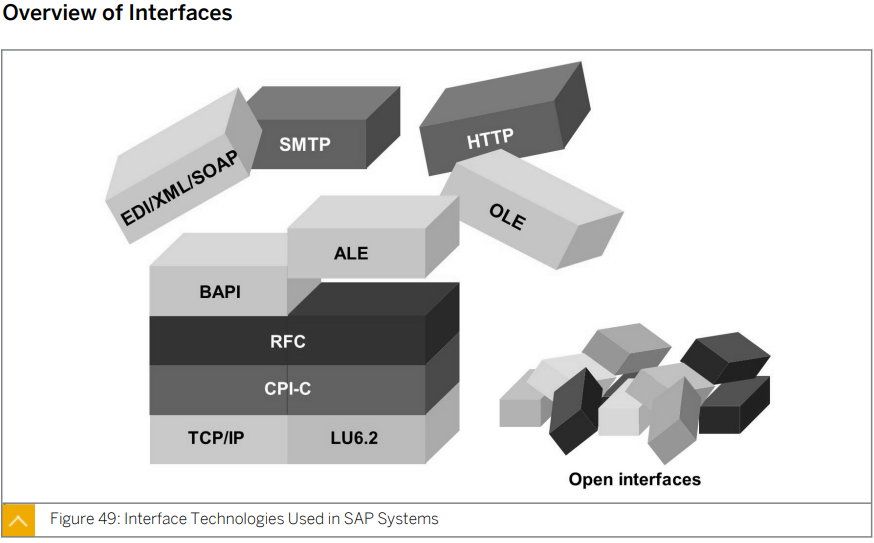
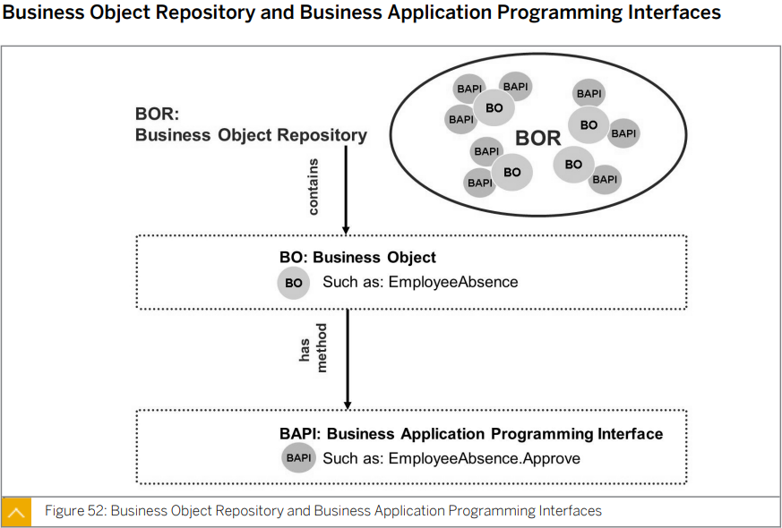
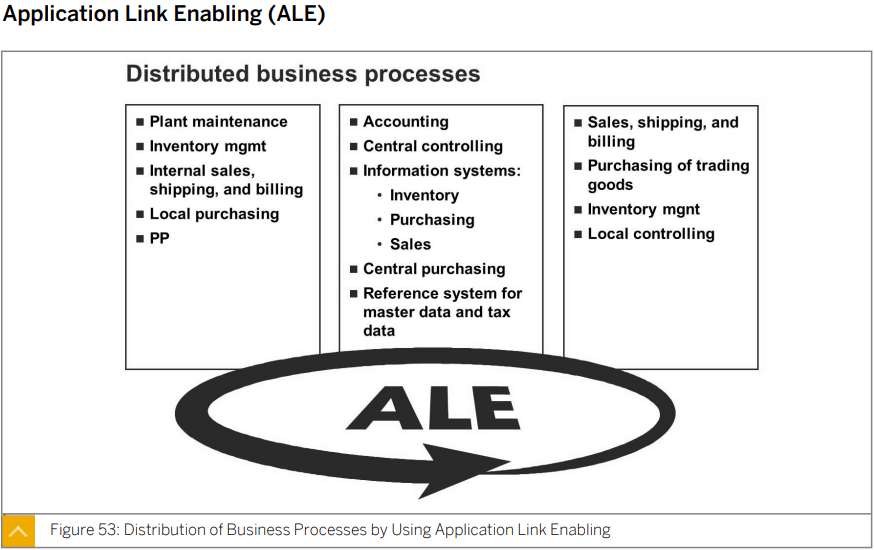
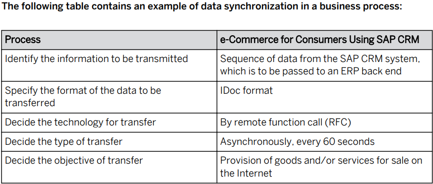
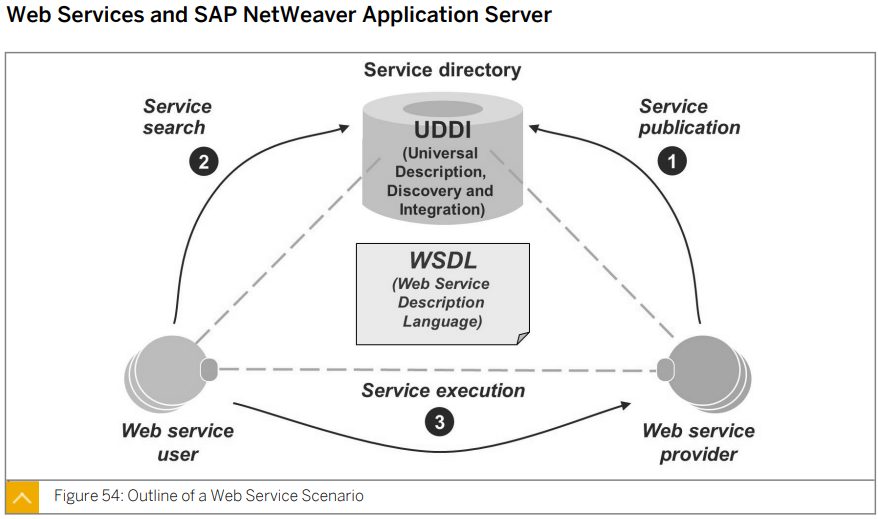

# Unit6 Communication and Integration Technologies

## Lesson1 Describing Communication with *Remote Function Call-Based(RFC)* Technology

****

## 개요

이 소단원에서는 SAP에서 사용할 수 있는 다양한 인터페이스 기술을, 원격 함수 호출 (RFC)과 BAPI(Business Application Programming Interface) 위주로 살펴본다.


## 목표

* 원격 함수 호출 (RFC) 기술을 사용한 통신 이해
* ALE (Application Link Enabling) 이해

****


* ## 인터페이스의 개요

  

  * ### SAP 시스템에서 사용되는 인터페이스 기술:

    SAP 시스템에는 다양한 수준의 통신을 처리하는 인터페이스가 있다.

    그 범위는 TCP/IP 프로토콜이나 CPI-C를 사용하는 고도의 기술적인 연결 방식에서부터 비지니스 오브젝트르르 위해 특별히 개발된 인터페이스 (BAPI), 그리고 믿(Application Link Enableing) 환경에서 사용되는 IDoc 인터페이스에 이르기까지 폭이 넓다.

    대부분의 상위 인터페이스 (즉, 비지니스 오브젝트 또는 프로세스에 액세스하는 인터페이스)는 동일 기술인 원격 함수 호출 (RFC)을 사용한다.

    * ALE : Application Link Enabling
    * BAPI : Business Application Programming Interface
    * CPI-C : Common Program Interface Communication
    * EDI : Electronic Data Interchange
    * HTTP(S) : HyperText Transfer Protocol
    * LU 6.2 : Logical Unit Type 6.2
    * RFC : Remote Function Call
    * OLE : Object Linking and Enbedding
    * SMTP : Simple Mail Transfer Protocol
    * SOAP : Simple Object Access Protocol
    * TCP/IP : Transmission Control Protocol/Internet Protocol
    * XML : Extensible Markup Language


* ## RFC (원격 함수 호출)

  

  RFC 인터페이스는 CPI-C 와 TCP/IP 를 기반으로 하는 SAP 의 인터페이스 프로토콜이다.

  여러종류의 시스템 간에 이루어지는 통신 프로세스를 간단하게 프로그래밍할 수 있도록 해준다.

  RFC 를 통해 원격 시스템에 있는 함수를 호출하여 실행할 수 있을 뿐 아니라 동일 시스템 내의 함수도 호출할 수 있다.

  RFC 는 **통신 프로세스, 시스템 내부 또는 외부에서 이루어지는 매개변수 전송 및 오류 처리**를 관리한다.

  RFC 는 함수가 실행되는 프로그래밍 언어가 아니라 하나의 인터페이스이다. 

  두개의 SAP 시스템 사이에서 RFC 통신을 사용할 때는 호출 측 시스템이 상대 시스템에 있는 RFC 정의를 사용하여 특정 함수에 액세스 한다.

  SAP 이외의 시스템에서 함수를 호출 할 때도 RFC를 사용할 수 있다.

  외부에 있는 프로그램을 원격으로 실행하려면 SAP 시스템 밖에 RFC 인터페이스가 있어야 한다.

  RFC 인터페이스는 양방향이므로, 외부에 있는 프로그램에서 RFC를 통해 SAP 시스템 내부의 함수에 접근할 수 있다.

  SAP 시스템에 있는 RFC 모듈을 호출하려면 임포트 및 엑스포트 매개변수 (함수 빌더에서 지정됨)를 알아야한다.

  또한 두 시스템 사이에 기술적 연겨도 존재해야 하는데 이 연결을 RFC연결 또는 RFC 연결 대상이라고 한다.

  RFC 연결을 관리하려면 SM59 트랜잭션을 이용한다.

****

* ## RFC 상세 설명

  

  트랜잭션 SM59에 표시되는 RFC 연결 대상을 SAP 시스ㅔㅁ이라고 생각해서는 안된다. RFC 연결은 시스템 안에 있는 하나의 클라이언트를 가리킬 뿐이다.

  따라서 이러한 연결을 논리적 시스템간의 연결 이라고도 한다.

  두 시스템 사이의 RFC 연결은 대상 시스템 내의 클라이언트 수만큼 만들 수 있다.

  각 RFC 연결에서 대상에 대해 로그온 사용자르르 지정할 수 있으므로 각기 다른 로그온 사용자르르 사용하여 대상 시스템의 클라이언트에 여러번 액세스하는 것이 가능하다.

  두 시스템 간에 양방향 RFC 연결이 필요한 경우 호출 대상 시스템에서도 호출 측 시스템의 RFC 모듈을 실행해야 하므로 두 시스템 모두에서 비슷한 RFC 연결을 설정해야한다.

  

  AS ABAP 기반의 SAP 시스템의 경우  RFC 연결은 항상 SAP 시스템 내의 한 클라이언트 만을 대상으로 한다.

  

  ABAP 에서는 다른 시스템에 있는 함수 모듈을 호출하기 위해 RFC를 사용한다.

  ABAP 구문을 다음과 같이 사용하여 함수 모듈을 호출한다.

  ```ABAP
  CALL FUNCTION <Function Name>.
  DESTINATION <Target>.
  EXPORTING ...
  IMPORTING ...
  ```

  CALL FUNCTION 을 통해 대상 시스템에서 실행할 함수의 이름을 지정한다.

  DESTINATION 을 통해 RFC 연결 대상을 지정한다.

  EXPORTING 과 IMPORTING 은 대상 함수와 매개변수를 주고 받기 위해 사용된다.

  

  다른 시스템에서 데이터를 주고 받을때에는 해당 시스템의 RFC가 있어야 한다. 호출하는 시스템에는 DESTINATION이 있어야 한다.

  

  Import에는 여러 param 들이 있을 수 있으며  Export 또한 여러 return 값들이 있을 수 있다.

  Exporting 구문 다음에는 호출되어지는 RFC의 Import 파라미터가 오며

  Importing 구문 다음에는 호출되어지는 RFC의 export 파라미터가 온다.

  

  RFC 는 SAP 환경에서 가장 중요한 인터페이스로 자리잡았다.

  주로 비지니스 어플리케이션과 관련이 있는 BAPI 라는 특수 RFC 모듈을 일반적으로 ABAP에서 사용된다.

****

* ## BOR (비지니스 오브젝트 저장소) 및 BAPI (Business Application Programming Interface)

  

  

  BAPI 는 SAP 시스템의 비지니스 프로세스와 데이터에 대한 내부 및 외부 접근을 가능하게 하는 표준화된 프로그래밍 인터페이스이다.

  BAPI는 BOR에서 SAP 비지니스 오브젝트의 메소드로서 정의되며 SAP 시스템에서 비지니스 데이터를 **객체 지향적**으로 다룰 수 있게 해준다.

  BAPI를 사용하여 호출 할 수 있는 함수는 ABAP 워크벤치의 함수 빌더에서 RFC 지원 함수 모듈로서 구현, 저장된다.

  SM01 트랜잭션인 비지니스 오브젝터 빌더 에서 비지니스 오브젝트 저장소 버튼을 통해 BOR 내의 사용가능한 BAPI를 볼 수 있다.

  BAPI 트랜잭션을 통해 BOR에 바로 액세스 가능하다.

  * ### BAPI 의 용도

    * (ALE 등을 사용하여) 서로 다른 시스템 간에 비지니스 프로세스를 연결할때

    * SAP Business Suite 프레임워크에 다양한 솔루션을 통합할 때

    * SAP 시스템을 인터넷에 연결할 때

    * 외부 프로그램에 연결할 때

    * SAP Business Workflow 와 연계하여 사용할 때

      

  여러 **Business Object Repository(BOR)** 들은 여러 **Business Object(BO)**들이 존재하며 method 들을 가지고 있는 여러 **Business Application Programming Interface(BAPI)**들을 제공한다.


* ## ALE (Application Link Enabling)

  

  분산된 어플리케이션을 만들어 운용하기 위한 수단

  외적으로는 분산되었지만 내적으로는 통합된 시스템 랜드스케이프를 운영하도록 하는 것이 ALE의 기본 개념

  이를 위해 느슨하게 연결된 어플리케이션 시스템 간에 일관성 있는 데이터 사용을 바탕으로 하는 작업 중심의 메시지 교환이 필요하다.

  어플리케이션은 중앙 데이터베이스를 통해서가 아니라 동기 및 비동기 통신을 통해 통합된다.

  

  ALE 를 통해 데이터를 교환하는 시스템들은 동일한 회사안에 있을 수도 있으며 서로 다른 회사에 흩어져 있을 수도 있다.

  ALE 특징중 하나는 각기 다른 시스템이 안전하고 일관성 있는 데이터 저농을 통해 비지니스 관점에서 연결된다는 것이다.

  

  ALE는 누가 데이터를 교환하는지, 어떤 데이터가 언제 교환되는지, 누구와 데이터를 교환하는지, 어떻게 교환되는지로 기술 할 수 있다.

  

  * ### ALE 를 구현하기 위해 명확히 해야하는 것

    * 관련된 비지니스 프로세스 및 오브젝트
    * 전송할 정보
    * 전송할 데이터의 포맷
    * 전송에 사용할 기술
    * 전송 유형
    * 데이터 전송의 대산

  

  SAP 시스템 안의 데이터는 비지니스 오브젝트와 그에 딸린 BAPI 로 인식할 수 있다. 

  BAPI 는 비지니스 오브젝트 의 메소드이다.

  자재 마스터 데이터 생송 또는 변경이 메소드가 될 수 있다.

  BAPI 를 통해 오브젝트에 속한 모든 데이터를 편집할 수 있다.

  

  iDoc 포맷은 IDoc(Intermediate Document)의 구조를 설명한다.

  다양한 유형의 교환 데이터를 위한 다양한 종류의 IDoc 포맷이 존재한다. 

  합의된 XML 포맷으로 데이터를 전송할 때도 ALE를 사용할 수 있다.

  

  시스템상의 제약 범위 내에서 선호나는 데이터 전송 기술을 선택할 수 있다.

  예로 RFC 또는 HTTP나 HTTPS 를 사용하여 데이터를 전송할 수 있다.

  

  ### 전송 유형

  * 동기
    * 데이터의 생성 또는 변경이 발생하면 데이터가 전송된다.
  * 비동기
    * 임의로 지정한 간격마다 전송을 수행한다.

  시스템을 연결하는 데는 제약이 거의 없다. 

  연결 대상이 되는 시스템에는 통신을 받아들이고 (RFC 및 HTTP 지원) 전송포맷 (IDoc 또는 XML) 을 해석 할 수 있는 기능이 준비되어야 한다. 

  각기 다른 릴리스의 SAP 시스템도 ALE 를 통해 연결될 수 있다.

  

  

  데이터를 통합 할때 사용





****

****


## Lesson2 Describing the Basics of Web Services

****

## 개요 

웹 서비스에 대해 소개하고 SAP NetWeaver AS 에서 웹 서비스를 어떻게 사용하는지 살펴본다.

## 목표

* SAP NetWeaver AS 에서의 웹 서비스 이해

****


* ## 웹서비스 기본 정보 

  SAP NetWeaver AS 는 웹 서비스 개발 플랫폼이다. 

  웹서비스란 개방형 표준을 기반으로 비지니스 시나리오에 통합할 수 있는 웹기반 인터페이스이다.

  실제로 웹서비스는 인터넷 프로토콜을 통해 접근 가능하며 웹서비스를 사용하는 어플리케이션은 웹 브라우저를 통해 실행된다.

  

  웹서비스는 특정 어플리케이션의 기능을 외부에서도 곧바로 사용할 수 있도록 만들어주는 기술적 토대가 된다.

  표준화된 접근 프로토콜을 통해 어플리케이션 내의 기능을 사용하고 체계화된 형태로 컨텐트를 교환한다.

  어플리케이션 간 연계 기능도 자유롭게 개발 할 수 있게 도니다.

  작은 서비스들이 모여 완전한 기능을 수행하는 경우 이를 엔터프라이즈 서비스라고 한다.

  



UDDI에서 웹서비스를 찾는다. 이후 WSDL을 통해 웹서비스를 구현한다. 이후 Web service provider가 제공하는 웹서비스를 사용한다.????


****

****


## Lesson3 Describing OData in SAP Gateway


나중에 보기로


## 학습평가

* ### 다음 중 SAP 시스템에서 지원되는 인터페이스와 통신 방식은 어느것인가?

  * #### <u>**HTTP (HyperText Transfer Protocol)**</u>

  * #### <u>**SMTP (Simple Mail Transfer Protocol)**</u>

  * #### <u>**RFC (Remote Function Call)**</u>

  * #### <u>**BAPI(Business Application Programming Interface)**</u>

  * **확장 데이터 전송 프로토콜 (Extended Data Transfer Protocol)**

  * **SAP Transfer Protocol**

  SAP 는 다음과 같은 인터페이스 기술을 사용한다.

  * ALE : Application Link Enabling
  * BAPI : Business Application Programming Interface
  * CPI-C : Common Program Interface Communication
  * EDI : Electronic Data Interchange
  * HTTP(S) : HyperText Transfer Protocol
  * LU 6.2 : Logical Unit Type 6.2
  * RFC : Remote Function Call
  * OLE : Object Linking and Enbedding
  * SMTP : Simple Mail Transfer Protocol
  * SOAP : Simple Object Access Protocol
  * TCP/IP : Transmission Control Protocol/Internet Protocol
  * XML : Extensible Markup Language

  


* ### 다음중 BAPI 를 사용할 수 있는 경우는 언제인가?

  * #### <u>SAP 시스템의 데이터를 요청할 때</u>

  * #### <u>SAP 시스템에 데이터를 전달할 때</u>

  * **SAP 화면 이미지를 서드 파티 어플리케이션 (EX. Microsoft interface) 에 전송할 때**

  * #### <u>SAP 시스템의 비지니스 프로세스에 액세스 할 때</u>

  BAPI 용도:

  서로 다른 시스템 간에 비즈니스 프로세스를 연결

  SAP Business Suite 플레임워크에 다양한 솔루션을 통합

  SAP 시스템을 인터넷에 연결

  외부 프로그램에 연결

  SAP Business  Workflow 와 연계하여 사용된다.

  

* ### 다음 중 웹 서비스를 지원하기 위해 SAP NetWeaver AS 에 구현된 표준은 무엇인가

  * #### <u>XML</u>

  * #### <u>SOAP</u>

  * #### <u>WDSL</u>

  * #### <u>UDDI</u>

  * **웹서버**

  다음과 같은 웹 서비스 기본 표준이 SAP NetWeaver AS 에서 지원된다.

  * xml

  * soap

  * wsdl

  * uddi

    

* ### 다음중 BAPI를 구현 및 저장하기 위한 툴은?

  * #### <u>함수 빌더</u>

  * **ABAP 편집기**

  * **클래스 빌더**

  * **ABAP 딕셔너리**

  BAPI 를 사용하여 호출할 수 있는 함수는 ABAP 워크벤치의 함수 빌더에서 RFC 지원 함수 모듈로서 구현 및 저장된다. 

  


* ### 다음 중 ALE 에 대한 정확한 설명은?

  * **릴리스가 동일한 SAP 시스템 사이의 데이터 교환에 사용**

  * **웹 서비스를 통한 데이터 교환에 사용**

  * #### <u>상호 협력 시스템들의 BAPI를 통한 데이터 교환에 사용</u>

  * #### <u>랜드스케이프 내 시스템들의 RFC 통신에 사용</u>

  * **AS ABAP 시스템과 AS Java 시스템 사이의 데이터 교환에 사용**

  ALE를 통해 데이터를 교환하는 시스템들은 동일한 회사 안에 있을 수 도 있고 서로 다른 회사에 흩어져 있을 수도 있다.

  ALE의 특징 중 하나는 각기 다른 시스템이 안전하고 일관성 있는 데이터 전송을 통해 비지니스 관점에서 연결된다는 점이다.

  


* ### OData 는 데이터 쿼리하고 업데이트 하는 데 사용되는 웹 기반의 개방형 프로토콜이며 AtomPubK JSON 등의 인터넷 표준을 기반으로 한다.

  * #### <u>참</u>

  * **거짓**

  OData 프로토콜 (Open Data Protocol)은 데이터를 쿼리하고 업데이트 하는 데 사용되는 웹 기반의 개방형 프로토콜이다.

  OData는 여러 가지 인터넷 표준을 사용하는 데 그 중 하나가 Atom(Atom Syndication Format)을 기반으로 하는 AtomPub(Atom Publishing Protocol) 이다.