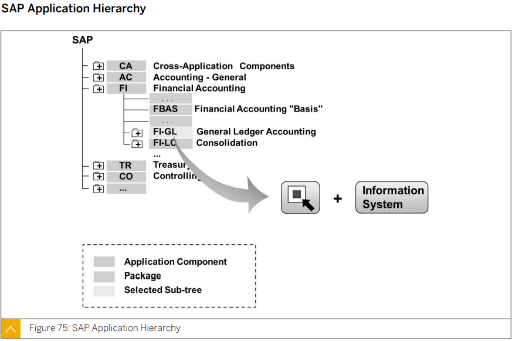
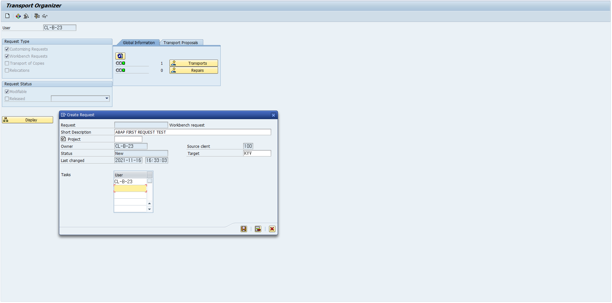
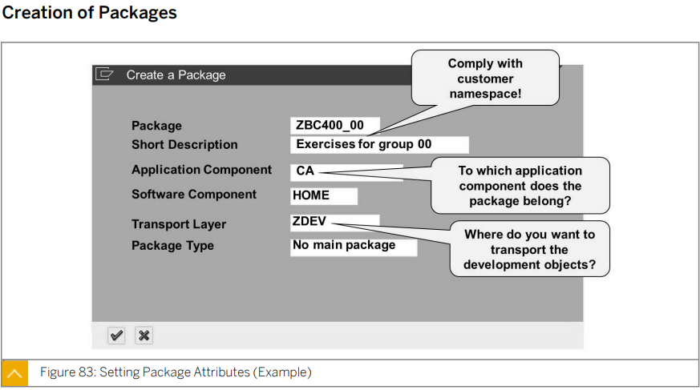
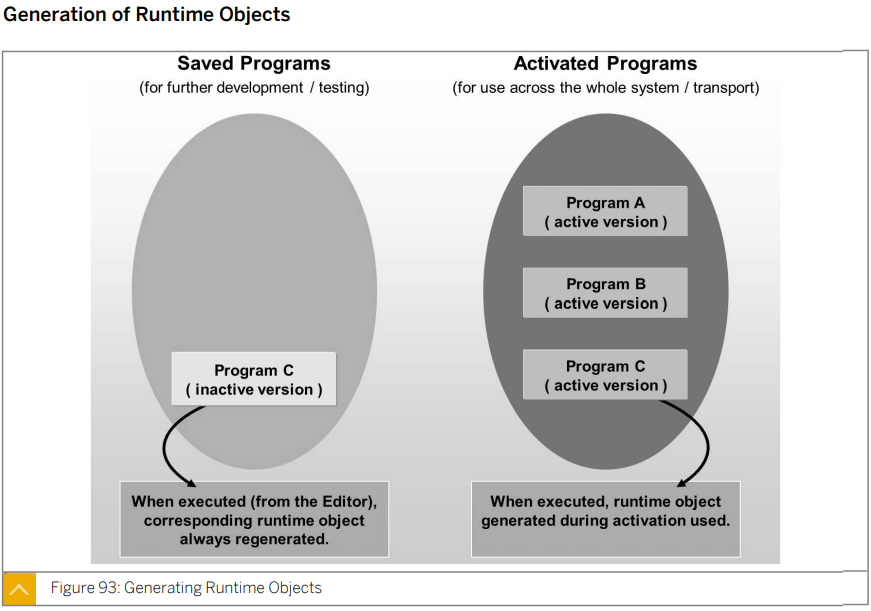
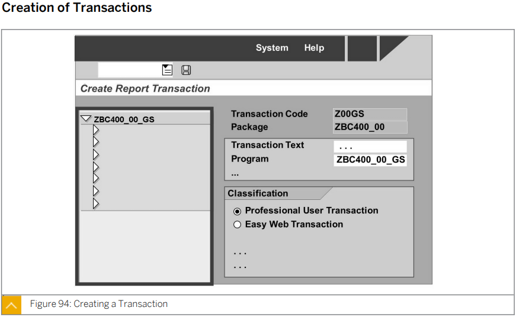
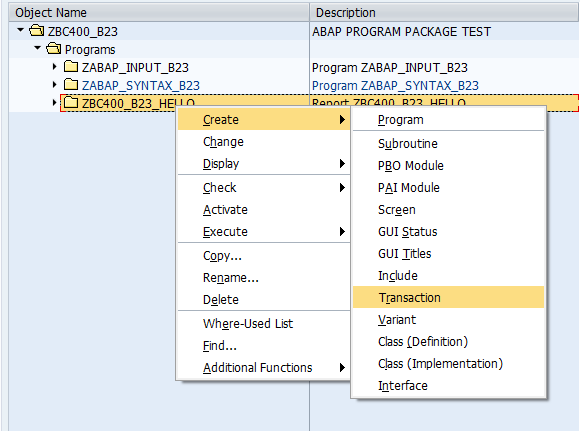
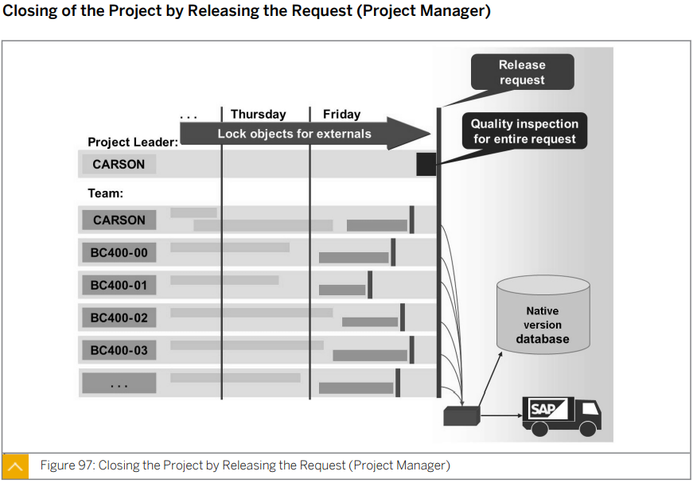
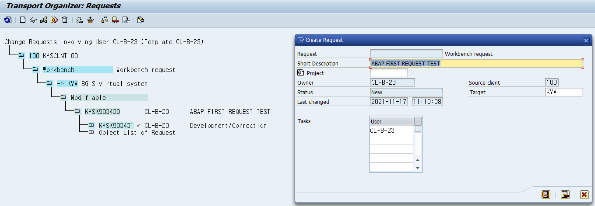

# Unit8 *ABAP Workbench*

# Lesson1 *Introducing the ABAP Workbench*

****

## 개요

ABAP 저장소와 ABAP 워크벤치의 컴포넌트에 대해 개략적으로 살펴본다.

중앙 개발 툴로 오브젝트 내비게이터를 사용한다.

Repository 구조를 이해하고, 적절한 툴을 사용하여 Repository 오브젝트를 검색하고, 그 구조를 분석해야 한다.

## 목표

* Repository의 구조 이해
* Repository의 검색 툴 사용
* 오브젝트 내비게이터를 사용하여 ABAP Repository 오브젝트 조회

****

## 

* ## ABAP Repository

  

  Repository 는 **Program, Function Module, Definition of Database Table 등과 같은 모든 시스템 개발 오브젝트**로 구성된다.

  뿐만 아니라 Customer(고객)가 정의 하는 오브젝트도 포함한다.

  저장소는 데이터베이스에 있으며 클라이언트에 종속되지 않는다.

  즉 저장소 오브젝트는 어떤 클라이언트에서나 액세스 할 수 있고 시스템의 각 클라이언트에 똑같이 표시된다.

  

  레파지토리에 저장되어 있는 프로그램들은 어느 클라이언트에서 수정을 하나 전부 수정이 된다.

  * 이를 **Cross Client 또는 Client independent** 라고 한다.

  테이블에 저장되어있는 데이터들은 클라이언트 별로 다르다.

  * 이를 **Client dependent Client Specific** 이라고 한다.

  일부 데이터들은 Cross Client로 적용 되며 이는 명시된다.

  하나의 프로그램으로 클라이언트별로 회사를 나누어 사용할 수 있다.

  또는 1차 2차 3차... 테스트들을 클라이언트 별로 사용할 수 있다.


* ## Structure of the Repository

  

  Repository는 어플리케이션 컴포넌트에 따라 세분화 된다.

  Repository 오브젝트는 생성될 때마다 패키지에 지정되어야 한다.

  일부 Repository는 그 자체가 Repository 오브젝트인 하위 오브젝트가 포함될 수 있다.

  또 Repository 오브젝트는 다른 Repository 오브젝트르르 참조할 수 있다.		

  모듈가 같은 개념이다. 관리를 위한 시스템

  

application component

customer component

​	

****

* ## Seach tools in ABAP

  

  * ### Repository Information System

    저장소 오브젝트를 어플리케이션과 관계없이 임의로 검색할 때 적합하다.

    SM84 트랜잭션을 통해서도 실행 할 수 있다.

  * ### SAP Application Hierarchy (SAP 어플리케이션 계층 구조)

    

    SAP Application Hierarchy 를 사용하여 저장소 오브젝트에 대해 어플리케이션 별 검색을 수행한다.

    어플리케이션 컴포넌트의 계층 구조는 트리구조의 형태이다.

    SE81 트랜잭션으로 접근 가능하다.

****

* ## ABAP Workbench Tools

  

  ABAP 워크벤치에는 저장소 오브젝트 생성 및 편집에 필요한 모든 툴이 포함되어 있다 이러한 툴은 전체 소프트웨어 개발에 사용된다.

  * ### Object Navigator

    t-code: se80

    object 카테고리와 object 이름을 통해 검색도 가능하다.

    favorite 기능도 있다. 잘 사용하진 않음

  * ### ABAP Dictionary

    t-code: se11	

    데이터베이스 테이블 정의, 데이터 유형 및 기타 엔티티 편집에 사용된다.

  * ### Function Builder

    t-code: se37

    함수 모듈 설정, 관리에 사용된다.

  * ### Class Builder

    t-code: se24

    전역 클래스 및 인터페이스 설정, 관리에 사용된다.

  * ### ABAP Editor

    t-code: se38

    소스코드 편집에 사용된다.

  * ### Menu Painter

    t-code: se41

    사용자 인터페이스 컴포넌트 (메뉴 바, 표준 툴바, 어플리케이션 툴바, 기능키 설정) 설계에 사용된다.

  * ### Screen Painter

    t-code: se51

    사용자 다이얼로그 기능이 포함된 화면 구성에 사용된다.

    Object Navigator에서 스크린 파일을 더블 클릭시 이동 가능하기 때문에 잘 사용하지 않는다.


****

****


# Lesson2 Organizing ABAP Development Projects

****

## 개요

신규 Repository 오브젝트, 패키지, 프로그램 및 트랜잭션 코드를 생성하는 방법에 대해 설명한다. 

또한 SAP 환경에서 ABAP  워크 벤치의 변경 요청을 사용하여 개발 프로젝트를 구성하고 운영 시스템으로 변경 사항을 전송할때 일관성을 보장하는 방법에 대해서도 설명한다.

## 목표

* 순차적 소프트웨어 개발으르 위해 유틸리티 이름을 지정하고 사용하는 방법
* ABAP 개발 인프라 이해
* 패키지, 프로그램 및 트랜잭션 생성 방법

****


* ## Transport of Development Objects

  

  Development System 의 개발된 또는 기존 것을 수정한 시스템들을 Change Request에 할당한다.

  이후 이를 Production System 에 적용한다.

  

* ## Organization of Development Projects

  

  * ### Change Request 의 이점

    * 사원들이 자신의 프로젝트별 액티비티르 모니터링할 수 있다.

    * 프로젝트에 관여하는 사원들이 프로젝트에 지정된 모든 저장소 오브젝트를 처리할 수 있다.

      프로젝트 팀에 속하지 않는 개발자에 대해서는 프로젝트가 완료될 때까지 (Change Request 가 **release** 될 때까지) 저장소 오브젝트가 잠긴 상태로 유지된다.

    * 프로젝트가 완료될 때 (Change Request 가  release 될 때) 오브젝트를 변경 요청에 지정함으로써 프로젝트 중에 생성되거나 변경된 모든 개발 오브젝트가 자동으로 전송되게 할 수 있다.

      개발이 이루어진 관련 패키지의 전송 경로에 따라 패키지를 전송할 후속 시스템이 지정된다.

  request 번호는 자동 할당 된다. 그 뒤에 만든 user id가 입력된다.

  여러개의 태스크 넘버가 있을 수 있다.

  여러 팀원들이 존재 하나의 request number에 할당

  * ### Request 생성 과정

    

    노란칸에 팀원의 이름이 들어가게 된다.

    

****

* ## Creation of Packages

  

  * ### Package의 특성

    * #### Application Component

      해당 어플리케이션 컴포넌트를 지정하여 어플리케이션 계층구조 내에서의 패키지 위치를 결정한다.

    * #### Software Component

      고객 개발인 경우 소프트웨어 컴포넌트로 HOME을 입력한다.

    * #### Transport Layer

      이 패키지의 오브젝트를 후속 시스템으로 전송할지 여부와 전송하는 경우 대상 시스템이 결정된다. 고객 개발의 경우 시슽ㅁ 관리자가 해당 용도로 설정한 전송 계층을 지정해야 한다.

    * #### Direct Superpackage

      직접적인 상위 패키지(주변 페이지)는 형재 패키지를 패키지 계층 구조에 따라 직접 하위 패키지로 포함하고 있는 패키지르르 나타낸다.

      모든 패키지는 패키지 계층구조에 따라 여러개의 트리 형탤 정렬된다.

      각 패키지는 (잠재적으로) 많은 수의 하위 패키지를 갖고 있으며, 주변 패키지의 하위 패키지가 될 수 있다.

    * #### Package Type

      개발자 패키지(저장소 오브젝트 및 기타 패키지를 포함 할 수 있다.), 주패키지(기타 패키지만 포함 할 수 있다.), 구조패키지(주 패키지만 포함할 수 있다.)의 세 가지 패키지 유형 중에서 선택한다.

    * #### Flag for Package Encapsulation

      이 패키지 속성을 활성화 하면 패키지가 캡슐화 된다. 그 결과 패키지의 패키지 인터페이스에 표시된 개발 요소만 외부에서 볼 수 있게 된다.

      클라이언트 패키지는 사용된 개발 요소가 있는 패키지 인터페이스에 대한 사용 액세스 권한이 필요하다.

    #### 패키지 이름또한 z,y로 시작

    #### 패키지 이름, short description 이외는 기본적으로 자동 할당

    

  * ### Transport Route Specification

    

    sap에서 제공해주는 프로그램을 수정한 내용을 옮기는 레이어가 SAP 레이어이다.

    단순 시스템 랜드스케이프인 경우에도 최소 두 개의 서로 다른 전송 계층이 있어야 고객 개발과 SAP 오브젝트에 대한 수정을 구별 할 수 있다.

    좀더 복잡한 시스템 랜드스케이프에서는 여러 대상 시스템과 함께 전송 계층이 존재 할 수 있다.

  * ### Assignment to a Change Request

    

    change request 를 입력한다.

    내 태스크르 ㄹ사용해 태스크가 지정된 변경 요청을 모두 조회할 수 있다.

    관련 요청을 선택하려면 더블클릭한다.

* ## 패키지생성

  * 오브젝트 내비게이터로 이동

  * 탐색 영역에서 패키지 오브젝트 유형을 선택하고 고객 네임스페이스 규칙에 따라 아래 입력 필드에 패키지 이름을 입력

    enter를 누른다.

    미리 지정된 패키지가 없을 경우 패키지를 생성할 수 있는 대화 상자가 표시된다.

    다른 방법으로, 오브젝트 내비게이터의 초기 화면에서 오브젝트 편집을 선택할 수 있다. 

    대화상자에서 패키지를 지정하기 위한 옵션을 검색하고 패키지 이름을 입력한다.

    f5 키를 눌러 오브젝트를 생성한다.

  * 생성할 패키지의 특성을 설정한다.

  * 패키지를 변경 요청에 지정한다.


****

****


## Lesson3 Developing ABAP Programs


체크박스에는 체크하지 않는다.


The features of the ABAP programming language are as follows:

주로 open sql 사용

특별한 경우가 아니면 native sql은 사용하지 않는다.


단어와 단어사이는 하나 이상의 공백으로 구분한다.

여러 문장을 한 라인에 사용할 수 있다.

한 문장은 여러라인으로 사용할 수 있다.

마지막에 .로 구분한다.


* PARAMETERS : 파라미터를 입력할 수 있는 selection screen

* DATA :  빈 변수를 초기화

* MOVE : 어떤 변수의 값을 다른 변수에 할당할 때 사용한다.

* ADD : 어떤 값에 어떤 숫자를 더할 때 사용한다.

* WRITE 
  * 화면에 어떤 값을 출력할때 사용한다.
  * 여러개를 출력할때는 WRITE: 뒤에 출력할 내용을 , 로 구분하여 작성한다. 
    * 이 경우 , 뒤에 /을 붙여 줄바꿈을 해줄 수 있다.
  * 이러한 작성방식을 ***Chained statement***라고 한다.


NEW-LINE : 줄을 바꾼다?


##### Program ZABAP_SYNTAX_B23    Of    Package *ZBC400_B23* 

```ABAP
*&---------------------------------------------------------------------*
*& Report ZABAP_SYNTAX_B23
*&---------------------------------------------------------------------*
*&
*&---------------------------------------------------------------------*
REPORT ZABAP_SYNTAX_B23.

DATA gv_result TYPE i.
* gv_result 변수를 int 타입으로 초기화한다.

PARAMETERS pa_num TYPE i.
* pa_num 을 int 타입으로 초기화하고 이 변수에 들어갈 값을 입력할 selection screen을 생성한다.

MOVE pa_num  TO gv_result.
gv_result = pa_num.
* pa_num 에 할당된 값을 gv_result 에 할당한다.

ADD 1 TO gv_result.
gv_result = gv_result + 1.
* gv_result에 1을 더해준다.

WRITE 'Your input: '.
WRITE pa_num.
* 'Your input: ' 와 pa_num 에 할당된 값을 한줄에 출력한다.

NEW-LINE.
* 줄을 바꾼다.

WRITE: 'Result    : ',
        gv_result.
* 'Result    : ' 와 gv_result 에 할당된 값을 한줄에 출력한다.
```

##### Program *ZABAP_INPUT_B23*   Of   Package *ZBC400_B23* 

```ABAP
*&---------------------------------------------------------------------*
*& Report ZABAP_INPUT_B23
*&---------------------------------------------------------------------*
*&
*&---------------------------------------------------------------------*
REPORT ZABAP_INPUT_B23.

parameters: pa_int Type i,
            pa_str Type string.

write: pa_int,
     / pa_str.

new-line.
write '김 철수'.
```


*는 주석처리 기호이다.

line의 일부를 주석처리 할때는 "를 붙여 줄의 마지막에 작성한다.

Key Word 에 커서를 올리고 f1키를 누르면 해당 ABAP KeyWord의 설명과 예제를 살펴볼 수 있다.


* ## ABAP Editor

  메뉴창의 utilities => settings => ABAP Editor => Text - Based Editor 

  를 통해 이전 버전의 에디터로 바꿀 수 있다.

  * ### Options Provided by the New ABAP Editor

    * 


* ## Activation Programs

  

  프로그램을 생성하고 저장하면 inactive version으로 저장된다. ctrl + f3 나 active 버튼을 클릭함으로서 프로그램을 active version으로 바꿔줘야 실행이 가능하다.

  

  active version 과 inactive version 이 동시에 존재하는 경우 수정하고 있는 유저는 inactive version을 보고 있지만 이외의 유저들은 active version 프로그램만 볼 수 있다.

  

****

****


## Execrcise 12

* ## Business Example 

  You want to create an ABAP program that takes simple user input, modifies the data, and outputs the information to a screen.

  In your package, create an executable program named ***ZBC400_B23_HELLO***.

  Enable the user to enter a name on the selection screen, which will be output later in the list, together with the 'Hello' text.

  * #### Template:

    None

  * #### Solution 

    ***BC400_GSS_HELLO***

    1. Create program ***ZBC400_B23_HELLO*** without a TOP include

    2. in the next dialog box, make sure that the program type is Executable Program. Set the status of th eprogram to a meaningful value.

    3. Define input field pa_name on the selection screen with type string.

    4. Implement the output of the Hello World! text. To do this, use the ABAP WRITE statement.

    5. Make sure that the output appears on a new line. To do so , use the NEW-LINE statement.

    6. Using a chained statement, implement the output text 'Hello' together with the input name from the selection screen.

    7. Check your program for syntax errors. Activate and test it.

       

  ##### Program *ZBC400_B23_HELLO*   Of   Package *ZBC400_B23* 

  ```abap
  *&---------------------------------------------------------------------*
  *& Report ZBC400_23_HELLO
  *&---------------------------------------------------------------------*
  *&
  *&---------------------------------------------------------------------*
  REPORT ZBC400_23_HELLO.
  
  PARAMETERS pa_name type string.
  *write 'Hello World!'.
  *new-line.
  *write: 'Hello',
  *       pa_name.
  
  write: 'Hello World!',
       / 'Hello',
         pa_name.
  ```

  

****

****


## Lesson4 Finalizing ABAP Development Projects




일반적으로 프로그램 이름과 t_code는 같은 이름으로 만든다.

* ## To create a Transaction


* ## To add a Transaction to Personal Favorites


* ## T_CODE 생성 과정

  

  

  

  

  





se01을 통해 Transport Organizer 에 접근 후 대상을 클릭하고 f9 버튼이나 용달차 버튼 클릭

한번 release 된 request 는 다시 사용할 수 없다.

release 후 release 한 request를 클릭후 create request를 누르면 기존과 같은 텍스트의 request를 생성할 수 있다.



Modul pool

Program and dynpro (dialog transaction)


