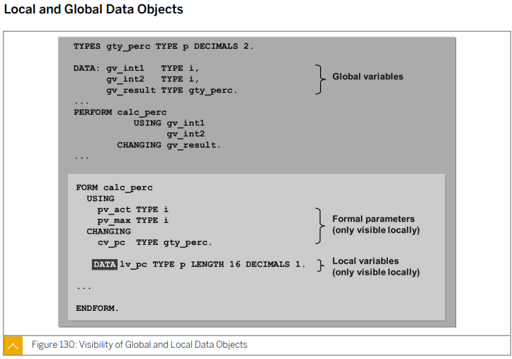
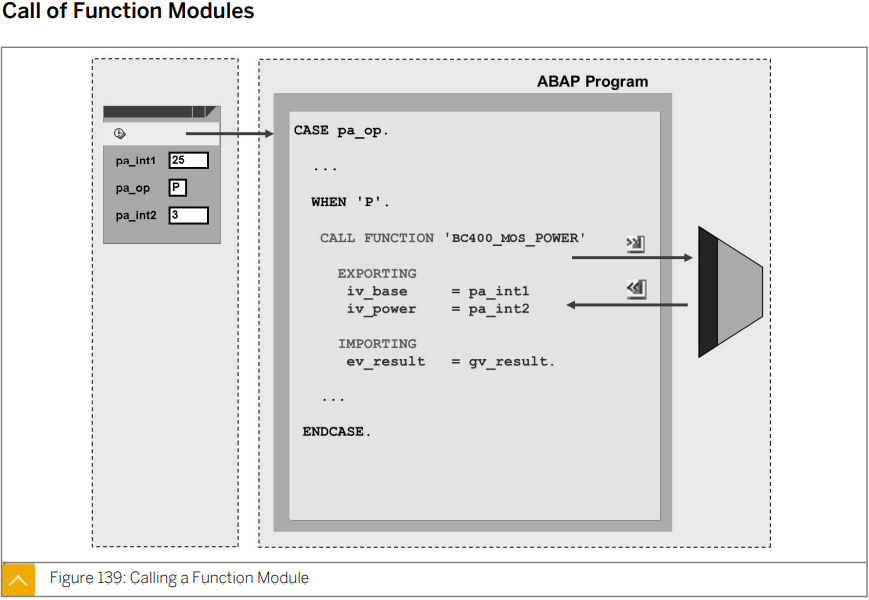
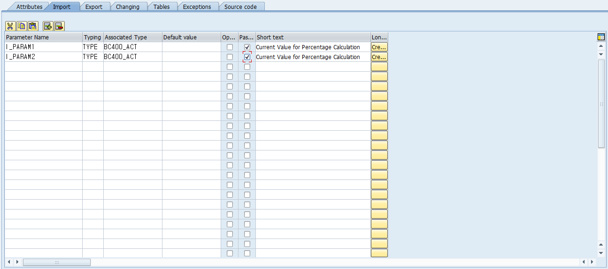
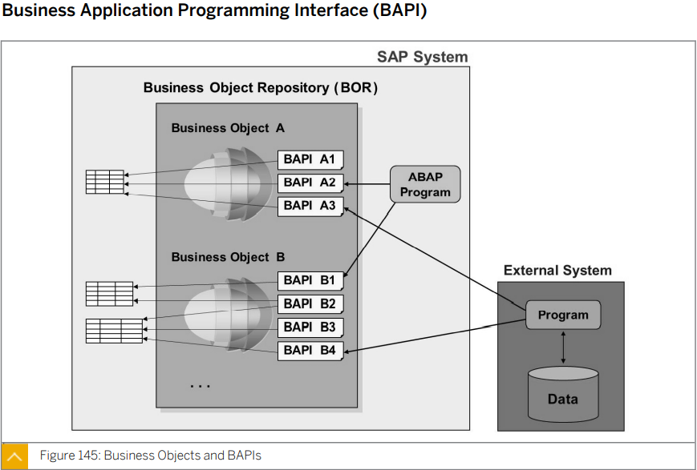
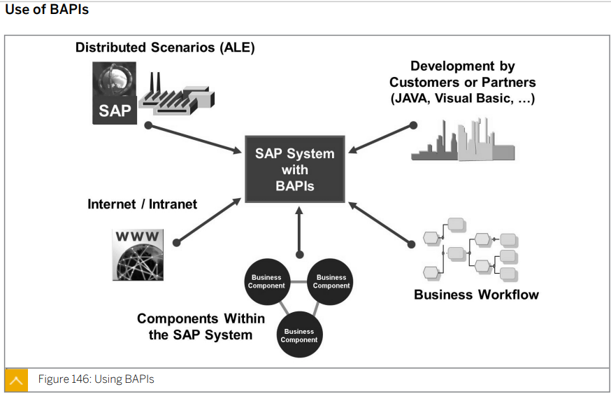
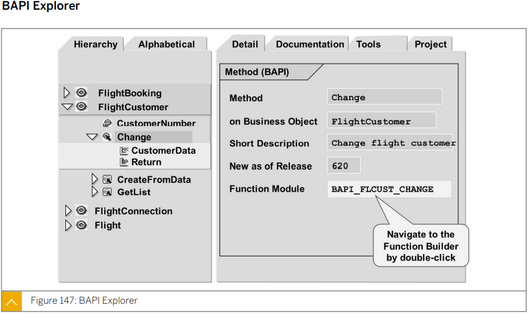
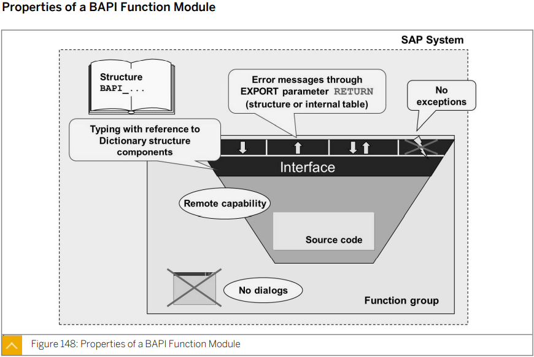

# Unit10 Modularization Techniques in ABAP


# Lesson1. Explaining Modularizagion

****

##  개요

프로그램의 일부를 모듈화 단위로 저장해야 하는 이유에 대해 설명한다.

## 목표

* 모듈화 기법의 이해 

****


* ## Modularization 의 세가지 장점

  

  Program B 는  A 에 비해 가독성이 좋으며 유지 보수가 수월하고 Source code block 을 재사용할 수 있다.
  
  * #### Reusablility
  
  * #### Readibility
  
  * #### Maintenance
  
  #### More transparent + Easier to maintain !!!

****

* ## SAP 모듈화 기법

  * Subroutine
    * 해당 Program 안에서만 재사용 가능
  * Function Module
  * Class

  ****

* ## Local Program Modularization

  

  각 프로그램의 **Subroutine과 Local_class의 method**는 각 프로그램내에서만 사용할 수 있다.


****


* ## Global Modularization

  

  **Function group 의 Function module과 Global_class 의 Method** 들은 여러 프로그램들에서 사용 가능하다.


****

* ## Data Encapsulation

  

  모듈화 단위는 호출 프로그램의 데이터 오브젝트를 직접 사용하지 않는 것이 바람직하며 

  반대로 호출하는 프로그램도 모듈화 단위의 데이터를 직접 변경하지 않는다. 이를 **데이터 캡슐화** 라고 한다. 

  프로그램은 Global Modularization 의 데이터를 다이렉트로 access 할 수 없다.

  

  데이터의 캡슐화는 투명하고 유지보수가 가능한 소스코드를 개발하는데 있어 중요한 기능이다.

  데이터 오브젝트의 내용이 변경된 위치를 훨씬 쉽게 파악할 수 있다.

  모듈화 단위 내 여러 데이터 오브젝트의 내용이 상호 종속적인 경우 등에도 더욱 간편하게 모듈화 단위 내 데이터가 일관된 방식으로 변경되도록 보장할 수 있다.

****

* ## Data Transports, Parameters, and Interface

  

  ### 매개 변수의 구분 기준

  * 모듈화 단위로 데이터 전달 (**Importing Parameters**)
  * 모듈화 단위에서 호출자로 데이터 리턴 (**Exporting Parameters**)
  * 모듈화 단위로 데이터 전달, 변경된 데이터 리턴 (**Changing Parameters**)

  

  #### 서브루틴은 Changing 매개 변수와 매우 특수한 Using 매개변수만 사용할 수 있으며 데이터 전송 제어옵션이 엄격히 제한된다.

  #### 따라서 가능하면 로컬 프로그램 모듈화에서 로컬 클래스를 사용한다.

  Function Module은 CALL FUNCTION  '' 구문을 통해 인터페이스를 이용하여 access하며

   Method는 CALL METHOD 구문을 통해  Signature을 이용하여 access한다.

  


****

****


# Lesson2. Defining and Calling Subroutines

****

## 개요

ABAP 프로그램에 서브루틴을 적용하는 방법에 대해 설명한다. 

매개변수 전달에 서브루틴 인터페이스가 어떤 식으로 사용되는지 알아보고 다양한 전송 유형이 사용되는 방식에 대해서도 살펴본다.

## 목표

* 서브루틴 정의 및 호출 방법
* 서브루틴을 사용한 모듈화
* 디버깅 모드로 서브루틴 실행

****


* ## Modularization Using Subroutines within Programs

  

  메인프로그램에서 선언된 데이터는 글로벌 베리어블(전역변수) 데이터이므로 메인 프로그램에서 그대로 사용 가능하다.

  서브 루틴에서도 변수를 선언할 수 있다. 이를 로컬 베리어블(지역변수)이라고 하며 이는 메인 프로그램에서 사용 할 수 없다. 

  서브 루틴은 FORM 과 ENDFORM 구문으로 둘러싸여진다.

  * ### Subroutine 생성 방법

    * #### 설정을 통한 생성

      `

      

    * #### 코드를 이용한 생성
    
      ```ABAP
      *&---------------------------------------------------------------------*
      *& Report ZABAP_SUBROUTIN_B23
      *&---------------------------------------------------------------------*
      *&
      *&---------------------------------------------------------------------*
      REPORT zabap_subroutin_b23.
      
      DATA: gv_result TYPE i.
      
      PARAMETERS: pa_int TYPE i.
      
      PERFORM calc_sum.
      
      WRITE:/ 'Result : ', gv_rslt.
      *&---------------------------------------------------------------------*
      *& Form calc_sum
      *&---------------------------------------------------------------------*
      *& text
      *&---------------------------------------------------------------------*
      *& -->  p1        text
      *& <--  p2        text
      *&---------------------------------------------------------------------*
      FORM calc_sum .
        DO pa_int TIMES.
          gv_rslt = gv_rslt + 1.
        ENDDO.
      ENDFORM.
      ```
    
      호출하는 Perform 을 먼저 선언 후 더블 클릭으로도 접근 가능
    
      ```ABAP
      *&---------------------------------------------------------------------*
      *& Report ZB23_00001
      *&---------------------------------------------------------------------*
      *&
      *&---------------------------------------------------------------------*
      REPORT zb23_00001.
      
      DATA gv_rslt TYPE i.
      
      PARAMETERS: p_arg1 TYPE i,
                  p_arg2 TYPE i.
      
      PERFORM add USING p_arg1 p_arg2
              CHANGING gv_rslt.
      
      WRITE:/ 'result : ', gv_rslt.
      
      * 더하기 서브루틴 정의.
      FORM add USING p1 TYPE i
                     p2 TYPE i
            CHANGING result TYPE i.
        result = p1 + p2.
      ENDFORM.
      ```
    
      
    

* ## 파라미터의 종류

  

  

  * #### Actual Parameter

    * 서브루틴의 CALL 에서 사용할 파라미터

  * #### Formal Parameter

    * 서브루틴의 DEFINITION에서   사용할 파라미터

  

* ## Pass Types (파라미터의 전송방식)

  

  * ### Call By Value

    * Actual Param 를 서브 루틴 안에서 값을 변경해도 던진 변수의 값에 영향을 미치지 않음

    * 복사/제본해서 빌려주는 개념

    * 생성 과정에서 오랜 시간이 걸릴 수 있다.

    * #### USING VALUE(p_a) TYPE i.
  
    ```ABAP
    *&---------------------------------------------------------------------*
    *& Report ZB23_00003
    *&---------------------------------------------------------------------*
    *&
    *&---------------------------------------------------------------------*
    REPORT zb23_00003.
    
    DATA: a TYPE i.
    
    a = 5.
    
    PERFORM xyz USING a.
    
    WRITE:/ a.
    *&---------------------------------------------------------------------*
    *& Form xyz
    *&---------------------------------------------------------------------*
    *& text
    *&---------------------------------------------------------------------*
    *&      --> A
    *&---------------------------------------------------------------------*
    FORM xyz  USING VALUE(p_a) TYPE i.
      p_a = 7.
    ENDFORM.
    ```

    

  * ### Call By Reference

    * Actual Param 를 서브루틴 안에서 값을 변경하면 던진 변수의 값에 영향을 미침

    * 원본을 주는 개념

    * 시간이 오래 걸리는 대용량 내부 테이블에 대한 복사본 생성 과정을 피할 수 있다.
  
    * #### USING p_a TYPE i.
  
    ```ABAP
    *&---------------------------------------------------------------------*
    *& Report ZB23_00003
    *&---------------------------------------------------------------------*
    *&
    *&---------------------------------------------------------------------*
    REPORT zb23_00003.
    
    DATA: a TYPE i.
    
    a = 5.
    
    PERFORM xyz USING a.
    
    WRITE:/ a.
    *&---------------------------------------------------------------------*
    *& Form xyz
    *&---------------------------------------------------------------------*
    *& text
    *&---------------------------------------------------------------------*
    *&      --> A
    *&---------------------------------------------------------------------*
    FORM xyz  USING p_a TYPE i.
      p_a = 7.
    ENDFORM.
    ```
  
  * #### Call By Value and Result
  
    ```ABAP
    *&---------------------------------------------------------------------*
    *& Report ZB23_00003
    *&---------------------------------------------------------------------*
    *&
    *&---------------------------------------------------------------------*
    REPORT zb23_00003.
    
    PARAMETERS: a TYPE i,
                b TYPE i.
    
    DATA gv_rslt TYPE i.
    
    PERFORM add USING a b
                CHANGING gv_rslt.
    
    WRITE:/ a, b, gv_rslt.
    
    *&---------------------------------------------------------------------*
    *& Form add
    *&---------------------------------------------------------------------*
    *& text
    *&---------------------------------------------------------------------*
    *&      --> A
    *&      --> B
    *&      <-- GV_RSLT
    *&---------------------------------------------------------------------*
    FORM add  USING    VALUE(p_a) TYPE i
                       VALUE(p_b) TYPE i
              CHANGING p_rslt  TYPE i.
      p_rslt = p_a + p_b.
    
    ENDFORM.
    ```
  
    
  
  


### 인터페이스 정의 X

```ABAP
PERFORM calc_parm.


WRITE:/ 'Result : ', gv_rslt.


DATA: gv_a    TYPE i,
      gv_b    TYPE i,
      gv_c    TYPE i,
      gv_d    TYPE i,
      gv_e    TYPE i,
      gv_f    TYPE i.

gv_b = 5.
gv_d = 10.

WRITE:/ 'A : ', gv_a,
      / 'C : ', gv_c.

gv_f = 11.

write:/ 'E : ', gv_e.

*&---------------------------------------------------------------------*
*& Form calc_parm
*&---------------------------------------------------------------------*
*& text
*&---------------------------------------------------------------------*
*& -->  p1        text
*& <--  p2        text
*&---------------------------------------------------------------------*
FORM calc_parm .
  gv_a = 2 * gv_b.
  gv_c = 2 * gv_d.
  gv_e = 2 * gv_f.
ENDFORM.
```

### 인터페이스 정의

```ABAP
DATA: gv_a TYPE i,
      gv_b TYPE i,
      gv_c TYPE i,
      gv_d TYPE i,
      gv_e TYPE i,
      gv_f TYPE i.

gv_b = 19.
gv_d = 5.
gv_f = 1.
PERFORM calc_parm1 USING gv_a gv_b.
WRITE:/ 'A : ', gv_a.
perform calc_parm1 using gv_c gv_d.
WRITE:/ 'C : ', gv_c.
perform calc_parm1 using gv_e gv_f.
WRITE:/ 'e : ', gv_e.


*&---------------------------------------------------------------------*
*& Form calc_parm1
*&---------------------------------------------------------------------*
*& text
*&---------------------------------------------------------------------*
*&      --> GV_A
*&      --> GV_B
*&---------------------------------------------------------------------*
FORM calc_parm1  USING    pv_f1 TYPE i
                          pv_f2 TYPE i.
pv_f1 = pv_f2 * 2.

ENDFORM.
```


#### 인터페이스를 정의해서 사용하는 것을 권장 

#### 액츄얼 파라미터 포멀 파라미터의 개수는 같아야한다.


* ## Definition and Call of Subroutines

  

  

  

  

* ## Type Specification of Interface Parameters

  


* ## Local and Global Data Objects

  


* ## Debugging

  

  * #### F5 : Single Step

    한 라인씩 실행, 모듈을 만나면 모듈 안으로 들어감

  * #### F6 : Execute

    한 라인씩 실행, 모듈도 마치 한라인처럼 실행함.

  * #### F7 : Return

    모듈 안에서 밖으로 나가고 싶은 경우

  * #### F8 : Continue

    프로그램 끝까지 실행 또는 다음 디버깅 위치까지 축 실행


* ## Exercise 16

  ```ABAP
  *&---------------------------------------------------------------------*
  *& Report ZBC400_B23_SUBROUTINE
  *&---------------------------------------------------------------------*
  *&
  *&---------------------------------------------------------------------*
  REPORT zbc400_b23_subroutine.
  
  TYPES tv_rslt TYPE p LENGTH 16 DECIMALS 2.
  
  PARAMETERS: pa_int1 TYPE i,
              pa_int2 TYPE i,
              pa_op   TYPE c LENGTH 1.
  
  DATA gv_rslt TYPE tv_rslt.
  
  
  CASE pa_op.
    WHEN '+'.
      gv_rslt = pa_int1 + pa_int2.
      WRITE: / pa_int1, '+', pa_int2, '=', gv_rslt.
    WHEN '-'.
      gv_rslt = pa_int1 - pa_int2.
      WRITE: / pa_int1, '-', pa_int2, '=', gv_rslt.
    WHEN '*'.
      gv_rslt = pa_int1 * pa_int2.
      WRITE: / pa_int1, '*', pa_int2, '=', gv_rslt.
    WHEN '/'.
      IF pa_int2 = 0.
        WRITE / 'PA_INT2 Error'.
      ELSE.
        gv_rslt = pa_int1 / pa_int2.
        WRITE: / pa_int1, '/', pa_int2, '=', gv_rslt.
      ENDIF.
    WHEN '%'.
      IF pa_int2 = 0.
        MESSAGE i000(zmessage_b23_01) WITH pa_int2.
      ELSE.
        PERFORM calc_prercentage USING pa_int1 pa_int2
                                 CHANGING gv_rslt.
        WRITE:/ gv_rslt.
      ENDIF.
  ENDCASE.
  *&---------------------------------------------------------------------*
  *& Form calc_prercentage
  *&---------------------------------------------------------------------*
  *& text
  *&---------------------------------------------------------------------*
  *&      --> PA_INT1
  *&      --> PA_INT2
  *&      <-- GV_RSLT
  *&---------------------------------------------------------------------*
  FORM calc_prercentage  USING    p_int1 TYPE i
                                  p_int2 TYPE i
                         CHANGING p_rslt TYPE tv_rslt.
    p_rslt = p_int1 / p_int2 * 100.
  ENDFORM.
  ```

  

* ## 실습

  pa_date (생연월일)      2000-11-01

  pa_date+0(4)

  결과 21년 0월 17

```ABAP
*&---------------------------------------------------------------------*
*& Report ZABAP_CALCDAY_B23
*&---------------------------------------------------------------------*
*&
*&---------------------------------------------------------------------*
REPORT zabap_calcday_b23.

*인풋 필드에 날짜를 받음
*현재 날짜를 기준으로  얼마나 지났는지 계산

PARAMETERS pa_date TYPE d.
DATA: gv_today TYPE d,
      gv_rslt  TYPE string.

gv_today = sy-datum.


PERFORM calc_date USING pa_date gv_today gv_rslt.

WRITE:/ gv_rslt.


*&---------------------------------------------------------------------*
*& Form calc_date
*&---------------------------------------------------------------------*
*& text
*&---------------------------------------------------------------------*
*&      --> PA_DATE
*&      --> GV_TODAY
*&      --> GV_RSLT
*&---------------------------------------------------------------------*
FORM calc_date  USING    pv_date
                         pv_today
                         pv_rslt.

  DATA: gv_y TYPE i,
        gv_m TYPE i,
        gv_d TYPE i.

  gv_d = pv_today+6(2) - pv_date+6(2).

  IF gv_d < 0.
    gv_d = gv_d + 30.
    gv_m = -1.
  ENDIF.

  gv_m = gv_m + pv_today+4(2) - pv_date+4(2).

  IF gv_m < 0.
    gv_m = gv_m + 12.
    gv_y = gv_y - 1.
  ENDIF.

  gv_y = gv_y + pv_today+0(4) - pv_date+0(4).

  pv_rslt = gv_y && '년' && gv_m && '월' && gv_d && '일'.


ENDFORM.
```


****

****


# Lesson3. Calling Function Moules

****

## 개요

함수 모듈을 검색하고 그 인터페이스와 문서를 분석하며 해당 함수 ㅁ듈의 함수를 테스트하는 방법에 대해 설명한다.

프로그램에서 기존 함수 모듈을 사용하고 오류를 캐치 및 처리하는 방법을 학습한다.

마지막으로 함수 모듈을 생성하고 다른 프로그램에서 재사용 할 수 있도록 함수를 캡슐화 한다.

## 목표

* 함수 모듈 검색 방법
* 함수 모듈의 사용 및 기능에 대한 정보를 확보하는 방법
* 프로그램에서 함수 모듈을 호출 하는 방법
* 함수 그룹 및 함수 모듈 생성 방법
* BAPI 와 BAPI의 특수한 속성

****

* ## Structure of Function Groups

  Function Group 이 선행 되어야 하며 그 안에 Function Module이 들어간다.

  서브루틴은 다른 프로그램에서 사용할 수 없어 재사용 성이 떨어지는 반면 Function Module은 다른 프로그램에서도 사용 가능하다.

  

  ### 함수를 구성하는 요소

  * Data Objects
    * 데이터 오브젝트는 함수 그룹에서 전역적이다. 즉, 그룸 내 모든 함수 모듈에 표시되며 그룹 내 모든 함수 모듈에 의해 변경될 수 있다.
  * Subroutines
    * 서브루틴은 그룹 내 모든 함수 모듈에서 호출 될 수 있다.
  * Screens
    * 화면은 그룹 내 모든 함수 모듈에서 호출될 수 있다.

  

  


* ### Elements of the Interface of a Function Module

  * #### Importing Parameter

    * 함수 모듈이 호출되면 호출 프로그램이 함수 모듈에 값이나 변수를 전송한다. 
    * Optional 매개변수라면 이 매개변수에 값이나 변수를 제공하지 않아도 된다.

  * #### Exporting Parameter

    * 호출 프로그램은 "수신 변수"를 Exporting 매개변수에 지정하는 방식으로 함수 모듈 출력을 수락한다.
    * Exporting 매개변수는 항상 옵션으로 제공된다.

  * #### Changing Parameter

    * 함수 모듈이 변경 매개변수를 사용하면 변수가 호출 프로그램에서 함수 모듈로 전송되고 호출 마지막에 리턴된다.

  * #### Exceptions

    * 특정 오류 상황에서 함수 모듈에 의해 예외가 발생할 수 있으며 이 경우 함수 모듈에 각 처리 오류에 대한 정보가 제공된다.
    * 호출 프로그램에서 예외를 처리해야한다.

    

  

  

* ## Data Objects Within a Function Group

  


* ## Function Modules Searching

  시기상조

  

* ## Exmination of a Function Module

  

  Optional: 체크하면 입력값으로 주지 않아도 되며 그럴경우 default value 를 기본 값으로 준다.

  Pass value : call by value or reference를 정해준다.


* ## Documentation and Test Environment

  

  #### 함수를 테스트 해볼 수 있다. 필수 !!!!


* ## Call of Function Modules

  

  ```ABAP
  *&---------------------------------------------------------------------*
  *& Report ZB23_00004
  *&---------------------------------------------------------------------*
  *&
  *&---------------------------------------------------------------------*
  REPORT zb23_00004.
  
  PARAMETERS: p_base  TYPE bc400_compute_base,
              p_power TYPE bc400_compute_base.
  
  DATA gv_rslt TYPE bc400_compute_result.
  
  *타입 중요!!
  
  *함수 호출
  *Pattern 에서 검색
  CALL FUNCTION 'BC400_MOS_POWER'
    EXPORTING
      iv_base                     = p_base
     IV_POWER                    = p_power
   IMPORTING
     EV_RESULT                   = gv_rslt
   EXCEPTIONS
     POWER_VALUE_TOO_HIGH        = 1
     RESULT_VALUE_TOO_HIGH       = 2
     OTHERS                      = 3.
  *설계할때와 호출할때는 export와 import가 반대 (rfc 참고)
  write:/ 'result : ', gv_rslt.
  
  CASE sy-subrc.
    WHEN 0.
      WRITE gv_rslt.
    WHEN 1.
      WRITE 'Power value max 4'.
    WHEN 2.
      WRITE 'Unknown Error'.
  ENDCASE.
  ```
  
  
  
  #### Pattern을 통해 함수 명을 입력하여 call 할 수 있다.
  
  


 


* ## 실습

  ```ABAP
  *&---------------------------------------------------------------------*
  *& Report ZB23_QUIZ_01
  *&---------------------------------------------------------------------*
  *&
  *&---------------------------------------------------------------------*
  REPORT zb23_quiz_01.
  
  PARAMETERS: pa_a TYPE BC400_act,
              pa_b TYPE bc400_max.
  
  DATA: gv_rslt TYPE bc400_perc.
  
  
  
  CALL FUNCTION 'BC400_MOS_PERCENTAGE'
    EXPORTING
      iv_act           = pa_a
      iv_max           = pa_b
    IMPORTING
      ev_percentage    = gv_rslt
    EXCEPTIONS
      division_by_zero = 1
      OTHERS           = 2.
  
  CASE sy-subrc.
    WHEN 0.
      gv_rslt = gv_rslt / 100.
      WRITE gv_rslt.
    WHEN 1.
      WRITE 'Power value max 4'.
    WHEN 2.
      WRITE 'Unknown Error'.
  ENDCASE.
  ```

* ## Exercise 17

  ```ABAP
  *&---------------------------------------------------------------------*
  *& Report ZBC400_B23_FUNCTION_MODULE
  *&---------------------------------------------------------------------*
  *&
  *&---------------------------------------------------------------------*
  REPORT zbc400_b23_function_module.
  
  
  TYPES tv_rslt TYPE p LENGTH 16 DECIMALS 2.
  
  PARAMETERS: pa_int1 TYPE i,
              pa_int2 TYPE i,
              pa_op   TYPE c LENGTH 1.
  
  DATA gv_rslt TYPE tv_rslt.
  
  
  CASE pa_op.
    WHEN '+'.
      gv_rslt = pa_int1 + pa_int2.
      WRITE: / pa_int1, '+', pa_int2, '=', gv_rslt.
    WHEN '-'.
      gv_rslt = pa_int1 - pa_int2.
      WRITE: / pa_int1, '-', pa_int2, '=', gv_rslt.
    WHEN '*'.
      gv_rslt = pa_int1 * pa_int2.
      WRITE: / pa_int1, '*', pa_int2, '=', gv_rslt.
    WHEN '/'.
      IF pa_int2 = 0.
        WRITE / 'PA_INT2 Error'.
      ELSE.
        gv_rslt = pa_int1 / pa_int2.
        WRITE: / pa_int1, '/', pa_int2, '=', gv_rslt.
      ENDIF.
    WHEN '%'.
      IF pa_int2 = 0.
        MESSAGE i000(zmessage_b23_01) WITH pa_int2.
      ELSE.
        PERFORM calc_prercentage USING pa_int1 pa_int2
                                 CHANGING gv_rslt.
        WRITE:/ gv_rslt.
      ENDIF.
  
    WHEN 'P'.
  
      CALL FUNCTION 'BC400_MOS_POWER'
        EXPORTING
          iv_base               = pa_int1
          iv_power              = pa_int2
        IMPORTING
          ev_result             = gv_rslt
        EXCEPTIONS
          power_value_too_high  = 1
          result_value_too_high = 2
          OTHERS                = 3.
  
  
      CASE sy-subrc.
        WHEN 0.
          WRITE: / pa_int1, '^', pa_int2, '=', gv_rslt.
        WHEN 1.
          WRITE 'power_value_too_high'.
        WHEN 2.
          WRITE 'result_value_too_high'.
        WHEN 3.
          WRITE 'unknown error'.
      ENDCASE.
  
  
  
  
  *    gv_rslt = pa_int1 ** pa_int2.
  *
  
    WHEN OTHERS.
      WRITE 'pa_op errors'.
  ENDCASE.
  *&---------------------------------------------------------------------*
  *& Form calc_prercentage
  *&---------------------------------------------------------------------*
  *& text
  *&---------------------------------------------------------------------*
  *&      --> PA_INT1
  *&      --> PA_INT2
  *&      <-- GV_RSLT
  *&---------------------------------------------------------------------*
  FORM calc_prercentage  USING    p_int1 TYPE i
                                  p_int2 TYPE i
                         CHANGING p_rslt TYPE tv_rslt.
    p_rslt = p_int1 / p_int2 * 100.
  ENDFORM.
  ```

  


 


****

****


# Lesson4. Creating Function Moules

****

## 개요

함수 그룹 및 함수 모듈 생성 방법에 대해 설명한다.

## 목표

* 함수 그룹 생성
* 함수 모듈 생성

* ## Creation of Function Groups

  


* ## Exception 종류

  * ### System Exception

    분모가 0인경우.

  * ### Business Exception

    분모가 분자보다 큰경우


* ## Function Module 만들기

  * ### 나누기 몫 구하기

    

    

    

    ##### Source Code

    ```ABAP
    FUNCTION zb23_division.
    *"----------------------------------------------------------------------
    *"*"Local Interface:
    *"  IMPORTING
    *"     VALUE(I_PARAM1) TYPE  BC400_ACT
    *"     VALUE(I_PARAM2) TYPE  BC400_ACT
    *"  EXPORTING
    *"     REFERENCE(E_RESULT) TYPE  BC400_ACT
    *"  EXCEPTIONS
    *"      DIVIDE_BY_ZERO
    *"      DENUMERATOR_GREATER
    *"----------------------------------------------------------------------
    
      IF i_param2 = 0.
        raise divide_by_zero.
      ENDIF.
    
      IF i_param2 > i_param1.
        raise denumerator_greator.
      ENDIF.
    
      e_result = i_param1 / i_param2.
    
    
    ENDFUNCTION.
    ```

  * ### 항공사 데이터 출력

    

    

    * ##### Associated Type에 테이블 명을 넣으면 테이블과 동일한 모양의 structure 타입 된다.

    #### Source Code

    ```ABAP
    FUNCTION zb23_carrier.
    *"----------------------------------------------------------------------
    *"*"Local Interface:
    *"  IMPORTING
    *"     VALUE(I_CARRID) TYPE  S_CARR_ID
    *"  EXPORTING
    *"     REFERENCE(E_DETAIL) TYPE  SCARR
    *"----------------------------------------------------------------------
    
      SELECT SINGLE *
        INTO e_detail
        FROM scarr
        WHERE carrid = i_carrid.
    
    
    
    
    ENDFUNCTION.
    ```

    #### 출력 프로그램

    ```ABAP
    *&---------------------------------------------------------------------*
    *& Report ZB23_QUIZ_02
    *&---------------------------------------------------------------------*
    *&
    *&---------------------------------------------------------------------*
    REPORT zb23_quiz_02.
    
    PARAMETERS pa_carid TYPE s_carr_id.
    
    DATA: gv_id       TYPE string,
          gv_name     TYPE string,
          gv_country  TYPE string,
          gv_homepage TYPE string,
          gv_rslt     TYPE scarr.
    
    
    CALL FUNCTION 'ZB23_CARRIER'
      EXPORTING
        i_carrid = pa_carid
      IMPORTING
        e_detail = gv_rslt.
    
    WRITE:/ 'ID       : ', gv_rslt-carrid,
          / 'Name     : ', gv_rslt-carrname,
          / 'Country  : ', gv_rslt-currcode,
          / 'Homepage : ', gv_rslt-url,
          / gv_rslt.
    
    
    
    *WRITE:/ 'ID       : ', gv_rslt+3(3),
    *      / 'Name     : ', gv_rslt+6(20),
    *      / 'Country  : ', gv_rslt+26(5),
    *      / 'Homepage : ', gv_rslt+31(255),
    *      / gv_rslt.
    ```

    * ##### Structure type은 -key 값으로 접근 가능하다.

  


 


 


 


****

****


# Lesson5. Describing Business Application Programming Interfaces (BAPIs)

****

## 개요

BAPI(**B**usiness **A**pplication **P**rogramming **I**nterface)에 대해 소개한다.

## 목표

* BAPI를 사용한 모듈화

****

  

* ## **B**usiness **A**pplication **P**rogramming **I**nterface (BAPI)




* ## Use of BAPIs

  

  BAPI는 **SAP 시스템과 외부 시스템 모두**에서 이용 가능한 함수이다.


* ## BAPI Explorer

   

  BAPI Explorer 는 **BAPI 트랜잭션**으로 접근할 수 있다.

  Hierarchy 탭을 통해 업무별로 정리된 BAPI들을 볼 수 있으며 Alphabetical 탭을 이용해 알파벳 순으로 나열된 BAPI들을 볼 수 있다.

  BAPI를 클릭하여 나오는 정보중 Function Module


* ## Properties of a BAPI Function Module

   
   
   ### BAPI에 대한 함수 모듈의 기술 요구사항
   
   * 명명 규칙: BAPI <비지니스 오브젝트 이름><메소드 이름>
   * 원격 기능 지원
   * 사용자 다이얼로그 또는 메시지 없음
   * BAPI 구조의 이름 접두부: BAPI
     * 이 BAPI에 생성된 ABAP 딕셔너리 구조의 컴포넌트를 사용하여 인터페이스 매개변수의 유형이 지정된다.
   * 릴리스 4.6 까지 매개변수 변경 없음
   * 예외 발생 없음
     * 특수 EXPORTING 매개변수인 RETURN을 통해 사용자에게 오류가 보고된다.


* ## 실습

  ```ABAP
  *&---------------------------------------------------------------------*
  *& Report ZB23_00006
  *&---------------------------------------------------------------------*
  *&
  *&---------------------------------------------------------------------*
  REPORT zb23_00006.
  
  PARAMETERS p_id TYPE bapibname-bapibname.
  
  DATA gs_return TYPE bapiret2.
  
  CALL FUNCTION 'BAPI_USER_DISPLAY'
    EXPORTING
      username = p_id
    IMPORTING
      return   = gs_return.
  
  IF gs_return IS NOT INITIAL.
    WRITE:/ gs_return-message.
  ENDIF.
  ```


* ## BAPI Call in an  ABAP Program

   


 


****

****


* ## Lesson6. Calling Methods of Global Classes

   

  뒤에 내용은 다음에 이어서 한다

   

  

   

  

   

  

  ****

  ****

  

* ## Lesson7. Creating Global Classes and Static Methods

   

  

   

  

   

  

   

  

  ****

  ****


* ## Lesson8. Using Local Classes


문자열 스플릿

문자열+i(j)

i번째 부터 j 개 자름


SAP 프로그램 종류

* REPORT ( = EXCUTABLE PROGRAM = TYPE 1 PROGRAM)
* MODULE POOL ( =SCREEN PROGRAM = TYPE M PROGRAM)