# Unit 11 Complex Data Objects


# Lesson 1. Using Structured Data Objects

****

## 개요

Structured 데이터 오브젝트(구조화 변수)와 정의를 소개하고 ABAP 디버거에서 분석하는 방법을 설명한다. 

Structured 데이터 오브젝트에 기본적인 ABAP 문을 사용하는 방법에 대해서도 알아본다.

## 목표

* Structured 데이터 오브젝트 정의
* Structured 데이터 오브젝트에 대한 기본적인 ABAP 문 구현
* 디버깅 모드로 Structured 데이터 오브젝트 분석

****


* ## Definition of Structured Data Objects

  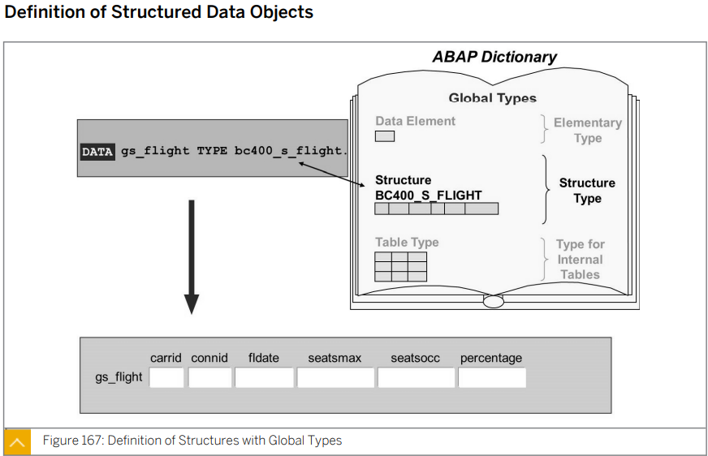

  ### 유형 설정 시 사용되는 구조

  * ABAP 딕셔너리 구조 (전역 구조 유형)
  * 프로그램에서 로컬로 선언한 구조 유형

  ### 명명 규칙에 추가되는 정의

  * 프로그램 전역 또는 로컬 구조화 유형

    ts_

  * 프로그램 전역 구조화 변수

    gs_

  * 로컬 구조화 변수

    ls_


* ## Definition of Structure with Local Types

  ```ABAP
  *&---------------------------------------------------------------------*
  *& Report ZB23_00008
  *&---------------------------------------------------------------------*
  *&
  *&---------------------------------------------------------------------*
  REPORT zb23_00008.
  
  DATA gs_flight TYPE bc400_s_flight.
  
  * 컬럼 6 + 1 개의 항공사 이름을 가진 타입을 정의 해야함.
  TYPES: BEGIN OF ts_flightinfo,
           carrid     TYPE s_carr_id,
           connid     TYPE s_conn_id,
           fldate     TYPE s_date,
           seatsmax   TYPE s_seatsmax,
           seatsocc   TYPE s_seatsocc,
           percentage TYPE s_flghtocc,
           carrname   TYPE s_carrname,
         END OF ts_flightinfo.
         
  * id name gender 로 구성된 local structure의 정의
  TYPES: BEGIN OF ts_student,
           id     TYPE n LENGTH 8,
           name   TYPE c LENGTH 32,
           gender TYPE c LENGTH 1,
         END OF ts_student.
  ```

   


* ## Access to Structure Components

  ```ABAP
  DATA: gs_student TYPE ts_student.
  
  gs_student-id       = 1.
  gs_student-name     = '홍길동'.
  gs_student-gender   = 'F'.
  gs_student-carrname = '대한항공'.
  
  write: gs_student-id, gs_student-name.
  ```

  | ts_student | id   | name     | gender | carrname   |
  | ---------- | ---- | -------- | ------ | ---------- |
  | gs_student | 1    | '홍길동' | 'F'    | '대한항공' |


* ## Usage of Sturctured Data Objects

  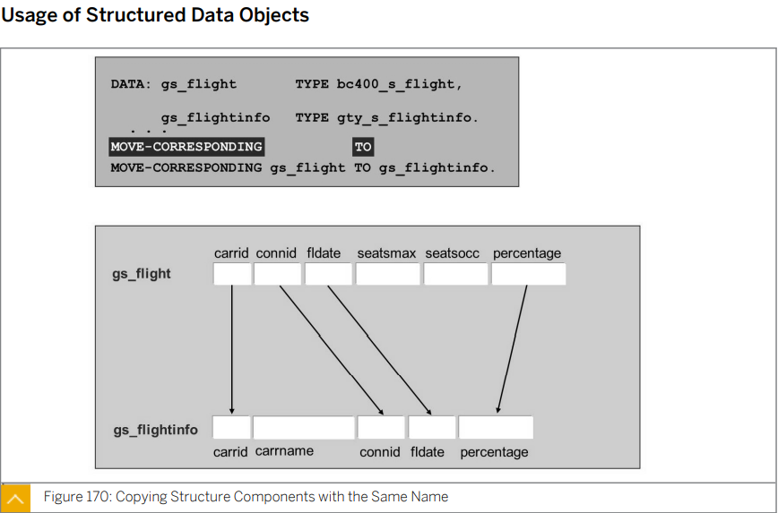

  ```ABAP
  * 특정한 structure 의 key 값이 같은 것의 데이터를 다른 structure로 옮긴다.
  MOVE-CORRESPONDING gs_student TO gs_target.
  ```

  

  

  

  

* ## 실습

  ```ABAP
  *&---------------------------------------------------------------------*
  *& Report ZB23_00008
  *&---------------------------------------------------------------------*
  *&
  *&---------------------------------------------------------------------*
  REPORT zb23_00008.
  
  * 문제 1)
  * 항공사 ID, 항공사 이름, 고객 ID, 고객 이름으로 구성된 스트럭쳐 타입과 변수를 정의하시오.
  * 관련 테이블은 SCARR, SCUSTOM.
  
  TYPES: BEGIN OF ts_flightinfo,
           carrid   TYPE scarr-carrid,
           carrname TYPE scarr-carrname,
           id       TYPE scustom-id,
           name     TYPE scustom-name,
         END OF ts_flightinfo.
  
  * 문제2)
  * 선언한 변수의 값 AA, America Airline, 109, '홍길동'
  
  DATA gs_flightinfo TYPE ts_flightinfo.
  
  gs_flightinfo-carrid   = 'AA'.
  gs_flightinfo-carrname = 'America Airline'.
  gs_flightinfo-id       = 109.
  gs_flightinfo-name     = '나고객'.
  
  WRITE:/ gs_flightinfo-carrid,
        / gs_flightinfo-carrname,
        / gs_flightinfo-name.
  ```

  

  

  

* ## Table의 Column의  type 지정 방법

  * ### data element

    **EX )**

    ```ABAP
    carrid	TYPE s_carr_id,
    ```
  
    
  
  * ### built-in data
  
    **EX )**
  
    ```ABAP
    id TYPE n LENGTH 8,
    ```
  
    
  
  * ### <u>*table-column 으로 지정 - 정석*</u>
  
    ##### EX )
  
    ```ABAP
    carrid   TYPE scarr-carrid,
    ```
  
    
  
  테이블의 컬럼을 참조하여 타입을 정하는 것이 정석
  
  컬럼 이름은 테이블의 컬럼 이름과 동일하게 해 주는 것이 정석


* ## Exercise 23

  #### ZBC400_B23_STRUCTURE

  ```ABAP
  *&---------------------------------------------------------------------*
  *& Report ZBC400_B23_STRUCTURE
  *&---------------------------------------------------------------------*
  *&
  *&---------------------------------------------------------------------*
  REPORT zbc400_b23_structure.
  
  PARAMETERS: pa_car  TYPE bc400_s_flight-carrid,
              pa_con  TYPE bc400_s_flight-connid,
              pa_date TYPE bc400_s_flight-fldate.
  
  DATA: gs_carrier TYPE bc400_s_carrier,
        gs_flight  TYPE bc400_s_flight.
  
  TYPES: BEGIN OF ts_carrierflight,
           carrid     TYPE bc400_s_carrier-carrid,
           carrname   TYPE bc400_s_carrier-carrname,
           currcode   TYPE bc400_s_carrier-currcode,
           url        TYPE bc400_s_carrier-url,
           connid     TYPE bc400_s_flight-connid,
           fldate     TYPE bc400_s_flight-fldate,
           seatsmax   TYPE bc400_s_flight-seatsmax,
           seatsocc   TYPE bc400_s_flight-seatsocc,
           percentage TYPE bc400_s_flight-percentage,
         END OF ts_carrierflight.
  
  
  DATA gs_carrierflight TYPE ts_carrierflight.
  
  TRY.
      CALL METHOD cl_bc400_flightmodel=>get_flight
        EXPORTING
          iv_carrid = pa_car
          iv_connid = pa_con
          iv_fldate = pa_date
        IMPORTING
          es_flight = gs_flight.
  
      CALL METHOD cl_bc400_flightmodel=>get_carrier
        EXPORTING
          iv_carrid  = pa_car
        IMPORTING
          es_carrier = gs_carrier.
  
    CATCH cx_bc400_no_data.
      WRITE 'No data found!'.
    CATCH cx_bc400_no_auth.
      WRITE: 'No authority for this carrier!'.
  ENDTRY.
  
  MOVE-CORRESPONDING gs_flight TO gs_carrierflight.
  MOVE-CORRESPONDING gs_carrier TO gs_carrierflight.
  
  
  
  WRITE:/ gs_carrierflight-carrid,
        / gs_carrierflight-carrname,
        / gs_carrierflight-currcode,
        / gs_carrierflight-url,
        / gs_carrierflight-connid,
        / gs_carrierflight-fldate,
        / gs_carrierflight-seatsmax,
        / gs_carrierflight-seatsocc,
        / gs_carrierflight-percentage.
  ```

  


# Lesson 2. Using Internal Tables

## 개요

내부 테이블 (Internal Table) 을 정의하고 ABAP 프로그램에서 사용하는 방법에 대해 설명한다.

또한 ABAP 디버거에서 런타임에 내부 테이블을 분석한다.

## 목표

* Internal Tables 정의
* Internal Tables에 기본적인 ABAP 문 구현
* 디버깅 모드의 Internal Tables 분석

****


* ## Table Types

  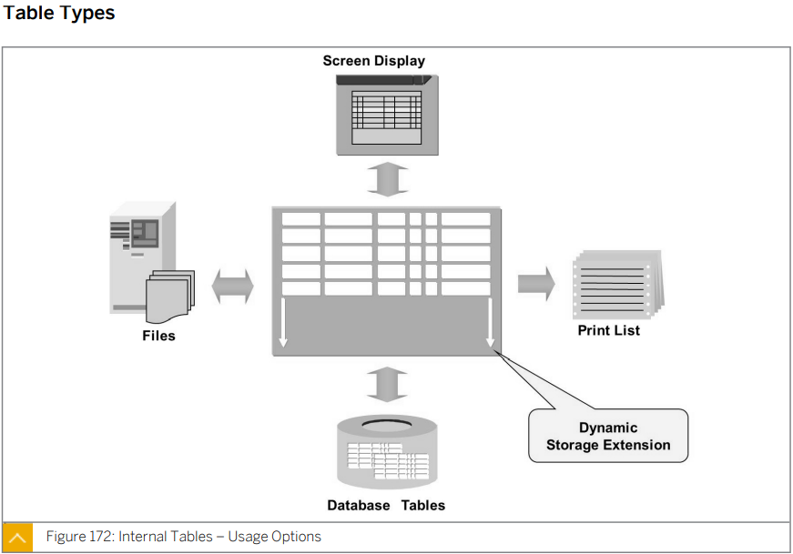

  ### Internal Tables의 일반적 용도

  * 나중에 처리할 수 있도록 데이터베이스 테이블 또는 순차 파일의 데이터 저장
  
  * 화면 또는 프린터 출력을 위해 데이터 준비 
  
    EX ) 정렬
  
  * 메소드, 함수 모듈 또는 서브 루틴 호출과 같은 다른 서비스의 사용을 위해 데이터 준비
  
  
  
  
  
  Database의  테이블을 internal table에 담을 수 있다.
  
  Database의 테이블과 달리 프로그램이 끝나면 없어지는 변수이다.


* # Properties of Internal Tables

  ​	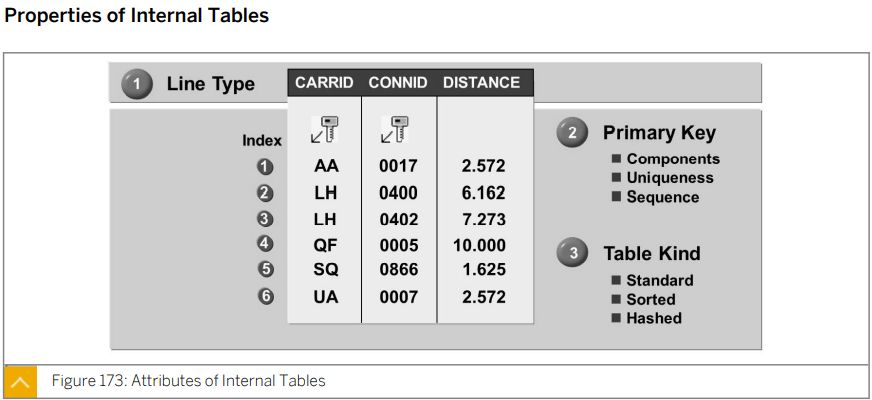

  * ### Line type

    * Internal Table의 모양이 결정된다.
    * 대개 해당 구조 유형을 지정하지만 데이터 유형에 따른 제한은 없다.

  * ### Primary key

    * Internal Table에 Key를 설정할 수 있다.
      * 중복된 데이터를 삽입 방지
      * 검색 속도의 증가

  * ### Table kind

    * #### Standard

      기본적으로 데이터르르 삽입한 순서대로 쌓임

    * #### Sorted

      데이터 삽입시 특정 정렬 조건에 맞춰 정렬되어 삽입

    * #### Hashed

      런타임 환경에서 해싱 절차를 사용하여 빠른 키 액세스를 위해 데이터 레코드가 관리되며, UNIQUE-KEY 가 필요하다.
      
      Internal Tables의 용량이 매우 크고 키만 사용해서 내부 테이블에 액세스 하려는 경우 사용한다.

    
    
    

* ## Attributes and Uses of Table Kinds

  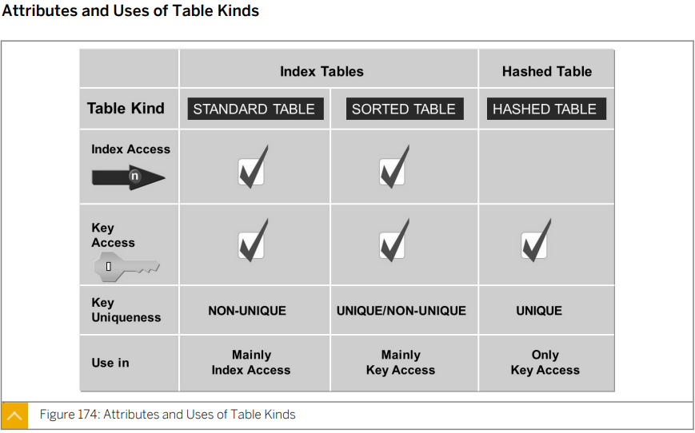

  * ### Index Access

    Read *<Internal Table>* INDEX *n*

  * ### Key Access

    READ *<Internal Table>* WITH *<Key name>* = <Key element>

  * ### Key Uniqueness

    * #### NON-UNIQUE

      중복 가능
    
    * #### UNIQUE
    
      중복 불가능


* ## Internal Table을 정의하는 방법

  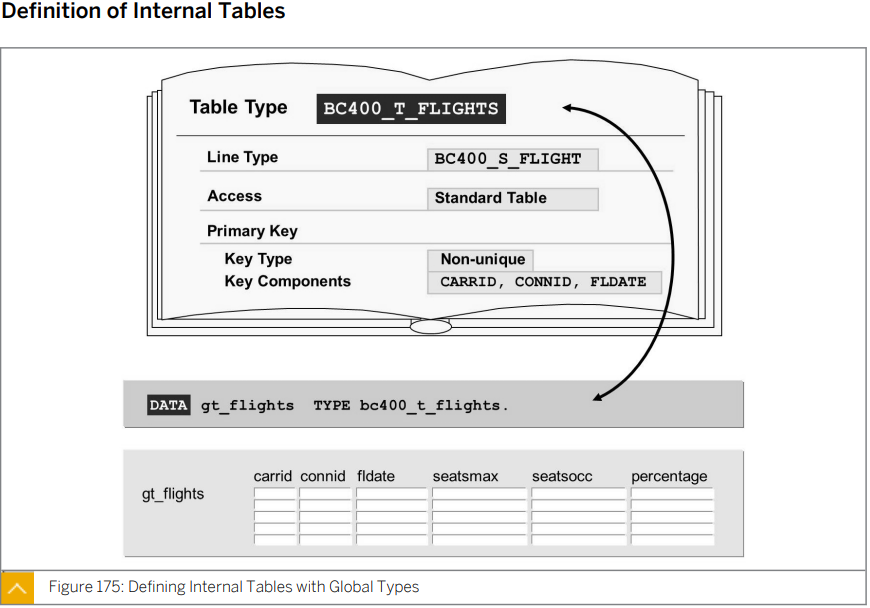

  ​	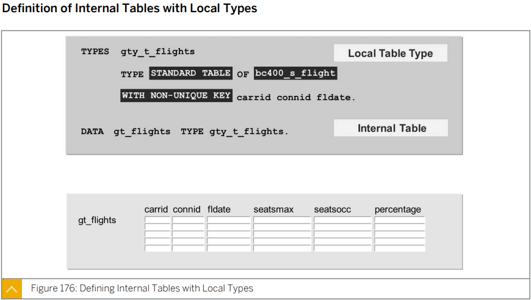

  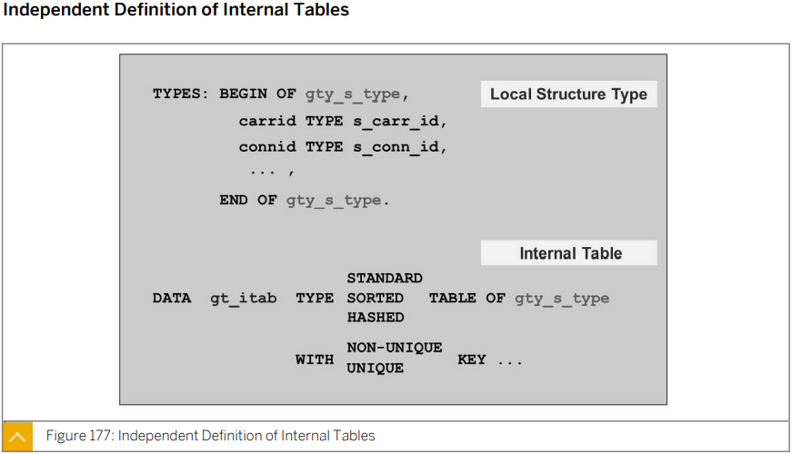

  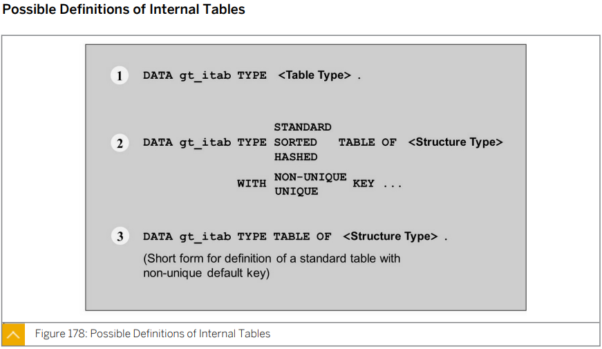

  ```ABAP
  *&---------------------------------------------------------------------*
  *& Report ZB23_00009
  *&---------------------------------------------------------------------*
  *&
  *&---------------------------------------------------------------------*
  REPORT zb23_00009.
  
  * XYZ은 STANDARD INTERNAL TABLE이며, 컬럼은 모두 6개이고, KEY는 3개(NON-UNIQUE)이다.
  DATA xyz TYPE bc400_t_flights.
  
  * 학번, 이름, 성별로 구성되어진 STANDARD INTERNAL TABLE을 정의하되, KEY(NON-UNIQUE)는 학번으로 구성함.
  * 1. LINE TYPE 결정. local
  TYPES: BEGIN OF ts_student,
           id       TYPE n LENGTH 8,
           name     TYPE c LENGTH 32,
           gender   TYPE c LENGTH 1,
           carrname TYPE scarr-carrname,
         END OF ts_student.
  
  * 2. INTERNAL TABLE 정의.
  DATA gt_student TYPE STANDARD TABLE OF ts_student
                  WITH NON-UNIQUE KEY id.
  
  * Structure 타입을 이용해 Internal Table 정의하는 방법.
  DATA gt_Flight TYPE STANDARD TABLE OF bc400_s_flight.
  
  * Structure 타입 변수를 이용해 Internal Table 정의하는 방법.
  DATA gt_student2 LIKE STANDARD TABLE OF gs_student.
  
  * Internal Table을 이용해 Structure Type의 변수를 정의하는 방법.
  DATA gs_flight LIKE LINE OF gt_flight.
  
  * Internal Table을 이용해 Internal Table 변수를 정의하는 법.
  DATA ttt LIKE gt_flight.
  
  
  TYPES: BEGIN OF ts_result.
           INCLUDE STRUCTURE scarr.
           TYPES ltext TYPE tcurt-ltext.
  TYPES: END OF ts_result.
  
  
  
  * 문제 1) ts_student를 이용하여 스트럭쳐 변수 (gs_student)를 선언하시오.
  DATA gs_student TYPE ts_student.
  
  * 문제 2) ts_student를 이용하여 인터널 테이블 (gt_stident)를 선언하시오. Standard,
  *        non-unique key (ID, GENDER)
  DATA gt_student TYPE STANDARD TABLE OF ts_student
                  WITH NON-UNIQUE KEY id gender.
  
  * 문제 3) 1번에서 정의한 Structure를 통해 인터널 테이블 (gt_student2)를 선언하시오
  *       (테이블 종류와 키는 본인 마음대로)
  DATA gt_student2 LIKE STANDARD TABLE OF gs_student.
  
  * 문제 4) 2번의 Internal table과 동일한 형태의 인터널 테이블 (gt_student3)를 선언하시오.
  DATA gt_student3 LIKE gt_student.
  ```


* ## Usage of Internal Tables

  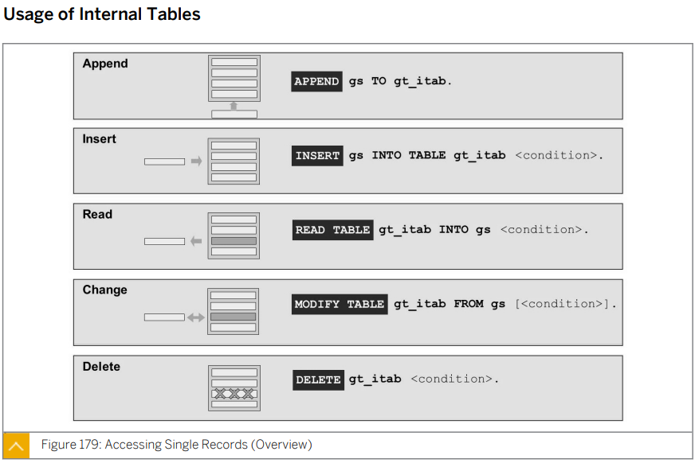

  * ### 
  
  | 구문       | ABAP                                     | 설명 | 예시 |
  | ---------- | ---------------------------------------- | ---- | ---- |
  | **Append** | ```ABAP APPEND gw_student TO gt_student. |      |      |
  |            |                                          |      |      |
  |            |                                          |      |      |
  |            |                                          |      |      |
  |            |                                          |      |      |

  

  * ### COLLECT 

    * 같은 키값을 찾아서 숫자를 더해준다
  
    * 키값이 없는 경우 삽입된다.
    * #### 키 필드 이외에는 모두 숫자여야 가능하다.


* ## Processing Sets of Records (Overview)

  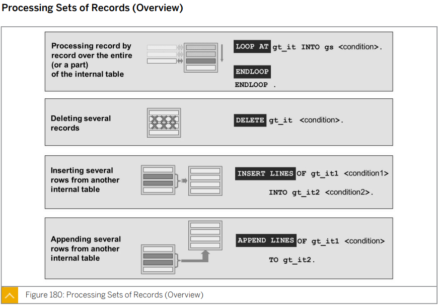

  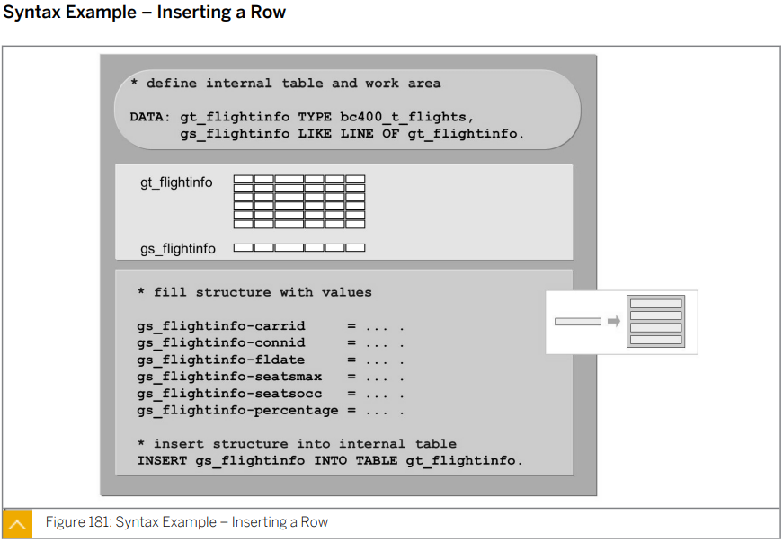

  
  
  
  
  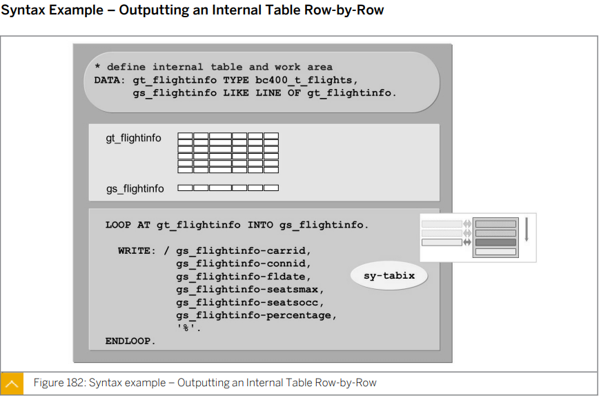
  
  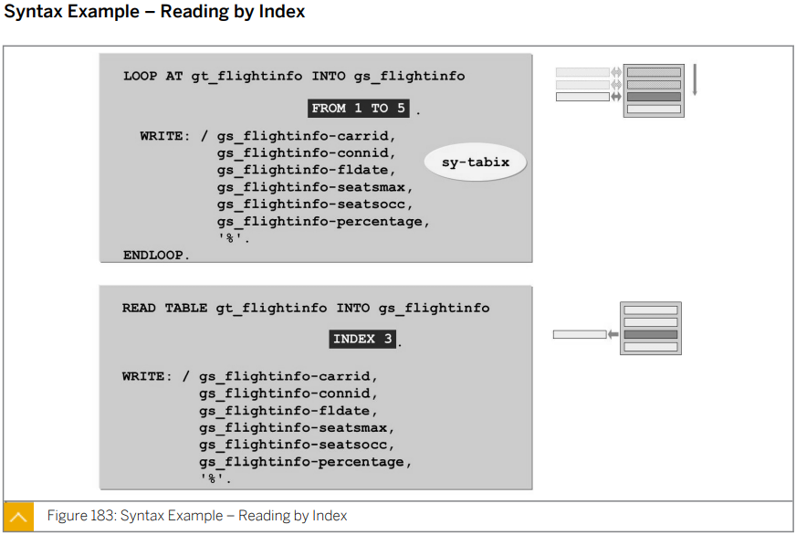
  
  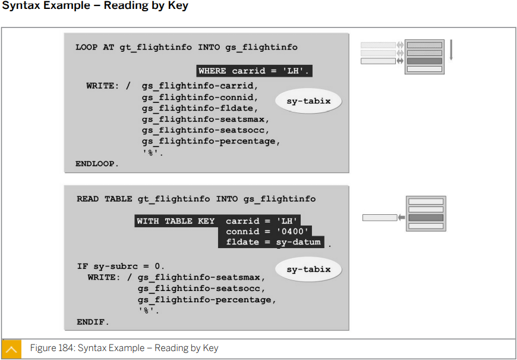
  
  * ### Loop문
  
    ```ABAP
    DO.
      sy-index.
    ENDDO.
    
    LOOP AT
      sy-tabix.
    ENDLOOP.
    
    SELECT ...
      sy-dbcnt
    endselect.
    ```
  
  * ### Loop 실습
  
    ```ABAP
    *&---------------------------------------------------------------------*
    *& Report ZB23_00009
    *&---------------------------------------------------------------------*
    *&
    *&---------------------------------------------------------------------*
    REPORT zb23_00011.
    
    TYPES: BEGIN OF ts_student,
             id       TYPE n LENGTH 8,
             name     TYPE c LENGTH 32,
             gender   TYPE c LENGTH 1,
             carrname TYPE scarr-carrname,
           END OF ts_student.
    
    DATA gt_student TYPE SORTED TABLE OF ts_student WITH NON-UNIQUE KEY id. "Internal Table
    DATA gw_student LIKE LINE  OF gt_student. "Work Area
    * Work Area를 채운후 Work Area를 Internal Table에 넣는다.
    
    
    * APPEND
    gw_student-id     = 4.
    gw_student-name   = '홍길동'.
    gw_student-gender = 'M'.
    APPEND gw_student TO gt_student.
    
    
    gw_student-id     = 2.
    gw_student-name   = '김미리'.
    gw_student-gender = 'F'.
    INSERT gw_student INTO TABLE gt_student.
    cl_demo_output=>display_data( gt_student ).
    
    
    CLEAR gw_student.        " 이전에 입력해 둔 내용을 삭제하고 다시 사용한다. (trash data를 지운다.)
    gw_student-id     = 3.
    gw_student-name   = '김철수'.
    INSERT gw_student INTO TABLE gt_student.
    cl_demo_output=>display_data( gt_student ).
    
    
    CLEAR gw_student.
    gw_student-id     = 0.
    gw_student-name   ='나영희'.
    gw_student-gender = 'F'.
    INSERT gw_student INTO TABLE gt_student.
    
    * 변경.
    * 3번 학생의 이름을 나변경으로 바꾸고 성별을 m으로 바꾸고 싶음.
    * 1) 3번을 읽고, 유효하면 변경한다.
    
    READ TABLE gt_student INTO gw_student WITH KEY id = 3.
    IF sy-subrc = 0.
      gw_student-name   = '나변경'.
      gw_student-gender = 'M'.
      MODIFY TABLE gt_student FROM gw_student.
    ENDIF.
    
    
    cl_demo_output=>display_data( gt_student ).
    
    * 루프문 추가
    * 루프문의 카운트와 모든 학생 이름을 출력
    LOOP AT gt_student INTO gw_student.
      WRITE: sy-tabix, gw_student-name.
    ENDLOOP.
    
    ULINE.
    
    LOOP AT gt_student INTO gw_student WHERE gender = 'M'.
      WRITE: sy-tabix, gw_student-name, gw_student-gender.
    ENDLOOP.
    
    
    LOOP AT gt_student INTO gw_student.
      gw_student-name = '나새롬'.
      MODIFY gt_student FROM gw_student INDEX sy-tabix.
    ENDLOOP.
    
    cl_demo_output=>display_data( gt_student ).	
    ```
  
    


* ## 실습 ZB23_QUIZ_04

  SELECTION SCREEN 에서 화폐단위를 입력 받아

  해당 화폐단위를 사용하는 항공사 정보를 모두 출력함

  (출력정보: 항공사 코드, 항공사 이름, 화폐단위, URL)

  사용함 함수 : GET_CARRIER_LIST

  #### ZB23_QUIZ_04

  ```ABAP
  *&---------------------------------------------------------------------*
  *& Report ZB23_QUIZ_04
  *&---------------------------------------------------------------------*
  *&
  *&---------------------------------------------------------------------*
  REPORT zb23_quiz_05.
  
  PARAMETERS pa_unit TYPE scarr-currcode.
  
  DATA: gt_carrier TYPE STANDARD TABLE OF scarr,
        gw_carrier LIKE LINE OF gt_carrier.
  
  CALL FUNCTION 'GET_CARRIER_LIST'
    IMPORTING
      t_list = gt_carrier.
  
  
  LOOP AT gt_carrier INTO gw_carrier WHERE currcode = pa_unit.
    WRITE: gw_carrier-carrid, gw_carrier-carrname, gw_carrier-currcode, gw_carrier-url.
  ENDLOOP.
  ```

  

* ## 실습 ZB23_QUIZ_05

  기존에 구현한 프로그램을 Copy 후 기능을 개선함\

  개선할 내용

  * 검색 조건에 입력하는 화폐단위를 제외한 항공사 리스트 출력.

  * 화폐단위 코드와 옆에 화폐단위에 대한 영어 텍스트도 함께 나오도록함

    (관련함수: DD_GET_CURRENCIES)

  * 출력 결과예시

    AA Americal Airline USD United States Dollars

    http://www.aa.com

  #### ZB23_QUIZ_05

  ```ABAP
  *&---------------------------------------------------------------------*
  *& Report ZB23_QUIZ_04
  *&---------------------------------------------------------------------*
  *&
  *&---------------------------------------------------------------------*
  REPORT zb23_quiz_05.
  
  PARAMETERS pa_unit TYPE scarr-currcode.
  
  DATA: gt_carrier TYPE STANDARD TABLE OF scarr,
        "gt_carrier TYPE ty_scarr,
        "gt_carrier TYPE table of ty_scarr, "얘는 안됨
  
        gw_carrier LIKE LINE OF gt_carrier,
        gt_rslt    TYPE STANDARD TABLE OF tcurt,
        gw_rslt    LIKE LINE OF gt_rslt.
  
  
  CALL FUNCTION 'GET_CARRIER_LIST'
    IMPORTING
      t_list = gt_carrier.
  
  
  CALL FUNCTION 'DD_GET_CURRENCIES'
    TABLES
      currencies = gt_rslt.
  
  
  IF gt_carrier IS NOT INITIAL.
    " 오름차순으로 정렬
    SORT gt_carrier BY currcode ASCENDING.
    LOOP AT gt_carrier INTO gw_carrier WHERE currcode <> pa_unit.
      READ TABLE gt_rslt INTO gw_rslt WITH KEY waers = gw_carrier-currcode.
      WRITE: gw_carrier-carrid, gw_carrier-carrname, gw_carrier-currcode, gw_rslt-ltext, gw_carrier-url.
    ENDLOOP.
  
  ELSE.
    WRITE:'no data'.
  ENDIF.
  
  
  
  *DELETE gt_carrier WHERE currcode = pa_unit.
  *IF gt_carrier IS NOT INITIAL.
  *
  *  LOOP AT gt_carrier INTO gw_carrier.
  *    READ TABLE gt_rslt INTO gw_rslt WITH KEY waers = gw_carrier-currcode.
  *    WRITE: gw_carrier-carrid, gw_carrier-carrname, gw_carrier-currcode, gw_rslt-ltext, gw_carrier-url.
  *  ENDLOOP.
  *
  *ELSE.
  *  WRITE:'no data'.
  *ENDIF.
  *대상이 되지 않는 로우들을 삭제하고 사용하는 것이 더 합리적이다!!!!
  ```
  
  ```ABAP
  DATA: xyz TYPE <스트럭쳐타입>.	STRUCTURE
  
  DATA: xyz TYPE <테이블 이름>.	STRUCTURE
  ```
  
  ### 좋은 코드는 아래 세 가지 부분으로 코드를 분리시켜 작성한다.
  
  * #### 데이터 취득 부
  
  * #### 데이터 가공 부
  
  * #### 데이터 출력 부
  
  ```ABAP
  *&---------------------------------------------------------------------*
  *& Report ZB23_QUIZ_04
  *&---------------------------------------------------------------------*
  *&
  *&---------------------------------------------------------------------*
  REPORT zb23_quiz_06.
  
  
  TYPES: BEGIN OF ts_result.
           INCLUDE STRUCTURE scarr.
  TYPES ltext TYPE tcurt-ltext.
  TYPES: END OF ts_result.
  
  DATA: gt_result TYPE STANDARD TABLE OF ts_result,
        gw_result LIKE LINE OF gt_result.
  
  DATA: gt_carrier TYPE STANDARD TABLE OF scarr,
        gw_carrier LIKE LINE OF gt_carrier.
  
  DATA: gt_currency TYPE STANDARD TABLE OF tcurt,
        gw_currency LIKE LINE OF gt_currency.
  
  PARAMETERS pa_unit TYPE scarr-currcode.
  
  
  
  
  
  "1) 데이터 취득부
  CALL FUNCTION 'GET_CARRIER_LIST'
    IMPORTING
      t_list = gt_carrier.
  
  
  CALL FUNCTION 'DD_GET_CURRENCIES'
    TABLES
      currencies = gt_currency.
  
  
  
  
  "2) 데이터 가공부.
  LOOP AT gt_carrier INTO gw_carrier.
    MOVE-CORRESPONDING gw_carrier TO gw_result.
    READ TABLE gt_currency INTO gw_currency WITH KEY waers = gw_carrier-currcode.
    IF sy-subrc = 0.
      gw_result-ltext = gw_currency-ltext.
    ENDIF.
    APPEND gw_result TO gt_result.
  ENDLOOP.
  
  
  
  "3) 데이터 출력부.
  LOOP AT gt_result INTO gw_result.
    WRITE:/ gw_result-carrid,   gw_result-carrname,
            gw_result-currcode, gw_result-ltext.
    WRITE:/ gw_result-url.
  ENDLOOP.
  *대상이 되지 않는 로우들을 삭제하고 사용하는 것이 더 합리적
  ```


## 


* ## Syntax Example - Sorting and Deleting Content

  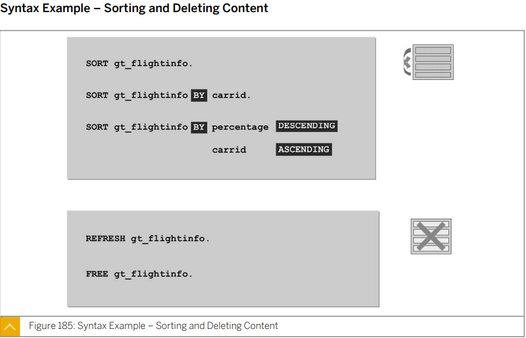

  #### SORT의 기준이 없을 시 키 값 순으로 정렬


* ## Internal Tables With Header Lines

  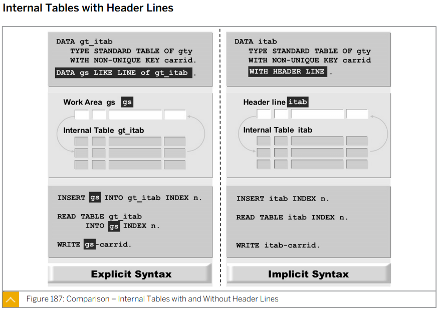

  ```ABAP
  *&---------------------------------------------------------------------*
  *& Report ZB23_00012
  *&---------------------------------------------------------------------*
  *&
  *&---------------------------------------------------------------------*
  REPORT zb23_00012.
  
  "인터널 테이블 정의와 동시에 자동으로 Work Area가 만들어짐.
  DATA gt_it TYPE TABLE OF scarr WITH HEADER LINE.
  
  "인터널 테이블에 KR / Korean Air 삽입.
  gt_it-carrid   = 'KR'.
  gt_it-carrname = 'Korean Air'.
  "Work Area
  
  "Work Area
  APPEND gt_it TO gt_it.
  "Internal Table
  
  APPEND gt_it. "Work Area와 Internal Table 이름이 같은 경우 to 생략 가능
  
  CLEAR gt_it.   "Work Area를 비운다.
  CLEAR gt_it[]. "Internal Table을 지운다.
  
  " 가독성이 떨어진다 좋지 않은 방법
  
  
  
  
  
  * 학번, 이름으로 구성된 스트럭쳐 변수 정의하고 싶음.
  * CASE 1) TYPE 정의하고 ----> 변수 정의.
  * CASE 2)
  DATA: BEGIN OF gs_info,
          id   TYPE n LENGTH 8,
          name TYPE c LENGTH 32,
        END OF gs_info.
  
  * CASE 2) --- OCCURS 문장에 의해 인터널 테이블이 된 WITH HEADER LINE
  DATA: BEGIN OF gs_info2 OCCURS 0,
          id   TYPE n LENGTH 8,
          name TYPE c LENGTH 32,
        END OF gs_info2.
  ```

  #### 가급적이면 사용하지 않는게 좋다.

  #### 좋지 않은 코드


* ## Excercise 24

  ```ABAP
  *&---------------------------------------------------------------------*
  *& Report ZBC400_B23_LOOP
  *&---------------------------------------------------------------------*
  *&
  *&---------------------------------------------------------------------*
  REPORT zbc400_b23_loop.
  
  DATA: gt_connections TYPE bc400_t_connections,
        gw_connection  LIKE LINE OF gt_connections.
  
  *PARAMETERS: pa_carr TYPE bc400_s_connection-carrid.
  
  
  "1) 데이터 취득부
  TRY.
      CALL METHOD cl_bc400_flightmodel=>get_connections
        EXPORTING
          iv_carrid      = space
          "iv_carrid      = pa_carr
        IMPORTING
          et_connections = gt_connections.
    CATCH cx_bc400_no_data.
      WRITE:/ 'No Data'.
  ENDTRY.
  
  
  
  "2) 데이터 가공부.
  SORT gt_connections BY deptime.
  
  
  
  "3) 데이터 출력부.
  LOOP AT gt_connections INTO gw_connection.
    WRITE:/ gw_connection-carrid,
          / gw_connection-connid,
          / gw_connection-cityfrom,
          / gw_connection-airpfrom,
          / gw_connection-cityto,
          / gw_connection-airpto,
          / gw_connection-fltime,
          / gw_connection-deptime,
          / gw_connection-arrtime.
    ULINE.
  ENDLOOP.
  ```

  


read table <인터널테이블> into <워크에어리어> with key....

=> 키와 상관 없이 사용 가능

read table


​	

```ABAP
* Local Structure Type 만들기
TYPES: BEGIN OF <로컬 타입 이름>,
         <컬럼1>     TYPE <타입>,
         <컬럼2>     TYPE <타입>,
       END OF <로컬 타입 이름>.
       
       
* Internal Table 정의 방법
* Structure 타입을 이용하여 Internal Table 변수를 정의
DATA <테이블 변수> TYPE STANDARD TABLE OF <Structure타입>.
                 WITH NON-UNIQUE KEY id.
* Structure 타입 **변수**를 이용하여 Internal Table 변수를 정의
DATA <테이블 변수> LIKE STANDARD TABLE OF <Structure>.
* Internal Table 변수를 이용해 Internal Table 변수를 정의
DATA <테이블 변수> LIKE <테이블 변수>.
* Transparent Table 을 이용해 Internal Table 변수를 정의
DATA <테이블 변수> TYPE STANDARD TABLE OF <Transparent Table>.
* Table Type 을 이용해 Internal Table 변수를 정의 
DATA <테이블 변수> TYPE <Table Type>.
	"ex) ZB23_QUIZ_05
    "gt_carrier TYPE ty_scarr,
    "gt_carrier TYPE table of ty_scarr, "얘는 안됨


* Structure 정의 하는 방법
* Structure Type을 이용해 Structure 변수 정의
DATA <Structure뱐수> TYPE <Structure타입>.
* Internal Table 변수를 이용해 Structure 변수를 정의
DATA <Structure변수> LIKE LINE OF <테이블 변수>.
* Transparent Table 을 이용해 Structure 변수를 정의
DATA <테이블 변수> TYPE <Transparent Table>.


```


* ### APPEND

  ```ABAP
  APPEND <Structure변수> TO <테이블변수>.
  ```

  * 무조건 맨 마지막 row에 추가한다.
  * sorted 테이블인 경우 오류가 발생할 수 있다.

* ### INSERT

  ```ABAP
  INSERT <Structure변수> INTO TABLE <테이블변수>.
  INSERT LINES OF <테이블변수> INTO TABLE <테이블변수>.
  ```

  * 기본값으로 마지막 row에 추가되며 sorted 테이블인경우 자기 자리를 찾아 추가된다.
  * 테이블 변수의 여러줄을 테이블 변수에 추가한다.
  * sorted 테이블인 경우에도 오류가 없다.

* ### READ

  ```ABAP
  READ TABLE <테이블변수> INTO <Structure변수>.
  READ TABLE <테이블변수> INTO <Structure변수> WITH KEY <COLUMN> = <탐색할 CULUMN.
  ```

  * Structure 변수에 테이블의 row를 복사한다.

* ### MODIFY

  ```ABAP
  MODIFY TABLE <테이블변수> FROM <Structure변수>.
  MODIFY <테이블변수> FROM <Structure변수> INDEX <변경하려는 ROW>.
  MODIFY <테이블변수> FROM <Structure변수> INDEX <변경하려는 ROW> TRANSPORTING <COLUMN>.
  
  
  
  
  
  TYPES: BEGIN OF ts_result.
           INCLUDE STRUCTURE scarr.
  TYPES ltext TYPE tcurt-ltext.
  TYPES: END OF ts_result.
  ```

  * 내부테이블 행을 Structure로 덮어쓴다.

* ### COLLECT 

  * 같은 키값을 찾아서 숫자를 더해준다

  * 키값이 없는 경우 삽입된다.

  * #### 키 필드 이외에는 모두 숫자여야 가능하다.


* ### Delete

  ```ABAP
  DELETE <테이블변수> where <조건식>.
  ```

  * 테이블의 내용을 지워준다.
  * 조건식은 생략가능하다.

* ### LOOP

  ```ABAP
  LOOP AT <테이블변수> INTO <Structure변수>
  	...
  ENDLOOP.
  
  LOOP AT <테이블변수> INTO <Structure변수> WHERE <COLUMN> = <찾고자 하는 값>
  	...
  ENDLOOP.
  
  LOOP TABLE <테이블변수> INTO <Structure변수> 
  			WITH TABLE KEY <COLUMN> = <찾고자 하는 값>
  				 		   <COLUMN> = <찾고자 하는 값>
  				 		   <COLUMN> = <찾고자 하는 값>
  	...
  ENDLOOP.
  ```

  * 테이블 행을 하나씩 Structure 변수에 복사하며 원하는 실행을 수행한다.

* ### MOVE-CORRESPONDING

  ```ABAP
  MOVE-CORRESPONDING <테이블 변수> TO <테이블 변수>
  ```

  * 뒤의 테이블 에 존재하는 행만 삽입된다.

* ### SORT

  ```ABAP
  SORT <테이블 변수>.
  SORT <테이블 변수> BY <COLUMN>.
  SORT <테이블 변수> BY <COLUMN>  DESCENDING. 	"내림차순
  SORT <테이블 변수> BY <COLUMN>  ASCENDING.	"오름차순
  ```

  * 기본값은 KEY 값으로 오름차순 정렬된다.

* ### REFRESH

  * 내부 테이블의 전체 내용을 삭제한다.
  * 나중에 삽입에 사용될 수 있도록 이전에 사용된 메모리의 일부가 유지된다.

* ### CLEAR

  * 대부분의 내부 테이블에 사용할 경우 REFRESH와 동일한 역할을 한다.
  * 헤더 라인이 있는 테이블의 경우 헤더라인만 초기화 된다.

* ### FREE

  * 내부 테이블의 전체내용을 삭제하고 이전에 사용된 메모리를 확보한다.
  * 이미 평가되어 더이상 프로그램의 후속 과정에 필요하지 않은 내부 테이블에 FREE문을 사용한다.
    * 이를 통해 더이상 필요 없는 메모리를 다시 사용할 수 있게 된다.

* ### cl_demo_output=>display_data( 테이블변수 ).

  * 테이블의 내용을 보여주는 창을 띄운다.


## 부록

​	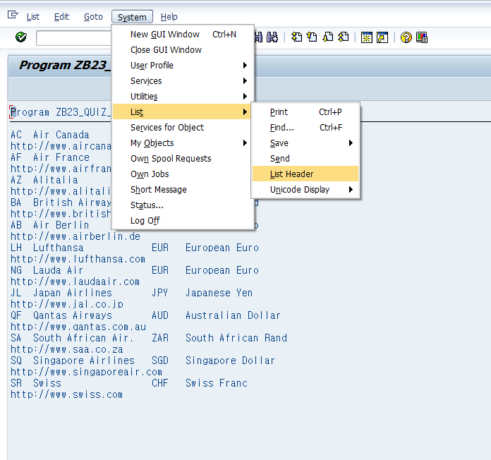

실행 화면에서 시스템을 통해 결과창 윗부분에 작성될 텍스트를 넣을 수 있다.app
