# Unit 12 Data Modeling and Data Retrieval


# Lesson 1. Explaining Data Models

* ## Data Models

  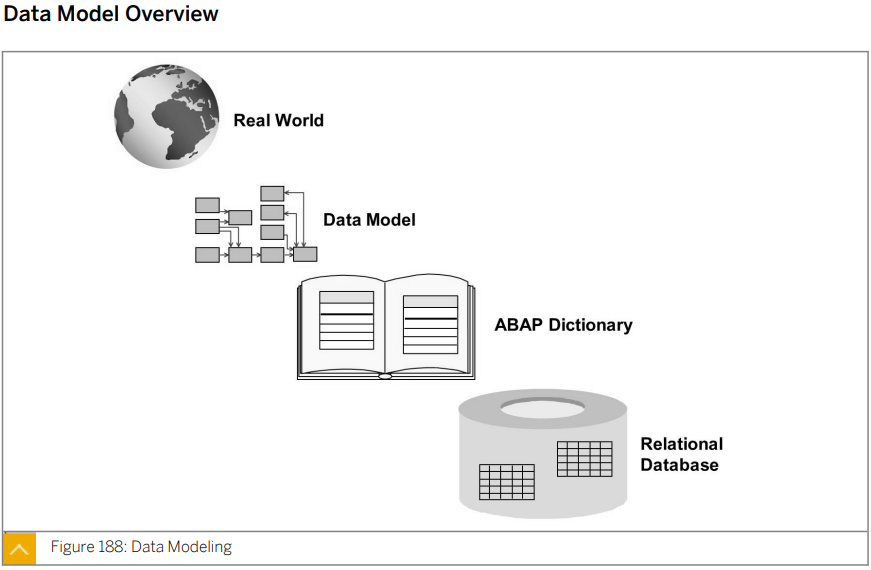

  

  

  

  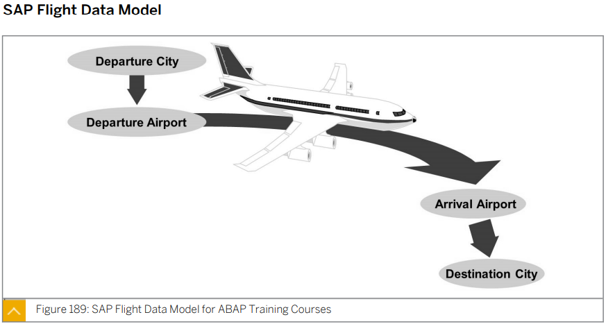

  

  

  

* ## Relational Data Model

  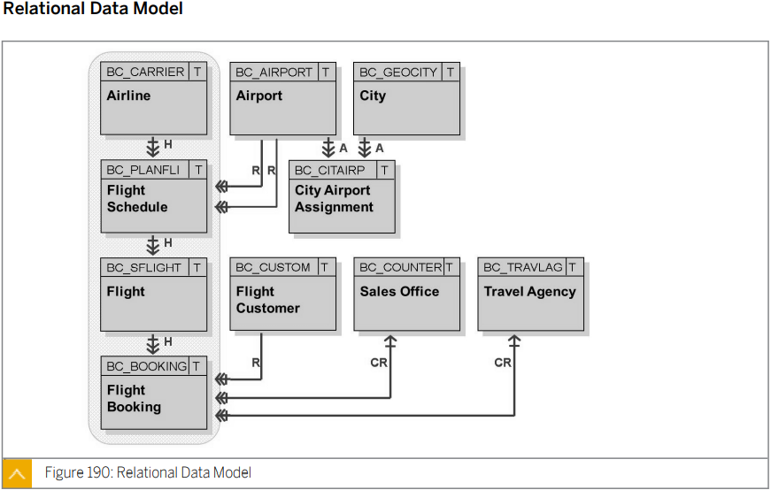

  ### BC_CARRIER

  ### BC_PLANFLI

  ### BC_SFLIGHT

  ### BC_BOOKING

  ### BC_CUSTOM

  * ## 문제

    * 독일 국적을 가진 고객의 국내선 총 예약 건수 프로그램 개발하고자 함.

      SBOOK (예약건수) + SPFLI (국제선, 국내선) + SCUSTOM (고객정보)

    * 2020 년 비행 스케줄 중 BUSINESS 고객 취소 건수가 가장 많은 항공사 TOP 3 (항공사 이름으로)

      SBOOK (예약건수) + SFLIGHT (연도별 비행 스캐줄) + SCUSTOM-CUSTTYPE (고객정보) + SCARR (항공사 이름)

  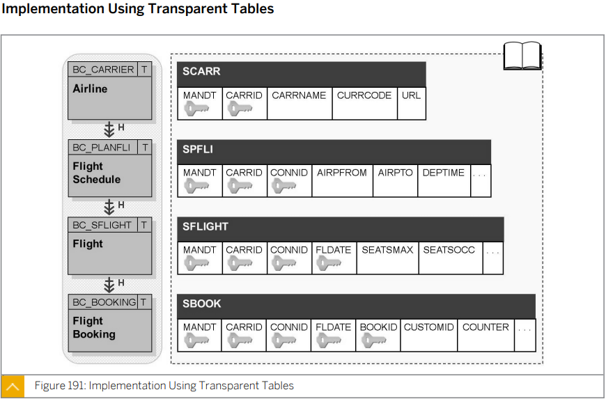

  #### 아래 버튼을 통해 erd를 확인할 수 있다.

  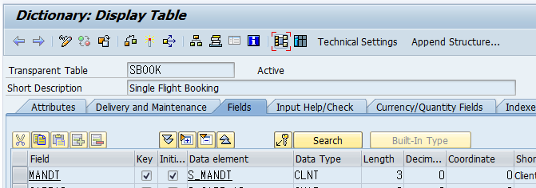

  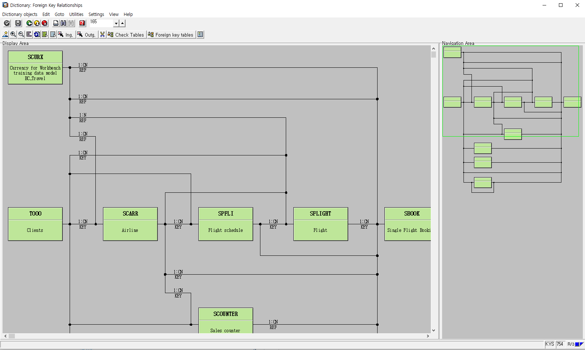


* ## Transparent Tables

  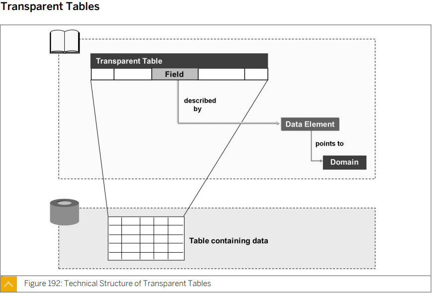

  Table은 Data Element를 Reference 하고 있으며 Data Element는 Domain을 Reference 하고 있다.

  투영하고 있다.

  Data Element는 Semantic

  Domain은 Technical


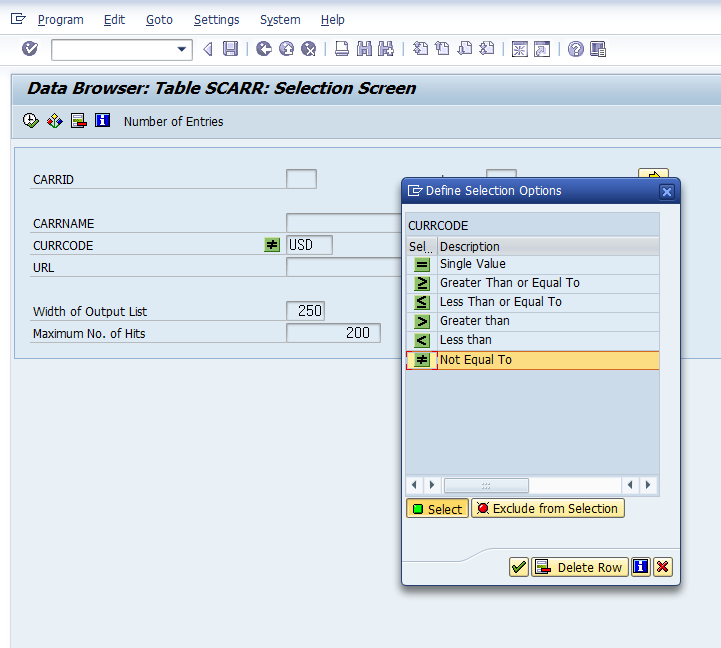

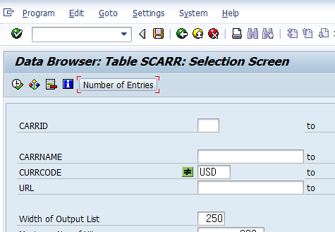

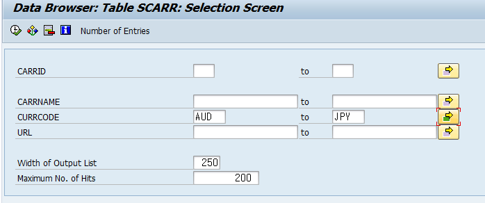

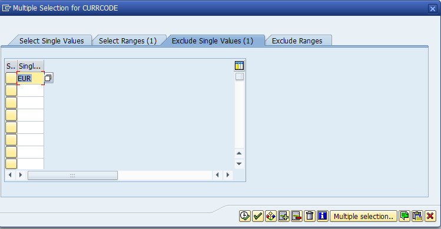

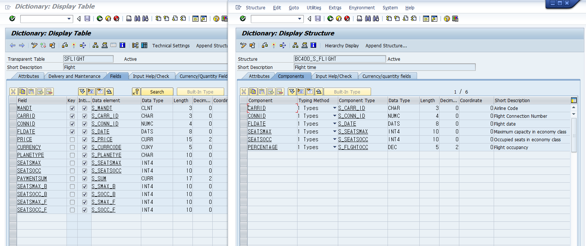


* ## Transparent Table as an ABAP Data Type

  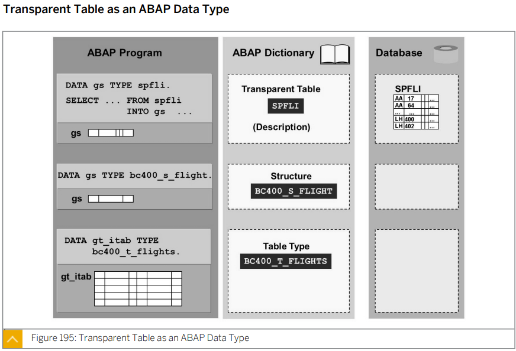

  Transparent Table 과 Type을 이용해 변수를 선언하면 Structure 이다.


****


# Lesson 2. Retrieving Single Database Records


CASE 1)

```ABAP
 SELECT ... WHERE <키를 모두 나열하면> ===> 1건

​ SELECT SINGLE * WHERE <키를 모두 나열하더라도...>
* 컴퓨터 입장에서 single이 없는 경우 한건인지 두건인지 알 수 없다. => table로 인식한다.

​ SELECT * INTO <스트럭쳐> WHERE <키를 몸두 나열하고>.

   ENDSELECT.
```


CASE 2)

SELECT SINGLE ... WHERE CURRCODE = 'USD'. ===> 비롯 6개지만 하나만 가져오겠다.


CASE 3)


* ## Data Retrieval with Structured Query Language

  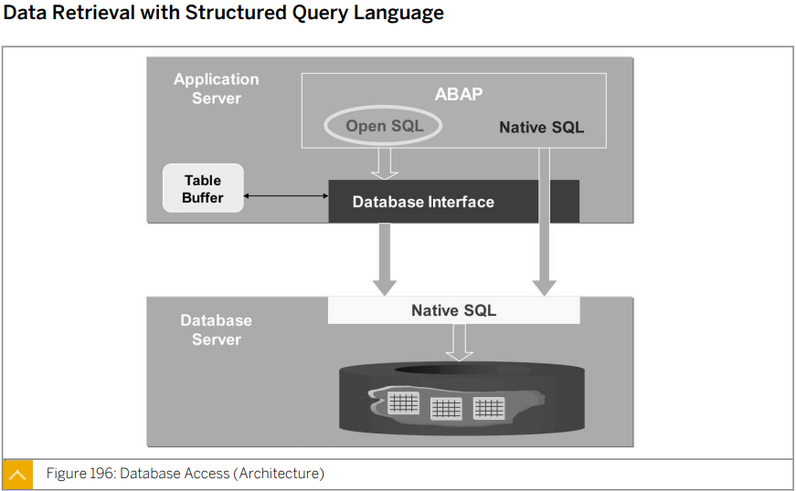

  Open SQL을 사용하면 Database Interface가 DB에 맞는 Native SQL로 변환해 준다.


* ## Reuse Components for Data Retrieval

  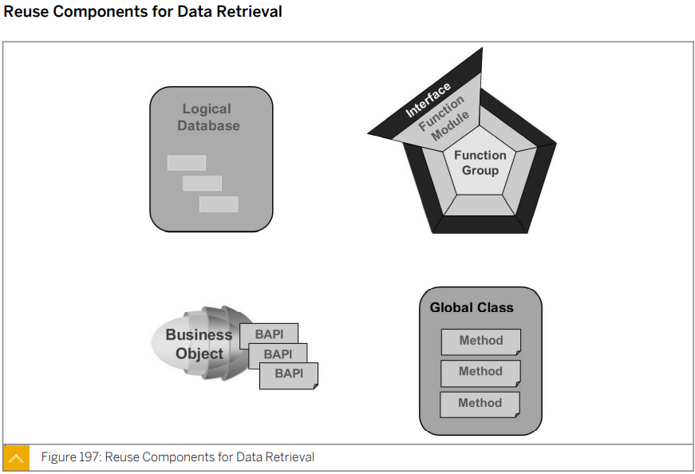

  logical data base는 이런게 있다 정도만

  데이터베이스를 다룰 때에는 함수 클래스 서브루틴을 이용하여 구현한다.

  절대 코드중간에 Select 구문 같은 것을 사용하지 않는다.

  ㅇ


* ## Database Read Acces (Overview)

  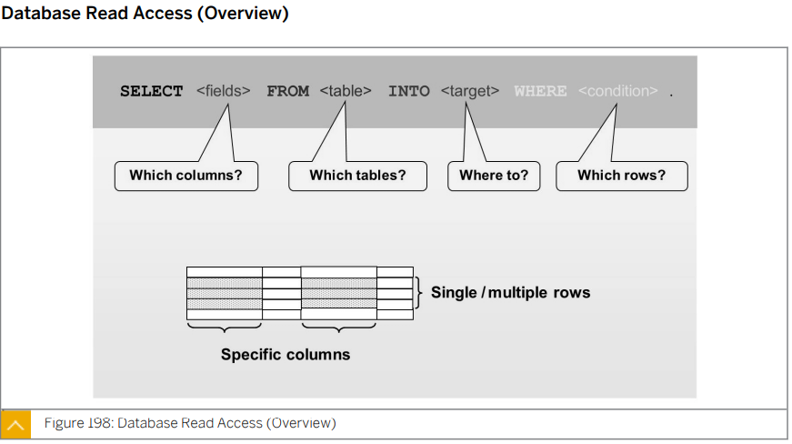

  INTO 구문은 FROM 앞에 들어가도 무방하다.

  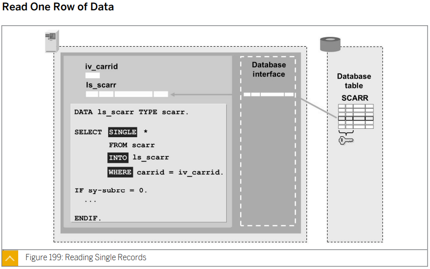

  * ### 실습

    ```ABAP
    *&---------------------------------------------------------------------*
    *& Report ZB23_00013
    *&---------------------------------------------------------------------*
    *&
    *&---------------------------------------------------------------------*
    REPORT zb23_00013.
    
    PARAMETERS p_car TYPE scarr-carrid.
    
    DATA gs_result TYPE scarr.
    
    * OPEN-SQL
    SELECT SINGLE *
      FROM scarr
      INTO gs_result
      WHERE carrid = p_car.
    
    IF sy-subrc = 0.
      WRITE:/ gs_result-carrid, gs_result-carrname.
    ELSE.
      WRITE:/ 'Not Found'.
    ENDIF.
    ```

    ```ABAP
    *&---------------------------------------------------------------------*
    *& Report ZB23_00013
    *&---------------------------------------------------------------------*
    *&
    *&---------------------------------------------------------------------*
    REPORT zb23_00013.
    
    PARAMETERS p_cur TYPE scarr-currcode.
    
    DATA gs_result TYPE scarr.
    
    * OPEN-SQL
    SELECT SINGLE *
      FROM scarr
      INTO gs_result
      WHERE currcode = p_cur.
    
    IF sy-subrc = 0.
      WRITE:/ gs_result-carrid, gs_result-carrname.
    ELSE.
      WRITE:/ 'Not Found'.
    ENDIF.
    ```

  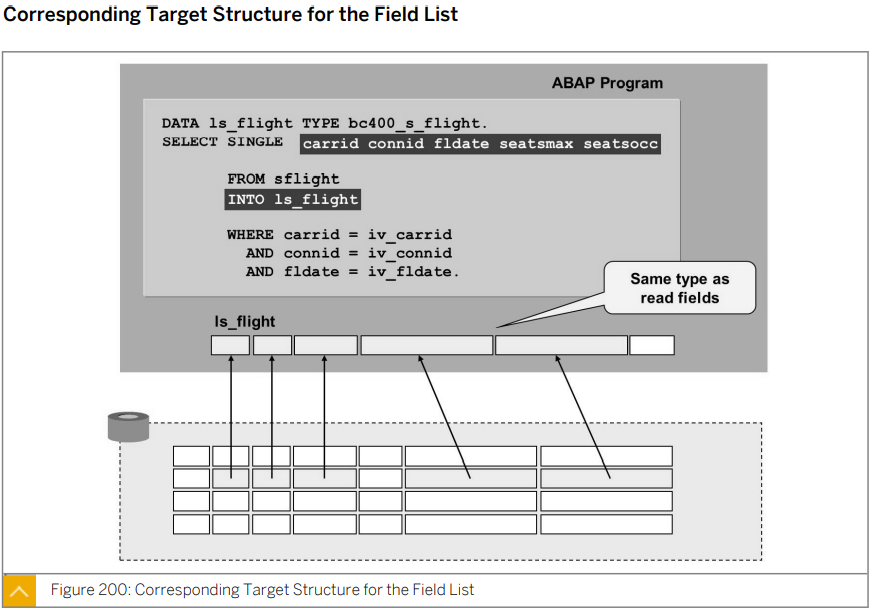

  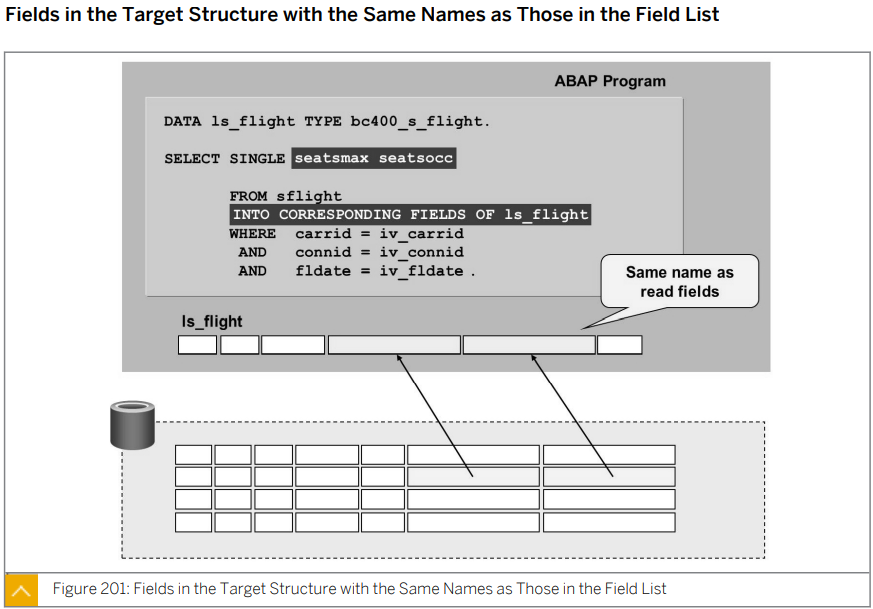

  * ## 실습

    gs_result 를 data 문법을 이용해서 항공사 코드와 항공사 이름만 가지는 구조체로 정의하시오.

    ```ABAP
    *&---------------------------------------------------------------------*
    *& Report ZB23_00013
    *&---------------------------------------------------------------------*
    *&
    *&---------------------------------------------------------------------*
    REPORT zb23_00013.
    
    PARAMETERS p_car TYPE scarr-carrid.
    
    *423
    *DATA gs_result TYPE scarr.
    DATA: BEGIN OF gs_result,					"중요!!!
            carrid   TYPE scarr-carrid,
            carrname TYPE scarr-carrname,
          END OF gs_result.
    
    * 방법 1 받아올 column들을 전부 나열
    SELECT SINGLE carrid carrname 				"중요!!!
      FROM scarr
      INTO gs_result
      WHERE carrid = p_car.
    
    
    * 방법 2 데이터를 모두 받은 후 INTO CORRESPONDING FIELDS OF 를 이용해 맞는 컬럼에 대입 
    SELECT SINGLE * 
      FROM scarr
      INTO CORRESPONDING FIELDS OF gs_result
      WHERE carrid = p_car.
    
    IF sy-subrc = 0.
      WRITE:/ gs_result-carrid, gs_result-carrname.
    ELSE.
      WRITE:/ 'Not Found'.
    ENDIF.
    ```

  * ### 실습 zb23_quiz_07

    화면에서 고객 ID를 입력 받도록 설계하시오

    TYPES를 이용해 id name telephone을 컬럼으로 갖는 스트럭쳐 타입을 만들어

    data를 저장후 출력

    ```ABAP
    *&---------------------------------------------------------------------*
    *& Report ZB23_QUIZ_07
    *&---------------------------------------------------------------------*
    *&
    *&---------------------------------------------------------------------*
    REPORT zb23_quiz_07.
    
    PARAMETERS pa_id TYPE scustom-id.
    
    DATA: BEGIN OF gs_rslt,
            id        TYPE scustom-id,
            name      TYPE scustom-name,
            telephone TYPE scustom-telephone,
          END OF gs_rslt.
    
    SELECT single *
      from scustom
      into CORRESPONDING FIELDS OF gs_rslt
      where id = pa_id.
    
    write:/ gs_rslt-id,
          / gs_rslt-name,
          / gs_rslt-telephone.
    ```

  * ### 실습 zb23_quiz_08

    ```ABAP
    *&---------------------------------------------------------------------*
    *& Report ZB23_QUIZ_07
    *&---------------------------------------------------------------------*
    *&
    *&---------------------------------------------------------------------*
    REPORT zb23_quiz_08.
    
    TYPES: BEGIN OF ts_rslt,
             id        TYPE scustom-id,
             name      TYPE scustom-name,
             telephone TYPE scustom-telephone,
           END OF ts_rslt.
    
    DATA: gs_rslt1 TYPE ts_rslt,
          gs_rslt2 TYPE ts_rslt.
    
    PARAMETERS: pa_id1 TYPE scustom-id,
                pa_id2 TYPE scustom-id.
    
    
    * 1) 데이터 취득부
    PERFORM find USING pa_id1
                 CHANGING gs_rslt1.
    PERFORM find USING pa_id2
                 CHANGING gs_rslt2.
    
    
    * 2) 데이터 가공부
    * 해당 사항 없음
    
    
    * 3) 데이터 출력부
    PERFORM print USING gs_rslt1.
    PERFORM print USING gs_rslt2.
    
    
    
    
    
    *&---------------------------------------------------------------------*
    *& Form find
    *&---------------------------------------------------------------------*
    *& text
    *&---------------------------------------------------------------------*
    *&      --> PA_ID1
    *&      <-- GS_RSLT1
    *&---------------------------------------------------------------------*
    FORM find  USING    p_id   TYPE scustom-id
               CHANGING p_rslt TYPE ts_rslt.
    
      SELECT SINGLE *
        FROM scustom
        INTO CORRESPONDING FIELDS OF p_rslt
        WHERE id = p_id.
    
    ENDFORM.
    
    *&---------------------------------------------------------------------*
    *& Form print
    *&---------------------------------------------------------------------*
    *& text
    *&---------------------------------------------------------------------*
    *&      --> GS_RSLT1
    *&---------------------------------------------------------------------*
    FORM print  USING    p_rslt TYPE ts_rslt.
      IF p_rslt IS NOT INITIAL.
        WRITE:/ p_rslt-id,
                p_rslt-name,
                p_rslt-telephone.
      ELSE.
        WRITE:/ 'not found'.
      ENDIF.
    
    ENDFORM.
    ```

    


* ## Excercise 26

  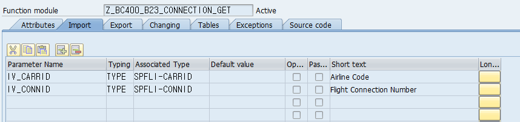

  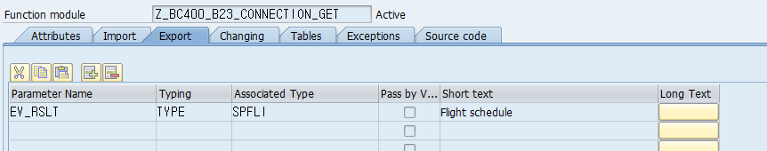

  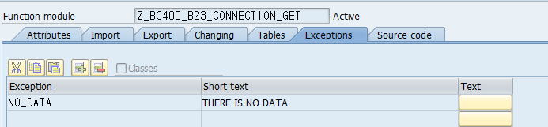

  #### z_bc400_b23_connection_get.

  ```ABAP
  FUNCTION z_bc400_b23_connection_get.
  *"----------------------------------------------------------------------
  *"*"Local Interface:
  *"  IMPORTING
  *"     REFERENCE(IV_CARRID) TYPE  SPFLI-CARRID
  *"     REFERENCE(IV_CONNID) TYPE  SPFLI-CONNID
  *"  EXPORTING
  *"     REFERENCE(EV_RSLT) TYPE  SPFLI
  *"  EXCEPTIONS
  *"      NO_DATA
  *"----------------------------------------------------------------------
  
    SELECT SINGLE *
      FROM spfli
      INTO ev_rslt
      WHERE carrid = iv_carrid AND connid = iv_connid.
  
    IF sy-subrc <> 0.
      RAISE no_data.
    ENDIF.
  
  ENDFUNCTION.
  ```

  #### ZB23_QUIZ_00

  ```ABAP
  *&---------------------------------------------------------------------*
  *& Report ZB23_QUIZ_00
  *&---------------------------------------------------------------------*
  *&
  *&---------------------------------------------------------------------*
  REPORT zb23_quiz_00.
  
  PARAMETERS: pa_carid TYPE spfli-carrid,
              pa_conid TYPE spfli-connid.
  
  DATA gs_rslt TYPE spfli.
  
  
  
  CALL FUNCTION 'Z_BC400_B23_CONNECTION_GET'
    EXPORTING
      iv_carrid = pa_carid
      iv_connid = pa_conid
    IMPORTING
      ev_rslt   = gs_rslt
    EXCEPTIONS
      no_data   = 1
      OTHERS    = 2.
  CASE sy-subrc.
    WHEN 1.
      WRITE /'no data'.
    WHEN 2.
      WRITE /'unknown error'.
    WHEN 0.
      WRITE:/ gs_rslt-carrid, gs_rslt-connid.
  * Implement suitable error handling here
  ENDCASE.
  ```

  


# Lesson 3. Retrieving Multiple Database Records

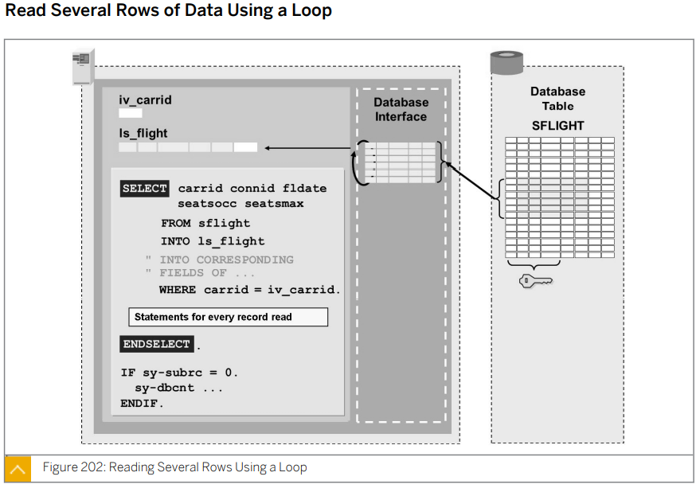

* ## Select Loop and Array Fetch

  ### Select Loop => Structure에 담으면서 루프

  * #### 실습

    ```ABAP
    *&---------------------------------------------------------------------*
    *& Report ZB23_00014
    *&---------------------------------------------------------------------*
    *&
    *&---------------------------------------------------------------------*
    REPORT zb23_00014.
    
    TYPES: BEGIN OF ts_rslt,
             id        TYPE scustom-id,
             name      TYPE scustom-name,
             telephone TYPE scustom-telephone,
           END OF ts_rslt.
    
    DATA gs_result TYPE ts_rslt.
    
    PARAMETERS p_nat TYPE scustom-country.
    
    SELECT * INTO CORRESPONDING FIELDS OF gs_result
      FROM scustom
      WHERE country = p_nat.
        WRITE:/ sy-dbcnt, gs_result-id, gs_result-name, gs_result-telephone.
    ENDSELECT.
    ```

    ```ABAP
    *&---------------------------------------------------------------------*
    *& Report ZB23_00014
    *&---------------------------------------------------------------------*
    *&
    *&---------------------------------------------------------------------*
    REPORT zb23_00014.
    
    TYPES: BEGIN OF ts_rslt,
             id        TYPE scustom-id,
             name      TYPE scustom-name,
             telephone TYPE scustom-telephone,
           END OF ts_rslt.
    
    DATA gs_result TYPE ts_rslt.
    
    PARAMETERS: p_nat  TYPE scustom-country,
                p_type TYPE scustom-custtype.
    
    
    SELECT * INTO CORRESPONDING FIELDS OF gs_result
      FROM scustom
      WHERE country = p_nat AND custtype = p_type.
        WRITE:/ sy-dbcnt, gs_result-id, gs_result-name, gs_result-telephone.
    ENDSELECT.
    ```

  

  ### Array Fech ==> internal table 에 담는것

  * #### 실습

    ```ABAP
    *&---------------------------------------------------------------------*
    *& Report ZB23_00014
    *&---------------------------------------------------------------------*
    *&
    *&---------------------------------------------------------------------*
    REPORT zb23_00015.
    
    TYPES: BEGIN OF ts_rslt,
             id        TYPE scustom-id,
             name      TYPE scustom-name,
             telephone TYPE scustom-telephone,
           END OF ts_rslt.
    
    DATA gs_result TYPE ts_rslt.
    DATA gt_result LIKE TABLE OF gs_result.
    
    
    
    PARAMETERS: p_nat  TYPE scustom-country,
                p_type TYPE scustom-custtype.
    
    * Array Fetch
    SELECT *
      INTO CORRESPONDING FIELDS OF TABLE gt_result
      FROM scustom
      WHERE country = p_nat
        AND custtype = p_type.
    
    IF sy-subrc = 0.
      LOOP AT gt_result INTO gs_result.
        WRITE:/ gs_result-id, gs_result-name, gs_result-telephone.
      ENDLOOP.
    ELSE.
      WRITE:/'not found'.
    ENDIF.
    ```

    


* ## Exercise 27

  

* ## Exercise 28

  ##  


# Lesson 4. Describing Other Aspects of Database Access


# Lesson 5. Implementing Authorization Checks 

