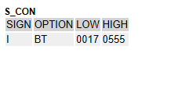

# UNIT 13 Classic ABAP Reports


# Lesson 1. Implementing ABAP List


# Lesson 2. Implementing Selection Screens


Selection Screen은 항상 Screen Number 가 1000번이다.


* ## Selection Screen Attributes

  

  

  

  

  

  

* ## Selection Options

  

  

  

  

  

* ## Variant Attributes

  

  

  

  

  

  

  

* ## Segmantic Informationof Global Types on the Selection Screen

  

  아래경우가 더 바람직하다

  

  

  

  

* ## Selection Texts

  

  

  

  

  * ### 다국어처리

    * #### Text Symbol

    * #### Data Element

  


* ## Single-Value Input

  

  

  

  

  


* ## Complex Selection (SELECT-OPTIONS)

  

  무조건 column 4개 짜리의 With Header Line 을 가진 Internal Table이 만들어진다.

  ### SIGN

  ### OPTION

  ### LOW

  ### HIGH

  

  * ### 실습

    ```ABAP
    *&---------------------------------------------------------------------*
    *& Report ZB23_00017
    *&---------------------------------------------------------------------*
    *&
    *&---------------------------------------------------------------------*
    REPORT zb23_00017.
    
    TYPES: BEGIN OF ts_rslt,
             carrid    TYPE spfli-carrid,
             carrname  TYPE scarr-carrname,
             connid    TYPE spfli-connid,
             countryfr TYPE spfli-countryfr,
             countryto TYPE spfli-countryto,
             flight    TYPE c LENGTH 1,
           END OF ts_rslt.
    
    DATA: gt_rslt TYPE TABLE OF ts_rslt,
          gw_rslt LIKE LINE  OF gt_rslt.
    
    PARAMETERS     p_car TYPE scarr-carrid.
    SELECT-OPTIONS s_con FOR  gw_rslt-connid.
    
    
    
    cl_demo_output=>display_data( s_con ).
    ```

    

    

    ```ABAP
    *&---------------------------------------------------------------------*
    *& Report ZB23_00017
    *&---------------------------------------------------------------------*
    *&
    *&---------------------------------------------------------------------*
    REPORT zb23_00017.
    
    TYPES: BEGIN OF ts_rslt,
             carrid    TYPE spfli-carrid,
             carrname  TYPE scarr-carrname,
             connid    TYPE spfli-connid,
             countryfr TYPE spfli-countryfr,
             countryto TYPE spfli-countryto,
             flight    TYPE c LENGTH 1,
           END OF ts_rslt.
    
    DATA: gt_rslt TYPE TABLE OF ts_rslt,
          gw_rslt LIKE LINE  OF gt_rslt.
    
    PARAMETERS     p_car TYPE scarr-carrid.
    SELECT-OPTIONS s_con FOR  gw_rslt-connid.
    
    
    SELECT s~carrid c~carrname s~connid s~countryfr s~countryto
      INTO TABLE gt_rslt
      FROM spfli AS s INNER JOIN scarr AS c
        ON s~carrid  = c~carrid
     WHERE s~carrid  = p_car
       AND s~connid IN s_con.
    
    
    cl_demo_output=>display_data( gt_rslt ).
    cl_demo_output=>display_data( s_con ).
    ```

    #### 퀴즈1)

    AA 0017만 조회하기

    

    

    #### 퀴즈2)

    AA 0017 ~ 0064 포함하며, 단, 0025 제외하고 조회하기

    

    

    

    

    #### 퀴즈3)

    AA의 모든 항공편 조회하기

    

    

    P_CAR 을 공백으로 넣으면 P_CAR이 공백인 로우를 탐색하여 아무 결과도 안나오게 된다.

    #### P_CAR 을 공백으로 넣으면  전부 탐색하도록 수정

    ```ABAP
    *&---------------------------------------------------------------------*
    *& Report ZB23_00017
    *&---------------------------------------------------------------------*
    *&
    *&---------------------------------------------------------------------*
    REPORT zb23_00017.
    
    TYPES: BEGIN OF ts_rslt,
             carrid    TYPE spfli-carrid,
             carrname  TYPE scarr-carrname,
             connid    TYPE spfli-connid,
             countryfr TYPE spfli-countryfr,
             countryto TYPE spfli-countryto,
             flight    TYPE c LENGTH 1,
           END OF ts_rslt.
    
    DATA: gt_rslt TYPE TABLE OF ts_rslt,
          gw_rslt LIKE LINE  OF gt_rslt.
    
    PARAMETERS     p_car TYPE scarr-carrid.
    SELECT-OPTIONS s_con FOR  gw_rslt-connid.
    
    IF p_car IS NOT INITIAL.
    
      SELECT s~carrid c~carrname s~connid s~countryfr s~countryto
        INTO TABLE gt_rslt
        FROM spfli AS s INNER JOIN scarr AS c
          ON s~carrid  = c~carrid
       WHERE s~carrid  = p_car
         AND s~connid IN s_con.
    
    ELSE.
    
      SELECT s~carrid c~carrname s~connid s~countryfr s~countryto
        INTO TABLE gt_rslt
        FROM spfli AS s INNER JOIN scarr AS c
          ON s~carrid  = c~carrid
       WHERE s~connid IN s_con.
    
    ENDIF.
    
    cl_demo_output=>display_data( gt_rslt ).
    cl_demo_output=>display_data( s_con ).
    ```

    

    

    

* ## Exercise 30

  ```ABAP
  *&---------------------------------------------------------------------*
  *& Report ZBC400_B23_REP_A
  *&---------------------------------------------------------------------*
  *&
  *&---------------------------------------------------------------------*
  REPORT zbc400_b23_rep_a.
  
  TYPE-POOLS: icon,
              col.
  
  CONSTANTS: gc_limit_red    TYPE s_flghtocc VALUE 98,
             gc_limit_yellow TYPE s_flghtocc VALUE 75.
  
  DATA: gt_flights TYPE bc400_t_flights,
        gs_flight  TYPE bc400_s_flight.
  
  PARAMETERS: pa_car TYPE bc400_s_flight-carrid.
  
  SELECT-OPTIONS so_con FOR  gs_flight-connid.
  
  
  TRY.
      CALL METHOD cl_bc400_flightmodel=>get_flights_range
        EXPORTING
          iv_carrid  = pa_car
          it_connid  = so_con[]
        IMPORTING
          et_flights = gt_flights.
    CATCH cx_bc400_no_data.
      write / 'No Data'(non).
    CATCH cx_bc400_no_auth.
  ENDTRY.
  
  cl_demo_output=>display_data( gt_flights ).
  
  LOOP AT gt_flights INTO gs_flight.
    NEW-LINE.
    IF gs_flight-percentage >= gc_limit_red.
      WRITE icon_red_light AS ICON.
    ELSEIF gs_flight-percentage >= gc_limit_yellow.
      WRITE icon_yellow_light AS ICON.
    ELSE.
      WRITE icon_green_light AS ICON.
    ENDIF.
    WRITE: gs_flight-carrid COLOR COL_KEY,
           gs_flight-connid COLOR COL_KEY,
           gs_flight-fldate COLOR COL_KEY,
           gs_flight-seatsmax,
           gs_flight-seatsocc,
           gs_flight-percentage.
  ENDLOOP.
  ```

  


# Lesson 3. Implementing Events of ABAP Reports


프로그램이 시작되고 특정 시점이 되면 자동으로 events 실행

### Report Event Block

* #### INITIALIZATION

  // 1000번 화면 초기화 및 변수 초기화

  #### EX )

  ```ABAP
  INITIALIZATION.
    IF sy-uname = 'CL-B-23'.
      p_car = 'AA'.
    ELSE.
      p_car = 'UA'.
    ENDIF.
  ```

  ```ABAP
  INITIALIZATION.
    PERFORM init_1000.
  
  
  
  
  
  *&---------------------------------------------------------------------*
  *& Form INIT_1000
  *&---------------------------------------------------------------------*
  *& text
  *&---------------------------------------------------------------------*
  *& -->  p1        text
  *& <--  p2        text
  *&---------------------------------------------------------------------*
  FORM init_1000 .
    IF sy-uname = 'CL-B-23'.
      p_car = 'AA'.
    ELSE.
      p_car = 'UA'.
    ENDIF.
  ENDFORM.
  ```

  ##### 보통 서브루틴으로 구현한다.

* #### AT SELECTION-SCREEN

  // 1000번 화면에서 사용자가 입력한 값에 대한 체크 로직

  ```ABAP
  AT SELECTION-SCREEN.
    PERFORM CHECK_CARRID USING P_CAR.
  
  
  *&---------------------------------------------------------------------*
  *& Form CHECK_CARRID
  *&---------------------------------------------------------------------*
  *& text
  *&---------------------------------------------------------------------*
  *&      --> P_CAR
  *&---------------------------------------------------------------------*
  FORM check_carrid  USING    p_car TYPE SCARR-CARRID.
    IF P_CAR = 'JL'.
      MESSAGE E000(ZB23_FLIGHT).
    ENDIF.
  ENDFORM.
  ```

  ##### 하드 코딩은 좋지 않다.

  ```ABAP
  AT SELECTION-SCREEN.
    PERFORM check_carrid USING p_car.
  
  
  *&---------------------------------------------------------------------*
  *& Form CHECK_CARRID
  *&---------------------------------------------------------------------*
  *& text
  *&---------------------------------------------------------------------*
  *&      --> P_CAR
  *&---------------------------------------------------------------------*
  FORM check_carrid  USING    p_car TYPE scarr-carrid.
    TRY.
        CALL METHOD cl_bc400_flightmodel=>check_authority
          EXPORTING
            iv_carrid   = p_car
            iv_activity = '03'.
      CATCH cx_bc400_no_auth.
        MESSAGE e000(zb23_flight) WITH p_car.
    endtry.
  ENDFORM.
  ```

  

  * MESSAGE TYPE의 종류

    E : ERROR 메시지를  스테이터스바에 출력한다. 1000번 화면을 못 떠나게 할때 

    W : 성공 메시지를  스테이터스바에 출력한다.

    I : 팝업

* #### START-OF-SELECTION

  // 데이터 취득 + 출력

  ```ABAP
  START-OF-SELECTION.
    PERFORM get_data USING p_car s_con[]                    
    " p_car 은 타입이 존재 한다. s_con은 타입이 존재하지 않으므로 만들어준다. ***
                     CHANGING gt_rslt.                          
                     " LOCAL STRUCTURE 타입으로 정의하여 타입이 없다. 타입을 만들어 준다. **
                     
                     
                     
                     
  *&---------------------------------------------------------------------*
  *& Form get_data
  *&---------------------------------------------------------------------*
  *& text
  *&---------------------------------------------------------------------*
  *&      --> P_CAR
  *&      --> S_CON
  *&      <-- GT_RSLT
  *&---------------------------------------------------------------------*
  FORM get_data  USING    p_car     type scarr-carrid
                          p_con     type tr_connid
                 CHANGING p_rslt  type tt_rslt.
  
    IF p_car IS NOT INITIAL.
  
      SELECT s~carrid c~carrname s~connid s~countryfr s~countryto
        INTO TABLE gt_rslt
        FROM spfli AS s INNER JOIN scarr AS c
          ON s~carrid  = c~carrid
       WHERE s~carrid  = p_car
         AND s~connid IN p_con.
  
    ELSE.
  
      SELECT s~carrid c~carrname s~connid s~countryfr s~countryto
        INTO TABLE p_rslt
        FROM spfli AS s INNER JOIN scarr AS c
          ON s~carrid  = c~carrid
       WHERE s~connid IN s_con.
  
    ENDIF.
  ENDFORM.
  ```

  #### s_con을 서브루틴에 줄때 s_con으로 주면 헤더만 던져주게 된다. s_con[]으로 주어야한다.

  #### 서브루틴을 정의하고 파라미터들을 설계하려면 반드시 파라미터들을 위한 타입이 선행으로 있어야 한다.

  #### Actual Parameter 와 Formal Parameter는 반드시 동일한 타입이어야 한다. 

* ### 전체 실습

  ```ABAP
  *&---------------------------------------------------------------------*
  *& Report ZB23_00017
  *&---------------------------------------------------------------------*
  *&
  *&---------------------------------------------------------------------*
  REPORT zb23_00018.
  
  TYPES: BEGIN OF ts_rslt,
           carrid    TYPE spfli-carrid,
           carrname  TYPE scarr-carrname,
           connid    TYPE spfli-connid,
           countryfr TYPE spfli-countryfr,
           countryto TYPE spfli-countryto,
           flight    TYPE c LENGTH 1,
         END OF ts_rslt.
  
  TYPES: tt_rslt TYPE TABLE OF ts_rslt.                        " 테이블 타입을 정의한다. **
  TYPES: tr_connid TYPE RANGE OF spfli-connid.                 " s_con의 타입을 정의한다.***
  
  *DATA: gt_rslt TYPE TABLE OF ts_rslt,
  DATA: gt_rslt TYPE tt_rslt,                                  " 테이블 타입을 이용해 다시 정의해 준다. **
        gw_rslt like line  of gt_rslt.
  
  PARAMETERS     p_car TYPE scarr-carrid.
  SELECT-OPTIONS s_con FOR  gw_rslt-connid.
  
  
  INITIALIZATION.
    PERFORM init_1000.
  
  
  AT SELECTION-SCREEN.
    PERFORM check_carrid USING p_car.
  
  
  
  START-OF-SELECTION.
    PERFORM get_data USING p_car s_con[]                          
    " p_car 은 타입이 존재 한다. s_con은 타입이 존재하지 않으므로 만들어준다. ***
                     CHANGING gt_rslt.                                
                     " LOCAL STRUCTURE 타입으로 정의하여 타입이 없다. 타입을 만들어 준다. **
  
  
    cl_demo_output=>display_data( gt_rslt ).
    cl_demo_output=>display_data( s_con ).
  
  
  
  *&---------------------------------------------------------------------*
  *& Form INIT_1000
  *&---------------------------------------------------------------------*
  *& text
  *&---------------------------------------------------------------------*
  *& -->  p1        text
  *& <--  p2        text
  *&---------------------------------------------------------------------*
  FORM init_1000 .
    IF sy-uname = 'CL-B-23'.
      p_car = 'AA'.
    ELSE.
      p_car = 'UA'.
    ENDIF.
  
  
  ENDFORM.
  
  *&---------------------------------------------------------------------*
  *& Form CHECK_CARRID
  *&---------------------------------------------------------------------*
  *& text
  *&---------------------------------------------------------------------*
  *&      --> P_CAR
  *&---------------------------------------------------------------------*
  FORM check_carrid  USING    p_car TYPE scarr-carrid.
    TRY.
        CALL METHOD cl_bc400_flightmodel=>check_authority
          EXPORTING
            iv_carrid   = p_car
            iv_activity = '03'.
      CATCH cx_bc400_no_auth.
        MESSAGE e000(zb23_flight) WITH p_car.
    ENDTRY.
  ENDFORM.
  
  *&---------------------------------------------------------------------*
  *& Form get_data
  *&---------------------------------------------------------------------*
  *& text
  *&---------------------------------------------------------------------*
  *&      --> P_CAR
  *&      --> S_CON
  *&      <-- GT_RSLT
  *&---------------------------------------------------------------------*
  FORM get_data  USING    p_car     type scarr-carrid
                          p_con     type tr_connid
                 CHANGING p_rslt  type tt_rslt.
  
    IF p_car IS NOT INITIAL.
  
      SELECT s~carrid c~carrname s~connid s~countryfr s~countryto
        INTO TABLE gt_rslt
        FROM spfli AS s INNER JOIN scarr AS c
          ON s~carrid  = c~carrid
       WHERE s~carrid  = p_car
         AND s~connid IN p_con.
  
    ELSE.
  
      SELECT s~carrid c~carrname s~connid s~countryfr s~countryto
        INTO TABLE p_rslt
        FROM spfli AS s INNER JOIN scarr AS c
          ON s~carrid  = c~carrid
       WHERE s~connid IN s_con.
  
    ENDIF.
  ENDFORM.
  ```

  


* ## 실습 ZB23_QUIZ_09

  * 항공사 코드는 코드 하나만 입력 받을 수 있도록 화면을 설계하며, 필수 입력 필드로 구현한다.
      (필수 입력으로 만드는 기능은 PARAMERTER에서 F1 키를 눌러, Help Manual를 통해 찾는다)
  * 검색조건 항공일자(FLDATE)는 범위 검색이 가능하도록 설계한다.
  * 검색조건 고객 ID는 범위 검색이 가능하도록 설계한다.
  * 프로그램이 구동되자 마자 항공일자는 작년1월1일부터 오늘로 초기값을 설정해 준다.
    (예: 오늘 실행하면, 2020.01.01 ~ 2021.11.25 로 자동 설정)
  * 입력한 항공사가 조회할 권한이 없는 경우 메세지를 띄워주고, 1000번 화면에 머물러 있게 구현한다.
       CL_BC400_FLIGHTMODEL에 CHECK_AUTHORITY 메서드 사용 (교재 540페이지 참조)*
  * 에러가 없는 경우, Array Fetch를 통해 데이터를 한번에 인터널 테이블에 보관한다.
  * 예약 취소건은 제외
  * 출력 결과 포멧은 아래와 같이 출력하되, 정렬 조건은 고객 ID별 최근 항공일자가 위에 나타나도록 구현한다.
  * **AA + 항공일자(2020.01.01 ~ 2021.11.25) + 고객 ID (1 ~ 5) 입력시  아래와 같이 출력 한다.**
    **(맨 하단에 총 건수를 나타내며, 고객 ID와 이름은 COL_KEY로 출력을 한다.**
     **만약, 해당 예약건이 비지니스 고객(SBOOK-CUSTTYPE)으로 예약한 건이면 맨 뒤에 ICON_GREEN_LIGHT를** 
    **프라이빗 고객으로 예약한 건이면 ICON_YELLOW_LIGHT 아이콘을 출력해준다.**

  **00000001 SAP AG                    2021.11.12 999.93 USD  아이콘** 
  **00000001 SAP AG                    2021.03.11 900.00 USD  아이콘** 
  **....**
  **00000002 Andreas Klotz        2021.11.10 888.29 USD  아이콘** 
  **00000004 Andreas Klotz        2020.01.03 800.00 EUR  아이콘** 

  **id name fldate** 

  **Total 25** 

  **관련 테이블** 

  **SCUSTOM-ID,** 

  **SCUSTOM-NAME,** 

  

  **SBOOK-FLDATE,** 

  **SBOOK-LOCCURAM** 

  **SBOOK-LOCCURKEY**


# 부록

* ## 초기값 지정

  * ### 변수를 선언하자마자 초기값 주는 법

    #### VALUE

    #### EX )

    ```ABAP
    DATA: gV_rslt1 TYPE i VALUE 14 
    ```

    

  * ### 매개변수(parameter)를 선언하자마자 초기값 주는 법

    #### DEFAULT

    #### EX )

    ```ABAP
    PARAMETERS: pa_id1 TYPE scustom-id DEFAULT 14
    ```

* ## 아이콘 출력 명령어:

  ```ABAP
  WRITE ICON_HINT AS ICON.
  ```

  

* ## 컬러출력 명령어:

  ```ABAP
  WRITE <변수> COLOR <컬러>.
  ```

* ## type range of

  ```ABAP
  TYPES: <타입명> TYPE RANGE OF <DATA ELEMENT>.    
  ```

  

  해당 DATA ELEMENT 를 이용해 sign, option, low, high로 구성된 타입을 정의해준다.

* ### Structure type을 이용해 Table type 만들기

  ```ABAP
  TYPES: <table type> TYPE TABLE OF <structure type>.  
  ```

  