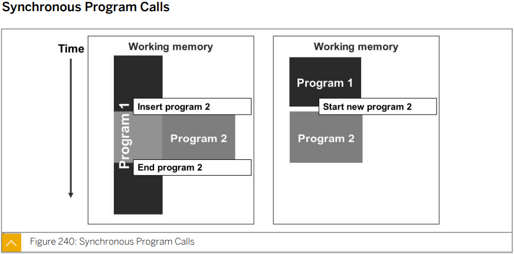
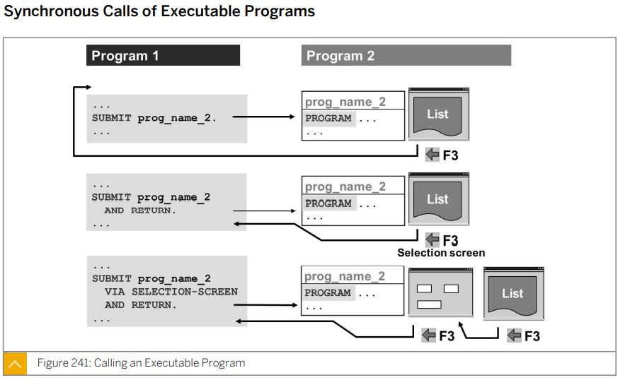
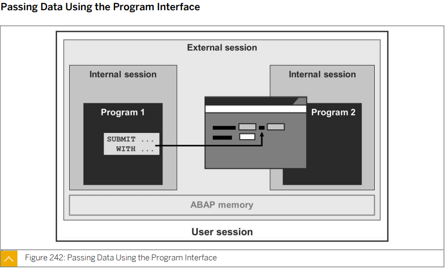
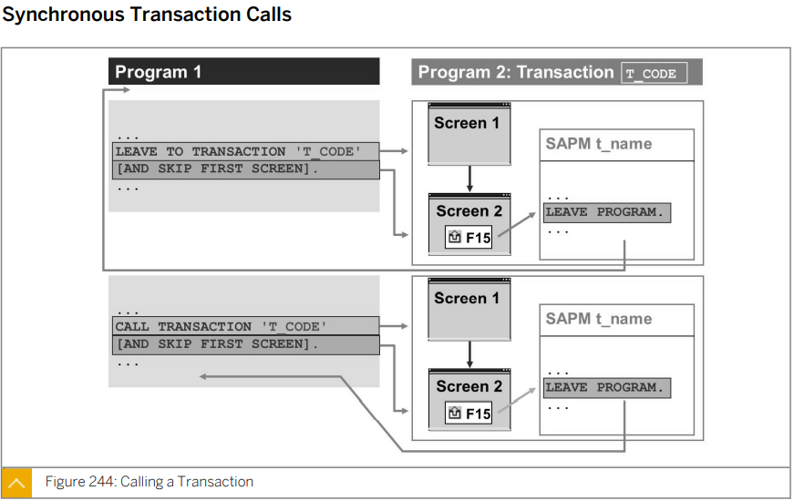
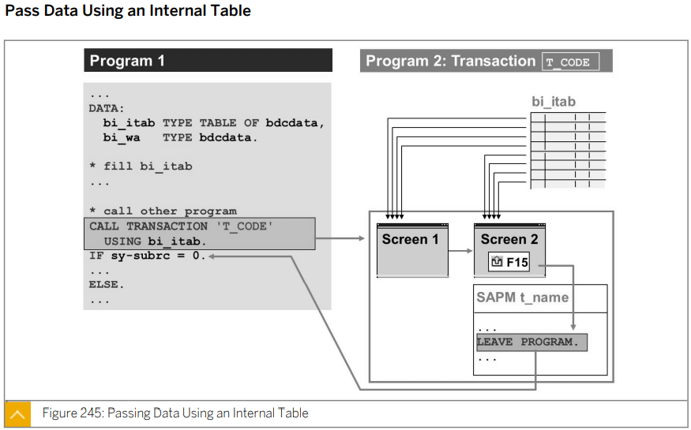
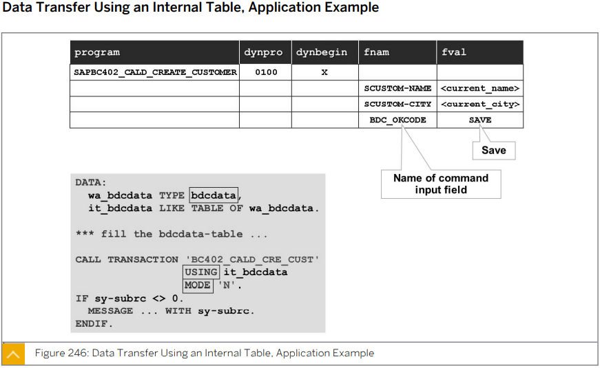

# Unit 15. Program calls and Memory Management


# Lesson1 Calling Programs Synchronously


* ## Program Call

  Program ---> Call ---> Other Program

  * ### 동기 방식 (Synchronous Call)

    #### P1에서 P2를 호출하면 P2로 넘어가 P2가 끝나면 P1이 이어서 돌아감

    

  * ### 비동기 방식 (Asynchronous Call)

    #### P1이 P2 가 끝날 때 까지 기다리는 것이 아니라 동시에 진행


* ## Synchronous Calls of Executable Programs

  

  ```ABAP
  SUBMIT <OTHER REPORT>
  
  SUBMIT <OTHER REPORT>
    AND RETURN.
    
  SUBMIT <OTHER REPORT>
    VIA SELECTION-SCREEN  "B와의 차이는  100 번 화면을 거치는가의 차이
    AND RETURN
  ```

  

* ## Passing Data Using the Program Interface

  

  호출할 프로그램에 parameter의 입력값을 던져줄때 사용

  ```ABAP
  *&---------------------------------------------------------------------*
  *& Report ZB23_00019
  *&---------------------------------------------------------------------*
  *&
  *&---------------------------------------------------------------------*
  REPORT zb23_00019.
  
  PARAMETERS: p_land TYPE sgeocity-country.
  
  SUBMIT sapbc402_tabd_hashed
    WITH pa_ctry = p_land
    AND RETURN.
  
  
  WRITE: 'I am Caller!'.
  ```

  


* ## Synchronous Transaction Calls

  

  ```ABAP
  CALL TRANSACTION <TCODE>.
  
  LEAVE TO TRANSACTION <TCODE>.
  ```

  

  ```ABAP
  *&---------------------------------------------------------------------*
  *& Report ZB23_00020
  *&---------------------------------------------------------------------*
  *&
  *&---------------------------------------------------------------------*
  REPORT zb23_00020.
  
  PARAMETERS p_tcode TYPE tstc-tcode.
  
  CALL TRANSACTION p_tcode.
  
  WRITE: 'i an caller'.
  ```

  


* ## Pass Data Using an Internal Table

  

  ##### The fields in the global type BDCDATA are as follows:

  |      |      |      |      |
  | ---- | ---- | ---- | ---- |
  |      |      |      |      |
  |      |      |      |      |
  |      |      |      |      |
  |      |      |      |      |
  |      |      |      |      |
  |      |      |      |      |

  

  BCD Program (Batch Data Communiation)

  * Internal Table :타입: BDCDATA

    > 컬럼 5개로 구성


# Lesson 2. Describing the ABAP Runtime and Memory Management

# SKIP