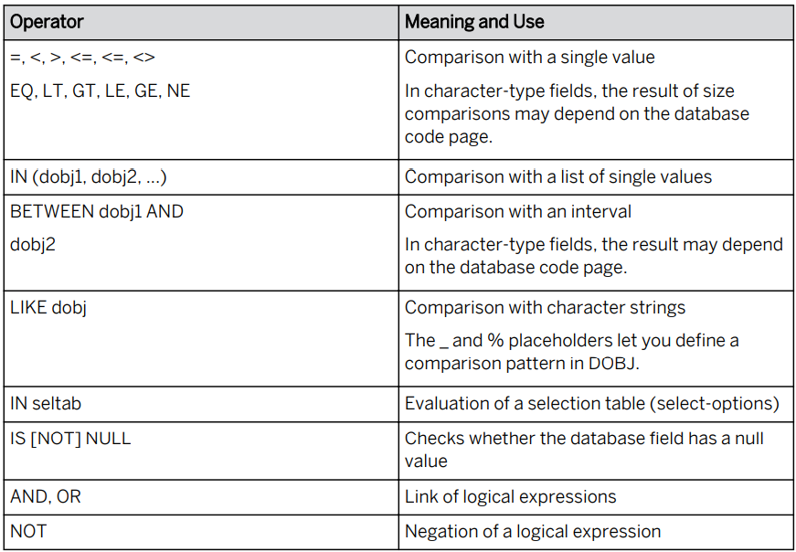

# Unit 16. ABAP Open SQL


# Lesson 1. Processing and Aggregating Datasets on the Database


* ## Ordered Datasets

  ```ABAP
  SELECT * 
  	FROM ___ INTO ___ WHERE ___
      ORDER BY PRIMARY KEY.
      
  SELECT * 
  	FROM ___ INTO ___ WHERE ___
      ORDER BY <COLUMN> <COLUMN>.
      
  SELECT * 
  	FROM ___ INTO ___ WHERE ___
      ORDER BY <COLUMN> DESCENDING <COLUMN> ASCENDING.
  ```


* ## Condensed Datasets

  ```ABAP
  SELECT DISTINCT carrid connid
  	FROM ___ INTO ___ WHERE ___
      ORDER BY <COLUMN> DESCENDING <COLUMN> ASCENDING.
  ```

  #### DISTINCT 뒤에 있는 것들이 모두 중복인 데이터들을 삭제하고 SELECT

  ```ABAP
  *&---------------------------------------------------------------------*
  *& Report ZB23_00022
  *&---------------------------------------------------------------------*
  *&
  *&---------------------------------------------------------------------*
  REPORT zb23_00022.
  
  
  DATA gt_itab TYPE TABLE OF spfli.
  
  SELECT DISTINCT carrid
         INTO CORRESPONDING FIELDS OF TABLE gt_itab
         FROM spfli.
  
  cl_demo_output=>display_data( gt_itab ).
  ```

  

  

* ## Aggregate Expressions

  | Function | Meaning of Result and Conditions | Data Type of Result |
  | -------- | -------------------------------- | ------------------- |
  | MIN(col) |                                  |                     |
  | MAX      |                                  |                     |
  | SUM      |                                  |                     |
  | AVG      |                                  |                     |
  | COUNT    |                                  |                     |

  

* ## Field Lists with Aggregate Expressions and Field Names

  group by

  

  

* ## Having addition

  Aggregation 한 결과의 제약


select

into

from

where

group by

having 

order by


# Lesson 2. Implementing Complex WHERE Conditions and Special INTO Clauses


* ## Operators in WHERE Conditions

  

  ```ABAP
  *&---------------------------------------------------------------------*
  *& Report ZB23_00023
  *&---------------------------------------------------------------------*
  *&
  *&---------------------------------------------------------------------*
  REPORT zb23_00023.
  
  DATA it TYPE TABLE OF scarr.
  DATA lv_where TYPE string.
  
  PARAMETERS p_name TYPE c LENGTH 20 LOWER CASE.			"*****소문자 허용
  
  * 검색조건에서 입력한 단어가 들어간 모든 항공사 취득 하기.
  CONCATENATE '%' p_name '%' INTO lv_where.				"*****중요!!!!
  
  SELECT *
    INTO TABLE it
    FROM scarr
    WHERE carrname LIKE lv_where.
  
  
  cl_demo_output=>display_data(  it ).
  ```

  

  


* ## Target Areas for INTO Clause

  

  

  

  거의 쓸일 없다.

  

  거의 쓸일 없다.


# Lesson 3. Selecting Data from Multiple Database Tables


사용하지 않는 방법


* ## New Open SQL

  * ### New Open SQL (가급적 사용 X) 

    * 모든 변수 앞에 @를 붙여야 함

    * 컬럼과 컬럼 사이는 ','로 구분

  ```ABAP
  *&---------------------------------------------------------------------*
  *& Report ZB23_00024
  *&---------------------------------------------------------------------*
  *&
  *&---------------------------------------------------------------------*
  REPORT zb23_00024.
  
  DATA it TYPE TABLE OF scarr.
  
  PARAMETERS: p_cur TYPE scarr-currcode.
  
  SELECT carrid carrname
    INTO CORRESPONDING FIELDS OF TABLE it
    FROM scarr
    WHERE currcode = p_cur.
  
  
  * New Open SQL (가급적 사용 X)
  
  * 모든 변수 앞에 @를 붙여야 함
  * 컬럼과 컬럼 사이는 ','로 구분.
  
  SELECT carrid, carrname
    INTO CORRESPONDING FIELDS OF TABLE @it
    FROM scarr
    WHERE currcode = @p_cur.
  ```

  


# 부록

* ## LOWER CASE

  PARAMETERS 문 뒤에 LOWER CASE 입력시 입력 값에 소문자를 허용해 준다.

  ```ABAP
  PARAMETERS p_name TYPE c LENGTH 20 LOWER CASE.		
  ```

  