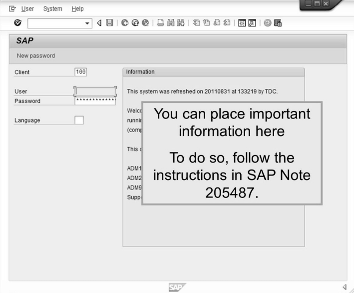
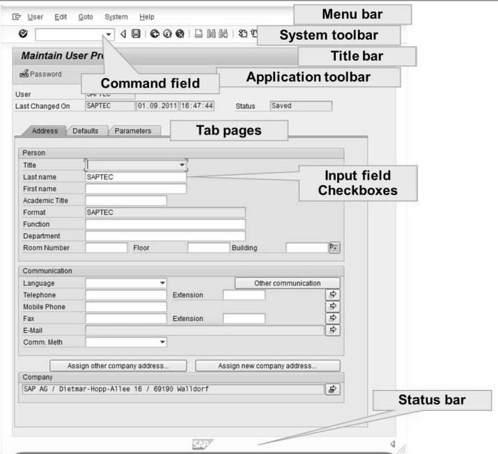

# Unit 3 Navigation Basics

## Lesson1 Navigating with SAP Graphical User Interface(GUI) for Windows in AS ABAP Systems

login을 할때 클라이언트를 지정해 줌으로 써 다양한 용도, 기업의 분리 국가의 분리 등의 기능을 수행 할 수 있다.

* ## Command Field

  * ### /n 

    기본은 **Easy Access Menu 화면**으로 이동한다.

    뒤에 다른 명령이 붙을 경우 현재의 윈도우에서 프로그램 실행을 의미

    **Easy Access Menu 화면** 에서는 /n없이 명령어만으로 수행 가능하다.

    * #### se09

      : **Transport Organizer**

    * #### se11

      : **ABAP Dictionary : Initial Screen**

    * #### se24

      : **Class Builder**

    * #### se37

      : **Function Builder**

    * #### se41

      : **Menu Painter**

    * #### se38

      : **ABAP Editor**

    * #### se51

      : **Screen Painter**
  
    * #### se80
  
      : **object navigator**
  
    * #### se84
  
      : **Object Navigator**
  
    
  
    * #### sm04
  
      : **user Sessions for AS Instance** 사용자들의 접속을 볼 수 있다.
  
    * #### sm50
  
      : **Work Processes of Instance**
  
    * #### sm59
  
      : **Configuration of RFC Connections** RFC의 connection을 확인 할 수 있다.
  
    * #### bapi
  
      : **BAPI Explorer** 여러 BAPI들을 탐색할 수 있다.
  
    
  
    
  
    * #### end
  
      : log-off 의사를 묻는 컨펌팝업이 뜬다.
  
    * #### nex
  
      : 컨펌팝업 없이 log-off
  
  * ### /i 
  
    창닫기
  
  * ### /o 
  
    창관리 or 새로운 창

* ### Maintain User Profile

  * Menubar => system => user profile => user data
  * 칸을 클릭 후 f1을 통해 해당 input field에 들어갈 나타내는 정보가 무엇인지 볼 수 있다.
    * technical information을 통해 어떻게 작동 되는지를 볼 수 있으며 program name의 프로그램을 클릭하여 해당 프로그램으로 갈 수 있다.
  * f4를 통해 해당 input field에 입력할 수 있는 정보를 볼 수 있다.

